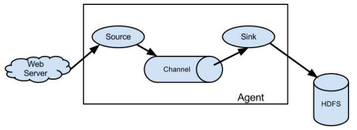
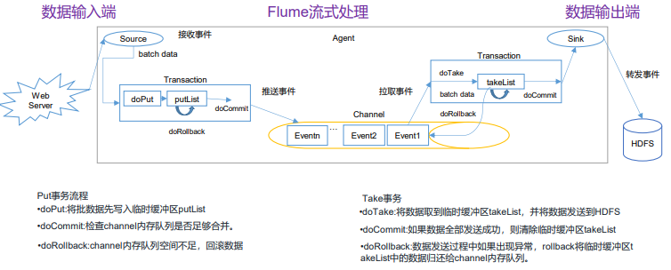
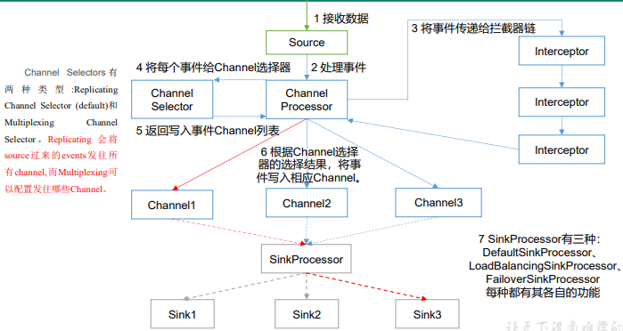
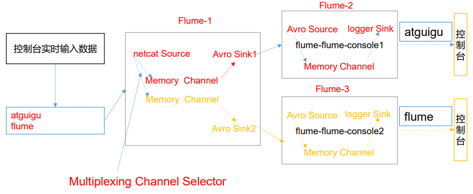

> 简单介绍下Flume日志采集系统，内容不多大概一天就学完了，但是正所谓学得快忘得也快，所以把其中一些常用的、配置类的内容进行一个记录，方便每次温习。

## 第一章 Flume概述

#### 1、定义

Flume 是 Cloudera 提供的一个高可用的，高可靠的，分布式的海量日志采集、聚合和传输的系统。Flume 基于流式架构，灵活简单。

#### 2、基础架构



###### （1）Agent

Agent 是一个 JVM 进程，它以事件的形式将数据从源头送至目的。 Agent 主要有 3 个部分组成，Source、Channel、Sink。

###### （2）Source

Source 是负责接收数据到 Flume Agent 的组件。Source 组件可以处理各种类型、各种 格式的日志数据，包括 **avro**、thrift、**exec**、jms、**spooling directory、netcat、taildir**、 sequence generator、syslog、http、legacy。

> Arvo是一种数据序列化系统，它是流式处理领域中常用的数据序列化系统之一。它支持多种编程语言，包括Java、Python、C、C++和C#等。Avro格式的数据是二进制的，它可以在不同的平台和语言之间进行交换。Avro格式的数据可以存储在Apache Kafka中，也可以存储在Hadoop中。
>
> Avro格式的数据有以下优点：
> - 支持二进制序列化方式，可以便捷、快速地处理大量数据。
> - 动态语言友好，Avro提供的机制使动态语言可以方便地处理Avro数据。
> - 可排序的，这使得Avro格式的数据可以更容易地进行排序操作。
> - 可扩展性强，Avro格式的数据可以很容易地进行扩展，而不需要修改现有的数据结构。
>

###### （3）Sink

Sink 不断地轮询 Channel 中的事件且批量地移除它们，并将这些事件批量写入到存储或索引系统、或者被发送到另一个 Flume Agent。

Sink 组件目的地包括 **hdfs、logger、avro**、thrift、ipc、**file、HBase**、solr、自定义。

###### （4）Channnel

Channel 是位于 Source 和 Sink 之间的缓冲区。因此，Channel 允许 Source 和 Sink 运作在不同的速率上。Channel 是线程安全的，可以同时处理几个 Source 的写入操作和几个 Sink 的读取操作。 Flume 自带两种 Channel：Memory Channel 和 File Channel。 

- Memory Channel 是内存中的队列。Memory Channel 在不需要关心数据丢失的情景下适 用。如果需要关心数据丢失，那么 Memory Channel 就不应该使用，因为程序死亡、机器宕 机或者重启都会导致数据丢失。 
- File Channel 将所有事件写到磁盘。因此在程序关闭或机器宕机的情况下不会丢失数据。

###### （5）Event

传输单元，Flume 数据传输的基本单元，以 Event 的形式将数据从源头送至目的地。 Event 由 Header 和 Body 两部分组成，Header 用来存放该 event 的一些属性，为 K-V 结构， Body 用来存放该条数据，形式为字节数组。

------


## 第二章 Flume入门

#### 1、案例一

> 从官方案例入手，详解Flume配置文件的构成。
>
> 需求分析：
>
> - 通过netcat工具向本机的44444端口发送数据
> - Flume监控本机的44444端口，通过Flume的source端读取数据
> - Flume将获取的数据通过Sink端打印到控制台

###### （1）配置文件

```shell
# Name the components on this agent
a1.sources = r1
a1.sinks = k1
a1.channels = c1

# Describe/configure the source
a1.sources.r1.type = netcat
a1.sources.r1.bind = localhost
a1.sources.r1.port = 44444

# Describe the sink
a1.sinks.k1.type = logger

# Use a channel which buffers events in memory
a1.channels.c1.type = memory
a1.channels.c1.capacity = 1000
a1.channels.c1.transactionCapacity = 100

# Bind the source and sink to the channel
a1.sources.r1.channels = c1
a1.sinks.k1.channel = c1
```

> 我们将配置文件分为5个部分：
>
> （1）配置命名：a1表示agent的名字；r1表示a1的source的名字，因为可以命名多个，所以这里是sources；k1是sink的名字，同理可以一次命名多个；c1是channel的名字。
>
> （2）配置source：source用做接收输入数据，所以首先配置的是输入数据来源type，其他配置则根据官方文档中的黑体进行配置，比如这里来源是netcat，需要配置监听主机和端口号。
>
> （3）配置sink：sink用作输出数据，同样首先需要配置输出源type，其他配置同上，这里是输出到控制台所以没有其他配置。
>
> （4）配置channel：配置channel的类型，主要为第一章说的memory内存型和file文件型；capacity和transactionCapacity代表event的总容量和单个事务的容量，transactionCapacity不能大于capacity否则事务回滚是无效的。
>
> （5）绑定：将配置好的source和sink与channel进行绑定。其中：一个source可以输出到多个channel，但是一个sink只能接收一个channel的数据（但是一个channel可以将数据分发给不同的sink，需要建组实现）

###### （2）启动代码

```shell
# flume主目录下
# 写法一：
bin/flume-ng agent --conf conf/ --name a1 --conf-file job/flume-netcat-logger.conf -Dflume.root.logger=INFO,console
# 写法二：
bin/flume-ng agent -c conf/ -n a1 -f job/flume-netcat-logger.conf -Dflume.root.logger=INFO,console
```

参数说明：

 --conf/-c：表示配置文件存储在 conf/目录 

--name/-n：表示给 agent 起名为 a1 

--conf-file/-f：flume 本次启动读取的配置文件是在 job 文件夹下的 flume-telnet.conf 文件。 

-Dflume.root.logger=INFO,console ：-D 表示 flume 运行时动态修改 flume.root.logger 参数属性值，并将控制台日志打印级别设置为 INFO 级别。日志级别包括:log、info、warn、 error。


#### 2、案例二

> **使用 Flume 监听整个目录的文件，并上传至 HDFS**
>
> 需求分析：
>
> - 向指定目录中添加文件
> - 查看HDFS 上数据
> - 查看/opt/module/flume/upload 目录中上传的文件是否已经标记 为.COMPLETED结尾；.tmp后缀 结尾文件没有上传。

###### （1）配置文件

```shell
a3.sources = r3
a3.sinks = k3
a3.channels = c3

# Describe/configure the source
a3.sources.r3.type = spooldir
a3.sources.r3.spoolDir = /opt/module/flume/upload
a3.sources.r3.fileSuffix = .COMPLETED
a3.sources.r3.fileHeader = true

#忽略所有以.tmp 结尾的文件，不上传
a3.sources.r3.ignorePattern = ([^ ]*\.tmp)
# Describe the sink
a3.sinks.k3.type = hdfs
a3.sinks.k3.hdfs.path = hdfs://hadoop102:9820/flume/upload/%Y%m%d/%H
#上传文件的前缀
a3.sinks.k3.hdfs.filePrefix = upload-
#是否按照时间滚动文件夹
a3.sinks.k3.hdfs.round = true
#多少时间单位创建一个新的文件夹
a3.sinks.k3.hdfs.roundValue = 1
#重新定义时间单位
a3.sinks.k3.hdfs.roundUnit = hour
#是否使用本地时间戳
a3.sinks.k3.hdfs.useLocalTimeStamp = true
#积攒多少个 Event 才 flush 到 HDFS 一次
a3.sinks.k3.hdfs.batchSize = 100
#设置文件类型，可支持压缩
a3.sinks.k3.hdfs.fileType = DataStream
#多久生成一个新的文件
a3.sinks.k3.hdfs.rollInterval = 60
#设置每个文件的滚动大小大概是 128M
a3.sinks.k3.hdfs.rollSize = 134217700
#文件的滚动与 Event 数量无关
a3.sinks.k3.hdfs.rollCount = 0

# Use a channel which buffers events in memory
a3.channels.c3.type = memory
a3.channels.c3.capacity = 1000
a3.channels.c3.transactionCapacity = 100

# Bind the source and sink to the channel
a3.sources.r3.channels = c3
a3.sinks.k3.channel = c3
```

**说明：**在使用 Spooling Directory Source 时，不要在监控目录中创建并持续修改文 件；上传完成的文件会以.COMPLETED 结尾；被监控文件夹每 500 毫秒扫描一次文件变动。


#### 3、案例三

> 使用 Flume 监听整个目录的实时追加文件，并上传至 HDFS
>
> 需求分析：
>
> - 向监控文件追加内容 echo hello >> files/file1.txt 、 echo hello >> files/file2.txt
> - 查看HDFS 上数据

Exec source 适用于监控一个实时追加的文件，不能实现断点续传；Spooldir Source 适合用于同步新文件，但不适合对实时追加日志的文件进行监听并同步；而 Taildir Source 适合用于监听多个实时追加的文件，并且能够实现断点续传。

```shell
# 主要修改为source部分，故只记录source部分配置
# Describe/configure the source
a3.sources.r3.type = TAILDIR
a3.sources.r3.positionFile = /opt/module/flume/tail_dir.json
a3.sources.r3.filegroups = f1 f2
a3.sources.r3.filegroups.f1 = /opt/module/flume/files/.*file.*
a3.sources.r3.filegroups.f2 = /opt/module/flume/files2/.*log.*
```

**说明：**.*类似于通配符（占位符），代表可以有0~任意个字符在占位。

Taildir Source 维护了一个 json 格式的 position File，其会定期的往 position File 中更新每个文件读取到的最新的位置，因此能够实现断点续传。

------


## 第三章 Flume进阶

#### 1、事务



Flume的事务有put和take机制，两者保证数据传输的准确性。Put事务是指从Source到Channel，Take事务是指从Channel到Sink。¹²³

Put事务流程如下：
- 将数据从source写入临时缓冲区putList。
- 检查Channel内存队列是否足够合并。
- 如果内存队列空间不足，则回滚数据。

Take事务流程如下：

- sink不断从channel中拉取event，没拉取一个event，这个event会先放入takeList中。
- 当一个batchSize的event全部拉取到takeList中之后，此时由sink执行写出处理。
- 假如在写出过程中，发送了异常，此时执行回滚。
- 将takeList中所有的event全部回滚到channel。

> **Put事务**开始的时候会调用一个doPut方法，doPut方法的会将这批数据batch data，也就是一批event放到putList中。（doPut传递的数据的大小可以通过参数bathchSize配置。putList的大小则通过channel的参数transactionCapacity进行配置。）
>
> 当数据成功存放到putList之后，调用doCommit()方法,putList中所有的event进入channel()中，
>
> - 成功则清空putList.
>
> - 不成功的情况
>
>   - 从putList传输到channel过程出问题，在doCommit提交之后，事务在向channel放的过程中，遇到问题。例如：sink那边取数据速度要比Source这边放数据速度慢，导致channel中的数据积压，这个时候就会造成putList中的数据放不进去。这时会进行事务的回滚操作，调用doRollback方法，doRollback方法会做两个事情：
>1、清空putList中的数据； 
>     2、抛出channelException异常。
> 
>     **当source捕捉到doRollback抛出的异常，就会把刚才的一批数据重新采集一下，采集完之后重新走事务的流程。**
>
>   - 在数据采集的过程中也有可能出现问题，同样是调用doRollback方法来对事务进行回滚。

> **Take事务**开始时，调用doTake方法,将channel中的event提取到(剪切)takeList中，如果后面的sink是HDFS Sink，同时在写入HDFS的IO缓冲流中放一份event。
>
> 当takeList中存放的Event达到约定数量(batchSize) ，就会调用doCommit方法：
>
> - 成功执行情况下：如果是HDFS Sink，那么手动调用IO流的flush方法，将IO流缓冲区的数据写入到HDFS磁盘中，同时清空takeList中的数据
>
> - 失败情况下:
>
>   - 1.网络延迟等原因导致传输数据失败：调用doRollback方法来进行回滚，takeList中还有备份数据，所以**将takeList中的数据原封不动地还给channel，这时候就完成了事务的回滚**。
>
>   - 2.如果takeList数据有一部分传输成功了，剩下的因为网络延迟传输失败了：同样会调用doRollback方法来进行回滚，它会把整个takeList中的数据返回给channel，然后继续进行数据的读写。如此一来，**再次进行事务时候，就会存在数据重复的可能。**

总结来说就是：Put事务会在回滚的时候丢弃原本采集到的数据并进行重新采集；Take事务会将sink中已经拿到的event组成逆序队列还给channel，如果出现写了一半的情况，会将一整个全部还给channel，这样会导致数据可能重复。


#### 2、Agent内部原理



**重要组件：**  

- ChannelSelector  
  - ChannelSelector 的作用就是选出 Event 将要被发往哪个 Channel。其共有两种类型， 分别是 Replicating（复制）和 Multiplexing（多路复用）。 
  - ReplicatingSelector 会将同一个 Event 发往所有的 Channel，Multiplexing 会根据相 应的原则，将不同的 Event 发往不同的 Channel。 
- SinkProcessor  
  - SinkProcessor 共 有 三 种 类 型 ， 分 别 是 DefaultSinkProcessor （默认）、 LoadBalancingSinkProcessor（负载均衡） 和 FailoverSinkProcessor （故障转移）
  - DefaultSinkProcessor 对 应 的 是 单 个 的 Sink ， LoadBalancingSinkProcessor 和 FailoverSinkProcessor 对应的是 Sink Group，LoadBalancingSinkProcessor 可以实现负 载均衡的功能，FailoverSinkProcessor 可以错误恢复的功能。

> 完整的Flume Agent流程并不止有Source、Channel、Sink三个部分，正确的流程包括：
>
> - Source读取数据并发送给Channel Processor
> - Channel Processor将数据发给Channel Interceptor进行（条件）过滤，过滤完回到Channel Processor
> - Channel Processor将数据交给Channel Selector，按条件分发到各个Channel上
> - 各个Channel上的数据由SinkProcessor进行汇总，并确定分发到不同的Sink


#### 3、详解ChannelSelector复制

使用 Flume-1 监控文件变动，Flume-1 将变动内容传递给 Flume-2，Flume-2 负责存储 到 HDFS。同时 Flume-1 将变动内容传递给 Flume-3，Flume-3 负责输出到 Local  FileSystem。**实现单数据源多出口。**

```shell
# 主要代码（Flume-1）
# Name the components on this agent
a1.sources = r1
a1.sinks = k1 k2
a1.channels = c1 c2
# 将数据流复制给所有 channel
a1.sources.r1.selector.type = replicating  # 区别只在于对selector的类型进行了设置

# Describe/configure the source
a1.sources.r1.type = exec
a1.sources.r1.command = tail -F /opt/module/hive/logs/hive.log
a1.sources.r1.shell = /bin/bash -c

# Describe the sink
# sink 端的 avro 是一个数据发送者
a1.sinks.k1.type = avro
a1.sinks.k1.hostname = hadoop102
a1.sinks.k1.port = 4141
a1.sinks.k2.type = avro
a1.sinks.k2.hostname = hadoop102
a1.sinks.k2.port = 4142

# Describe the channel
a1.channels.c1.type = memory
a1.channels.c1.capacity = 1000
a1.channels.c1.transactionCapacity = 100
a1.channels.c2.type = memory
a1.channels.c2.capacity = 1000
a1.channels.c2.transactionCapacity = 100

# Bind the source and sink to the channel
a1.sources.r1.channels = c1 c2
a1.sinks.k1.channel = c1
a1.sinks.k2.channel = c2
```


#### 4、详解SinkProcessor故障转移

使用 Flume1 监控一个端口，其 sink 组中的 sink 分别对接 Flume2 和 Flume3，采用 FailoverSinkProcessor，实现故障转移的功能。

```shell
# 主要代码（Flume1）
# Name the components on this agent
a1.sources = r1
a1.channels = c1
a1.sinkgroups = g1
a1.sinks = k1 k2

# Describe/configure the source
a1.sources.r1.type = netcat
a1.sources.r1.bind = localhost
a1.sources.r1.port = 44444
a1.sinkgroups.g1.processor.type = failover  # 主要区别在于采用processor类型
a1.sinkgroups.g1.processor.priority.k1 = 5  # 设置优先级实现动态调整（负载均衡也可）
a1.sinkgroups.g1.processor.priority.k2 = 10
a1.sinkgroups.g1.processor.maxpenalty = 10000

# Describe the sink
a1.sinks.k1.type = avro
a1.sinks.k1.hostname = hadoop102
a1.sinks.k1.port = 4141
a1.sinks.k2.type = avro
a1.sinks.k2.hostname = hadoop102
a1.sinks.k2.port = 4142

# Describe the channel
a1.channels.c1.type = memory
a1.channels.c1.capacity = 1000
a1.channels.c1.transactionCapacity = 100

# Bind the source and sink to the channel
a1.sources.r1.channels = c1
a1.sinkgroups.g1.sinks = k1 k2
a1.sinks.k1.channel = c1
a1.sinks.k2.channel = c1
```


#### 5、自定义Interceptor

在实际的开发中，一台服务器产生的日志类型可能有很多种，不同类型的日志可能需要发送到不同的分析系统。此时会用到 Flume 拓扑结构中的 Multiplexing 结构，Multiplexing 的原理是，根据 event 中 Header 的某个 key 的值，将不同的 event 发送到不同的 Channel中，所以我们需要自定义一个 Interceptor，为不同类型的 event 的 Header 中的 key 赋予不同的值。 在该案例中，我们以端口数据模拟日志，以是否包含”atguigu”模拟不同类型的日志， 我们需要自定义 interceptor 区分数据中是否包含”atguigu”，将其分别发往不同的分析系统（Channel）。



###### （1）自定义Jar包拦截文件

```java
import org.apache.flume.Context;
import org.apache.flume.Event;
import org.apache.flume.interceptor.Interceptor;
import java.util.ArrayList;
import java.util.List;
import java.util.Map;

public class TypeInterceptor implements Interceptor {
     //声明一个存放事件的集合
     private List<Event> addHeaderEvents;
     @Override
     public void initialize() {
     	//初始化存放事件的集合
     	addHeaderEvents = new ArrayList<>();
     }
    
     //单个事件拦截
     @Override
     public Event intercept(Event event) {
     	//1.获取事件中的头信息
     	Map<String, String> headers = event.getHeaders();
     	//2.获取事件中的 body 信息
     	String body = new String(event.getBody());
     	//3.根据 body 中是否有"atguigu"来决定添加怎样的头信息
     	if (body.contains("atguigu")) {
     		//4.添加头信息
     		headers.put("type", "first");
     	} else {
     		//4.添加头信息
     		headers.put("type", "second");
     	}
     	return event;
     }
     
    //批量事件拦截
     @Override
     public List<Event> intercept(List<Event> events) {
     	//1.清空集合
     	addHeaderEvents.clear();
     	//2.遍历 events
     	for (Event event : events) {
     		//3.给每一个事件添加头信息
     		addHeaderEvents.add(intercept(event));
     	}
     	//4.返回结果
     	return addHeaderEvents;
     }
    
     @Override
     public void close() {}
    
     // 创建构造方法
     public static class Builder implements Interceptor.Builder {
         @Override
     	public Interceptor build() {
     		return new TypeInterceptor();
     	}
     	@Override
     		public void configure(Context context) {
     	}
     }
}
```

###### （2）配置文件

```shell
# 主要变动在source中（从source到channel进行拦截处理数据），所以主要展示source代码
# Describe/configure the source
a1.sources.r1.type = netcat
a1.sources.r1.bind = localhost
a1.sources.r1.port = 44444
# 给拦截器命名
a1.sources.r1.interceptors = i1
# 调用lib中的拦截器，找到构造方法
a1.sources.r1.interceptors.i1.type = com.atguigu.flume.interceptor.CustomInterceptor$Builder
# 使用多路复用方法进行过滤
a1.sources.r1.selector.type = multiplexing
# 找到名为type的过滤头
a1.sources.r1.selector.header = type
# type为first走channel c1
a1.sources.r1.selector.mapping.first = c1
# type为second走channel c2
a1.sources.r1.selector.mapping.second = c2
```


**自定义Source和自定义Sink在学生阶段用得并不多（因为大部分数据源是固定的比如HDFS等），并不需要自定义数据源，所以这里暂不记录。同时，目前阶段对于数据流监控并没有实际的应用，因此对于使用Ganglia等软件进行Flume数据监控的方式不做详解。**

------


## 第四章 常见面试题

#### 1、Flume 参数调优 

###### （1）Source  

增加 Source 个数（使用 Tair Dir Source 时可增加 FileGroups 个数）可以增大 Source 的读取数据的能力。例如：当某一个目录产生的文件过多时需要将这个文件目录拆分成多个 文件目录，同时配置好多个 Source 以保证 Source 有足够的能力获取到新产生的数据。

batchSize 参数决定 Source 一次批量运输到 Channel 的 event 条数，适当调大这个参数可以提高 Source 搬运 Event 到 Channel 时的性能。 

###### （2）Channel  

type 选择 memory 时 Channel 的性能最好，但是如果 Flume 进程意外挂掉可能会丢失数据。type 选择 file 时 Channel 的容错性更好，但是性能上会比 memory channel 差。 使用 file Channel 时 dataDirs 配置多个不同盘下的目录可以提高性能。 

Capacity 参数决定 Channel 可容纳最大的 event 条数。transactionCapacity 参数决定每次 Source 往 channel 里面写的最大 event 条数和每次 Sink 从 channel 里面读的最大 event 条数。**transactionCapacity 需要大于 Source 和 Sink 的 batchSize 参数。** 

###### （3）Sink  

增加 Sink 的个数可以增加 Sink 消费 event 的能力。Sink 也不是越多越好够用就行，过多的 Sink 会占用系统资源，造成系统资源不必要的浪费。 

batchSize 参数决定 Sink 一次批量从 Channel 读取的 event 条数，适当调大这个参数 可以提高 Sink 从 Channel 搬出 event 的性能。 


#### 2、Flume 的事务机制 

Flume 的事务机制（类似数据库的事务机制）：**Flume 使用两个独立的事务分别负责从 Soucrce 到 Channel，以及从 Channel 到 Sink 的事件传递。** 比如 spooling directory source 为文件的每一行创建一个事件，一旦事务中所有的 事件全部传递到 Channel 且提交成功，那么 Soucrce 就将该文件标记为完成。 

同理，事务以类似的方式处理从 Channel 到 Sink 的传递过程，如果因为某种原因使得 事件无法记录，那么事务将会回滚。且所有的事件都会保持到 Channel 中，等待重新传递。 


#### 3、Flume 采集数据会丢失吗? 

根据 Flume 的架构原理，Flume 是不可能丢失数据的，其内部有完善的事务机制， Source 到 Channel 是事务性的，Channel 到 Sink 是事务性的，因此这两个环节不会出现数据的丢失，唯一可能丢失数据的情况是 Channel 采用 memoryChannel，agent 宕机导致数据丢失，或者 Channel 存储数据已满，导致 Source 不再写入，未写入的数据丢失。 

**Flume 不会丢失数据，但是有可能造成数据的重复，例如数据已经成功由 Sink 发出， 但是没有接收到响应，Sink 会再次发送数据，此时可能会导致数据的重复。**

