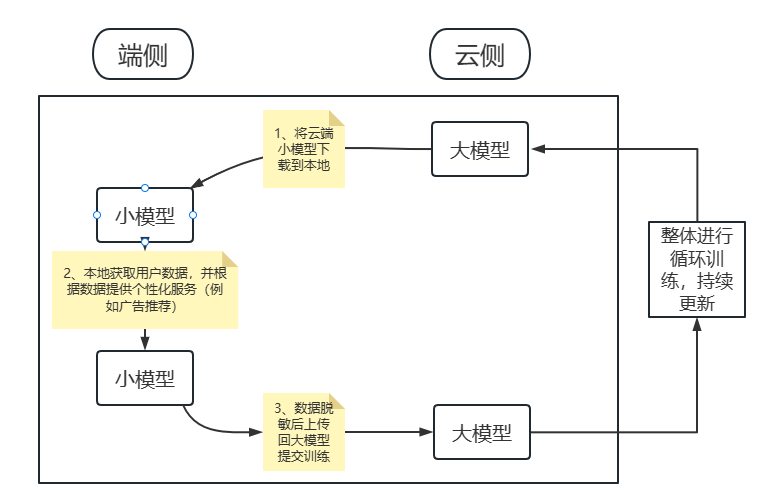

# IEEE参会学习感悟

这两天参加了 ***The 10th IEEE International Conference on Cyber Security and Cloud Computing(IEEE CSCloud 2023) & The 9th IEEE International Conference on Edge Computing and Scalable Cloud(IEEE EdgeCom 2023)*** 会议，简称为第十届 IEEE 网络安全与云计算国际会议和第九届 IEEE 边缘计算和可扩展云国际会议。当然不是作为优秀代表或是什么杰出学者参会，而是作为背景板有幸聆听了一些前沿技术。

说来惭愧，一开始还是很认真听得，但是后来就有些力不从心啦，毕竟水平和见识还远远赶不上这些专家，所以记录下我认真听得这几位教授的发言，为我的未来提供一丝可能性。

印象最深的就是第一位来自**华中科技大学的讲者金海**老师，他主讲：**基于数据流的图计算加速器**。下面是我对他讲解的一些个人理解和解读（不一定正确，留给未来的我评判）。

首先是大数据时代数据的存储模式，在我大学的学习中，已经初步了解到数据存储到数据库中大体上就是本来的形式（转码/加密实际上也是数据本来的形式），学习大数据后发现NoSQL更倾向于存储非结构化的数据，其中以Redis为主将数据转换器为文档、KV结构存储为时下最热门的方式。但是这也并非是当下最优的存储结构，因为即使是KV数据都要求数据间有一定相关性（计数的KV不是此处我所说的），事实上海量数据中大部分数据可能并无直接关联，而是形成一个数据集后才能有直接关联。举个简单的例子：CPU和贵州并没有直接关联，但是当CPU和其他数据集合成数据中心的整体，就能和贵州有关联了。在传统的数据库或是KV的NoSQL上其实也能做到数据不关联、数据集关联，但我认为其中最大的区别就是“可复用性”，该样式的数据集只能整块关联，如果存在缺少或是冗余的字段，那么可能效率就不如新建一个数据集了。

这时候就引入了金海教授所说的：**将大数据抽象成图计算**。每个数据集就是一块图，可以不用考虑数据在图中的分布，也无需关联的图完全交叠。同时还可以讲完整的计算流程抽象成图结构，类似于函数，只在意结果而不在意过程实现。那么这么看来，图计算、图存储确实可能会是大数据不久的未来。不过金海教授的图和常规的图不一样，从他的讲解中，传统图在理想情况下是稠密数据，但是实际上是稀疏的，访问随机且无序。他们团队的设计架构就是为了解决传统图的问题，提高计算密集性和计算效率。

在此之前首先讲讲控制流的发展再来对比数据流的优势。从计算机的体系结构设计就离不开控制流，我们都知道计算机中有程序计数器无论是CPU、GPU实际上都是异步工作的，但是海量数据处理不可避免出现同步计算的情况，如果两个数据具有一定相关性，那么一定需要等到被关联的一方计算完成后才能计算关联方。上段没讲到的图的最大优势就在这里：降低了数据集之间的依赖关系，使得不需要一个数据集计算完才能进行下一步，多个图之间可以同步计算。那么回到控制流上来，控制流并没有利用上图的这种优势，依序执行的底层使得解决同步开销问题会特别麻烦，那么在现在大模型时代，真正的同步就需要不断的加入CPU、GPU、DPU等硬件支持，超过一定规模后这显然是不划算的。

再简单介绍下控制流的发展：在早期图计算中IBM使用CPU、Japan CREST使用CPU、NVIDIA使用GPU、中科睿芯ICT SmarCO－2使用的是DPU－m；当下比较热门的是Apache Hive使用的控制流、Intel Graph使用的自研存算一体芯片、ICT GraphDyns的转移系统以及UC Riverside等，本质上都是控制流实现的，这就是为什么AI爆火后大家疯狂抢卡，毕竟一张卡不够，就上两张嘛。

> 这里插一句：存算一体芯片被在场各专家认为是下一个时代的主流，如同苹果最近M2 Ultra 192G 显存内存一体、NVIDIA/AMD相继推出企业工作站的存算一体大芯片，在对NLP等处理上面有着天然的优势（虽然具体是啥我也不知道），非常契合AI时代的模型训练。
>
> 补充：现在清楚了，**存算一体极大减小了异构架构之间传输的开销**，效率高很多

数据流就不存在同步开销的问题，控制流如果处理核心少会造成性能的浪费，但是数据流可以在细粒度上实现高资源利用率，同时因为图计算可以使得计算性能的提高不受限于设计模式，所以基于数据流的图计算的确能够很大程度上降本增效。后面就是金海教授团队在TPU上对加速器的设置与实践了，我还是才疏学浅了些，感兴趣大家可以看看金海教授的论文。最后还是说回图：图目前主要有三个大方向：图计算、图挖掘和图学习，图是动态非独立的，因此对于非结构化有很好的兼容性。

最后是一点私话，也是我对金海教授这么推崇的原因：一是他是第一个讲的，同时也通俗易懂，我特意为了参加这个会议回了趟学校（虽然是白嫖咯）；二是最近在尝试用Spark Streaming企图做一个数据流的项目，虽然经过这次会议还是没能思考出具体做什么，但是金海教授所言给了一个很好的方向，Spark GraphX和Spark Mllib如果综合起来，说不定可以做出些不一样的东西出来，不过这不是眼下最迫切的，所以也不需要马上就有目标。再次感谢金海教授！

后面还有两篇稍微认真听了的，但是都没有第一篇那么容易理解，可能是和我所学方向以及自身水平有关，也可能是因为这毕竟是个国际会议，所以后面的讲者有些采用的是英语叙述，本人英语小白，听天书也正常。

比较感兴趣的其一是**上海交通大学吴帆**教授主讲的：**大小模型端协同智能计算**。我简单概述下就是：当今时代大模型成为趋势，但是大模型只能存在云端，个人终端没有空间去存储大模型；同时因为个性化服务的推崇，指望大模型提供个性化服务很容易达到性能瓶颈。与此同时，终端设备的算力也在不断提高（其实我们现在的手机性能已经远远过剩了）。由此，为了平衡端云两侧的负载，吴帆教授团队提出：在端侧使用小模型进行定向、客制化服务，以减轻大模型的压力和开销，同时敏感数据保存在小模型（端侧），脱敏数据上传至中继/云端辅助大模型迭代升级。他提出：现在主流的联邦方式：剪枝、量化、知识蒸馏，本质上都是将大模型变小，实际上会影响大模型性能，因此在模型上不做妥协，而将一部分计算下放到个人终端的小模型中。同时吴帆教授讲解了他在淘宝用脱敏用户数据实践的例子，目前的APP中有6兆左右的大小就是该团队合作的小模型。（这也让我感慨为什么APP总是忽大忽小，毕竟群众就是最好的检验品）下面是我对吴帆教授讲述的流程的一个简单的理解，如有不对，欢迎大家指正。

还有一篇比较感兴趣的是**东南大学的东方**教授主讲的：**面向ALOT应用的端边云协同计算框架**。官方解释：*边缘计算 edge computing 是指在靠近物或数据源头的一侧，采用网络、计算、存储、应用核心能力为一体的开放平台，就近提供最近端服务。其应用程序在边缘侧发起，产生更快的网络服务响应，满足行业在实时业务、应用智能、安全与隐私保护等方面的基本需求。边缘计算处于物理实体和工业连接之间，或处于物理实体的顶端。而云端计算，仍然可以访问边缘计算的历史数据。*虽然东方教授花了大量时间讲解如何进行低延时、高效能的自适应感知智能计算，但是最吸引我的还是后面他讲的关于隐私安全的部分。他介绍了目前主要的保护隐私的方式：通过差分隐私（即本地加噪声等方式）提升联邦模式下的隐私安全。差分隐私就和我们常用的Jwt一样，加slat的效果比转码译码效果会好很多。但是差分隐私任然存在问题：非独立同分布会影响模型精度；同样大小的噪声在多轮训练后反而降低了模型的收敛速度。这里我猜是因为加了噪声相当于强行扩大了结果的摆动区间，当训练接近收敛的时候容易因为过大的区间发生震荡。所以东方教授提到使用动态差分，通过训练结果动态调整噪声大小，一是减小了模型不收敛的风险，二是在保证了隐私保护效果的同时，动态的噪声使得回显破解变得更加困难，因为基本上动态噪声是由计算机根据结果自己调整生成的。

其实不少教授讲解的都非常好，但是一个是我自身后期乏力，专业知识不太能跟上，二个是英语实在是太难懂了，确实是有心无力。像**金鑫教授讲的云计算、伍军教授讲的数字孪生、李东升教授讲的高性能机器学习**，都让我当时眼前一亮，同时也让我看到了自身的浅薄。但是还是值得高兴：我从来没有在此刻觉得我上的大学是有用的，即使远说不上半只脚踏进了这个圈子，但是我能听懂圈子的一部分了，未来？嗅着味就来了！