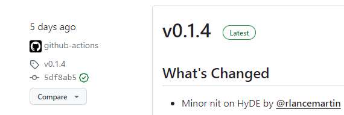
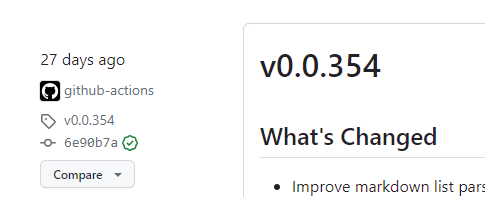
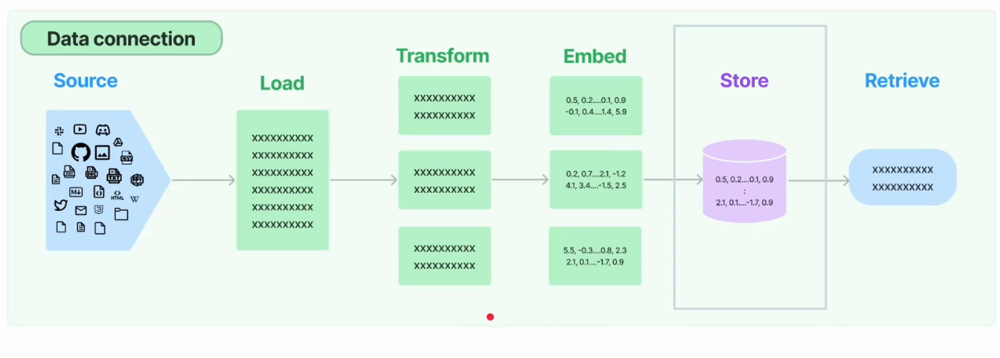
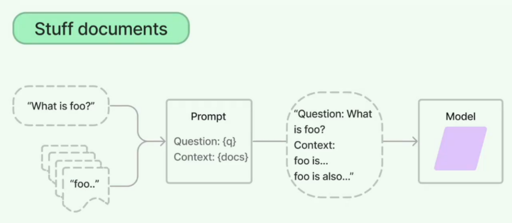
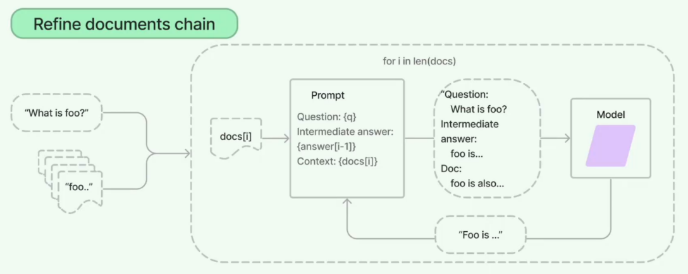

# LangChain 入门与避坑指北

> 前言：
>
> 本文对最近学习 LangChain 的过程进行一个简单的概述，介绍基本的概念、简述需要注意的问题，并提供我觉得当下还不错的学习方法。


## 1 前期准备

- Python 基础，a little 就行，或者拥有基本的 debug 能力即可上手
- shell 基础，环境问题是所有问题中最头疼的问题，有 shell 命令的基础能快速复现环境即可
- 面向对象思想。可有可无，这是后面自己查看工程结构的必须，减少重复编程。
- 6g+ 的显存 or OPENAI_API_KEY，显卡要求其实不大，以 ChatGLM-6B 为例，6g 显存跑模型没有问题，但是我在实践中出现了刚好吃满 6g，导致写的 langchain 提交不上去的情况，建议使用 6g+ 的显存。对显卡没要求~毕竟跑 1 分钟和跑 5 分钟区别不大。
  OPENAI_API_KEY 不需要买 GPT 4.0 的，GPT 3.5 的完全够用了，后面会详细讲配置问题。KEY 也不贵，超过 5 块钱先斟酌下，我买的时候只花了 3.2 哦~

------


## 2 避坑指北

下面是在开始前先给大家描述下我遇到的一些错误，以防开始学习之后报错找了一圈发现就在该文档下面 emmmm。

#### （1）环境问题

建议使用 conda 对环境进行管理，如果你想用本地显存跑模型，强烈建议**模型和 langchain 使用两套环境！！！**以防止中途因为一些必要插件关联导致的版本变动，以至于程序无法启动。

- **torch && torchvision**（据说有80%的小笨蛋在开始就栽在了版本上，然后~就没有然后了）

```python
# 如果不清楚自己的版本的，可以使用如下代码进行确认：
import torch
print(torch.__version__)
import torchvision
print(torchvision.__version__)

# 我使用的版本如下：
# torch 1.13.1+cu117
# torchvision 0.14.1+cu117

# 版本基本没有优劣之分（因为我也不清楚）
# 在博客 https://blog.csdn.net/shiwanghualuo/article/details/122860521 可以看到对照
# 也可以直接访问：
# https://gitcode.com/pytorch/vision?utm_source=csdn_github_accelerator&isLogin=1

# 安装版本命令 emmm，不教了，不会我觉得可能你不适合学这个
```

- langchain 环境使用主要包体如下：

```requirement.txt
chromadb         # 存储和查询程式语言片段的数据库
langchain[all]
# 如果报错需要继续补齐 langchain_community langchain_openai等，按报错信息来
fastapi          # web api 工具
gradio           # 将模型、数据集、文本、图像等内容部署成简单的界面
openai
pydantic         # 数据验证和设置库
pypdf            # 处理 PDF 文件的库
transformers     # Hugging Face 开发的自然语言处理任务的库
unstructured     # 处理非结构化数据
uvicorn          # 快速的 ASGI 服务器
```

- 模型环境尽量不要图方便使用人家自带的 python，不是很好管理，new 一个环境然后读取 requirement.txt即可，以 chatglm3 为例，他的文件如下：

```requirement.txt
# basic requirements

protobuf>=4.25.2
transformers>=4.37.1
tokenizers>=0.15.0
cpm_kernels>=1.0.11
torch>=2.1.0
gradio>=4.16.0
sentencepiece>=0.1.99
sentence_transformers>=2.2.2
accelerate>=0.26.1
streamlit>=1.30.0
fastapi>=0.109.0
loguru~=0.7.2
mdtex2html>=1.3.0
latex2mathml>=3.77.0

# for openai demo

openai>=1.10.0
zhipuai>=2.0.1

pydantic>=2.5.3
sse-starlette>=2.0.0
uvicorn>=0.27.0
timm>=0.9.12
tiktoken>=0.5.2

# for langchain demo

langchain>=0.1.4
langchainhub>=0.1.14
arxiv>=2.1.0
```

**注意：**如果和本文发布时间很近的话不建议使用 GLM3 作为本地模型，目前 LangChain 还没有将 GLM3 的接口放入，需要自己编写。（不过能让你快速了解源码）


#### （2）LangChain 问题

新技术的到来总是让人兴奋的，langchain 在最近迎来了它的 0.1.0 版本。md学起来贼辛苦好吧~放两张今天写文的时候的截图：





哥们我学的时候还只有 0.1.3 呢艹。

言归正传，langchain 0.0 系列和 0.1 系列最大的差别就是以往很多接口因为它的模块化设计进行了调整。在下面进行简单的举例：

```python
# 部分包名由 langchain 下放到 langchain_community/langchain_openai
# 下面是常见的最新的引用（含变动）

from langchain_community.document_loaders import UnstructuredURLLoader
from langchain_openai import OpenAI
from langchain_openai import ChatOpenAI

# invoke(Any) 代替执行语句
# 在实操中有两个地方遇到了这个问题：
# eg.1
openaichat = ChatOpenAI(model_name="gpt-3.5-turbo")
# 原 res = openaichat(msg)
res = openaichat.invoke(msg)  # 输出内容不影响

# eg.2
llm = OpenAI(max_tokens=1500)
chain = load_summarize_chain(llm, prompt=chinese_prompt)
# 原 summary = chain.run(news)
summary = chain.invoke(news)  
# 实测 invoke 返回内容会包含'output_text'、'input_text'等，'output_text'为原 run 返回内容

# 会不会影响使用我目前无法下定论，因为我所处物理环境问题可变参数太多了，
# 但是建议大家依据新的规范来写，因为控制台在执行的时候会报 warning，且格式真的很丑
# 有因为不从 langchain_openai 引入导致程序执行不下去的经历，但尚不确认是否为网络问题
```

###### 如何解决 langchain 问题？

目前来看应该还没有很好且直观的途径去查看文档，英文、中文文档的更新都有一定的滞后性。

入门了解架构的话推荐中文文档：[LangChain中文网](https://www.langchain.com.cn/)

英文文档会稍微快一点：[Introduction | 🦜️🔗 Langchain](https://python.langchain.com/docs/get_started/introduction)

解决问题直接 github issue 区，基本上萌新开发者遇到的问题 CSDN 可能还没同步但是 issue 区已经有了：[Issues · langchain-ai/langchain (github.com)](https://github.com/langchain-ai/langchain/issues) 社区比较活跃，实在没有就提问吧。

------


## 3 LangChain 很扯淡的入门介绍

#### （1）关于 LangChain

为什么要叫 langchain 呢？拆开来就是 lang & chain，lang 的话如果在之前你接触过 SpringBoot 之类的项目，很多后端会把一些国际化、语言化的东西放在一个 lang 文件夹下；而 chain 的话则更好理解，langchain 本质上是一个中间件，类似于你和数据库交互需要用到的无论是 Mybatis、Navicat 等程序，langchain 是方便你和 LLM 大模型交互的工具。

所以我们有理由猜测，如同现在喜欢将 datax 等组件封装一层作为中台自动化中间层，假使 langchain 保持如今的热度继续发展，之后也会变成一个开箱即用的 UI 组件。

#### （2）LangChain 的主要工作

援引自 B 站视频 [九天玩转Langchain](https://www.bilibili.com/video/BV1E94y187YX?vd_source=75fc8fb6d21bda88e7f19b3fe3d00dbb)

LangChain 你看下面有 6 大模块怎么怎么样，其实也就那样 emmm，搞清楚流程机制以及你可以在什么地方使用，工具就是要用的时候再看说明书。



我认为 longchain 主要做的就是 ETL 工作，论点如下：看见上图的 langchain 的主要工作了吗？从数据源抽取、转换、加载，妥妥的 ETL。当然，深入的说，langchain 主要用来对非结构化数据也就是语言、文本等有很好的支持，它的转换也不仅仅是常规的格式转换，而是对输入的量化。（业内人士喜欢称其为文本词嵌入（Word Embedding），这个稍后再说）

store 过程则是将数据写库，使用 chromadb，这是个轻量级且对文本向量支持友好的数据库转换器，retrieve 则是对 store 中的内容进行一个提炼输出。

一句话概括就是：**langchain 完成了对数据一个提炼、查找的完全链路。**它并不能提供数据源、查找理由，只是一种方法的凝练。

数据源支持由用户等自行提供，因此它支持本地知识库的搭建，合理想象未来的学生课设系统将会是：金融知识系统（使用 langchain 爬取金融网站提取摘要凝练成知识）、图书简介系统（使用 langchain 对图书提取摘要进行展示）……

关于查找理由这一段我是有端联想的，并非考据：在学习视频的过程中发现使用 GLM-6B 本地运行对小文本处理性能并不优秀，但是换上 OPENAI_API_KEY 之后的效果却让人满意。我认为是模型在输出过程中占据主导地位，且越大训练的模型处理小微数据的效果可能会更好（但目前我还没读源码）。而 langchain 在这过程中主要还是扮演一个助手的身份，对输入进行修修补补以及对输出进行修修补补。

#### （3）文本词嵌入（Word Embedding）

这里我直接使用上面视频中的例子进行简单介绍，详细大家可以自己找资料或者看视频~

```markdown
词嵌入是词语的一种数值化表示方式，一般情况下会将一个词映射到一个高维的向量中（词向量vector）

- 例子：
  - “我” --> [0, 0.3, -0.1]
  - “你” --> [-0.6, 0.12, 0.16]
  - “俺” --> [0.01, 0.298, -0.99]

向量化的意义：
将低维的词/句子转换为高维的向量，方便进行数字化表达
换言之：接近的语义=接近的高维距离
```

B 站有很多不错的 embedding 介绍，附上我很喜欢的一句话：**“万物皆可 embedding”**，可见，embed主要是对非结构化数据进行的升维操作，对事物建立起关联。

------


## 4 模块简介

看到这了，我觉得你可以动手实践下了，关于模块的部分我认为亲手实践一次会比干巴巴的讲解有效很多，如果你也认同我说的，可以去我的另一篇文章《LangChain 实践》做一个本地的知识库问答，很短的代码却能让你有全新的体悟，或者跟着下面的几个模块，我粗略的讲解。

我并不准备按照官方顺序或者译文顺序来介绍模块，说实话既然有官方文档那么很多东西其实应该侧重于以工程的角度去科普介绍，而非润色下译文直接照搬（如此我建议可以去译文的 github 提 pr）

#### （0）Transformers 乱入

我们最先想到用 langchain 一定是我们需要和模型进行交互了，那么模型在哪来？模型是怎么启动的？模型的构成是什么？这些~我都还不知道 emmm，之后会抽时间研究 Transformers 的源码，再写个《初探 Transformers》的入门吐槽。

言归正传，模型的启动如下：

```python
# 导入 AutoTokenizer 和 AutoModel，用于从预训练模型中加载模型和分词器
from transformers import AutoTokenizer, AutoModel

# 从本地加载 chatglm-6b 预训练模型的分词器，trust_remote_code=True 表示信任远程代码
tokenizer = AutoTokenizer.from_pretrained("./ChatGML/model/chatglm-6b", trust_remote_code=True)

# 从本地加载 chatglm-6b 预训练模型，trust_remote_code=True 表示信任远程代码
model = AutoModel.from_pretrained("./ChatGML/model/chatglm-6b", trust_remote_code=True).quantize(4).half().cuda()

# 将模型设置为评估模式
model = model.eval()

# 使用模型进行对话，初始对话内容为 "你好"，history=[] 表示初始对话历史为空
response, history = model.chat(tokenizer, "你好", history=[])
# 打印模型给出的回复
print(response)

# 使用模型进行对话，对话内容为 "晚上睡不着怎么办"，使用之前的对话历史作为上下文
response, history = model.chat(tokenizer, "晚上睡不着怎么办", history=history)
# 打印模型给出的回复
print(response)

"""
Loading checkpoint shards: 100%|██████████| 8/8 [00:22<00:00,  2.81s/it]
你好👋!我是人工智能助手 ChatGLM-6B,很高兴见到你,欢迎问我任何问题。
以下时是一些有用的技巧,可以帮助在晚上入睡:
1. 保持放松:尝试进行深呼吸、冥想或放松练习,减轻压力和焦虑。
2. 创造舒适的睡眠环境:确保卧室安静、黑暗、凉爽和舒适,可能需要使用耳塞、眼罩等。
3. 制定规律的睡眠时间表:每天在同一时间上床,保持相同的起床时间,帮助身体建立一个正常的睡眠节律。
4. 避免刺激:在睡觉前几个小时内避免饮用咖啡因、酒精或尼古丁,并避免在睡前进行刺激性的活动,如看电视或使用电脑。
5. 暴露于光线下:在睡觉前几个小时内,将手机或电脑屏幕调暗,并尽可能让光线暴露于室外,如阳光或户外夜景,帮助身体暴露于光线下,提高入睡所需的光线水平。
6. 尝试进行冥想或深度呼吸练习:这些技巧可以帮助放松身体和思维,提高入睡的能力。
如果这些方法不起作用,也可以尝试咨询医生或睡眠专家,获取更具体的建议和帮助。
进程已结束,退出代码0
"""
```

这就是一个基本的模型加载启动并问答的流程。详细参数的示意如下（由 GPT 提供）：

在深度学习框架中，`model.eval()` 的作用是将模型设置为评估模式。在评估模式下，模型通常会关闭一些训练中会用到但在评估时不需要的功能，比如 dropout 和 batch normalization 的计算，这有助于提高评估时的计算效率。此外，`model.eval()` 还会影响某些模型，比如在使用 PyTorch 框架时，会影响 BatchNorm 和 Dropout 层等。

对于 `.quantize(4).half().cuda()` 这一方法链，它包含了以下几个操作：

- `quantize(4)`：这一操作是对模型进行量化（Quantization），将模型中的参数从浮点数格式转换为定点数格式。括号中的参数 4 表示将参数量化为 4 位，从而减少模型的存储空间和计算量。量化通常用于优化模型的推理效率。
- `half()`：这一操作将模型中的数据类型从 32 位浮点数（float32）转换为 16 位浮点数（float16），这种操作被称为半精度浮点数计算。这样做可以显著减少模型在 GPU 上的内存占用，并提高计算速度。
- `cuda()`：这一操作将模型转移到 GPU 上进行计算，如果 GPU 可用的话。这样可以利用 GPU 的并行计算能力来加速模型的推理过程。

如上所见，HF 的 Transformers 提供了便捷的方式启动模型，但是 langchain 并非抢了 transformers 的活，而是很好的对接了 chat 接口，提供更高效和便捷的预处理或是优化方式。

下面是 ChatGLM3 的 api_server.py 文件中的部分，本质上是启动模型后开放了一个可访问的接口：

```python
if __name__ == "__main__":
    # Load LLM
    tokenizer = AutoTokenizer.from_pretrained(TOKENIZER_PATH, trust_remote_code=True)
    model = AutoModel.from_pretrained(MODEL_PATH, trust_remote_code=True, device_map="auto").eval()

    # load Embedding
    embedding_model = SentenceTransformer(EMBEDDING_PATH, device="cuda")
    uvicorn.run(app, host='0.0.0.0', port=8000, workers=1)
```

那么现在我们就能开始真正进入 langchain，看看他对这个接口提供了些什么？又对返回进行了什么样的处理~

#### （1）模块一：模型 Models

###### 【1】加载 LLM

因为目前 ChatGLM3 还比较新，我使用的 langchain 版本还未更新 3 的接口，所以测试的时候是使用的自己的ChatGLM3 类~

```python
from langchain_chatglm3 import ChatGLM3
llm = ChatGLM3(endpoint_url="http://localhost:8000/")
response = llm.invoke('你好')
```

当然，`langchain_chatglm3` 并不是官方的类，这里只是使用本地简单方法打个样，后续的启动将使用 `OPENAI_API_KEY ` 的方式进行。

so，首先需要将 `OPENAI_API_KEY ` 导入环境，你可以选择直接写入环境变量，抑或是在项目下配置 `.env` 文件，我采用的是最老土的方式：

```python
import os
os.environ["OPENAI_API_BASE"] = 'https://~'  # 接口网址
os.environ["OPENAI_API_KEY"] = 'sk-~'  # Key 值
```

写入到了环境之后自然就不需要启动模型的时候配置 endpoint_url 了，那么代码如下：

```python
from langchain_openai import OpenAI
llm = OpenAI()
response = llm.invoke('你好')
```

那么到这里，就是 Model 模块的一半内容了，作为一个初学者，你现在应该掌握了使用一个模型，并接收返回的能力，关于其他什么异步啊、自定义啊，那需要在工程实践中掌握，有需求看文档就行。

###### 【2】文本嵌入 text embedding

> Embedding 类是一个用于与嵌入进行交互的类。有许多嵌入提供商（OpenAI、Cohere、Hugging Face等)，这个类旨在为所有这些提供商提供一个标准接口。
>
> 嵌入会创建文本的向量表示。这很有用，因为这意味着我们可以在向量空间中考虑文本，并执行诸如语义搜索之类的操作，其中我们在向量空间中寻找最相似的文本片段。
>
> LangChain 中的基本 Embedding 类公开了两种方法：embed_documents 和 embed_query。最大的区别在于这两种方法具有不同的接口：一个适用于多个文档，而另一个适用于单个文档。除此之外，将这两个方法作为两个单独的方法的另一个原因是，某些嵌入提供商针对要搜索的文档与查询本身具有不同的嵌入方法。
>
> ——摘自 langchain 中文网

还记得写在前面的文本词嵌入吗？简单来说就是将文字向量化，这当然不是一个函数就能解决的问题，具体实现原理的话可能 emmm 需要开个单章去研究下模型实现，现在我们只需要知道：执行的过程已经封装好了，告诉 langchain 你选择的 embedding 模型即可，有请 VCR：

```python
from langchain.embeddings.huggingface import HuggingFaceEmbeddings
# 一个 embedding 列表，记录常用的 embedding 对照关系
embeddings_model_dict = {
    "ernie-tiny": "nghuyong/ernie-3.0-nano-zh",
    "ernie-base": "nghuyong/ernie-3.0-base-zh",
    "text2vec": "GranymeNil/text2vec-large-chinese",
    "text2vec2": "uer/sbert-base-chinese-nil",
    "text2vec3": "shibing624/text2vec-base-chinese",
}

def load_embedding_mode(model_name="ernie-tiny"):
    encode_kwargs = {"normalize_embeddings": False}
    model_kwargs = {"device": "cuda:0"}
    return HuggingFaceEmbeddings(
        model_name=embeddings_model_dict[model_name],
        encode_kwargs=encode_kwargs,
        model_kwargs=model_kwargs
    )

embeddings = load_embedding_mode('text2vec3')
print(embeddings)

"""
client=SentenceTransformer(
  (0): Transformer({'max_seq_length': 128, 'do_lower_case': False}) with Transformer model: BertModel 
  (1): Pooling({'word_embedding_dimension': 768, 'pooling_mode_cls_token': False, 'pooling_mode_mean_tokens': True, 'pooling_mode_max_tokens': False, 'pooling_mode_mean_sqrt_len_tokens': False, 'pooling_mode_weightedmean_tokens': False, 'pooling_mode_lasttoken': False})
) model_name='shibing624/text2vec-base-chinese' cache_folder=None model_kwargs={'device': 'cuda:0'} encode_kwargs={'normalize_embeddings': False} multi_process=False
"""
```

可以看到：embedding 返回的是一大堆参数，一些可以自定义，一些由模型给出。看不懂也没关系，它相当于定义了文字向量化的框架，这为我们下一个模块打下了基础。


#### （2）模块二：索引 Indexes

书接上文，我拿到了 embedding 给我的规则如何将我要的内容向量化呢？向量化之后我又该如何使用呢？因此第二步，我们就需要对数据进行处理~

索引下一共分为四个部分：

- 文档加载器（Document Loaders）
- 文本分割器（Text Splitters）

```python
from langchain_community.document_loaders import DirectoryLoader
from langchain.text_splitter import CharacterTextSplitter
# 这里参数默认是同级目录下 data 文件夹中的文件
def load_document(directory="data"):
    loader = DirectoryLoader(directory)
    documents = loader.load()
    # 初始化，指定每个拆分块的大小和块之间的重叠量
    text_splitter = CharacterTextSplitter(chunk_size=256, chunk_overlap=0)
    split_docs = text_splitter.split_documents(documents)
    return split_docs

documents = load_document()
```

由上面的代码可见，非常的见名知意，最多就是初期照着文档熟悉下接口~

- 向量存储（Vectorstores）

```python
from langchain_community.vectorstores import Chroma
# 将向量数据写入向量数据库 chromadb
def store_chroma(docs, embeddings, persist_directory='VectorStore'):
    # 从 docs（document）文本文件写入
    db = Chroma.from_documents(docs, embeddings, persist_directory=persist_directory)
    # 持久化目录
    db.persist()
    return db
# 如果没有 Vectorstore，依 embedding 创建
if not os.path.exists("Vectorstore"):
    db = store_chroma(documents, embeddings)
else:
    db = Chroma(persist_directory='VectorStore', embedding_function=embeddings)
```

这里使用了 chromadb 对向量化的数据进行保存~

- 检索器（Retrievers）

```python
retriever = db.as_retriever()
```

这里直接将 db 转化为检索器，一行就搞定了~


#### （3）模块三 && 四：链 Chains && 代理 Agent

Chains 绝对说得上是 langchain 的核心，但是并不准备花很多篇幅来讲他。在前两个模块里，我们已经能加载上模型、存储上向量化的数据并且准备好检索了。以人来比喻，这个时候你拥有了一个具有表达能力且大脑中有一定知识，并且你能让他依据知识进行回答。（下面我的例子和说法可能并不准确）

Chains 模块允许我们将之前的人组装起来：

```python
from langchain.chains import RetrievalQA
qa = RetrievalQA.from_chain_type(
    llm=llm,
    # 组装模式，可选 stuff | Refine | Map reduce | Map rerank
    chain_type='stuff',
    retriever=retriever
)
```

当然你也可以在这条 Chain 上延展，原则上一个人有两个大脑、四种检索方式、八个表达语句并不是什么奇怪的事，Chains 模块就是保证这条流水线能够正常执行。

而 Agents 模块允许这个人使用点工具来帮助操作，比如我需要计算 10000 x 10000，明明计算器能算的东西让我用大脑算岂不是太折磨了吗（我想到了现在 GPU 和 CPU 的爱恨情仇），因此，代理模块通过提供代理执行器 Agent Executors 简化了一些不必要的计算，或者说，通过给予一些人”职业“，来让处理效果更加高效且准确。

如同最近看了解到的 XAgent，多个 Agent 协作能把效率最大化（什么赛博奴隶）

然后最后介绍下 Chains 的类型：

- Stuff



stuff 无优化，就是一条直链。

eg. 假如 token 只有 8000，输入 10000 就会 oom

- Refine



refine 循环（loop）调用，对文档内容分片，并将上一轮的结果作为下一轮的输入放入。

eg. token 8000，分片假如 2000，就会将 10000 的文本转换成 2000 + 上一轮循环结果进行输入

- Map reduce

这个就不用介绍了吧，学大数据都写烂了~我其他文章至少介绍过 3 遍 MapReduce 了 emmmm

- Map rerank（没了解，有机会再补）


#### （4）模块五 && 六 记忆存储（Memory） &&  提示工程（Prompts）

Memory 模块没用过，基本是对内存、向量空间、知识图谱等进行操作，目前我还没用过就不班门弄斧了。

Prompts 模块可能会是用得最多的模块，也是”伪“调优、糊弄上司的一把好手：langchain 的默认提示词都是英文的，即使你给他的都是中文语料，但是可能因为提示词是英文的导致输出是英文 or 四不像。因此，对于输出进行规范的第一步就是使用自己的提示词。

```python
from langchain.prompts import PromptTemplate
prompt_template = """总结这段新闻的内容：
    "{text}"
    总结:"""
# 将输入内容填充进 prompt 模板
chinese_prompt = PromptTemplate(template=prompt_template, input_variables=["text"])
# prompt 也是 chain play 的一环啊
chain = load_summarize_chain(llm, prompt=chinese_prompt)
```

可见，prompt 操作其实是针对批量化处理等操作的一个简化步骤，例如你使用爬虫的时候就能很好的控制输出而不必过于担心内容的差异性。当然也有专门对输出格式进行规约的，比如：

```python
from langchain.output_parsers import PydanticOutputParser
template = """\
        我将给你一段新闻的概括，请按照要求把这段新闻改写成郭德纲和于谦的对口相声剧本。
    
        新闻: "{新闻}"
        要求: "{要求}"
        {output_instructions}
    """
parser = PydanticOutputParser(pydantic_object=XiangSheng)
prompt = PromptTemplate(
    template=template,
    input_variables=["新闻", "要求"],
    partial_variables={"output_instructions": parser.get_format_instructions()}
)
class XiangSheng(BaseModel):
    script: List[Line] = Field(description="一段相声的台词剧本")
```

格式的规约主要还是用在后期的数据处理上，因此 parser 这个操作完全可以看作 prompt 的 prompt，一个是从语言层面上的约束，一个是从代码层面上的约束，本质上并无特别大的区别。

------


## 5 总结

到这里，其实看似好像啥都讲了，但是又好像啥都没讲。不过把上面模块中介绍的代码拼凑起来，你已经能够实现一个”本地知识库问答“的功能，自己在写几个 api 调用，已经遥遥领先于过去千篇一律的系统了（然而实际上代码只有 60 行不到）。

这几个小实践的代码会在之后的《LangChain 实践》中，其实也没啥，都是照着我前面提到的几个非常棒的 B 站教学操作的。不过为了方便不想看课以及 debug 的同学操作，到时候会把注释打好再发出来（如果不想 debug 建议还是别学了，新技术要的就是不停的 debug）

总之，langchain 其实就是一个人类与 LLMs 交互的中间件，不过它的可玩性很足，支持包括 B 站视频等输入源的数据输入（因此，我有理由怀疑最近 B 站的一大堆 AI 视频助手多少都使用了 langchain）。工具想要熟练只能是多实践，不要因为环境的限制而停下脚步~

本实践在 P106-100 6G ≈ 1060 6G 完成 T_T，啥时候有富婆支援一块 4090 炼丹啊~