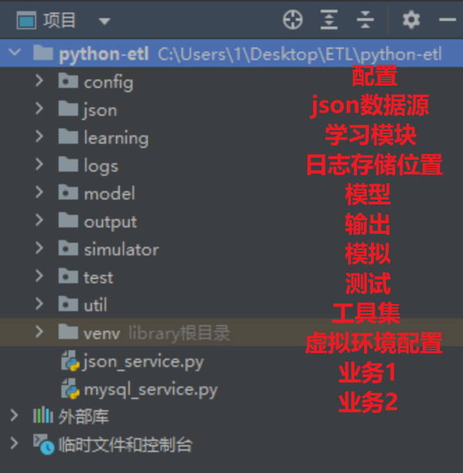

# ETL工程

> 前言：
>
> 如果说前端和后端岗位的供需是逐年轮换的，那么不赶巧，我大数据这边在考研前主要需求语言是Java，偏向于数据开发；在我考完研之后再看实习就是Python，偏向数据分析。。。
>
> 人不能因噎废食，有时候在时代浪潮的作用下微乎其微，不可能等到Java重新成为大数据岗位主流语言的那天再去找工作，因此乘着这个“机会”，学习了下Python的项目结构、ETL完整的流程以及FineBI、Kettle等工具的使用。
>
> 最重要的还是对项目结构的学习，系统的项目结构了解也方便未来看懂其他人的代码，能够很好快速的适应Python项目开发。


## 一、ETL

#### 1、什么是ETL？

E: 数据抽取-- 抽取的是其他数据源中的数据

T: 数据转换-- 将数据转换为统一的格式,消除异常值,缺失值,对于错误的逻辑进行修改

L: 数据加载-- 将不同数据源的数据处理后加载到数仓或者输出到指定位置

#### 2、常见的数据存储格式

**结构化数据:** 每一个数据都可以使用行索引和列索引标记,同时使用行和列索引可以标记一个唯一的值

- 数据库中的表
- Excel
- CSV数据格式
- TSV数据格式(其实就是CSV格式的数据,但是分隔符用的是制表位`\t`)

**半结构化数据:**数据中的一部分数据是结构化数据,或者可以转换为结构化数据

- JSON数据格式
- XML数据格式

==注意: JSON数据和XML数据在任何情况下,都可以互相转换. 半结构化数据,通常会转换为结构化数据后,再做分析.==

**非结构化数据:**

- markdown文本
- word文档
- mp3
- avi、mp4

==注意: 非结构化数据,一般我们不做分析,可以提取其中的一部分,或者其中的规律,保存为结构化数据后再做分析.==

------


## 二、Python项目结构

(project name)工程名称: `python_etl`

工程名称可以随意定义,但是要符合标识符的**命名规则**:

- 不能使用关键字
- 只能使用字母数字和下划线
- 不能以数字开头
- 严格区分大小写

标识符: 程序员自己定义的,具有特殊功能或含义的字符组合 

关键字: 系统或者解释器定义的,具有特殊功能或者含义的字符组合

> 5个目录:
>
> - config：保存整个ETL工程的配置信息
> - model：保存项目的数据模型文件
> - test：保存单元测试的代码文件
> - util：保存项目的工具文件
> - learn：保存项目开发过程中的一些基础知识讲解练习文件（实际不需要）
>
> **问题: 什么时候创建package 什么时候创建directory???**
>
> 如果你当前目录中的文件可能被其他文件引用就是用package
>
> 如果你当前文件目录中的文件不会被任何文件引用就使用directory  例如:  logs  learn

------




## 三、Python常用模块

##### 6.1 日志模块(理解)

`import logging`

> 核心理解:
>
> 0. 导入模块  (==自己的文件名不要和内置模块名称重名,否则内置模块无法使用==)
> 1. 日志管理对象: 负责日志的收集工作 - `相当于执法记录仪`
> 2. 日志处理器: 负责日志的输出形式管理(终端/文件) - `相当于将记录仪连接的打印机`
> 3. 日志格式: 负责日志的输出格式管理 - `相当于打印机中的墨盒`
>
> 日志格式:
>
> ```python
> '%(asctime)s - [%(levelname)s] - %(filename)s[%(lineno)d]：%(message)s'
> ```

**logging日志模块的基本使用**

```python
"""
logging模块: 主要是为了记录程序运行期间产生的日志信息

日志器对象的创建和配置
1. 日志器对象的创建
2. 日志处理器的创建
3. 将日志处理器绑定到日志器对象上

日志的输出
1. 设置日志输出级别
2. 输出不同级别的日志信息
"""
# 0.导入模块
import logging

####################### 日志器对象的创建和配置  #####################
# 1. 日志器对象的创建
logger = logging.getLogger()
# 2. 日志处理器的创建
stream_handler = logging.StreamHandler()
# 3. 将日志处理器绑定到日志器对象上
logger.addHandler(stream_handler)

############################ 日志的输出  #######################
# 1. 设置日志输出级别 (默认warning及warning级别以上的日志信息会被输出)
# 忘记日志自己别的数据值,因为如果使用10 20 30 就会做不到见名知意,降低代码的可读性
logger.setLevel(logging.INFO)

# 2. 输出不同级别的日志信息
"""
日志级别 5个:
debug: 代码调试时输出的日志信息
info: 代码正常运行过程中输出的日志信息
warning: 代码的运行结果可能和预期结果发生偏差时输出的日志信息
error: 代码出现异常时输出的日志信息
critical: 一般我们遇不到,遇到了解决不了的问题 例如: 磁盘或者内存空间已满等.
"""
logger.debug('这是一个debug级别的日志信息')
logger.info('这是一个info级别的日志信息')
logger.warning('这是一个warning级别的日志信息')
logger.error('这是一个error级别的日志信息')
logger.critical('这是一个critical级别的日志信息')
```

**logging日志模块设置日志输出格式**

```python
"""
日志器对象的创建和配置
1. 日志器对象的创建
2. 日志处理器的创建
3. 将日志处理器绑定到日志器对象上
4. 创建一个格式对象
5. 将日志格式对象绑定到日志处理器上

日志的输出
1. 设置日志输出级别
2. 输出不同级别的日志信息
"""
# 导包
import logging

##################### 日志器对象的创建和配置 #####################
# 1. 日志器对象的创建
logger = logging.getLogger()

# 2. 日志处理器的创建
stream_handler = logging.StreamHandler()

# 3. 将日志处理器绑定到日志器对象上
logger.addHandler(stream_handler)

# TODO: 4. 创建一个格式对象
fmt = logging.Formatter('%(asctime)s - [%(levelname)s] - %(filename)s[%(lineno)d]：%(message)s')

# TODO: 5. 将日志格式对象绑定到日志处理器上
stream_handler.setFormatter(fmt)

########################## 日志的输出 ##########################
# 1. 设置日志输出级别
logger.setLevel(logging.INFO)
# 2. 输出不同级别的日志信息
logger.debug('这是一个debug级别的日志信息')
logger.info('这是一个info级别的日志信息')
logger.warning('这是一个warning级别的日志信息')
logger.error('这是一个error级别的日志信息')
logger.critical('这是一个critical级别的日志信息')
```

**logging模块将日志输出到文件中**

> ==本质就是更换日志处理器类型==
>
> StreamHandler: 将日志信息输出到终端上
>
> FileHandler: 将日志信息输出到文件中

```python
"""
日志器对象的创建和配置
1. 日志器对象的创建
2. 创建换一个文件类型的日志处理器
3. 将日志处理器绑定到日志器对象上
4. 创建一个格式对象
5. 将日志格式对象绑定到日志处理器上

日志的输出
1. 设置日志输出级别
2. 输出不同级别的日志信息


常用的日志处理器有两种
StreamHandler: 流式日志处理器,将日志信息输出到终端中
FileHandler: 文件日志处理器,将日志信息输出到文件中
"""
# 导入logging模块
import logging

#################### 日志器对象的创建和配置 ####################
# 1. 日志器对象的创建
logger = logging.getLogger()

# TODO: 2. 创建换一个文件类型的日志处理器
# 注意: filename要传入一个log文件的路径,可以使用绝对路径也可以使用相对路径,但是文件目录一定要存在,文件可以不存在
# 举例: ../logs/test.log 路径中 logs目录必须存在, test.log可以不存在
file_handler = logging.FileHandler(
    filename='../logs/test.log',
    mode='a',
    encoding='utf8'
)
# 3. 将日志处理器绑定到日志器对象上
logger.addHandler(file_handler)
# 4. 创建一个格式对象
fmt = logging.Formatter('%(asctime)s - [%(levelname)s] - %(filename)s[%(lineno)d]：%(message)s')
# 5. 将日志格式对象绑定到日志处理器上
file_handler.setFormatter(fmt)


######################### 日志的输出 #######################
# 1. 设置日志输出级别
logger.setLevel(logging.INFO)
# 2. 输出不同级别的日志信息
logger.debug('这是一个debug级别的日志信息')
logger.info('这是一个info级别的日志信息')
logger.warning('这是一个warning级别的日志信息')
logger.error('这是一个error级别的日志信息')
logger.critical('这是一个critical级别的日志信息')
```

##### 6.2 time模块(理解)

==理解大于记忆==

> **time模块的基本使用：**
>
> * time.sleep(数字)：程序休眠几秒钟
> * time.time()：获取当前时间的时间戳（以秒为单位）
> * time.time_ns()：获取当前时间的时间戳（以纳秒为单位）
> * time.localtime()：获取当前的本地时间，结果是一个 struct_time 类的对象
> * time.localtime(时间戳-秒)：返回时间戳对应的本地时间，结果是一个 struct_time 类的对象
> * time.mktime(struct_time对象)：返回时间对应的时间戳（秒为单位）
> * time.strftime(格式化字符串, 日期)：将日期数据（struct_time对象）格式化一个字符串
> * time.strptime(日期字符串，格式化字符串)：将日期字符串转换为一个日期数据（struct_time对象）

```properties
%Y：4位数字的年份
%m：2位数字的月份
%d：2位数字的日期
%H：24小时制的小时
%M：2位数字的分钟
%S：2位数字的秒
```

```python
"""
**time模块的基本使用：**

- time.sleep(数字)：程序休眠几秒钟
- time.time()：获取当前时间的时间戳（以秒为单位）
- time.time_ns()：获取当前时间的时间戳（以纳秒为单位）
- time.localtime()：获取当前的本地时间，结果是一个 struct_time 类的对象
- time.localtime(时间戳-秒)：返回时间戳对应的本地时间，结果是一个 struct_time 类的对象
- time.mktime(struct_time对象)：返回时间对应的时间戳（秒为单位）
- time.strftime(格式化字符串, 日期)：将日期数据（struct_time对象）格式化一个字符串
- time.strptime(日期字符串，格式化字符串)：将日期字符串转换为一个日期数据（struct_time对象）
"""
# 导入模块
import time

# time.sleep(数字)：程序休眠几秒钟
print('hello')
time.sleep(1)
print('world')

# time.time()：获取当前时间的时间戳（以秒为单位）
date_float1 = time.time()
print(date_float1) # 1672285269.896592

# time.time_ns()：获取当前时间的时间戳（以纳秒为单位）
date_float2 = time.time_ns()
print(date_float2) # 1672285402027404100

# time.localtime()：获取当前的本地时间，结果是一个 struct_time 类的对象
# time.struct_time(tm_year=2022, tm_mon=12, tm_mday=29, tm_hour=11, tm_min=44, tm_sec=52, tm_wday=3, tm_yday=363, tm_isdst=0)
date1 = time.localtime()
print(date1)
print(date1.tm_year)
print(date1.tm_mon)
...

# time.localtime(时间戳-秒)：返回时间戳对应的本地时间，结果是一个 struct_time 类的对象
# 将一个数值型的时间戳,转换为struct_time时间类型
date2 = time.localtime(1672285269.896592)
print(date2)

# time.mktime(struct_time对象)：返回时间对应的时间戳（秒为单位）
# 将一个时间从struct_time时间类型转换为数值型的时间戳
date_float3 = time.mktime(date2)
print(date_float3) # 这种方式的转换有时间损失,以秒为单位进行了四舍五入

# time.strftime(格式化字符串, 日期)：将日期数据（struct_time对象）格式化一个字符串
# 将时间类型的数据按照一定的格式转换为字符串类型的数据
"""
%Y：4位数字的年份
%m：2位数字的月份
%d：2位数字的日期
%H：24小时制的小时
%M：2位数字的分钟
%S：2位数字的秒
"""
date_str1 = time.strftime('%Y年%m月%d日 %H时%M分%S秒', date2)
print(date_str1)

# time.strptime(日期字符串，格式化字符串)：将日期字符串转换为一个日期数据（struct_time对象）
# 将字符串类型的时间数据,转换为struct_time类型数据
# 重点: 时间字符串和时间格式要完全统一,否则无法正常转换
date3 = time.strptime('2022年11月11日 08时02分24秒', '%Y年%m月%d日 %H时%M分%S秒')
print(date3)
```

##### 6.3 unittest模块(掌握)

> **问题1:什么叫单元测试?**
>
> 对于软件中最小的可测试单元进行检测或检查的方式就是单元测试
>
> **问题2: 单元测试在企业开发中一般是谁来写??**
>
> 如果企业中测试工程师能力极强,可以由他来写,但是通常由开发人员来写,测试人员点击运行查看结果即可.

```python
from unittest import TestCase

class 自定义单元测试类(TestCase):
    def setUp(self) -> None:
        """该方法会在每个单元测试方法执行之前自动执行一次，可以做一些单元测试前的初始工作"""
        pass

    # 注意：所有的单元测试方法名必须以 test 开头，否则不能被 unittest 识别
    def test_单元测试方法1(self):
        pass

    def test_单元测试方法2(self):
        pass

    ...
```

**运行单元测试代码,出现如下情况的原因是你的文件名称不符合标识符的命名规则**


**unittest模块的使用**

```python
"""
unittest模块主要是用于做单元测试

1. 创建一个测试类
2. 书写setup方法 在测试方法执行前执行
3. 书写tearDown方法,在测试方法执行后执行
4. 书写测试方法
"""
# 导入unittest模块
from unittest import TestCase

class TestDemo(TestCase):

    def setUp(self) -> None:
        """在测试方法执行前执行"""
        print('setUp方法被执行...')

    def tearDown(self) -> None:
        """在测试方法执行后执行"""
        print('tearDown方法被执行...')

    # 所有的测试方法,必须以test开头,否则无法进行单元测试
    def test_func1(self):
        print('测试方法1被执行....')

    def test_func2(self):
        print('测试方法2被执行....')
```

> 注意事项:
>
> 1. 测试文件名称要遵守标识符的命名规则,无论是否被调用
> 2. 测试类,必须继承自TestCase
> 3. 测试方法必须方法名以test_开头,否则无法识别
> 4. -> None提示该方法没有返回值,但是是一个软性限制**(如果不遵循则报警告不会崩溃**)

##### 6.4 OS模块(**重要**)

> **os模块的使用：**
>
> * os.getcwd()：获取当前程序的运行工作路径
> * os.listdir(目录)：获取指定目录下的内容，返回一个list
>
> **os.path模块的使用：**
>
> * os.path.abspath(路径)：返回指定路径的绝对路径
> * os.path.dirname(路径)：返回指定路径的上一级路径
> * os.path.basename(路径)：返回指定路径的最后一部分
> * os.path.join(路径1, 路径2)：将两个路径进行拼接
> * os.path.isfile(路径)：判断指定路径是不是一个文件，是返回True，否则返回False
> * os.path.isdir(路径)：判断指定路径是不是一个文件夹，是返回True，否则返回False

```python
"""
os模块的使用：
- os.getcwd()：获取当前程序的运行工作路径
- os.listdir(目录)：获取指定目录下的内容，返回一个list

os.path模块的使用：

- os.path.abspath(路径)：返回指定路径的绝对路径
- os.path.dirname(路径)：返回指定路径的上一级路径
- os.path.basename(路径)：返回指定路径的最后一部分
- os.path.join(路径1, 路径2)：将两个路径进行拼接
- os.path.isfile(路径)：判断指定路径是不是一个文件，是返回True，否则返回False
- os.path.isdir(路径)：判断指定路径是不是一个文件夹，是返回True，否则返回False
"""
# __file__ 系统内置变量,用来表示当前文件所在位置的绝对路径
print(__file__)

# 导入os 模块
import os

# os.getcwd()：获取当前程序的运行工作路径 : 当前文件所在的目录的绝对路径
print(os.getcwd())

# os.listdir(目录)：获取指定目录下的内容，返回一个list
# 如果括号内什么也不写,获取的就是当前文件所在目录中所有文件的名称
print(os.listdir())
# 如果在括号内填写目录的路径,则获取的就是指定目录中的文件名称列表
# 注意我们使用的目录层级符号,如果是\要注意转译或者改为/
print(os.listdir('C:\\Users\\admin\\Desktop\\深圳36期-ETL阶段'))
print(os.listdir('C:/Users/admin/Desktop/深圳36期-ETL阶段'))

# os.path.abspath(路径)：返回指定路径的绝对路径
print(os.path.abspath('../'))

# os.path.dirname(路径)：返回指定路径的上一级路径
# 返回当前路径文件所在目录的路径
print(os.path.dirname(__file__))
# print(os.path.dirname('../')) # 如果给他的是相对路径,那么他返回的也是相对路径,一般获取dirname不适用相对路径
print(os.path.dirname(os.path.abspath('../'))) # 使用的时候转换为绝对路径

# os.path.basename(路径)：返回指定路径的最后一部分
# 返回当前路径的文件名称
print(os.path.basename(__file__))
# print(os.path.basename('../')) # 在开发中basename也会使用绝对路径
print(os.path.basename('C:/Users/admin/Desktop/深圳36期-ETL阶段/python_etl'))

# os.path.join(路径1, 路径2)：将两个路径进行拼接
# 一般为了防止出现拼接错误,我们会在路径1的末尾添加/,在路径2的开头删除斜杠
print(os.path.join('C:/Users/admin/Desktop/深圳36期-ETL阶段/', 'python_etl/learn(实际开发中不需要)'))

# os.path.isfile(路径)：判断指定路径是不是一个文件，是返回True，否则返回False
print(os.path.isfile(__file__))
# os.path.isdir(路径)：判断指定路径是不是一个文件夹，是返回True，否则返回False
print(os.path.isdir(__file__))

```


##### 6.5 pymysql模块(**重要**)


> **注:**
>
> pymysql模块属于第三方模块，使用前必须提前安装！！！
>
> pip install pymysql或通过pycharm直接安装
>
> **操作步骤:**
>
> 1. 导入模块
> 2. 创建连接
> 3. 创建游标
> 4. 执行sql/获取查询集
> 5. 关闭游标
> 6. 关闭连接
>
> **分类:**
>
> 1. 建表建库语句
>
> - 直接使用execute进行执行,不需要commit提交
>
> 2. 非查询语句(增删改)
>
> - 直接使用excute进行执行,需要使用commit提交
>
> 3. 查询语句
>
> - 直接使用excute进行执行,需要使用cursor.fetchall/fetchone/fetchmany进行结果集查询

**数据库和数据表的创建**

```python
"""
操作步骤:

1. 导入模块
2. 创建连接
3. 创建游标
4. 执行sql/获取查询集
5. 关闭游标
6. 关闭连接
"""
############################ 数据库的创建 ########################
# # 1. 导入模块
# import pymysql
# # 2. 创建连接
# conn = pymysql.connect(
#     host='127.0.0.1',
#     port=3306,
#     user='root',
#     password='123456',
#     charset='utf8'
# )
# # 3. 创建游标
# cursor = conn.cursor()
# # 4. 执行sql/获取查询集
# sql = 'create database python charset="utf8";'
# row_num = cursor.execute(sql)
# if row_num > 0:
#     print('数据库创建成功...')
#
# # 5. 关闭游标
# cursor.close()
# # 6. 关闭连接
# conn.close()

############################ 数据表的创建 ########################
# 1. 导入模块
import pymysql
# 2. 创建连接
conn = pymysql.connect(
    host='127.0.0.1',
    port=3306,
    user='root',
    password='123456',
    charset='utf8',
    database='python'
)
# 3. 创建游标
cursor = conn.cursor()
# 4. 执行sql/获取查询集
sql = 'create table person(id int, name varchar(100));'
row_num = cursor.execute(sql)
if row_num > 0:
    print('数据表创建成功...')
# 5. 关闭游标
cursor.close()
# 6. 关闭连接
conn.close()
```

**数据记录的增删改操作**

```python
"""
操作步骤:

1. 导入模块
2. 创建连接
3. 创建游标
4. 执行sql/获取查询集
    在增删改数据时,要注意数据提交
5. 关闭游标
6. 关闭连接
"""
###################### 增 ####################
# 1. 导入模块
import pymysql

# 2. 创建连接
conn = pymysql.connect(
    host='127.0.0.1',
    port=3306,
    user='root',
    password='123456',
    charset='utf8',
    database='python'
)
# 3. 创建游标
cursor = conn.cursor()
# 4. 执行sql/获取查询集
sql = 'insert into person values(1, "小明"),(2,"小芳");'
# 执行sql语句
row_num = cursor.execute(sql)
if row_num > 0:
    print('数据记录插入成功....')

# 只要是事务型操作(增删改),就必须提交后才能生效(sql数据的执行都是在内存中的,只有commit之后才能落盘)
conn.commit()

# 5. 关闭游标
cursor.close()
# 6. 关闭连接
conn.close()

###################### 删 ####################
# 1. 导入模块
import pymysql

# 2. 创建连接
conn = pymysql.connect(
    host='127.0.0.1',
    port=3306,
    user='root',
    password='123456',
    charset='utf8',
    database='python'
)
# 3. 创建游标
cursor = conn.cursor()
# 4. 执行sql/获取查询集
sql = 'delete from person where id=1;'
# 执行sql语句
row_num = cursor.execute(sql)
if row_num > 0:
    print('数据记录删除成功....')

# 只要是事务型操作(增删改),就必须提交后才能生效(sql数据的执行都是在内存中的,只有commit之后才能落盘)
conn.commit()

# 5. 关闭游标
cursor.close()
# 6. 关闭连接
conn.close()


###################### 该 ####################
# 1. 导入模块
import pymysql

# 2. 创建连接
conn = pymysql.connect(
    host='127.0.0.1',
    port=3306,
    user='root',
    password='123456',
    charset='utf8',
    database='python'
)
# 3. 创建游标
cursor = conn.cursor()
# 4. 执行sql/获取查询集
sql = 'update person set name="小华" where id = 2;'
# 执行sql语句
row_num = cursor.execute(sql)
if row_num > 0:
    print('数据记录修改成功....')

# 只要是事务型操作(增删改),就必须提交后才能生效(sql数据的执行都是在内存中的,只有commit之后才能落盘)
conn.commit()

# 5. 关闭游标
cursor.close()

# 6. 关闭连接
conn.close()
```

**数据记录的查询操作**

```python
"""
操作步骤:

1. 导入模块
2. 创建连接
3. 创建游标
4. 执行sql/获取查询集
    查询操作不需要数据提交,但是要进行结果集的处理
5. 关闭游标
6. 关闭连接
"""

# 1. 导入模块
import pymysql

# 2. 创建连接
conn = pymysql.connect(
    host='127.0.0.1',
    port=3306,
    user='root',
    password='123456',
    charset='utf8',
    database='python'
)

# 3. 创建游标
cursor = conn.cursor()

# 4. 执行sql
sql = 'select * from person where id > 1;'
cursor.execute(sql)
# 获取查询集
# query_set = cursor.fetchall()  # 获取全部的数据
# query_set =  cursor.fetchone()  # 获取一条数据
query_set = cursor.fetchmany(3)  # 获取3条数据
print(query_set)

# 5. 关闭游标
cursor.close()

# 6. 关闭连接
conn.close()
```

------


## 四、Python常用工具类

## 五、Model模型详解

## 六、ETL流程控制

## 七、FineBI、Kettle简介

