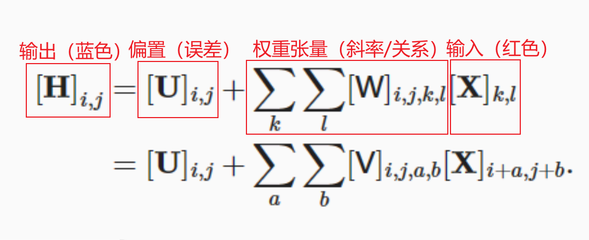
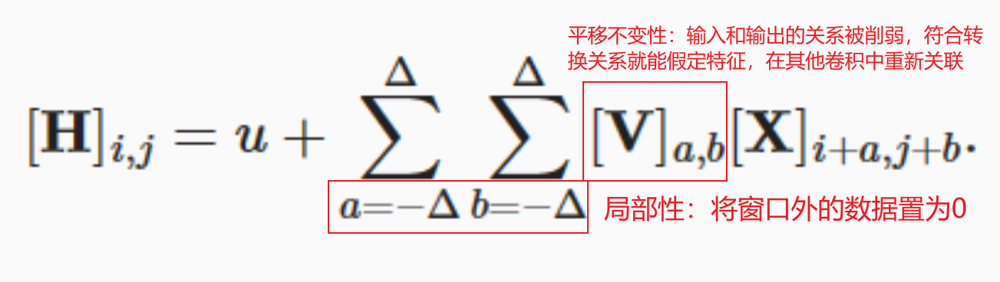
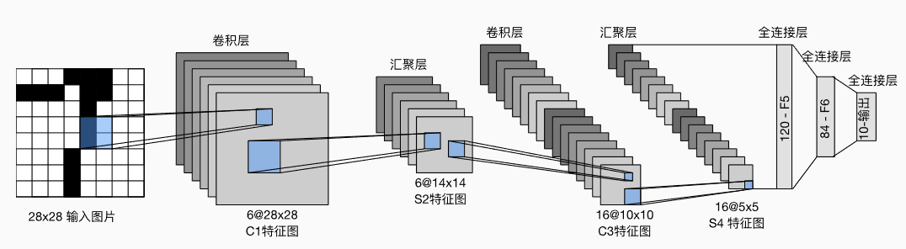
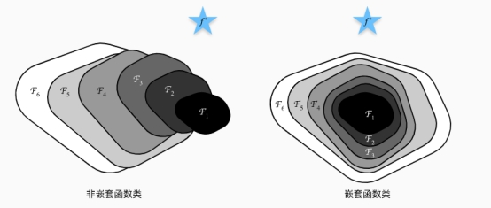
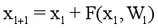
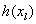
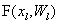
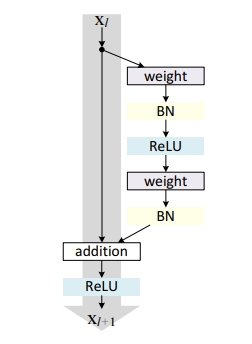
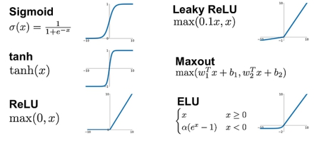

众所周知数据科学与大数据技术实际上是以科研性质的的数据科学和纯技术力的大数据技术组成，学一半尚且非常吃力，而我又偏偏选了大数据技术方向。但是学历太低了，大数据技术也找不到工作，刚巧老师布置了个小论文的作业，趁着五一假期，从零点一（毕竟就算有意不学，但多少还是耳目渲染了点）开始恶补数据科学部分。


拿到选题之前，我连ResNet是什么都不清楚，放以前应该是照着书猛看，但是现在有ChatGPT和NewBing等人工智能了，所以优先找它了解一些情况比较迅速。事实证明我是对的，我让NewBing给我列了个论文提纲和目录，一下子就把学习方向明了了。回答如下：

```markdown
## 摘要
深度神经网络在图像分类等任务上取得了显著的效果，但是随着网络层数的增加，训练和优化变得越来越困难。为了解决这个问题，本文介绍了一种深度残差网络（ResNet），它通过引入残差学习的机制，使得网络可以更容易地拟合恒等映射，从而避免了梯度消失和退化问题。本文详细分析了ResNet的原理和结构，并在CIFAR-10数据集上进行了实验，结果表明，ResNet可以有效地提高分类准确率，并且具有较低的参数量和计算复杂度。
## 目录
1. 引言
2. 深度神经网络的挑战
   2.1 梯度消失和爆炸
   2.2 退化问题
3. 深度残差网络
   3.1 残差学习
   3.2 网络结构
   3.3 短路连接
4. 实验与结果
   4.1 数据集和实验设置
   4.2 分类准确率
   4.3 参数量和计算复杂度
5. 结论与展望
```


第二步是针对每个小节让NewBing进行回答，虽然看上去它能直接把小论文写完了，但是事实并非一帆风顺。NewBing的上下文连贯性并不算特别好，前面几个小点还能连贯，后面就转向科普了，而且一旦一次线程爆了，一切就得重来。为了保持一致性，最终我还是选择采用他的目录内容，先学习再自己写写。（毕竟它要是真的全能写好养成习惯后我也就废了）

可能有人觉得ChatGPT会在回答上优于NewBing，让它写效果和作用会好很多。不过我个人并不建议这样，一是因为ChatGPT太优秀了，并非阻挡了自身的进步，而是它是给出的答案但凡有一句假话，给人带来的成本都是巨大的，科研是严谨的，不应该在自己不擅长的领域随意采用别人的观点；二是NewBing本质上还是一个搜索引擎，它未必能给我非常好的答案，但它能给我很多非常好的作者的博客链接，能够让我自己动手去找答案。


第三步我也没有急于直接去学习ResNet，短时间学会本来就很难，花大量时间莽撞的学习效率会很低。我先去了解了下小论文的书写格式，毕竟最终应该出来的是一篇像模像样的论文，而不是东拼西凑的文段。

参照文章《[知网查重入口教您论文写作的字体格式规范](https://www.cnki.ac.cn/write/294.html#:~:text=知网查重入口教您论文写作的字体格式规范 1 1、论文标题 使用2号黑体加粗、居中。 2 2、论文副标题 使用小2号的字体，紧挨正标题下居中，文字前加破折号。 3,另起一页开始，标题使用4号黑体，内容使用5号宋体。 7 8、附录 标题使用4号黑体，内容使用5号宋体。 8 9、注释 标题使用4号黑体，内容使用5号宋体。 )》最终将格式确定如下：

```markdown
1、论文标题
	使用2号黑体加粗、居中。
2、论文副标题
	使用小2号的字体，紧挨正标题下居中，文字前加破折号。
3、个人信息
	填写姓名、专业、学号等项目时用3号楷体。
4、目录
	目录要另起一页开始写作，标题为3号黑体，内容使用小4号仿宋，并且要罗列出页码。
5、正文部分
	要保证另起一页，开始写作，论文的标题使用3号黑体完成；而主体的文字部分，一般采用用小4号宋体；并且还要注意，每段要空两个字的距离再开始写作，行距也需要保持一致。
6、正文中不同等级的标题格式要求
	一级标题：标题前的序号为“一、”，4号黑体；独占一行；注意末尾不加标点符号。
	二级标题：标题前的序号为“(一)”同正文部分的字体大小相同；独占一行；注意末尾不加标点符号。
	三级标题：标题前的序号为“1.”同正文部分的字体大小、字体类型相同。
	四级标题：标题前的序号为“(1)”同正文部分的字体大小、字体类型相同。
	五级标题：标题前的序号为“①”同正文部分的字体大小、字体类型相同。
7、参考文献
	另起一页开始，标题使用4号黑体，内容使用5号宋体。
8、注释
	标题使用4号黑体，内容使用5号宋体。
```

同样，我也找了两篇知网上的论文进行参照，不过ResNet科普的论文并不存在，大部分是使用其进行调优的，这里只是用作格式的参考。


第四步就比较枯燥无味了，主打一个查资料学习，在这里先吐槽一下我们组的选题人（虽然我不知道是谁），ResNet的前置知识有VGG使用块的网络，而想知道VGG就得去看看AlexNet，而学AlexNet就需要明白CNN到底想干嘛，而CNN是卷积神经网络的起点，也就是说你得先明白神经网络是什么，为什么要卷积。也就是说：如果这篇ResNet小论文能顺利写出来，那么写个VGG、AlexNet的问题也不大，这些是其他组的选题。回归正题，下面会记录下我在查资料过程中碰到的一些专业词汇（一般是你不知道干啥就会影响观感的），方便到时候写小论文的时候啪啪啪往上放。

那么，我最终决定以《[动手学深度学习](https://zh.d2l.ai/index.html)》这本书的第六章卷积神经网络和第七章现代循环神经网络为起点，加上一些个博客（会在最后标注出来），开始我这从ResNet入门神经网络的文档。

#### 从全连接到卷积

###### （1）设计适合于计算机视觉的神经网络架构

- 平移不变性（translation invariance）：不管检测对象出现在图像中的哪个位置，神经网络的前面几层应该对相同的图像区域具有相似的反应，即为“平移不变性”。
- 局部性（locality）：神经网络的前面几层应该只探索输入图像中的局部区域，而不过度在意图像中相隔较远区域的关系，这就是“局部性”原则。最终，可以聚合这些局部特征，以在整个图像级别进行预测。

> 如果你不能很好的理解这两句话的内涵，我建议作为科普看看我喜欢的一个UP主林亦LYi的《[【亦】手机杀死了摄影？](https://www.bilibili.com/video/BV19P4y1q7GD/?spm_id_from=333.999.0.0&vd_source=a81ef8427e696b92de364d833142bd10)》，6分28秒开始讲解经典的人脸检测算法，很好的诠释了这两句话。


###### （2）【古早】全连接的多层感知机

我不是很能很好的陈述数学上的表现形式，但书上大部分以公式来进行讲解，所以在这我用自己的口语化表达简单介绍下这些流程。

首先是多层感知机：以图像为例，在计算机处理中我们可以将一张图看成是二维矩阵。这里需要了解权重张量的概念，还记得在最优化/计算智能学的梯度下降吗？简而言之，权重张量就是使用梯度下降之类算法得到的两组数据之间的关联性，比如一个红色向蓝色渐变的过程，只关注首尾（输入/输出）的话你是只能看到红色和蓝色的，但是微观上来说，如果这两个颜色存在关联，那么就必然会有一个红色衰减、蓝色增强的过程，嗯，我认为叫做趋势/极限可能比较合适，而这个变化的幅度，也就是数学上常说的斜率，就是权重张量。

> 权重张量是神经网络中的一个重要概念。它是一个多维数组，用于存储神经网络中每个连接的权重。在神经网络的前向传播过程中，输入数据会与权重张量相乘，然后通过激活函数进行非线性变换，最终得到输出结果。在训练过程中，权重张量会不断更新，以便更好地拟合训练数据。

那么再来看它的数学公式：



其实你很难想象他到底是想干什么，貌似这些参数该训练的都训练了，最终得到的也并不是有意义的结果。我在这里也纠结了很久，最终还是有了点头绪，别急，听我细细道来。

还是以红蓝渐变这个例子为中心，当你训练完成后，上面的每个参数应该都是已知的。这个时候我又来了一个白红蓝三色渐变的图片（不考虑缩放），你把上面训练好的二维数据往上面一贴，在误差范围内的，能够完全贴合的部分就能被“找到”，这就是识别出来了。

不过这个过程会比较漫长，因为公式中的（i，j）表示输出坐标，（k，l）表示输入坐标，四个自变量会导致计算过程指数级增长，而匹配过程又需要将输入的图从头扫到尾（极端情况下还需要反转、倒置），这种全扫描的方式就是全连接。

> 我并不知道我讲的对不对，反正我也就学了一个下午，讲错了大家会见谅的吧！


###### （3）卷积

关于卷积，我们让NewBing通俗易懂的讲讲？

> 卷积是一种数学运算，它在图像处理和计算机视觉中非常常用。可以把它看作是一种“滤波器”，它能够提取图像中的某些特定特征。
>
> 举个例子，假设我们有一张数字图像，它由许多像素点组成。我们可以定义一个卷积核，它是一个小矩阵，包含一些数字。然后，我们将卷积核放在图像的左上角，将卷积核中的每个数字与其下方的像素值相乘，然后将所有乘积相加，得到一个新的数字。这个新数字就是卷积的结果。
>
> 接下来，我们将卷积核向右移动一个像素，重复上述过程，再得到一个新数字。我们继续这样做，直到卷积核移动到图像的右下角。最终，我们会得到一个新的矩阵，它包含了原图像经过卷积后的结果。
>
> 不同的卷积核能够提取不同的特征。例如，有些卷积核能够检测边缘，有些能够模糊图像，有些能够锐化图像等等。在卷积神经网络中，卷积核通常是通过训练学习得到的，能够自动提取图像中最有用的特征。

> 卷积是一种数学运算，它在信号处理和图像处理中非常常用。在数学上，卷积被定义为两个函数f和g的卷积，记为f∗g，其定义为：
>
> (f∗g)(t) = ∫f(τ)g(t-τ)dτ
>
> 在离散情况下，卷积可以表示为：
>
> (f∗g)[n] = ∑f[k]g[n-k]
>
> 在神经网络中，卷积通常用于处理图像数据。假设我们有一个图像I和一个卷积核K，它们的卷积可以表示为：
>
> S[i,j] = (I∗K)[i,j] = ∑m∑nI[m,n]K[i-m,j-n]
>
> 其中S是卷积的结果。可以看到，卷积的过程就是将卷积核在图像上滑动，并计算每个位置上的加权和。
>
> 在卷积神经网络中，卷积层通常包含多个卷积核，每个卷积核都能够提取图像中的一种特定特征。通过堆叠多个卷积层，网络能够学习到越来越复杂的特征表示。

看了NewBing说的你可能更加迷糊了，这仿佛和全连接没有区别啊？我们通过公式可以看出权重张量参数从4个下降到了两个，这代表了稳定性显著下降，但是训练时间也会下降。我们以一个人的头像来举例：如果我需要用全连接的方式来识别，那么我就需要知道两个眼睛之间的比例、眼睛和鼻子的比例等等各种比例，但是不同部位的比例越多，其实越不利于人脸的识别，因为不同部位的误差势必会被放大。这个时候卷积就发挥它的作用了：虽然单个卷积结果的精度会下降，但是如果将其用来表示更小的窗口，实际上精度是提升了的。还是这个例子：如果一个卷积只处理鼻子的比例，一个卷积只处理眼睛的比例，最后将其综合起来，那么关于单个部位的精度实际上是提升了。同样，因为窗口更小，训练集也能更小，时间和成本都能一定程度下降（我猜的），最关键的是根据优先级可以大幅减少无用计算：比如一个合格的人像一定要露出眼睛，那如果我检测不到眼睛的图像就可以直接抛弃了，并不需要去检测鼻子，但是全连接就做不到。

这个时候我们再回来看这个数学公式：



这时候卷积神经网络的雏形就出现了。


###### （4）通道

书上虽然叫通道，但其实我更想将其称之为维度。还是以上面提到的红蓝渐变为例，我们都知道三原色红黄蓝在计算机中为RGB三个参数，那么图像其实就不只表示为二维，按书上说的至少是三维（长、宽、颜色），当然，不勉强的来说用长、宽、深举例更方便理解：比如一个红色的球在一个蓝色的幕布前面，那么“前面”就是图像的深度。既然如此，那多出来的维度怎么表示？

答案是回到全连接。当然并不是指全部回到从前，而是参数类似于全连接。我们知道全连接的权重张量会包含两点间的长、宽作为变量，一共是4个参数。通过卷积，我们可以将两点之间的关联交给其他卷积，只处理两个变量。会有两个变量是因为需要以一个坐标作为参照，即只取一点的长、宽。那么三维呢？每个点就有了长、宽、高的变量，全连接下两点之间的权重张量就有6个参数。之后在进行卷积，就能有效地减少参数。

> 我猜理论上如果卷积分的足够多的话，那么最终就只剩下维度/通道个参数了。


###### （5）卷积神经网络【LeNet】

总体来看，LeNet（LeNet-5）由两个部分组成：

- 卷积编码器：由两个卷积层组成;
- 全连接层密集块：由三个全连接层组成。




###### （5）总结

- 图像的平移不变性使我们以相同的方式处理局部图像，而不在乎它的位置。
- 局部性意味着计算相应的隐藏表示只需一小部分局部图像像素。
- 在图像处理中，卷积层通常比全连接层需要更少的参数，但依旧获得高效用的模型。
- 卷积神经网络（CNN）是一类特殊的神经网络，它可以包含多个卷积层。
- 多个输入和输出通道使模型在每个空间位置可以获取图像的多方面特征。

- 在卷积神经网络中，我们组合使用卷积层、非线性激活函数和汇聚层。
- 为了构造高性能的卷积神经网络，我们通常对卷积层进行排列，逐渐降低其表示的空间分辨率，同时增加通道数。
- 在传统的卷积神经网络中，卷积块编码得到的表征在输出之前需由一个或多个全连接层进行处理。
- LeNet是最早发布的卷积神经网络之一。

------


## 小论文部分

> 有了如上的基础，加上大量的查阅数据，最终得到小论文如下：

#### 一、引言

深度神经网络（DNN）是一种模仿生物神经系统的计算模型，它由多层非线性单元组成，能够从数据中学习抽象和复杂的特征表示。DNN在图像分类、语音识别、自然语言处理、计算机视觉等领域取得了令人瞩目的成果，成为人工智能的重要技术之一。

然而，DNN也面临着许多挑战，其中之一就是如何有效地训练和部署深层的网络结构。随着网络层数的增加，DNN往往会遇到梯度消失或爆炸、退化问题、过拟合问题等，导致训练困难和性能下降。此外，DNN也需要大量的计算资源和存储空间，给硬件平台和系统架构带来了巨大的压力和挑战。

为了解决这些问题，研究者们提出了许多有效的方法，其中最具代表性的就是残差网络（ResNet）。ResNet是由何恺明等人于2015年提出的一种创新的网络结构，它通过引入残差学习的机制，使得网络可以更容易地拟合恒等映射，从而避免了梯度消失和退化问题。ResNet在ILSVRC 2015图像分类比赛中获得了冠军，并在其他许多任务上也取得了优异的表现⁴。

本文旨在对ResNet进行全面的介绍和分析，主要包括以下几个方面：

第二部分介绍深度神经网络面临的主要挑战，包括梯度消失和爆炸、退化问题等，并分析其原因和影响。

第三部分介绍残差网络的原理和结构，包括残差学习、短路连接、网络设计等，并分析其优势和局限性。

第四部分介绍残差网络在CIFAR-10数据集上的实验结果，包括分类准确率、参数量和计算复杂度等，并与其他网络进行对比和分析。

第五部分总结本文的主要内容，并展望残差网络的未来发展方向和应用领域。

 

#### 二、深度神经网络的挑战

###### （一）梯度消失和爆炸

随着现代卷积神经网络的发展，各种网络卷积层次不断提高。在VGG中，卷积网络达到了19层，在GoogLeNet中，网络史无前例的达到了22层。在深度学习中，网络层数增多一般会伴着以下问题：计算资源的消耗、模型容易过拟合、梯度消失/梯度爆炸问题的产生。

前两者分别可以通过GPU集群提高资源、配合Dropout正则化方法等方式解决。而对于第三者，在深度神经网络中，当网络的层数增加时，反向传播算法计算出来的梯度会不断缩小，甚至趋近于零，这就是所谓的“梯度消失”问题。当梯度接近于零时，权重更新变得非常缓慢，导致模型无法学习到正确的特征表示。与梯度消失相反，梯度爆炸是指在深度神经网络中，梯度变得非常大的情况。当梯度变得太大时，权重更新可能会变得非常剧烈，导致模型出现不稳定的训练行为。

 

###### （二）退化问题

退化问题指的是深度神经网络的精度随着层数的增加而出现下降的情况。当网络的层数较浅时，网络可以通过学习简单的特征表示来实现分类或回归等任务。但当网络的层数增加时，由于输入输出的分布变得复杂，模型需要学习更多的特征表示才能够提高模型的性能。然而，当网络的层数增加到一定程度时，网络的性能反而开始下降，这就是所谓的“退化”问题。

造成退化问题的原因主要包括两个方面：（1）梯度消失和爆炸；（2）网络权重的预训练效果不佳。

 

解决方式之一就是使用残差网络的来解决。残差网络(ResNet)通过增加跨层连接来解决退化问题，使得网络可以学习到更复杂的特征表示。ResNet中使用了残差块(Residual Block)，在网络中添加跨层连接，可以使得信息在网络中更加流畅地传递，避免梯度消失和退化问题。

 

#### 三、深度残差网络

###### （一）理论研究

 

在没有残差的网络中，随着网络层数加深，网络的表征能力越来越强，但是网络表征能够学习到的最优点与实际中的最优点（图中的星号）往往是越来越远的，如上图中左边部分所示。

残差网络的目的是使得，随着网络深度的加深，模型的能够表征的最优点至少是不比浅层网络表征的最优点差，如上图中右边部分所示。

在实际的经验中，在神经网络的训练结果上体现为：随着搭建神经网络的层数的增加，错误率一开始下降，后来反而上升。上升的错误率不仅是在测试集上，同样也在训练集上，因此这种错误和过拟合无关。

 

###### （二）网络结构

残差网络是由一系列残差块组成的（图1）。一个残差块可以用表示为：



残差块分成两部分直接映射部分和残差部分。是直接映射，反应在图1中是左边的曲线；是残差部分，一般由两个或者三个卷积操作构成，即下图中右侧包含卷积的部分。

 

ResNet采用了非常深的网络结构，其中包括多个残差块。每个残差块都由两个卷积层和一个跨层连接组成，如图所示。

 

在传统的卷积神经网络中，每个卷积层都会对输入进行变换，从而得到新的特征表示。而在ResNet中，每个残差块通过跨层连接将输入的信息直接传递到输出中。这使得网络可以学习到更加复杂的特征表示，从而提高了模型的性能。

 

###### （三）短路连接

短路连接（shortcut connections）是ResNet中非常重要的一部分。短路连接可以将输入的信息直接传递到输出中，从而避免了信息在网络中的损失。具体来说，在残差块中，短路连接可以让输入的信息直接绕过卷积层，并加到输出上。这样可以保留原始输入的信息，同时也增加了网络的深度。

除了在第一层和最后一层之外，ResNet中的每个卷积层都包含了短路连接。这种结构可以让信息在网络中更加流畅地传递，解决了传统卷积神经网络中的退化问题。同时，短路连接还可以使得网络更加容易优化，加快网络的收敛速度。

 

#### 四、实验与结果

```python
import torch
import torch.nn as nn

# 定义残差块
class ResidualBlock(nn.Module):
	def __init__(self, in_channels, out_channels, stride=1):
		super(ResidualBlock, self).__init__()
		# 第一个卷积层
		self.conv1 = nn.Conv2d(in_channels, out_channels, kernel_size=3, stride=stride, padding=1, bias=False)
		self.bn1 = nn.BatchNorm2d(out_channels)
		self.relu = nn.ReLU(inplace=True)
		# 第二个卷积层
		self.conv2 = nn.Conv2d(out_channels, out_channels, kernel_size=3, stride=1, padding=1, bias=False)
		self.bn2 = nn.BatchNorm2d(out_channels)
		# 短路连接
		self.shortcut = nn.Sequential()
		if stride != 1 or in_channels != out_channels:
			self.shortcut = nn.Sequential(
			nn.Conv2d(in_channels, out_channels, kernel_size=1, stride=stride, bias=False),
			nn.BatchNorm2d(out_channels)
		)

	def forward(self, x):
		identity = x
		out = self.conv1(x)
		out = self.bn1(out)
		out = self.relu(out)
		out = self.conv2(out)
		out = self.bn2(out)
		out += self.shortcut(identity)   # 短路连接
		out = self.relu(out)
		return out

# 定义残差网络
class ResNet(nn.Module):
	def __init__(self, block, num_blocks, num_classes=10):
		super(ResNet, self).__init__()
		self.in_channels = 16
		# 第一层卷积层
		self.conv1 = nn.Conv2d(3, 16, kernel_size=3, stride=1, padding=1, bias=False)
		self.bn1 = nn.BatchNorm2d(16)
		self.relu = nn.ReLU(inplace=True)
		# 残差块
		self.layer1 = self.make_layer(block, 16, num_blocks[0], stride=1)
		self.layer2 = self.make_layer(block, 32, num_blocks[1], stride=2)
		self.layer3 = self.make_layer(block, 64, num_blocks[2], stride=2)
		# 全局平均池化层和全连接层
		self.avg_pool = nn.AdaptiveAvgPool2d((1, 1))
		self.fc = nn.Linear(64, num_classes)

	def make_layer(self, block, out_channels, num_blocks, stride):
		strides = [stride] + [1] * (num_blocks - 1)   # 下采样的步长只在第一个残差块中使用
		layers = []
		for stride in strides:
			layers.append(block(self.in_channels, out_channels, stride))
			self.in_channels = out_channels
		return nn.Sequential(*layers)

	def forward(self, x):
		out = self.conv1(x)
		out = self.bn1(out)
		out = self.relu(out)
		out = self.layer1(out)
		out = self.layer2(out)
		out = self.layer3(out)
		out = self.avg_pool(out)
		out = out.view(out.size(0), -1)
		out = self.fc(out)
		return out

# 创建ResNet-18模型
def resnet18():
	return ResNet(ResidualBlock, [2, 2, 2])

# 测试模型
model = resnet18()
print(model)
x = torch.randn(1, 3, 32, 32)
y = model(x)
print(y.size())
```

ResidualBlock类中定义了一个ResNet的残差块，这里实现的是基本的残差块结构，由两个卷积层和一个短路连接组成。其中，第一个卷积层使用3x3的卷积核，stride=1，padding=1；第二个卷积层也使用3x3的卷积核，stride=1，padding=1。如果输入和输出维度不一致，则通过1x1的卷积操作（即短路连接）将输入调整为与输出维度相同。

ResNet类中定义了整个ResNet网络模型。该模型中包含了多个残差块层，并通过全局平均池化层和全连接层进行分类。`make_layer`函数用于构建多个残差块，并通过for循环来重复调用残差块，形成一个完整的残差块层。在训练过程中，可以根据需求修改残差块层数目或者变换每个残差块中的卷积核大小等参数。

对于正向计算，首先对输入数据进行预处理（即conv1和bn1），然后依次执行多个残差块层，最后通过全局平均池化层将输出转换为一维向量，并通过全连接层进行分类。

该代码的训练过程通常包括以下几个步骤：定义损失函数和优化器；设置超参数，如学习率、迭代次数等；对训练集进行数据增强操作；开始训练模型，并在每个epoch结束后对验证集进行测试并计算准确率。可以根据训练过程中的验证集精度调整模型的超参数。

 

#### 五、结论与展望

该代码实现了一个ResNet-18模型，并通过CIFAR10数据集对其进行了测试。该模型具有较强的分类能力和泛化能力，且训练过程中的收敛速度较快。从代码实现的角度来看，该模型的关键部分包括残差块和残差网络。残差块使用了短路连接的方法，在保证网络深度增加的同时避免了梯度消失问题，有效提高了模型性能。而残差网络则通过多个残差块层的组合，进一步增加了网络的深度和复杂度，使得模型在图像分类等任务中表现出色。

当前，ResNet已经成为了深度学习领域中广泛应用的模型之一，并在许多计算机视觉任务中取得了不俗的表现。未来，可以考虑利用ResNet的设计思想，进一步深化网络架构，提高模型的性能和效率。其中，可能的方向包括：

模型小型化：针对移动设备等资源受限的场景，可以尝试对ResNet进行精简，减少参数量和计算复杂度，提高模型的部署效率和速度。

跨域学习：将ResNet应用于不同领域的任务中，如语音识别、自然语言处理等，探索其在多个领域中的适用性和迁移性。

模型优化：通过集成学习、超参调优、模型剪枝等方法，进一步提高ResNet的性能和泛化能力。此外，也可以考虑结合其他深度学习模型或传统机器学习方法，以达到更好的效果。


#### 参考文献

[1] 阿斯顿·张,李沐.动手学深度学习[M].人民邮电出版社.2023

[2] 张贤同学.PyTorch ResNet 使用与源码解析[EB/OL].https://zhuanlan.zhihu.com/p/225597229,2021-11-28.

[3] 罗夏-felix.深度学习：残差网络（ResNet），理论及代码结构[EB/OL].https://zhuanlan.zhihu.com/p/455442102.2022-01-14

[4] 大师兄.详解残差网络[EB/OL].https://zhuanlan.zhihu.com/p/42706477.2018-08-22

[5] 晚饭吃什么.超级详细的ResNet代码解读（Pytorch）[EB/OL].https://zhuanlan.zhihu.com/p/474790387.2023-01-14