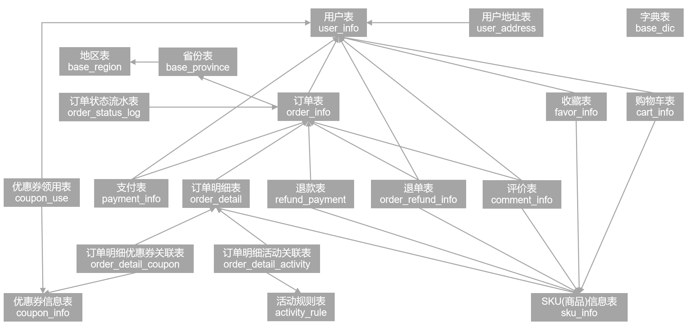
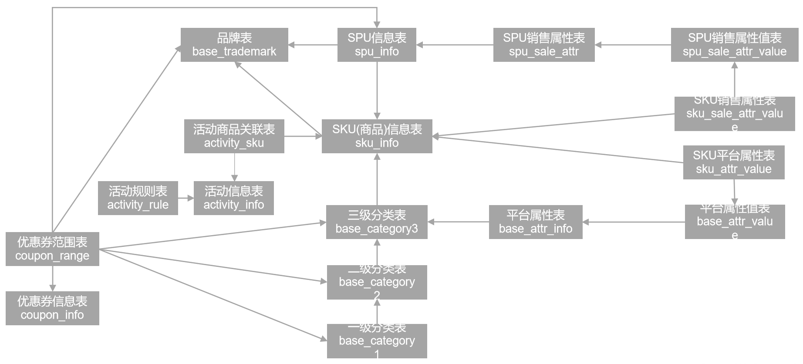
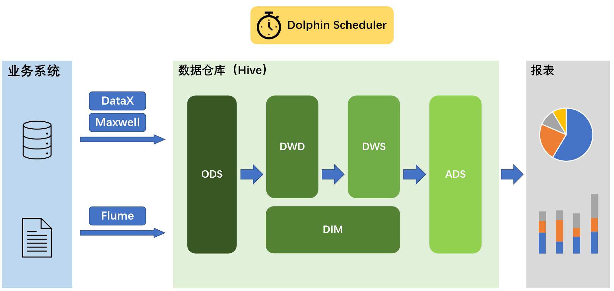
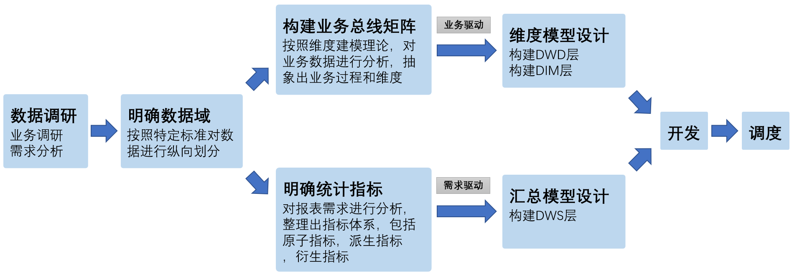
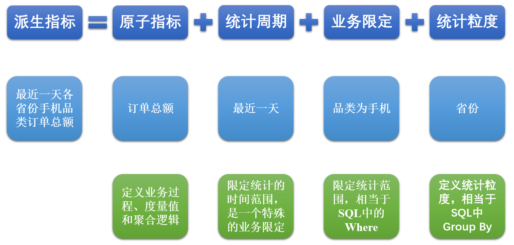
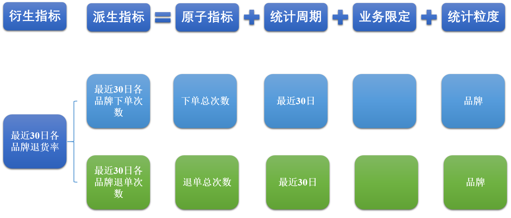
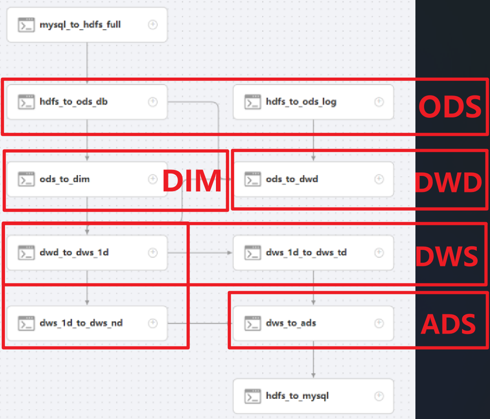

## 第三章 电商业务介绍

#### 1、简介

电商的业务流程可以以一个普通用户的浏览足迹为例进行说明，用户点开电商首页开始浏览，可能会通过分类查询也可能通过全文搜索寻找自己中意的商品，这些商品无疑都是存储在后台的管理系统中的。

当用户寻找到自己中意的商品，可能会想要购买，将商品添加到购物车后发现需要登录，登录后对商品进行结算，这时候购物车的管理和商品订单信息的生成都会对业务数据库产生影响，会生成相应的订单数据和支付数据。

订单正式生成之后，还会对订单进行跟踪处理，直到订单全部完成。

电商的主要业务流程包括用户前台浏览商品时的商品详情的管理，用户商品加入购物车进行支付时用户个人中心&支付服务的管理，用户支付完成后订单后台服务的管理，这些流程涉及到了十几个甚至几十个业务数据表，甚至更多。


#### 2、常识概念

**SKU**（Stock Keeping Unit，库存量基本单位）：现在已经被引申为产品统一编号的简称，每种产品均对应有唯一的SKU号。

**SPU**（Standard Product Unit）：是商品信息聚合的最小单位，是一组可复用、易检索的标准化信息集合。

> 简单说明就是商品是SKU，商品含属性是SPU，例如一台iPhone是一个SKU，但是64G版本和128G版本的iPhone是两个不同的SPU。

**平台属性：**相当于过滤条件，方便用户定位想要的产品参数。

**销售属性：**相当于商品属性，代表一个商品SPU的参数。


#### 3、业务数据关系图




#### 4、后台数据关系图



------


## 第四章 数据同步策略

| 同步策略     | 优点                           | 缺点                                                         |
| ------------ | ------------------------------ | ------------------------------------------------------------ |
| **全量同步** | 逻辑简单                       | 在某些情况下效率较低。例如某张表数据量较大，但是每天数据的变化比例很低，若对其采用每日全量同步，则会重复同步和存储大量相同的数据。 |
| **增量同步** | 效率高，无需同步和存储重复数据 | 逻辑复杂，需要将每日的新增及变化数据同原来的数据进行整合，才能使用 |

通常情况，业务表数据量比较大，优先考虑增量，数据量比较小，优先考虑全量；具体选择由数仓模型决定。

#### 0、同步工具

数据同步工具种类繁多，大致可分为两类，一类是以DataX、Sqoop为代表的基于Select查询的离线、批量同步工具，另一类是以Maxwell、Canal为代表的基于数据库数据变更日志（例如MySQL的binlog，其会实时记录所有的insert、update以及delete操作）的实时流式同步工具。

全量同步通常使用DataX、Sqoop等基于查询的离线同步工具。而增量同步既可以使用DataX、Sqoop等工具，也可使用Maxwell、Canal等工具，下面对增量同步不同方案进行简要对比。

| 增量同步方案       | DataX/Sqoop                                                  | Maxwell/Canal                                                |
| ------------------ | ------------------------------------------------------------ | ------------------------------------------------------------ |
| **对数据库的要求** | 原理是基于查询，故若想通过select查询获取新增及变化数据，就要求数据表中存在create_time、update_time等字段，然后根据这些字段获取变更数据。 | 要求数据库记录变更操作，例如MySQL需开启binlog。              |
| **数据的中间状态** | 由于是离线批量同步，故若一条数据在一天中变化多次，该方案只能获取最后一个状态，中间状态无法获取。 | 由于是实时获取所有的数据变更操作，所以可以获取变更数据的所有中间状态。 |

#### 1、全量同步

全量同步是指将源端数据全部同步到目标端，而不管数据是否发生变化。全量同步的优点是可以保证目标端数据的完整性，缺点是同步时间长，占用带宽大。全量同步一般用于首次同步或者源端数据发生重大变化时。

> 全量同步是对数据进行完整备份，一般消耗的资源大，速度慢。在没有建设数仓时，全量同步兼具了
>
> - 对变动较大的数据全量拷贝
> - 对建库前数据进行统计
>
> 的功能，简单来说就是：我在2023/3/30创建数据仓库，但是我本地存储了2023/3/1到2023/3/30的数据，这时候就需要全量同步到HDFS。
>
> 使用方式是使用DataX对需要进行全量同步的MySQL表进行拷贝到HDFS，DataX可以使用Reader/Writer机制将不同数据源的数据读出/写入，保证了格式的一致性。

#### 2、增量同步

增量同步是指在数据同步的过程中，只将新增或修改的数据进行同步。增量同步的优点是同步时间短，占用带宽小，缺点是需要保证全量同步已经完成，否则增量同步会出现数据不完整的情况。增量同步一般用于全量同步之后的增量更新。

> 增量同步一般对新增数据进行同步，针对两种同步举个简单的例子：一个快产快销的商店拥有每天不同的商品种类和相对稳定的用户群体，那么针对商品我们采取全量同步来维持正在售卖的最新状态（变动大）；而对于用户我们采取增量同步的方式记录用户信息，因为不会出现一天时间大量的用户改名之类的操作。
>
> 使用方式是Maxwell+Kafka+Flume的方式将数据从MySQL抽取到HDFS，简单讲述下就是：Maxwell伪装成MySQL的server从机使用主从复制的方式读取MySQL的binlog日志进行数据拷贝，同时在Kafka中注册topic监听Maxwell，Maxwell作为生产者发送数据给Kafka，在Flume中建立消费者程序消费这些数据到HDFS的inc增量表中。

------


## 第五章 数据仓库概述与建模

#### 1、概念

数据仓库是一个为数据分析而设计的企业级数据管理系统。数据仓库可集中、整合多个信息源的大量数据，借助数据仓库的分析能力，企业可从数据中获得宝贵的信息进而改进决策。同时，随着时间的推移，数据仓库中积累的大量历史数据对于数据科学家和业务分析师也是十分宝贵的。


#### 2、核心架构




#### 3、数据仓库建模方法论

###### （1）E-R模型

数据仓库之父Bill Inmon提出的建模方法是从全企业的高度，用实体关系（Entity Relationship，ER）模型来描述企业业务，并用规范化的方式表示出来，在范式理论上符合3NF。

- 实体关系模型

实体关系模型将复杂的数据抽象为两个概念——实体和关系。实体表示一个对象，例如学生、班级，关系是指两个实体之间的关系，例如学生和班级之间的从属关系。

- 数据库规范化

数据库规范化是使用一系列范式设计数据库（通常是关系型数据库）的过程，其目的是减少数据冗余，增强数据的一致性。

这一系列范式就是指在设计关系型数据库时，需要遵从的不同的规范。关系型数据库的范式一共有六种，分别是第一范式（1NF）、第二范式（2NF）、第三范式（3NF）、巴斯-科德范式（BCNF）、第四范式(4NF）和第五范式（5NF）。遵循的范式级别越高，数据冗余性就越低。

- 三范式
  - 函数依赖
    - 完全函数依赖：通过AB能得出C，但是AB单独得不出C，那么C完全依赖于AB
    - 部分函数依赖：通过AB能得出C，通过A或B也能得出C，那么C部分依赖于AB
    - 传递函数依赖：通过A得到B，通过B得到C，但是通过C得不到A，那么C传递依赖于A
  - 第一范式
    - 属性不可切割
    - 例：5台电脑 --> 5、电脑 -x->不可再分
  - 第二范式
    - 不能存在不分函数依赖
    - （简单来说就是分拆主键）
  - 第三范式
    - 不能存在传递函数依赖
    - （简单来说就是将具有两层关系【总三层+】的表分拆到不同表）
    - 例：学号\==学院\==院长，学号可以推出学院，学院可以推出院长，但是院长无法推出学生关系，所以应该分拆到两张表中。

**这种建模方法的出发点是整合数据，其目的是将整个企业的数据进行组合和合并，并进行规范处理，减少数据冗余性，保证数据的一致性。这种模型并不适合直接用于分析统计。**

###### （2）维度模型

维度模型将复杂的业务通过事实和维度两个概念进行呈现。事实通常对应业务过程，而维度通常对应业务过程发生时所处的环境。

**注：**业务过程可以概括为一个个不可拆分的行为事件，例如电商交易中的下单，取消订单，付款，退单等，都是业务过程。

**维度建模以数据分析作为出发点，为数据分析服务，因此它关注的重点的用户如何更快的完成需求分析以及如何实现较好的大规模复杂查询的响应性能。**

因此，我们通常的数仓建模采用的是维度建模。


## 第六章 维度建模

> 虽然尚硅谷的文档中将事实表放在了前面，但是不得不说，应该先介绍下维度表再讲解事实表，一方面是根据阿里系的《大数据之路》的介绍流程，另一方面是选用的五层建模中DIM层确实是在DWD层之前，因此更换下顺序方便阅读。

#### 1、维度表

###### （1）概述

维度表是维度建模的基础和灵魂。前文提到，事实表紧紧围绕业务过程进行设计，而维度表则围绕业务过程所处的环境进行设计。维度表主要包含一个主键和各种维度字段，维度字段称为维度属性。

###### （2）设计流程

- 确定维度（表）

  > - 原文这里是从事实表中得到的维度，但是如果优先创建维度表的话那么我们应该怎么创建呢？个人认为是根据以下几种方式创建维度：
  >   - 根据数据库表中的公有字段创建。例如：如果每张表中都有记录时间信息，那么一定会有时间维度。
  >   - 根据物理实体创建维度。例如：用户、商品是真实的实体，那么用户就有了用户维度、商品就有了商品维度。
  >   - 相似结果进行聚合。例如：一张表中同时具有几种语言、地区的编码格式，那么就可以将这几种编码进行聚合，形成地区维度/编码维度。**但是如果只有少量数据（比如一种编码），那么不必要单独创建一个维度，而是直接放进共用表/融入部分维度字段传递给事实表部分。**

- 确定主维表和相关维表
  
  - 此处的主维表和相关维表均指**业务系统**中与某维度相关的表。维度表的粒度通常与主维表相同。
- 确定维度属性
  - 确定维度属性即确定维度表字段。维度属性主要来自于业务系统中与该维度对应的主维表和相关维表。维度属性可直接从主维表或相关维表中选择，也可通过进一步加工得到。
    - 尽可能生成丰富的维度属性
    - 尽量不使用编码，而使用明确的文字说明，一般可以编码和文字共存
    - 尽量沉淀出通用的维度属性

###### （3）规范化和反规范化

**规范化**是指使用一系列范式设计数据库的过程，其目的是减少数据冗余，增强数据的一致性。通常情况下，规范化之后，一张表的字段会拆分到多张表。

**反规范化**是指将多张表的数据冗余到一张表，其目的是减少join操作，提高查询性能。

在设计维度表时，如果对其进行规范化，得到的维度模型称为雪花模型，如果对其进行反规范化，得到的模型称为星型模型。

###### （4）维度变化

维度属性通常不是静态的，而是会随时间变化的，数据仓库的一个重要特点就是反映历史的变化，所以如何保存维度的历史状态是维度设计的重要工作之一。保存维度数据的历史状态，通常有以下两种做法，分别是全量快照表和拉链表。

- 全量快照表

  - **优点**是简单而有效，开发和维护成本低，且方便理解和使用。
  - **缺点**是浪费存储空间，尤其是当数据的变化比例比较低时。

- 拉链表

  - **什么是拉链表？**拉链表记录每一条数据的生命周期，一旦一条数据的生命周期结束，就重新开始一条新的记录，并把当前日期放入生效开始日期。

    例：以小艾改名小艾同学为例，在用户维度表中会有以下变化：

    | 用户ID | 姓名     | 开始日期   | 结束日期   |
    | ------ | -------- | ---------- | ---------- |
    | 1      | 小艾     | 2020-06-18 | 2023-03-30 |
    | 1      | 小艾同学 | 2023-03-30 | 9999-12-31 |

    > 可以看出，拉链表中ID不会作为主键，所有相同ID共同记录了一个用户的数据变更，不同于全量快照表，拉链表比较麻烦的是：
    >
    > - 需要对修改数据维护一个结束时间，并插入新状态和时间
    > - 需要对新插入数据维护一个结束日期（一般采用单独缓存表/固定字段维护）

  - 拉链表适合于：数据会发生变化，但是变化频率并不高的维度（缓慢变化维）

###### （5）多值维度 && 多值属性的解决

- 多值维度
  - 如果事实表中一条记录在某个维度表中有多条记录与之对应，称为多值维度。解决方案：
    - 降低事实表的粒度，例如将订单事实表的粒度由一个订单降低为一个订单中的一个商品项。**（建议）**
    - 在事实表中采用多字段保存多个维度值，每个字段保存一个维度id。这种方案只适用于多值维度个数固定的情况。

- 多值属性
  - 维表中的某个属性同时有多个值，称之为“多值属性”。解决方案：
    - 将多值属性放到一个字段，该字段内容为key1:value1，key2:value2的形式，例如一个手机商品的平台属性值为“品牌:华为，系统:鸿蒙，CPU:麒麟990”。
    - 将多值属性放到多个字段，每个字段对应一个属性。这种方案只适用于多值属性个数固定的情况。


#### 2、事实表

###### （1）概述

事实表作为数据仓库维度建模的核心，紧紧围绕着业务过程来设计。其包含与该业务过程有关的维度引用（维度表外键）以及该业务过程的度量（通常是可累加的数字类型字段）。事实表具有如下特点：

- 事实表通常比较“细长”，即列较少，但行较多，且行的增速快。

###### （2）分类

- 事务型事实表

  - 事务型事实表用来记录各业务过程，它保存的是各业务过程的原子操作事件，即最细粒度的操作事件。粒度是指事实表中一行数据所表达的业务细节程度。

    事务型事实表可用于分析与各业务过程相关的各项统计指标，由于其保存了最细粒度的记录，可以提供最大限度的灵活性，可以支持无法预期的各种细节层次的统计需求。

  - **设计流程：**选择业务过程→声明粒度→确认维度→确认事实

  - **不足：**事务型事实表可以保存所有业务过程的最细粒度的操作事件，故理论上其可以支撑与各业务过程相关的各种统计粒度的需求。但对于某些特定类型的需求，其逻辑可能会比较复杂，或者效率会比较低下。

    - 存量型指标
    - 多事务关联统计

- 周期型快照事实表
  - 周期快照事实表以具有规律性的、可预见的时间间隔来记录事实，主要用于分析一些存量型（例如商品库存，账户余额）或者状态型（空气温度，行驶速度）指标。
  - **设计流程**
    - 确定粒度
    - 确定事实
  - **事实类型：**事实类型是指度量值的类型
    - 可加事实：可以按照与事实表相关的所有维度进行累加，例如事务型事实表中的事实
    - 半可加事实：只能按照与事实表相关的一部分维度进行累加，例如周期型快照事实表中的事实。
    - 不可加事实：完全不具备可加性，例如比率型事实。

- 累积型快照事实表
  - 累计快照事实表是基于一个业务流程中的多个关键业务过程联合处理而构建的事实表，如交易流程中的下单、支付、发货、确认收货业务过程。累积型快照事实表主要用于分析业务过程（里程碑）之间的时间间隔等需求。
  - **设计流程：**选择业务过程→声明粒度→确认维度→确认事实

------


## 第七章 数据仓库设计与开发

#### 1、构建流程



#### 2、统计指标概述

###### （1）指标体系相关概念

- 原子指标：基于某一**业务过程**的**度量值**，是业务定义中不可再拆解的指标，原子指标的核心功能就是对指标的**聚合逻辑**进行了定义。我们可以得出结论，原子指标包含三要素，分别是业务过程、度量值和聚合逻辑。

- 派生指标
  - 

- 衍生指标：在一个或多个派生指标的基础上，通过各种逻辑运算复合而成的。例如比率、比例等类型的指标。衍生指标也会对应实际的统计需求。
  - 

###### （2）指标体系对于数仓建模的意义

绝大多数的统计需求，都可以使用原子指标、派生指标以及衍生指标这套标准去定义。同时能够发现这些统计需求都直接的或间接的对应一个或者是多个派生指标。

当统计需求足够多时，必然会出现部分统计需求对应的派生指标相同的情况。这种情况下，我们就可以考虑将这些公共的派生指标保存下来，这样做的主要目的就是减少重复计算，提高数据的复用性。

这些公共的派生指标统一保存在数据仓库的DWS层。因此DWS层设计，就可以参考我们根据现有的统计需求整理出的派生指标。


#### 3、数仓分层

> 下面给出数据流转的脚本图并进行简单讲解
>
> 
>
> - ODS层是源数据的汇总，因此可以看到有HDFS中的业务数据（log）和后台数据（db）的集合，HDFS收集不同的数据来源/全量与增量数据，在ODS中汇合。
> - 一般后台数据是持久化到数据库的，变动的数据量并不大且通常为物理实体，所以一般作为全量备份，满足我之前说的维度表设计方式，所以使用db中的数据作为DIM层。
> - DWD作为明细数据，就是将业务数据进行“解包”操作，本来业务数据（log）是一块一块的，粒度比较高，这是时候就在DWD中拆分成粒度更小的数据库表，同样后台数据（db）也有部分数据是可以更好地描述数据状态（根据DWD需求，明细表最好是中文，能直接看懂的），所以同样将需要的DIM纳入DWD层。
> - DWS汇总数据层则是将DIM和DWD的数据以主题的形式进行汇总，这个时候DWS层的数据就是ADS的大表形式，可以说是对于粒度相同、相似的ADS需求将DIM、DWD数据表进行聚合。
> - ADS就是最终BI业务需求的展示表，表结构和形式不需要再修改（空值等之类的格式问题不在此列），能够实现导出之后一张表就是一个数据监控。

之后会详细介绍每个表的建表格式和数据装载，每一层举一个例子。


###### （1）ODS层（Operation Data Store，原始数据层）

存储未处理过的原始数据，结构上与源数据保持一致，是数据仓库的数据准备区。

ODS层的设计要点如下：

- ODS层的表结构设计依托于从业务系统同步过来的数据结构。
- ODS层要保存全部历史数据，故其压缩格式应选择压缩比较高的，此处选择gzip。
- ODS层表名的命名规范为：ods\_表名\_单分区增量全量标识（inc/full）。

> ODS层的数据就是增量/全量同步过来的原生数据，并对格式进行统一。将全量表和增量表从HDFS转到Hive。

【1】建表

```sql
-- 活动信息表（全量表）
DROP TABLE IF EXISTS ods_activity_info_full;
CREATE EXTERNAL TABLE ods_activity_info_full
(
    `id`            STRING COMMENT '活动id',
    `activity_name` STRING COMMENT '活动名称',
    `activity_type` STRING COMMENT '活动类型',
    `activity_desc` STRING COMMENT '活动描述',
    `start_time`    STRING COMMENT '开始时间',
    `end_time`      STRING COMMENT '结束时间',
    `create_time`   STRING COMMENT '创建时间'
) COMMENT '活动信息表'
    PARTITIONED BY (`dt` STRING)
    ROW FORMAT DELIMITED FIELDS TERMINATED BY '\t'
    NULL DEFINED AS ''
    LOCATION '/warehouse/gmall/ods/ods_activity_info_full/';
    
-- 第一部分是删除表的语句，如果表不存在则不执行删除操作。
-- 第二部分是创建一个外部表，名为ods_activity_info_full，包含id、activity_name、activity_type、activity_desc、start_time、end_time和create_time等字段。这个表的注释是“活动信息表”，按照dt字段进行分区。
-- 外部表是指在Hive中定义的表，但是数据并不存储在Hive中，而是存储在其他地方（如HDFS或HBase）中。外部表的数据可以被多个Hive表共享。
-- 分区是指将数据按照某个字段进行划分，以便更快地查询数据。在这个例子中，按照dt字段进行分区。
-- ROW FORMAT DELIMITED FIELDS TERMINATED BY '\t'是指使用制表符（\t）作为字段分隔符。在这个例子中，数据文件中的每一行都是一个记录，每个字段之间用制表符分隔。这个语句告诉Hive如何解析数据文件中的每一行。
```

【2】数据装载

```sql
load data inpath '/origin_data/gmall/db/activity_info_full/2023-03-30' OVERWRITE into table gmall.ods_activity_info_full partition(dt='2023-03-30');
-- 将`/origin_data/gmall/db/activity_info_full/2023-03-30`目录下的数据加载到名为`gmall.ods_activity_info_full`的Hive表中，分区字段为`dt`，值为`2023-03-30`。如果表中已经存在相同分区的数据，则会覆盖原有数据。
```


###### （2）DIM层（Dimension，公共维度层）

基于维度建模理论进行构建，**存放维度模型中的维度表**，保持一致性维度信息。

DIM层设计要点：

- DIM层的设计依据是维度建模理论，该层存储维度模型的维度表。

- DIM层的数据存储格式为orc列式存储+snappy压缩。

- DIM层表名的命名规范为dim\_表名\_全量表或者拉链表标识（full/zip）

【1】建表

```sql
-- 商品维度表
DROP TABLE IF EXISTS dim_sku_full;
CREATE EXTERNAL TABLE dim_sku_full
(
    `id`                   STRING COMMENT 'sku_id',
    `price`                DECIMAL(16, 2) COMMENT '商品价格',
    `sku_name`             STRING COMMENT '商品名称',
    `sku_desc`             STRING COMMENT '商品描述',
    `weight`               DECIMAL(16, 2) COMMENT '重量',
    `is_sale`              BOOLEAN COMMENT '是否在售',
    `spu_id`               STRING COMMENT 'spu编号',
    `spu_name`             STRING COMMENT 'spu名称',
    `category3_id`         STRING COMMENT '三级分类id',
    `category3_name`       STRING COMMENT '三级分类名称',
    `category2_id`         STRING COMMENT '二级分类id',
    `category2_name`       STRING COMMENT '二级分类名称',
    `category1_id`         STRING COMMENT '一级分类id',
    `category1_name`       STRING COMMENT '一级分类名称',
    `tm_id`                STRING COMMENT '品牌id',
    `tm_name`              STRING COMMENT '品牌名称',
    `sku_attr_values`      ARRAY<STRUCT<attr_id :STRING,value_id :STRING,attr_name :STRING,value_name:STRING>> COMMENT '平台属性',
    `sku_sale_attr_values` ARRAY<STRUCT<sale_attr_id :STRING,sale_attr_value_id :STRING,sale_attr_name :STRING,sale_attr_value_name:STRING>> COMMENT '销售属性',
    `create_time`          STRING COMMENT '创建时间'
) COMMENT '商品维度表'
    PARTITIONED BY (`dt` STRING)
    STORED AS ORC
    LOCATION '/warehouse/gmall/dim/dim_sku_full/'
    TBLPROPERTIES ('orc.compress' = 'snappy');
    
-- 数据存储格式为orc列式存储+snappy压缩
```

【2】数据装载

```sql
with
sku as
(
    select
        id,
        price,
        sku_name,
        sku_desc,
        weight,
        is_sale,
        spu_id,
        category3_id,
        tm_id,
        create_time
    from ods_sku_info_full
    where dt='2023-03-30'
),
spu as
(
    select
        id,
        spu_name
    from ods_spu_info_full
    where dt='2023-03-30'
),
c3 as
(
    select
        id,
        name,
        category2_id
    from ods_base_category3_full
    where dt='2023-03-30'
),
c2 as
(
    select
        id,
        name,
        category1_id
    from ods_base_category2_full
    where dt='2023-03-30'
),
c1 as
(
    select
        id,
        name
    from ods_base_category1_full
    where dt='2023-03-30'
),
tm as
(
    select
        id,
        tm_name
    from ods_base_trademark_full
    where dt='2023-03-30'
),
attr as
(
    select
        sku_id,
        collect_set(named_struct('attr_id',attr_id,'value_id',value_id,'attr_name',attr_name,'value_name',value_name)) attrs
    from ods_sku_attr_value_full
    where dt='2023-03-30'
    group by sku_id
),
sale_attr as
(
    select
        sku_id,
        collect_set(named_struct('sale_attr_id',sale_attr_id,'sale_attr_value_id',sale_attr_value_id,'sale_attr_name',sale_attr_name,'sale_attr_value_name',sale_attr_value_name)) sale_attrs
    from ods_sku_sale_attr_value_full
    where dt='2023-03-30'
    group by sku_id
)
insert overwrite table dim_sku_full partition(dt='2023-03-30')
select
    sku.id,
    sku.price,
    sku.sku_name,
    sku.sku_desc,
    sku.weight,
    sku.is_sale,
    sku.spu_id,
    spu.spu_name,
    sku.category3_id,
    c3.name,
    c3.category2_id,
    c2.name,
    c2.category1_id,
    c1.name,
    sku.tm_id,
    tm.tm_name,
    attr.attrs,
    sale_attr.sale_attrs,
    sku.create_time
from sku
left join spu on sku.spu_id=spu.id
left join c3 on sku.category3_id=c3.id
left join c2 on c3.category2_id=c2.id
left join c1 on c2.category1_id=c1.id
left join tm on sku.tm_id=tm.id
left join attr on sku.id=attr.sku_id
left join sale_attr on sku.id=sale_attr.sku_id;
```


###### （3）DWD层（Data Warehouse Detail，明细数据层）

基于维度建模理论进行构建，**存放维度模型中的事实表**，保存各业务过程中最小粒度的操作记录。

DWD层设计要点：

- DWD层的设计依据是维度建模理论，该层存储维度模型的事实表。
- DWD层的数据存储格式为orc列式存储+snappy压缩。
- DWD层表名的命名规范为dwd\_数据域\_表名\_单分区增量全量标识（inc/full）

【1】建表

```sql
-- 交易域加购事务事实表
DROP TABLE IF EXISTS dwd_trade_cart_add_inc;
CREATE EXTERNAL TABLE dwd_trade_cart_add_inc
(
    `id`               STRING COMMENT '编号',
    `user_id`          STRING COMMENT '用户id',
    `sku_id`           STRING COMMENT '商品id',
    `date_id`          STRING COMMENT '时间id',
    `create_time`      STRING COMMENT '加购时间',
    `source_id`        STRING COMMENT '来源类型ID',
    `source_type_code` STRING COMMENT '来源类型编码',
    `source_type_name` STRING COMMENT '来源类型名称',
    `sku_num`          BIGINT COMMENT '加购物车件数'
) COMMENT '交易域加购物车事务事实表'
    PARTITIONED BY (`dt` STRING)
    ROW FORMAT DELIMITED FIELDS TERMINATED BY '\t'
    STORED AS ORC
    LOCATION '/warehouse/gmall/dwd/dwd_trade_cart_add_inc/'
    TBLPROPERTIES ('orc.compress' = 'snappy');
```

【2】数据装载

```sql
-- 设置Hive分区模式为不严格
set hive.exec.dynamic.partition.mode=nonstrict;
insert overwrite table dwd_trade_cart_add_inc partition (dt)
select
    id,
    user_id,
    sku_id,
    date_format(create_time,'yyyy-MM-dd') date_id,
    create_time,
    source_id,
    source_type,
    dic.dic_name,
    sku_num,
    date_format(create_time, 'yyyy-MM-dd')
from
(
    select
        data.id,
        data.user_id,
        data.sku_id,
        data.create_time,
        data.source_id,
        data.source_type,
        data.sku_num
    from ods_cart_info_inc
    where dt = '2023-03-30'
    and type = 'bootstrap-insert'  -- 设置类型为“全量插入” 
)ci
left join
(
    select
        dic_code,
        dic_name
    from ods_base_dic_full
    where dt='2023-03-30'
    and parent_code='24'
)dic
on ci.source_type=dic.dic_code;
```


###### （4）DWS层（Data Warehouse Summary，汇总数据层）

基于上层的指标需求，以分析的主题对象作为建模驱动，构建公共统计粒度的汇总表。

设计要点：

- DWS层的设计参考指标体系。

- DWS层的数据存储格式为ORC列式存储 + snappy压缩。

- DWS层表名的命名规范为dws\_数据域\_统计粒\_业务过程\_统计周期（1d/nd/td）

注：1d表示最近1日，nd表示最近n日，td表示历史至今。

【1】建表

```sql
-- 交易域用户商品粒度订单最近1日汇总表
DROP TABLE IF EXISTS dws_trade_user_sku_order_1d;
CREATE EXTERNAL TABLE dws_trade_user_sku_order_1d
(
    `user_id`                   STRING COMMENT '用户id',
    `sku_id`                    STRING COMMENT 'sku_id',
    `sku_name`                  STRING COMMENT 'sku名称',
    `category1_id`              STRING COMMENT '一级分类id',
    `category1_name`            STRING COMMENT '一级分类名称',
    `category2_id`              STRING COMMENT '一级分类id',
    `category2_name`            STRING COMMENT '一级分类名称',
    `category3_id`              STRING COMMENT '一级分类id',
    `category3_name`            STRING COMMENT '一级分类名称',
    `tm_id`                     STRING COMMENT '品牌id',
    `tm_name`                   STRING COMMENT '品牌名称',
    `order_count_1d`            BIGINT COMMENT '最近1日下单次数',
    `order_num_1d`              BIGINT COMMENT '最近1日下单件数',
    `order_original_amount_1d`  DECIMAL(16, 2) COMMENT '最近1日下单原始金额',
    `activity_reduce_amount_1d` DECIMAL(16, 2) COMMENT '最近1日活动优惠金额',
    `coupon_reduce_amount_1d`   DECIMAL(16, 2) COMMENT '最近1日优惠券优惠金额',
    `order_total_amount_1d`     DECIMAL(16, 2) COMMENT '最近1日下单最终金额'
) COMMENT '交易域用户商品粒度订单最近1日汇总事实表'
    PARTITIONED BY (`dt` STRING)
    STORED AS ORC
    LOCATION '/warehouse/gmall/dws/dws_trade_user_sku_order_1d'
    TBLPROPERTIES ('orc.compress' = 'snappy');
```

【2】数据装载

```sql
set hive.exec.dynamic.partition.mode=nonstrict;
insert overwrite table dws_trade_user_sku_order_1d partition(dt)
select
    user_id,
    id,
    sku_name,
    category1_id,
    category1_name,
    category2_id,
    category2_name,
    category3_id,
    category3_name,
    tm_id,
    tm_name,
    order_count_1d,
    order_num_1d,
    order_original_amount_1d,
    activity_reduce_amount_1d,
    coupon_reduce_amount_1d,
    order_total_amount_1d,
    dt
from
(
    select
        dt,
        user_id,
        sku_id,
        count(*) order_count_1d,
        sum(sku_num) order_num_1d,
        sum(split_original_amount) order_original_amount_1d,
        sum(nvl(split_activity_amount,0.0)) activity_reduce_amount_1d,
        sum(nvl(split_coupon_amount,0.0)) coupon_reduce_amount_1d,
        sum(split_total_amount) order_total_amount_1d
    from dwd_trade_order_detail_inc
    group by dt,user_id,sku_id
)od
left join
(
    select
        id,
        sku_name,
        category1_id,
        category1_name,
        category2_id,
        category2_name,
        category3_id,
        category3_name,
        tm_id,
        tm_name
    from dim_sku_full
    where dt='2020-06-14'
)sku
on od.sku_id=sku.id;
```


###### （5）ADS层（Application Data Service，数据应用层）

| 统计周期     | 统计粒度 | 指标               | 说明                       |
| ------------ | -------- | ------------------ | -------------------------- |
| 最近1/7/30日 | 渠道     | 访客数             | 统计访问人数               |
| 最近1/7/30日 | 渠道     | 会话平均停留时长   | 统计每个会话平均停留时长   |
| 最近1/7/30日 | 渠道     | 会话平均浏览页面数 | 统计每个会话平均浏览页面数 |
| 最近1/7/30日 | 渠道     | 会话总数           | 统计会话总数               |
| 最近1/7/30日 | 渠道     | 跳出率             | 只有一个页面的会话的比例   |

【1】建表

```sql
-- 各渠道流量统计
DROP TABLE IF EXISTS ads_traffic_stats_by_channel;
CREATE EXTERNAL TABLE ads_traffic_stats_by_channel
(
    `dt`               STRING COMMENT '统计日期',
    `recent_days`      BIGINT COMMENT '最近天数,1:最近1天,7:最近7天,30:最近30天',
    `channel`          STRING COMMENT '渠道',
    `uv_count`         BIGINT COMMENT '访客人数',
    `avg_duration_sec` BIGINT COMMENT '会话平均停留时长，单位为秒',
    `avg_page_count`   BIGINT COMMENT '会话平均浏览页面数',
    `sv_count`         BIGINT COMMENT '会话数',
    `bounce_rate`      DECIMAL(16, 2) COMMENT '跳出率'
) COMMENT '各渠道流量统计'
    ROW FORMAT DELIMITED FIELDS TERMINATED BY '\t'
    LOCATION '/warehouse/gmall/ads/ads_traffic_stats_by_channel/';
```

【2】数据装载

```sql
insert overwrite table ads_traffic_stats_by_channel
select * from ads_traffic_stats_by_channel
union
select
    '2020-06-14' dt,
    recent_days,
    channel,
    cast(count(distinct(mid_id)) as bigint) uv_count,
    cast(avg(during_time_1d)/1000 as bigint) avg_duration_sec,
    cast(avg(page_count_1d) as bigint) avg_page_count,
    cast(count(*) as bigint) sv_count,
    cast(sum(if(page_count_1d=1,1,0))/count(*) as decimal(16,2)) bounce_rate
from dws_traffic_session_page_view_1d lateral view explode(array(1,7,30)) tmp as recent_days
where dt>=date_add('2023-03-30',-recent_days+1)
group by recent_days,channel;
```

