## 音乐生成的人工智能综述：智能体、领域和前景

#### Carlos Hernandez-Olivan, Javier Hernandez-Olivan, and Jose R. Beltran

#### Department of Electronic Engineering and Communications, University of Zaragoza, Calle Mar´ıa de Luna 3 50018, Zaragoza

> **观后简言：**
>
> 哇哇哇！终于看完第一篇了，选择这篇作为我的入门论文属于是挑对了又挑得不对：挑得不对是因为这第一篇实在是太长了，从 7 月 8 号开始开新坑到今天已经 8 月 17 号了，足足看了 40 天（虽然中间一度搁置），但是不得不说这一篇反而是最适合新手入门的。基本上不介绍任何硬核技术相关，主要是讲述目前音乐生成领域的发展情况以及做音乐生成的主流思想。有兴趣的一定要重点看下第六节【模型】，涵盖了基本上需要考虑的参数方向。
>
> 虽然中间一段时间没看，但是反而是因为自己有些想法所以去尝试实现了，刚巧就在看完第五节的时候。我从自己的角度出发，构思了一个简易的音乐生成流程，并在和 ChatGPT 的对话中不断完善、推理中间的一些详细的过程。具体可以参考我新建的项目 [MusicInitial](https://github.com/Alexie-Z-Yevich/MusicInitial)，不过目前并没有把详细想法都直白的展示出来。但是有了个自己设计的过程再回头看第六节，就有了一种茅塞顿开的感觉，也是后面忽然高强度把这篇论文看完的原因（前面写得确实一般般啦~）
>
> 因此，建议大家看完第五节之后也去自己构思一下如何设计一个音乐生成流程，至少要明确你想要的音乐需要些什么参数，有需要生成什么内容。一次看完反而容易忘，同时针对想要深化的方向再去找相应的论文。（不要一开始像我一样找了 6 篇，应该根据每篇的感受不断去细化自己的方向）。不过之后的几篇都会稍短不少，所以既然找了还是会看完的。图快的 homie 可以根据我每篇的观后简言快速定位emmm不过需要有那么多量才行。
>
> 总之，这篇是非常推荐的啦！

#### 1、引言

音乐生成是音乐信息检索的一个研究领域，旨在生成新的音乐。由于最近的深度学习（DL）模型能够生成更长的相干序列，因此该领域受到了广泛关注。在图像生成领域，新的深度生成模型（如 Open  AI 的 Dalle 2 或 Stability 的 Stable  Diffusion）。AI的演变和发布吸引了更多的用户，不仅是模型本身，而且其生成的其他部分，如人机交互，成为基于AI的工具开发的关键部分。

有许多公司，如索尼、谷歌 Magenta 项目或 Spotify，以及致力于新音乐制作和生成技术以及音乐推荐系统的初创公司。这种对音乐生成的兴趣的一个证明是组织研讨会、讲座和比赛，例如从 2020 年开始每年举行的人工智能歌曲大赛，2022 年共有 46 支队伍参加。

要理解和比较音乐生成系统，就必须了解人类是如何感知、理解和创作音乐的。人类对音乐的理解和感知取决于多种因素。文化背景、音乐知识和作曲家的创造力是人类音乐创作的主要特征。创作的一种方式是发展作曲家的初步想法。这个想法不仅包含象征性的或与乐谱相关的音乐原则，还包含音色或动态等表演属性，尤其是如果作曲家是一位经验丰富的音乐家。最初想法的延续是由作曲家在创作音乐作品时所做的决定来指导的。基于分析和聆听作曲家职业生涯中获得的许多音乐片段，即经验，根据先前的知识做出的决定。这意味着，如果我们将这一过程与基于人工智能的音乐生成进行比较，那么这项任务涉及更多的MIR领域，如乐器分类或自动和弦识别（ACR）。研究和分析与音乐原理相关的其他特征可能是建立一个完整的人工智能音乐创作框架的必要条件，我们可以将其命名为通用音乐机器。这种通用模型可以基于多模式深度学习和过去通用的智能体（如 GATO）。在音乐领域，已经证明预先训练的模型可以帮助改进其他任务。这种技术节省了资源和训练时间，是通用符号音乐理解模型的第一步。尽管该领域正在朝着构建具有大量可学习参数的深度学习模型的方向发展，但音乐语言已经定义了可以与这些模型相结合的规则，以实现这种广义模型。就一首音乐的生成而言，对长期结构进行建模仍然是一个开放的研究领域，因为与文本不同，音乐依赖于相互依赖的两个轴（音高和时间）。实现这一点的一种方法是融合符号人工智能和深度学习模型，在符号人工智能中可以定义这些规则，深度学习模型可以像人类创作音乐时那样学习组合这些规则。这些符号规则的例子是一些音乐定义，例如属于某个和弦的音符，即C大三和弦中的 C、e 和 G。

基于人工智能的音乐生成过程取决于上述因素之外的其他因素，必须考虑到基于人工智能创作工作中每个代理可能出现的偏见。我们将在本文中讨论人类和人工智能作曲过程之间的相似之处，然而，在对音乐的理解和感知方面，人类和机器之间存在很大差距。

在音乐领域，选择的作曲过程或技巧将取决于我们正在使用的音乐风格。如同人类需要一些先验知识才能创作旋律，人工智能也需要接受大量旋律的训练才能从中学习。然而，当涉及到创作复杂的作品时，除了像莫扎特这样天生具有音乐能力的天才音乐家之外，人类需要强大的音乐知识来发展一首音乐的和声、结构和乐器。因此，人类和人工智能在音乐创作过程中可能有一些相似之处。不同之处在于不同的学习过程以及人类的创造力或推断能力。加德纳的多元智能理论将音乐视为人的七种智能之一。他将音乐智力定义为产生和欣赏节奏、音高和音色的能力，或对音乐表现形式的理解。但是，创作音乐的能力来自哪里？这种能力在大脑中的位置是什么？自主机器架构如何学习和理解音乐，使其像人类一样具有创造性？我们将在本文中介绍这些概念，并将其与为音乐生成提出的人工智能模型进行比较。基于人工智能的音乐生成可以从不同的角度进行研究。Briot 等人提出的分类基于五个维度：

- Input domain. Symbolic or audio. （输入域；符号或音频挑战）
- Model architecture. Sequence models, generative adversarial networks, etc. （模型架构。序列模型、生成对抗性网络等）
- Generation. Autoregression, etc. （自回归等）
- Purpose. Melody generation, harmonization, improvisation, etc. （旋律的生成、协调、即兴创作等）
- Output-s nature. Monophonic, polyphonic melodies with or without chords, multi-instrument music. （自然界的声音；单音、复调旋律，带或不带和弦，多乐器音乐）
- Challenge. Human-computer interaction.（人机交互）

在本文中，我们将首先概述人类和基于人工智能的构图过程之间的差异。然后，我们将介绍音乐创作工作中涉及的代理，例如迄今为止一直用于了解我们所处的位置、这一研究方向以及有待解决的挑战的最先进的数据集、模型和算法。请注意，这些代理可以外推到其他类型的人工智能艺术生成。在图1中，我们介绍了基于人工智能的音乐生成工作流程中最重要的部分。工作流程可以定义如下：我们选择一个领域（音频或符号音乐），我们希望专注于该领域，并对涉及该领域的音乐原理有一些了解。在选择了领域后，我们可以开始描述我们将在本文的每一节中讨论的代理，从我们训练模型到最终用户的数据开始，最终用户使用音乐生成器制作的最终产品。请注意，每个代理都应该进行评估，然而，在本文中，我们将只描述模型——评估依赖于它们生成的输出。在测量输出时，我们需要音乐原理。最后，与用户的互动或开发该技术的团队的经验可以带来音乐生成的新应用，这些应用可以在任何领域。在图1中，我们还展示了在行业应用程序中开发的管道。

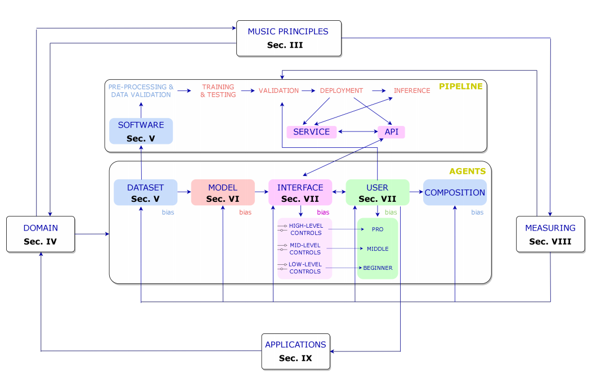

【图1：基于人工智能的合成工作流中代理之间关系的一般模式。该图显示了这项工作的不同部分，其中介绍了每一个元素。】

###### A.论文结构

本文基于作为音乐生成系统一部分的代理组织如下：在第二节中，我们比较了基于人类和人工智能的音乐生成模型；在第三节中，介绍了音乐原理；在第四节中，引入并比较了音乐生成中的两大领域：音频和符号音乐；在第五节中，我们概述了该领域中用于音频和符号领域的数据集；在第六节中，介绍了用于构建音乐生成技术的模型和架构；在第七节中，讨论并介绍了该领域提出的人机交互工作；在第八节中，我们介绍了如何从主观和客观角度对这些模型进行评估；在第九节中，介绍了在该领域获得关注的进一步工作和研究；在第十节中，讨论了基于人工智能的音乐生成的过去、现在和未来；最后在第十一节中我们给出了总结。

#### 2、基于人工智能的音乐生成

了解人类大脑对于开发能够模仿认知过程的人工智能工具非常重要。NeuroAI旨在研究这些过程以提供和改进人工智能模型的领域。更好地了解人类大脑可能有助于构建创造性的人工智能工具，这些工具能够像人类一样进行推断并发挥创造性。关于基于人工智能的模型，一个大问题是它们的创造力，但创造力意味着什么？我们如何衡量它，它来自哪里？在本节中，我们介绍了创造力的概念，并概述了人类如何理解和创作音乐。

###### A.创造力的概念

Amabile 将创造力定义为“产生有价值的、有用的或令人满意的新作品的过程”。创造力的概念可以从三个不同的角度来看待：产品、产生产品的身份和过程。Amabile 对创造力的一致定义是：“……创造性可以被视为产品的质量或由合适的观察者判断为具有创意的，也可以被视是这样判断的东西产生的过程。这个定义是基于最终产品，而不是基于产生这种创造力的过程或身份。将这些定义代入到音乐领域中可知，如果新音乐被一群人接受，即被我们社会的一部分人接受，那么它可以被视为一个创造性的过程。根据这些定义，我们可以认为，如果社会接受基于人工智能的音乐，并发现它对一些事情有益，那么它可以被认为是创造性的。当谈到机器制造的艺术时，我们还可以将 Colton 和 Wiggings 定义的计算创造力的概念定义为“计算系统的科学、工程和哲学，通过承担特定的责任，表现出公正的观察者认为具有创造性的行为”。更具体地说，在MIR领域中，有一个音乐生成的子领域旨在研究和计算模拟机器创造力。这个领域被称为音乐元创作（MuMe）。

###### B.量化创造力

研究人员试图用三种不同的技术来量化创造力：进行客观或主观分析，以及使用创造力测试。在基于人工智能的音乐生成或创作领域，量化生成的作品质量的最常用技术是图灵测试或一项与创造力测试有点接近的调查。Amabile 提到，由于创造力测试中可以评估的能力范围很窄，因此认为测试得到假定的创造力一般指标是不合适的。Ada Lovelace提出了一些衡量机器创造力的问题，Boden将这些问题总结为 Lovelace 问题，现在演变成了 Lovelace 创造力测试（LT）。LT比图灵测试更难通过，因为算法（被询问者）必须欺骗程序员（询问者）。在旨在产生新音乐的人工智能研究领域，通常通过主观测试来测量结果，这并不总是可靠的，因为结果取决于人群的文化和背景。我们将在第八节介绍一些已经提出了的客观评估措施，用来填补主观评估无法填补的空白，但在这一领域仍有很大的改进空间。

###### C.音乐是一种语言形式

尽管一些音乐学家由于其主观性而不将音乐视为一种语言，但另一些人则认为音乐的结构元素与其他语言之间存在联系。 Sloboda 声称“音乐语言可以像任何其他语言一样，在结构层面上被理解”。音乐通过诸如和声、节奏或音色的音乐元素唤起情感。如果我们认为音符或音符的属性是字符或单词，并将这种关系扩展到其他音乐元素，我们可以将音乐编码为文本，并将自然语言处理（NLP）技术应用于音乐。通过建立这两种结构之间的关系，我们可以将现有的语言生成模型应用于音乐生成。

大脑中负责语言理解和解释的区域是位于左半球的韦尼克区（或后言语区）。已经表明，大脑在下一个单词出现之前自发地参与预测，而不需要明确的指令。这正是深度语言自回归模型（DLMs）所做的，从而表明 DLMs 和人类对下一个单词的预测在自然环境中是相似的。另一方面，根据 Platel 等人的研究，不同的音乐相关功能也归因于大脑的这一部分。例如节奏、时间和顺序结构的识别，并且与音乐刺激的语义表示（旋律识别和鉴定）有关。然而，右颞皮层参与音色和音高的处理、识别和辨别。 Lu 等人使用功能性磁共振成像（fMRI）来探索17位专业作曲家在音乐创作过程中的功能网络。这证明了在作曲过程中，前循环皮层、右角回和双侧额上回之间存在功能连接，这意味着尽管主要视觉和运动区域在作曲时没有发挥重要作用，这些区域的神经元增加了前扣带皮层和默认模式网络之间的功能连接，以计划音符和情绪的输入。

因此，将音乐视为一种语言形式，放弃音色等解释属性，我们可以认为，大脑中负责理解和知道如何解释文本和音乐结构的部分是相同的。然而，人工智能模型所基于的数学和概率论与人脑工作和处理信息的方式不同。

###### D.人类音乐创作和基于人工智能音乐创作的过程

人类音乐创作过程涉及认知过程，例如对动作的关注、反应的产生、动作规划和监测以及对重复反应的抑制24。 LeCun 描述了一种用于自主智能或单词模型的系统架构。20世纪80年代，Jordan 等人、Widrow 等人等在工作中引入了使用神经网络对这种复杂系统进行建模。这个世界（world）模型有以下模块：获取输入的配置模块，估计世界当前状态的感知模块，预测未来可能的世界状态的世界模型模块，计算输出或能量的成本模块，记忆当前和预测的世界状态的短期记忆模块，以及计算动作序列的建议的actor模块。尽管这是一个理论“世界”模型，但它可以构建一个通用的音乐机器，能够理解不同的音乐表现（音频或乐谱），分析它们，创造新的音乐，并与创造的音乐互动。

> 一开始我也以为World写错了，然后查了一下，发现18年Geogle Brain确实提出过一篇《World Models》的论文，在机器学习届爆火。

在图 2 中，我们展示了一个基于人类和人工智能的音乐创作过程的方案，其中人类和机器都通过记忆执行动作来与世界或音乐片段互动，比如具有更多记忆的大型递归神经网络（RNNs）或 Transformers，或者在基于人工智能的模型中可以被预训练的模型取代的先验知识用来训练机器或作曲家模型（或者可以学习分析音乐然后创作音乐的多任务模型）。这种在其他 MIR 任务中具有特定任务的预训练模型的想法将允许调节各种方式或级别的生成。然而，对于符号音乐，拥有一个可以微调以执行不同 MIR 任务的通用预训练模型已被证明是开发特定任务模型的替代方案。尽管自动音乐转录（AMT）的最新进展也可以用作生成模型，即 MT3 或 DiffRoll ，分别是基于Transformer 的模型和基于扩散（diffusion）的模型，但是仍然可能存在用于建模广义模型的其他替代方案。在任何一种情况下，输出音乐都可以从头开始创建、绘制或从给定的序列继续。

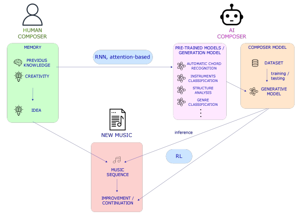

【图2：人工智能和人类创作过程的比较。在右边，人类作曲家利用他或她之前所拥有的知识创作音乐，也利用产生音乐思想的创造力，这些音乐思想可以是节奏、音符等，也可以是它们在主题或旋律中的组合。在左边，人工智能作曲家用在不同MIR任务上训练的模型（“先前的知识”）与在条件下创作音乐的模型相结合来创作音乐。未来，代表人工智能作曲家先前知识的预先训练的模型可能会被理解音乐的通才模型所取代，并且记忆可以与大型RNN相媲美。下面，我们看到了由人类或人工智能作曲家创作或完成的音乐片段（或“世界”，如果我们考虑所有现有的音乐），在后者的情况下，使用强化学习技术、序列模型等。】

###### E.基于人工智能的音乐生成中的Agents

> Agents不能直接翻作代理，和上面的Transformer一样，这属于机器学习领域的一种结构，近似看成用户设计的智能体（大概）。
>
> 第一段中有不少地方翻错了还请见谅，我也是一边看一边学呜呜呜

现在，深入到音乐生成的人工智能部分，我们在音乐创作框架中发现了5个智能体或实体：训练数据集、模型、界面和用户，以及需要测量的最终作品，这些将分别在第五、第六、第七、第八节中呈现。在图1中，我们可以看到基于人工智能的音乐生成或创作过程中的智能体或实体的一般方案。音乐制作工作中可能存在的每个智能体都容易受到偏见（bias）的影响。尽管数据集和模型可能由于输入音乐的性质或模型架构而具有客观 biases ，但界面和用户由于音乐的主观性而具有主观 biases。在这篇论文中，我们不会做任何偏倚（bias）分析。

我们还可以定义与这些智能体相关的两个主要过程：训练或开发和量化。当训练发生在数据库、模型和/或用户界面之间时，测量或评估阶段发生在所有智能体中，并且在更大程度上发生在用户和界面之间。如果所提出的音乐生成模型没有针对最终用户或界面，我们可以仅在数据库和模型中对训练和测量阶段进行分组。

#### 3、音乐原理

到目前为止，我们已经涵盖了基于人类和人工智能的音乐创作，但它是什么？以前的音乐创作知识来自哪里？在本节中，我们将介绍作为音乐支柱的音乐原则。这些原则包含了人们在创作音乐之前需要理解的基本要素的定义。

音乐可以被视为一种层次结构的语言。层次结构与音乐原则有关，音乐原则是音乐的支柱。音乐原则是：和谐、节奏、形式或结构、旋律、音色和动力。这些原理可以在符号域和音频域中进行分析。而和声、节奏、结构和旋律更多地涉及符号领域，音色、效果或动态都是诠释的一部分，即音频领域。同样值得一提的是，如果我们考虑到旋律是如何被解读的，那么它既可以从符号域的角度考虑，也可以从音频域的角度来考虑。纹理是我们如何结合这些原则的结果。除了音乐原则之外，作曲家还使用一些作曲技巧来结合这些原则。这些过程的例子我们将在本节稍后进行讨论或编排。音乐原理或参数的定义如下：

- 和声（harmony）。音程中音符的叠加形成了和弦。高层次的和弦是音乐音调的关键。组成一个小节的和弦通常属于同一音调。
- 音乐形式或结构。它是时间维度上的最高级别。然后，小节串联组织成音乐短语，这些音乐短语发展成为作为带有主题的小音乐单元。
- 旋律。旋律可以是单音或复音，这取决于在同一时间段演奏的音符；也可以是同音或异音，这依赖于旋律伴奏。
- 音质。当音乐指令或声音以相同的强度以及相同的频率播放时，它们听起来有不同的质感。

Christensen 还增加了节拍、对位法（the counterpoint）和流派或风格，并将音色排除在音乐原则之外。然而，我们将对位法归类为一种作曲技术，并添加音色，因为它是作曲的重要组成部分，特别是在表演中，这在未来的音频生成作品中非常重要。乐器和编曲是组织和编排音乐内容的音乐工具。作曲是对音乐作品中存在的乐器的选择，编曲是根据作曲家想要达到的动态和颜色为每种乐器分配旋律部分或伴奏的技术。在符号音乐软件中，组合乐器就是像乐谱中的一样将包含每个乐器的信息和音符进行轨迹组合。

> 这一段有大量的 instrumentation 、 orchestration 、instruments，我按照个人感觉修改了下内容，如有异议请以原文为主。
>
> 上面的词都有乐器、配器等意思，详细解释可以参考[Making Music 第三章——Instrumentation（配器）或Orchestration（管弦乐配器）](https://zhuanlan.zhihu.com/p/32289315)

那么，从人工智能的角度来看，我们应该把人工智能音乐创作领域称为音乐生成还是作曲？这取决于每项工作的目标。如果我们想建立生成音乐的模型，而不关心音乐是如何在音乐原理和音乐理论方面生成的，我们可以称之为音乐生成问题。但是，如果我们关心这些原则，并打算构建允许用户在相关的各个级别与模型交互的界面对音乐原理拥有更多的控制权，如果用户能用这些模型学习音乐，我们可以把这个领域称为音乐创作。

###### A.人类音乐创作

正如我们在第二节中提到的，当作曲家创作一首音乐时，会做出很多决定。这种情况发生在所有音乐流派或风格中，甚至在爵士乐等流派的即兴音乐作品中，这些作品都是在演奏时做出决定的。在西方古典音乐中，创作一个被称为 *motif* （主题）的短音乐序列是很常见的。motif 包含了那些将发展音乐部分的音乐思想。这些想法包含节奏和和声信息，可以以不同的方式排列，创造出带有相应伴奏的旋律。另一种作曲方式可以是创作一首旋律，然后进行协调，也可以是构建一个和声进程，从而构建一首旋律。这些人类创作音乐的方式取决于作曲家和音乐流派。

在旋律、和弦进行或主题（motif）被创造出来后，作曲家完成了一个包含类似音乐思想的音乐短语。音乐短语与 *bridges* （桥梁）连接，bridges 是从一个短语到下一个短语的过渡。一组音乐短语组成一个小节，通常以 *cadence* （抑扬顿挫/起落）或过渡到下一小节结束。有很多种方法可以构建音乐，就像西方古典音乐中的奏鸣曲形式一样，然而，每个作曲家都会根据自己的需要调整结构。在接下来的部分中，我们将看到人工智能系统是如何模拟这些过程的。然而，人工智能本身可以改变人类创作音乐的方式，例如，通过在潜在空间中进行声音探索。

就音乐的表现而言，它有两个维度，时间和和弦/和声。两个维度相互依赖。时间维度和符号域中的音乐信息通过包含音符的度量进行分组。这允许将音乐信息与称为拍号的时间单位进行分组。在构成音乐语言的所有元素中，音符处于最低水平。小节、音乐短语或旋律可以在下一个更高的层次上表现，作品的结构可以在最高层次上表现。

在图3中，我们展示了以音乐原理为构建块的一般音乐作品的形式结构，图4表示乐谱表示中的音乐原理的模式。

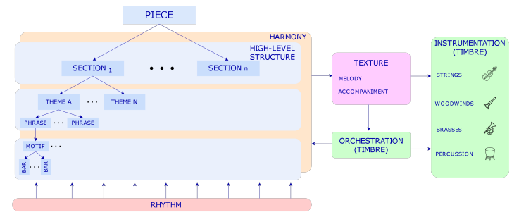

【图3：音乐原理及其关系。音乐作品的结构从小节到主题都有不同的层次（这取决于音乐流派）。和声和节奏是音乐中与音乐形式相辅相成的两轴，伴奏可以用对位法技术派生或构建，并用乐器和/或配器来安排。】

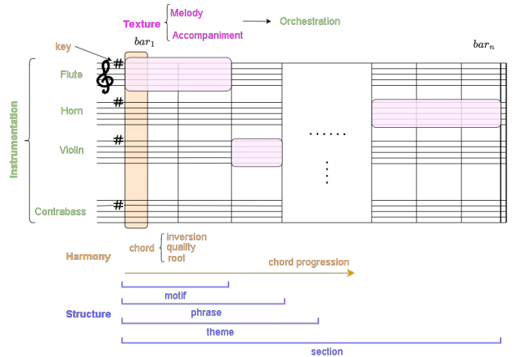

【图4：音乐原理的乐谱图式。我们展示了音乐原理是如何在类似乐谱的表现中相互关联的。请注意，乐谱通常没有所有的和声或结构注释，如和弦或旋律识别，但它确实有乐器、键或每种乐器的动态，以告诉音乐家或指挥家应该如何演奏这首曲子。】

#### 4、符号域和音频域

在上一节中描述了音乐原理后，我们现在将深入研究基于人工智能的音乐生成，这将是本节到论文结尾的主要主题。在本节中，我们将描述关注输入和输出信号性质的音乐生成领域。根据数据的输入和输出性质，基于人工智能的音乐生成可以从两个角度来看：符号域和音频域。我们将描述这两个领域以及在最先进技术中使用的最常见的音乐表示。在图5中，我们展示了输入和输出的模式，如符号和音频音乐数据。

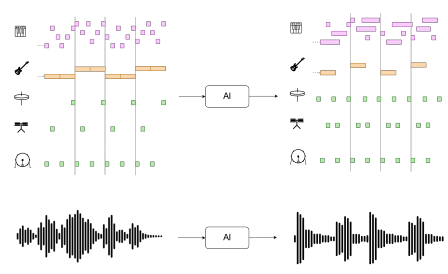

【图5：符号钢琴（上）和音频波形（下）域】

###### A.象征性音乐生成

符号模型处理不同级别的音乐信息，如音符持续时间（或MIDI文件中的音符打开和音符关闭事件）、音高和动态属性等。然而，由于输入MIDI文件可能不包含这些信息，输出音乐将不具有性能属性。从构建用户将使用的模型的角度来看，根据我们想要构建的应用程序，输出音乐应该与可以改变音乐感知方式的性能属性相结合。由于我们已经知道音符信息，因此在该领域中检索与音乐原理相关的特征更容易。我们可以使用概率算法和最近用于谐波识别的神经网络模型检测和弦或键，使用众所周知的自相似矩阵（SSM）检测乐曲或音符序列的结构或边界，我们可以使用这些信息对离散音乐信息进行编码，以训练和调节基于AI的模型。

符号音乐生成系统可以从头开始或通过条件调节来创作音乐。这取决于模型——我们希望它创作音乐的方式。在序列模型中，这两个选项都是合适的，因为我们可以向网络提供以前的token令牌。

###### B.象征性音乐与表征

象征性音乐生成的弱点之一是缺乏这些表现所具有的表征属性。正如我们在第二节中提到的，一首完整的音乐作品不仅包含象征性的属性，还包含表征属性，这是音乐演奏和感知的关键部分。除了合成音乐的经典技术外，还出现了使用深度学习技术合成具有可控属性的符号音乐的新模型。这种模型的一个例子是MIDI-DDSP。该模型提供了一种可控的合成，其中符号音乐通过特定的演奏技术（如颤音、断奏等）转换为音频。这些模型与符号生成的集成将为与人工智能共同创作音乐提供一个完整的框架。

###### C.音频生成

音频音乐生成包括生成音频信号而不是符号音乐表示。这允许使用原始音频作为输入来训练模型。其优点是，我们不需要有时可能不容易找到的符号音乐，并且输出不需要后期合成来再现。一方面，这是一个优势，但另一方面，原始音频比符号音乐合成更难用性能属性进行控制。尽管如此，仍有一些技术，如通过深度学习进行效果建模的音色转移，可以改进、调节并允许控制输出波形的生成。一些生成原始音乐的模型是最初为语音设计的模型，但在音乐生成领域表现出了良好的效果。

音频生成最常见的架构是VAE和GAN。DeepMind于2016年推出的Wavenet是生成原始音频最著名的模型之一。该模型使用扩张卷积来允许感受野随着深度呈指数增长，并覆盖由一系列样本组成的数千个时间步长，在原始信号中，这些样本可以是每秒16000个样本或更多。

> 感受野（Receptive Field）的定义：卷积神经网络每一层输出的特征图（feature map）上的像素点映射回输入图像上的区域大小。通俗点的解释是，特征图上一点，相对于原图的大小，也是卷积神经网络特征所能看到输入图像的区域。[什么是感受野（Receptive Field）？](https://zhuanlan.zhihu.com/p/394917827#感受野的概念)

###### D.风格转换

这是一个神经风格转移的例子，它是艺术生成中的一种扩展技术。在音乐领域，这可以用于两个不同的目的：音色转移、流派转移和表演转移。第一个是通过保持乐器的时频特性来改变其音色。这项任务与音乐生成没有密切关系，但随着我们将在第七节中讨论的音乐生成新界面的出现，这可能是一项可以添加到音乐生成工具中的技术，以帮助用户为其作品选择正确的声音。第二个是改变作品的流派或风格，从而改变音乐的象征信息。第三个适用于控制性能。这意味着我们可以改变乐器的演奏属性，如其动力学或演奏技术，而不仅仅是音色。最先进的音色传输模型的一个例子是DDSP。

###### E.输入表示

在符号音乐中，我们对存储音符或音高的值、它们的持续时间、动态和其他片段级别的数据进行格式化，如乐器、键或节奏；而在音频域中，我们通常有原始信号。根据我们获得这些文件的来源，我们可以在音频数据集中以及符号音乐中找到注释数据，例如在符号音乐格式中很难找到的高级结构标记。最常见的符号音乐格式是MIDI文件、MusicXML和ABC表示法。从这些文件中，得益于它们提供的信息，我们可以创建音乐编码或标记来训练序列模型，构建一个热门向量或pianorolls。在音频中，通常使用声谱图或任何时频表示作为输入，前提是它们是可逆的，这样它们就可以重新转换回音频。

#### 5.数据集

我们在上一节中描述了音乐生成领域的各个领域。到目前为止，在描述了音乐原理和领域并遵循图1所示的工作流程后，我们现在将深入研究音乐生成的第一个agent：数据集和允许处理它们的软件。从数据的角度来看，我们发现了一些问题，我们将在第十节中讨论：当前用于音乐生成的数据集是否代表了所有类型的音乐流派？它们必须包含哪些注释才能在可控性方面更有用？

###### A.音乐生成研究的数据集

在音乐生成领域的历史上，一些数据集在研究界很受欢迎。尽管如此，还没有对这些数据集及其可能包含的偏差进行全面分析，因此，在评估音乐生成系统时，模型的输出是主要的研究内容。用于符号音乐生成的一些最常用的数据集包括：
Lakh MIDI 数据集（LMD），其中包含与 Million Song 数据集对齐的MIDI文件；Bach Chorales 数据集（JSB Chorales）、MAESTRO 数据集和 Meta-MIDI 数据集（Meta-MIDI）。其中一些数据集包含多音轨音乐，而其他数据集则是专门为特定音乐类型设计的。随着新的深度生成模型的出现，新的数据集正在被创建，例如 SymphonyNet 中提出的 Symphonies 数据集。更多的数据集，如 POP909 ，涵盖了音乐生成领域的其他任务，如伴奏生成。此外，在其他领域中常用的数据集，如Slakh2100 用于自动音乐转录 ，可以用于符号和音频音乐生成，因为其中一些数据集包含符号和音频文件。在表1中，我们提供了每个数据集包含的特征的摘要。

【表I：常见音乐生成数据集】

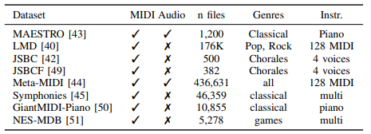

在音频领域，主要的优点是我们不需要符号数据来训练模型，这有时很难找到。我们可以直接用音频信号训练我们的模型，这为音乐生成领域创造了更多的可能性，因为通常比MIDI文件更容易找到音频文件。然而，在MIR社区中，保护音频和MIDI文件的版权仍然是一个悬而未决的问题，这导致研究人员在音乐生成任务中使用了非常少的数据集。在这一领域，一些模型是用MAESTRO音频样本训练的，而另一些则是用从互联网上提取的音乐训练的。

数据集中的音频和 MIDI 文件通常都受到版权许可证的保护，用于商业目的。有一些研究试图定义谁拥有音乐，无论是构建模型的团队、专有数据集，还是与模型交互并创作最终作品的用户。我们在第九节中进一步详细介绍了基于人工智能的音乐生成系统的所有权。

###### B.音乐和音频处理软件

我们可以使用一些开源软件进行预处理，从音乐中提取特征，训练 DL 模型，并在符号和音频领域对其进行评估。一方面，在符号领域，我们可以使用 musicaiz 来生成、分析、可视化和评估符号音乐，jSymbol 用于分析目的，music21 用于分析所有形式和格式的符号音乐，Humrum 、 mido 用于低级 MIDI 处理，pretty_midi 用于处理MIDI文件，muspy 用于准备数据加载器来训练用于音乐生成的 DL 模型，miditok 用我们将在本节稍后介绍的最先进的编码来标记 MIDI 文件，或者 note_seq 来处理符号音乐并使用它来训练DL模型（ library 由谷歌的 Magenta 团队维护）。另一方面，如果我们在音频领域工作，一些最常用的软件是 librosa 。Essentia 或 madom ，它们也是用于构建音频应用程序的众所周知的软件，尽管它们具有用于商业应用的版权许可。MIR 社区中常用的测量音乐的软件是MIR-eval 。在表2中，我们展示了这些软件库之间的比较。仍然需要更多的开源框架来保存和采用 MIR 社区的良好实践，以使研究结果可用并可复制。值得一提的是，谷歌和微软分别推出的 Magenta 和 Muzic 项目，其中包含了各自团队在过去几年中提出的所有模型。

【表二：MIDI和符号音乐生成、分析和表示的框架】

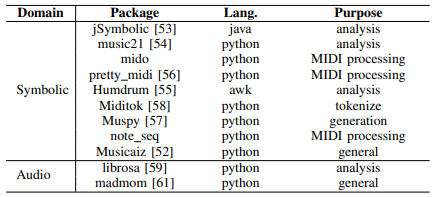

#### 6、模型

到目前为止，我们已经看到了音乐生成任务中常用的数据集以及可以帮助我们处理它们的软件。但是，哪些方法和神经网络架构被用于生成音乐？当前基于人工智能的模型用于音乐任务是因为它们正确地表示和学习音乐信息，还是仅仅因为它们在其他任务中表现良好？在本节中，我们将介绍音乐生成领域中使用的架构和方法。

机器音乐的产生始于20世纪50年代左右。机器和项目，如1957年的 ILLIAC Suite 、1964年 Koening 的 Project1 、20世纪80年代 David Cope 的 EMI ，以及 Iannis Xe nakis 的 Analogiques A 和 B 。20世纪80年代末，第一个使用神经网络的基于人工智能的模型受到算法合成的启发。 Lewis 在1988年使用了梯度下降法的训练和创造阶段。同样在1988年和1989年，Todd 定义了用于音乐应用的顺序网络。顺序网络使用的内存与已经产生的音符有反馈连接。1994年，Mozer 使用了 Elman 的 CONCERT 网络，该网络在给定可能候选音符的概率的情况下继续了一系列音符。除了这些先前的工作之外，已经提出了几种将不同的算法方法和神经网络架构结合用于音乐生成的工作。算法合成字段内部我们可以找到马尔可夫模型、生成文法、细胞自动机、遗传算法、过渡网络或 Caos 理论。这些模型可以以不同的风格和方式创作音乐，但新的深度学习方法比这些基于规则的方法更适合泛化。

###### A.模型架构

考虑到为每个模型选择的神经网络架构，我们有两大组方法：序列模型和生成模型。在表III中，我们提供了一些最先进的音乐生成模型的摘要。我们可以观察到模型是如何添加多轨道功能的，以及使用的架构是如何首先是RNN，现在的模型主要基于Transformers。我们还可以看到，强化学习（RL）在该领域和图神经网络（GNN）中都没有得到深入的探索。

【表三：最先进的音乐生成模型。旋律是指单声道旋律，而复调是指一种乐器，即钢琴或多种乐器的复调音乐】

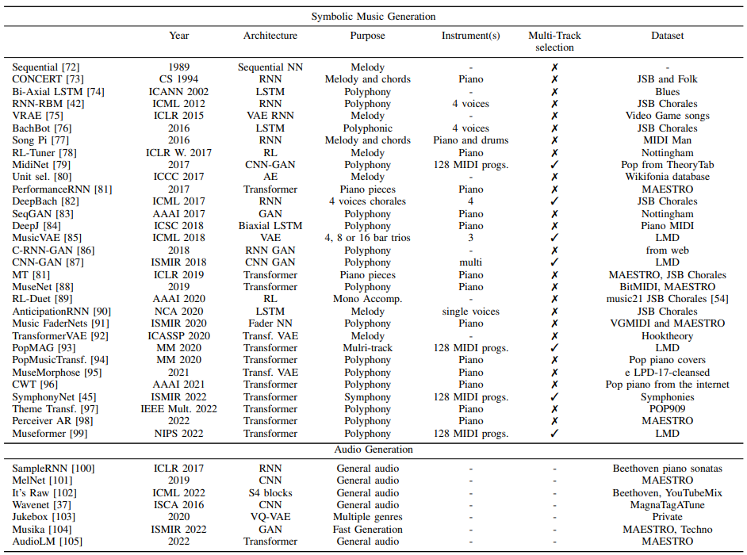

1） 生成模型

生成模型基于变分贝叶斯（Variational Bayesian，VB）方法。ML的这个统计部分将统计推理问题视为优化问题。这些模型用于近似未观测变量的后验概率。在这个家族中，我们可以找到变分自编码器（VAE）、生成对抗性网络（GANs）、扩散模型（DM）等。

a） 变分自动编码器（VAE）：VAE模型由 Kingma 和 Welling 于2013年引入。VAE的目标是将输入建模为连续概率分布，然后从学习的分布中解码新的数据点。该架构类似于自动编码器，在VAE的情况下，潜在变量形成了具有均值和方差的概率分布的潜在空间。编码器 q~φ~(z|x) 和解码器 p~θ~(x|z) 分别具有可学习参数 φ 和 θ 是概率的。在 VAE 中，编码器近似于 VB 证据下界（ELBO）中的真实后验分布 p(z|x) ，这使得能够将统计推理问题作为优化问题来面对。后验近似和似然近似由解码器参数化。在 Eq. 1 中，我们展示了 VAE 的损失函数，其对应于 ELBO 优化，并且由两个项组成：重建项和KL散度。

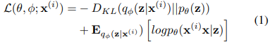

后验推理是通过最小化编码器或近似后验之间的 Kullback-Leibler（KL）分歧来完成的，而真正的后验推理则是通过最大化证据下界（ELBO）来完成的。换句话说，这意味着我们将试图通过捕捉输入数据的分布来重建输入。在这些模型中，梯度是用所谓的重新参数化技巧计算的。原始VAE模型有一些变体，如用于音频生成的 β-VAE 或 VQ-VAE 。基于VAE的符号音乐生成模型的示例是 MusicVAE ，基于 VQ-VAE 的音频生成模型是 Jukebox 。

b） 生成对抗性网络（GANs）：Goodfellow 等人于 2014 年引入了生成对抗性网。这些模型是由两个神经网络组成的，这两个网络是按照两人的极小极大博弈（Eq.2）进行训练的。这些网络被称为生成器（G）和鉴别器（D）。生成器创建数据以试图在训练期间欺骗鉴别器，鉴别器学习区分生成器生成的真实数据和虚假数据。第一个用于音乐生成的多音轨模型 MuseGAN 就是使用 GAN 网络。

其中，x 是数据，z 是噪声变量， p~z~(z) 是在输入噪声变量上定义的先验，D 是判别器，G 是生成器函数。D(x) 被定义为 x 是真实数据而不是由生成器分布采样的数据的概率。

c） 扩散模型：扩散模型的灵感来自非平衡统计物理学。这些模型在2022年 DALLE 2 或 Stable Diffusion 等模型发布后开始流行。然而，与大多数 ML 研究一样，这些模型首先被用于计算机视觉领域。这些模型基于扩散步骤的马尔可夫链的构建，其中在正向过程中一步一步地将随机噪声添加到数据中，然后它们学习反向扩散过程，以在反向过程中从噪声中构建新的数据样本。扩散模型是通过固定的过程学习的，潜在变量具有与原始数据相同的高维度，这使它们不同于 VAE 和 GAN 。应用于音乐生成领域的扩散过程的一个例子是 Mittal 等人的工作。将其与 MusicVAE 相结合，以生成更长的序列。

有更多的生成模型和它们的特殊应用，但由于它们尚未在音乐生成领域中使用，我们将不再深入讨论它们。这些模型的例子是基于流的模型，其特征是构建对数据的可逆转换序列或流。

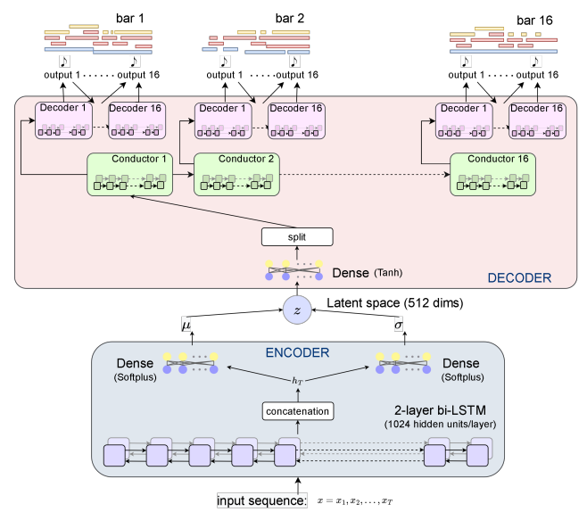

【图6:MusicVAE模型架构。我们可以观察到该模型如何呈现一个具有两个BLSTM网络的编码器和一个逐音符逐小节生成符号信息的分层解码器】

2） 自回归序列模型

序列模型与生成模型相比，通常使用自回归。自回归模型利用概率链式规则估计样本的密度（Eq.3）。

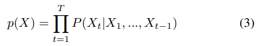

其中， X~t~ 是 T 个令牌序列中的一个令牌。令牌是依赖于域（音频帧、像素等）的表示。每个新令牌可以通过估计用于预测第 t 个令牌的先前令牌的条件密度来获得。符号音乐中的记号是音符事件，如音高、速度或时间增量。

a） 递归神经网络（RNN）：递归神经网络是使用序列或时间序列数据的人工神经网络。这些网络的特点是其存储单元允许存储建模长期序列的信息，但它们存在消失梯度问题。一些常用的RNN是长短期记忆（LSTM）和门控循环单元（GRU）。在音乐生成领域，这些是第一批用于尝试生成具有长期依赖性的音乐的网络。Eck 和 Schmidhuber 在 2002 年的作品就是一个例子，该作品旨在从布鲁斯音乐中学习和弦和旋律。

b） 基于 Transformer 的模型：Transformers 由 Vaswani 等人于 2017 年推出。这些模型已经超越了以前的 RNN ，并被用于从 NLP 到计算机视觉领域的各种用途。这是因为由于作为这些模型核心的注意力机制，避免了 RNN 中常见问题的消失梯度。注意力机制是基于以前在检索系统中的工作，它是用三个矩阵计算的：键、查询和值。最初的 Transformer 使用了缩放的点积注意力或自注意力机制（Eq.4）。

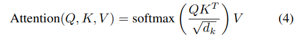

其中
$$
Q ∈ R^{d_{\text{model}} \times d_k}，V ∈ R^{\text{d_{model}} \times d_{v}} 和K ∈ R^{\text{d_{model}} \times d_k}
$$
分别是查询、值和键，d~model~ 是词汇表大小，在符号音乐中，它可以包含我们编码中包含的所有音高、持续时间、曲目和任何其他特征。

原论文还包括一个改进机制，以改进自我注意机制。多头注意力允许并行地进行注意力并关注来自不同位置的不同子空间的信息。在 Eq.5 中，我们展示了多头注意力的一般表达式。在注意力层的这种修改中，d~k~=d~v~=d~model/h~，其中 h 是头的数量。

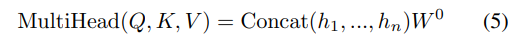

当 h~i~ 是 i^t^ 的 head attention ：
$$
h_i = Attention(QW^Q_i, KW^K_i, VW^V_i)
$$
自注意机制的复杂性是 O(L^2^d)，其中 d 是层大小，L 是序列长度。这种二次算法最近被重新考虑，我们现在可以找到更有效的注意力实现，将算法的复杂性降低到线性。

近年来为 NLP 提出的 Transformer 模型已经用大量参数进行了训练，也可以称为大型语言模型（LLM）。这些模型的一个例子是基于 GPT 的模型、BERT 或 T5 。它们中的一些使用了原始 Transformers 提出的编码器-解码器，而其他一些（如GPT）只使用了偶尔注意（casual attention）的解码器。由于文本和音乐编码之间的关系以及我们可以用来执行从文本到音乐的迁移学习的预先训练的权重，这些LLM也是一些符号音乐生成模型的核心。

3） 强化学习

强化学习（RL）是一种基于复杂目标实现的 ML 方法。深度 RL 将深度神经网络与 RL 相结合，以近似 agent （智能体）需要学习与环境交互的函数。因此，RL 是从互动中学习的。当 agent 使用策略或规则集进行操作 a 以与环境的状态 s 进行交互并因此获得奖励 r 时，就会发生这种交互。每个交互定义一个新状态 s‘ 。agent 的目标是使奖励最大化。我们将 Q 定义为在状态 s 中采取任何行动 a 都能获得最大未来回报的最优函数。深度 Q 学习（deep Q-learning）使用深度神经网络对 Q 函数进行建模。生成音乐的 RL 模型的一个例子是 RL 调谐器。在这个模型中，LSTM 网络从 teacher 那里学习，这是一种包含音阶等音乐理论概念的 RL 算法。这允许网络学习不可微分的奖励函数。这是一种根据音乐原理控制生成音乐的好方法，但这方面的工作还不多，用于音乐生成的 RL 仍有待深入研究。RL 系统的另一个用途是在给定旋律的情况下生成伴奏，如RL Duet中所提出的。

###### B.输入表示

音乐表示根据我们要构建的模型的领域、用途和架构而有所不同。在符号域和音频域中，我们都可以找到输入数据的 1D 和 2D 表示。

1） 符号

符号音乐信息通常分为不同的层次：乐曲层次、曲目或乐器层次和小节层次。这种音乐组织不仅有助于训练 DL 模型，而且还允许在实际应用中进行评估、修复和通信。

a） 文件格式：我们可以找到多种存储符号音乐的文件格式。最常见的是 MIDI （乐器数字接口），因为音乐制作人和作曲家可以在数字音频工作区（DAW）中轻松修改它们。MIDI 文件包含作为事件的信息，但它们并不包含所有的音乐信息，如和弦或演奏属性，如动态。从 MIDI 编码符号音乐最常用的事件是音符打开（note on）和音符关闭（note off）（音符开始和结束的位置）、音高（音符的值从 0 到 128 ）、存储施加到音符的压力的演奏属性的速度以及表示包含音符的乐器的程序号（也从 0 到 128 ）。其他 MIDI 信息包括节奏或每分钟节拍（bpm）的变化以及按键的变化。用于训练 DL 模型的最常用数据集包含 MIDI 文件。其他符号格式是 MusicXML ，它在音乐属性方面比 MIDI 更丰富，因为它可以包含和弦等和声信息。ABC 记谱法也是一种常用的音乐记谱法。当涉及到为音乐生成开发 API 时，我们可以发送 JSON 格式或协议缓冲区（protobufs）的音乐信息。note-seq 和 musicaiz 库可以导出这种表示形式的音乐，muspy 只能导出 JSON 格式的音乐。

b） One-Hot Encoding：这种编码指的是具有基音时间维度的 2D 矩阵，其中矩阵值是二进制的。如果在某个时间步长（列），音高（行）对应于该时间步长中正在播放的任何音高，则该值等于 1，如果不是，则等于 0。

c） 钢琴独奏（pianoroll）：钢琴独奏是音符事件的一种表现，可以属于某些乐器。

d） 序列编码：当训练序列模型时，有必要将输入音乐映射到令牌。与 NLP 一样，这些标记将音乐表示为 1D 向量中的一系列事件。在这篇文章中，我们找到了关于音符、结构、乐器等的信息。符号音乐的编码方式和表达时间增量单位的方法各不相同。PerformanceRNN 在 2017 年是第一个引入类似 MIDI 的事件作为数据结构的模型。这种编码已经被许多作品采用，最近基于 Transformer 的模型使用这种类型的数据结构，但以不同的方式对 MIDI 数据进行编码。音乐变换器（music transformer）通过音符和时间事件进行训练。音符事件是指以音符长度为单位测量时间增量或音符持续时间。例如，如果我们的单位是第 16 个音符，并且我们想用 delta 来表示四分之一音符的持续时间，那么我们的时间 delta 为 8，因为一个四分之一的音符中有 8 个第 16 个音节。时间事件不使用音符长度，而是使用以毫秒为单位的时间。有时，由于 MIDI 数据的性质或来源，它没有量化，选择音符长度作为单位可能会导致近似，这会使我们失去原始文件的一些凹槽。Music Transformer 建议使用时间增量作为 10ms 的单位，这会产生良好的结果，并尊重训练数据的性质。相比之下，多音轨音乐机（MMM）提出了以符号音符长度而不是毫秒进行时间编码。这种编码基于 LakhNES，并通过将多个音轨串联成具有时间偏移的单个线性序列来定义 MIDI 事件之间的时间，从而改进了其令牌表示。此模型使用 MultiInstrument 和 BarFill 表示。
MultiInstrument 表示包含 MMM 模型用于生成多音轨音乐的令牌，BarFill 表示用于修复小节，也就是说，将现有小节替换为模型通过保持前一小节和下一小节的音乐原理一致性生成的新小节。这是建立模型的重要一步，用户可以与之交互，并接近基于分数的表示。钢琴修复应用程序（PIA）类似于 MMM 编码，因为它也提供了类似 MIDI 的编码，但尽管定义了事件之间的时间偏移，它还是标记了音符的持续时间，因此 MMM 的 NOTE OFF 标记不存在于该编码中，并且 NOTE ON 和 time DELTA 分别由 PITCH 和 duration 标记替换。在复合词转换器（CWT）中引入的复合词根据其音乐属性将标记分组为复合词，也就是说，音符将由其属性或属性定义，即音高、持续时间和速度标记，而位置标记（如 Bar）将仅具有指示小节起始位置的 Bar 标记。

在表IV中，我们提供了训练序列模型的不同编码的摘要，在图 7 中，我们展示了用 musicaiz 提取的 MMM 标记化的示例，在图 8 中，我们展现了符号音乐编码的一般模式。请注意，需要符号音乐结构分析（MSA）来添加可能基于 SIA、SIATEC 和 COSIATEC 算法的部分标记。

【表IV：音乐生成中使用的编码——最先进的序列模型】

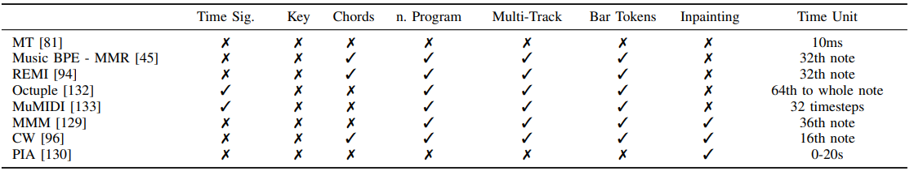

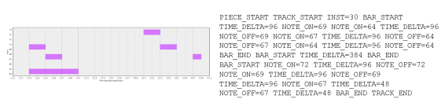

【图7：Pianooll 表示及其 MMM Track 编码的示例。在本例中，时间增量以刻度表示。我们可以观察到乐曲、音轨和第一小节是如何分别以 piece start、track start 和 bar start 标记开始的，以及音符是如何以音符的音高为值，以 NOTE ON 打开和以 NOTE OFF 关闭标记关闭的。在本例中，TIME DELTA 以记号表示】

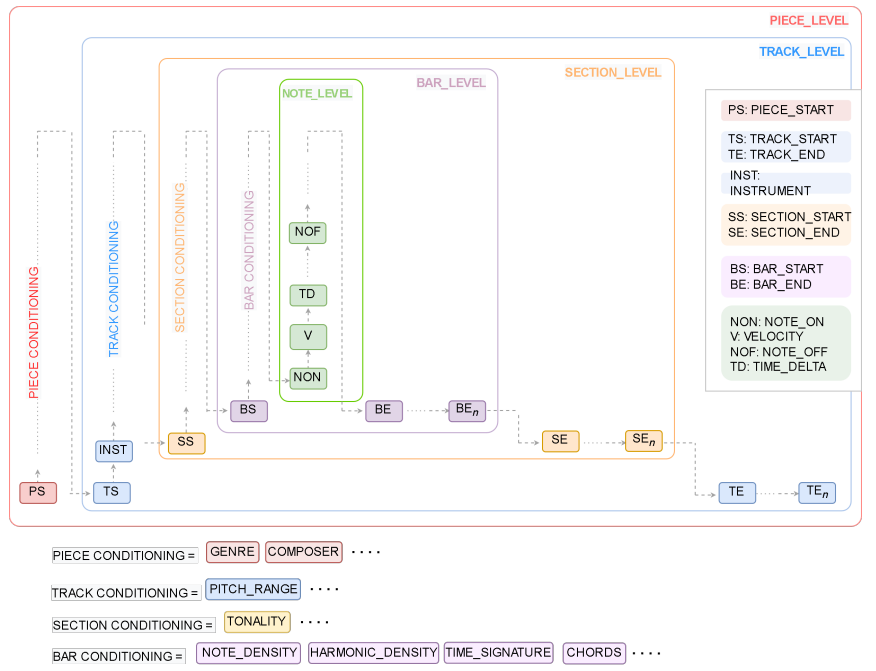

【图8：基于 MMM 的通用编码。该图显示了如何扩展 MMM 编码以调节不同级别的生成的一般方案配置。我们通过添加一个额外的级别来扩展原始 MMM 中提出的三个级别，该级别需要音乐结构检测或结构注释的特征提取算法。级别为：乐曲、乐器、小节、小节和音符级别。添加小节级标记可以允许在不需要用户手动指定或选择的情况下修复音乐短语、主题或小节】

e） 图：图神经网络（GNN）是最近的架构，需要将输入表示为图 G(V，e)，其中 e 是边，V 是节点。在音乐生成领域，这种架构还没有得到深入的探索。Jeong 等人提出了音乐的第一个音符级图表示，其中节点表示音符，并边缘化音符之间的音乐关系。连续音符与同时演奏的音符（和弦）具有不同的边缘。在图 9 中，我们展示了Jeong等人提出的音乐图表示的例子。这种表示可以重新思考和扩展，以添加小节级别、曲目级别或乐曲级别的图，从而为音乐生成训练进一步的 GNN。请注意，此表示适用于 MusicXML 文件，其中音符的时间属性与小节中的节拍和细分完全对齐，因此为了使此表示适应 MIDI 文件，有必要量化或修改所提出的表示。

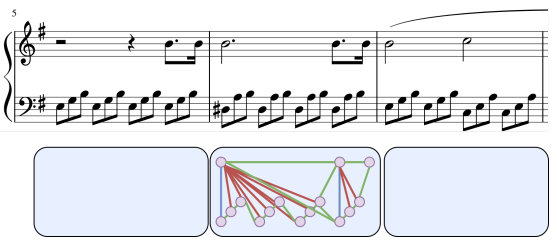

【图9：Jeong等人提出的音乐图形表示】

2） 音频

a）波形：波形是原始音频数据在时间上的幅度的 1D 表示。波形中要提到的一个重要参数是采样率或采样频率，它是信号中每秒采样的数量。

b） 声谱图：声谱图是音频生成模型中最常见的输入。频谱图是用短时傅立叶变换（STFT）获得的每个片段上的频谱的 2D 表示，短时傅立叶变换是用快速傅立叶变换（FFT）计算的。通常，使用梅尔谱图，它只是一个频率适应梅尔标度的谱图。使用对数 mel 频谱图对数地呈现高于某个阈值的频率也是常见的，因此频率比线性频谱图中的频率缩放得更好。

还有其他变换可以用于音乐生成，但其使用并不普遍。其中一个原因是，在 VAE 中，我们需要重建输入，然后执行频谱图的逆或变换以获得振幅和相位，这在诸如常数 Q 变换（CQT）的变换中是不可能的。有一些算法可以反转这些变换，但它们在数学上并不精确。小波是可逆的，但由于它们的高计算成本，它们不是音乐生成领域中常用的变换。此外，与 FFT 算法相比，这些变换中的一些变换具有较高的计算成本，FFT 算法比大多数其他变换更有效。

3） 数据增强

它包括修改输入数据以获得更多样本来训练模型。可以应用于输入数据的技术取决于域。在符号领域，我们可以通过转换乐曲的键来修改音乐数据。也就是说，在乐曲中的所有音高上加上或减去相同的半音值。其他可能的数据扩充技术是通过用其他和弦替换一些和弦来修改和弦进行。这将需要在乐曲中对当前和弦进行注释（或预测它们），并使替换连贯，以便最终的和声进程与新和弦连贯。我们应该注意这些修改，因为我们可能会放松作品的风格。例如，如果我们对一个模型进行条件处理以生成贝多芬的作品，如果我们将贝多芬的作品扩展到其他键，则模型可能输出的结果不会是我们预期的和声进行或键。然而，我们总是可以通过程序修改生成的音乐，使其遵循某些规则或将 DL 模型设置为特定的键或和弦。在音频领域，修改是基于输入的性质，而不是音乐方面。这是因为符号数据更容易修改，因为我们有关于音符、乐器等的信息，但在音频领域，我们没有这些信息（除非我们用预先训练的模型预测一些音乐特征）。因此，可以应用于音频音乐信号的最常见的技术是音高偏移、时间拉伸、噪声添加等。

###### C.输出形式

Briot 等人将音乐的输出性质定义为对音乐生成模型进行分类的方法之一。在这种情况下，由于在音频领域中，生成的音乐的输出形式取决于我们训练模型的数据集，我们将专注于符号音乐生成，在那里我们可以更容易地识别音乐术语中输出的性质。输出性质与音乐的结构和纹理原理有关，这取决于我们所看到的。一些音乐生成模型被训练来生成钢琴作品，而其他模型则提出了多乐器生成。一件作品中的乐器可能由模型本身或最终用户决定。这种分类是基于结构的分类，因为纹理是一个完全不同的概念。基于纹理的分类可以区分单声道和复调生成（我们可以在单乐器和多乐器作品中具有相同的纹理）。

1） 注重质感

a） 旋律生成与伴奏：旋律生成是音乐创作模式的最初目标之一。旋律是一系列音符，可以是单声道的，也可以是复调的。第一个组成旋律的模型产生了短期音符序列。随着 RNN 和语义模型的出现，提出了基于单元选择的工作。RNN 在该领域模型的开发中发挥了重要作用。自从 Eck 和 Schmidhuber 在 2002 年的工作以来，越来越多的模型使用 RNN 来创作音乐。这些模型的例子是 2016 年谷歌 Magenta 的 MelodyRNN 或 2017 年的 AnticipationRNN 。这些模型能够产生旋律，也能够产生跟随旋律的和弦，但它们并没有被开发成对位模型。对位是一种通过遵循一定的规则来组合旋律的技巧。2017 年的 DeepBach 是最早实现这一目标的模型之一。该模型是用 JSB Chorales 数据集训练的，该数据集包含 4 个在对位中机智的声音片段。DeepBach 的架构由 RNN 组成，并使用吉布斯采样（Gibbs sampling）来编写每个语音的音符，吉布斯采样是一种从多变量概率分布中获得近似观测序列的技术。此外，2017 年提出了 COCONET 。该模型由神经回归分布估计（NADE）模型与吉布斯采样相结合组成。

然而，这些模型无法产生新的或创造性的音乐创意，如高质量的主题。随着 VAE 等新生成模型的出现，Magenta 于 2018 年提出了 MusicVAE6。这个想法是在 VAE 的潜在空间中插入，创作 2 到 16 小节的短音乐片段。该模型是用 LMD 的旋律和三重奏（鼓，低音和旋律）进行训练的。MusicVAE 提出后，音乐生成领域旨在在新的基于 Transformer 的模型的卓越功能的指导下生成更长的序列或旋律文本生成。2018 年提出的带有螺旋式注意力机制的音乐转换器是最早使用注意力机制生成多语音音乐的模型之一。该模型是用 JSB Chorales 和 MAESTRO 数据集为精湛的钢琴进行训练的。2018 年出现了更多基于 Transformer 的模型，如 OpenAI 的 MuseNet 。2020 年发表的 PopMAG 也可以生成伴奏。对于 16 到 32 小节的音乐序列，即较长乐曲中的音乐部分，解决了长期依赖性。当涉及到上下文时，较长的序列无法记住以前的音乐想法的原因是注意力瓶颈。从 2020 年开始，有人提出了使用 VAE 和 Transformers 来生成新音乐并为长期背景建模的模型。PianoTree 、 TransformerVAE 就是这样的模型的例子。然而，这些模型中的任何一个都实现了生成具有高水平结构连贯性的长音乐片段的目标。使用扩散的模型的一个例子是 Mittal 等人提出的模型，该模型基于去噪扩散概率模型（DDPM）。该模型捕获 MusicVAE 2-bar 模型的 k＝32 的 VAE 潜伏时间 z~k~ 之间的时间关系。这允许将 MusicVAE 2 小节扩展到 64。然而，正如基于注意力的 mdoels 所发生的那样，这种方法既不能遵循主题或音乐理念，也不能连贯地延续它。新的基于注意力的模型，如使用交叉注意力来使用 4096 个令牌的上下文的 Perceiver AR，正在使用 MAESTRO 数据集进行训练，并且似乎可以学习和生成更长的音乐序列。

旋律生成的另一种方法是首先生成和弦序列，然后生成与和弦进行相匹配的旋律。这是一种人类也采用的创作方式。BebopNet 模型从爵士乐和弦中生成旋律，因为爵士乐和声比其他音乐流派更复杂。其他模型使用变分自动编码器（VAE）、生成对抗性网络或基于 GAN 的模型、端到端模型。ChordAL 生成一个和弦进程，该和弦进程被发送到旋律生成器，然后将输出发送到音乐风格处理器。

b） 结构：生成遵循高级结构的音乐是音乐生成领域的一个悬而未决的问题。生成结构化音乐的困难部分是模型实现这一点所需的高理解水平。更准确地说，该模型不仅需要学习节奏、旋律和和声是如何结合的，还需要记住几小节或几分钟前发生的音乐事件，以便开发或修改它们。音乐中的小节可能被建模为模板，或者可以通过模型学习。每种音乐流派都有自己的结构或部分标签，如摇滚或流行音乐的合唱和诗歌，或奏鸣曲形式的阐述、发展和重述。部分也可以用大写字母标记。过去，有一些模型提出了高层结构建模所需遵循的模板。Lattner 等人在 2018 年使用了自相似矩阵和卷积限制玻尔兹曼机（C-RBM）将结构强加给生成的音乐。其他作品试图开发自己学习音乐结构的模型。尽管使用注意力机制的新 DL 模型正在尝试生成更长的序列，但据我们所知，仍然没有能够生成结构化音乐的模型。使用交叉注意力机制或线性注意力的模型可能是实现这一目的的解决方案。使用 MAESTRO 数据集训练的 Perceiver AR 是可用于此目的的最新模型。尽管如此，它并没有根据音乐原理进行评估，这让我们怀疑它生成结构化音乐的能力。除了尝试在模型的架构中工作（这是最常见的方法）外，研究人员还可以开发检测符号数据结构的算法，以将结构标记添加到输入编码中，如我们在图 8 中提出的那样。这也将有助于修复的关注点。

c） 旋律协调：旋律协调是为现有旋律找到合适且连贯的和弦进行的过程。我们需要指出的事实是，有大量的和弦，因为我们可以从主音（半音音阶中的 12 个音符）构建它们，根据和弦的复杂性（三和弦、七和弦等），它们可以反转为一个、两个、三个或更多个反转，并且可以具有不同的质量（大、小、减、增等）。此外，一个和弦不能跟在词汇表中的所有和弦后面，因为和弦进行必须具有由每个和弦音调功能定义的连贯性。我们还必须区分旋律协调还是为多首曲目生成伴奏，但在我们看来，最后一个术语更多地与乐器有关。第一个面临这个问题的模型是基于隐马尔可夫模型（HMM）的，其性能优于 RNN。Eck 和 Schmidhuber 在 2002 年使用 LSTM 来学习旋律和和弦。最近，在 2019 年，LSTM 也被用于预测给定旋律的和弦伴奏。同样在 2019 年，巴赫涂鸦（使用 Coconet）被开发出来，以巴赫的风格为给定的旋律生成伴奏。近年来提出了更多使用 LSTM 的工作。

关于多音轨伴奏的生成，它可能被视为编排过程的一部分。旨在执行这项任务的模型是基于 GAN 的架构，用于实现引线板安排。2018 年的 MICA（多乐器联合编曲）和 2020 年的 MSMICA 是多音轨伴奏的一个例子。

d） 通过调节生成：音乐生成的一个重要特征是调节模型的能力。调节可以基于使模型遵循特定的音乐原则或继续给定的提示。由于研究人员提出的输入编码，基于 Transformer 的模型能够生成给定和弦序列的音乐。在这一领域，由于人机交互（HCI）研究的重要性，我们发现还有很多研究要做，并让用户通过将这些技术作为作曲过程的一部分来使用这些技术，例如，通过修复与用户音乐知识相匹配的不同作品级别和难度。

e） 风格转换：音乐可以有多种风格。流派是允许对音乐进行分类的东西。不同的流派有其特殊性，它们将不同的音乐原则结合在一起。在音乐生成领域，风格转换是指改变作品的流派，例如，将摇滚歌曲转换为古典歌曲。这是一项有趣的技术，因为没有每个音乐流派的数据集来训练大型 DL 模型，然而，如果我们的数据集很小，也可以进行迁移学习。在音乐生成领域，Hung 等人于 2019 年提出了爵士乐生成的递归 VAE 模型。在 DL 领域，Gatys 等人于 2016 年引入了风格转移。其目的是将样式特征应用于另一个图像中的图像。当涉及到音乐生成时，通过使用表示生成音乐的风格的嵌入或特征向量来改变音乐风格。MIDI-VAE（2018）是一个可以执行此任务的模型示例。得益于 VAE 的潜在空间，该模型将其中的风格编码为音高、动态和乐器特征的组合，使其能够生成复调音乐。正如我们之前提到的，一首音乐作品的风格是由作曲家如何结合音乐原理来定义的。除了使用音高和演奏属性对风格进行编码的 MIDI-VAE 之外，我们还可以找到其他模型，如 MusAE，它们也使用音高属性对音乐风格进行建模。除了这些使用音高属性的模型外，我们还可以找到使用和声和纹理属性对风格进行编码的模型，如 2020 年的 PianoTreeVAE、2021 年的 MuSeMorphse 和其他作品。

f） 修复：随着计算机视觉的新发展，可以组合两幅图像的风格或扩展现有的绘画，修复已成为最终用户的需求。修复是用与上一个和下一个音乐片段匹配的新颖内容替换音乐内容的能力，以保持作品的连贯性。在符号音乐中提供这种能力的模型的例子是钢琴修复应用程序（PIA）（2021）或 MMM 编码（2020）中提出的 BarFill 标记化。PIA 适用于钢琴作品，而 MMM 可以处理多音轨音乐。对模型的实验表明，对现有音乐的替换如何保持音乐方面的连贯性，如和声。然而，通过对象征音乐更好、更有力的分析和理解，我们可以修复和控制音乐原理的具体音乐方面，如和弦（和弦本身或其质量、反转等）、节奏执行（琶音、保持和弦等）或高级结构特征，如每个小节的关键。

2） 乐谱维护

a） 钢琴音乐：钢琴音乐基本上是合成复调音乐，它有一个旋律和一个与旋律连贯的伴奏或和弦序列。由于过去缺乏能够处理多乐器音乐的强大模型，研究人员一直专注于这类音乐。从这个角度来看，钢琴音乐模式与我们根据纹理分类的旋律和伴奏生成模式是一样的。这是因为钢琴是一种复调乐器，我们可以用它同时演奏旋律和伴奏，而现有的复调音乐数据集大多是钢琴数据集，蓝调或爵士乐数据集除外。

b） 多乐器音乐：多音轨或多乐器音乐是指为多个乐器创作或编排的音乐。请注意，这种分类与纹理不同，因为多乐器音乐也可以写成带有伴奏或其他纹理的旋律。多种乐器的音乐给钢琴音乐增加了额外的难度，因为作品中有更多的信息（更多的音符），而且它增加了处理每种乐器的符号和演奏属性以制作连贯作品的问题。在图 4 中，我们展示了该方案，该方案具有多种乐器的类似输出的乐谱的音乐基本原理。

多音轨生成的第一种方法是在作品中加入鼓的音轨。由于鼓是非音高的乐器，因此使用鼓就能实现与旋律的节奏相匹配。2012 年，Kang 等人提出了一个模型，该模型可以为旋律和鼓生成和弦伴奏。2017 年，Chu 等人提出了具有分级 RNN 的 PI 之歌。2017 年，第一个为多音高乐器生成连贯音乐的模型是 MuseGAN。从那时起，提出了更多基于 GAN 的模型，如 SeqGAN 或具有二元神经元的 CNN-GAN。后来，正如钢琴音乐一样，基于 Transformer 的模型被开发用于多音轨音乐。2019 年，Donahue 等人提出了 LakhNES，这是一个基于 TransformerXL 并使用 NES 音乐数据库（NES-MDB）进行训练的模型。2020 年，针对这项任务，还提出了更多具有不同编码的基于 Transformer 的模型（见表IV）。其中一些模型使用了它自己的编码，我们在本节前面的序列编码段落中对此进行了描述。Ens 等人提出了 MMM 编码，该编码通过使用 Hugging Face Transformers 库在文本上使用 GPT-2 预训练模型进行训练。2020 年发布的其他型号包括使用 MuMIDI 编码的 Pop-MAG 型号、使用 OctupleMIDI 编码的 MusicBERT 型号、使用 REMI 编码的 Pop Music Transformer 型号和使用音乐 BPE 算法获得的 MMR 编码的 SymphonyNet 型号。其他工作涉及符号音乐理解的基于 Transformer 的模型的预训练。需要注意的是，由于这些模型需要在我们从头开始训练它们的情况下训练大型数据集（如果我们查看之前提到的数据集，则需要超过 50 万个文件），因此编码算法的计算成本对于加速标记化过程非常重要。同样值得注意的是，减少了令牌的数量，并使用了不是线性的，而是以一种可以像 SymphonyNet 那样耦合令牌的方式，使训练和推理更快。值得一提的是，尽管音乐转换器的编码是为钢琴作品设计的，但它可以被修改为对多音轨音乐进行编码，或者使用预先训练的模型对多音轨数据集进行迁移学习。

c） 乐器和编排：乐器和编排可能不像旋律位置那样重要，但它们在作曲过程中发挥着重要作用。然而，在音乐生成领域，人们对这些技术的兴趣并不高，可能是因为该领域中使用的模型和数据集还没有开发到足以应对这些问题的程度。正如我们在第三节中介绍的，插入和编排是不同的技术。第一个是选择符合其音乐和演奏特性的乐器，第二个是选择和排列音乐信息的过程。关注那些试图面对和建模这些技术的 DL 模型，我们可以找到 SymphonyNet，它是在 2022 年提出的。它使用基于 BERT 的模型和标记化，以便对模型进行训练，以对音符所属的乐器进行分类。这是 DL 模型的音乐乐器和配器的第一个和成功的想法之一。然而，重要的是要注意，从模型的角度来看，它同时学习这两种技术，并且不区分它们。例如，用这些技术可以将钢琴作品转换为管弦乐队作品，但 SymphonyNet 是用管弦乐队作品直接训练的，这意味着它不能将钢琴作品转化为管弦乐队，也不能减少管弦乐队的钢琴作品。

#### 7、人机交互

正如我们在引言中所提到的，人机交互技术的重要性是整个人工智能音乐创作的关键概念之一。随着世界各地的活动和竞赛，如人工智能歌曲大赛，将与人工智能共同创作音乐的团队聚集在一起，共同创作变得越来越重要。在本节中，我们将深入研究在音乐生成领域和用户中提出的用户界面。在本节中，我们总结了图中所示的合成工作流的代理。让位于下一节中的评估。

HC 交互中最重要的元素之一是用户界面。随着深度生成模型的最新进展及其在计算机视觉领域的新功能，对现代用户界面的研究正在增加，这推动了人工智能音乐生成新界面的诞生。设计良好的界面不仅给用户带来更好的体验，还允许用户与模型进行不同级别的交互，尤其是在基于 AI 的艺术模型中。在这一部分中，模型通常是一个黑框，用于响应界面中的用户提示。因此，在合成工作流的这一部分中有两个重要的代理：用户和界面。

###### A.界面

界面是用户通常体验到的第一个也是唯一一个部分。具有复杂或基本的界面是取决于要构建的工具或产品的设计决策。完美的界面并不存在，但之前对目标用户的分析以及构建某个产品所用技术的知识可以帮助设计一个好的界面。

Bougueng 和 Ens（2019）的 Apollo 旨在通过创建、编辑和操纵音乐语料库来组织音乐数据。用户可以修改他们上传的音乐文件，并使用控制音符密度、小节数或音高类别的参数生成音乐。

COSMIC（2021）提出了一种用于人类人工智能音乐与聊天的交互界面，该界面使用 NLP 核心将人类输入处理为文本，并与人类交互以定义或细化输出音乐。该过程从创建元数据的开始状态开始，与人的文本输入相匹配的旋律生成，与允许在给定条件下细化旋律的 HCI 的旋律修订，也通过与人交互的歌词生成和修订，以及会话关闭时的结束状态。需要传递到自然语言理解第一模块的音乐属性是：音符密度、音高变化、节奏变化、歌词类型和歌词关键词。这些参数被转换为关键字，并传递给下一个模块对话状态跟踪器（DST）。这是一个类似聊天的界面示例，其中用户的输入是文本。

Louie 等人（2022）提出了两个接口，旨在测量用户与两种音乐生成模型的交互：收音机和转向接口。尽管无线电界面依赖于用户用来生成音乐的简单按钮，但操纵界面提供了不同级别的控制，如音高、键等，它还允许用户通过选择由先前序列制作的序列来创作作品。Louie 等人通过以下指标来衡量用户体验：表达、沟通、音乐连贯性、所有权、控制和功效。在所有这些指标中，指导界面获得了更好的结果，但用户在音乐创作方面的经验或知识水平没有得到深入研究，这就留下了一个悬而未决的问题，即专业作曲家是否更喜欢更完整的界面，而更简单的界面是否适合业余音乐家，如果接口与目标用户具有直接关系。

郭等人的 MusIAC（2022）定义了一个具有基于音乐结构的音轨级或小节级控件的控制界面。这些级别允许定义与和声或节奏相关的控制，例如张力。这些基于音乐原理的控件适用于具有一定音乐基础的用户。

SonyCSL 的其他项目，如用 Javascript 开发的 NONOTO 和 PI-ANOTO，提出了修复符号音乐的接口。而 PIANOTO 是基于一个类似钢琴的界面，用户可以通过在界面中选择区域进行修复并创建符号音乐，NONOTO 面向声音创作和符号生成，并使用 DeepBach 进行修复。

Magenta 团队还为 Ableton 开发了插件，这些插件在后端使用了该团队开发的模型。

我们看到了不同的用户界面，可以与基于人工智能的音乐生成模型交互，在某些情况下可以控制音乐主体，在其他情况下可以进行其他“探索性”控制。我们还看到了接口所具有的控件数量的差异。近年来，将会有更多的界面被提出，考虑到文本提示和语音在图像生成应用程序中的成功，可以合理地假设，其中一些类似提示的界面也将用于音乐生成，特别是对于那些可能只喜欢通过键入句子来生成音乐的初学者用户。这方面的一个例子是给出提示的音乐生成：“生成基于肖邦 C 大调夜曲的一分钟音乐，悲伤的音乐”。在音频生成领域，有一种最新的模型，AudioGen，能够在给定文本的情况下生成音频。尽管该模型不生成音乐，但它可以在音乐样本上进行训练，以实现文本引导的音乐生成。

现在，我们将深入探讨在没有提供接口的情况下，用户对模型的看法和评估。未来的研究主题将依赖于测量界面和用户水平，以根据用户在使用这些技术时的音乐知识或目标来构建更个性化的界面。

###### B.用户

最终用户是合成工作流程中的最后一个智能体，但在我们看来，它是最重要的一个。计算机视觉领域多年来一直在将知识从学术界转移到工业界。最终用户的反馈不仅是行业层面的关键部分，也是学术界的关键部分。有一些研究用户如何与音乐生成系统交互的工作，因为该领域的工作一直致力于模型，并且由于音乐生成领域与计算机视觉相比是新的，因此缺乏来自用户的反馈，无法帮助该领域朝着特定方向发展。

MuseGAN 使用主观测量来评估模型，主观测量取决于用户的音乐知识。这一点很重要，因为音乐是主观的，用户在与音乐生成的生成模型交互时的体验可能会有偏差。一个好的方法是将用户分为初级、中级和专业级别。这些级别是指没有音乐知识的用户（初学者）、学习过音乐的用户（中级）以及能够深入识别和分析音乐的专业音乐家或作曲家（专业）。我们认为，考虑到最终用户，该领域可以提出不同的模型，在界面上或多或少具有可控性，以更好地接近他们。

#### 8、评估

在 MIR 中，评估音乐生成是一个悬而未决的问题，因为这些系统中有一个难以衡量的创造性组成部分。此外，由于音乐是主观的，因此很难评估或量化音乐作品的质量。研究人员已经提出了评估和比较模型性能的指标，但仍然缺乏一种用于符号音乐和音频音乐生成的通用评估方法。这些指标中的一些在不同的领域是常见的，如计算机视觉或自然语言处理领域，如混淆（perplexity）或 F-score，其他指标是特定于研究领域的。在音乐生成领域，在我们进行评估之前，我们需要从生成的音乐中提取一些特征，这并不总是一个容易的问题。近年来，人们提出了各种各样的措施，分为客观措施和主观措施。同样重要的是要强调，在符号领域，我们可以更好地测量作品的音乐方面，而在音频领域，我们可能希望测量生成信号的质量。

###### A.主观评价

主观评价与用户对模型的体验有关。这种评估是由用户完成的。它的弱点在于，每个模型都由不同的人进行评估，因此结果不可重复。此外，用户的知识、文化和疲惫（个人认为这里是不感兴趣）可能会改变评估结果。Ji 等人揭露了音乐质量的定量评估与人类判断之间缺乏相关性，这使得这种评估是必要的，因为最终用户是互动和生成音乐的人，他们的意见非常有价值。

有两种常用的方法来客观评价音乐：听力测试和图灵测试。人工智能领域提出的每个模型在进行听力测试时都使用自己的调查和方法，但最近有一些工作提出了调查模板。按照用户级别划分的听力测试的一个例子是 MuseGAN 评估中使用的测试，该评估由 144 名用户完成。更多的用户参与了 DeepBach 的评估，其中 1.272 进行了听力测试，也根据他们的音乐知识进行了分组。通常情况下，听力测试包括评分从 1 到 5 的问题，这些问题符合音乐原则。在 MuseGAN 评价的案例中，提出了衡量和声柔顺性、节奏、结构、连贯性和整体评分的问题。我们可以让用户收听生成的样本，也可以为更深入的分析提供分数。

主观评估也可以被视为基于人工智能的模型的调试工具。一个例子是 MusicVAE 的监听测试，该测试使用 Kruskal-Wallis H-test 来验证模型的质量，得出的结论是，该模型在使用分层解码器时表现更好。这使研究人员能够验证哪种提出的体系结构产生了更好的音乐，尽管我们应该始终关注到客观的衡量标准。

我们不仅可以要求用户对作品进行评分，或要求他们区分人类或人工智能作品，还可以提出与模型的创造性或生成作品的自然度有关的非定量问题，而这在客观评估中是不可能的。关于音乐生成评估的新研究通过要求参与者在 7-point Likert 量表中测量以下标准来比较音乐生成的 DL 模型：**生成作品的整体性、旋律性、丰富性、韵律性、正确性、结构性和连贯性**。Chu 等人证明了人类希望在基于人工智能的音乐生成系统中有更多的可控性，并声称旋律性是主观衡量这些系统的最有效标准。他们将这些标准定义为：

- 整体。对音乐的整体满意度。
- 创造力。要求音乐是新颖的、有价值的和原创的。
- 自然。音乐听起来像是富有表现力的人类表演。
- 优美。和谐的乐曲。
- 丰富性。音乐是多样化和有趣的。
- 节奏性。节奏是否统一。
- 正确性。音乐是否存在突然停顿等技术故障。
- 相关性。条件音乐是否与参考音乐相似。

在进行主观研究时，考虑我们所处的领域是很重要的，因为符号音乐需要合成，合成过程可能会影响用户对音乐的感知。

###### B.客观评价

与音频或符号音乐生成的主观评价相似相比，由于这两个领域的性质，客观评价呈现出更多的差异。在深入研究评估音乐生成系统的具体方法之前，我们将介绍我们可以从符号音乐中提取的特征向量，以及文献中提出的一些一般措施。

a） 符号音乐：我们可以从符号音乐中提取的特征向量可以分为音乐原理：音高相关、节奏相关和和声相关。

- 音高矢量是允许测量特定乐器或乐曲组成的八度音阶的音高范围，以及测量连续音高之间音高距离（通常为半音）的音程（我们应该同时考虑单声道和多声道音乐）。我们还可以计算基音类直方图（PCH）和基音类转移矩阵（PCTM）。音高等级（PC）是指转换为某个八度音阶的音高。这意味着，如果我们有 C4 和 C5，两者的 PC 将是相同的，因为它们都对应于音符 C。因此，我们将有 12 个音高类，对应于从 C 到 B 的半音音阶中的 12 个音符。
- 节奏向量是起始间隔（IOI），它是连续音高的起始之间的差异，音符密度是音乐序列、与音符持续时间相对应的持续时间范围以及测量音乐序列中有多少步静音的占用率。我们还可以计算音符长度直方图（NLH）和音符长度转移矩阵（NLTM）。
- 和声向量是复调率，复调率是我们找到复调的细分数量，或者是音乐序列中复调音符的最大数量。

这些矢量或描述符不仅可以测量音乐，还可以理解音乐，因为大多数乐器只能以特定的八度音阶演奏，并且具有人工智能模型应该建模的特定节奏特征。

我们必须考虑到这样一个事实，即这些特征适用于我们可以在乐曲级别（整个文件或带有所有乐器的乐曲）、音轨级别（只有一种乐器）和小节级别（包含所有乐器的小节或某一乐器的小节）进行解释的音乐序列。我们在评估中选择的水平将取决于我们的目标。

一旦我们计算了这些向量，我们就可以建立评估度量，并将其与训练数据进行比较。这些度量也在音乐原理中进行了划分，如表 V 所示。特征向量，这些度量可以为每个级别计算：乐曲、曲目或小节级别。

【表 V ：象征性音乐评价的常用方法】

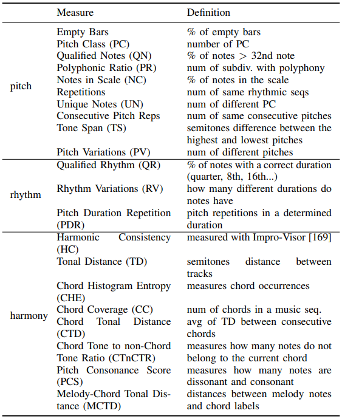

随着符号音乐谐波提取的更多进展，如 Cheng 和 Su 提出的 HT 模型，我们可以测量生成音乐的和弦和键以及训练集中的样本，并提出新的度量标准对现有的进行补充和扩展。这显然是通过查看度量来了解提取的可信度，从而了解我们可以从中获得的度量。

Yang 和 Lerch（2020）提出了一种评价符号音乐的一般客观方法。首先，提取一些音高和节奏特征。然后，我们根据这些特征构建直方图，我们可以将其近似为概率密度函数（PDF）。根据这些函数，我们可以测量 Kullback-Leibler 散度（KLD）和重叠平面积，以确定 PDF 的相似程度。PDF 是从片段和条级别构建的，通过交叉验证同一数据集的样本（集内）或将训练数据集与生成的数据集（集间）进行比较。

#### 9、 进一步的观点和研究

###### A.量子音乐时代

Eduardo Miranda 在 2021 年和 2022 年介绍了艺术与人文领域的量子计算。尽管量子机器学习是一个用于一般应用的新研究领域，但有一些研究正在定义量子音乐技术的第一步。这一新的 MIR 研究领域旨在开发创建、表演、聆听和分发音乐量子计算工具的工具。

###### B.情感与主体性

音乐中的情感已被广泛研究。从旨在检测音频信号中情绪的模型到最近旨在生成具有特定情绪的音乐的作品。音乐情感识别有专门的数据集，可以用来训练模型来自动标记或条件生成模型。尽管如此，情绪是主观的，它们取决于用户的文化、背景或音乐知识。Bao 和 Sun 提出了一个带有情感的音乐生成模型。该模型使用基于 BERT 的模型来识别情绪（在 GoEmotions 数据集上预先训练的模型），并有三个模块：用于生成歌词和旋律的编码器-解码器架构、音乐情绪分类器和使作品适应情绪调节的波束搜索算法。

###### C.生成音乐的版权

关于使用基于人工智能的模型获得的音乐版权的法律声明仍在进行中，这是一个令人担忧的案例。近年来，随着对使用基于人工智能工具的公司的注资，以及区块链等新技术的出现，不仅需要定义法律声明，还需要定义道德声明来控制基于人工智能的音乐产品。有几个问题需要解决，但最相关的问题之一是：版权属于谁？在使用人工智能创建音乐的过程中，有不同的智能体参与，例如创建用于训练模型的数据库的人、构建和训练模型的团队或创建音乐的用户等。尽管有人同意在版权法中应考虑该工具或程序员，但也有人声称，使用该工具的人应有权获得作者身份，因为艺术品的实例化是归属作者身份的充分条件。然而，如果音乐创作过程中没有人参与，根据 1988 年《设计和专利法》（英国）（CDPA），作者应该是为作品创作做出必要安排的人。Deltorn 和 Macrez 认为，从司法角度来看，有两种方法：现行法和拟议法。第一种是否定对计算机生成的作品的保护，并逐案分析以确定人类的贡献。第二个问题依赖于修改现有版权制度的必要性，因为软件和数据库（创作过程中的非人类智能体）已经可以受到专利保护。

###### D.应用

尽管当今音乐生成领域的趋势是在音频应用中，但音乐生成在 MIR 社区内外都越来越受到关注。不仅正在开发音乐生成界面来探索和增强 HCI，而且还出现了允许用户生成和拥有自己作品的商业应用程序。音乐生成技术还有更多的应用，我们在本文中没有涉及，尽管我们在下面展示了其中的一些：

- 音乐教育。随着即将到来的技术和钢琴指法等任务的最新研究，学术界或工业界可以开发工具来生成带有注释的音乐，供钢琴家演奏音乐短语或片段。如果基于人工智能的模型能够很好地控制和声、节奏、风格或时期等，这些技术也可以用作人类的作文学习系统。
- 内容生成。内容创作者将受益于这些为他们的项目生成新音乐的工具。然而，这需要对此类创作的版权进行强有力的法律分析。尽管这更多的是一个行业应用，但它与研究人员如何开发模型密切相关，人类可以根据自己的兴趣、目标或音乐知识与之互动。
- 音乐制作。新的基于深度学习的音乐制作技术可以受益于音乐生成模型，用于创建给定循环的新层或延续。
- 原声音乐。为视频或电影生成音乐。这将比内容生成更进一步，因为模型需要复杂而长期的关系和分析。模型应该学习（或接受）的一些东西是对人物、场景、情绪等的分析，我们希望通过创造主旋律来唤起音乐。这并不容易，因为除了主观的情感分析之外，网络还应该识别角色并记住与每个角色相关的主题。

#### 10、讨论

我们在第二节中看到了音乐如何从技术角度被解释为一种语言，我们涵盖了人类和人工智能创作过程之间的关系。尽管人类和人工智能的音乐创作方式是相似的，因为它们都是逐音符或逐和弦创作的，但人类大脑和人工智能方法对音乐的理解和感知远没有可比性。人工智能系统是为了模拟人类过程而设计的，我们可以将大脑中理解语言的部分与 LLM 联系起来，正如我们在第二节中看到的那样，但它们既不能像人脑那样工作，也不能像人脑一样理解世界。除此之外，人类在之前的知识基础上增加了一个创造性的组成部分，这一点仍有待于基于人工智能的模型来证明。人工智能的这种创造力将伴随着可以外推而不是插值的模型而来。对我们来说，基于人工智能的模型应该被建模，以理解我们在第三章中引入的音乐原理。这将允许对音乐生成系统进行调节，并更好地对长期时间-频率依赖性进行建模。从我们在第四节中描述的领域知识边缘的角度来看，我们看到了在符号领域是如何做了很多工作的。然而，由于对语音技术的研究，新的研究似乎更多地集中在音频领域。关注我们在第五节中描述的用于训练模型的数据，还需要创建更多具有高质量注释的数据集，例如情绪、高级结构、和声或任何其他音乐原理，这些注释可以用于改进当前数据集。测量数据集的偏差也很重要，因为大多数研究都集中在模型上。第六节中描述的模型架构一直是该领域研究的重点，尽管我们需要新的模型，但未来的研究可以集中在开发可以以音乐原理为条件的模型上。目前正在使用的大型 DL 模型的替代方案是将符号 AI 与这些模型相结合，因为音乐理论包含可以预定义的定义，因此模型不需要学习，而是将它们结合起来。如果不是因为我们在第七节中暴露的用户和机器之间的交互，调节就不会是音乐创作过程的关键部分。如果我们将其与专门用于模型设计的努力进行比较，则该领域缺乏对 HCI 的研究，因为到目前为止，人工智能在音乐生成方面还没有很有希望的结果。未来对接口的长期研究可能是使用脑机接口来创造艺术。在音乐生成的生成模型的评估方面也很少有研究，音乐生成是作曲工作流程中非常重要的一部分。当涉及到“调试”生成的音乐序列时，音乐的质量是一个错误的术语。我们在本文中描述的每个智能体中都可能存在偏差，这对我们在训练模型之前和之后进行分析很重要。我们在第八节中介绍了主观和客观分析生成音乐的常见指标和方法，在这方面取得了重要进展，但仍然没有一种可推广的方法来在每个代理级别和更普遍的角度评估这些系统。

总之，音乐生成领域正在发展，正如我们在第九节中介绍的那样，仍有一些应用和未来的研究领域可以从中受益。然而，新的模型、更好的评估系统和更多的用户界面可以扩展，让工业界和学术界了解该领域将探索的新途径和兴趣。

#### 11、结论和今后的工作

音乐生成或作曲是一个随着艺术生成新模式的出现而不断发展的研究领域。我们已经涵盖了参与音乐创作过程的代理，我们比较了人类和人工智能创作音乐的过程，并讨论了可以从这一研究领域受益的应用。我们提出了音乐生成领域需要更多研究和关注的几个领域：为实际数据集中没有代表的音乐流派创建新的数据集，不仅分析算法的偏差，还分析数据集的偏差，开发更多的用户界面，在不同层面上根据音乐原理调节模型的新研究，音乐的长期建模研究，开发更有效的编码和模型，并创建能够使研究结果具有可复制性的评估框架。在音乐的长期建模方面仍有改进的空间，这需要在模型和音乐编码设计方面付出努力。值得注意的是，尽管该领域正朝着长期建模的方向发展，但基序等短序列的生成仍然没有解决，需要更多的关注。据我们所知，目前的模型无法生成高质量的主题，至关重要的是从它们开始，然后发展和延续它们，以创建完整的短语、主题和结构化作品。

为此，尚未深入探索音乐生成的神经网络架构（如 GNN）可能是一个有趣的起点。以更有效的形式对音乐进行编码还将允许用更少的数据、更少的训练和推理时间来训练深度学习模型，更好地对音乐生成中至关重要的长期依赖性进行建模，降低成本和对环境的影响。通过条件生成也是必要的，以使工具对用户更加灵活。这取决于在音频和符号领域对音乐进行更好的分析，以便在创作音乐之前能够理解音乐，这是人类在创作音乐前所做的事情。从这方面来看，有算法或模型其他 MIR 领域可以已经与组成模型分开训练，并且可以用于调节生成模型。整合所有这些模型或创建一个既可用于分析又可用于作曲的多任务或多面手模型可能是该领域的目标，开发新的用户界面将允许用户以不同的方式和领域共同创作音乐，并扩展当前技术的能力。除此之外，从神经科学的角度理解人类大脑对于开发 NeuroAI 中的新人工智能技术至关重要，人工智能还可以反馈神经科学来帮助理解认知过程。在我们采取的任何解决方案、领域或方法中，由于每种特定音乐流派的复杂性和形式，我们都应该始终牢记我们所使用的流派或音乐风格。