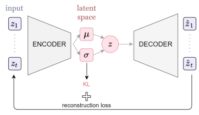
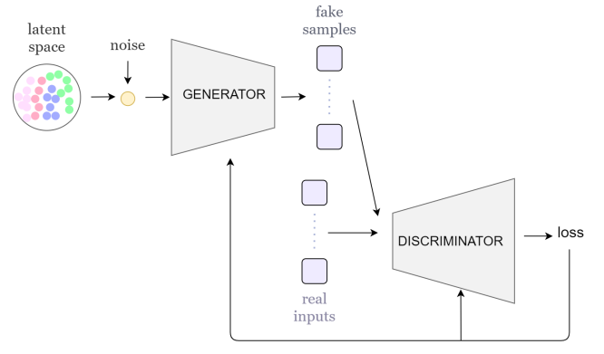
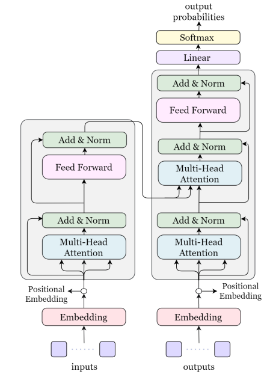
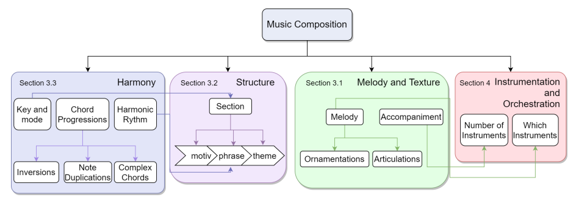
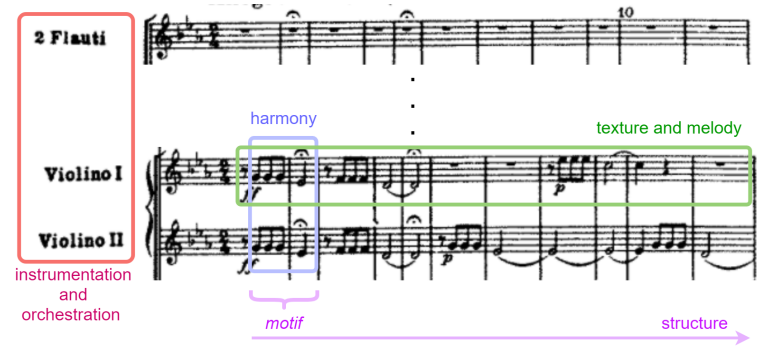
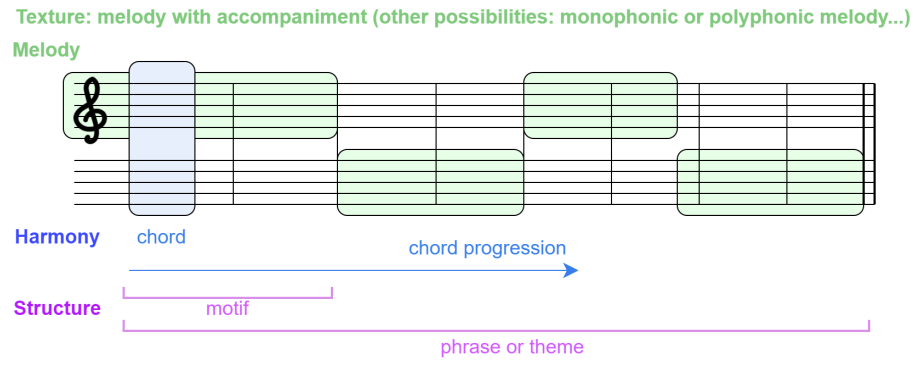
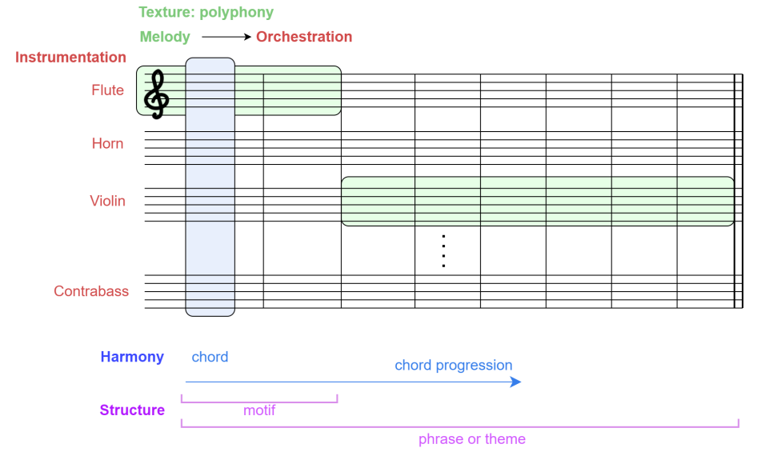
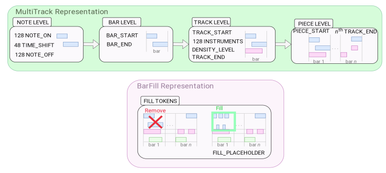

# 深度学习的音乐创作综述

Carlos Hernandez-Olivan

Jose R. Beltran

Department of Engineering and Communications, Calle María de Luna, Universidad de Zaragoza

> **观后简言：**
>
> 

#### 摘要

产生一件复杂的艺术作品，如音乐作品，需要表现出真正的创造力，这取决于与音乐语言层次相关的各种因素。音乐生成一直面临着算法方法，最近还面临着在计算机视觉等其他领域使用的深度学习模型。在本文中，我们希望将基于人工智能的音乐创作模型与人类音乐创作和创造力过程之间的现有关系放在上下文中。我们概述了最近的音乐创作深度学习模型，并从理论角度将这些模型与音乐创作过程进行了比较。我们试图通过分析当前深度学习模型生成具有创造力的音乐的能力，或者人工智能和人类作曲过程之间的相似性等，来回答这项任务中一些最相关的开放性问题。

**关键词：**音乐生成、深度学习、机器学习、神经网络

#### 1 简介

音乐通常被定义为一系列音高或节奏，或两者兼有，在某些特定的模式中。音乐创作（或生成）是创作或创作一首新音乐的过程。音乐创作术语也可以指原创音乐作品。音乐创作需要创造力，这是人类理解和创造一种语言中无穷句子的独特能力，其中大多数句子以前从未遇到或说过。这是在设计或提出基于人工智能的音乐创作算法时需要考虑的一个非常重要的方面。

更具体地说，音乐创作是音乐信息检索领域的一个重要课题。它包括旋律生成、多音轨或多乐器生成、风格转换或协调等子任务。本文将从近年来基于 AI 和 DL 的大量技术的角度来涵盖这些方面。

##### 1.1 从算法合成到深度学习

自 20 世纪 80 年代以来，人们对计算机音乐创作的兴趣从未停止过增长。一些实验出现在 20 世纪 80 年代初，如 David Cope 在 1983 年至 1989 年的音乐智能实验或 Iannis Xenakis 的 Analogiques A 和 B。2000 年代后期，David Cope 还提出了将马尔可夫链与语法相结合用于自动音乐创作，并诞生了其他相关作品，如 Koening 的 Project1（PR1）。这些技术可以归入算法音乐创作领域，这是一种通过可形式化方法进行创作的方式。这种类型的组成是基于一个受控过程，该过程基于必须按照固定顺序遵循的数学指令。算法组合中有几种方法，如马尔可夫模型、生成语法、细胞自动机、遗传算法、过渡网络或 Caos 理论。有时，这些技术和其他概率方法与深度神经网络相结合，以调节它们或帮助它们更好地建模音乐，DeepBach 就是这样。这些模型可以生成和协调不同风格的旋律，但缺乏可推广性。与基于 Depp 学习的模型相比，这些模型的能力和必须手工完成的基于规则的定义使这些方法的功能和可推广性较差。

从 20 世纪 80 年代到 21 世纪初，第一批尝试用神经网络建模音乐的作品诞生了。近年来，随着深度学习（DL）的发展，许多研究试图用深度神经网络（NN）对音乐进行建模。用于音乐生成的 DL 模型通常使用 NN 架构，该架构已被证明在其他领域（如计算机视觉或自然语言处理（NLP））中表现良好。在这些领域中也可以使用预先训练的模型，用于音乐生成。这被称为迁移学习。本文稍后将介绍一些神经网络技术和体系结构。今天的音乐创作采用了来自大规模 NLP 应用程序的输入表示和 NNs 架构，例如基于 Transformer 的模型，它们在这项任务中表现出了非常好的性能。这是因为音乐可以被理解为一种语言，在这种语言中，每种风格或音乐流派都有自己的规则。

##### 1.2 用于深度学习音乐创作的神经网络架构

首先，我们将概述迄今为止在音乐创作任务中提供最佳结果的最广泛使用的神经网络架构。音乐创作任务中最常用的神经网络架构是生成模型，如变分自动机（VAE）或生成对抗网络（GAN），以及基于 NLP 的模型，如长短期记忆（LSTM）或 Transformers。以下是这些型号的概述。

###### 1.2.1 可变自动编码器（VAEs）

原始 VAE 模型使用编码器-解码器架构，通过重建输入来产生潜在空间（见图 1a）。潜在空间是压缩数据的多维空间，其中最相似的元素彼此最接近。在 VAE 中，编码器近似后验，解码器参数化似然。后验近似和似然近似分别由编码器和解码器的具有 λ 和 θ 参数的 NN 进行参数化。后验推理是通过最小化编码器或近似后验之间的 Kullback-Leiber（KL）分歧来完成的，而真正的后验推理则是通过最大化证据下界（ELBO）来完成的。

梯度是用所谓的重新参数化技巧计算的。原始 VAE 模型有一些变化，如 β-VAE，它在重建损失中添加了惩罚项 β，以改善潜在空间分布。在图 1a 中，我们展示了通用 VAE 架构。基于 VAE 的音乐创作 DL 模型的一个例子是 MusicVAE，我们将在本文的下一节中对此进行描述。

###### 1.2.2 生成对抗性网络（GANs）

GANs 是由两个 NN 组成的生成模型：生成器 G 和鉴别器 D。生成器学习输入数据上的分布 p~g~。进行训练是为了让鉴别器最大限度地为训练样本和生成器生成的样本分配正确标签的概率。这种训练思想可以理解为 D 和 G 遵循 Goodfellow 等人所描述的两人极小极大博弈。在图 1b 中，我们展示了通用 GAN 架构。

生成器和判别器可以由不同的 NN 层形成，如多层感知器（MLP）、LSTM 或卷积神经网络（CNN）。

###### 1.2.3 Transformers

Transformers 目前正在 NLP 应用中广泛使用，因为它们不仅在 NLP 中表现良好，而且在计算机视觉模型中也表现良好。Transformers 可以用作自回归模型，如 LSTM，这允许它们用于生成任务。Transformers 背后的基本思想是注意力机制。Vaswani 等人提出的原始注意力机制有几种变体，已用于音乐创作任务。注意力层和前馈层的结合导致了 Transformer 的编码器和解码器的形成，这与同样由编码器和解码器组成的纯 AutoEncoder 模型不同。

Transformers 使用令牌进行训练，令牌是输入的结构化表示。在图 1c 中，我们展示了通用变压器架构。

##### 1.3 深度学习在音乐创作中的挑战

在使用 DL 的音乐创作中，从挑战的角度来看，有不同的观点，这让我们提出了与该领域中使用的输入表示和 DL 模型、实际最先进方法的输出质量或研究人员测量生成音乐质量的方式有关的问题。在这篇综述中，我们问自己以下涉及合成过程和输出的问题：当前的 DL 能够产生具有一定创造力的音乐的模型吗？使用 DL 进行音乐创作的最佳 NN 架构是什么？端到端的方法能生成完整的结构化音乐片段吗？带有 DL 的作曲作品只是对输入的模仿吗？还是 NN 可以生成训练数据中不存在的风格的新音乐？神经网络应该像人类一样遵循同样的逻辑和过程来创作音乐吗？用于音乐生成的 DL 模型需要多少数据？目前的评估方法是否足以比较和衡量创作音乐的创造力？

为了回答这些问题，我们从获得最终作品和 DL 模型输出的过程的角度来研究音乐创作或生成，即人类创作过程和深度学习的音乐生成过程之间的比较，以及生成的音乐所呈现的艺术和创作特征。我们还分析了最近最先进的深度学习音乐创作模型，以显示这些模型提供的结果（主题、完整的作品…）。分析的另一个重要方面是这些模型用于生成音乐的输入表示，以了解这些表示是否适合作曲。这让我们对如何改进这些模型有了一些见解，如果这些神经网络架构足够强大，能够以一定的创造力创作新音乐，以及深度学习音乐创作的方向和未来工作。

##### 1.4 论文结构

在这篇综述中，我们从作曲过程和生成输出的类型来分析音乐作曲任务，我们不包括作品或合成任务。本文的结构如下。第 2 节介绍了音乐创作的一般过程和音乐创作的基本原则。在第 3 节中，我们从旋律作曲的角度概述了最先进的方法，并描述了已测试用于创作结构化音乐的 DL 模型。在第 4 节中，我们描述了生成多音轨或多乐器音乐的 DL 模型，即为多个乐器制作的音乐。在第 5 节中，我们展示了通常用于评估音乐生成模型输出的不同方法和指标。在第 6 节中，我们通过分析我们在第 3 节和第 4 节中描述的模型，描述了音乐生成中仍然存在的悬而未决的问题。最后，在第 7 节中，我们介绍了未来的工作和研究中仍然存在的挑战。

#### 2 音乐创作过程

与书面语言一样，音乐创作过程是一个复杂的过程，取决于大量的决策。在音乐领域，这个过程取决于我们所使用的音乐风格。例如，在古典音乐中，从一个或两个小节的一个小单元开始，称为主题，并将其发展为旋律或音乐短语，这是非常常见的。在流行音乐或爵士乐等风格中，更常见的是采用和弦进行，并在其前面创作或即兴创作旋律，当一个作曲家开始一首音乐时，它背后有一些基本的旋律或和声思想。从古典音乐的角度来看，这个思想（或主题）是由作曲家发展起来的，以构建遵循特定和声进程的旋律或短语，然后这些短语被分段构建。每一节都有自己的目的，因此可以用不同的键书写，其短语通常遵循与其他节不同的和声进行。通常，作品有旋律部分和伴奏部分。一首音乐的旋律部分可以由不同的乐器演奏，这些乐器的频率范围可能相似，也可能不相似，和声部分给这首音乐一种深刻而结构化的感觉。不一定在同一频率范围内的乐器与乐器和编排技术相结合（见第 3.2 节）。这些元素在音乐创作中至关重要，也是定义音乐风格或流派的重要关键。音乐，有两个维度，时间维度和和声维度。时间维度由音符持续时间或节奏表示，这是该轴中的最低级别。在此维度中，注释可以按称为条形的单位进行分组或测量，条形是有序的注释组。另一个维度，和声，与音符值或音高有关。如果我们考虑一个图像，时间维度是横轴，和弦维度是纵轴。和声也有时间上的演变，但这并没有体现在乐谱中。有一种非常常见的基于软件的音乐表示，称为钢琴卷，遵循这种逻辑。

音乐时间维度是以音符为低级单位构建的，这些音符被分组为小节，形成（主题）。在时间高级维度中，我们可以找到由持续八小节或更多小节的短语组成的部分（这取决于风格和作曲家）。和声维度的最低层次是音符层次，然后不同乐器演奏的音符的叠加给了我们和弦。和弦序列被称为和弦进程，与作曲相关，它们在时间维度上也有相关性。话虽如此，我们可以将音乐视为一种复杂的语言模式，由短期和长期关系组成。这些关系在两个维度上延伸，与音乐结构相关的时间维度和与音符或音高和和弦相关的和声维度，即和声。

从符号音乐生成和分析的角度来看，基于 Walton 的思想，音乐的基本原理或元素是（见图 2a）：

- 和声。正是音符的叠加形成了和弦，构成了和弦的进程。音符级别可以被认为是和声的最低级别，其次是和弦级别。最高级别可以被认为是通常属于某个关键的进展级别。
- 音乐形式或结构。它是音乐呈现的高级结构，与时间维度有关。音乐作品中最小的部分是在音乐短语中发展起来的主题，音乐短语的组合形成了一个部分。音乐中的小节是根据音乐风格排序的，例如一些流行歌曲的介绍诗合唱诗（也称为 ABCBA）或奏鸣曲的阐述发展重述或 ABA。不同规模和模式的部分的串联为我们提供了整个构图。
- 旋律和质感。音乐术语中的质感是指为了形成音乐作品，必须在作品中结合旋律、节奏和和声的内容。音乐可以是单声道的，也可以是复调的，这取决于在同一时间段播放的音符，同音的或异音的取决于旋律，对有伴奏或没有伴奏进行区分。
- 乐器和编排。这些音乐技巧考虑了一首音乐作品中乐器或曲目的数量。乐器是指组成一首音乐作品的乐器的组合，而编排是指为组成一首确定的音乐作品的不同乐器分配旋律和伴奏。在录音或基于软件的音乐表现中，乐器被组织为曲目。每首曲目都包含在单个乐器上演奏的音符集。因此，我们可以将一首有多首乐器的乐曲称为多音轨，这是指包含两首或多首曲目的信息，其中每首曲目由一首乐器演奏。每个音轨可以包含一个音符或多个同时发出声音的音符，从而分别产生单声道音轨和复调音轨。

音乐类别之间是相关的。和声与结构有关，因为一个小节通常以相同的音阶和模式演奏。小节之间有抑扬顿挫的节奏，也可以有改变乐曲规模的调调。质地和乐器与音色特征有关，它们之间的关系是基于这样一个事实，即并非所有的乐器都能演奏相同的旋律。一个例子是，当我们有一首带有大量装饰元素的旋律，而这些元素无法用确定的乐器家族演奏（因为每种乐器可能有的技巧或设计的原因）。

另一个重要的音乐属性是动态，但它们与表演有关，而不是与作品本身有关，因此我们在这篇综述中不涉及它们。在图 2b 中，我们展示了我们在这篇综述中涵盖的音乐创作过程的各个方面，并描述了类别之间的关系和论文中讨论每个主题的部分。

#### 3 旋律生成

旋律是一系列具有一定节奏的音符，以一种美学的方式排列。旋律可以是单声道的，也可以是复调的。单音是指在一个时间步长内只演奏一个音符的旋律，而在复调旋律中，在同一时间步长内演奏多个音符。旋律生成是音乐创作的重要组成部分，并且已经尝试了算法合成和包括生成模型（如 VAE 或 GAN）、用于自回归任务（如 LSTM）的递归神经网络（RNN）的几种 NN 架构，神经自回归分散估计（NADE）或自然语言处理中使用的当前模型，如 Transformers。在图 3 中，我们展示了具有旋律生成模型的类似输出的乐谱的音乐基本原理的方案。

##### 3.1 旋律生成的深度学习模型：从主题到旋律短语

根据我们领域的音乐流派，人类的创作过程通常始于主题或和弦的创作，然后扩展到短语或旋律。当涉及到用于音乐生成的 DL 方法时，一些模型可以生成短期音符序列。2016 年，第一批 DL 模型试图使用递归神经网络（RNN）和语义模型（如单元选择）生成短旋律。这些模型适用于短序列，因此创作完整旋律的兴趣随着新 NN 的诞生而增长。从这些最初的作品中衍生出来，为了创造更长的序列（或旋律），出现了其他将神经网络与概率方法相结合的模型。一个例子是谷歌 2016 年发布的 Magenta Melody RNN 模型，以及 2017 年发布的 Anticipation RNN 或 DeepBach。DeepBach 被认为是目前最先进的音乐创作模式之一，因为它能够以巴赫的风格创作四声合唱。

然而，这些方法无法从头开始产生具有高水平创造力的新旋律。为了改进生成任务，研究人员选择了生成模型来进行音乐创作。事实上，如今，在 2 到 16 小节中生成主题或短旋律的最佳表演模式之一是 2018 年出版的 MusicVAE2。MusicVAE 是一种基于 VAE 的音乐生成模型。利用该模型，可以通过在潜在空间中进行插值来生成音乐。该模型使用 Lakh MIDI 数据集（LMD）中的约 150 万首歌曲进行训练，它可以为几乎 3 种乐器生成复调旋律：旋律、低音和鼓。在 MusicVAE 模型的创建以及其他领域新的 NN 架构的诞生之后，可以创建更长旋律的新的基于 DL 的模型的必要性和可用性增加了。基于 Transformers 的新模型出现了，比如 2018 年的 Music Transformer，或者使用预先训练过的 Transformer 模型，比如 OpenAI 在 2019 年提出的 MuseNet 之类的 GPT-2。这些基于 Transformer 的模型，如 Music Transformer，可以生成更长的旋律并继续给定的序列，但在几小节或几秒钟后，旋律会变得有点随机，也就是说，有些音符和和声不符合乐曲的音乐感。

为了克服这个问题，并开发出能够生成更长序列而不会失去前几小节或主旋律中生成的音乐感的模型，新模型在 2020 年和 2021 年诞生，作为 VAE、Transformers 或其他 NN 或机器学习算法的组合。这些模型的一些例子是 TransformerVAE 和 PianoTree。这些模型即使在复调音乐中也表现良好，并且可以生成音乐短语。最新发布的生成完整短语的模型之一是 Mittal 等人在 2021 年提出的模型。该模型基于去噪扩散概率模型（DDPM），这是一种新的生成模型，通过学习将扩散过程从数据反转为高斯噪声来生成高质量样本。该模型使用 MusicVAE 2 小节模型来训练扩散模型，以捕获 k＝32 的 VAE 潜伏时间 z~k~ 之间的时间关系，这将允许生成 64 小节（每个潜伏 2 小节）的 32 个潜在变量。尽管可以产生更长的复调旋律，但它们不遵循中心主题，因此往往会失去特定方向的感觉。

##### 3.2 结构意识

正如我们在第一节中提到的，音乐是一种结构化的语言。一旦旋律被创作出来，它们就必须被分成更大的部分（见图 2），这些部分在作品中起着基本的作用。这些部分有不同的名称，根据音乐风格而有所不同，如流行或 trap 流派的介绍、合唱或诗歌，以及古典奏鸣曲的阐述、发展或重述。小节也可以用大写字母命名，歌曲结构可以用 ABAB 表示。生成有结构的音乐是 DL 音乐创作中最困难的任务之一，因为结构意味着节奏、和弦进行和旋律的美感，这些美感与桥段和抑扬顿挫相连。

在 DL 中，已经有一些模型试图通过施加具有自相似性约束的高级结构来生成结构化音乐。其中一个例子是 Lattner 等人在 2018 年提出的模型，该模型使用卷积限制玻尔兹曼机（C-RBM）生成音乐，并使用自相似矩阵进行自相似约束，以将作品的结构视为模板。这种强加结构模板的方法类似于作曲家在作曲时遵循的作曲过程，并且所产生的音乐片段遵循强加的结构模板。尽管新的 DL 模型趋向于端到端，并且正在发布关于用结构建模音乐的新研究，但还没有 DL 模型可以自己生成结构化音乐，也就是说，没有传递给 NN 的模板或高级结构信息的帮助。

##### 3.3 和声与旋律调节

在 DL 音乐创作中，有一项任务是协调给定的旋律，这与从头开始创作复调旋律的任务不同。一方面，如果我们用 DL 模型从头开始分析创作的旋律的和声，我们会发现用 DL 生成的音乐结构不好，因为它还没有组成不同的小节，也没有以端到端的方式在小节之间书写美学韵律或桥梁。尽管如此，组成复调旋律的基于 Transformer 的模型所产生的和声在所产生作品的第一小节中是连贯的，因为它遵循某个键。我们必须强调的是，这些旋律是为钢琴而写的，这与多乐器音乐不同，多乐器音乐带来了额外的挑战，例如为每种乐器生成合适的旋律或伴奏，或者决定由哪些乐器组成合奏（见第4节）。

另一方面，旋律协调的任务包括产生伴随给定旋律的和声。伴奏可以是和弦伴奏，而不考虑和弦所在的乐器或音轨，也可以是多音轨伴奏，其中每个和弦中的音符都属于特定的乐器。最初的协调模型使用 HMM，但这些模型通过 RNN 进行了改进。一些模型预测和弦函数，而其他模型匹配给定旋律的和弦伴奏。关于生成具有不同音轨的伴奏，已经提出了基于 GAN 的模型，该模型实现 lead sheet arrangement（前导片安排，个人认为翻译为基于片段相联）。2018 年，提出了一种称为 MICA 的多乐器联合编排模型，并在 2020 年对其进行了改进，以生成多音轨伴奏。还有一种模型叫做巴赫涂鸦，它使用 Coconet 为巴赫风格的给定旋律生成伴奏。这些模型的和声质量提高了从头开始创作复调旋律的模型所产生的和声，因为该模型专注于旋律内容来执行和声，这比从头开始创作一首完整的和谐作品的挑战更小。

在使用条件反射的 DL 音乐生成中还有更多的任务，例如生成一个给定和弦进行的旋律，这是人类遵循的一种作曲方式。这些任务已经用变分自动编码器（VAE）、生成对抗性网络或基于 GAN 的模型和端到端模型来解决。其他模型执行整个作曲过程，如 ChordAL。该模型生成和弦，然后将获得的和弦级数发送到旋律生成器，并将最终输出发送到音乐风格处理器。BebopNet 等模型从爵士乐和弦中生成旋律，因为这种风格在和声环境中带来了额外的挑战。

##### 3.4 风格转换与风格转换

在音乐中，一种风格或流派被定义为从音乐理论到声音设计的复杂混合特征。这些特征包括音色、作曲过程和乐曲中使用的乐器或合成音乐的效果。由于有很多音乐流派，而其中一些流派缺乏数据集，因此通常使用风格转换技术，通过改变现有音符的音高或添加适合我们想要转换音乐的风格的新乐器，将确定风格的音乐转换为其他风格。

在基于计算机的音乐创作中，在音乐中进行风格转换的最常见技术是获得风格的嵌入，并使用该嵌入或特征向量来生成新音乐。2016 年，Gatys 等人引入了 NNs 中的风格转移。其想法是将风格特征应用于另一幅图像中的图像。2018 年的 MIDI-VAE 是最早将风格转移用于符号音乐生成的研究之一。MIDI-VAE 将潜在空间中的风格编码为音高、动态和乐器特征的组合，以生成复调音乐。风格迁移也可以通过迁移学习来实现。第一个使用迁移学习进行风格迁移的工作是 Hung 等人在 2019 年提出的爵士乐的递归 VAE 模型。迁移学习是通过在源数据集上训练模型来完成的，然后在目标数据集上微调得到的模型参数，这些参数可以采用与源数据集不同的风格。该模型表明，使用迁移学习将一首确定风格的音乐作品转换为另一首是一个很好的解决方案，因为它不仅可以用于将现有作品转换为新的流派，还可以用于从头开始创作当今使用的音乐创作数据集中不存在的流派的音乐。这方面的一个例子可以是使用使用大型流行数据集（如 Lakh MIDI 数据集（LMD））训练的 NN，并使用该预训练模型通过迁移学习生成城市音乐。

其他音乐特征，如和声和纹理（见图 2）也被用作风格转移特征。也有人研究了融合流派模型，其中不同的风格被混合以生成未知风格的音乐。

#### 4 仪器和编排

正如我们在第 2 节中提到的，乐器和编排是正在创作的音乐流派中的基本元素，并且可以通过使用特定的乐器或编排作品的方式来代表每个作曲家的特征。一个例子是贝多芬在交响乐中使用的编排，它改变了音乐的创作方式。乐器是研究如何将相似或不同的乐器以不同的数量组合在一起，以创建合奏。编排是对得分相似或不同部分的选择和组合。由此，我们可以将乐器作为作品的颜色，将编排与作品的美学方面联系起来。乐器和编排对我们感知音乐的方式以及音乐的情感部分都有巨大的影响，但是，尽管它们代表了音乐的基本部分，但情感超出了这部作品的范围。

##### 4.1 从复调音乐到多乐器音乐的生成

在基于计算机的音乐创作中，我们可以将乐器和编排概念组合在多乐器或多音轨音乐中。然而，用于多仪器生成的基于 DL 的模型并不完全符合这些概念。基于多乐器 DL 的模型为多个乐器生成复调音乐，但是，生成的音乐是否遵循连贯的和声进程？由此产生的编曲在乐器和编排方面是连贯的，还是基于 DL 的模型只是生成多乐器音乐而不考虑每个乐器或编曲的特色？在第 3 节中，我们展示了复调音乐的产生可以创作出具有一定和声感的音乐，但在面对多乐器音乐时，最重要的一个方面是要考虑乐器和合奏的特色。决定合奏中有多少和哪些乐器，以及如何在它们之间划分旋律和伴奏，是 DL 音乐生成中尚未解决的问题。近年来，构建从头开始生成音乐的 DL 模型面临着这一挑战，这些模型可以是人类可以选择合奏乐器的交互式模型。还有一些模型可以修复仪器或棒材。我们描述了这些模型，并回答了第 4.2 节中暴露的问题。在图 4 中，我们展示了具有多乐器生成模型的类似输出的乐谱的音乐基本原理的方案。

##### 4.2 从零开始多仪器生成

第一个可以生成多音轨音乐的模型已经被广泛提出。在多音轨音乐生成之前，一些模型为给定的旋律或和弦生成鼓音轨。这些模型的一个例子是 Kang 等人在 2012 年提出的模型。该模型用自动鼓发生器以给定的比例伴随旋律。后来，在 2017 年，Chu 等人使用分层 RNN 生成了有鼓的流行音乐。

音乐生成中最常用的架构之一是生成模型，如 GANs 和 VAE。2017 年推出的 MuseGAN 是第一个被考虑和最知名的多音轨音乐生成模型。然后，更多的模型实现了多仪器生成任务，并在 2020 年晚些时候发布了基于自动编码器的其他模型，如 MusAE。最近用于生成音乐的另一大类 NN 架构是 Transformers。最著名的 Transformer 音乐生成模型是钢琴复调音乐生成的 Music Transformer。2019 年，Donahue 等人提出了用于多音轨音乐生成的 LakhNES，2020 年，Ens 等人提出了一种条件多音轨音乐产生模型（MMM），该模型基于 LakhNES，并通过将多个音轨连接成单个序列来改进该先前模型的令牌表示。该模型使用 MultiInstrument 和 BarFill 表示，如图 5 所示。在图 5 中，我们展示了 MultiInstrument 表示，它包含 MMM 模型用于生成音乐的令牌，以及用于修复的 BarFill 表示，即生成一个小节或几个小节，但保持作品的其余部分。

从作曲过程的角度来看，这些模型不是编排或乐器化的，而是从头开始或通过修复来创作音乐。这意味着这些模型不选择乐器的数量，也不生成与所选乐器相关的高质量旋律或伴奏内容。例如，MMM 模型为遵循乐器音色特征的预定义乐器生成旋律内容，但当在保留其他曲目的同时修复或重新创建单个乐器时，有时很难遵循其他乐器的组成键。这使我们得出结论，用于音乐生成的多乐器模型专注于端到端的生成，但在乐器或编排方面仍然不能很好地工作，因为它们仍然无法决定生成的音乐中的乐器数量。他们为他们训练的合奏生成音乐，如 LakhNES，或者他们采用预定义的曲目来生成每个曲目的内容。最近的模型，如 MMM，在多乐器生成方面打开了人类和人工智能之间的互动，这将允许更好地跟踪人类的作曲过程，从而改进使用多乐器生成的音乐。

#### 5 评估和指标

音乐生成中的评价可以根据测量 DL 模式的输出的方式来划分。Ji 等人区分了客观评价和主观评价。在音乐中，有必要从主观的角度来衡量结果，因为这是一种评估类型，告诉我们与人类创造力相比，模型带来了多少创造力。有时，计算模型结果指标的客观评估可以让我们了解这些结果的质量，但很难找到将其与创造力概念联系起来的方法。在本节中，我们将展示最先进的模型如何从客观和主观的角度衡量其结果的质量。

##### 5.1 客观评价

客观评估使用一些数字度量来衡量模型的性能及其输出的质量。在音乐生成中，存在比较为不同目的训练的模型和使用不同数据集训练的模型的问题，因此我们对最先进的模型中使用的最常见的度量进行了描述。Ji 等人通过区分模型度量和音乐度量或描述性统计，以及其他方法，如模式重复或剽窃检测。

当你想衡量一个模型的性能时，根据用于生成音乐的 DL 模型，最常用的指标是：loss 损失、perplexity 混淆、 BLEU 分数、precision 精度（P）、recall 回忆（R）或 F-core（F1）。通常，这些度量用于比较为相同目的构建的不同 DL 模型。

损失通常用于从数学角度显示模型的输入和输出之间的差异，而另一方面，混淆告诉我们一个模型具有的泛化能力，这更多地与模型如何生成新音乐有关。例如，音乐转换器使用损失和混淆来比较不同转换器架构之间的输出，以验证模型，TonicNet 仅将损失用于相同的目的，MusicVAE 仅使用指示模型具有的重建质量的度量，但是不使用任何度量来在其他 DL 音乐生成模型之间进行比较。

关于与音乐特别相关的指标，即考虑音乐描述符的指标，我们可以发现这些指标有助于衡量作品的质量。根据 Ji 等人，这些指标可以分为四类：音高相关、节奏相关、和声相关和风格转移相关。音高相关指标，如音阶一致性、音调误差音、空小节比率或使用的音高类别数量，是衡量音高属性的指标。节奏相关指标考虑了音符的持续时间或模式，例如，节奏变化、同时出现的三个或四个音符的数量或重复音高的持续时间。和声相关指标测量和弦的熵、距离或覆盖范围。这三个度量类别被 MuseGAN、C-RNN-GAN 或 JazzGAN 等模型使用。最后，与风格转换相关的技术有助于了解迭代与所需风格的距离有多近或多远。其中包括风格契合、内容保留或转移强度。

##### 5.2 主观评价

主观观点决定了生成的音乐在创造力和新颖性方面的表现，也就是说，生成的音乐可以在多大程度上被视为艺术。虽然艺术涉及创造力和美学。Sternberg 和 Kaufman 将创造力定义为做出新颖且适合任务的贡献的能力，通常带有附加的成分，如高质量的、令人惊讶的或有用的。创造力需要对音乐知识的本质和使用有更深入的理解。根据 Ji 等人的说法，音乐质量的定量评估与人类判断之间缺乏相关性，这意味着音乐生成模型也必须从主观角度进行评估，这将使我们深入了解模型的创造性。主观评价中最常用的方法是听力测试，它通常由人类来区分机器生成的音乐和人类创造的音乐。这种方法被称为图灵测试，用于测试 DeepBach。在这个模型中，来自不同音乐体验群体的 1.272 人参加了测试。该测试表明，模型越复杂，输出就越好。MusicVAE 还进行了听力测试和 Kruskal-Wallis H-test，以验证模型的质量，得出的结论是，使用分层解码器时，模型表现更好。MuseGAN 还对 144 名用户进行了听力测试，他们被分为具有不同音乐体验的小组，但用户必须在 1-5 个范围内投票决定一些预先定义的问题：和声、节奏、结构、连贯性和整体评分。

其他收听方法需要对生成的音乐进行评分，这被称为并排评分。根据模型的生成目标，还可以向听众询问一些关于模型的创造性或生成作品的自然性等问题。在听力测试中需要记住的一件重要的事情是选择参加测试的人群的可变性（如果听众是具有音乐理论基础知识的音乐学生，如果他们是业余爱好者，因此他们没有任何音乐知识，或者如果他们是专业音乐家）。听众必须有相同的刺激，也必须听相同的片段，并有相同的人类创造的片段作为参考（如果适用的话）。听觉疲劳也必须考虑在内，因为如果长时间听类似的样本，听众可能会产生偏见。

话虽如此，我们可以得出结论，当涉及到音乐生成时，听力测试是必不可少的，因为它可以反馈模型的质量，而且它们也可以是找到正在研究的更好的 NN 架构或 DL 模型的一种方法。

#### 6 讨论

我们已经证明，音乐是一种结构化的语言模型，具有时间和和声的短期和长期关系，需要深入了解其所有见解才能建模。这一点，加上音乐中存在的各种流派和子流派，以及创作一首音乐作品所遵循的大量创作策略，使 DL 音乐生成领域成为一个不断发展和具有挑战性的领域。在描述了音乐创作过程和 DL 最近为音乐生成所做的工作后，我们现在将讨论第 1.3 节中提出的问题。

##### 目前的DL模型是否能够产生具有一定创造力的音乐？

使用 DL 生成音乐的第一个模型使用了诸如 LSTM 之类的 RNN。这些模型可以生成注释，但在生成长期序列时失败了。这是因为这些 NN 没有处理音乐生成所需的长期序列。为了解决这个问题，并能够通过插入两个现有的基序或从分布中采样来生成短基序，创建了 MusicVAE。但由此产生了一些问题：现有主题之间的插值是否会在同一首音乐中产生有意义的高质量主题？如果我们使用 MusicVAE 来创建一个简短的主题，我们可以获得非常好的结果，但如果我们使用这种模型来生成与输入相似的较长短语或主题，这些插值可能会输出具有美感的主题，但有时它们不遵循输入所具有的任何节奏或音符方向（上升或下降）模式。因此，这些插值通常无法生成高质量的主题，因为模型不了解节奏模式和音符方向。此外，和弦进行通常有倒置，古典音乐中有规则，流行音乐、爵士乐或城市音乐中有风格限制，这些规则决定了每个和弦后面是另一个和弦。如果我们分析 DL 方法生成的复调旋律，则在和声内容方面缺乏质量，因为被训练来生成音乐的神经网络无法理解音乐语言中存在的所有这些复杂性，或者因为这些信息应该作为输入的一部分（例如作为令牌）传递给神经网络。

##### 使用 DL 进行音乐创作的最佳 NN 架构是什么？

Transformer 架构已经与不同的注意力机制一起使用，这些机制允许对更长的序列进行建模。这方面的一个例子是 MMM 模型的成功，该模型使用 GPT-2 生成多音轨音乐。尽管该模型使用了预先训练的 Transformer 来生成文本，但它在和声和节奏方面生成了连贯的音乐。其他架构使用生成网络，如 GANs 或 VAE，以及这些架构中的 Transformers。这些模型的发展提高了提取高级音乐属性的可能性，如风格和在潜在空间中组织的低级特征。然后，这个潜在空间被用来在这些特征和属性之间进行插值，以基于现有作品和音乐风格生成新的音乐。

通过分析过去几年中使用 DL 生成音乐的神经网络模型和架构，没有一种特定的神经网络架构能更好地实现这一目的，因为可以用于构建音乐生成模型的最佳神经网络架构将取决于我们想要获得的输出。尽管如此，正如该领域的最新作品所表明的那样，Transformers 和 Generative 模型正在成为目前最好的替代品。两种模型的组合也是执行音乐生成的一个很好的选择，尽管这取决于我们想要生成的输出，有时最佳解决方案来自 DL 与概率方法的组合。另一个需要考虑的方面是，通常，音乐生成需要具有大量参数和数据的模型。我们可以通过将预先训练的模型作为我们在前几节中描述的一些最先进的模型来解决这个问题，然后对另一个 NN 架构进行微调。另一种选择是拥有一个预训练的潜在空间，该空间是通过像 MusicVAE 提出的那样用巨大的数据集训练一个大模型来生成的，然后利用预训练的潜伏空间训练一个数据较少的较小 NN，以调节音乐作品的风格，正如 MidiMe 提出的。

##### 端到端的方法能生成完整的结构化音乐片段吗？

正如我们在第 3.2 节中所描述的，现在有一些基于结构模板的模型可以生成结构化音乐，但还没有一种端到端的方法可以创作结构化音乐作品。人类作曲家遵循的音乐创作过程类似于这种基于模板的方法。在不久的将来，人工智能很可能从头开始创作结构化音乐，但这里的问题是，用于音乐生成的人工智能模型是否会被用来从头开始创作整个音乐作品，或者这些模型是否会更有用，作为作曲家的辅助，从而作为人类与人工智能之间的互动。

##### 带有 DL 的作曲作品只是对输入的模仿吗？还是 NN 可以生成训练数据中不存在的风格的新音乐？

