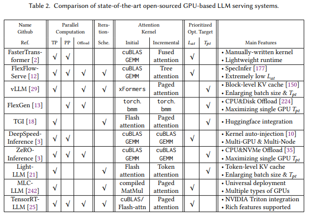

# 高效的生成式大语言模型服务——从算法到系统的综述

美国卡内基梅隆大学苗旭鹏

美国卡内基梅隆大学加布里埃尔·奥利亚罗

美国卡内基梅隆大学张志豪

美国卡内基梅隆大学程新浩

美国卡内基梅隆大学金泓毅

美国卡内基梅隆大学陈天奇

美国卡内基梅隆大学贾之豪

在人工智能（AI）快速发展的领域中，生成型大型语言模型（LLMs）位于前沿，彻底改变了我们与数据的交互方式。然而，在需要低延迟和高吞吐量的场景中部署这些模型将对于计算强度和内存消耗的效率提供方面有了更大要求。该论述从机器学习系统（MLSys）的研究视角来讨论高效 LLM 服务方法的迫切需求，这是人工智能创新和实际系统优化的关键。本文提供深入的分析，涵盖一系列解决方案，从尖端的算法修正到系统设计的突破性变化。这项调查旨在提供对高效 LLM 服务的当前状态和未来方向的全面了解，为研究人员和从业人员在有效克服部署 LLM 的障碍、重塑 AI 的未来方面提供有价值的见解。

CCS 概念：• 计算方法学→机器学习；并行计算方法学；自然语言处理；• 一般和参考→调查和概述；• 硬件→新兴设备和系统的分析和设计；新兴技术；• 计算机系统组织→架构；• 软件及其工程→操作系统。

额外关键词和短语：大型语言模型，效率，算法，系统，推理，服务。

ACM参考格式：Xupeng Miao, Gabriele Oliaro, Zhihao Zhang, Xinhao Cheng, Hongyi Jin, Tianqi Chen, and Zhihao Jia. 2018. 向高效的生成式大型语言模型服务迈进：从算法到系统的调查. J. ACM 37, 4, 文章111 (2018年8月), 32页。https://doi.org/XXXXXXX.XXXXXXX

## 1. 引言

生成式大型语言模型（LLMs）已成为推动人工智能（AI）实现重大进展的主导力量，并在许多与语言相关的任务中展示出卓越的性能。从机器翻译到情感分析、问答和文本生成，这些模型在理解、生成和操作人类语言方面展示了自己的能力。基于 Transformer 的架构的出现，如 GPT 系列（Generative Pre-trained Transformer）、LLaMA 系列和其他最新的公开 LLMs（如 OPT 、BLOOM、Mistral 、DeciLM、Baichuan 、GLM），在这一模式转变中起到了关键作用，彻底改变了自然语言处理（NLP）任务的处理方式。除了 NLP，这些模型还在更广泛的应用领域产生变革，包括自动化编程、科学探索、个性化数字助手、创意艺术和下一代计算架构，展示了它们的多功能性和深远影响。

然而，LLM 史无前例的成功也带来了一系列挑战，其中最显著的是在服务过程中对计算资源的巨大需求。庞大的模型大小和复杂性，加上对大量计算资源的需求，阻碍了它们在实际应用中的广泛部署。这些模型对资源的密集利用性引发了对能源消耗、可扩展性和可访问性的担忧，阻碍了它们在没有像大公司那样丰富计算资源的更广泛社区中的采用。

本调查论文旨在解决高效的 LLM 服务的关键需求，并全面探讨研究界提出的现有多方面策略，以解决这一挑战。我们对从算法创新到新型系统架构的整个解决方案范围进行了深入研究，所有这些解决方案都旨在优化大型语言模型的推理过程。

#### 1.1 目标
本次调查的主要目标是全面介绍 LLM 服务和推理方面的最新进展。我们将根据它们的基本方法系统地审查和归类现有的技术，突出它们的优点和局限性。这项调查将涵盖广泛的方法论，包括解码算法、架构设计、模型压缩、低位量化、并行计算、内存管理、请求调度和内核优化。

#### 1.2 结构

本文的结构如下：第  2节介绍了关于 LLM 服务的背景信息。第 3 节包括我们对高效 LLM 服务现有方法的分类，并从算法创新 (§ 3.1) 和系统优化 (§ 3.2) 两个方面重新审视了这些相关工作。之后，我们列出了一些代表性的 LLM 服务框架，并在第 4 节提供了分析。第 5 节讨论了 LLM 服务系统的基准测试。第 6 节阐明了本调查与其他相关文献的联系。最后，在第 7 节提出了一些有前景的探索方向，以提高生成式 LLM 服务的效率，以激励未来的研究。

## 2 背景

#### 2.1 基于 Transformer 的大型语言模型

基于 Transformer 的大型语言模型（LLMs）在自然语言处理领域标志着重大转变，引入了一种理解和生成人类语言的新范式。这一创新的核心是 Transformer 架构，它建立在自注意力机制的概念基础之上，允许模型在进行预测时权衡输入数据的不同部分的重要性。在数学上，Transformer中的自注意力机制可以描述如下：对于输入序列 𝑋 = [𝑥1, 𝑥2, ..., 𝑥𝑛]，Transformer使用 𝑋 的线性变换来计算一组查询 𝑄、键 𝐾 和值 𝑉。然后计算自注意力分数如下：

.png)

其中，𝑑~𝑘~ 是键的维度。这种机制使得模型能够针对输出的每个元素，在输入序列的不同部分上进行聚焦，捕捉不论它们在输入序列中的距离多远的复杂依赖关系。

Transformers 中的另一个重要结构是前馈网络（FFN），它存在于 Transformer 的每一层，显著地增加了计算强度。FFN 通常由两个线性变换和一个非线性激活函数组成，通常表示为：

.png)

这里，𝑊~1~、𝑊~2~、𝑏~1~ 和 𝑏~2~ 是 FFN 的可学习参数，非线性函数 max(0, ·)（在本例中为 ReLU）引入了模型所需的非线性，使其能够学习更复杂的模式。FFN 对模型的参数数量以及由此引起的内存占用和计算负荷负有重要责任。在每个 Transformer 层中，多头注意力（MHA）从输入的不同部分汇总信息后，FFN 对每个位置的这些汇总信息进行独立处理。这种并行处理能力是 Transformer 的关键优势，使其能够有效处理序列。然而，这也意味着计算负荷和内存需求会随着输入序列的长度和网络深度而增加。

基于 Transformer 的语言模型中，自注意力机制和前馈神经网络的组合使得这些模型能够捕捉各种语言背景和细微差别，在各种自然语言处理任务中树立了新的基准。然而，训练和推理所需的计算资源较多已经成为研究的一个重要领域，着重优化这些方面而不会显著影响性能。Transformer 模型还包括其他关键组件，例如位置编码，它添加了有关序列中每个标记位置的信息，以及多头注意力机制，它使得模型能够在不同的表示空间中关注序列的不同部分。

#### 2.2 GPU和其他加速器

对于 LLM 的迅速发展，很大程度上归功于 GPU 架构和其他加速器的发展，这些是提高模型性能和效率的核心。 GPU（图形处理单元）已成为这一领域的基石，主要是因为其卓越的并行处理能力。与专为顺序处理而设计的传统CPU不同，GPU由数千个小型高效核心组成，旨在同时处理多个任务。这使它们非常适合处理在深度学习计算中普遍存在的矩阵和向量运算，特别是针对基于 Transformer 的模型。

典型的 GPU 架构包括流式多处理器（SM）阵列，每个 SM 包含多个核，这些核共享一个公共指令单元，但可以并行执行独立的线程。此外，每个 SM 内的共享内存（SRAM）允许线程之间进行高效的数据交换和同步，极大地优化了 LLM 计算所需的内存访问模式。这种设计对 LLM 中的计算密集型任务特别有益，如 Transformer 中的自注意力和前馈网络的计算。GPU 还配备了高带宽内存（HBM），这使得数据传输速率更快，大大减少了大规模计算中与内存访问相关的瓶颈。此外，最新的 GPU 架构，如 NVIDIA 的 Ampere 和 Hopper 架构，不断提供增强功能并突破 LLM 计算的极限，例如改进的内存带宽和容量，更高的每秒浮点运算（FLOPS），专门的混合精度计算单元（例如张量核心），以及更有效地利用资源，进一步加强了 LLM 的性能。其中一些支持各种精度格式，包括 FP32（32位浮点）、TF32（张量浮点-32）、FP16（16位浮点）、BF16（脑浮点）、甚至 INT8/INT4，从而在计算速度和数值精度之间提供灵活的权衡，这对 LLM 性能的优化至关重要。

除了 GPU 以外，研究人员还探索了大量的硬件平台用于低量化感知部署，其中包括 CPU、移动和边缘设备、ASIC，以及专用加速器如 TPU、FPGA 和来自各个制造商的其他新兴 AI 芯片（如苹果M2 Ultra，AWS Inferentia，SambaNova，Cerebras ，Graphcore IPU）。这项调查主要强调了基于 GPU 使用的研究，以及推动这一重点的几个技术动机。由于其架构创新和卓越的计算能力，GPU 在过去几年中主导了大规模深度学习领域的研究。此外，GPU 的编程语言，如 NVIDIA 的 CUDA 和 AMD 的ROCm，可以对线程层次结构进行精细控制，使研究人员能够利用GPU内在的大规模并行性。这吸引了众多开发者在这些 GPU 之上构建成熟的软件生态系统，促进了大部分重要和先进的低量化感知研究。虽然其他硬件平台确实在特定环境中具有独特的优势，但围绕 GPU 的广泛的研究、开发和部署使其成为深入理解低量化感知推理方法的重要参考。考虑到硬件的相似性，其他硬件平台也可以从本调研中讨论的设计理念、见解和方法中受益。

#### 2.3 LLM 推断

LLM 推断，特别是在像 GPT（生成式预训练 Transformer）这样的模型中，通常采用自回归解码方法。这种方法对于这些模型生成文本至关重要，确保每个新生成的单词或标记都考虑了到目前为止生成的整个序列。自回归解码按照顺序预测序列中的下一个标记，考虑到所有先前的标记，如算法 1 所示。

在这里，𝑃 (𝑦|𝑋~𝑡−1~) 代表给定当前序列 𝑋~𝑡−1~ 时下一个令牌 𝑦 的概率，⊕ 表示连接操作。argmax 函数用于在每一步选择最有可能的下一个令牌。

这种自回归方法在生成连贯的和上下文适当的文本的 LLM 推断中是基础性的。它确保每个生成的标记都是基于对先前生成内容的全面理解条件，从而使 LLM 能够生成高度相关和流畅的文本序列。之前的研究提供了对基于 Transformer 的 LLM 推断算法强度（例如，计算 FLOPS、I/O 和内存消耗）的深入分析，以及对成本估计的广泛实证结果（例如，根据自回归解码算法执行模型推断延迟）。LLM 推断的优化是一个复杂的问题，因为不同的算法配置和系统设置可能存在不同的最优策略。

#### 2.4 挑战

本节描述了实现高效的 LLM 服务的各种挑战。

- **延迟和响应时间。**在大型语言模型的推断中，实现低延迟和快速响应时间是非常重要的，特别是在实时应用程序（如聊天机器人、虚拟助手和交互系统）中。在不降低准确性的前提下，平衡模型复杂性和推断速度是一个关键的挑战，需要优化算法和系统架构，以最大程度地减少响应时间。
- **内存占用和模型大小。**大型语言模型由于其规模和包含的大量参数而具有显著的内存需求。在内存受限的设备上部署这种模型是一个挑战，需要开发有效的模型压缩技术和系统优化方法，以减少内存占用，同时不损害性能。
- **可扩展性和吞吐量。**推断系统通常在生产环境中面临不同级别的请求负载。确保可扩展性和高吞吐量，以有效处理多个同时请求，需要并行计算、请求调度和其他系统级优化方法，以有效地分配资源上的计算工作负载。
- **硬件兼容性和加速。**高效利用硬件资源对于大型语言模型推理至关重要。将 LLM 模型适配到各种硬件平台和架构，包括 CPU、GPU 和专门的加速器，需要硬件感知的算法设计和优化，以充分发挥底层硬件的潜力。
- **精确性和效率之间的权衡。**优化 LLM 推理的效率有时可能会牺牲模型的准确性。在模型大小、计算复杂度和性能之间取得合适的平衡是一个具有挑战性的任务，需要仔细考虑和评估各种算法和系统级技术。

## 3 分类

目前改善 LLM 服务效率的努力可以大致分为两类，包括算法创新和系统优化，下面将分别讨论这两类。

#### 3.1 算法创新

本节对提出的各种算法和技术进行了全面分析，旨在通过算法进步解决大规模 Transformer 模型的性能缺陷问题。

###### 3.1.1 解码算法

在本章中，我们将回顾如图 2 所示的优化 LLM 推理过程的新型解码算法。这些算法旨在降低计算复杂性，增强在生成任务中语言模型推理的整体效率。

- **非自回归解码。**现有 LLM 的一个主要限制是默认的自回归解码机制，逐个生成输出标记。为了解决这个问题，有一系列研究工作的代表性线路是放弃自回归生成范式，采用并行解码的输出标记。非自回归解码首先被提出用于机器翻译加速，通过在解码过程中打破单词之间的依赖关系，假设一定程度的条件独立性。为了缓解翻译质量降低，一些后续研究如半自回归解码进一步扩展这些非自回归方法，通过建模输出之间的依赖关系或迭代优化输出标记，达到保证自回归模型的质量。块状并行解码在基础 LLM 中插入一个单一的前馈层，以并行方式预测未来多个位置的输出，然后回退到由基础模型验证的最长前缀。然而，这些方法需要奢侈地重新生成具有新依赖性的新  LLM，或调整原始 LLM 的部分层，这并不总是可行的。最近一些工作致力于在一个解码步骤中生成多个标记，而无需对模型进行任何训练或修改。并行解码将贪婪自回归解码重新构造为一个可以并行解的非线性方程系统，利用雅可比和高斯-塞德尔迭代法进行快速推理。已经提出了一份关于非自回归翻译的广泛调研，总结了这个方向上的最近进展。到目前为止，由于对输出标记之间的条件依赖关系缺乏认识，大多数非自回归方法的输出质量仍然不如自回归方法可靠，尽管在解码速度上有所提升。
- **探索性解码。**另一方面，通过利用推测执行和提高解码并行性，可以解决顺序执行的限制。在自回归 LLM 推理过程中，每个解码步骤都可以视为执行一个带有条件分支的程序，例如决定下一个要生成的标记。推测解码提出了一种在高效的方式下首先进行多步预测的方法（例如，使用具有更少模型参数的较小的草稿模型），并与 LLM 同时验证这些预测。然而，将推测解码应用于 LLM 仍然存在一些实际挑战，例如如何使解码预测轻量级且足够准确，以及如何使用 LLM 实现高效的并行验证。SpecInfer 首先通过引入多个小的草稿模型，配合一种基于树状结构的推测推理和标记验证机制，并提出了低延迟 LLM 服务系统的实现（第 4 节）。推测解码的主要优势在于增加了并行性而无需更改输出。这种保证来自于预测输出始终由原始 LLM 进行验证，当预测出错时会启用备用机制。
- **提前退出。**一些其他研究试图利用现有 LLM 的深层多层架构，并利用提前退出机制来加速解码过程。这种方法的基本思想是，提前模型层的输出有能力自信地推断目标分布。它们可以基于内部分类器发出预测，而不必运行整个 LLM，已经探索了各种退出条件 。它们也被称为自适应计算，因为它们调整每个请求的计算量，以摊销总的推理成本，即在更容易推理的请求中使用较少的计算量。广泛而言，这些方法大多限制于内部表示所携带的信息不足，并且可能无法准确预测。
- **级联推理。**根据推理请求的复杂性不同，级联推理采用一系列不同规模的 LLM 套件来最小化响应时间。CascadeBERT 不直接使用大型模型处理每个查询，而是涉及一系列对应于不同模型深度的内部分类器，并以级联的方式进行组织，根据实例的难度自适应地选择适当的分类器。Tabi 优化用于服务辨别模型（即非生成型 LLM）的方法，但采用类似的方法，将小型模型和 LLM 结合起来处理具有不同置信度的查询。Frugal-GPT 利用基于学习的方法，自适应地将查询分配给不同的 LLM API，同时优化成本和性能。并行工作联合优化模型复用和查询缓存，并分析最小化推理成本的最优性。Mixture-of-thought 将级联思想扩展到 LLM 的推理任务中以节省成本，它从 Chain-of-Thought 和 Program-of-Thought 提示中采样答案。总的来说，级联推理是提高推理效率的一个有前景的方向，但设计准确的调度机制以避免牺牲模型质量仍然具有挑战性。

###### 3.1.2 架构设计

这一小节探讨了为大型语言模型量身定制的创新架构设计。研究人员已经提出了超越原始 Transformer 模型的新型模型架构，在模型大小、性能和效率之间取得平衡，为更快速和资源高效的推理开辟了新途径。

- **配置缩减：**为了降低 LLM 推理的计算成本，一种简单直接的方法是缩减模型配置，例如使用浅层编码器或解码器，参数共享和词汇缩小。然而，减少模型参数的同时也会影响下游任务的性能。
- **注意简化：**自注意力计算面临的一个主要挑战是计算复杂度 O(𝐿^2^)，它与输入序列长度 𝐿 呈二次比例增长。许多 Transformer 变种已经提出了简化标准注意力的更高效替代方法，以应对非常长的序列任务，如稀疏化、核化和分解。最近研究表明，使用了之前的注意力简化方法的思想，将它们推广并结合起来以缩短上下文，并减少 KV 缓存的大小，以及注意力的复杂度，虽然会略微降低解码质量（例如，滑动窗口注意力，基于哈希的注意力，扩展注意力）。这些方法中的一类是通过将上下文压缩成更少的软标记（例如，用摘要标记或地标标记替换），或根据不同的重要性指导直接删除或重新表述不重要的上下文标记（或称为语义压缩）。例如，自适应稀疏注意力采用基于学习的方法，动态地消除每个标记的无信息上下文标记。Scissorhands 和 H~2~O 选择几个可能对未来解码过程产生重要影响的关键标记，并保存它们的 KV 缓存。StreamingLLM 注重初始标记并在滑动窗口中保持它们，这也类似于之前的工作。FastGen 允许不同的注意力头自适应地采用不同的强调模式。表 1 展示了四个代表性类别的方法及其应用的稀疏注意力模式。然而，由于上下文的不完整，这些方法在具有更复杂的注意力分布的实际工作负载中可能面临不可避免的信息丢失。

- **激活共享：**另一个方向是共享中间激活以提高注意力计算效率。注意力共享方法通过观察不同层的注意力矩阵分布之间的相似性，并重复使用这些注意力矩阵以减少计算成本。多查询注意力（MQA）使不同的头部共享一组键和值，以减少增量推理中的内存带宽需求。组查询注意力（GQA）放宽了单一键和值集的限制，使用多个集合，并且每个集合与一组查询相耦合。它们已被几个最近的公共 LLM 成功采用，并展示了它们的卓越性能，包括基于 MQA 的模型，如 Falcon、PaLM、ChatGLM2-6B 以及基于 GQA 的模型，如 LLaMA-2 和 Mistral-7B。

- **条件计算：**稀疏激活的专家混合（MoE）范式将模型的容量分配到各种“专家”，这些专家是较小的神经网络，每个专家专门处理数据的不同子集。它允许系统根据特定的路由机制仅对给定输入调用必要的专家，而不是对整个庞大模型进行计算，从而提高计算和内存效率。例如，TaskMoE 表明，与基于令牌级别的对照相比，任务级别的路由可以增加模型的容量，同时提高推理吞吐量。随着 LLM 的不断增长，MoE 体系结构是确保未来 LLM 的可扩展性和效率的一个很有前途的途径。同时，MoE 的动态特性也要求从分布式通信和 GPU 内核实现方面进行特殊的系统优化，以促进 MoE 推理效率。

- **循环单元：**尽管递归神经网络（RNN）（例如，LSTM）往往难以捕捉序列中的长期依赖性，但仍有几种方法使用递归单元来代替 Transformer 模块，并在推理过程中实现线性计算和内存复杂性，如 RWKV 和 RetNet。具体来说，与先前的方法不同，这些最新的探索主要建立在线性注意力（即线性 Transformer，无注意力 Transformer）表示之上。在改革后，他们通过使用线性循环单元（例如状态空间模型，LRU）建模标记之间的相互作用，克服了注意力的 O(𝐿^2^) 瓶颈，这样更容易保持可并行化训练性质。它们的设计还包括各种位置编码模块、指数衰减机制和一堆标记式非线性 MLP 或 GLU，以提高模型的表示能力。最近，它们在模型性能和计算效率上都展现出可观的结果。然而，循环单元能否成功地替换 LLM 中的 Transformer 仍然是一个悬而未决的问题（尤其是对于长序列）。

###### 3.1.3 模型压缩

在这里，我们深入探讨模型压缩技术，旨在通过创建更高效、更紧凑的模型，减少 LLM 的内存占用和计算需求，而不会显著降低性能。

- **知识蒸馏：**一个研究方向是知识蒸馏，它训练一个小的学生模型，使用大型教师模型的监督来进行。在这个方向上，大多数以前的方法都是探索白盒蒸馏，需要访问整个教师模型的参数。由于出现了基于 API 的 LLM 服务（如 ChatGPT），一些黑盒蒸馏模型引起了很多关注，比如 Alpaca、Vicuna 、WizardLM 等。相比原始的 LLM（如 GPT-4），这些模型通常具有更少的模型参数，但在各种下游任务上展现出了有希望的性能。
- **网络修剪：**网络修剪方法在过去几年中得到了广泛研究，但并非所有方法都直接适用于 LLM。必须考虑重新训练可能产生的巨大计算成本，并评估修剪是否会根据基础系统的实现产生可辨识的推理效率提升。一些最近的方法在 LLM 上应用结构修剪方法，去除整个结构化的 LLM 组件，实现了 GPU 速度的高效提升。例如，Deja Vu 通过上下文稀疏性假设去除了特定关注力头和 MLP 参数而不修改预训练模型。还有一些最新的无结构方法，通常能够实现 LLM 压缩的 50-60% 的稀疏度。值得注意的是，它们可以进一步推广到半结构化的 N:M 稀疏度（即 2:4 和 4:8），利用 NVIDIA 稀疏张量核加速获得显著的推理加速。LoSparse 和 DSFormer 利用低秩因式分解将模型权重近似为一个小的稠密和一个稀疏的半结构化矩阵。Flash-LLM 通过提供基于张量核的无结构修剪内存高效 SpMM 实现，放宽了这一要求。PowerInfer 假设这些稀疏激活的神经元存在不均匀访问，并提出了 GPU-CPU 混合推理引擎，使 GPU 和 CPU 处理不同的神经元。

#### 3.2 系统优化

本节探讨了 LLM 推理系统优化技术，以加速 LLM 推理而不修改 LLM 计算语义。这一工作的目标是通过改进用于大语言模型推理的基础系统和框架来提高系统效率。

###### 3.2.1 低比特量化

本节探讨了最先进的低比特量化技术，这些技术可以有效表示模型权重和激活。通过使用较少的比特（即少于 32 位）来表示数值，这些方法显著减少了内存消耗，并且可以加速在硬件平台上的推断。一种方法是对 LLM 进行量化，这些量化方法可以简单地分类为两个方向：量化感知训练（QAT）和训练后量化（PTQ）。 PTQ 将模型权重甚至激活的计算精度减小到 INT8 或 INT4，通过使用自定义 CUDA 核或编译获得效率优势，例如 W8A16（即仅权重量化为 INT8 且 FP16 或 BF16 激活）、GPTQ 中的 W4A16 、SmoothQuant 中的 W8A8 和 W4A4 。硬件的发展也符合这些需求。其中的一项支持证据是，NVIDIA 最近的架构，如 Turing 和 Ampere，已经包含了 INT8 和 INT4 张量核心，而最新的 Hopper 架构已经取消了 INT4 支持，但引入了 FP8 张量核心以获得更好的数值精度（例如，H100 GPU 对 FP8 可以达到 60 倍的 TFLOPS，而 FP32 只有 60 倍）。现有方法通常采用各种量化函数，包括均匀量化方法（即四舍五入）和非均匀量化方法。为了减轻低精度带来的性能损失，QAT 在模型训练期间集成了量化。值得注意的是，由于底层系统实现的挑战，低精度量化方法可能会导致推断速度较常规精度水平（如 FP16）更慢。虽然低精度方法显著减少了模型部署的资源需求，但也有研究表明，由于存在缩放规律的影响，量化方法可能对模型的推断性能产生显著影响。此外，量化也已应用于上下文压缩（例如 CacheGen ）和内存高效微调（例如 QLoRA、PEQA），从而降低了 LLM 推断的内存消耗。

###### 3.2.2并行计算

本节旨在探讨针对大型语言模型量身定制的并行计算策略。利用现代硬件架构的并行处理能力，这些方法可以将计算分布在多个核心或设备上，在推理过程中实现显著的加速。

- **模型并行性:** 大多数模型并行方法首先是为了分布式训练大规模深度神经网络而提出的，特别是对于基于 Transformer 的模型。例如，张量模型并行（TP）将模型层（例如注意力，FFN）从内部维度（例如头部，隐藏层）分割为多个部分，并将每个部分部署在单独的设备（例如 GPU）上。它可以通过并行计算显著减少推理延迟，被广泛用于同一台机器内的多个 GPU，特别是对于具有高速 NVLink 连接的场景。PaLM 推理通过涉及 2D 张量并行对大规模 Transformer 推理进行了扩展，并声称对于大型集群（超过 256 个设备）具有更低的理论通信复杂性。对于只有一个头部用于键和值的多查询注意力，它进一步涉及数据并行来实现混合张量划分策略。管道模型并行（PP）在多个设备上按顺序排列模型层。每个设备负责一个由多个连续模型层组成的管道阶段。虽然 PP 可以显著增加单位时间内处理的输入数量（吞吐量），但它并不像 TP 一样固有地减少从开始到结束处理单个输入所需的时间（延迟）。序列并行（SP）具有各种不同的设计和实现，但其 LLM 推理的关键思想是通过在序列长度维度上将长序列的处理分布到多个 GPU 上来分担计算和存储负载。不同的并行技术引入了不同程度的通信开销和计算延迟。为了实现最佳性能和资源利用，先前的方法广泛研究了自动并行性的分布式训练（例如 Alpa，FlexFlow，Galvatron）。通过将其成本模型替换为适应 Transformer 模型的自回归推理的可预测运行时，可以轻松将以前的自动搜索算法（例如动态规划，整数线性规划）应用于 LLM 服务（例如 AlpaServe、FlexFlow-Serve、SpotServe），并确定最有效的并行策略而无需手动干预。除了有限的设备存储器（例如 GPU DRAM）之外，还有一些方法使卸载技术能够使用更大但更慢的存储器（例如 CPU DRAM）来保存模型参数和 KV 缓存。
- **去中心化推理：**这一方法结合了模型和数据的并行处理，多个分散的自愿节点合作处理数据并推断输出。这种方法在硬件资源地理分布的情况下尤其有用。受众包计算的启发，Petals 使用通过互联网协作的普通 GPU 来运行大小为 BLOOM-176B 的模型。去中心化推理开辟了一条新的道路，使被忽视的消费级 GPU 可以用于运行 LLM，但也面临着几个实际挑战，例如设备异构性、有限的计算和内存容量、低带宽网络、容错和隐私保护。

###### 3.2.3 内存管理

高效的内存管理仍然是 LLM 模型服务中面临的主要挑战，特别是考虑到 Transformer 架构的内存密集型特性。随着对于长序列推理需求的增长，与模型权重和其他激活所需的工作空间相比，KV 缓存的内存占用成为一个主要的优化目标。由于在逐步解码的过程中，KV 缓存内存会动态且不可预测地增长和缩小，基于假设的朴素方法（如 FasterTransformer）预分配了一块连续的内存，其最大序列长度是预先设定的。这种方法会严重浪费内存，因为它无法适应变化的输入批次长度和复杂的解码情况（例如 beam search 和并行解码）下生成多个输出序列的需求。vLLM 提出了分页式注意力机制，将 KV 缓存划分为非连续的内存块，并显著提高了批次大小和吞吐量。SpecInfer 提出了树形注意力和深度优先树遍历方法，以消除多个输出序列共享相同前缀时多余的 KV 缓存分配。LightLLM 采用更细粒度的基于标记的内存管理机制来进一步减少内存使用。然而，这种碎片化内存管理机制的开销也带来了新的挑战。特别是在采用其他优化方法来增加批次大小的情况下，这些细粒度的内存管理方法可能只带来较小的吞吐量提升，而大幅增加推理延迟。很明显，LLM 推理中的内存优化与其他算法创新和系统级优化密切相关。尽管某些方法在特定工作负载下表现良好，但它们可能相互抵消，导致整体性能下降。在该领域中，如何在内存效率和计算性能之间取得合适的平衡仍然是一个开放且紧迫的挑战。

###### 3.2.4 请求调度

有效地调度传入的推理请求对于优化 LLM 服务至关重要。本节回顾了最大化资源利用率、保证响应时间在延迟服务水平目标（SLO）内，并有效处理不断变化的请求负载的请求调度算法。LLM 服务的请求调度与通用 ML 服务技术有共同之处，因为两者都旨在有效地管理传入请求并优化资源利用。这些共同之处包括动态批处理、抢占、优先级、交换、模型选择、成本效率、负载平衡和资源分配。然而，LLM 服务还引入了独特的挑战，这是由于其独特的特点，例如庞大的模型大小，迭代自回归解码机制，未知的变量输出长度和上下文信息的状态管理。

早期的 LLM（Language Model）服务系统（例如，基于 NVIDIA Triton 的  FasterTransformer）只支持请求级别的调度，这与之前的方法类似。Orca 首次注意到生成型 LLM 和之前 ML 推断系统的请求级别调度之间存在差距。考虑到可变的输出序列长度，它以迭代的粒度来调度引擎的执行，采用先到先服务（FCFS）的顺序，并批处理一组选择的操作，以提高硬件利用率。许多后续的方法都继承了选择批处理和迭代级别调度策略，例如 vLLM 和 RayLLM 中的连续批处理以及 TensorRT-LLM 中的在途批处理。此外，SpecInfer 通过迭代选择一批请求来进行推理和验证的假设解码进行了扩展。FastServe 关注作业完成时间（JCT），并通过迭代级别的抢占来优先处理输入长度较短的请求，而不采用 FCFS 策略。SARATHI 旨在解决分布式推断中因长度不同的初始迭代导致的流水线泡沫问题。为了充分利用 GPU 计算能力，它将输入提示分成均匀的块，并尽可能地与其他请求的解码迭代一起处理，这也被 DeepSpeed-FastGen 所采用，称为动态 SplitFuse。S3 引入了一个输出序列长度预测器，并帮助在 GPU 内存限制下调度更多并发请求，以实现更大的批处理大小和更高的推断吞吐量。

###### 3.2.5内核优化

在这一小节中，我们深入探讨了针对语言模型推断过程中特定操作性能的核级优化。这些优化利用硬件特定的功能和软件技术来加速关键的计算核心。

- **核融合：**为了减少核心启动和内存访问的开销，以前的深度神经网络框架和编译器普遍采用了核融合。由于 LLM 推断不需要后向计算，存在更多的核融合机会。一些现代 Transformer 推断引擎（如 FasterTransformer、TenTrans、TurboTransformers、LightSeq、ByteTransforme）和编译器（如 Welder）建议将 1)  具有相同形状的 GEMM（例如，用于查询、键值对的三个线性变换）和 2)  加偏置与其他非 GEMM 核心（如残差连接、层归一化和激活函数（例如 ReLU））融合。在这些中，融合的多头注意力核心的优化已得到深入探讨，并将在下面的部分中讨论。
- **个性化关注：**为了使 GPU 上的关注操作高效运行，定制或针对关注计算特别定制 GPU 内核至关重要。例如，cuDNN 提供了融合的多头关注内核 API。同时，也有几个实现项目为了获得更好的性能进行了开源。这些可以大致分为两类，由于特殊的自回归解码机制。一类是针对第一次迭代（即初始/填充/上下文/提示阶段），并行处理输入提示中的所有标记。例如， xFormers 使用 CUTLASS 将在线 softmax 技巧扩展到整个关注计算。另一类是针对后续迭代（即增量/解码/生成阶段），内核每次只生成一个输出标记。对于自回归解码，常见做法是保存先前计算的键和值，以便在生成新标记时只需要计算单个查询，而不是重新运行整个序列。该领域的优化主要方向是最大化线程利用率并最小化设备上的高带宽内存（即使用共享内存或寄存器）。通常会将工作负载并行化在批次大小和头数维度上（例如，Faster-Transformer）以分配工作负载。一些进一步通过将 KV 缓存分割成块来并行化序列长度维度，但最后需要减少块级结果，例如 FlashDecoding 。后续的研究 FlashDecoding++ 通过引入预先已知的统一最大值来消除了部分 softmax 的同步。根据工作负载选择正确的并行维度以实现更好的线程利用率是必要的。
- **采样优化：**采样算法的选择可以极大地影响 LLM 生成的质量。默认的贪婪采样总是选择具有最高概率的标记。并行采样技术，例如波束搜索，通过在每次迭代中保持固定数量（即波束宽度）的得分最高的序列来高效地解码近似最优序列。各种随机采样技术（例如 top-𝑘、top-𝑝、temperature 调节）已被提出，以引入随机性以获得更多样化的输出。然而，它们仍然面临一些实际的系统挑战。其中之一是来自冗余 KV 缓存（§3.2.3）的增加的内存压力，另一个是由 LLM 的庞大词汇（即数万个）引起的采样效率问题。例如， LightSeq 提供了一种高效的分层实现，将词汇表划分为 𝑘 个组，在每个组中使用少量的 GPU 指令检索候选项，然后重新对这些候选项进行排序以获取前 𝑘 个标记。
- **变长序列长度：**LLM 推理的另一个独特挑战是序列的输入长度和输出长度均可变，并且后者事先未知。加快推理速度的一种方法是一次处理多个序列（§3.2.4）。然而，当一批序列具有可变的输入长度时，通常会使用填充将它们全部变为相同长度以进行批处理，从而浪费了计算和内存资源。为了缓解其中的一些低效问题，可以采用各种策略。打包技术将序列存储在连续的内存空间中，无需填充，在进行注意力计算之前才进行解包。松散张量使用由编译器生成的内核，支持最小填充的计算。将序列分桶为较小的计算粒度（例如块）也是减少填充标记内存使用的一种可能解决方案。由于初始阶段和增量阶段的混合执行，将输入提示分桶]还给内存管理和请求调度带来了新的挑战（§3.2.4）。
- **自动编译：**大多数现有的 LLM 推理系统使用供应商特定的库作为其后端，例如 cuBLAS、cuDNN 和 CUTLASS，它们提供了经过优化的内核实现。为了进一步提高推理效率，它们还在为特定LLM运算符（例如注意力）手动编写内核上做出了很大努力，适用于 NVIDIA GPU。尽管已经有了这些工作，但仍然存在使用自动 DNN 编译器的趋势，例如 TVM（例如 Unity、Relax 和 TensorIR）、MLIR、JAX、OpenAI Triton、TASO 和 TorchInductor。编译方法可以帮助发现更高效的运算符实现（例如表达式推导），更重要的是，推动适应其他硬件平台的切换，包括移动和边缘设备、CPU、DL 加速器和其他类型的 GPU（例如 AMD GPU 和 Apple M2 Ultra）。

## 4 软件框架

生成式 LLM 服务需要一整套优化和许多最近的研究已经开始开发软件框架，以提供高效的 LLM 推断部署服务。接下来，我们将重新审视这些系统，并在表 2 中对几个代表性的开源基于 GPU 的 LLM 服务系统进行全面分析。该分析不包括一些流行的相关项目，包括：1）针对其他硬件的专门解决方案（例如 PopTransformer 、CTranslate2、lammap.cpp 和 ggml）和 2）在其他系统的基础上构建的部署解决方案，比如 OpenLLM（vLLM）、xinference（ggml + vLLM + xFormers）、LMDeploy （FasterTransformer）、gpt-fast（PyTorch）、DeepSpeed-MII 和 DeepSpeed-FastGen（DeepSpeed-Inference），以及 RayLLM 和 RayServe（vLLM）。

我们比较了这些最先进的 LLM 服务系统，并总结了它们在几个方面的区别。首先，这些系统中大多数支持张量并行，以实现多 GPU 推断并提高系统性能。其中一些还支持流水并行或卸载以支持在多节点或资源受限环境下的推断。其次，部分系统从 Orca 中学习并实现了迭代级调度。第三，我们调查了这些系统的注意力核，并介绍了它们分别在初始和增量阶段的实现。在初始阶段，它们通常采用分批通用矩阵乘法（GEMM）方法（例如 cuBLAS、torch、Relay），并且一些系统利用在线 softmax 技巧来减少 HBM 访问（例如 Flash-attention、xFormers）。增量阶段更具挑战性，因为每个标记的生成方案导致计算强度较低。为了提高 GPU 利用率，FasterTransformer 手动将注意力计算（例如线性投影、位置偏置、点积、softmax 等）融合为单个高性能的内核模板，并涉及几种内核优化技术，例如使用共享存储器进行缓存、通过 warp-shuffle 指令进行规约、利用张量核心和多精度支持的半矩阵乘和累加（HMMA）。FlexFlow-Serve 支持推测解码并提供基于树的并行解码内核，以验证来自多个序列（即来自多个小模型、不同的 beam 或并行采样）的推测标记，具有零内存冗余和最大线程并行性。vLLM 通过将 KV 缓存分区为多个页面来扩展了来自 FasterTransformer 的融合多头注意力（MHA）内核，以消除冗余的内存使用，尤其适用于并行采样场景。LightLLM 采用了更细粒度的基于标记的 KV 缓存分割方法。

请注意，还有一些其他值得注意的方面没有在以上讨论中涉及。例如，即使对于最流行的 Flash 和 Paged 注意力核，它们在这些系统中通常以不同的方式实现。TGI 直接导入原始的 Flash/Paged 注意力库，LightLLM 采用由 OpenAI Triton 实现的核，MLC-LLM 通过 TVM 生成核，而 TensorRT-LLM 修改自 FasterTransformer 的融合注意力核以支持分页注意力。还有一个例子是有关输入感知核选择的。在初始阶段，TensorRT-LLM 根据上下文长度从 cuBLAS 和 Flash 注意力中进行选择。除了注意力计算，对于线性投影算子，最近还有一种趋势是用通用矩阵-向量乘积（GEMV）替换 GEMM，以更有效地处理小批量大小（即1）的情况。这些系统还有许多其他不同的特性，比如编程语言（如 C++、Python），低精度支持（如 FP16、INT8），支持的硬件和模型。总之，这些不同的设计和实现选择很大程度上是由它们优化目标的优先级确定的。例如，vLLM 提出了分页注意力以提高更高吞吐量（𝑇~𝑝𝑡~）的批处理大小，而FlexFlow-Serve利用SpecInfer加速解码以降低延迟（𝐿~𝑎𝑡~）。基本上，低延迟和高吞吐量是 LLM 服务系统的双重优化目标，代表了互补但常常冲突的目标，需要一种平衡的策略来优化单个任务的快速响应和在指定时间范围内处理的任务数量之间的权衡。一些最近的研究进一步将响应延迟分解为 TTFT + TPOT × 输出序列长度，其中 TTFT 代表首个标记的时间，TPOT 代表每个输出标记的时间。前者由初始阶段的处理速度驱动，而后者则直接取决于增量解码期间的每次迭代执行时间。区分这两个指标对 LLM 服务提供者有益，导致不同的系统设计选择和用户体验（例如，更快的应用响应，更长的提示）。此外，减少财务成本也是一些 LLM 服务系统的设计和实施的重要和实际目标。虽然不太可能有一种大小适合所有的解决方案，但我们相信未来的 LLM 服务系统将继续整合这些不同的特性，从而不断提高系统效率和硬件利用率。

## 5 基准测试

在比较各种低延迟模型（LLM）服务系统的性能时，建立一个全面且可复现的基准测试对于学术界和工业界都是至关重要的努力。它不仅可以帮助 LLM 用户选择正确的系统解决方案，还能鼓励研究人员和开发者紧跟先进的优化。不幸的是，尽管有一些先前的报告，到目前为止，社区还没有推出一个足够令人信服的基准测试，考虑到所有影响因素。这主要是因为存在着许多评估设置，包括模型配置、硬件环境和请求负载等等。在有限的设置组合下进行测试无法得出可靠的结论。例如，某些系统优化技术只在高负载或低负载条件下才能实现性能优势，相反，它们甚至可能起到负面作用。此外，在测量推断延迟时，如何排除与 GPU 推断无关的额外开销（比如请求调度开销、本质网络延迟等）由于系统设计的差异也是一个具有挑战性的话题。此外，公正的基准测试还需要考虑模型输出内容的严格对齐，这在许多测试中经常被忽视。

## 6 与其他调查的连接

我们关于高效生成式 LLM 提供和推理的调查，既补充了现有文献的范围，又延伸了其领域，同时保持了独特的关注点。在相关工作中，在探索更通用的 Transformer 模型和特定领域加速器的设计方面是最接近的。然而，我们的调查通过专门关注生成性 LLM 服务而有所不同，这是一个微妙的领域，而不是其他研究的中心焦点。此外，一些研究深入探讨了 LLM 推理在 GPU 和新型加速器上的效率实验调查，提供了与我们关注的提供效率直接相关的宝贵经验见解。此外，LLMCarbon 处理了 LLM 部署日益重要的一个方面：其环境影响（例如，碳足迹）。虽然我们的调查主要关注性能效率，但由这些研究提供的环境观点无疑是与我们更广义讨论相关并值得尊重的。一些调查和基准提供了模型压缩和量化的宝贵见解。这些研究为我们间接支持相关方向的探索奠定了基础。一些研究为理解 LLM 的有效性（例如准确性、困惑度、事实性等）提供了重要背景，但这超出了本调查的范围。我们的调查还承认了之前关于大规模 DNN 模型分布式训练的调查的贡献，因为它们为必须考虑 LLM 提供的背景提供了信息。总的来说，我们的调查处于各种研究之中，汲取并促进对 LLM 提供效率的更全面理解，包括算法创新和系统优化。通过整合这些不同领域的见解，我们旨在提供最新领域进展和挑战的微妙和全面概述。

## 7 未来的方向

随着我们站在 LLM 进步的前沿，不仅要了解这些技术的现状，还要预测和塑造它们的未来轨迹，这一点变得越来越重要。特别是在生成 LLM 服务的领域，存在着广阔的未开发的可能性和新兴的挑战。这个领域的快速演变需要一种前瞻性的方法，其中识别创新和改进的潜在途径至关重要。这种远见不仅使我们能够适应即将到来的技术转变，而且还引导研究界解决最相关和有影响力的领域。在这个背景下，我们概述了几个有前途的未来研究和开发方向，每个方向都有潜力显著提高生成 LLM 服务的效率。

- **硬件加速器的开发和提升。**通过开发和完善专用的硬件加速器，并辅以硬件和软件优化的协同设计方法，未来提升生成式 LLM 服务效率的进展可能会得到显著推动。例如，将内存集成到处理单元附近或优化芯片架构，使其更好地与 LLM 算法的数据流相适应，可以显著减少延迟和能耗。最近的 GPU 进展已经体现了这种方法，比如 NVIDIA 的霍珀架构，它展示了 HBM 和 SRAM 容量、内存带宽、计算单元和双向带宽方面的改进，直接有益于 LLM 的处理。在这一领域持续创新可能包括设计本质上调整到生成式 LLM 的计算模式的硬件，例如优化这些模型中普遍存在的注意力机制和张量运算的特定需求，最终影响 LLM 服务系统的设计和实施。
- **高效和有效的解码算法。**更加高效的解码算法的发展可以大幅提高服务效率。受到更加资源高效利用 LLM 所包含的广泛知识需求的激励，未来的工作可以探索替代传统自回归方法的替代方法，并解锁实时应用的生成速度，同时保持解码质量。一个有前途的方向是广义推断，因为它能够保留相同的生成质量。具体来说，小规模的推测模型可以推广到其他形式的方法，比如知识检索器和用户定义函数，可以比 LLM 更有效地生成草稿标记。例如，最近有一些后续的作品，用提前退出或非自回归解码替代了草稿模型。总之，开发高效的解码算法，如推测解码，结合底层系统优化，代表了提升生成式 LLM 服务效率的重要机会。
- **长上下文/序列场景的优化。**随着 LLM 的应用不断扩展到更复杂的场景，处理更长上下文或序列的需求正在稳步增长。为了处理长序列工作负载，需要从算法和系统两方面解决挑战。在 LLM 方面，当序列长度超过训练中观察到的长度时，往往会出现长度泛化失败，即使启用相对位置编码或在更长的语料库上微调后也没能解决。甚至对于声称支持超长上下文的一些模型，研究发现它们出现了"中间损失"的情况。目前的方法尝试通过减少计算序列长度来缓解这些限制，同时保留相关信息，比如检索增强、序列压缩和缓存。对于 LLM 服务系统来说，更长的序列会带来关键挑战，包括更多的内存消耗和 KV 缓存访问，以及自注意力计算复杂性的二次增长。
- **探索替代架构。**尽管 Transformer 模型和自注意机制目前占据主导地位，但探索替代架构是未来研究的有前途的方向。DL 领域在历史上一直看到主导架构的不断变换，每次新的范式转变都带来重大进展。考虑到这一趋势，重要的是考虑其他可以提供独特优势的架构方法，特别是为了提高计算效率。例如，最近一些研究探索了无注意力方法，使用纯 MLP（多层感知器）架构来替换注意力机制。DNN 模型架构的演变不仅是自然的进展，也是必要的探索，以揭示构建 LLM 更有效和高效的方法。
- **在复杂环境中部署的探索。**随着 LLM 应用范围的扩大，一个关键的未来方向是探索和优化它们在各种复杂环境下的部署。这种探索超越了传统的基于云的部署，还包括边缘计算、混合计算（结合云计算和边缘计算）、分散计算和利用更可负担的资源（如按需实例）的场景。每个环境都对 LLM 服务提出了独特的挑战和机遇。例如，边缘计算可以通过在靠近数据源的位置处理数据来实现更快的响应时间和减少带宽使用，但它也带来了有限的计算资源和存储容量的挑战。混合计算提供了一种平衡的方法，但需要先进的管理来高效地分配计算任务。分散计算为众包计算资源提供了有前途的途径，但也涉及到数据隐私和安全方面的额外考虑。在抢占式资源上进行 LLM 服务可以显著降低货币成本，但需要容错机制来处理其固有的不可预测性和变异性，确保一致的性能和系统可靠性。成功应对这些复杂环境的挑战，将对更强大、可扩展和高效的 LLM 应用至关重要。
- **对特定要求的自动调整。**各种应用特定的要求创造了广泛的创新 LLM 服务优化机会，例如参数高效微调，从外部向量存储中检索，在线学习和知识更新，多模式工作负载，以及将不同 LLM 的能力链接在一起。这些独特的挑战还要求将 LLM 服务技术自动而平稳地整合到现有的IT基础设施中，通过将优化空间扩展至整个 LLM 的生命周期，包括数据获取和处理，AutoML 和模型管理，资源分配，以及性能监控。

## 8 结论

高效的 LLM 服务是向广大用户开放先进 AI 技术的基础步骤。本调查旨在为研究人员、从业人员和开发者提供对现有方法论的全面了解，使他们能够在实际环境中部署 LLM 时做出明智的决策。通过整合最新的算法和系统研究成果，本调查论文希望加速进展，促进在高效 LLM 服务解决方案的探索中形成创新。