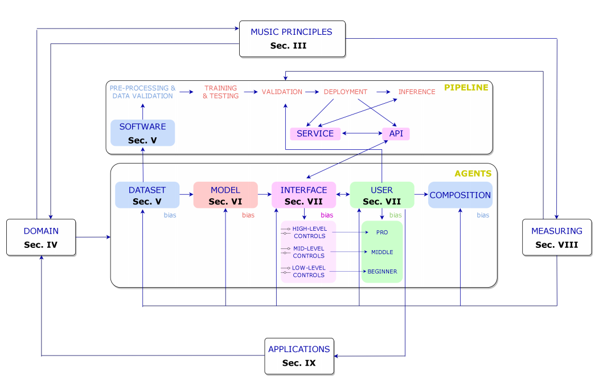
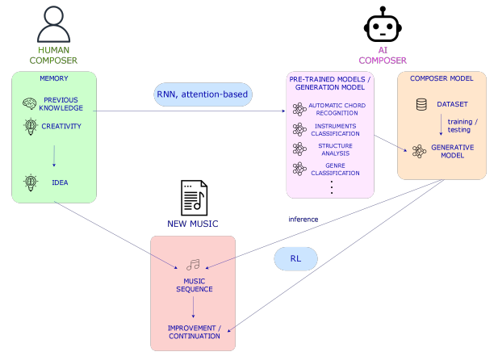
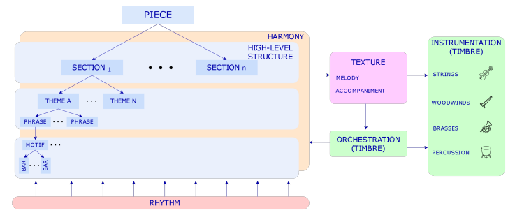
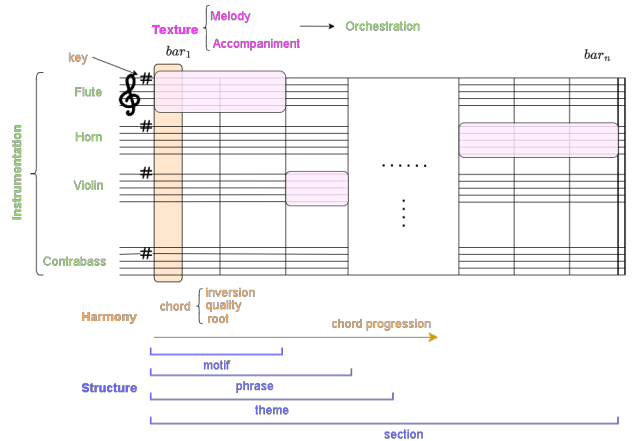

## 音乐生成的人工智能综述：代理（agents）、领域和前景

#### Carlos Hernandez-Olivan, Javier Hernandez-Olivan, and Jose R. Beltran

#### Department of Electronic Engineering and Communications, University of Zaragoza, Calle Mar´ıa de Luna 3 50018, Zaragoza

###### 1、引言

音乐生成是音乐信息检索的一个研究领域，旨在生成新的音乐。由于最近的深度学习（DL）模型能够生成更长的相干序列，因此该领域受到了广泛关注。在图像生成领域，新的深度生成模型（如Open  AI 的Dalle 2或 Stability 的 Stable  Diffusion）。AI的演变和发布吸引了更多的用户，不仅是模型本身，而且其生成的其他部分，如人机交互，成为基于AI的工具开发的关键部分。

有许多公司，如索尼、谷歌Magenta项目或Spotify，以及致力于新音乐制作和生成技术以及音乐推荐系统的初创公司。这种对音乐生成的兴趣的一个证明是组织研讨会、讲座和比赛，例如从2020年开始每年举行的人工智能歌曲大赛，2022年共有46支队伍参加。

要理解和比较音乐生成系统，就必须了解人类是如何感知、理解和创作音乐的。人类对音乐的理解和感知取决于多种因素。文化背景、音乐知识和作曲家的创造力是人类音乐创作的主要特征。创作的一种方式是发展作曲家的初步想法。这个想法不仅包含象征性的或与乐谱相关的音乐原则，还包含音色或动态等表演属性，尤其是如果作曲家是一位经验丰富的音乐家。最初想法的延续是由作曲家在创作音乐作品时所做的决定来指导的。基于分析和聆听作曲家职业生涯中获得的许多音乐片段，即经验，根据先前的知识做出的决定。这意味着，如果我们将这一过程与基于人工智能的音乐生成进行比较，那么这项任务涉及更多的MIR领域，如乐器分类或自动和弦识别（ACR）。研究和分析与音乐原理相关的其他特征可能是建立一个完整的人工智能音乐创作框架的必要条件，我们可以将其命名为通用音乐机器。这种通用模型可以基于多模式深度学习和过去通用的Agent（如 GATO）。在音乐领域，已经证明预先训练的模型可以帮助改进其他任务。这种技术节省了资源和训练时间，是通用符号音乐理解模型的第一步。尽管该领域正在朝着构建具有大量可学习参数的深度学习模型的方向发展，但音乐语言已经定义了可以与这些模型相结合的规则，以实现这种广义模型。就一首音乐的生成而言，对长期结构进行建模仍然是一个开放的研究领域，因为与文本不同，音乐依赖于相互依赖的两个轴（音高和时间）。实现这一点的一种方法是融合符号人工智能和深度学习模型，在符号人工智能中可以定义这些规则，深度学习模型可以像人类创作音乐时那样学习组合这些规则。这些符号规则的例子是一些音乐定义，例如属于某个和弦的音符，即C大三和弦中的C、e和G。

基于人工智能的音乐生成过程取决于上述因素之外的其他因素，必须考虑到基于人工智能创作工作中每个代理可能出现的偏见。我们将在本文中讨论人类和人工智能作曲过程之间的相似之处，然而，在对音乐的理解和感知方面，人类和机器之间存在很大差距。

在音乐领域，选择的作曲过程或技巧将取决于我们正在使用的音乐风格。如同人类需要一些先验知识才能创作旋律，人工智能也需要接受大量旋律的训练才能从中学习。然而，当涉及到创作复杂的作品时，除了像莫扎特这样天生具有音乐能力的天才音乐家之外，人类需要强大的音乐知识来发展一首音乐的和声、结构和乐器。因此，人类和人工智能在音乐创作过程中可能有一些相似之处。不同之处在于不同的学习过程以及人类的创造力或推断能力。加德纳的多元智能理论将音乐视为人的七种智能之一。他将音乐智力定义为产生和欣赏节奏、音高和音色的能力，或对音乐表现形式的理解。但是，创作音乐的能力来自哪里？这种能力在大脑中的位置是什么？自主机器架构如何学习和理解音乐，使其像人类一样具有创造性？我们将在本文中介绍这些概念，并将其与为音乐生成提出的人工智能模型进行比较。基于人工智能的音乐生成可以从不同的角度进行研究。Briot等人提出的分类基于五个维度：

- Input domain. Symbolic or audio. （输入域；符号或音频挑战）
- Model architecture. Sequence models, generative adversarial networks, etc. （模型架构。序列模型、生成对抗性网络等）
- Generation. Autoregression, etc. （自回归等）
- Purpose. Melody generation, harmonization, improvisation, etc. （旋律的生成、协调、即兴创作等）
- Output-s nature. Monophonic, polyphonic melodies with or without chords, multi-instrument music. （自然界的声音；单音、复调旋律，带或不带和弦，多乐器音乐）
- Challenge. Human-computer interaction.（人机交互）

在本文中，我们将首先概述人类和基于人工智能的构图过程之间的差异。然后，我们将介绍音乐创作工作中涉及的代理，例如迄今为止一直用于了解我们所处的位置、这一研究方向以及有待解决的挑战的最先进的数据集、模型和算法。请注意，这些代理可以外推到其他类型的人工智能艺术生成。在图1中，我们介绍了基于人工智能的音乐生成工作流程中最重要的部分。工作流程可以定义如下：我们选择一个领域（音频或符号音乐），我们希望专注于该领域，并对涉及该领域的音乐原理有一些了解。在选择了领域后，我们可以开始描述我们将在本文的每一节中讨论的代理，从我们训练模型到最终用户的数据开始，最终用户使用音乐生成器制作的最终产品。请注意，每个代理都应该进行评估，然而，在本文中，我们将只描述模型——评估依赖于它们生成的输出。在测量输出时，我们需要音乐原理。最后，与用户的互动或开发该技术的团队的经验可以带来音乐生成的新应用，这些应用可以在任何领域。在图1中，我们还展示了在行业应用程序中开发的管道。

【图1：基于人工智能的合成工作流中代理之间关系的一般模式。该图显示了这项工作的不同部分，其中介绍了每一个元素。】

###### A.论文结构

本文基于作为音乐生成系统一部分的代理组织如下：在第二节中，我们比较了基于人类和人工智能的音乐生成模型；在第三节中，介绍了音乐原理；在第四节中，引入并比较了音乐生成中的两大领域：音频和符号音乐；在第五节中，我们概述了该领域中用于音频和符号领域的数据集；在第六节中，介绍了用于构建音乐生成技术的模型和架构；在第七节中，讨论并介绍了该领域提出的人机交互工作；在第八节中，我们介绍了如何从主观和客观角度对这些模型进行评估；在第九节中，介绍了在该领域获得关注的进一步工作和研究；在第十节中，讨论了基于人工智能的音乐生成的过去、现在和未来；最后在第十一节中我们给出了总结。

###### 2、基于人工智能的音乐生成

了解人类大脑对于开发能够模仿认知过程的人工智能工具非常重要。NeuroAI旨在研究这些过程以提供和改进人工智能模型的领域。更好地了解人类大脑可能有助于构建创造性的人工智能工具，这些工具能够像人类一样进行推断并发挥创造性。关于基于人工智能的模型，一个大问题是它们的创造力，但创造力意味着什么？我们如何衡量它，它来自哪里？在本节中，我们介绍了创造力的概念，并概述了人类如何理解和创作音乐。

###### A.创造力的概念

Amabile将创造力定义为“产生有价值的、有用的或令人满意的新作品的过程”。创造力的概念可以从三个不同的角度来看待：产品、产生产品的身份和过程。Amabile对创造力的一致定义是：“……创造性可以被视为产品的质量或由合适的观察者判断为具有创意的，也可以被视是这样判断的东西产生的过程。这个定义是基于最终产品，而不是基于产生这种创造力的过程或身份。将这些定义代入到音乐领域中可知，如果新音乐被一群人接受，即被我们社会的一部分人接受，那么它可以被视为一个创造性的过程。根据这些定义，我们可以认为，如果社会接受基于人工智能的音乐，并发现它对一些事情有益，那么它可以被认为是创造性的。当谈到机器制造的艺术时，我们还可以将 Colton 和 Wiggings 定义的计算创造力的概念定义为“计算系统的科学、工程和哲学，通过承担特定的责任，表现出公正的观察者认为具有创造性的行为”。更具体地说，在MIR领域中，有一个音乐生成的子领域旨在研究和计算模拟机器创造力。这个领域被称为音乐元创作（MuMe）。

###### B.量化创造力

研究人员试图用三种不同的技术来量化创造力：进行客观或主观分析，以及使用创造力测试。在基于人工智能的音乐生成或创作领域，量化生成的作品质量的最常用技术是图灵测试或一项与创造力测试有点接近的调查。Amabile提到，由于创造力测试中可以评估的能力范围很窄，因此认为测试得到假定的创造力一般指标是不合适的。Ada Lovelace提出了一些衡量机器创造力的问题，Boden将这些问题总结为 Lovelace 问题，现在演变成了 Lovelace 创造力测试（LT）。LT比图灵测试更难通过，因为算法（被询问者）必须欺骗程序员（询问者）。在旨在产生新音乐的人工智能研究领域，通常通过主观测试来测量结果，这并不总是可靠的，因为结果取决于人群的文化和背景。我们将在第八节介绍一些已经提出了的客观评估措施，用来填补主观评估无法填补的空白，但在这一领域仍有很大的改进空间。

###### C.音乐是一种语言形式

尽管一些音乐学家由于其主观性而不将音乐视为一种语言，但另一些人则认为音乐的结构元素与其他语言之间存在联系。 Sloboda 声称“音乐语言可以像任何其他语言一样，在结构层面上被理解”。音乐通过诸如和声、节奏或音色的音乐元素唤起情感。如果我们认为音符或音符的属性是字符或单词，并将这种关系扩展到其他音乐元素，我们可以将音乐编码为文本，并将自然语言处理（NLP）技术应用于音乐。通过建立这两种结构之间的关系，我们可以将现有的语言生成模型应用于音乐生成。

大脑中负责语言理解和解释的区域是位于左半球的韦尼克区（或后言语区）。已经表明，大脑在下一个单词出现之前自发地参与预测，而不需要明确的指令。这正是深度语言自回归模型（DLMs）所做的，从而表明 DLMs 和人类对下一个单词的预测在自然环境中是相似的。另一方面，根据 Platel 等人的研究，不同的音乐相关功能也归因于大脑的这一部分。例如节奏、时间和顺序结构的识别，并且与音乐刺激的语义表示（旋律识别和鉴定）有关。然而，右颞皮层参与音色和音高的处理、识别和辨别。 Lu 等人使用功能性磁共振成像（fMRI）来探索17位专业作曲家在音乐创作过程中的功能网络。这证明了在作曲过程中，前循环皮层、右角回和双侧额上回之间存在功能连接，这意味着尽管主要视觉和运动区域在作曲时没有发挥重要作用，这些区域的神经元增加了前扣带皮层和默认模式网络之间的功能连接，以计划音符和情绪的输入。

因此，将音乐视为一种语言形式，放弃音色等解释属性，我们可以认为，大脑中负责理解和知道如何解释文本和音乐结构的部分是相同的。然而，人工智能模型所基于的数学和概率论与人脑工作和处理信息的方式不同。

###### D.人类音乐创作和基于人工智能音乐创作的过程

人类音乐创作过程涉及认知过程，例如对动作的关注、反应的产生、动作规划和监测以及对重复反应的抑制24。 LeCun 描述了一种用于自主智能或单词模型的系统架构。20世纪80年代，Jordan等人、Widrow等人等在工作中引入了使用神经网络对这种复杂系统进行建模。这个世界（world）模型有以下模块：获取输入的配置模块，估计世界当前状态的感知模块，预测未来可能的世界状态的世界模型模块，计算输出或能量的成本模块，记忆当前和预测的世界状态的短期记忆模块，以及计算动作序列的建议的actor模块。尽管这是一个理论“世界”模型，但它可以构建一个通用的音乐机器，能够理解不同的音乐表现（音频或乐谱），分析它们，创造新的音乐，并与创造的音乐互动。

> 一开始我也以为World写错了，然后查了一下，发现18年Geogle Brain确实提出过一篇《World Models》的论文，在机器学习届爆火。

在图2中，我们展示了一个基于人类和人工智能的音乐创作过程的方案，其中人类和机器都通过记忆执行动作来与世界或音乐片段互动，比如具有更多记忆的大型递归神经网络（RNNs）或 Transformers，或者在基于人工智能的模型中可以被预训练的模型取代的先验知识用来训练机器或作曲家模型（或者可以学习分析音乐然后创作音乐的多任务模型）。这种在其他 MIR 任务中具有特定任务的预训练模型的想法将允许调节各种方式或级别的生成。然而，对于符号音乐，拥有一个可以微调以执行不同 MIR 任务的通用预训练模型已被证明是开发特定任务模型的替代方案。尽管自动音乐转录（AMT）的最新进展也可以用作生成模型，即 MT3 或 DiffRoll ，分别是基于Transformer的模型和基于扩散（diffusion）的模型，但是仍然可能存在用于建模广义模型的其他替代方案。在任何一种情况下，输出音乐都可以从头开始创建、绘制或从给定的序列继续。

【图2：人工智能和人类创作过程的比较。在右边，人类作曲家利用他或她之前所拥有的知识创作音乐，也利用产生音乐思想的创造力，这些音乐思想可以是节奏、音符等，也可以是它们在主题或旋律中的组合。在左边，人工智能作曲家用在不同MIR任务上训练的模型（“先前的知识”）与在条件下创作音乐的模型相结合来创作音乐。未来，代表人工智能作曲家先前知识的预先训练的模型可能会被理解音乐的通才模型所取代，并且记忆可以与大型RNN相媲美。下面，我们看到了由人类或人工智能作曲家创作或完成的音乐片段（或“世界”，如果我们考虑所有现有的音乐），在后者的情况下，使用强化学习技术、序列模型等。】

###### E.基于人工智能的音乐生成中的Agents

> Agents不能直接翻作代理，和上面的Transformer一样，这属于机器学习领域的一种结构，近似看成用户设计的智能体（大概）。
>
> 第一段中有不少地方翻错了还请见谅，我也是一边看一边学呜呜呜

现在，深入到音乐生成的人工智能部分，我们在音乐创作框架中发现了5个 agents 或实体：训练数据集、模型、界面和用户，以及需要测量的最终作品，这些将分别在第五、第六、第七、第八节中呈现。在图1中，我们可以看到基于人工智能的音乐生成或创作过程中的 agents 或实体的一般方案。音乐制作工作中可能存在的每个 agent 都容易受到偏见（bias）的影响。尽管数据集和模型可能由于输入音乐的性质或模型架构而具有客观 biases ，但界面和用户由于音乐的主观性而具有主观 biases。在这篇论文中，我们不会做任何偏倚（bias）分析。

我们还可以定义与这些 agents 相关的两个主要过程：训练或开发和量化。当训练发生在数据库、模型和/或用户界面之间时，测量或评估阶段发生在所有 agents 中，并且在更大程度上发生在用户和界面之间。如果所提出的音乐生成模型没有针对最终用户或界面，我们可以仅在数据库和模型中对训练和测量阶段进行分组。

###### 3、音乐原理

到目前为止，我们已经涵盖了基于人类和人工智能的音乐创作，但它是什么？以前的音乐创作知识来自哪里？在本节中，我们将介绍作为音乐支柱的音乐原则。这些原则包含了人们在创作音乐之前需要理解的基本要素的定义。

音乐可以被视为一种层次结构的语言。层次结构与音乐原则有关，音乐原则是音乐的支柱。音乐原则是：和谐、节奏、形式或结构、旋律、音色和动力。这些原理可以在符号域和音频域中进行分析。而和声、节奏、结构和旋律更多地涉及符号领域，音色、效果或动态都是诠释的一部分，即音频领域。同样值得一提的是，如果我们考虑到旋律是如何被解读的，那么它既可以从符号域的角度考虑，也可以从音频域的角度来考虑。纹理是我们如何结合这些原则的结果。除了音乐原则之外，作曲家还使用一些作曲技巧来结合这些原则。这些过程的例子我们将在本节稍后进行讨论或编排。音乐原理或参数的定义如下：

- 和声（harmony）。音程中音符的叠加形成了和弦。高层次的和弦是音乐音调的关键。组成一个小节的和弦通常属于同一音调。
- 音乐形式或结构。它是时间维度上的最高级别。然后，小节串联组织成音乐短语，这些音乐短语发展成为作为带有主题的小音乐单元。
- 旋律。旋律可以是单音或复音，这取决于在同一时间段演奏的音符；也可以是同音或异音，这依赖于旋律伴奏。
- 音质。当音乐指令或声音以相同的强度以及相同的频率播放时，它们听起来有不同的质感。

Christensen 还增加了节拍、对位法（the counterpoint）和流派或风格，并将音色排除在音乐原则之外。然而，我们将对位法归类为一种作曲技术，并添加音色，因为它是作曲的重要组成部分，特别是在表演中，这在未来的音频生成作品中非常重要。乐器和编曲是组织和编排音乐内容的音乐工具。作曲是对音乐作品中存在的乐器的选择，编曲是根据作曲家想要达到的动态和颜色为每种乐器分配旋律部分或伴奏的技术。在符号音乐软件中，组合乐器就是像乐谱中的一样将包含每个乐器的信息和音符进行轨迹组合。

> 这一段有大量的 instrumentation 、 orchestration 、instruments，我按照个人感觉修改了下内容，如有异议请以原文为主。
>
> 上面的词都有乐器、配器等意思，详细解释可以参考[Making Music 第三章——Instrumentation（配器）或Orchestration（管弦乐配器）](https://zhuanlan.zhihu.com/p/32289315)

那么，从人工智能的角度来看，我们应该把人工智能音乐创作领域称为音乐生成还是作曲？这取决于每项工作的目标。如果我们想建立生成音乐的模型，而不关心音乐是如何在音乐原理和音乐理论方面生成的，我们可以称之为音乐生成问题。但是，如果我们关心这些原则，并打算构建允许用户在相关的各个级别与模型交互的界面对音乐原理拥有更多的控制权，如果用户能用这些模型学习音乐，我们可以把这个领域称为音乐创作。

###### A.人类音乐创作

正如我们在第二节中提到的，当作曲家创作一首音乐时，会做出很多决定。这种情况发生在所有音乐流派或风格中，甚至在爵士乐等流派的即兴音乐作品中，这些作品都是在演奏时做出决定的。在西方古典音乐中，创作一个被称为 *motif* （主题）的短音乐序列是很常见的。motif 包含了那些将发展音乐部分的音乐思想。这些想法包含节奏和和声信息，可以以不同的方式排列，创造出带有相应伴奏的旋律。另一种作曲方式可以是创作一首旋律，然后进行协调，也可以是构建一个和声进程，从而构建一首旋律。这些人类创作音乐的方式取决于作曲家和音乐流派。

在旋律、和弦进行或主题（motif）被创造出来后，作曲家完成了一个包含类似音乐思想的音乐短语。音乐短语与 *bridges* （桥梁）连接，bridges 是从一个短语到下一个短语的过渡。一组音乐短语组成一个小节，通常以 *cadence* （抑扬顿挫/起落）或过渡到下一小节结束。有很多种方法可以构建音乐，就像西方古典音乐中的奏鸣曲形式一样，然而，每个作曲家都会根据自己的需要调整结构。在接下来的部分中，我们将看到人工智能系统是如何模拟这些过程的。然而，人工智能本身可以改变人类创作音乐的方式，例如，通过在潜在空间中进行声音探索。

就音乐的表现而言，它有两个维度，时间和和弦/和声。两个维度相互依赖。时间维度和符号域中的音乐信息通过包含音符的度量进行分组。这允许将音乐信息与称为拍号的时间单位进行分组。在构成音乐语言的所有元素中，音符处于最低水平。小节、音乐短语或旋律可以在下一个更高的层次上表现，作品的结构可以在最高层次上表现。

在图3中，我们展示了以音乐原理为构建块的一般音乐作品的形式结构，图4表示乐谱表示中的音乐原理的模式。

【图3：音乐原理及其关系。音乐作品的结构从小节到主题都有不同的层次（这取决于音乐流派）。和声和节奏是音乐中与音乐形式相辅相成的两轴，伴奏可以用对位法技术派生或构建，并用乐器和/或配器来安排。】

【图4：音乐原理的乐谱图式。我们展示了音乐原理是如何在类似乐谱的表现中相互关联的。请注意，乐谱通常没有所有的和声或结构注释，如和弦或旋律识别，但它确实有乐器、键或每种乐器的动态，以告诉音乐家或指挥家应该如何演奏这首曲子。】

###### 4、符号域和音频域