# 大数据

> 前言：
>
> 

## 第一章 总述

IT时代是以自我控制、自我管理为主，那么到了DT(Data Technology) 时代，则是以服务大众、激发生产力为主。以互联网（或者物联网）、云计算、大数据和人工智能为代表的新技术革命正在渗透至各行各业，悄悄地改变着我们的生活。

#### 1、阿里巴巴大数据系统体系架构图

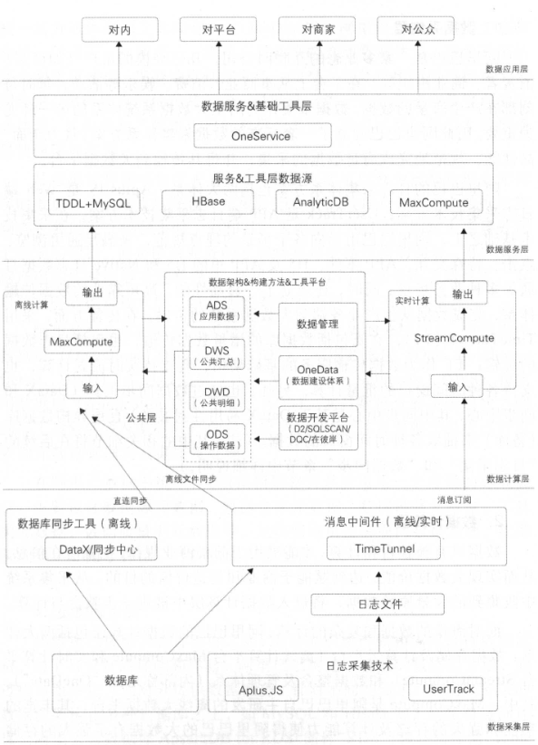

#### 2、应用四大层次

###### （1）数据采集层

Aplus.JS是Web端日志采集技术方案；UserTrack是APP端日志采集技术方案。在传输方面，采用TimeTunnel (TT），它既包括数据库的增量数据传输，也包括日志数据的传输；TT作为数据传输服务的基础架构，既支持实时流式计算，也支持各种时间窗口的批量计算。另外，也通过数据同步工具直连异构数据库（备库）来抽取各种时间窗口的数据。

###### （2）数据计算层

数据只有被整合和计算，才能被用于洞察商业规律，挖掘潜在信息，从而实现大数据价值，达到赋能于商业和创造价值的目的。从采集系统中收集到的大量原始数据，将进入数据计算层中被进一步整合与计算。

数据存储及计算云平台（离线计算平台MaxCompute和实时计算平台StreamCompute）和数据整合及管理体系（内部称之为“OneData”）。

阿里数据仓库的数据加工链路也是遵循业界的分层理念，包括操作数据层（OperationalData Store, ODS）、明细数据层（DataWa rehouse Detail, DWD）、汇总数据层（DataWarehouse Summary, DWS）和应用数据层（ApplicationData Store, ADS）。通过数据仓库不同层次之间的加工过程实现从数据资产向信息资产的转化，并且对整个过程进行有效的元数据管理及数据质量处理。

###### （3）数据服务层

当数据已被整合和计算好之后，需要提供给产品和应用进行数据消费。针对不同的需求，数据服务层的数据源架构在多种数据库之上，如MySQL和HBase等。

数据服务可以使应用对底层数据存储透明，将海量数据方便高效地放给集团内部各应用使用。数据服务层对外提供数据服务主要是通过统一的数据服务平台。OneService以数据仓库整合计算好的数据作为数据源，对外通过接口的方式提供数据服务，主要提供简单数据查询服务、复杂数据查询服务（承接集团用户识别、用户画像等复杂数据查询服务）和实时数据推送服务三大特色数据服务。

###### （4）数据应用层

数据已经准备好，需要通过合适的应用提供给用户，让数据最大化地发挥价值。数据作为新能源，为产业注人的变革是显而易见的。我们对数据新能源的探索也不仅仅停留在狭义的技术、服务和应用上。我们正在挖掘大数据更深层次的价值，为社会经济和民生基础建设等提供创新方法。

------

## 第二章 日志采集

#### 1、浏览器的页面日志采集

###### （1）页面浏览（展现）日志采集

最基础的互联网日志，也是目前所有互联网产品的两大基本指标：页面浏览量（PageView, PV）和访客数（UniqueVisitors, UV）的统计基础。页面浏览日志是目前成熟度和完备度最高，同时也是最具挑战性的日志来集任务。

- 流程
  - 在HTML文档内的适当位置增加一个日志采集节点，当浏览器解析到这个节点时，将自动触发一个特定的HTTP请求到日志采集服务器。如此一来，当日志采集服务器接收到这个请求时，就可以确定浏览器已经成功地接收和打开了页面。
  - 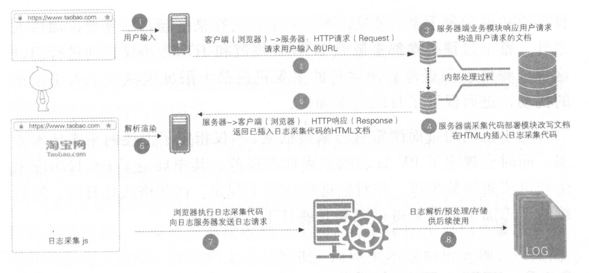
- 主要过程
  - 客户端日志采集：日志采集工作一般由一小段被植人页面HTML文档内的JavaScript脚本来执行。采集脚本被浏览器加载解析后执行，在执行时采集当前页面参数、浏览行为的上下文信息（如读取用户访问当前页面时的上一步页面）以及一些运行环境信息（如当前的浏览器和分辨率等）。
  - 客户端日志发送：采集脚本执行时，会向日志服务器发起一个日志请求，以将采集到的数据发送到日志服务器。
  - 服务器端日志采集。
  - 服务器端日志解析存档：服务器接收到的浏览日志进人缓冲区后，会被一段专门的日志处理程序顺序读出并按照约定的日志处理逻辑解析。

###### （2）页面交互日志采集

当页面加载和渲染完成之后，用户可以在页面上执行各类操作。互动设计都要求采集用户的互动行为数据，以便通过量化获知用户的兴趣点或者体验优化点。交互日志采集就是为此类业务场景而生的。

- “黄金令箭”采集方案：基于HTTP协议的日志服务
  - 业务方在“黄金令箭”的元数据管理界面依次注册需要采集交互日志的业务、具体的业务场景以及场景下的具体交互采集点，在注册完成之后，系统将生成与之对应的交互日志来集代码模板。
  - 业务方将交互日志采集代码植入目标页面，并将采集代码与需要监测的交互行为做绑定。
  - 当用户在页面上产生指定行为时，采集代码和正常的业务互动响应代码一起被触发和执行。
  - 采集代码在采集动作完成后将对应的日志通过HTTP协议发送到日志服务器，日志服务器接收到日志后原则上不做解析处理，只做简单的转储。

###### （3）服务器端清洗和预处理

- 识别流量攻击、网络爬虫和流量作弊（虚假流量）
  - 需要对所采集的日志进行合法性校验，依托算法识别非正常的流量并归纳出对应的过滤规则集加以滤除。这是一个长期而艰苦的对抗过程。
- 数据缺项补正
  - 大多数情况下，需要对日志中的一些公用且重要的数据项做取值归一、标准化处理或反向补正。反向补正，即根据新日志对稍早收集的日志中的个别数据项做回补或修订。
- 无效数据剔除
  - 定时检查配置并依照配置将因业务变更或配置不当，在采集到的日志中会存在一些无意义、已经失效或者冗余的数据项剔除。
- 日志隔离分发
  - 基于数据安全或者业务特性的考虑，某些日志在进入公共数据环境之前需要做隔离。

#### 2、无线客户端的日志采集

无线客户端的日志采集采用采集SDK来完成，在阿里巴巴内部，多使用名为UserTrack的SDK来进行无线客户端的日志采集。

基于常规的分析，UserTrack (UT）把事件分成了几类，常用的包括页面事件（同前述的页面浏览）和控件点击事件（同前述的页面交互）等。

在阿里系内，使用SPM(Super Position Model ，超级位置模型）进行来源去向的追踪，在无线客户端也同样使用SPM，SPM信息就可以通过透传机制带人到下一步甚至下下一步的浏览页面，这样整个用户行为路径还原就轻松实现了。

###### 特殊场景

为了平衡日志大小，减小流量消耗、采集服务器压力、网络传输压力等，采集SDK提供了聚合功能，对某些场景如曝光或一些性能技术类日志，我们提倡在客户端对这类日志进行适当聚合，以减少对日志采集服务器端的请求，适当减小日志大小。总体思路就是每个曝光的元素一般都属于一个页面，利用页面的生命周期来实现适当的聚合及确定发送时机。

###### 日志传输

无线客户端日志的上传，不是产生一条日志上传一条，而是无线客户端产生日志后，先存储在客户端本地，然后再伺机上传。

客户端数据上传时是向服务器发送POST请求，服务器端处理上传请求，对请求进行相关校验，将数据追加到本地文件中进行存储，存储方式使用Nginx的access_log，access_log的切分维度为天，即当天接收的日志存储到当天的日志文件中。考虑到后续的数据处理，以及特殊时期不同日志的保障级别，还对日志进行了分流。

#### 3、日志处理

###### （1）日志分流和定制处理

大型互联网网站的日志类型和日志规模都呈现出高速增长的态势，而且往往会出现短时间的流量热点爆发。这一特点，使得在日志服务器端采用集中统一的解析处理方案变得不可能，其要求在日志解析和处理过程中必须考虑业务分流（、日志优先级控制，以及根据业务特点实现定制处理。

###### （2）采集与计算一体化设计

日志采集方案必须将来集与计算作为一个系统来考量，进行一体化设计。在当前的互联网环境下，互联网日志的规模化采集方案必须具备一个与终端设备的技术特点无关，具有高度扩展弹性和适应性，同时深入契合应用需求的业务逻辑模型，并基于此制定对应的采集规范交由产品开发人员执行。

###### （3）数据处理全链路

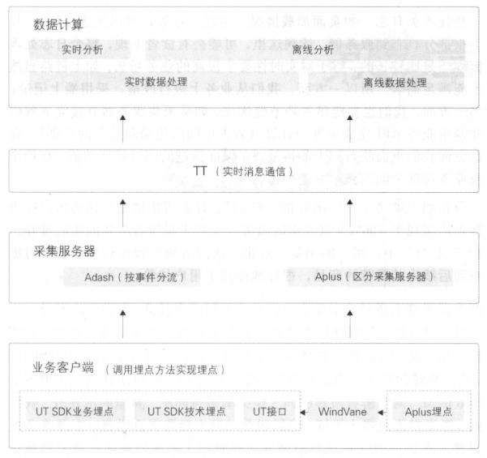

------

## 第三章 数据同步

数据同步需要针对不同的数据类型及业务场景选择不同的同步方式。总的来说，同步方式可以分为三种：直连同步、数据文件同步和数据库日志解析同步。

#### 1、直连同步

直连同步是指通过定义好的规范接口API和基于动态链接库的方式直接连接业务库，如ODBC/JDBC等规定了统一规范的标准接口（驱动）

- 配置简单，实现容易
- 适合操作型业务系统的数据同步
- 业务库直连的方式对源系统的性能影响较大，当执行大批量数据同步时会降低甚至拖垮业务系统的性能（主备策略-学校二课服务器就是这种同步方式）

#### 2、数据文件同步

数据文件同步通过约定好的文件编码、大小、格式等，直接从源系统生成数据的文本文件，由专门的文件服务器，如FTP服务器传输到目标系统后，加载到目标数据库系统中。

- 主要存储日志类（文本文件）数据
- 异构数据源（多台数据库）采用这种策略
- 上传下载容易造成丢包或错误，需要额外发送校验文件

#### 3、数据库日志解析同步

数据文件被传输到目标系统后，可通过数据加载模块完成数据的导人，从而实现数据从源系统到目标系统的同步。（通过TCP/IP协议）

- 实时与准实时同步的能力（延迟低）
- 对业务系统的性能影响也比较小

###### 删除数据变更的三种同步方式

- 不过滤删除流水。不管是否是删除操作，都获取同一主键最后变更的那条流水。
- 过滤最后一条删除流水。如果同一主键最后变更的那条流水是删除操作，就获取倒数第二条流水。
- 过滤删除流水和之前的流水。如果在同一主键变更的过程中有删除操作，则根据操作时间将该删除操作对应的流水和之前的流水都过滤掉。

###### 存在的问题

- 数据延迟。
- 投人较大。
- 数据漂移和遗漏。（数据漂移，一般是对增量表而言的，通常是指该表的同一个业务日期数据中包含前一天或后一天凌晨附近的数据或者丢失当天的变更数据。）

#### 4、阿里数仓的同步策略

###### （1）批量数据同步

先将数据转换为中间状态，统一数据格式。由于这类数据都是结构化的，且均支持标准的SQL语言查询，所以所有的数据类型都可以转换为字符串类型。因此，我们可以通过将各类源数据库系统的数据类型统一转换为字符串类型的方式，实现数据格式的统一。

阿里巴巴的DataX就是这样一个能满足多方向高自由度的异构数据交换服务产品。对于不同的数据源，DataX通过插件的形式提供支持，将数据从数据源读出并转换为中间状态，同时维护好数据的传输、缓存等工作。

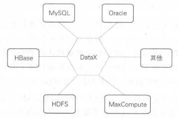

DataX采用Framework+Plugin的开放式框架实现，Framework处理缓冲、流程控制、并发、上下文加载等高速数据交换的大部分技术问题，并提供简单的接口与插件接入。

###### （2）实时数据同步

通过解析MySQL的binlog日志（相当于Oracle的归档日志）来实时获得增量的数据更新，并通过消息订阅模式来实现数据的实时同步的。具体来说，就是建立一个日志数据交换中心，通过专门的模块从每台服务器源源不断地读取日志数据，或者解析业务数据库系统的binlog或归档日志，将增量数据以数据流的方式不断同步到日志交换中心，然后通知所有订阅了这些数据的数据仓库系统来获取。

TimeTunnel（TT）是一种基于生产者、消费者和Topic消息标识的消息中间件，将消息数据持久化到HBase的高可用、分布式数据交互系统。

#### 5、数据同步遇到的问题和解决办法

###### （1）分库分表的处理

阿里巴巴的TDDL( Taobao Distributed  Data Layer）是一个具备将分布在不同数据库中的不同表集成为一个表的能力，能让下游应用像访问单库单表一样方便的分布式数据库的访问引擎，通过建立中间状态的逻辑表来整合统一分库分表的访问。

###### （2）高效同步和批量同步

阿里巴巴OneClick产品：

- 对不同数据源的数据同步配置透明化，可以通过库名和表名唯一定位，通过IDB接口获取元数据信息自动生成配置信息。
- 简化了数据同步的操作步骤，实现了与数据同步相关的建表、配置任务、发布、测试操作一键化处理，并且封装成Web接口进一步达到批量化的效果。
- 降低了数据同步的技能门槛，让数据需求方更加方便地获取和使用数据。

真正实现了数据的一键化和批量化同步，一键完成DDL和DML的生成、数据的冒烟测试以及在生产环境中测试等。

###### （3）增量和全量同步的合并

在传统的数据整合方案中，合并技术大多采用merge方式( update+insert）：当前流行的大数据平台基本都不支持update操作，现在我们比较推荐的方式是**全外连接（full outer join)＋数据全量覆盖重新加载（insert overwrite），即如日调度**，则将当天的增量数据和前一天的全量数据做全外连接，重新加载最新的全量数据。在大数据量规模下，全量更新的性能比update要高得多。此外，如果担心数据更新错误问题，可以采用分区方式，每天保持一个最新的全量版本，保留较短的时间周期（如3～7天）。

另外，当业务系统的表有物理删除数据的操作，而数据仓库需要保留所有历史数据时，也可以选择这种方式，在数据仓库中永久保留最新的全量数据快照。

###### （4）基于负载均衡思想的新型数据同步方案

核心思想是通过目标数据库的元数据估算同步任务的总线程数，以及通过系统预先定义的期望同步速度估算首轮同步的线程数，同时通过数据同步任务的业务优先级决定同步线程的优先级，最终提升同步任务的执行效率和稳定性。

- 用户创建数据同步任务，并提交该同步任务。
- 根据系统提前获知及设定的数据，估算该同步任务需要同步的数据量、平均同步速度、首轮运行期望的线程数、需要同步的总线程数。
- 根据需要同步的总线程数将待同步的数据拆分成相等数量的数据块，一个线程处理一个数据块，并将该任务对应的所有线程提交至同步控制器。
- 同步控制器判断需要同步的总线程数是否大于首轮运行期望的线程数，若大于，则跳转至2；若不大于，则跳转至5。
- 同步控制器采用多机多线程的数据同步模式，准备该任务第一轮线程的调度，优先发送等待时间最长、优先级最高且同一任务的线程。
- 同步控制器准备一定数据量（期望首轮线程数－总线程数）的虚拟线程，采用单机多线程的数据同步模式，准备该任务相应实体线程和虚拟线程的调度，优先发送等待时间最长、优先级最高且单机CPU剩余资源可以支持首轮所有线程数且同一任务的线程，如果没有满足条件的机器，则选择CPU剩余资源最多的机器进行首轮发送。
- 数据任务开始同步，并等待完成。
- 数据任务同步结束。

###### （5）数据漂移的处理

数据漂移是ODS数据（从源系统同步进入数据仓库的第一层数据称为ODS或者staging层数据，阿里巴巴统称为ODS）的一个顽疾，通常是指ODS表的同一个业务日期数据中包含前一天或后一天凌晨附近的数据或者丢失当天的变更数据。

无论根据哪一个单一时间戳获取数据，都有可能导致数据漂移，处理方法如下：

- 多获取后一天的数据，保障数据只多不少（但是会存在一定的数据误差）
- 通过多个时间戳字段限制时间来获取相对准确的数据（限制时间范围，做全外连接回补数据）

------

## 第四章 离线数据开发

#### 1、数据开发平台

阿里数据研发岗位的工作大致可以概括为：了解需求→模型设计→ETL开发→测试→发布上线→日常运维→任务下线。相较于传统数仓开发（ETL），有以下特点：

- 业务变更频繁
- 需要快速交付
- 频繁发布上线
- 运维任务多
- 系统环境复杂

###### （1）统一计算平台

大数据计算服务MaxCompute是由阿里云自主研发的海量数据处理平台，主要服务于海量数据的存储和计算，提供完善的数据导入方案，以及多种经典的分布式计算模型，提供海量数据仓库的解决方案，能够更快速地解决用户的海量数据计算问题，有效降低企业成本，并保障数据安全。

MaxCompute采用抽象的作业处理框架，将不同场景的各种计算任务统一在同一个平台之上，共享安全、存储、数据管理和资源调度，为来自不同用户需求的各种数据处理任务提供统一的编程接口和界面。它提供数据上传／下载通道、SQL、MapReduce、机器学习算法、图编程模型和流式计算模型多种计算分析服务，并且提供完善的安全解决方案。

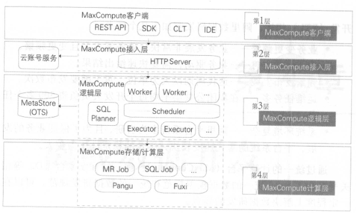

MaxCompute特点：

- 计算性能高且更加普惠
- 集群规模大且稳定性高
- 功能组件非常强大
  - MaxCompute SQL：标准SQL的语法，提供各类操作和函数来处理数据。
  - MaxCompute MapReduce：提供JavaMapReduce编程模型，通过接口编写MR程序处理MaxCompute中的数据。还提供基于MapReduce的扩展模型MR2，在该模型下，一个Map函数后可以接人连续多个Reduce函数，执行效率比普通的MapReduce模型高。
  - MaxCompute Graph ：面向迭代的图计算处理框架，典型应用有PageRank、单源最短距离算法、K-均值聚类算法。
  - Spark：使用Spark接口编程处理存储在MaxCompute中的数据。
  - RMaxCompute：使用R处理MaxCompute中的数据。
  - Volume: MaxCompute以Volume的形式支持文件，管理非二维表数据。

- 安全性高

###### （2）统一开发平台

数据研发人员完成需求了解和模型设计之后，进入开发环节，开发工作流如下：

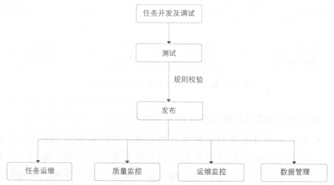

- 在云端（D2）
  - D2是集成任务开发、调试及发布，生产任务调度及大数据运维，数据权限申请及管理等功能的一站式数据开发平台，并能承担数据分析工作台的功能。

- SQLSCAN
  - SQLSCAN将在任务开发中遇到的各种问题，如用户编写的SQL质量差、性能低、不遵守规范等，总结后形成规则，并通过系统及研发流程保障，事前解决故障隐患，避免事后处理。
  - 三类规则校验
    - 代码规范类规则，如表命名规范、生命周期设置、表注释等。
    - 代码质量类规则，如调度参数使用检查、分母为0提醒、NULL值参与计算影响结果提醒、插入字段顺序错误等。
    - 代码性能类规则，如分区裁剪失效、扫描大表提醒、重复计算检测等。

- DQC
  - DQC (Data Quality Center，数据质量中心）主要关注数据质量，通过配置数据质量校验规则，自动在数据处理任务过程中进行数据质量方面的监控。
  - DQC主要有数据监控和数据清洗两大功能。
    - 数据清洗采用非侵入式的清洗策略，在数据同步过程中不进行数据清洗，避免影响数据同步的效率，其过程在数据进入ODS层之后执行。对于需要清洗的表，首先在DQC配置清洗规则；对于离线任务，每隔固定的时间间隔，数据入仓之后，启动清洗任务，调用DQC配置的清洗规则，将符合清洗规则的数据清洗掉，并保存至DIRTY表归档。如果清洗掉的数据量大于预设的阐值，则阻断任务的执行；否则不会阻断。
    - 

- 在彼岸
  - 数据测试的典型测试方法是功能测试，主要验证目标数据是否符合预期。
    - 新增业务需求
    - 数据迁移、重构和修改
  - 在彼岸主要包含如下组件，除满足数据测试的数据对比组件之外，还有数据分布和数据脱敏组件。
    - 数据对比：支持不同集群、异构数据库的表做数据对比。表级对比规则主要包括数据量和全文对比；字段级对比规则主要包括字段的统计值（如SUM、AVG、MAX、MIN等）、枚举值、空值、去重数、长度值等。
    - 数据分布：提取表和字段的一些特征值，并将这些特征值与预期值进行比对。表级数据特征提取主要包括数据量、主键等；字段级数据特征提取主要包括字段枚举值分布、空值分布、统计值（如SUM、AVG、MAX、MIN等）、去重数、长度值等。
    - 数据脱敏：将敏感数据模糊化。在数据安全的大前提下，实现线上数据脱敏，在保证数据安全的同时又保持数据形态的分布，以便业务联调、数据调研和数据交换。
    - 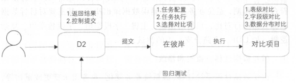

#### 2、任务调度系统

度系统中的各类任务互相依赖，形成一个典型的有向无环图。在传统的数据仓库系统中，很多是依靠Crontab定时任务功能进行任务调度处理的。这种方式有很多弊端：①各任务之间的依赖基于执行时间实现，容易造成前面的任务未结束或失败而后面的任务已经运行；②任务难以并发执行，增加了整体的处理时间：③无法设置任务优先级；④任务的管理维护很不方便，无法进行执行效果分析等。

###### 核心设计模型

整个调度系统共有两个核心模块：调度引擎（PhoenixEngine）和执行引擎（Alisa）。简单来说，调度引擎的作用是根据任务节点属性以及依赖关系进行实例化，生成各类参数的实值，并生成调度树z执行引擎的作用是根据调度引擎生成的具体任务实例和配置信息，分配CPU、内存、运行节点等资源，在任务对应的执行环境中运行节点代码。

###### 调度引擎工作原理

调度引擎（Phoenix Engine）基于以上两个状态机模型原理，以事件驱动的方式运行，为数据任务节点生成实例，并在调度树中生成具体执行的工作流。任务节点实例在工作流状态机、任务状态机和事件处理器之间转换，其中调度引擎只涉及任务状态机的未运行和等待运行两种状态，其他5种状态存在于执行引擎中。

###### 执行引擎

Alisa的用户系统包括上文的工作流服务、数据同步服务，以及调度引擎生成的各类数据处理任务的调度服务。同时其任务可以共享同一个物理集群资源，提高了资源的利用效率。

------

## 第五章 实时技术

数据价值是具有时效性的，在一条数据产生的时候，如果不能及时处理并在业务系统中使用，就不能让数据保持最高的“新鲜度”和价值最大化。

相对于离线批处理技术，流式实时处理技术作为一个非常重要的技术补充，在阿里巴巴集团内被广泛使用。在大数据业界中，流计算技术的研究是近年来非常热门的课题。流式数据处理一般具有以下特征：

- 时效性高：数据实时采集、实时处理，延时粒度在秒级甚至毫秒级，业务方能够在第一时间拿到经过加工处理后的数据。
- 常驻任务：区别于离线任务的周期调度，流式任务属于常驻进程任务，一旦启动后就会一直运行，直到人为地终止，因此计算成本会相对比较高。
- 性能要求高：实时计算对数据处理的性能要求非常严格，如果处理吞吐量跟不上采集吞吐量，计算出来的数据就失去了实时的特性。
- 应用局限性：实时数据处理不能替代离线处理，除了计算成本较大这个因素外，对于业务逻辑复杂的场景（比如双流关联或者需要数据回滚的情况），其局限性导致支持不足。

#### 1、流式技术架构

###### （1）数据采集

既然需要做到实时计算，那么自然就需要做到实时采集了。所采集的数据都来自于业务服务器，从所采集的数据种类来看，主要可以划分为两种：

- 数据库变更日志，比如MySQL的binlog日志、HBase的hlog日志、OceanBase的变更日志、Oracle的变更日志等。
- 引擎访问日志，比如用户访问网站产生的Apache引擎日志、搜索引擎的接口查询日志等。

一般情况下，基于以下原则按批次对数据进行采集：

- 数据大小限制：当达到限制条件时，把目前采集到的新数据作为一批（例如512KB写一批）。
- 时间阐值限制：当时间达到一定条件时，也会把目前采集到的新数据作为一批，避免在数据量少的情况下一直不采集（例如30秒写一批）。

###### （2）数据处理

实时计算任务部署在流式计算系统上，通过数据中间件获取到实时源数据后进行实时加工处理。

实时数据处理应用出于性能考虑，计算任务往往是多线程的。一般会根据业务主键进行分桶处理，并且大部分计算过程需要的数据都会放在内存中，这样会大大提高应用的吞吐量。为了避免内存溢出，内存中过期的数据需要定时清理，可以按照LRU（最近最少使用）算法或者业务时间集合归类清理（比如业务时间属于T-1的，会在今天凌晨进行清理）。

典型问题：

- 去重指标
  - 精确去重。在这种情况下，明细数据是必须要保存下来的，当遇到内存问题时，可以通过数据倾斜来进行处理，把一个节点的内存压力分到多个节点上。
  - 模糊去重。在去重的明细数据量非常大，而业务的精度要求不高的情况下，可以使用相关的去重算法，把内存的使用量降到千分之一甚至万分之一，以提高内存的利用率。
  - 布隆过滤器
    - 该算法是位数组算法的应用，不保存真实的明细数据，只保存明细数据对应哈希值的标记位。
    - 适用场景：统计精度要求不高，统计维度值非常多的情况。
  - 基数估计
    - 利用哈希的原理，按照数据的分散程度来估算现有数集的边界，从而得出大概的去重值总和。
    - 适用场景：统计精度要求不高，统计维度非常粗的情况。
- 数据倾斜
  - 在数据量非常大的时候，单个节点的处理能力是有限的，必然会遇到性能瓶颈。这时就需要对数据进行分桶处理，分桶处理和离线处理的思路是一样的。
- 事务处理
  - 由于实时计算是分布式处理的，系统的不稳定性必然会导致数据的处理有可能出现失败的情况。个流计算系统几乎都提供了数据自动ACK、失败重发以及事务信息等机制。
    - 超时时间：由于数据处理是按照批次来进行的，当一批数据处理超时时，会从拓扑的spout端重发数据。另外，批次处理的数据量不宜过大，应该增加一个限流的功能（限定一批数据的记录数或者容量等），避免数据处理超时。
    - 事务信息：每批数据都会附带一个事务ID的信息，在重发的情况下，让开发者自己根据事务信息去判断数据第一次到达和重发时不同的处理逻辑。
    - 备份机制：开发人员需要保证内存数据可以通过外部存储恢复，因此在计算中用到的中间结果数据需要备份到外部存储中。
  - 上面的这些机制都是为了保证数据的幕等性。

###### （3）数据存储

数据存储系统必须能够比较好地支持多并发读写，并且延时需要在毫秒级才能满足实时的性能要求。在实践中，一般使用HBase、Tair、MongoDB等列式存储系统。由于这些系统在写数据时是先写内存再落磁盘，因此写延时在毫秒级：读请求也有缓存机制，重要的是多并发读时也可以达到毫秒级延时。

###### （4）数据服务

数据服务工具例如OneService的特点：

- 不需要直连数据库，数据源等信息在数据服务层维护，这样当存储系统迁移时，对下游是透明的。
- 调用方只需要使用服务层暴露的接口，不需要关心底层取数逻辑的实现。
- 屏蔽存储系统间的差异，统一的调用日志输出，便于分析和监控下游使用情况。

#### 2、流式数据模型

数据模型设计是贯通数据处理过程的，流式数据处理也一样，需要对数据流建模分层。实时建模跟离线建模非常类似，数据模型整体上分为五层（ODS、DWD、DWS、ADS、DIM）。

整体来看，实时数据模型是离线数据模型的一个子集，在实时数据处理过程中，很多模型设计就是参考离线数据模型实现的。

###### （1）数据分层

- ODS层（Operational Data Store）
  - ODS层属于操作数据层，是直接从业务系统采集过来的最原始数据，包含了所有业务的变更过程，数据粒度也是最细的。
  - 在这一层，实时和离线在源头上是统一的，这样的好处是用同一份数据加工出来的指标，口径基本是统一的，可以更方便进行实时和离线间数据比对。
- DWD层（Data Warehouse Detail）
  - DWD层是在ODS层基础上，根据业务过程建模出来的实时事实明细层，对于访问日志这种数据（没有上下文关系，并且不需要等待过程的记录），会回流到离线系统供下游使用，最大程度地保证实时和离线数据在ODS层和DWD层是一致的。
- DWS层（Data WareHouse Servce）
  - 订阅明细层的数据后，会在实时任务中计算各个维度的汇总指标。如果维度是各个垂直业务线通用的，则会放在实时通用汇总层，作为通用的数据模型使用。
- ADS层（Application Data Store）
  - 个性化维度汇总层，对于不是特别通用的统计维度数据会放在这一层中，这里计算只有自身业务才会关注的维度和指标，眼其他业务线一般没有交集，常用于一些垂直创新业务中。
- DIM层（Data Information Record）
  - 实时维表层的数据基本上都是从离线维表层导出来的，抽取到在线系统中供实时应用调用。这一层对实时应用来说是静态的，所有的ETL处理工作会在离线系统中完成。

###### （2）多流关联

在流式计算中常常需要把两个实时流进行主键关联，以得到对应的实时明细表。在离线系统中两个表关联是非常简单的，因为离线计算在任务启动时已经可以获得两张表的全量数据，只要根据关联键进行分桶关联就可以了。但流式计算不一样，数据的到达是一个增量的过程，并且数据到达的时间是不确定的和无序的，因此在数据处理过程中会涉及中间状态的保存和恢复机制等细节问题。

实时采集两张表的数据，每到来一条新数据时都在内存中的对方表截至当前的全量数据中查找，如果能查找到，则说明关联成功，直接输出：如果没查找到，则把数据放在内存中的自己表数据集合中等待。另外，不管是否关联成功，内存中的数据都需要备份到外部存储系统中，在任务重启时，可以从外部存储系统中恢复内存数据，这样才能保证数据不丢失。因为在重启时，任务是续跑的，不会重新跑之前的数据。

###### （3）维表使用

在离线系统中，一般是根据业务分区来关联事实表和维表的，因为在关联之前维表的数据就已经就绪了。而在实时计算中，关联维表一般会使用当前的实时数据（T）去关联T-2的维表数据，相当于在T的数据到达之前需要把维表数据准备好，并且一般是一份静态的数据。要基于以下几点的考虑：

- 数据无法及时准备好
- 无法准确获取全量的最新数据
- 数据的无序性

#### 3、如何进行实时任务优化

###### （1）独占资源和共享资源的策略

###### （2）合理选择缓存机制，尽量降低读写库次数

###### （3）计算单元合并，降低拓扑层次

###### （4）内存对象共享，避免字符拷贝

###### （5）在高吞吐量和低延时间取平衡

------

## 第六章 数据服务

#### 1、服务架构演进

###### （1）阿里数据服务架构演进过程

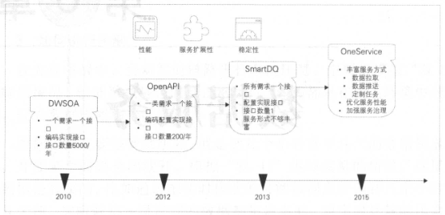

###### （2）DWSOA

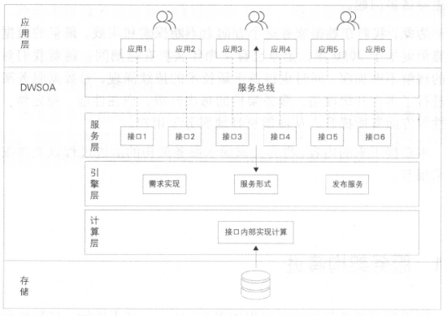

业务方对数据的需求通过SOA服务的方式暴露出去。由需求驱动，一个需求开发一个或者几个接口，编写接口文档，开放给业务方调用。实现比较简单。缺点明显：

- 接口粒度比较粗，灵活性不高，扩展性差，复用率低。
- 开发效率不高，无法快速响应业务。

###### （3）OpenAPI

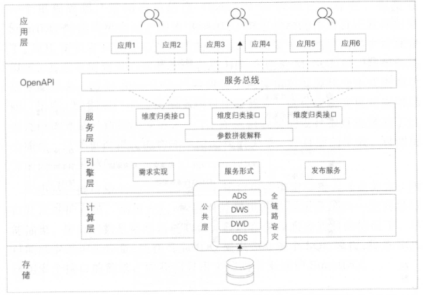

OpenAPI的做法就是将数据按照其统计粒度进行聚合，同样维度的数据，形成一张逻辑表，采用同样的接口描述。结果表明这种方式有效地收敛了接口数量。

（目测是通过在服务层归类成类似数据库表的模型，减少其他层的编码操作）

###### （4）SmartDQ

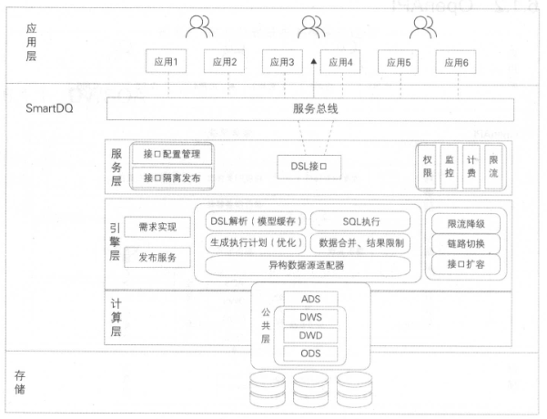

着时间的推移，大家对数据的深度使用，分析数据的维度也越来越多，于是，在OpenAPI的基础上，再抽象一层，用DSL(Domain Specific Language，领域专用语言）来描述取数需求。

采用标准的SQL语法，在此基础上做了一些限制和特殊增强，以降低学习成本。同时也封装了标准DataSource，可以使用ORM(Object Relation Mapping，对象关系映射）框架（目前比较主流的框架有Hibernate、MyBatis等）来解决对象关系映射问题。至此，所有的简单查询服务减少到只有一个接口，这大大降低了数据服务的维护成本。

（提供接口模板，减少人员维护）

###### （5）OneService统一的数据服务层

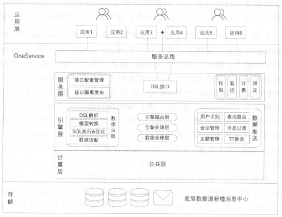

SmartDQ其实只满足了简单的查询服务需求，不能满足个性化的取数业务场景，可以使用Lego。OneService主要是提供多种服务类型来满足用户需求，分别是OneService-SmartDQ、OneService-Lego、OneService-iPush、OneService-uTiming。

（可以使用Lego进行用户画像）

#### 2、最佳实践

###### （1）性能

- 资源分配
  - 剥离计算资源：剥离复杂的计算统计逻辑，将其全部交由底层的数据公共层进行处理，只保留核心的业务处理逻辑
  - 查询资源分配：计了两个独立的线程池：Get线程池和List线程池，分别处理Get请求和List请求，这样就不会因为某些List慢查询，而影响到Get快查询。系统的QPS（Queries-per-second，每秒查询率）比之前提升许多。
  - 执行计划优化：查询拆分/查询优化（List查询转Get查询）

- 缓存优化
  - 元数据缓存
  - 模型缓存：将解析后的模型（包括逻辑模型、物理模型）缓存在本地。节省了DSL->SQL的解析时间。
  - 结果缓存：对查询结果进行缓存，以提高查询性能。

- 查询能力
  - 合并查询：离线数据和实时数据的数据源一般不同，调用者的查询方式完全不同。离线数据最准确，需要优先使用离线数据。如果离线数据还未产出，则改用实时数据。
  - 推送服务：推送服务很好地解决了数据更新的实时性问题，同时也减少了对服务器的请求压力。（减少数据未更新前端不断请求的压力）

###### （2）稳定性

- 发布系统
  - 元数据隔离：为了保障系统的稳定性，根据应用环境设计了三套元数据：日常元数据、预发元数据和线上元数据。
    - 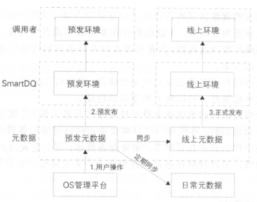
  - 隔离发布：不同用户的发布不会相互影响。
    - 资源划分：定隔离的最小单元。由于调用者的查询请求最终都会转换成对某张逻辑表的查询。
    - 资源独占：当用户开始修改的时候，系统会锁定其正在修改的逻辑表及其下挂的物理表等资源，禁止其他用户修改。当用户正式发布变更后，就会释放锁定的资源，这时其他用户才可以对相关元数据进行修改。
    - 增量更新：发布时引擎是不需要重新加载全量元数据的，只需要加载所发布的逻辑表元数据即可。
- 隔离：将系统划分为若干个独立模块，当某个模块出现问题时，整体功能仍然能保证可用。另一个作用是可以对系统资源进行有效的管理，从而提高系统的可用性。
  - 机房隔离
  - 分组隔离：据某些条件将调用者进行分层，然后将服务端的机器划分为若干个分组，每个分组都有明确的服务对象和保障等级。

- 安全限制
- 监控
  - 调用日志采集
  - 调用监控（系统）

- 限流、降级

------

## 第七章 数据挖掘

基于大数据的企业级数据挖掘需要包含两个要素：①面向机器学习算法的并行计算框架与算法平台；②面向企业级数据挖掘的算法资产管理体系。

#### 1、机器学习算法

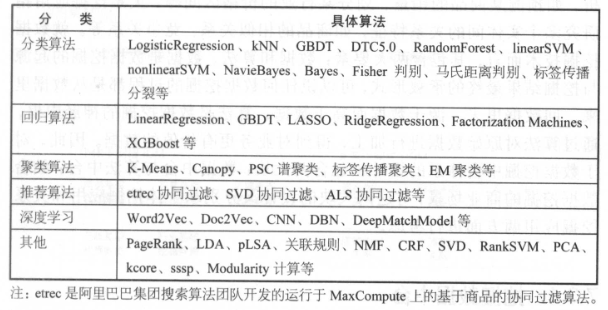

#### 2、数据挖掘中台体系

在阿里巴巴集团，由于业务场景与商业智能分析需求的多样化，多个部门、多个商业智能及算法团队针对应用问题所提出的算法解决方案往往是独立的，通常一次数据挖掘的过程包括商业理解、数据准备、特征工程、模型训练、模型测试、模型部署、线上应用及效果反馈等环节。

就数据挖掘的商业场景而言，可以分为两大类应用：个体挖掘应用与关系挖掘应用。个体挖掘应用指对单个实体的行为特征进行预测与分析，如预测某商品的销量、划分某行业的价格区间等；关系挖掘应用指研究多个实体间的关系特征，如商品的相似关系、竞争关系等。

就数据挖掘技术而言，其包含两大要素：数据和算法。数据是数据挖掘的起源与挖掘结果最终的承载形式，可以说任何数据挖掘的过程都是从数据里来，回数据里去，源于数据而高于数据：算法是数据挖掘的神经中枢，通过算法对原始数据进行加工，得到对业务更有价值的数据。

因此，对于数据挖掘中台体系的设计也包含两大块：数据中台与算法中台；结合数据挖掘的商业场景，对这两大块的设计又分别从个体挖掘应用和关系挖掘应用两方面进行考虑。

###### （1）挖掘数据中台

对结果数据进行合理的分层，有效隔离通用性强和个性化强的结果，这样可以充分发挥通用性强的算法结果的作用，提升它的复用率，减少不必要的重复建设。基于以上分析，我们把数据中台分为三层：特征层（Featural Data Mining Layer, FDM）、中间层和应用层（Application-orientedData Mining Layer, ADM），其中中间层包括个体中间层（IndividualData Mining Layer, IDM）和关系中间层（RelationalData Mining Layer, RDM）。

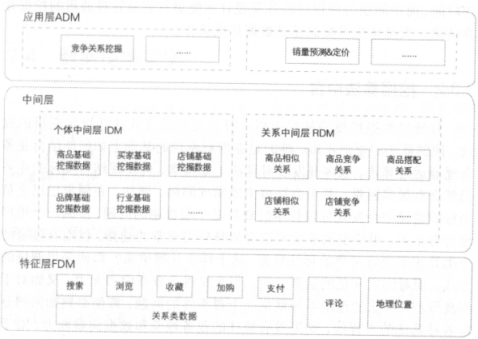

- FDM层：用于存储在模型训练前常用的特征指标，并进行统一的清洗和去噪处理，提升机器学习特征工程环节的效率。
- IDM层：个体挖掘指标中间层，面向个体挖掘场景，用于存储通用性强的结果数据，主要包含商品、卖家、买家、行业等维度

- RDM层：关系挖掘指标中间层，面向关系挖掘场景，用于存储通用性强的结果数据，主要包含商品间的相似关系、竞争关系，店铺间的相似关系、竞争关系等。
- ADM层：用来沉淀比较个性偏应用的数据挖掘指标，比如用户偏好的类目、品牌等，这些数据已经过深度的加工处理，满足某一特点业务或产品的使用。

###### （2）挖掘算法中台

数据挖掘算法中台建设的目的同样在于从各种各样的挖掘场景中抽象出有代表性的几类场景，并形成相应的方法论和实操模板。

#### 3、数据挖掘案例

###### （1）用户画像

用户画像即是为用户打上各种各样的标签，如年龄、性别、职业、商品品牌偏好、商品类别偏好等。这些标签的数目越丰富，标签越细化，对用户的刻画就越精准。

###### （2）互联网反作弊

业务上看，反作弊工作主要体现在以下几个方面：

- 账户／资金安全与网络欺诈防控
- 非人行为和账户识别
- 虚假订单与信用炒作识别
- 广告推广与APP安装反作弊
- UGC恶意信息检测

算法技术上说，反作弊方法主要包括如下几类：

- 基于业务规则的方法：
  - 根据实际的业务场景，不断地发现总结作弊和获利手法，通过反作弊规则的不断拓展或产品设计的完善来识别、缓解甚至消除作弊现象。
  - 优点是精度高、可解释性强，能准确识别老的作弊方式；缺点是人力成本高，而且对新的作弊手法滞后性较强。
- 基于有监督学习的方法
  - 按照有监督分类算法的流程来建模，通过正负样本标记、特征提取、模型训练及预测等过程来识别作弊行为。
  - 优点是通用性强，人力成本主要集中在样本的标记和特征的处理上；缺点是有些算法结果的可解释性不强，容易造成错判，需要辅以其他指标和方法进行综合判断。
- 基于无监督学习的方法
  - 异常检测算法假设作弊行为极其罕见且在某些特征维度下和正常行为能够明显地区分开来。所以，假设检验、统计分析、聚类分析等手段常被用来做异常检测。
  - 优点是不需要标记正负样本，而且检测到的异常行为还可以沉淀到规则系统中；缺点是特征设计和提取的工作量大，需要在所有可能的风险维度下刻画行为特征。

算法的实际应用工作主要分为以下两个方面：

- 离线反作弊系统
- 实时反作弊系统

未来的挑战：

- 作弊手段的多样性和多变性

- 算法的及时性和准确性
- 数据及作弊手段的沉淀和逆向反馈

------

## 第八章 大数据领域建模综述

数据模型就是数据组织和存储方法，它强调从业务、数据存取和使用角度合理存储数据。Linux的创始人Torvalds有一段关于“什么才是优秀程序员”的话：“烂程序员关心的是代码，好程序员关心的是数据结构和它们之间的关系”，其阐述了数据模型的重要性。

有了适合业务和基础数据存储环境的模型，那么大数据就能获得以下好处。

- 性能：良好的数据模型能帮助我们快速查询所需要的数据，减少数据的I/O吞吐。
- 成本：良好的数据模型能极大地减少不必要的数据冗余，也能实现计算结果复用，极大地降低大数据系统中的存储和计算成本。
- 效率：良好的数据模型能极大地改善用户使用数据的体验，提高使用数据的效率。
- 质量：良好的数据模型能改善数据统计口径的不一致性，减少数据计算错误的可能性。

#### 1、典型的数据仓库建模方法论

###### （1）ER模型

用实体关系（EntityRelationship, ER）模型描述企业业务，在范式理论上符合3NF。数据仓库中的3NF与OLTP系统中的3NF的区别在于，它是站在企业角度面向主题的抽象，而不是针对某个具体业务流程的实体对象关系的抽象。其具有以下几个特点：

- 需要全面了解企业业务和数据。
- 实施周期非常长。
- 对建模人员的能力要求非常高。

建模步骤分为三个阶段：

- 高层模型：一个高度抽象的模型，描述主要的主题以及主题间的关系，用于描述企业的业务总体概况。
- 中层模型：在高层模型的基础上，细化主题的数据项。
- 物理模型（也叫底层模型）：在中层模型的基础上，考虑物理存储，同时基于性能和平台特点进行物理属性的设计，也可能做一些表的合并、分区的设计等。

###### （2）维度模型

维度建模从分析决策的需求出发构建模型，为分析需求服务，因此它重点关注用户如何更快速地完成需求分析，同时具有较好的大规模复杂查询的响应性能。其典型的代表是星形模型，以及在一些特殊场景下使用的雪花模型。其设计分为以下几个步骤：

- 选择需要进行分析决策的业务过程。业务过程可以是单个业务事件，比如交易的支付、退款等；也可以是某个事件的状态，比如当前的账户余额等；还可以是一系列相关业务事件组成的业务流程，具体需要看我们分析的是某些事件发生情况，还是当前状态，或是事件流转效率。
- 选择粒度。在事件分析中，我们要预判所有分析需要细分的程度，从而决定选择的粒度。粒度是维度的一个组合。
- 识别维表。选择好粒度之后，就需要基于此粒度设计维表，包括维度属性，用于分析时进行分组和筛选。
- 选择事实。确定分析需要衡量的指标。

###### （3）Data Vault模型

Data Vault是ER模型的衍生，其设计的出发点也是为了实现数据的整合，但不能直接用于数据分析决策。它强调建立一个可审计的基础数据层，也就是强调数据的历史性、可追溯性和原子性，而不要求对数据进行过度的一致性处理和整合；同时它基于主题概念将企业数据进行结构化组织，并引入了更进一步的范式处理来优化模型，以应对源系统变更的扩展性。DataVault模型由以下几部分组成：

- Hub：是企业的核心业务实体，由实体key、数据仓库序列代理键、装载时间、数据来源组成。（骨架）
- Link：代表Hub之间的关系。这里与ER模型最大的区别是将关系作为一个独立的单元抽象，可以提升模型的扩展性。它可以直接描述1: 1、l:n和n:n的关系，而不需要做任何变更。它由Hub的代理键、装载时间、数据来源组成。（韧带）
- Satellite：是Hub的详细描述内容，一个Hub可以有多个Satellite。它由Hub的代理键、装载时间、来源类型、详细的Hub描述信息组成。（血肉）

Data Vault模型比ER模型更容易设计和产出，它的ETL加工可实现配置化。

###### （4）Anchor模型

Anchor对DataVault模型做了进一步规范化处理规范到6NF，基本变成了k-v结构化模型。我们看一下Anchor模型的组成：

- Anchors：类似于DataVault的Hub，代表业务实体，且只有主键。
- Attributes：功能类似于DataVault的Satellite，但是它更加规范化，将其全部k-v结构化，一个表只有一个Anchors的属性描述。
- Ties：就是Anchors之间的关系，单独用表来描述，类似于DataVault的Link，可以提升整体模型关系的扩展能力。
- Knots：代表那些可能会在多个Anchors中公用的属性的提炼，比如性别、状态等这种枚举类型且被公用的属性。

------

## 第九章 阿里巴巴数据整合及管理体系

阿里巴巴集团大数据建设方法论的核心是：从业务架构设计到模型设计，从数据研发到数据服务，做到数据可管理、可追溯、可规避重复建设。

#### 体系架构

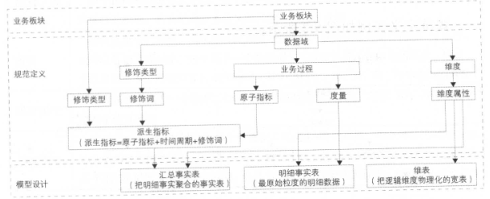

#### 基本原则

- 高内聚和低耦合
  - 一个逻辑或者物理模型由哪些记录和字段组成，应该遵循最基本的软件设计方法论的高内聚和低藕合原则
- 核心模型与扩展模型分离
- 公共处理逻辑下沉及单一
  - 越是底层公用的处理逻辑越应该在数据调度依赖的底层进行封装与实现，不要让公用的处理逻辑暴露给应用层实现，不要让公共逻辑多处同时存在。
- 成本与性能平衡
- 数据可回滚
- 一致性
- 命名清晰、可理解

#### 模型实施

###### （1）业界常用模型实施过程

- Kimball模型主要探讨需求分析、高层模型、详细模型和模型审查整个过程。
  - 高层模型：高层模型设计阶段的直接产出目标是创建高层维度模型图，它是对业务过程中的维表和事实表的图形描述。
  - 详细模型：详细的维度建模过程是为高层模型填补缺失的信息，解决设计问题，并不断测试模型能否满足业务需求，确保模型的完备性。
  - 模型审查、再设计和验证
  - 提交ETL设计和开发

- Inmon对数据模型的定位是：扮演着通往数据仓库其他部分的智能路线图的角色。
  - ERD层是数据模型的最高层，该层描述了公司业务中的实体或主题域以及它们之间的关系；
  - ERD层是中间层，该层描述了数据模型中的关键字、属性以及细节数据之间的关系；
  - 物理层是数据建模的最底层，该层描述了数据模型的物理特性。

- 其他模型
  - 业务建模
  - 领域建模
  - 逻辑建模
  - 物理建模

###### （2）OneData实施过程

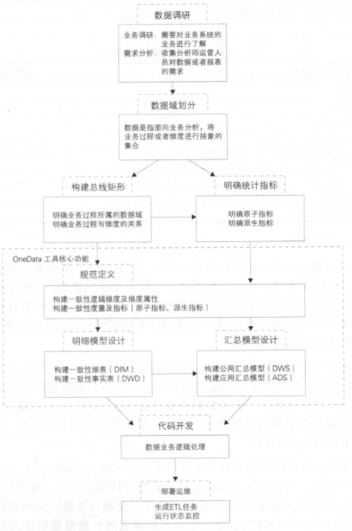

OneData的实施过程是一个高度迭代和动态的过程，一般采用螺旋式实施方法。在总体架构设计完成之后，开始根据数据域进行迭代式模型设计和评审。在架构设计、规范定义和模型设计等模型实施过程中，都会引人评审机制，以确保模型实施过程的正确性。

------

## 第十章 维度设计

