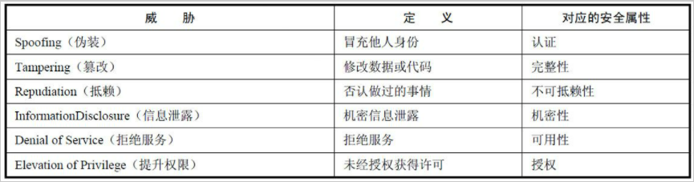
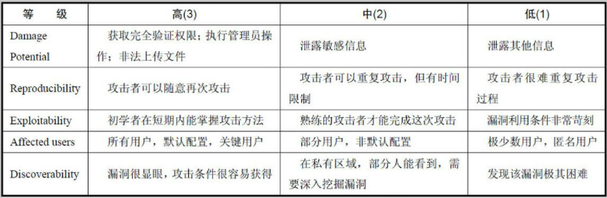
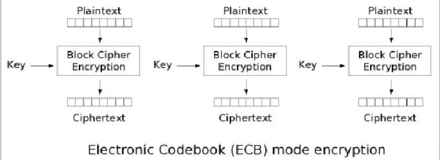
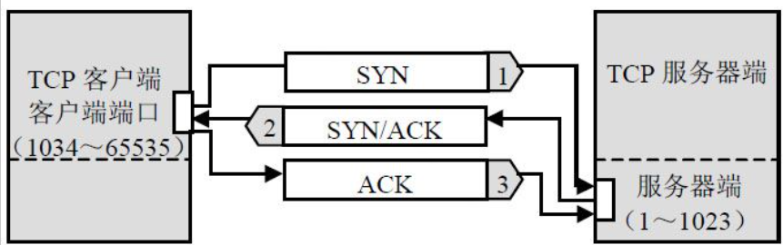
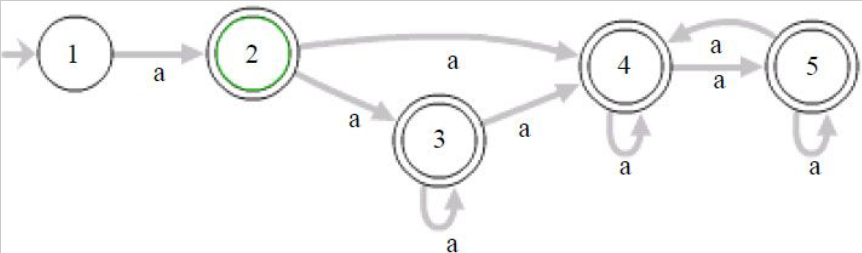
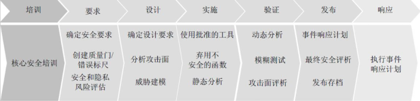

## 一些浅显的起步

在我开始读这本书之前，对于网络安全的感受就是两个：DDOS和SQL注入。DDOS是因为我喜欢玩一些偏门的新游戏，比如说猫灵相册、四叶草剧场都有过被DDOS攻击的经历，当时稍微从UP主epcdiy了解了下DDOS操作“肉鸡”攻击的方式【[网络霸凌者只会DDoS欺负小网站？我让高防服务器教你做人！](https://www.bilibili.com/video/BV1cY411x7k8/?is_story_h5=false&p=1&share_from=ugc&share_medium=android&share_plat=android&share_session_id=386178ae-bb4d-477e-b817-3da6c775ef42&share_source=QQ&share_tag=s_i&timestamp=1671463997&unique_k=UrQmcxP&vd_source=a81ef8427e696b92de364d833142bd10)】，感叹了下服务器还是选阿里云啥的好。。。咳咳，扯远了；SQL注入主要是在工作室一次技术沙龙听学长分享的时候偶然之间听到的，觉得有意思也想自己试试，但是用来攻击自己的网站都不能成功，不过在读完这本书后我也明白了为什么（不过是因为现在的框架已经将大部分常见的攻击已经过滤掉了）。

说起读这本书的契机，实际上是因为工作室的老师在20大之前召开了一次关于网络安全的会议，告诉我们写系统要注意网络安全。当时我完全没考虑过网络安全的事情，浅显的认为网络安全就是所谓系统中的Spring Security以及使用的Jwt，当然这些的确是网络安全的一部分，但是只是实现的工具罢了。对于网络安全我并没有一个完整的理念/体系，当时真的天真的认为一个系统配了个Authorization/Token就差不多安全了，现在再回过头来看确实是挺肤浅的。

总而言之，就这样我就开始了这本书的阅读。也愈发关注起了网络安全，经常有意识的在B站看看有意思的网安视频，催使我更新文档的就是其中之一：[电子监听、全国断网，棱镜门背后，中国如何从末路狂奔到世界之巅](https://www.bilibili.com/video/BV1i14y157YV/?spm_id_from=333.337.search-card.all.click&vd_source=a81ef8427e696b92de364d833142bd10)，未来没准从大数据转到网安了呢？（笑）

因为不是很会做总结归纳，所以我就从本书的总结开始，对每一章的总结进行一个排疑，借此也巩固我自己的一个理解。我并没有很深入的阅读，相反，我阅读得相当简单，这里面设计的代码面太广，我也无法对书中的每一段代码进行推敲，因此文档里面肯定有很多问题，毕竟这本书也是有一定年限/自己的技术也不是很硬/读的内容还是过浅，加上我总是喜欢加上个人的理解。如果你找到了任何文档的错误，欢迎在issue上留言，我会及时修改哒！


## 第一章 安全世界观

**互联网本来是安全的，自从有了研究安全的人之后，互联网就变得不安全了。**

#### 1、为什么是Web安全？

在早期互联网中，Web并非互联网的主流应用，相对来说，基于SMTP、POP3、FTP、IRC等协议的服务拥有着绝大多数的用户。因此黑客们主要的攻击目标是网络、操作系统以及软件等领域，Web安全领域的攻击与防御技术均处于非常原始的阶段。

时代在发展，防火墙技术的兴起改变了互联网安全的格局。尤其是以Cisco、华为等为代表的网络设备厂商，开始在网络产品中更加重视网络安全，最终改变了互联网安全的走向。防火墙、ACL技术的兴起，使得直接暴露在互联网上的系统得到了保护。

运营商、防火墙对于网络的封锁，使得暴露在互联网上的非Web服务越来越少，且Web技术的成熟使得Web应用的功能越来越强大，最终成为了互联网的主流。黑客们的目光，也渐渐转移到了Web这块大蛋糕上。


#### 2、Web攻击技术的发展

Web 1.0时代，人们更多的是关注服务器端动态脚本的安全问题，比如将一个可执行脚本（俗称webshell）上传到服务器上，从而获得权限。动态脚本语言的普及，以及Web技术发展初期对安全问题认知的不足导致很多“血案”的发生，同时也遗留下很多历史问题。

SQL注入的出现是Web安全史上的一个里程碑，它最早出现大概是在1999年，并很快就成为Web安全的头号大敌。黑客们发现通过SQL注入攻击，可以获取很多重要的、敏感的数据，甚至能够通过数据库获取系统访问权限，这种效果并不比直接攻击系统软件差，Web攻击一下子就流行起来。SQL注入漏洞至今仍然是Web安全领域中的一个重要组成部分。

XSS（跨站脚本攻击）的出现则是Web安全史上的另一个里程碑。

Web 2.0的兴起，XSS、CSRF等攻击已经变得更为强大。Web攻击的思路也从服务器端转向了客户端，转向了浏览器和用户。

Web技术发展到今天，构建出了丰富多彩的互联网。互联网业务的蓬勃发展，也催生出了许多新兴的脚本语言，比如Python、Ruby、NodeJS等，敏捷开发成为互联网的主旋律。而手机技术、移动互联网的兴起，也给HTML 5带来了新的机遇和挑战。与此同时，Web安全技术，也将紧跟着互联网发展的脚步，不断地演化出新的变化。


#### 3、安全问题的本质

**安全是什么？什么样的情况下会产生安全问题？我们要如何看待安全问题？**

###### （1）一个安全问题是如何产生的？

我们不妨先从现实世界入手。火车站、机场里，在乘客们开始正式旅程之前，都有一个必要的程序：安全检查。

安全检查的过程按照需要进行过滤。通过一个安全检查（过滤、净化）的过程，可以梳理未知的人或物，使其变得可信任。被划分出来的具有不同信任级别的区域，我们称为信任域，划分两个不同信任域之间的边界，我们称为信任边界。

**数据从高等级的信任域流向低等级的信任域，是不需要经过安全检查的；数据从低等级的信任域流向高等级的信任域，则需要经过信任边界的安全检查。**

因此，**安全问题的本质是信任的问题**。

一切的安全方案设计的基础，都是建立在信任关系上的。我们必须相信一些东西，必须有一些最基本的假设，安全方案才能得以建立；如果我们否定一切，安全方案就会如无源之水，无根之木，无法设计，也无法完成。

从另一个角度来说，一旦我们作为决策依据的条件被打破、被绕过，那么就会导致安全假设的前提条件不再可靠，变成一个伪命题。因此，把握住信任条件的度，使其恰到好处，正是设计安全方案的难点所在，也是安全这门学问的艺术魅力所在。

###### （2）安全问题没有一劳永逸

**安全是一个持续的过程。**

自从互联网有了安全问题以来，攻击和防御技术就在不断碰撞和对抗的过程中得到发展。从微观上来说，在某一时期可能某一方占了上风；但是从宏观上来看，某一时期的攻击或防御技术，都不可能永远有效，永远用下去。这是因为防御技术在发展的同时，攻击技术也在不断发展，两者是互相促进的辩证关系。以不变的防御手段对抗不断发展的攻击技术，就犯了刻舟求剑的错误。

安全产品本身也需要不断地升级，也需要有人来运营。产品本身也需要一个新陈代谢的过程，否则就会被淘汰。在现代的互联网产品中，自动升级功能已经成为一个标准配置，一个有活力的产品总是会不断地改进自身。


#### 4、安全三要素

设计安全方案之前，要正确、全面地看待安全问题，首先要理解安全问题的组成属性。前人通过无数实践，最后将安全的属性总结为安全三要素，简称CIA。后来还有人想扩充这些要素，增加了诸如可审计性、不可抵赖性等，但最最重要的还是以上三个要素。在设计安全方案时，也要以这三个要素为基本的出发点，去全面地思考所面对的问题。

###### （1）机密性（Confidentiality）

机密性要求保护数据内容不能泄露，加密是实现机密性要求的常见手段。

###### （2）完整性（Integrity）

完整性要求保护数据内容是完整、没有被篡改的。常见的保证一致性的技术手段是数字签名。

###### （3）可用性（Availability）

可用性要求保护资源是“随需而得”。（不能盲目响应请求，这样会造成DDOS攻击[拒绝服务]，但又要保证正常的请求不能被过滤掉）


#### 5、安全评估

安全评估的过程，可以简单地分为4个阶段：资产等级划分、威胁分析、风险分析、确认解决方案。

###### （1）资产等级划分

资产等级划分是所有工作的基础，这项工作能够帮助我们明确目标是什么，要保护什么。

**互联网安全的核心问题，是数据安全的问题。**完成资产等级划分后，对要保护的目标已经有了一个大概的了解，接下来就是要划分信任域和信任边界了。通常我们用一种最简单的划分方式，就是从网络逻辑上来划分。比如最重要的数据放在数据库里，那么把数据库的服务器圈起来；Web应用可以从数据库中读/写数据，并对外提供服务，那再把Web服务器圈起来；最外面是不可信任的Internet。

###### （2）威胁分析

在安全领域里，我们把可能造成危害的来源称为**威胁（Threat）**，而把可能会出现的损失称为**风险（Risk）**。风险一定是和损失联系在一起的。

- STRIDE模型：STRIDE是6个单词的首字母缩写，我们在分析威胁时，可以从以下6个方面去考虑。



威胁分析是非常重要的一件事情，很多时候还需要经常回顾和更新现有的模型。可能存在很多威胁，但并非每个威胁都会造成难以承受的损失。一个威胁到底能够造成多大的危害，如何去衡量它？这就要考虑到风险了。我们判断风险高低的过程，就是风险分析的过程。

###### （3）风险分析

风险由以下因素组成：**Risk = Probability * Damage Potential**

影响风险高低的因素，除了造成损失的大小外，还需要考虑到发生的可能性。我们在考虑安全问题时，要结合具体情况，权衡事件发生的可能性，才能正确地判断出风险。

- DREAD模型：由微软提出。DREAD也是几个单词的首字母缩写，它指导我们应该从哪些方面去判断一个威胁的风险程度。



在DREAD模型里，每一个因素都可以分为高、中、低三个等级。在上表中，高、中、低三个等级分别以3、2、1的分数代表其权重值，因此，我们可以具体计算出某一个威胁的风险值。

任何时候都应该记住——**模型是死的，人是活的，再好的模型也是需要人来使用的**，在确定攻击面，以及判断风险高低时，都需要有一定的经验，这也是安全工程师的价值所在。类似STRIDE和DREAD的模型可能还有很多，不同的标准会对应不同的模型，只要我们觉得这些模型是科学的，能够帮到我们，就可以使用。但模型只能起到一个辅助的作用，最终做出决策的还是人。

###### （4）确认解决方案

安全评估的产出物，就是安全解决方案。解决方案一定要有针对性，这种针对性是由资产等级划分、威胁分析、风险分析等阶段的结果给出的。

设计解决方案不难，难的是如何设计一个好的解决方案。设计一个好的解决方案，是真正考验安全工程师水平的时候。

对于互联网来说，**安全是要为产品的发展与成长保驾护航的**。我们不能使用“粗暴”的安全方案去阻碍产品的正常发展，所以应该形成这样一种观点：**没有不安全的业务，只有不安全的实现方式。好的安全方案对用户应该是透明的，尽可能地不要改变用户的使用习惯。**

好的安全产品或模块除了要兼顾用户体验外，还要易于持续改进。一个好的安全模块，同时也应该是一个优秀的程序，从设计上也需要做到**高聚合、低耦合、易于扩展**。

- 一个优秀安全方案的特点：能够有效解决问题；用户体验好；高性能；低耦合；易于扩展和升级。


#### 6、具体设计安全方案的技巧

###### （1）Secure By Default原则

- 黑名单、白名单

按照白名单的思想，应该根据业务需求，列出一个允许使用的软件以及软件版本的清单，在此清单外的软件则禁止使用。选择白名单的思想，基于白名单来设计安全方案，其实就是信任白名单是好的，是安全的。但是一旦这个信任基础不存在了，那么安全就荡然无存。

- 最小权限原则

最小权限原则要求系统只授予主体必要的权限，而不要过度授权，这样能有效地减少系统、网络、应用、数据库出错的机会。

（在使用最小权限原则时，需要认真梳理业务所需要的权限，在很多时候，开发者并不会意识到业务授予用户的权限过高。在通过访谈了解业务时，可以多设置一些反问句，比如：您确定您的程序一定需要访问Internet吗？通过此类问题，来确定业务所需的最小权限。）

###### （2）纵深防御原则（Defense inDepth）

纵深防御包含两层含义：首先，要在各个不同层面、不同方面实施安全方案，避免出现疏漏，不同安全方案之间需要相互配合，构成一个整体；其次，要在正确的地方做正确的事情，即：**在解决根本问题的地方实施针对性的安全方案。**

纵深防御并不是同一个安全方案要做两遍或多遍，而是要从不同的层面、不同的角度对系统做出整体的解决方案。它要求我们深入理解威胁的本质，从而做出正确的应对措施。

- “统一威胁管理”（Uni-fied Threat Management）：UTM几乎集成了所有主流安全产品的功能，比如防火墙、VPN、反垃圾邮件、IDS、反病毒等。UTM的定位是当中小企业没有精力自己做安全方案时，可以在一定程度上提高安全门槛。但是UTM并不是万能药，很多问题并不应该在网络层、网关处解决，所以实际使用时效果未必好，它更多的是给用户买个安心。

###### （3）数据与代码分离原则

在Web安全中，由“注入”引起的问题比比皆是，如XSS、SQL Injection、CRLF Injection、X-Path Injection等。此类问题均可以根据“数据与代码分离原则”设计出真正安全的解决方案，因为这个原则抓住了漏洞形成的本质原因。

###### （4）不可预测性原则（Unpredictable）

从克服攻击方法的角度看问题，能有效地对抗基于篡改、伪造的攻击。

不可预测性的实现往往需要用到加密算法、随机数算法、哈希算法，好好使用这条原则，在设计安全方案时往往会事半功倍。

------


## 第二章 浏览器安全

浏览器是互联网最大的入口，绝大多数用户使用互联网的工具是浏览器。一方面，浏览器天生就是一个客户端，如果具备了安全功能，就可以像安全软件一样对用户上网起到很好的保护作用；另一方面，浏览器安全也成为浏览器厂商之间竞争的一张底牌，浏览器厂商希望能够针对安全建立起技术门槛，以获得竞争优势。因此近年来随着浏览器版本的不断更新，浏览器安全功能变得越来越强大。

#### 1、同源策略（Same Origin Policy）

同源策略（Same Origin Policy）是一种约定，它是浏览器最核心也最基本的安全功能，如果缺少了同源策略，则浏览器的正常功能可能都会受到影响。可以说**Web是构建在同源策略的基础之上的，浏览器只是针对同源策略的一种实现**。浏览器的同源策略，限制了来自不同源的“document”或脚本，对当前“document”读取或设置某些属性。

- **XMLHttpRequest受到同源策略的约束，不能跨域访问资源**（这就是常见的开发中需要配置跨域的原因）。如果XMLHttpRequest能够跨域访问资源，则可能会导致一些敏感数据泄露，比如CSRF的token，从而导致发生安全问题。

#### 2、浏览器沙箱

在网页中插入一段恶意代码，利用浏览器漏洞执行任意代码的攻击方式，在黑客圈子里被形象地称为“挂马”。“挂马”是浏览器需要面对的一个主要威胁。浏览器的多进程架构，将浏览器的各个功能模块分开，各个浏览器实例分开，当一个进程崩溃时，也不会影响到其他的进程。

Sandbox即沙箱，计算机技术发展到今天，Sandbox已经成为泛指“**资源隔离类模块**”的代名词。Sandbox的设计目的一般是为了让不可信任的代码运行在一定的环境中，限制不可信任的代码访问隔离区之外的资源。如果一定要跨越Sandbox边界产生数据交换，则只能通过指定的数据通道，比如经过封装的API来完成，在这些API中会严格检查请求的合法性。

Sandbox的应用范围非常广泛。采用Sandbox技术，无疑可以让不受信任的网页代码、JavaScript代码运行在一个受到限制的环境中，从而保护本地桌面系统的安全。

#### 3、恶意网址拦截

恶意网址拦截的工作原理很简单，一般都是浏览器周期性地从服务器端获取一份最新的恶意网址黑名单，如果用户上网时访问的网址存在于此黑名单中，浏览器就会弹出一个警告页面。

常见的恶意网址分为两类：一类是挂马网站，这些网站通常包含有恶意的脚本如JavaScript或Flash，通过利用浏览器的漏洞（包括一些插件、控件漏洞）执行shellcode，在用户电脑中植入木马；另一类是钓鱼网站，通过模仿知名网站的相似页面来欺骗用户。

------


## 第三章 跨站脚本攻击（XSS）

跨站脚本攻击（XSS）是客户端脚本安全中的头号大敌。

#### 1、简介

跨站脚本攻击，英文全称是Cross Site Script，本来缩写是CSS，但是为了和层叠样式表（Cas-cading Style Sheet，CSS）有所区别，所以在安全领域叫做“XSS”。

XSS攻击，通常指黑客通过“**HTML注入**”篡改了网页，插入了恶意的脚本，从而在用户浏览网页时，控制用户浏览器的一种攻击。在一开始，这种攻击的演示案例是跨域的，所以叫做“跨站脚本”。但是发展到今天，由于JavaScript的强大功能以及网站前端应用的复杂化，是否跨域已经不再重要。但是由于历史原因，XSS这个名字却一直保留下来。

XSS长期以来被列为客户端Web安全中的头号大敌。因为XSS破坏力强大，且产生的场景复杂，难以一次性解决。现在业内达成的共识是：针对各种不同场景产生的XSS，需要区分情景对待。即便如此，复杂的应用环境仍然是XSS滋生的温床。

- 反射型XSS：简单地把用户输入的数据“反射”给浏览器。也就是说，黑客往往需要诱使用户“点击”一个恶意链接，才能攻击成功。反射型XSS也叫做“非持久型XSS”（Non-persistent XSS）。**（诱使进入钓鱼网站的过程）**
- 存储型XSS：存储型XSS会把用户输入的数据“存储”在服务器端。这种XSS具有很强的稳定性。存储型XSS通常也叫做“持久型XSS”(Persistent XSS)，因为从效果上来说，它存在的时间是比较长的。**（钓鱼网站内操作的过程）**
- DOM Based XSS：从效果上来说也是反射型XSS。单独划分出来，是因为DOM Based XSS的形成原因比较特别，是通过修改页面的DOM节点形成的XSS。**（利用组件执行的函数将攻击代码植入执行）**

#### 2、XSS攻击

###### （1）XSS Payload

XSS攻击成功后，攻击者能够对用户当前浏览的页面植入恶意脚本，通过恶意脚本，控制用户的浏览器。这些用以完成各种具体功能的恶意脚本，被称为“XSS Payload”。实际上就是JavaScript脚本（还可以是Flash或其他富客户端的脚本），所以任何JavaScript脚本能实现的功能，XSS Payload都能做到。

一个最常见的XSS Payload，就是通过读取浏览器的Cookie对象，从而发起“Cookie劫持”攻击。（Cookie的“HttpOnly”标识可以防止“Cookie劫持”）下面是几个常见的XSS Payload方式：

- **构造GET与POST请求**
- **XSS钓鱼**（对于验证码，XSS Payload可以通过读取页面内容，将验证码的图片URL发送到远程服务器上来实施——攻击者可以在远程XSS后台接收当前验证码，并将验证码的值返回给当前的XSS Payload，从而绕过验证码。 || 对于修改密码，可以利用JavaScript在当前页面上“画出”一个伪造的登录框，当用户在登录框中输入用户名与密码后，其密码将被发送至黑客的服务器上。）
- **识别用户浏览器**（通过XSS读取浏览器的UserAgent对象）
- **标识用户安装的软件**（知道了用户使用的浏览器、操作系统后，进一步可以识别用户安装的软件。黑客通过判断用户安装的软件，选择对应的浏览器漏洞，最终达到植入木马的目的。）
- **CSS History Hack**（利用style的visited属性——如果用户曾经访问过某个链接，那么这个链接的颜色会变得与众不同）
- **获取用户真实IP地址**（JavaScript本身并没有提供获取本地IP地址的能力，一般来说，XSS攻击需要借助第三方软件来完成。比如，客户端安装了Java环境（JRE），那么XSS就可以通过调用JavaApplet的接口获取客户端的本地IP地址。）**【这一条告诉我们，不要觉得代理翻墙就安全了，黑客能做到的，要相信网安也能做到，小心网警来敲门】**

###### （2）XSS攻击平台

XSS Payload如此强大，为了使用方便，有安全研究者将许多功能封装起来，成为XSS攻击平台。这些攻击平台的主要目的是为了演示XSS的危害，以及方便渗透测试使用。下面就介绍几个常见的XSS攻击平台。

- Attack API是安全研究者pdp所主导的一个项目，它总结了很多能够直接使用XSS Payload，归纳为API的方式。（[Cyb3rWard0g/Invoke-ATTACKAPI: A PowerShell script to interact with the MITRE ATT&CK Framework via its own API (github.com)](https://github.com/Cyb3rWard0g/Invoke-ATTACKAPI)）
- BeEF曾经是最好的XSS演示平台。不同于Attack API，BeEF所演示的是一个完整的XSS攻击过程。BeEF有一个控制后台，攻击者可以在后台控制前端的一切。（[beefproject/beef: The Browser Exploitation Framework Project (github.com)](https://github.com/beefproject/beef)）
- XSS-Proxy是一个轻量级的XSS攻击平台，通过嵌套iframe的方式可以实时地远程控制被XSS攻击的浏览器。（[XSS-Proxy: A tool for realtime XSS hijacking and control (sourceforge.net)](https://xss-proxy.sourceforge.net/)）

这些XSS攻击平台有助于**深入理解XSS的原理和危害**。（可以直接在Github上找到开源项目【大部分已经作为时代历程而落幕了】，CSDN也有新手教程，不过XSS主要是面对前端和PHP的【个人感觉】，要求先有比较高的水准才能自己写脚本，我不会所以就没下着玩玩）

###### （3）终极武器XSS Worm

XSS Worm是XSS的一种终极利用方式，它的破坏力和影响力是巨大的。但是发起XSS Worm攻击也有一定的条件。一般来说，用户之间发生交互行为的页面，如果存在存储型XSS，则比较容易发起XSS Worm攻击。

比如，发送站内信、用户留言等页面，都是XSS Worm的高发区，需要重点关注。而相对的，如果一个页面只能由用户个人查看，比如“用户个人资料设置”页面，因为缺乏用户之间互动的功能，所以即使存在XSS，也不能被用于XSS Worm的传播。攻击者想要通过XSS做坏事是很容易的，而XSS Worm则能够把这种**破坏无限扩大**。

###### （4）调试JavaScript

要想写好XSS Payload，需要有很好的JavaScript功底，调试JavaScript是必不可少的技能。

- **Firebug：这是最常用的脚本调试工具**，前端工程师与Web Hacking必备，被喻为“居家旅行的瑞士军刀”。（可以查看页面DOM节点）（[firebug/firebug: Web Development Evolved - The Firebug you have known and loved (github.com)](https://github.com/firebug/firebug)）
- **Fiddler：是一个本地代理服务器**，需要将浏览器设置为使用本地代理服务器上网才可使用。Fiddler会监控所有的浏览器请求，并有能力在浏览器请求中插入数据。（支持脚本编程）（[Telerik & Kendo UI - .NET Components Suites & JavaScript UI Libraries](https://www.telerik.com/)【现在已经是比较成熟的商业化开发产品了】）
- **HttpWatch**：是一个商业软件，它以插件的形式内嵌在浏览器中。（[HttpWatch: An Advanced Network Debugger and HTTP Sniffer for Chrome, Edge and IE](https://www.httpwatch.com/)）

###### （5）XSS构造技巧

- **利用字符编码**（转义字符/浏览器不同）
- **绕过长度限制**
- **使用\<base>标签**
- **windows.name**（对当前窗口的window.name对象赋值，没有特殊字符的限制。因为window对象是浏览器的窗体，而并非document对象，因此很多时候window对象不受同源策略的限制。攻击者利用这个对象，可以实现跨域、跨页面传递数据。在某些环境下，这种特性将变得非常有用。）

###### （6）Flash XSS

Flash的时代已经落幕了，所以感兴趣的同学可以自己去看看书（狗头）。

#### 3、XSS防御

XSS的防御是复杂的。

###### （1）HttpOnly

浏览器将禁止页面的JavaScript访问带有HttpOnly属性的Cookie。严格地说，HttpOnly并非为了对抗XSS——HttpOnly解决的是XSS后的Cookie劫持攻击。需要注意的是，服务器可能会设置多个Cookie（多个key-value对），而HttpOnly可以有选择性地加在任何一个Cookie值上。

使用HttpOnly有助于缓解XSS攻击，但仍然需要其他能够解决XSS漏洞的方案。

###### （2）输入检查

输入检查，在很多时候也被用于格式检查。例如，用户在网站注册时填写的用户名，会被要求只能为字母、数字的组合。这些格式检查，有点像一种“白名单”，也可以让一些基于特殊字符的攻击失效。

**输入检查的逻辑，必须放在服务器端代码中实现**。如果只是在客户端使用JavaScript进行输入检查，是很容易被攻击者绕过的。目前Web开发的普遍做法，是同时在客户端JavaScript中和服务器端代码中实现相同的输入检查。客户端JavaScript的输入检查，可以阻挡大部分误操作的正常用户，从而节约服务器资源。

在XSS的防御上，输入检查一般是检查用户输入的数据中是否包含一些特殊字符，如<、>、’、”等。如果发现存在特殊字符，则将这些字符过滤或者编码。比较智能的“输入检查”，可能还会匹配XSS的特征。比如查找用户数据中是否包含了“\<script>”、“javascript”等敏感字符。这种输入检查的方式，可以称为“XSS Filter”。互联网上有很多开源的“XSS Filter”的实现。

###### （3）输出检查

- **安全的编码函数**：编码分为很多种，针对HTML代码的编码方式是HtmlEncode。HtmlEncode并非专用名词，它只是一种函数实现。它的作用是将字符转换成HTMLEntities，对应的标准是ISO-8859-1。在PHP中，有htmlentities()和htmlspe-cialchars()两个函数可以满足安全要求。JavaScript的编码方式可以使用JavascriptEncode。
- **在正确的地方使用正确的编码**

###### （4）XSS产生的本质原因

XSS的本质是一种**“HTML注入”**，用户的数据被当成了HTML代码一部分来执行，从而混淆了原本的语义，产生了新的语义。

###### （5）处理富文本

HTML是一种结构化的语言，比较好分析。通过htmlparser可以解析出HTML代码的标签、标签属性和事件。在过滤富文本时，**“事件”应该被严格禁止**，因为“富文本”的展示需求里不应该包括“事件”这种动态效果。而一些危险的标签，比如\<iframe>、\<script>、\<base>、\<form>等，也是应该严格禁止的。

在标签的选择上，应该**使用白名单，避免使用黑名单**。比如，只允许\<a>、\、\<div>等比较“安全”的标签存在。“白名单原则”不仅仅用于标签的选择，同样应该用于属性与事件的选择。

**尽可能地禁止用户自定义CSS与style。**

###### （6）防御DOM Based XSS

DOM Based XSS是一种比较特别的XSS漏洞，前文提到的几种防御方法都不太适用，需要特别对待。DOM Based XSS是从**JavaScript中输出数据到HTML页面里**。之前提到的方法都是针对“从服务器应用直接输出到HTML页面”的XSS漏洞，因此并不适用于DOM Based XSS。

会触发DOM Based XSS的地方有很多，以下几个地方是JavaScript输出到HTML页面的必经之路。

- document.write()
- document.writeln()
- xxx.innerHTML=
- xxx.outerHTML=
- innerHTML.replace
- document.attachEvent()
- window.attachEvent()
- document.location.replace()
- document.location.assign()
- ……

除了服务器端直接输出变量到JavaScript外，还有以下几个地方可能会成为DOM Based XSS的输入点，也需要重点关注。

- 页面中所有的inputs框
- window.location(href、hash等)
- window.name ?document.referrer
- document.cookie ?localstorage
- XMLHttpRequest返回的数据
- ……

#### 4、业务风险角度看XSS攻击

从风险的角度看，用户之间有互动的页面，是可能发起XSS Worm攻击的地方。而根据不同页面的PageView高低，也可以分析出哪些页面受XSS攻击后的影响会更大。比如在网站首页发生的XSS攻击，肯定比网站合作伙伴页面的XSS攻击要严重得多。

在修补XSS漏洞时遇到的最大挑战之一是漏洞数量太多，因此开发者可能来不及，也不愿意修补这些漏洞。从业务风险的角度来重新定位每个XSS漏洞，就具有了重要的意义。

------


## 第四章 跨站点请求伪造（CSRF）

CSRF的全名是Cross Site RequestForgery，翻译成中文就是跨站点请求伪造。它是一种常见的Web攻击，也是Web安全中最容易被忽略的一种攻击方式，在某些时候能够产生强大的破坏性。

#### 1、浏览器的Cookie策略

浏览器所持有的Cookie分为两种：**一种是“Session Cookie”，又称“临时Cookie”；另一种是“Third-party Cookie”，也称为“本地Cookie”**。

两者的区别在于，Third-party Cookie是服务器在Set-Cookie时指定了Expire时间，只有到了Expire时间后Cookie才会失效，所以这种Cookie会保存在本地；而Session Cookie则没有指定Expire时间，所以浏览器关闭后，Session Cookie就失效了。在浏览网站的过程中，若是一个网站设置了Session Cookie，那么在浏览器进程的生命周期内，即使浏览器新打开了Tab页，Session Cookie也都是有效的。Session Cookie保存在浏览器进程的内存空间中；而Third-party Cookie则保存在本地。

常见的CSRF攻击在于利用浏览器策略发送了第三方Cookie用于认证。

#### 2、P3P头

P3P Header是W3C制定的一项关于隐私的标准，全称是The Platform for Privacy Preferences。

在网站的业务中，P3P头主要用于类似广告等需要跨域访问的页面。P3P头设置后，对于Cookie的影响将扩大到整个域中的所有页面，因为Cookie是以域和path为单位的，这并不符合“最小权限”原则。

P3P头的介入改变了a.com的隐私策略，从而使得\<iframe>、\<script>等标签在浏览器中不再拦截第三方Cookie的发送。P3P头只需要由网站设置一次即可，之后每次请求都会遵循此策略，而不需要再重复设置。

#### 3、GET & POST

大多数CSRF攻击发起时，使用的HTML标签都是\、\<iframe>、\<script>等带“src”属性的标签，这类标签只能够发起一次GET请求，而不能发起POST请求。

但是实际上，**CSRF攻击不只是GET请求**，对于攻击者来说，有若干种方法可以构造出一个POST请求。攻击者甚至可以将这个页面隐藏在一个不可见的iframe窗口中，那么整个自动提交表单的过程，对于用户来说也是不可见的。

#### 4、CSRF的防御

###### （1）验证码

**验证码被认为是对抗CSRF攻击最简洁而有效的防御方法。**CSRF攻击的过程，往往是在用户不知情的情况下构造了网络请求。而验证码，则强制用户必须与应用进行交互，才能完成最终请求。因此在通常情况下，验证码能够很好地遏制CSRF攻击。

但是验证码并非万能。很多时候，出于用户体验考虑，网站不能给所有的操作都加上验证码。因此，验证码只能作为防御CSRF的一种**辅助手段，而不能作为最主要的解决方案**。

###### （2）Referer Check

Referer Check在互联网中最常见的应用就是**“防止图片盗链”**。同理，Referer Check也可以被用于检查请求是否来自合法的“源”。

Referer Check的缺陷在于，服务器并非什么时候都能取到Referer。很多用户出于隐私保护的考虑，限制了Referer的发送。在某些情况下，浏览器也不会发送Referer，比如从HTTPS跳转到HTTP，出于安全的考虑，浏览器也不会发送Referer。

###### （3）Anti CSRF Token

- **CSRF的本质：重要操作的所有参数都是可以被攻击者猜测到的。**出于这个原因，可以想到一个解决方案：把参数加密，或者使用一些随机数，从而让攻击者无法猜测到参数值。这是“不可预测性原则”的一种应用。（加密过程可以详见第十一章）**但是！！！**加密或混淆后的URL将变得非常难读，对用户非常不友好。其次，如果加密的参数每次都改变，则某些URL将无法再被用户收藏。最后，普通的参数如果也被加密或哈希，将会给数据分析工作带来很大的困扰，因为数据分析工作常常需要用到参数的明文。
- **Token的使用原则**：防御CSRF的Token，是根据“不可预测性原则”设计的方案，所以**Token的生成一定要足够随机，需要使用安全的随机数生成器生成Token**。此外，这个Token的目的不是为了防止重复提交。所以为了使用方便，**可以允许在一个用户的有效生命周期内，在Token消耗掉前都使用同一个Token**。但是如果用户已经提交了表单，则这个Token已经消耗掉，应该再次重新生成一个新的To-ken。如果Token保存在Cookie中，而不是服务器端的Session中，则会带来一个新的问题。如果一个用户打开几个相同的页面同时操作，当某个页面消耗掉Token后，其他页面的表单内保存的还是被消耗掉的那个Token，因此其他页面的表单再次提交时，会出现Token错误。在这种情况下，可以考虑**生成多个有效的Token，以解决多页面共存的场景**。最后，使用Token时应该**注意Token的保密性**。Token如果出现在某个页面的URL中，则可能会通过Referer的方式泄露。

------


## 第五章 点击劫持（ClickJacking）

点击劫持是一种视觉上的欺骗手段。攻击者使用一个透明的、不可见的iframe，覆盖在一个网页上，然后诱使用户在该网页上进行操作，此时用户将在不知情的情况下点击透明的iframe页面。通过调整iframe页面的位置，可以诱使用户恰好点击在iframe页面的一些功能性按钮上。**（现在是2023年1月，最大的“点击劫持”其实就在我们的日常生活中，那些找不到关闭按钮的小广告，正是点击劫持的典型代表）**

#### 1、图片覆盖攻击

点击劫持的本质是一种视觉欺骗。顺着这个思路，还有一些攻击方法也可以起到类似的作用，比如图片覆盖。Cross Site Image Overlaying攻击，简称XSIO，通过调整图片的style使得图片能够覆盖在所指定的任意位置。

XSIO不同于XSS，它利用的是图片的style，或者能够控制CSS。如果应用没有限制style的po-sition为absolute的话，图片就可以覆盖到页面上的任意位置，形成点击劫持。图片还可以伪装得像一个正常的链接、按钮；或者在图片中构造一些文字，覆盖在关键的位置，就有可能完全改变页面中想表达的意思，在这种情况下，不需要用户点击，也能达到欺骗的目的。

#### 2、拖拽劫持与数据窃取

很多浏览器都开始支持Drag & Drop 的API。对于用户来说，拖拽使他们的操作更加简单。浏览器中的拖拽对象可以是一个链接，也可以是一段文字，还可以从一个窗口拖拽到另外一个窗口，因此拖拽是不受同源策略限制的。“拖拽劫持”的思路是**诱使用户从隐藏的不可见iframe中“拖拽”出攻击者希望得到的数据，然后放到攻击者能控制的另外一个页面中，从而窃取数据**。在JavaScript或者Java API的支持下，这个攻击过程会变得非常隐蔽。因为它突破了传统Click-Jacking一些先天的局限，所以这种新型的“拖拽劫持”能够造成更大的破坏。

#### 3、ClickJacking 3.0：触屏劫持

触屏操作通常对应一下几个事件：

- touchstart，手指触摸屏幕时发生；
- touchend，手指离开屏幕时发生；
- touchmove，手指滑动时发生；
- touchcancel，系统可取消touch事件。

手机上的屏幕范围有限，手机浏览器为了节约空间，甚至隐藏了地址栏，因此手机上的视觉欺骗可能会变得更加容易实施。

#### 4、防御ClickJacking

###### （1）frame busting

写一段JavaScript代码，以禁止iframe的嵌套。这种方法叫frame busting。

###### （2）X-Frame-Options

frame busting存在被绕过的可能，所以我们需要寻找其他更好的解决方案。一个比较好的方案是使用一个HTTP头——X-Frame-Options。它有三个可选的值：

- DENY
- SAMEORIGIN
- ALLOW-FROM origin

当值为DENY时，浏览器会拒绝当前页面加载任何frame页面；若值为SAMEORIGIN，则frame页面的地址只能为同源域名下的页面；若值为AL-LOW-FROM，则可以定义允许frame加载的页面地址。

------


## 第六章 HTML 5安全

HTML 5是W3C制定的新一代HTML语言的标准。（也就是现在常说的H5）

#### 1、HTML 5新标签

###### （1）新标签的XSS

一些XSS Filter如果建立了一个黑名单的话，则可能就不会覆盖到HTML 5新增的标签和功能，从而避免发生XSS。

HTML 5中新增的一些标签和属性，使得XSS等Web攻击产生了新的变化，为了总结这些变化，有安全研究者建立了一个HTML5 Security Cheat-sheet项目。（虽然并没有找到该项目，但是都23年了，不少备忘录已经趋于成熟，例举一个我找到的：[HTML5 安全 - OWASP 备忘单系列](https://cheatsheetseries.owasp.org/cheatsheets/HTML5_Security_Cheat_Sheet.html)）

###### （2）iframe的sandbox

在HTML 5中，专门为iframe定义了一个新的属性，叫sandbox。使用sandbox这一个属性后，\<iframe>标签加载的内容将被视为一个独立的“源”，其中的脚本将被禁止执行，表单被禁止提交，插件被禁止加载，指向其他浏览对象的链接也会被禁止。sandbox属性可以通过参数来支持更精确的控制。有以下几个值可以选择：

- allow-same-origin：允许同源访问；
- allow-top-navigation：允许访问顶层窗口；
- allow-forms：允许提交表单；
- allow-scripts：允许执行脚本。

###### （3）Link Types：noreferrer

在HTML 5中为\<a>标签和\<area>标签定义了一个新的Link Types：noreferrer。顾名思义，标签指定了noreferrer后，浏览器在请求该标签指定的地址时将不再发送Referer。

这种设计是出于保护敏感信息和隐私的考虑。因为通过Referer，可能会泄露一些敏感信息。这个标签需要开发者手动添加到页面的标签中，对于有需求的标签可以选择使用noreferrer。代码如下：

```html
<a href="xxx" rel="noreferrer" >test</a>
```

###### （4）Canvas

不同于\标签只是远程加载一个图片，\<canvas>标签让JavaScript可以在页面中直接操作图片对象，也可以直接操作像素，构造出图片区域。Canvas的出现极大地挑战了传统富客户端插件的地位，开发者甚至可以用Canvas在浏览器上写一个小游戏。

通过Canvas自动破解验证码，最大的好处是可以在浏览器环境中实现在线破解，大大降低了攻击的门槛。HTML 5使得过去难以做到的事情，变为可能。

#### 2、其他安全问题

###### （1）Cross-Origin Resource Sharing

浏览器实现的同源策略（Same Origin Policy）限制了脚本的跨域请求。但互联网的发展趋势是越来越开放的，因此跨域访问的需求也变得越来越迫切。同源策略给Web开发者带来了很多困扰，他们不得不想方设法地实现一些“合法”的跨域技术，由此诞生了jsonp、iframe跨域等技巧。

###### （2）postMessage跨窗口传递

window这个对象几乎是不受同源策略限制的，很多脚本攻击都巧妙地利用了window对象的这一特点。在HTML 5中，为了丰富Web开发者的能力，制定了一个新的API：postMessage。postMessage允许每一个window（包括当前窗口、弹出窗口、iframes等）对象往其他的窗口发送文本消息，从而实现跨窗口的消息传递。这个功能是不受同源策略限制的。

在使用postMessage()时，有两个安全问题需要注意：

- 在必要时，可以在接收窗口验证 Domain，甚至验证URL，以防止来自非法页面的消息。这实际上是在代码中实现一次同源策略的验证过程。
- 实际应用中，如果将消息写入innerHTML，甚至直接写入script中，则可能会导致DOMbased XSS的产生。根据“Secure By Default”原则，在接收窗口不应该信任接收到的消息，而需要对消息进行安全检查。

使用postMessage，会使XSS Payload变得更加的灵活。

###### （3）Web Storage

Web Storage分为Session Storage 和 LocalStorage。Session Storage关闭浏览器就会失效，而Local Storage则会一直存在。**Web Storage就像一个非关系型数据库，由Key-Value对组成，可以通过JavaScript对其进行操作**。

Web Storage也受到同源策略的约束，每个域所拥有的信息只会保存在自己的域下，跨域时无法读取localStorage。Web Storage让Web开发更加的灵活多变，它的强大功能也为XSS Payload大开方便之门。攻击者有可能将恶意代码保存在Web Storage中，从而实现跨页面攻击。当Web Storage中保存有敏感信息时，也可能会成为攻击的目标，而XSS攻击可以完成这一过程。

------


## 第七章 注入攻击

注入攻击是Web安全领域中一种最为常见的攻击方式。**注入攻击的本质，是把用户输入的数据当做代码执行。**这里有两个关键条件，第一个是用户能够控制输入；第二个是原本程序要执行的代码，拼接了用户输入的数据。

#### 1、SQL注入

在SQL注入的过程中，如果网站的Web服务器开启了错误回显，则会为攻击者提供极大的便利，比如攻击者在参数中输入一个单引号“'”，引起执行查询语句的语法错误，服务器直接返回了错误信息。错误回显披露了敏感信息，对于攻击者来说，构造SQL注入的语句就可以更加得心应手了。

###### （1）盲注（Blind Injection）

“盲注”就是在服务器没有错误回显时完成的注入攻击。服务器没有错误回显，对于攻击者来说缺少了非常重要的“调试信息”，所以攻击者必须找到一个方法来验证注入的SQL语句是否得到执行。**最常见的盲注验证方法是，构造简单的条件语句，根据返回页面是否发生变化，来判断SQL语句是否得到执行。**

###### （2）Timing Attack

利用BENCHMARK()函数，可以让同一个函数执行若干次，使得结果返回的时间比平时要长；通过时间长短的变化，可以判断出注入语句是否执行成功。这是一种边信道攻击，这个技巧在盲注中被称为Timing Attack。

Timing Attack是盲注的一种高级技巧。在不同的数据库中，都有着类似于BENCHMARK()的函数，可以被Timing Attack所利用。

#### 2、数据库攻击技巧

###### （1）常见的攻击技巧

在注入攻击的过程中，常常会用到一些读写文件的技巧。比如在MySQL中，就可以通过LOAD_FILE()读取系统文件，并通过INTODUMPFILE写入本地文件。当然这要求当前数据库用户有读写系统相应文件或目录的权限。

如果当前数据库用户有创建表的权限：首先通过LOAD_FILE()将系统文件读出，再通过INTODUMPFILE将该文件写入系统中，然后通过LOAD DATA INFILE将文件导入创建的表中，最后就可以通过一般的注入技巧直接操作表数据了。

除了可以使用INTO DUMPFILE外，还可以使用INTO OUTFILE，两者的区别是DUMPFILE适用于二进制文件，它会将目标文件写入同一行内；而OUTFILE则更适用于文本文件。写入文件的技巧，经常被用于导出一个Web-shell，为攻击者的进一步攻击做铺垫。因此在设计数据库安全方案时，可以**禁止普通数据库用户具备操作文件的权限**。

###### （2）命令执行

通过lib_mysqludf_sys提供的几个函数执行系统命令，其中最主要的函数是sys_eval()和sys_exec()。在攻击过程中，将lib_mysqludf_sys.so上传到数据库能访问到的路径下。在创建UDF（User-Defined Functions）之后，就可以使用sys_eval()等函数执行系统命令了。 ?sys_eval，执行任意命令，并将输出返回。

- sys_exec，执行任意命令，并将退出码返回。 ?sys_get，获取一个环境变量。
- sys_set，创建或修改一个环境变量。

**在建立数据库账户时应该遵循“最小权限原则”，尽量避免给Web应用使用数据库的管理员权限。**

###### （3）攻击存储过程

存储过程为数据库提供了强大的功能，它与UDF很像，但存储过程必须使用CALL或者EXE-CUTE来执行。除了利用存储过程直接攻击外，存储过程本身也可能会存在注入漏洞。

###### （4）编码问题

在有些时候，不同的字符编码也可能会导致一些安全问题。注入攻击中常常会用到单引号“’”、双引号“””等特殊字符。在应用中，开发者为了安全，经常会使用转义字符“\”来转义这些特殊字符。但当数据库使用了“宽字符集”时，可能会产生一些意想不到的漏洞。比如，当MySQL使用了GBK编码时，0xbf27 和 0xbf5c都会被认为是一个字符（双字节字符）。

要解决这种问题，需要**统一数据库、操作系统、Web应用所使用的字符集，以避免各层对字符的理解存在差异**。统一设置为UTF-8是一个很好的方法。如果因为种种原因无法统一字符编码，则需要**单独实现一个用于过滤或转义的安全函数，在其中需要考虑到字符的可能范围**。

###### （5）SQL Column Truncation

在MySQL的配置选项中，有一个sql_mode选项。当MySQL的sql-mode设置为default时，即没有开启STRICT_ALL_TABLES选项时，MySQL对于用户插入的超长值只会提示warning，而不是error（如果是error则插入不成功），这可能会导致发生一些“截断”问题。

简单来说就是当插入的数据超过设置长度时，只把限制内的长度存入。比如说：如果用户名只允许存8位，管理员名称为admin，那么创建名字的时候这是为admin\_\_\_x（其中\_代表空格），那么将存入的是admin\_\_\_，经过一些处理（比如说过滤空格）可以实现和admin一样的效果。

#### 3、防御SQL注入

SQL注入的防御并不是一件简单的事情，开发者常常会走入一些误区。比如只对用户输入做一些escape处理，这是不够的。

###### （1）使用预编译语句

防御SQL注入的最佳方式，就是使用预编译语句，**绑定变量**。使用预编译的SQL语句，SQL语句的语义不会发生改变。在SQL语句中，变量用?表示，攻击者无法改变SQL的结构，即使攻击者插入类似于tom' or '1'='1的字符串，也只会将此字符串当做username来查询。

###### （2）使用存储过程

使用安全的存储过程对抗SQL注入。使用存储过程的效果和使用预编语句译类似，其区别就是存储过程需要先将SQL语句定义在数据库中。但需要注意的是，存储过程中也可能会存在注入问题，因此应该尽量避免在存储过程内使用动态的SQL语句。如果无法避免，则应该使用严格的输入过滤或者是编码函数来处理用户的输入数据。

###### （3）检查数据类型

检查输入数据的数据类型，在很大程度上可以对抗SQL注入。但数据类型检查并非万能，如果需求就是需要用户提交字符串，比如一段短文，则需要依赖其他的方法防范SQL注入。

###### （4）使用安全函数

#### 4、其他注入攻击

除了SQL注入外，在Web安全领域还有其他的注入攻击，这些注入攻击都有相同的特点，就是应用违背了**“数据与代码分离”原则**。

###### （1）XML注入

XML是一种常用的标记语言，通过标签对数据进行结构化表示。XML与HTML都是SGML（Standard Generalized Markup Language，标准通用标记语言）。

XML注入，也需要满足注入攻击的两大条件：用户能控制数据的输入；程序拼凑了数据。在修补方案上，与HTML注入的修补方案也是类似的，对用户输入数据中包含的“语言本身的保留字符”进行转义即可。

###### （2）代码注入

代码注入与命令注入往往都是由一些不安全的函数或者方法引起的，其中的典型代表就是eval()。**存在代码注入漏洞的地方，与“后门”没有区别。**Java的脚本引擎、PHP、JSP的动态include（文件包含漏洞）导致的代码执行，都可以算是一种代码注入。代码注入多见于脚本语言，有时候代码注入可以造成命令注入（Command Injection）。

对抗代码注入、命令注入时，需要**禁用eval()、system()等可以执行命令的函数。如果一定要使用这些函数，则需要对用户的输入数据进行处理**。此外，在PHP/JSP中避免动态include远程文件，或者安全地处理它。

###### （3）CRLF注入

CRLF实际上是两个字符：CR是Carriage Re-turn(ASCII 13, \r)，LF是Line Feed(ASCII 10,\n)。\r\n这两个字符是用于表示换行的，其十六进制编码分别为0x0d、0x0a。**CRLF常被用做不同语义之间的分隔符。因此通过“注入CRLF字符”，就有可能改变原有的语义。**

对抗CRLF的方法非常简单，只需要处理好“\r”、“\n”这两个保留字符即可，尤其是那些使用“换行符”作为分隔符的应用。

------


## 第八章 文件上传漏洞

#### 1、概述

文件上传漏洞是指用户上传了一个可执行的脚本文件，并通过此脚本文件获得了执行服务器端命令的能力。这种攻击方式是最为直接和有效的，有时候几乎没有什么技术门槛。文件上传后导致的常见安全问题一般有：

- 上传文件是Web脚本语言，服务器的Web容器解释并执行了用户上传的脚本，导致代码执行；
- 上传文件是Flash的策略文件crossdomain.xml，黑客用以控制Flash在该域下的行为（其他通过类似方式控制策略文件的情况类似）；
- 上传文件是病毒、木马文件，黑客用以诱骗用户或者管理员下载执行；
- 上传文件是钓鱼图片或为包含了脚本的图片，在某些版本的浏览器中会被作为脚本执行，被用于钓鱼和欺诈。

除此之外，还有一些不常见的利用方法，比如将上传文件作为一个入口，溢出服务器的后台处理程序，如图片解析模块；或者上传一个合法的文本文件，其内容包含了PHP脚本，再通过“本地文件包含漏洞（Local File Include）”执行此脚本；等等。在大多数情况下，文件上传漏洞一般都是指“上传Web脚本能够被服务器解析”的问题，也就是通常所说的webshell的问题。要完成这个攻击，要满足如下几个条件：

- 首先，上传的文件能够被Web容器解释执行。所以文件上传后所在的目录要是Web容器所覆盖到的路径。
- 其次，用户能够从Web上访问这个文件。如果文件上传了，但用户无法通过Web访问，或者无法使得Web容器解释这个脚本，那么也不能称之为漏洞。
- 最后，用户上传的文件若被安全检查、格式化、图片压缩等功能改变了内容，则也可能导致攻击不成功。

#### 2、功能导致的漏洞

在文件上传漏洞的利用过程中，攻击者发现一些和Web Server本身特性相关的功能，如果加以利用，就会变成威力巨大的武器。

###### （1）Apache文件解析问题

在Apache 1.x、2.x中，对文件名的解析就存在这种特性：Apache对于文件名的解析是从后往前解析的，直到遇见一个Apache认识的文件类型为止。

```
Phpshell.php.rar.rar.rar.rar.rar
```

Apache不认识.rar这个文件类型，所以会一直遍历后缀到.php，然后认为这是一个PHP类型的文件。

###### （2）IIS文件解析问题

IIS 6在处理文件解析时，也出过一些漏洞。前面提到的0x00字符截断文件名，在IIS和Windows环境下曾经出过非常类似的漏洞，不过截断字符变成了分号“;”。当文件名为abc.asp;xx.jpg时，IIS 6会将此文件解析为abc.asp，文件名被截断了，从而导致脚本被执行。

###### （3）PHP CGI路径解析问题 && 利用上传文件钓鱼

自己看书吧这个就。

#### 3、安全的文件上传功能

###### （1）文件上传的目录设置为不可执行

只要Web容器无法解析该目录下的文件，即使攻击者上传了脚本文件，服务器本身也不会受到影响，因此此点至关重要。在实际应用中，很多大型网站的上传应用，文件上传后会放到独立的存储上，做静态文件处理，一方面方便使用缓存加速，降低性能损耗；另一方面也杜绝了脚本执行的可能。

###### （2）判断文件类型

在判断文件类型时，可以结合使用MIMEType、后缀检查等方式。在文件类型检查中，强烈推荐白名单的方式，黑名单的方式已经无数次被证明是不可靠的。此外，对于图片的处理，可以使用压缩函数或者resize函数，在处理图片的同时破坏图片中可能包含的HTML代码。（前端过滤文件类型）

###### （3）使用随机数改写文件名和文件路径

文件上传如果要执行代码，则需要用户能够访问到这个文件。在某些环境中，用户能上传，但不能访问。如果应用使用随机数改写了文件名和路径，将极大地增加攻击的成本。与此同时，像shell.php.rar.rar这种文件，或者是crossdo-main.xml这种文件，都将因为文件名被改写而无法成功实施攻击。（这也是为什么现在主流的后端保存图片的时候文件会在后端规格化命名）

###### （4）单独设置文件服务器的域名

由于浏览器同源策略的关系，一系列客户端攻击将失效，比如上传crossdomain.xml、上传包含JavaScript的XSS利用等问题将得到解决。但能否如此设置，还需要看具体的业务环境。（也可以使用一些云端存储设备【收费但是更安全】，比如说七牛云、阿里云OSS）

------


## 第九章 认证和会话管理

“认证”是最容易理解的一种安全。如果一个系统缺乏认证手段，明眼人都能看出来这是“不安全”的。最常见的认证方式就是用户名与密码，但认证的手段却远远不止于此。

#### 1、“认证”与“授权”

“认证”和“授权”是两件事情，认证的英文是Authentication，授权则是Authorization。分清楚这两个概念其实很简单，只需要记住下面这个事实：**认证的目的是为了认出用户是谁，而授权的目的是为了决定用户能够做什么。**

证的手段是多样化的，其目的就是为了能够识别出正确的人。如何才能准确地判断一个人是谁呢？这是一个哲学问题，在被哲学家们搞清楚之前，我们只能够依据人的不同“凭证”来确定一个人的身份。钥匙仅仅是一个很脆弱的凭证，其他诸如指纹、虹膜、人脸、声音等生物特征也能够作为识别一个人的凭证。认证实际上就是一个验证凭证的过程。

如果只有一个凭证被用于认证，则称为“单因素认证”；如果有两个或多个凭证被用于认证，则称为“双因素（Two Factors）认证”或“多因素认证”。一般来说，多因素认证的强度要高于单因素认证，但是在**用户体验上，多因素认证或多或少都会带来一些不方便的地方**。

#### 2、密码

密码是最常见的一种认证手段，持有正确密码的人被认为是可信的。长期以来，桌面软件、互联网都普遍以密码作为最基础的认证手段。

密码的**优点是使用成本低，认证过程实现起来很简单；缺点是密码认证是一种比较弱的安全方案**，可能会被猜解，要实现一个足够安全的密码认证方案，也不是一件轻松的事情。“密码强度”是设计密码认证方案时第一个需要考虑的问题。在用户密码强度的选择上，每个网站都有自己的策略。

#### 3、多因素认证

除了支付密码外，手机动态口令、数字证书、宝令、支付盾、第三方证书等都可用于用户认证。这些不同的认证手段可以互相结合，使得认证的过程更加安全。密码不再是唯一的认证手段，在用户密码丢失的情况下，也有可能有效地保护用户账户的安全。**多因素认证提高了攻击的门槛。**

#### 4、Session与认证

密码与证书等认证手段，一般仅仅用于登录（Login）的过程。当登录完成后，用户访问网站的页面，不可能每次浏览器请求页面时都再使用密码认证一次。因此，当认证成功后，就需要替换一个对用户透明的凭证。这个凭证，就是SessionID。最常见的做法就是把SessionID加密后保存在Cookie中，因为Cookie会随着HTTP请求头发送，且受到浏览器同源策略的保护。

**SessionID一旦在生命周期内被窃取，就等同于账户失窃。**同时由于SessionID是用户登录之后才持有的认证凭证，因此黑客不需要再攻击登录过程（比如密码），在设计安全方案时需要意识到这一点。

在生成SessionID时，需要**保证足够的随机性，比如采用足够强的伪随机数生成算法**。现在的网站开发中，都有很多成熟的开发框架可以使用。这些成熟的开发框架一般都会提供Cookie管理、Session管理的函数，可以善用这些函数和功能。

#### 5、Session Fixation攻击

在用户登录网站的过程中，如果登录前后用户的SessionID没有发生变化，则会存在Session Fixation问题。具体攻击的过程是，用户X（攻击者）先获取到一个未经认证的SessionID，然后将这个SessionID交给用户Y去认证，Y完成认证后，服务器并未更新此SessionID的值（注意是未改变SessionID，而不是未改变Session），所以X可以直接凭借此SessionID登录进Y的账户。

#### 6、Session保持攻击

一般的应用都会给session设置一个失效时间，当到达失效时间后，Session将被销毁。但有一些系统，出于用户体验的考虑，只要这个用户还“活着”，就不会让这个用户的Session失效。从而攻击者可以通过不停地发起访问请求，让Session一直“活”下去。

对抗这种攻击，常见的做法是在一定时间后，强制销毁Session。这个时间可以是从用户登录的时间算起，设定一个阈值，比如3天后就强制Session过期。但强制销毁Session可能会影响到一些正常的用户，还可以选择的方法是当用户客户端发生变化时，要求用户重新登录。比如用户的IP、UserA-gent等信息发生了变化，就可以强制销毁当前的Session，并要求用户重新登录。

最后，还需要考虑的是同一用户可以同时拥有几个有效Session。若每个用户只允许拥有一个Session，则攻击者想要一直保持一个Session也是不太可能的。当用户再次登录时，攻击者所保持的Session将被“踢出”。

#### 7、单点登录（Single Sign On）

用户只需要登录一次，就可以访问所有的系统。从用户体验的角度看，SSO无疑让用户的使用更加的方便；从安全的角度看，SSO把风险集中在单点上，这样做是有利有弊的。

**SSO的优点在于风险集中化，就只需要保护好这一个点。**如果让每个系统各自实现登录功能，由于各系统的产品需求、应用环境、开发工程师的水平都存在差异，登录功能的安全标准难以统一。而SSO解决了这个问题，它把用户登录的过程集中在一个地方。在单点处设计安全方案，甚至可以考虑使用一些较“重”的方法，比如双因素认证。此外对于一些中小网站来说，维护一份用户名、密码也是没有太大必要的开销，所以如果能将这个工作委托给一个可以信任的第三方，就可以将精力集中在业务上。

**SSO的缺点同样也很明显，因为风险集中了，所以单点一旦被攻破的话，后果会非常严重，影响的范围将涉及所有使用单点登录的系统。**降低这种风险的办法是在一些敏感的系统里，再单独实现一些额外的认证机制。比如网上支付平台，在付款前要求用户再输入一次密码，或者通过手机短信验证用户身份等。

------


## 第十章 访问控制

“权限”一词在安全领域出现的频率很高。“权限”实际上是一种“能力”。对于权限的合理分配，一直是安全设计中的核心问题。但“权限”一词的中文含义过于广泛，因此本章中将使用“访问控制”代替。在互联网安全领域，尤其是Web安全领域中，“权限控制”的问题都可以归结为“访问控制”的问题，这种描述也更精确一些。

权限控制，或者说访问控制，广泛应用于各个系统中。抽象地说，都是某个主体（subject）对某个客体（object）需要实施某种操作（operation），而系统对这种操作的限制就是权限控制。

在网络中，为了保护网络资源的安全，一般是通过路由设备或者防火墙建立基于IP的访问控制。这种访问控制的“主体”是网络请求的发起方（比如一台PC），“客体”是网络请求的接收方（比如一台服务器），主体对客体的“操作”是对客体的某个端口发起网络请求。这个操作能否执行成功，是受到防火墙ACL策略限制的。

在操作系统中，对文件的访问也有访问控制。此时“主体”是系统的用户，“客体”是被访问的文件，能否访问成功，将由操作系统给文件设置的ACL（访问控制列表）决定。比如在Linux系统中，一个文件可以执行的操作分为“读”、“写”、“执行”三种，分别由r、w、x表示。这三种操作同时对应着三种主体：文件拥有者、文件拥有者所在的用户组、其他用户。主体、客体、操作这三者之间的对应关系，构成了访问控制列表。

#### 1、垂直管理权限

**访问控制实际上是建立用户与权限之间的对应关系**，现在应用广泛的一种方法，就是“基于角色的访问控制（Role-Based Access Control）”，简称RBAC。

RBAC事先会在系统中定义出不同的角色，不同的角色拥有不同的权限，一个角色实际上就是一个权限的集合。而系统的所有用户都会被分配到不同的角色中，一个用户可能拥有多个角色，角色之间有高低之分（权限高低）。在系统验证权限时，只需要验证用户所属的角色，然后就可以根据该角色所拥有的权限进行授权了。

**Spring Security中的权限管理，就是RBAC模型的一个实现**。Spring Security基于SpringMVC框架，它的前身是Acegi，是一套较为全面的Web安全解决方案。在Spring Security中提供了认证、授权等功能。在这里我们只关注Spring Security的授权功能。

- Spring Security提供了一系列的“FilterChain”，每个安全检查的功能都会插入在这个链条中。在与Web系统集成时，开发者只需要将所有用户请求的URL都引入到Filter Chain即可。
- Spring Security提供两种权限管理方式，一种是“基于URL的访问控制”，一种是“基于method的访问控制”。这两种访问控制都是RBAC模型的实现，换言之，在Spring Security中都是验证该用户所属的角色，以决定是否授权。

权限管理其实是业务需求上的一个问题，需要根据业务的不同需求来实现不同的权限管理。因此很多时候，系统都需要自己定制权限管理。这种**基于角色的权限管理（RBAC模型）**，我们可以称之为“垂直权限管理”。

不同角色的权限有高低之分。高权限角色访问低权限角色的资源往往是被允许的，而低权限角色访问高权限角色的资源往往则被禁止。如果一个本属于低权限角色的用户通过一些方法能够获得高权限角色的能力，则发生了“越权访问”。

#### 2、水平权限管理

RBAC这种“基于角色的访问控制”模型下，系统只会验证用户A是否属于角色RoleX，而不会判断用户A是否能访问只属于用户B的数据DataB，因此，发生了越权访问。这种问题，我们就称之为“水平权限管理问题”。

相对于垂直权限管理来说，水平权限问题出在同一个角色上。系统只验证了能访问数据的角色，既没有对角色内的用户做细分，也没有对数据的子集做细分，因此缺乏一个用户到数据之间的对应关系。由于水平权限管理是系统缺乏一个数据级的访问控制所造成的，因此**水平权限管理又可以称之为“基于数据的访问控制”**。

#### 3、OAuth

OAuth是一个在不提供用户名和密码的情况下，授权第三方应用访问Web资源的安全协议。OAuth 与 OpenID都致力于让互联网变得更加的开放。OpenID解决的是认证问题，OAuth则更注重授权。认证与授权的关系其实是一脉相承的，后来人们发现，其实更多的时候真正需要的是**对资源的授权**。

------


## 第十一章 加密算法与随机数

加密算法与伪随机数算法是开发中经常会用到的东西，但加密算法的专业性非常强，在Web开发中，如果对加密算法和伪随机数算法缺乏一定的了解，则很可能会错误地使用它们，最终导致应用出现安全问题。

#### 1、概述

常见的加密算法通常分为分组加密算法与流密码加密算法两种，两者的实现原理不同。

- 分组加密算法基于“分组”（block）进行操作，根据算法的不同，每个分组的长度可能不同。分组加密算法的代表有DES、3-DES、Blowfish、IDEA、AES等。
- 流密码加密算法，则每次只处理一个字节，密钥独立于消息之外，两者通过异或实现加密与解密。流密码加密算法的代表有RC4、ORYX、SEAL等。

针对加密算法的攻击，一般根据攻击者能获得的信息，可以分为：

###### （1）唯密文攻击

攻击者有一些密文，它们是使用同一加密算法和同一密钥加密的。这种攻击是最难的。

###### （2）已知明文攻击

攻击者除了能得到一些密文外，还能得到这些密文对应的明文。本章中针对流密码的一些攻击为已知明文攻击。

###### （3）选择明文攻击

攻击者不仅能得到一些密文和明文，还能选择用于加密的明文。

###### （4）选择密文攻击

攻击者可以选择不同的密文来解密。

#### 2、Stream Cipher Attack

流密码是常用的一种加密算法，与分组加密算法不同，流密码的加密是基于异或（XOR）操作进行的，每次都只操作一个字节。但流密码加密算法的性能非常好，因此也是非常受开发者欢迎的一种加密算法。常见的流密码加密算法有RC4、ORYX、SEAL等。

###### （1）Reused Key Attack

在流密码的使用中，最常见的错误便是使用同一个密钥进行多次加/解密。这将使得破解流密码变得非常简单。这种攻击被称为“Reused Key At-tack”，在这种攻击下，攻击者不需要知道密钥，即可还原出明文。（具体实现办法可以看书哦，这个比较有意思）

###### （2）Bit-flipping Attack

当知道A的明文、B的明文、A的密文时，可以推导出B的密文。在密码学中，攻击者在不知道明文的情况下，通过改变密文，使得明文按其需要的方式发生改变的攻击方式，被称为Bit-flipping Attack。

解决Bit-flipping攻击的方法是**验证密文的完整性**，最常见的方法是增加带有KEY的MAC（消息验证码，Message Authentication Code），通过MAC验证密文是否被篡改。

###### （3）弱随机Ⅳ问题

在authcode()函数中，它默认使用了4字节的IV（就是函数中的keyc），使得破解难度增大。但是4字节的IV实际上是很脆弱的，它不够随机，可以通过“暴力破解”的方式找到重复的IV。

#### 3、WEP破解

WEP是一种常用的无线加密传输协议，破解了WEP的密钥，就可以以此密钥连接无线的Access Point。最著名的针对流密码的攻击可能就是WEP密钥的破解。WEP采用RC4算法，也存在这两种攻击方式。WEP在加密过程中，有两个关键因素，一个是初始化向量IV，一个是对消息的CRC-32校验。

- 第一步：加载目标。
- 第二步：与目标网络进行协商。
- 第三步：生成密钥流。
- 第四步：构造ARP包。
- 第五步：生成自己的ARP包。
- 第六步：开始破解。

#### 4、ECP模式

对于分组加密算法来说，除去算法本身，还有一些通用的加密模式，不同的加密算法会支持同样的几种加密模式。常见的加密模式有：ECB、CBC、CFB、OFB、CTR等。如果加密模式被攻击，那么不论加密算法的密钥有多长，都可能不再安全。

ECB模式（电码簿模式）是最简单的一种加密模式，它的每个分组之间相对独立。



但ECB模式最大的问题也是出在这种分组的独立性上：攻击者只需要对调任意分组的密文，在经过解密后，所得明文的顺序也是经过对调的。这与链式加密模式（CBC）等是完全不同的，链式加密模式的分组前后之间会互相关联，一个字节的变化，会导致整个密文发生变化。这一特点也可以用于判断密文是否是用ECB模式加密的。

对于ECB模式来说，改变分组密文的顺序，将改变解密后的明文顺序；替换某个分组密文，解密后该对应分组的明文也会被替换，而其他分组不受影响。

**ECB模式并未完全混淆分组间的关系，因此当分组足够多时，仍然会暴露一些私密信息，而链式模式则避免了此问题**。当需要加密的明文多于一个分组的长度时，应该避免使用ECB模式，而使用其他更加安全的加密模式。

#### 5、密钥管理

在密码学里有个基本的原则：**密码系统的安全性应该依赖于密钥的复杂性，而不应该依赖于算法的保密性。**

在安全领域里，选择一个足够安全的加密算法不是困难的事情，难的是密钥管理。在一些实际的攻击案例中，直接攻击加密算法本身的案例很少，而因为密钥没有妥善管理导致的安全事件却很多。对于攻击者来说，他们不需要正面破解加密算法，如果能够通过一些方法获得密钥，则是件事半功倍的事情。

**密钥管理中最常见的错误，就是将密钥硬编码在代码里。**

- 代码被广泛传播。这种泄露途径常见于一些开源软件；有的商业软件并不开源，但编译后的二进制文件被用户下载，也可能被逆向工程反编译后，泄露硬编码的密钥。
- 软件开发团队的成员都能查看代码，从而获知硬编码的密钥。开发团队的成员如果流动性较大，则可能会由此泄露代码。

密钥管理的主要目的，还是为了防止密钥从非正常的渠道泄露。**定期更换密钥也是一种有效的做法**。一个比较安全的密钥管理系统，可以将所有的密钥（包括一些敏感配置文件）都集中保存在一个服务器（集群）上，并通过Web Service的方式提供获取密钥的API。每个Web应用在需要使用密钥时，通过带认证信息的API请求密钥管理系统，动态获取密钥。**Web应用不能把密钥写入本地文件中，只加载到内存，这样动态获取密钥最大程度地保护了密钥的私密性。密钥集中管理，降低了系统对于密钥的耦合性，也有利于定期更换密钥。**

#### 6、伪随机数问题

伪随机数（pseudo random number）问题——伪随机数不够随机，是程序开发中会出现的一个问题。一方面，大多数开发者对此方面的安全知识有所欠缺，很容易写出不安全的代码；另一方面，伪随机数问题的攻击方式在多数情况下都只存在于理论中，难以证明，因此在说服程序员修补代码时也显得有点理由不够充分。

伪随机数，是通过一些数学算法生成的随机数，并非真正的随机数。密码学上的安全伪随机数应该是不可压缩的。对应的“真随机数”，则是通过一些物理系统生成的随机数，比如电压的波动、硬盘磁头读/写时的寻道时间、空中电磁波的噪声等。

###### （1）进程伪随机

在OpenSSL的伪随机数生成算法中，唯一的随机因子是pid。而在Linux系统中，pid的最大值也是32768。这是一个很小的范围，因此可以很快地遍历出所有的随机数。

###### （2）时间伪随机

很多伪随机数算法与系统时间有关，而有的程序员甚至就直接使用系统时间代替随机数的生成。这样生成的随机数，是根据时间顺序增长的，可以从时间上进行预测，从而存在安全隐患。在开发程序时，要切记：**不要把时间函数当成随机数使用。**

###### （3）破解伪随机的方法

（这里书上主要介绍的是PHP上几个函数的破解方式，大部分以代码为主，感兴趣可以看看）

###### （4）安全的随机数

在重要或敏感的系统中，一定要使用足够强壮的随机数生成算法。

- 在Java中，可以使用java.security.SecureRandom。
- 在Linux中，可以使用/dev/random或者/dev/urandom来生成随机数，只需要读取即可。
- 在PHP 5.3.0及其之后的版本中，若是支持openSSL扩展，也可以直接使用函数来生成随机数。

算法上还可以通过多个随机数的组合，以增加随机数的复杂性。比如通过给随机数使用MD5算法后，再连接一个随机字符，然后再使用MD5算法一次。这些方法，也将极大地增加攻击的难度。

#### 7、一些注重的细节

在加密算法的选择和实践上，有以下最佳实践：

###### （1）不要使用ECB模式

###### （2）不要使用流密码（比如RC4）

###### （3）使用HMAC-SHA1代替MD5（甚至是代替SHA1）

###### （4）不要使用相同的key做不同的事

###### （5）salts与IV需要随机产生

###### （6）不要自己实现加密算法，尽量实现安全专家实现好的库

###### （7）不要依赖系统的保密性

当你不知道该如何选择时，有以下建议：

###### （1）使用CBC模式的AES256用于加密

###### （2）使用HMAC-SHA512用于完整性检查

###### （3）使用带salt的SHA-256或SHA-512用于Hashing

------


## 第十二章 Web框架安全

实施安全方案，要达到好的效果，必须要完成两个目标：

- 安全方案正确、可靠；
- 能够发现所有可能存在的安全问题，不出现遗漏。

#### 1、MVC框架安全

MVC是Model-View-Controller的缩写，它将Web应用分为三层，View层负责用户视图、页面展示等工作；Controller负责应用的逻辑实现，接收View层传入的用户请求，并转发给对应的Model做处理；Model层则负责实现模型，完成数据的处理。

从数据的流入来看，用户提交的数据先后流经了View层、Controller、Model层，数据的流出则反过来。在设计安全方案时，要牢牢把握住数据这个关键因素。**在MVC框架中，通过切片、过滤器等方式，往往能对数据进行全局处理，这为设计安全方案提供了极大的便利**。

比如在Spring Security中，通过URL pattern实现的访问控制，需要由框架来处理所有用户请求，在Spring Security获取了URL handler基础上，才有可能将后续的安全检查落实。在SpringSecurity的配置中，第一步就是在web.xml文件中增加一个filter，接管用户数据。

#### 2、模板引擎与XSS防御

XSS攻击是在用户的浏览器上执行的，其形成过程则是在服务器端页面渲染时，注入了恶意的HTML代码导致的。从MVC架构来说，是发生在View层，因此使用“输出编码”的防御方法更加合理，这意味着需要针对不同上下文的XSS攻击场景，使用不同的编码方式。

最好的XSS防御方案，在不同的场景需要使用不同的编码函数，如果统一使用这5个字符的HtmlEncode，则很可能会被攻击者绕过。通过自定义的方法，使得XSS防御的功能得到完善；同时在模板系统中，搜索不安全的变量也有了依据，甚至在代码检测工具中，可以自动判断出需要使用哪一种安全的编码方法，这在安全开发流程中是非常重要的。

#### 3、Web框架与CSRF防御

CSRF攻击的目标，一般都会产生“写数据”操作的URL，比如“增”、“删”、“改”；而“读数据”操作并不是CSRF攻击的目标，因为在CSRF的攻击过程中攻击者无法获取到服务器端返回的数据，攻击者只是借用户之手触发服务器动作，所以读数据对于CSRF来说并无直接的意义（但是如果同时存在XSS漏洞或者其他的跨域漏洞，则可能会引起别的问题。

在Web应用开发中，有必要**对“读操作”和“写操作”予以区分**，比如要求所有的“写操作”都使用HTTP POST。完整的CSRF防御方案，对于Web框架来说有以下几处地方需要改动：

- 在Session中绑定token。如果不能保存到服务器端Session中，则可以替代为保存到Cookie里。
- 在form表单中自动填入token字段，比如<input type=hidden name="anti_csrf_token"value="$token" />。
- 在Ajax请求中自动添加token，这可能需要已有的Ajax封装实现的支持。
- 在服务器端对比POST提交参数的token与Session中绑定的token是否一致，以验证CSRF攻击。

#### 4、HTTP Headers管理

在Web框架中，可以对HTTP头进行全局化的处理，针对HTTP返回头的CRLF注入只需要**在“value”中编码所有的\r\n即可**。这里没有提到在“key”中编码\r\n，是因为让用户能够控制“key”是极其危险的事情，在任何情况下都不应该使其发生。对于框架来说，**管理好跳转目的地址是很有必要的**：

- 如果Web框架提供统一的跳转函数，则可以在跳转函数内部实现一个白名单，指定跳转地址只能在白名单中；
- 控制HTTP的Location字段，限制Location的值只能是哪些地址，也能起到同样的效果，其本质还是白名单。

#### 5、数据持久层与SQL注入

使用ORM（Object/Relation Mapping）框架对SQL注入是有积极意义的。我们知道对抗SQL注入的最佳方式就是使用“预编译绑定变量”。在实际解决SQL注入时，还有一个难点就是应用复杂后，代码数量庞大，难以把可能存在SQL注入的地方不遗漏地找出来，而ORM框架为我们发现问题提供了一个便捷的途径。使用Web框架提供的功能，在代码风格上更加统一，也更利于代码审计。

------


## 第十三章 应用层拒绝服务攻击

在互联网中一谈起DDOS攻击，人们往往谈虎色变。DDOS攻击被认为是安全领域中最难解决的问题之一，迄今为止也没有一个完美的解决方案。（没错，现在仍然是主流的威胁之一，不常见的原因是很多企业选用云服务器等方式，DDOS被大企业的方案给过滤掉了，但是不得不说【挺贵的】。。。）

#### 1、DDOS简介

DDOS又称为分布式拒绝服务，全称是Distributed Denial of Service。DDOS本是**利用合理的请求造成资源过载，导致服务不可用**。资源是有限的，而服务必须一直提供下去。如果资源都已经被占用了，那么服务也将过载，导致系统停止新的响应。

分布式拒绝服务攻击，将正常请求放大了若干倍，通过若干个网络节点同时发起攻击，以达成规模效应。这些网络节点往往是黑客们所控制的“肉鸡”，数量达到一定规模后，就形成了一个“僵尸网络”。大型的僵尸网络，甚至达到了数万、数十万台的规模。如此规模的僵尸网络发起的DDOS攻击，几乎是不可阻挡的。

常见的DDOS攻击有SYN flood、UDP flood、ICMP flood等。其中SYN flood是一种最为经典的DDOS攻击，其发现于1996年，但至今仍然保持着非常强大的生命力。SYN flood如此猖獗是因为它利用了TCP协议设计中的缺陷，而TCP/IP协议是整个互联网的基础，牵一发而动全身，如今想要修复这样的缺陷几乎成为不可能的事情。

在正常情况下，TCP三次握手过程如下：



- 客户端向服务器端发送一个SYN包，包含客户端使用的端口号和初始序列号x；
- 服务器端收到客户端发送来的SYN包后，向客户端发送一个SYN和ACK都置位的TCP报文，包含确认号xx1和服务器端的初始序列号y；
- 客户端收到服务器端返回的SYNSACK报文后，向服务器端返回一个确认号为yy1、序号为xx1的ACK报文，一个标准的TCP连接完成。

SYN flood在攻击时，首先伪造大量的源IP地址，分别向服务器端发送大量的SYN包，此时服务器端会返回SYN/ACK包，因为源地址是伪造的，所以伪造的IP并不会应答，服务器端没有收到伪造IP的回应，会重试3～5次并且等待一个SYNTime（一般为30秒至2分钟），如果超时则丢弃这个连接。攻击者大量发送这种伪造源地址的SYN请求，服务器端将会消耗非常多的资源（CPU和内存）来处理这种半连接，同时还要不断地对这些IP进行SYN+ACK重试。最后的结果是服务器无暇理睬正常的连接请求，导致拒绝服务。

对抗SYN flood的主要措施有SYN Cookie/SYN Proxy、safereset等算法。SYN Cookie的主要思想是为每一个IP地址分配一个“Cookie”，并统计每个IP地址的访问频率。如果在短时间内收到大量的来自同一个IP地址的数据包，则认为受到攻击，之后来自这个IP地址的包将被丢弃。

在很多对抗DDOS的产品中，一般会综合使用各种算法，结合一些DDOS攻击的特征，对流量进行清洗。对抗DDOS的网络设备可以串联或者并联在网络出口处。但DDOS仍然是业界的一个难题，**当攻击流量超过了网络设备，甚至带宽的最大负荷时，网络仍将瘫痪。一般来说，大型网站之所以看起来比较能“抗”DDOS攻击，是因为大型网站的带宽比较充足，集群内服务器的数量也比较多。但一个集群的资源毕竟是有限的，在实际的攻击中，DDOS的流量甚至可以达到数G到几十G，遇到这种情况，只能与网络运营商合作，共同完成DDOS攻击的响应。**

#### 2、应用层DDOS

应用层DDOS，不同于网络层DDOS，由于发生在应用层，因此TCP三次握手已经完成，连接已经建立，所以发起攻击的IP地址也都是真实的。

###### （1）CC攻击

“CC攻击”的前身是一个叫fatboy的攻击程序，当时黑客为了挑战绿盟的一款反DDOS设备开发了它。绿盟是中国著名的安全公司之一，它有一款叫“黑洞（Collapasar）”的反DDOS设备，能够有效地清洗SYN Flood等有害流量。而黑客则挑衅式地将fatboy所实现的攻击方式命名为：Challenge Collapasar（简称CC），意指在黑洞的防御下，仍然能有效完成拒绝服务攻击。

CC攻击的原理非常简单，就是**对一些消耗资源较大的应用页面不断发起正常的请求，以达到消耗服务端资源的目的**。在Web应用中，查询数据库、读/写硬盘文件等操作，相对都会消耗比较多的资源。

应用层DDOS攻击是针对服务器性能的一种攻击，那么许多优化服务器性能的方法，都或多或少地能缓解此种攻击。比如将使用频率高的数据放在memcache中，相对于查询数据库所消耗的资源来说，查询memcache所消耗的资源可以忽略不计。但很多性能优化的方案并非是为了对抗应用层DDOS攻击而设计的，因此攻击者想要找到一个资源消耗大的页面并不困难。比如当memcache查询没有命中时，服务器必然会查询数据库，从而增大服务器资源的消耗，攻击者只需要找到这样的页面即可。同时攻击者除了触发“读”数据操作外，还可以触发“写”数据操作，“写”数据的行为一般都会导致服务器操作数据库。

###### （2）限制请求频率

最常见的针对应用层DDOS攻击的防御措施，是在应用中**针对每个“客户端”做一个请求频率的限制**。例如：通过IP地址与Cookie 定位一个客户端，如果客户端的请求在一定时间内过于频繁，则对之后来自该客户端的所有请求都重定向到一个出错页面。

然而这种防御方法并不完美，因为它在客户端的判断依据上并不是永远可靠的。这个方案中有两个因素用以定位一个客户端：一个是IP地址，另一个是Cookie。但用户的IP地址可能会发生改变，而Cookie又可能会被清空，如果IP地址和Cookie同时都发生了变化，那么就无法再定位到同一个客户端了。

###### （3）解决应用层DDOS

- 应用代码要做好性能优化。合理地使用memcache就是一个很好的优化方案，将数据库的压力尽可能转移到内存中。此外还需要及时地释放资源，比如及时关闭数据库连接，减少空连接等消耗。
- 在网络架构上做好优化。善于利用负载均衡分流，避免用户流量集中在单台服务器上。同时可以充分利用好CDN和镜像站点的分流作用，缓解主站的压力。
- **实现一些对抗手段，比如限制每个IP地址的请求频率**。

一种比较可靠的方法是让客户端解析一段JavaScript，并给出正确的运行结果。因为大部分的自动化脚本都是直接构造HTTP包完成的，并非在一个浏览器环境中发起的请求。因此一段需要计算的JavaScript，可以判断出客户端到底是不是浏览器。类似的，发送一个flash让客户端解析，也可以起到同样的作用。但需要注意的是，这种方法并不是万能的，有的自动化脚本是内嵌在浏览器中的“内挂”，就无法检测出来了。

#### 3、资源耗尽攻击

攻击者还可能利用一些WebServer的漏洞或设计缺陷，直接造成拒绝服务。

###### （1）Slowloris攻击

原理是以极低的速度往服务器发送HTTP请求。由于WebServer对于并发的连接数都有一定的上限，因此若是恶意地占用住这些连接不释放，那么Web Server的所有连接都将被恶意连接占用，从而无法接受新的请求，导致拒绝服务。这种攻击几乎针对所有的Web Server都是有效的。从这种方式可以看出：**此类拒绝服务攻击的本质，实际上是对有限资源的无限制滥用。**

###### （2）HTTP POST DOS

原理是在发送HTTP POST包时，指定一个非常大的Content-Length值，然后以很低的速度发包，比如10～100s发一个字节，保持住这个连接不断开。这样当客户端连接数多了以后，占用住了Web Server的所有可用连接，从而导致DOS。

这种攻击的本质也是针对Apache的MaxClients限制的。要解决此类问题，可以使用Web应用防火墙，或者一个定制的Web Server安全模块。

**凡是资源有“限制”的地方，都可能发生资源滥用，从而导致拒绝服务，也就是一种“资源耗尽攻击”**。出于可用性和物理条件的限制，内存、进程数、存储空间等资源都不可能无限制地增长，因此如果未对不可信任的资源使用者进行配额的限制，就有可能造成拒绝服务。**内存泄漏是程序员经常需要解决的一种bug，而在安全领域中，内存泄漏则被认为是一种能够造成拒绝服务攻击的方式。**

###### （3）Server Limit DOS

Web Server对HTTP包头都有长度限制，以Apache举例，默认是8192字节。也就是说，Apache所能接受的最大HTTP包头大小为8192字节（这里指的是Request Header，如果是Re-quest Body，则默认的大小限制是2GB）。如果客户端发送的HTTP包头超过这个大小，服务器就会返回一个4xx错误。

假如攻击者通过XSS攻击，恶意地往客户端写入了一个超长的Cookie，则该客户端在清空Cookie之前，将无法再访问该Cookie所在域的任何页面。这是因为Cookie也是放在HTTP包头里发送的，而Web Server默认会认为这是一个超长的非正常请求，从而导致“客户端”的拒绝服务。

要解决此问题，需要调整Apache配置参数LimitRequestFieldSize，这个参数设置为0时，对HTTP包头的大小没有限制。

#### 4、ReDOS正则攻击

当正则表达式写得不好时，就有可能被恶意输入利用，消耗大量资源，从而造成DOS。这种攻击被称为ReDOS。ReDOS是一种代码实现上的缺陷。我们知道正则表达式是基于NFA（Nondeterministic Finite Au-tomaton）的，它是一个状态机，每个状态和输入符号都可能有许多不同的下一个状态。正则解析引擎将遍历所有可能的路径直到最后。由于每个状态都有若干个“下一个状态”，因此决策算法将逐个尝试每个“下一个状态”，直到找到一个匹配的。

例如：

```
^(a+)+$
```

输入为“aaaa”时执行过程：



但输入“a”数量为16个时，就变成了65536条可能的路径；此后每增加一个“a”，路径的数量都会翻倍。

这极大地增加了正则引擎解析数据时的消耗。当用户恶意构造输入时，这些有缺陷的正则表达式就会消耗大量的系统资源（比如CPU和内存），从而导致整台服务器的性能下降，表现的结果是系统速度很慢，有的进程或服务失去响应，与拒绝服务的后果是一样的。

------


## 第十四章 PHP安全

#### 1、文件包含漏洞

严格来说，文件包含漏洞是“代码注入”的一种。其原理就是注入一段用户能控制的脚本或代码，并让服务器端执行。“代码注入”的典型代表就是文件包含（File Inclusion）。文件包含可能会出现在JSP、PHP、ASP等语言中。

```
PHP：include(), include_once(), require(), require_once(), fopen(), readfile(), ...

JSP/Servlet：ava.io.File(), java.io.FileReader(), ...

ASP：include file, include virtual, ...
```

要想成功利用文件包含漏洞，需要满足下面两个条件：

- include()等函数通过动态变量的方式引入需要包含的文件；
- 用户能够控制该动态变量。

###### （1）本地文件包含

能够**打开并包含本地文件的漏洞**，被称为本地文件包含漏洞（Local File Inclusion，简称LFI）。文件包含漏洞能够读取敏感文件或者服务器端脚本的源代码，从而为攻击者实施进一步攻击奠定基础。

###### （2）远程文件包含

如果PHP的配置选项allow_url_include为ON的话，则include/require函数是可以加载远程文件的，这种漏洞被称为远程文件包含漏洞（Re-mote File Inclusion，简称RFI）。

#### 2、变量覆盖漏洞

###### （1）全局变量覆盖

变量如果未被初始化，且能被用户所控制，那么很可能会导致安全问题。而在PHP中，这种情况在register_globals为ON时尤其严重。

###### （2）extract()变量覆盖

extract()函数能将变量从数组导入当前的符号表，其函数定义如下：

```php
int extract ( array $var_array [, int 

$extract_type [, string $prefix ]] )
```

第二个参数指定函数将变量导入符号表时的行为，最常见的两个值是“EXTR_OVER-WRITE”和“EXTR_SKIP”。

当值为“EXTR_OVERWRITE”时，在将变量导入符号表的过程中，如果变量名发生冲突，则覆盖已有变量；值为“EXTR_SKIP”则表示跳过不覆盖。若第二个参数未指定，则在默认情况下使用“EXTR_OVERWRITE”。

###### （3）类似还有几个函数

- 遍历初始化变量
- impoet_request_variables变量覆盖
- parse_str()变量覆盖

#### 3、代码执行漏洞

------


## 第十五章 Web Server配置安全

Web服务器是Web应用的载体，如果这个载体出现安全问题，那么运行在其中的Web应用程序的安全也无法得到保障。因此Web服务器的安全不容忽视。Web服务器安全，考虑的是应用布署时的运行环境安全。这个运行环境包括Web Server、脚本语言解释器、中间件等软件，这些软件所提供的一些配置参数，也可以起到安全保护的作用。

#### 1、Apache安全（Apache Httpd）

Web Server的安全我们关注两点：一是WebServer本身是否安全；二是Web Server是否提供了可使用的安全功能。纵观Apache的漏洞史，它曾经出现过许多次高危漏洞。但这些高危漏洞，大部分是由Apache的Module造成的，Apache核心的高危漏洞几乎没有。Apache有很多官方与非官方的Module，默认启动的Module出现过的高危漏洞非常少，大多数的高危漏洞集中在默认没有安装或enable的Module上。

检查Apache安全的第一件事情，就是检查Apache的Module安装情况，根据“最小权限原则”，应该尽可能地减少不必要的Module，对于要使用的Module，则检查其对应版本是否存在已知的安全漏洞。

定制好了Apache的安装包后，接下来需要做的，就是指定Apache进程以单独的用户身份运行，这通常需要为Apache单独建立一个user/group。**Apache以root身份或者admin身份运行是一个非常糟糕的决定。这里的admin身份是指服务器管理员在管理机器时使用的身份。这个身份的权限也是比较高的，因为管理员有操作管理脚本、访问配置文件、读/写日志等需求。**（在这里我们就能意识到，如果你看过一些配置虚拟机、使用Linux服务的教学视频，老师们都会告诉你配置一个个人用户【即使有时候root用户操作更方便】，但也有少数情况是root用户执行会导致程序的警告or报错，但其实根源大多是项目不建议你使用root就行管理【例如HDFS等节点的启动】）

使用高权限身份运行Apache的结果可能是灾难性的，它会带来两个可怕的后果：

- 当黑客入侵Web成功时，将直接获得一个高权限（比如root或admin）的shell；
- 应用程序本身将具备较高权限，当出现bug时，可能会带来较高风险，比如删除本地重要文件、杀死进程等不可预知的结果。

比较好的做法是使用专门的用户身份运行Apache，这个用户身份不应该具备shell，它唯一的作用就是用来运行Web应用。

#### 2、Nginx安全

从安全的角度来看，Nginx近年来出现的影响默认安装版本的高危漏洞却比Apache要多。在Nginx的官方网站有这些安全问题的列表。

多多关注Nginx的漏洞信息，并及时将软件升级到安全的版本，是非常有必要的一件事情。从历史的经验来看，如果一个软件出现的漏洞较多，那么说明代码维护者的安全意识与安全经验有所欠缺，同时由于破窗效应，这个软件未来往往会出现更多的漏洞。

就软件安全本身来看，Nginx与Apache最大的区别在于，检查Apache安全时更多的要关注Module的安全，而Nginx则需要注意软件本身的安全，及时升级软件版本。

#### 3、jBoss远程命令执行

jBoss是J2EE环境中一个流行的Web容器，但是jBoss在默认安装时提供的一些功能却不太安全，如果配置不得当，则可能直接造成远程命令执行。

由于jBoss在默认安装时会有一个管理后台，叫做JMX-Console，它提供给管理员一些强大的功能，其中包括配置MBeans，这同样也会为黑客们打开方便之门。通过8080端口（默认安装时会监听8080端口）访问/jmx-console能够进入到这个管理界面。默认安装时访问JMX-Console是没有任何认证的。

#### 4、Tomacat远程命令执行

Apache Tomcat与jBoss一样，默认也会运行在8080端口。它提供的Tomcat Manager的作用与JMX-Console类似，管理员也可以在Tomcat Manager中部署war包。

虽然Tomcat后台有密码认证，但强烈建议删除这一后台，因为攻击者可以通过暴力破解等方式获取后台的访问权限，从安全的角度看，这增加了系统的攻击面，得不偿失。

#### 5、HTTP Parameter Pollution

通过GET或POST向服务器发起请求时，提交两个相同的参数，那么服务器会如何选择呢？

```
/?a=test&a=test1
```

在某些服务端环境中，会只取第一个参数；而在另外一些环境中，比如.net环境中，则会变成

```
a=test,test1
```

这种特性在绕过一些服务器端的逻辑判断时，会非常有用。HPP攻击，与Web服务器环境、服务器端使用的脚本语言有关。HPP本身可以看做服务器端软件的一种功能，参数选择的顺序是由服务器端软件所决定的。但是正如我们在本书中所举的很多例子一样，当程序员不熟悉软件的这种功能时，就有可能造成误用，或者程序逻辑涵盖范围不够全面，从而形成漏洞。

------


## 第十六章 互联网业务安全

#### 产品安全

一个完整的产品有许多特性，互联网产品亦如此。互联网产品其实是网站提供的在线服务，产品特性包括性能、美观、方便性等方面，同时也包括安全。一般来说，**安全是产品的一个特性**。

安全本身可视作产品的一个组成部分。一个好的产品，在设计之初，就应该考虑是否会存在安全隐患，从而提前准备好对策。**将安全视为产品特性，往往也就解决了业务与安全之间的矛盾**。其实业务与安全之间本来是没有冲突的，出现冲突往往是因为安全方案设计得不够完美。比如安全方案的实现成本相对较高，从而不得不牺牲一些产品功能上的需求，有时候牺牲的可能还有性能。

###### （1）互联网产品对安全的需求

**当一个产品功能有缺陷、用户体验极差，甚至是整天宕机的时候，是谈不上安全性的，因为产品本身可能都已经无法存在下去了。但是当一个产品其他方面都做得很好的时候，安全有可能会成为产品的一种核心竞争力，成为拉开产品与竞争对手之间差距的秘密武器。只有安全也做得好的产品，才能成为真正的好产品。**

安全是产品特性的一个组成部分，具备了安全性，产品才是完整的；安全做好了，产品最终才能真正成熟。

###### （2）好的产品方案

一个优秀的安全方案，除了可以有效地解决问题以外，至少还必须具备两个条件：

- 良好的用户体验
- 优秀的性能

#### 关于本章

本章的其他部分，强烈建议各位去看一下书，并不是因为不会摘取/没什么重点。相反，涉及思想的东西每个人看了会有每个人的感悟，开发流程往往会根据实际情况来变。之前的内容中也少有例子解析，但是经验之谈需要看大量的例子才能摸索到别人的一丝经验。希望大家看完之后也能在issue上留下点自己的感悟。

------


## 第十七章 安全开发流程（SDL）

安全开发流程，能够帮助企业以最小的成本提高产品的安全性。它符合“Secure at theSource”的战略思想。实施好安全开发流程，对企业安全的发展来说，可以起到事半功倍的效果。

#### 1、简介

SDL的全称是 Security Development Lifecy-cle，即：安全开发生命周期。它是由微软最早提出的，在软件工程中实施，是帮助解决软件安全问题的办法。SDL是一个安全保证的过程，其重点是软件开发，它在开发的所有阶段都引入了安全和隐私的原则。自2004年起，SDL一直都是微软在全公司实施的强制性策略。SDL的大致步骤如下：



SDL中的方法，试图从安全漏洞产生的根源上解决问题。通过对软件工程的控制，保证产品的安全性。**（详细每个阶段的过程可以参考书本）**

#### 2、敏捷SDL

敏捷开发往往是采用“小步快跑”的方式，不断地完善产品，并没有非常规范的流程，文档也尽可能简单。这样做有利于产品的快速发布，但是对于安全来说，往往是一场灾难。需求无法在一开始非常明确，一些安全设计可能也会随之变化。微软为敏捷开发专门设计了敏捷SDL。

敏捷SDL的思想其实就是**以变化的观点实施安全的工作**。需求和功能可能一直在变化，代码可能也在发生变化，这要求在实施SDL时需要在**每个阶段更新威胁模型和隐私策略，在必要的环节迭代模糊测试、代码安全分析**等工作。

#### 3、实战校验

对于互联网公司来说，更倾向于使用敏捷开发，快速迭代开发出产品。因此微软的SDL从各方面来看，都显得较为厚重，需要经过一些定制和裁剪才能适用于各种不同的环境。大体遵守以下准则：

- 准则一：与项目经理进行充分沟通，排出足够的时间。
- 准则二：规范公司的立项流程，确保所有项目都能通知到安全团队，避免遗漏。
- 准则三：树立安全部门的权威，项目必须由安全部门审核完成后才能发布。
- 准则四：将技术方案写入开发、测试的工作手册中。
- 准则五：给工程师培训安全方案。
- 准则六：记录所有的安全bug，激励程序员编写安全的代码。

互联网公司对产品、用户体验的重视程度非常高，大多数的产品都要求在短时间内发布，因此在SDL的实施上有着自己的特色。

#### 4、需求分析与设计阶段

需求分析阶段与设计阶段是项目的初始阶段。需求分析阶段将论证项目的目标、可行性、实现方向等问题。在需求阶段，安全工程师需要关心产品主要功能上的安全强度和安全体验是否足够，主要需要思考安全功能。

需要注意的是，在安全领域中，“安全功能”与“安全的功能”是两个不同的概念。**“安全功能”是指产品本身提供给用户的安全功能，比如数字证书、密码取回问题等功能。而“安全的功能”，则指在产品具体功能的实现上要做到安全，不要出现漏洞而被黑客利用。**在需求分析阶段，可以对项目经理、产品经理或架构师进行访谈，以了解产品背景和技术架构，并给出相应的建议。在实际使用时，更多的要依靠安全工程师的经验做出判断。

#### 5、开发阶段

开发阶段是安全工作的一个重点。依据“安全是为业务服务”这一指导思想，在需求层面，安全改变业务的地方较少，因此应当力求代码实现上的安全，也就是做到“安全的功能”。要达到这个目标，首先要分析可能出现的漏洞，并从代码上提供可行的解决方案。

- 使用提供安全的函数
- 使用代码安全审计工具

#### 6、测试阶段

测试阶段是产品发布前的最后一个阶段，在此阶段需要对产品进行充分的安全测试，验证需求分析、设计阶段的安全功能是否符合预期目标，并验证在开发阶段发现的所有安全问题是否得到解决。**安全测试应该独立于代码审计而存在**。“安全测试”相对于“代码审计”而言，至少有两个好处：

- 有一些代码逻辑较为复杂，通过代码审计难以发现所有问题，而通过安全测试可以将问题看得更清楚；
- 有一些逻辑漏洞通过安全测试，可以更快地得到结果。

安全测试，一般分为自动化测试和手动测试两种方式：

- 自动化测试以覆盖性的测试为目的，可以通过“Web安全扫描器”对项目或产品进行漏洞扫描。
- Web安全扫描器针对“XSS”、“SQL Injection”、“Open Redirect”、“PHP File Include”等漏洞的检测技术已经比较成熟。这是因为这些漏洞的检测方法主要是检测返回结果的字符串特征。
- 对于“CSRF”、“越权访问”、“文件上传”等漏洞，却难以达到自动化检测的效果。这是因为这些漏洞涉及系统逻辑或业务逻辑，有时候还需要人机交互参与页面流程。因此这类漏洞的检测更多的需要依靠手动测试完成。

------


## 第十八章 安全运营

俗话说，**安全是“三分技术，七分管理”**。安全对于企业来说，结果才是最重要的。安全方案设计完成后，即使看起来再美好，也需要经受实践的检验。

**（这里和第十六章一样，同样是以理论为主，感兴趣的小伙伴自行看书吧，运营这个我应该会单开一个栏目来说【毕竟我现在的身份是工作室运营！！区别于运维哦！！】书已经借好了，大概是张亮写的《从零开始做运营》……跑远了哈）**

------


## 结语

这里并不是本书的结语，而是我个人的一些反思/感想。首先非常感谢吴翰清老师的这本书，带我成功走进了网络安全的世界（因为太好看了，让我产生了对网络安全的浓厚兴趣，因此又借了些其他关于网络安全的书，之后应该也会看到我看其他网安的书的笔记）。虽然这本书出版的时间比较早（12年），计算机行业的技术发展是非常快的，但是放到现在来看很多观点仍然具有非常高的参考价值。即使PHP等已经逐渐退出了当前的环境（PHP天下第一，PHP爱好者别打我！），但是其中的应用/反思乃至设计放到任何一个语言来说都是适用的。旧的语言不会一直热门，因为新的业务会让带来新的挑战；新的语言也不一定辉煌，因为即便是迭代也有其基石。

网络安全是一块大蛋糕，并且是一块随时代发展越来越大的蛋糕。简单的映射到专业来说，计科是基石，软件是生产，物联是虚实结合，大数据是新兴热门，那么网安就是互联网的守门人。我是在读完一遍纸质书后才进行的这一边笔记整理，基本约等于读了一遍半吧。作为入门，它显得有点过于深奥了，但是却在其中让我反思到了不少生产的道理：

我在假期给别人写过个小系统，用的是Spring Security和jwt，但是并不算理解整个体系架构和组成部分，有些依赖都是一知半解（虽然现在也是）。但是读完这本书后也真切地理解了配置在property中的一些jwt字段是啥（其实就是加密中提到的salt），同时也理解了鉴权Authorization、Token之类的真实含义与作用。即使他让我掌握的只有一点，我也觉得万分超值（或许我的潜意识学会了也说不定）。

最后对于本书最后的”（附）谈谈互联网企业安全的发展方向“这篇文章进行强烈推荐，感受一个人的NB不应该只源自于他对知识的理解，我认为还有他能对所处的事业的侃侃而谈。我深知现如今我的状态是啥都感兴趣学一点，但是大多都不是很精通，但是多听多看多学总是好的，不希冀于成长到和他一般对行业具有前瞻，但是确切的在学习中得到满足。这就是我读这本书的意义。

这句话同样送给在看的你。——Alexie-Z-Yevich 2023.1.6

