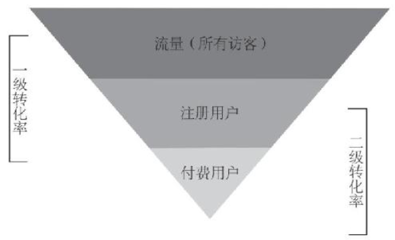
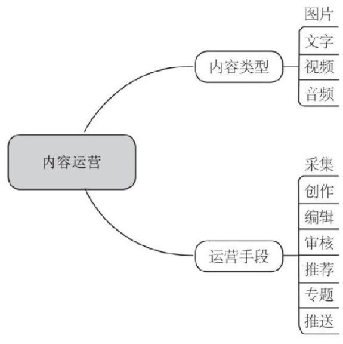
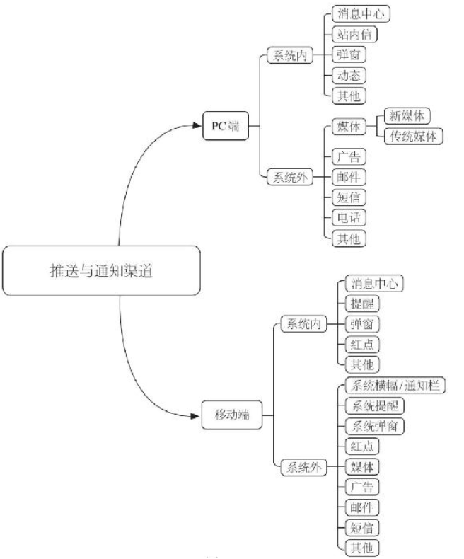

# 《从零开始做运营》文摘

> **前言：**
>
> 我加入工作室的时候职位是策划，在大三转成运营。但说是运营，其实在工作室中和打杂并无太大区别，尤其我还一直想转研发，所以混乱到自己也不知道要干什么。偶然在“打杂”的时候翻到这本《从零开始做运营》，这就是我和这本书的开始。因为是文科类性质的书（至少目前我是这么认为），所以暂且记录下书中我比较认同、感受的观点。也许写到总结时，会有不一样的发现。

## 互联网的世界，从来没有不需要运营的产品，也没有可以无视产品的运营。

## 第一章 实话实说运营

- 产品经理的工作大部分是需求分析、文档写作以及资源沟通。一个好的产品经理，需要有“跟到底”的精神。

- 一个产品的成功，“三分靠实力，七分靠运气”。产品经理的苦衷在于，做了所有正确的事，实现了所有需求并且完成得非常漂亮，可是如果运气不好，产品就无法形成规模效应。

- 运营人员的成功靠什么呢？可能是“七分靠实力，三分靠运气”。运营人员的苦衷在于，运营需要积累，无论是实力的积累、经验的积累，还是对用户了解程度的积累、对数据敏感程度的积累，这其中的时间、实践、反思、错误，全都是消耗品。创意会随着时间的增⻓而消磨，手段会随着用户的熟悉而失效，最后能够留下来的，是运营人员⻓期磨炼出来的敏锐，是对用户熟知的引导手段的集结。

- 作为一个运营人员，你需要掌握每天流量、数据的变化，洞悉任何一个可能影响运营数据的因素，掌握所有可以提升运营数据的手

  段。

- 产品的需求从用户中产生，在漫⻓的开发、测试、上线之后，产品经理的任务却并没有结束，产品经理还需要通过各种数据和渠道的反馈来了解这个上线的功能或者设计对用户到底有没有用处，用户究竟有没有去使用；如果用户使用了，那么如何让这个功能或者设计变得更好用、更值得用；如果用户没有使用，那么为什么他们不用，需求对应的功能或者设计是否有问题，还是缺乏功能的引导和说明。
- 一个运营指标是为何提出的，运营做的一堆工作究竟对指标有没有帮助，是否还可以持续地提升效果，是否需要将运营手段固化为产品模块，这就是“跟到底”。
- 我们始终应该明白如下两个准则：
  - 第一，永远不要奢望可以对一无是处的产品进行运营，更别幻想通过运营让这样的产品起死回生甚至走向成功。
  - 第二，永远不要以为产品的设计完美到无需运营，即便是能够实现自运营的产品，也依然需要持续的运营引导才能达到自运营的状态。
- 在任何一家公司、任何一个岗位，可能都需要坚持两三年，才能明白公司的具体情况、岗位的细节。但是现在，对很多人来说，不要提在一个岗位修炼两三年，让他们在一个公司工作两三年都是奢望。过热的环境、过多的机会让很多人跟着薪资走，哪里薪资高去哪里，哪个行业看起来有机会吸引更多的投资，哪个公司看起来更有机会上市，就往哪里去。很多人面临过多的机会，已经有了选择困难症，但殊不知这样频繁的选择不是你真正需要的，你需要的是让自己变得有责任心和有价值。
- 曾经有人说过，“产品经理是通往CEO（首席执行官）的训练营”。如果这句话是对的，那么运营就是通往COO（首席运营官）或者CMO（市场总监）的训练营。

- 运营入门大多先从非常基础甚至看似毫无价值的事情开始，其中一些工作甚至可以称之为体力活，很多人并不喜欢这样的工作：
  - 内容运营要做一些内容准备，具体工作很可能是非常基础的上传图片、编辑文本的工作，繁重而且很乏味。
  - 活动运营要做活动的前期调研。
  - 产品运营要做产品的前期调研，找各种人要各种数据和表格，打各种电话去研究用户的反馈信息，你会觉得自己像个客服，唠唠叨叨但是无从下手。

------

## 第二章 运营是个筐

- 运营是个筐，什么都能往里装。
- 曾经听人说过：“（互联网）产品是一项贯穿用户整个生命周期的设计行为。它根据用户的需求而变化，最终完成对用户需求的实现与用户体验的完善。”同样的道理，（互联网）运营贯穿了互联网产品整个生命周期，它根据产品的变化而调整，为了实现不同阶段的目标而有所改变，不断适应提高。
- 一切能够进行产品推广、促进用户使用、提高用户认知的手段都是运营。根据产品类型的不同，运营的方式也不尽相同，但运营的核心目的只有一个：让产品活得更好、更久。
  - “活得更好”，是通过推广、教育、活动等一系列手段让产品的各项数据获得提升；
  - “活得更久”，是通过数据分析和用户行为研究让产品的功能不断完善、易用性不断提升，从而获得更⻓的产品生命周期。
- 产品的生命周期：
  - 具体来说，一个产品，进行产品设计的过程是孕育期；达到上线状态，与用户⻅面，这是初创期；获取用户、持续运营，这是成⻓期；用户稳定，收入持续，这是成熟期；用户衰减、收入减少，这是衰退期；最后完成历史使命，产品终结，这是消亡期。
  - 孕育期，运营人员应当介入产品设计，预留好运营接口、做好对应的运营准备；初创期，运营人员应该通过各种手段获取初始用户、培养种子用户；成⻓期，运营人员应该借助各种资源进行市场推广、开展各项活动，加速用户与收入的增⻓速度；成熟期，运营人员应当通过各种运营手段，保持用户稳定，保障收入稳定；衰退期，运营人员应当更多地关怀用户，并试图将已有用户导入新的产品；消亡期，运营人员则应当做好后续工作，对用户有个交代。

- 运营的核心任务归结起来为两点：
  - 流量建设：通过各种推广、扩散、营销、活动，提升网站的流量指标，我们通常所说的PV（Page View的英文缩写，意为⻚面浏览量，是评价网站流量最常用的指标之一。）、UV（Unique Visitor的简写，是指不同的、通过互联网访问、浏览这个网⻚的自然人。）、转化率（Take Rates（Conversions Rates），转化率=进行了相应的动作的访问量/总访问量，用以衡量网站内容对访问者的吸引程度以及网站的宣传效果。）、SEO（Search Engine Optimization的英文缩写，意为“搜索引擎优化”。SEO是指从自然搜索结果获得网站流量的技术和过程。）都在这个环节。
  - 用户维系：如何持续有效地推动用户的活跃与留存，并从中发现有价值甚至高价值的用户，这些用户会持续地为网站（产品）带来价值、产生收益，让网站（产品）可以存活下去，并且活得有质量。
    - 经过多年的发展，“用户”的定义已经发展成“User”（使用者）与“Member”（会员）两种基础定义。

- 运营是一种手段，简单地划分通常分为三类：
  - 内容运营
    - 网站（产品）中可供用户消费并且延⻓用户停留时间、促进用户转化的展示均可称之为“内容”。内容可能是文字、图片，也可能是音、视频，或者动作。那么，是不是所有的网站（产品）都有内容？我们可以对照下面的问题来找到答案。
    - 内容运营是指通过创造、编辑、组织、呈现网站或产品的内容，从而提高互联网产品的内容价值，制造出对用户的黏着、活跃产生一定的促进作用的内容。
    - 
    - 内容运营至少包括五个部分：
      - 创作内容(采集或者原创，包括各种内容类型）
      - 编辑审核
      - 推荐和专题制作
      - 找到需要这些内容的人，并且想办法呈现给他们
      - 根据数据和用户反馈，进行内容调整与优化
    - 内容运营的核心：
      - 持续制作、编辑及推荐对用户有价值的内容，保证用户可以在产品中获取这些信息
      - 根据KPI的设计，降低或者提高用户获取内容的成本
      - 协助网站（产品）获利
    - 内容运营非常倚重文案能力，它对任职人员的思维灵活度、创意水平、逻辑能力都有要求。你既需要想出有趣的新鲜的点子来规划和展示你的内容，又不能过分浮夸以至于用户不知所云为何物。同时，内容运营人员也需要了解用户互动的逻辑，找出有效的方法和手段，刺激用户间产生正向互动，从而获得更多的优质内容。
  - 用户运营
    - 什么是用户？所有使用网站及产品的自然人，都是用户。
    - 用户运营是指：以网站（产品）的用户的活跃、留存、付费为目标，依据用户的需求，制定运营方案甚至是运营机制。目前，用户运营已经发展到针对不同类型的用户采取有针对性的运营策略的阶段。
    - 不同的网站（产品），用户运营的方式和方法有很大差异，取决于网站（产品）有多依赖用户，内部如何定义用户。将用户定义为User和定义为Member，会带来完全不同的运营策略和运营手段，甚至产生不同的运营工具和运营指标。
      - User指的是使用者，不管是否注册，是否登录，能够使用产品的都是User。
      - Member则比使用者要更进一层，可能是完成了注册并登录使用产品的User，也可能是付费使用高级功能的User。总之，Member的定义更精准，需要做的事情也更多。
    - 用户运营首先要做的事情，就是掌握用户结构。另一件事情，就是了解用户的规模以及增⻓或衰退情况，并进行适当的用户分级，了解新用户有多少、老用户有多少、每日增⻓规模有多少、用户都处于怎样的生命周期。
    - 用户运营的核心：
      - 开源（拉动新用户）
      - 节流（防止用户流失与流失用户挽回）
      - 维持（已有用户的留存）
      - 刺激（促进用户活跃甚至向付费用户转化）
  - 活动运营
    - 活动运营是通过开展独立活动、联合活动，拉动某一个或多个指标的短期提升的运营工作。
    - 活动运营可以短期拉动运营指标，也可以为产品探路，很多产品的功能可以从活动中总结和提炼出来。
    - 活动运营人员的日常工作是策划活动。它具体包含如下内容：
      - 活动文案撰写：文案用户看得懂，活动可以吸引你的用户。
      - 活动流程设计：活动流程是自然的、妥帖的、用户乐于去执行的。
      - 活动规则制定：规则如何设计能让用户最快明白，几步操作是用户的极限。
      - 活动成本预估：一个活动必然有需要付出的成本，成本高了运营的压力太大，成本低了用户不愿意参与，活动设计得再漂亮也是白搭。
      - 活动预期收益：你的活动是为了拉动哪个或哪些指标，将为网站（产品）带来怎样的收益，收益不仅仅是收入，还有用户活跃度、留存率，减少流失等指标，这些内容是设计活动的目标。
      - 活动效果统计：明确地让自己和领导知道：活动效果好不好；如果不好，如何改进，能不能在活动中通过调整文案、入口来改善活动的效果。
      - 活动改进措施：预备一些可能会在活动中启用的措施，促进活动效果的提升。
- 运营虽然看起来包罗万象，但并不意味着运营是起死回生、包治百病的灵丹妙药，甚至有的时候，运营的作用十分微弱。
- 运营是一个吃力但未必讨好的活儿，运营的结果好不好，并不仅仅取决于运营人员的个人能力和运营团队的能力，还有一些无法回避的关键要素，比如产品的特色、用户的习惯。
- 运营入门的几个要素：
  - 心态
    - 以运营人员的身份进入互联网行业，请先端正心态，明确几个前提
      - 运营不是万能的。
      - 没有运营是万万不能的。
      - 运营和产品是无法割裂的。
      - 运营和很多其他岗位都是亲密无间的好伙伴。
      - 最高级的运营是自运营。
    - 简单的道理
      - 甜一点没有坏处，不管你是否做运营。
      - 运营思路需要天⻢行空，但是并不代表无迹可寻。
      - 运营手段需要创造性，但并不代表不可复用。
      - 生活中的很多细节都可以对运营有所启发。
  - 技能
    - 自上而下地反思一下你目前有以下哪些技能
      - 对数据的敏感度。
      - 想象力与创造力。
      - 口头表达能力、文字表达能力。
      - 沟通能力。
      - 执行力。
  - 思维模式
    - 发散性思维：从一个点出发，进行思维的扩展，最终产生多个方案，而不是唯一方案，这就是运营的发散性思维。
    - 逆向思维：这是一种逆转因果的思维方式，从原因可以推知结果，反过来从结果可以反推原因。
    - 结构化思维：这是一种系统级别的思维方式，它通常不采用“头痛医头、脚痛医脚”的case by case（具体问题具体分析）解决方案，而是先汇总然后让系统来解决类似的所有问题。
    - 还需要清楚：
      - 进入职场之后，任何职位（除非对口专业）对专业契合度的要求都没有那么高。
      - 很多时候，会拖我们后腿的，不是所谓的专业是否对口，而是我们的思维方式是否对路。
      - 跟不上运营节奏的时候，放弃思考，多听多问，然后多想多做。

------

## 第三章 揭开内容运营的面纱

- 内容运营涉及的事情很多，并且非常细节化，它至少包含了以下内容：
  - 内容的采集与创造。
  - 内容的呈现与管理。
  - 内容的扩散与传导。
  - 内容的效果与评估。

- 在内容运营的初期，我们对运营工作的排序应当是：
  - 内容消费者定位（网站定位+受众定位+运营目标）。
  - 内容来源确认（采集或者寻找内容生产者）。
  - 内容标准的确立（有哪些内容、如何展现内容、评判内容质量的标准）。

- 内容运营发展到今天，已经不再是简单的内容制造与发送了，内容运营的标准，早已被大大提高了。将你的内容视为你的商品，从初始阶段就定义这个商品的销售对象、选品和展示方式，进而确保上线后的后台内容流转与前台展示效果。

#### 内容初始化——构建网站与产品的价值观

内容初始化就是在已构建好的内容框架下，在用户进入之前填充一些内容，这些内容是内容运营初期网站或（产品）的核心部分，代表着网站（产品）的价值观。

- 依赖项：
  - 第一，确立好内容供应链的架构，即通过系统去解决内容从哪里来、到哪里去的流程问题。
    - 不管什么样的内容规范，最先解决的其实都不是内容的甄别问题，而是什么样的内容允许被创建。也可以认为，确立了创建内容的标准之后，网站就已经可以初步对垃圾内容的产生进行约束。创建内容标准的确立对甄别内容质量的帮助，是初步减少不良内容出现的概率，及规避对不良内容的清洗带来的用户投诉和用户意⻅的反弹。
    - 即便是有了系统和规则的约束，内容质量的甄别也依然会有部分内容依赖人工，而且内容质量的甄别，本身就是所有有内容的网站和产品始终都在寻找解决方案的重要事项。
  - 第二，确立好内容面对的初始用户群（关于初始用户或者称为“种子用户”，我们会在后面具体讨论）。
    - 通过各种方式将好的内容呈现给用户。呈现的方法，无非是用户主动发现，以及运营人员对用户主动推送与引导两种方式。
    - 
  - 第三，明确第一阶段用内容解决的问题，并进行内容准备。
  - 第四，关键路径的梳理与初始内容的准备。
- 一个网站（产品）进入正式运营阶段，就需要建立一些标准，具体包括：
  - 内容质量的甄别。
  - 好内容的露出与呈现方式。
  - 持续的推送与推荐机制的建立。
  - 实现“自运营”的路径与机制选择。