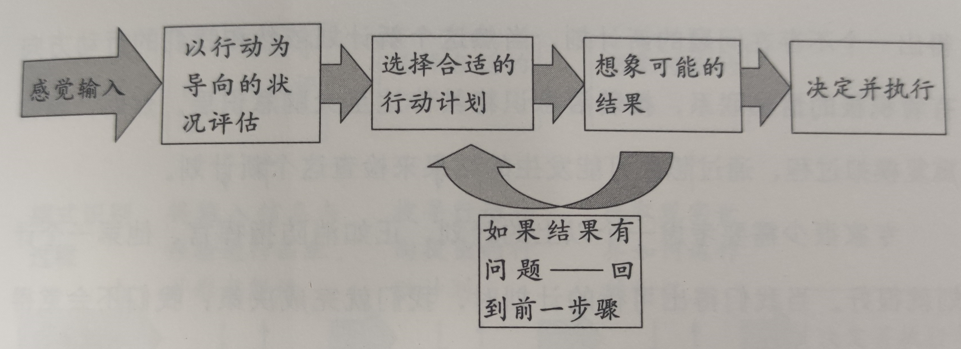
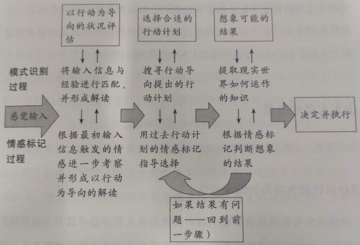

# 《避开错误决策的4个陷阱》

## 第一部分 大脑是如何做决策的

#### 大脑处理决策的功能

###### 模式识别

模式识别帮助我们对接收的信息进行评估，大脑的每个部位关注一种不同的信息并从过去的记忆信息中寻找匹配项。之后大脑的整合功能会接受已经发现的匹配项信号，并对缺失的信息做出估计。

- 意外
  - 假如我们面对的是不熟悉得信息输入——尤其是那些表面上看起来似曾相识的信息——我们会以为自己辨认出了什么，而事实并非如此，这叫做误导性经验。我们的大脑可能储藏了过去经验的记忆，而那些记忆又与我们接收到的信息相关联，不幸的是，过去的经验可能和当前的情况不一样，对我们造成了误导。
  - 我们的思维在我们接受信息之前就早有判断或是决定先入为主，而之前的判断和决定与当前的情况联系起来。如果这些判断不适用于当前情况，它们就会破坏我们既有的识别功能，误判接收到的信息，这是误导性预判。
- 模式识别依赖于信息对称以及空缺填补，当我们经验丰富时这两个过程可以有效运作，但当我们自以为经验丰富而事实上并非如此时，错误在所难免。

###### 情感标记

大脑会给我们的想法和决策打赏情感标记，这些标记被模式识别匹配项触发后会告诉我们应该对其表示关注还是忽略，并且给我们指明行动方向。

情感标记让我们迅速行动，指引我们警惕关键信息，并瞬间选择某个行动计划。

- 战略决策错综复杂，因而要做出至关重要的判断。对这些判断来说，推理和事实通常不足以证明是非对错，还需要本能、第六感和直觉的帮忙，而所有的这些都依赖于我们的情感标记。
- 情感交织在做决策的过程中，而且是决策过程必需和重要的组成部分。情感的大多数影响是无意识的，我们只有通过直觉才能意识到它们的存在。我们可以在一定程度上控制情感的影响，比如通过更多的分析，更多对事实的考虑，或者是更清楚地认识到引导我们情感的来源。但是我们无法消除情感的影响。
- 没有情感，我们无法做出决策。此外，情感大多数时候对我们的潜意识而不是意识产生影响，好消息是在这一过程中我们的情感被设定为大多数时候帮助我们轻松并且有效的得到正确的答案。

###### 四个陷阱

误导性经验、误导性预判、不适当的个人利益和不适当的情感依附是导致错误思维的四种根源，而错误思维会导致错误决策。

###### 抵御情感的扭曲作用

- 强烈的情感经验。我们可能对过去经历的成功、失败、恐惧或喜悦有着深刻的记忆，大多数时候这些情感可以帮助我们。
- 预判及先前决策。我们会给以前做出的判断和决策打上强烈的情感标记，如果这些判断无误，那么我们的情感可以帮助我们集中注意力。但是如果这些判断具有误导性，我们的情感就会让我们紧揪着它们不放，就算其他不迷信这些判断的人已经发现了问题的所在，我们依然会沉溺其中。
- 个人利益。在做决策时我们的个人利益经常受到威胁，如果这些决策仅仅影响我们自身，我们的情感标记会告诉我们正确答案。但是当我们的个人利益和我们为其他人所负的责任发生冲突时，我们的判断就会失衡。
- 情感依附。

#### 一次一计划

###### 预警过程

- 误导性经验最有可能在情况评估阶段干扰我们的思维，不管我们对模式识别错误还是模式的情感标记给我们提供了不合适的行动导向。但是误导性经验同样会导致我们选择不适当的计划或是对结果做出错误判断。
- 误导性判断最有可能在我们评估结果时扭曲我们的想法，它们让我们忠于错误的计划。但是它们也会让我们对情况产生误判或者是执着于某一个特定的行动计划——经常是过去有效的计划。
- 不适当的个人利益和不适当的情感依附最有可能影响我们对结果的评估方式：它们可以通过给错误的计划打上积极的标签让我们执迷于它。

------

## 第二部分 决策错误的原因

#### 误导性经验

当我们的记忆包含和当前情况相似又存在重大误差的经验时，我们对当前情况的看法会被误导，对行动方案的选择也会步入歧途。

###### 两种偏差效应

- 可得性启发法
  - 我们会根据某一事件在我们记忆中轻易“可得”的次数和概率，对某一件事情的频率、可能性以及可能性的原因做出判断，我们不会评估所有的数据。一份记忆“可得”可能是因为它能激起情感、形象、容易想象、或者具象化。
  - 新近性和形象性偏差让我们更多的获取最近的形象和形象的信息而不是那些更老的、不那么形象的信息，尽管后者可能相关性更高。
  - 可回溯性偏差让我们更多地使用容易获取的信息和记忆，甚至在难以获取的信息相关度更高的情况下也是如此。
  - 假设联系偏差让我们在被问到两件事是否存在联系的时候会寻找存在联系的情况而不会去寻找不存在联系的情况，因此，我们会高估两件事之间的联系。
- 代表性启发法
  - 当我们面对一个决策时，我们倾向于寻找这一决策和自己之前所做决策的相似方面，然后，我们使用过去决策成功时用到的简化算法或是类比法。
  - 基本比率偏差让人们作决策的时候只考虑一些可获得的信息，而忽略了情况蕴含的未凸显的背景信息。
  - 回归均值偏差：如果人们被要求估计企业的未来表现，他们倾向于根据过去的表现做出预测。

#### 误导性判断

预判通过给我们的思想打上情感标记的方式而影响决策。在决策过程中，这些情感标记帮助我们理清对各种情况的多种可能性解读，提供可采取的多种可能行动路线。情感标记加快了我们的模式识别和判断过程。

- 过度自信偏差
  - 我们在处理陌生问题的时候，经常对自己所做的判断过度自信。
  - 一旦你做出了预测，你会被该预测锚定，导致该预测两头所限定的范围都过于狭窄。

###### 误导性预判类型

- 对情况的判断。这会让管理者们开始对自己棉缎的情况进行界定，界定会影响他们的决策。
- 对备选项的判断。
- 对目标或者是标准的判断。发展战略经常违背发展至关重要的预判下制定出来。
- 对我们能力的判断。我们经常对自己的能力过度自信。
- 对可能结果的判断。

###### 辨别误导性预判

- 该决策设计的主要不确定性是什么？
- 主要决策人对这些不确定性是否做出了预判？
- 预判有客观证据支持吗？如果没有，它们可能具有误导性。

#### 不适当的情感依附

个人情感依附环绕在我们周围，并且会对任何一个决策产生关键的影响，有时会给我们造成极大的损害。

###### 影响决策的情感依附

- 情感依附影响惊人的范围。从恋人到商标，情感依附能够形成十分广阔的范围，甚至是一系列十分奇怪的东西。
- 情感依附本质上可能是欢快的或险恶的。恐惧、憎恨和遗憾都能够影响到我们的决策，并且同希望、爱情以及幸福的回忆一样具有强烈的效果。
- 情感依附具有微妙的力量。

###### 情感依附的来源

- 同决策者一起工作的人们。
- 同决策者没有工作附属关系的人们。
- 商业元素。决策者对不同的业务单位、工厂、工地、功能发展出依附关系。
- 标志性的东西。
- 地点。决策者曾经工作过的地方、在关键时期所停留的地方，或者某一特殊经历发生的地方，能够导致明显且强有力的情感依附。

###### 尝试剔除不适当的情感依附

- 决策者是不是对哪些选项如：人、地点或者东西存在情感依附或者地对情感吗？
- 是不是有哪些情感依附可能对主要利益主体的相关利益产生冲突呢？
- 是否存在哪些具有冲突性的情感依附，能够强烈到显著的扭曲决策者的决策吗？

------

## 第三部分 红旗预警及防御策略

防御措施涉及的范围广泛，包括干预措施、过程变化、人们的选择、分析技巧以及其他机制。这些方法可以用来减少做出错误决策的风险。然而每个组织都拥有多种用于管理决策的过程，我们将防御措施定义为额外的措施，选择它们是因为它们对某一特定的决策而言是适当的。我们使用这一定义是因为它们能够为抵制错误决策提供安全保障，尽管使用它们也不能保证不犯任何错误。我们不能够消除人们的偏见，但是我们可以抵消它们所能产生的潜在影响。

#### 防御措施

- 经验、数据和分析
  - 要为决策者提供新的体验，或新的数据及分析。这么做可以从源头上降低做错决策的风险。
  - 在商业中，有很多用于收集数据、扩展经验的方式。与关键客户之间的探讨，能够对新产品提供许多有价值的反馈。市场调查能够评估进入新市场的风险。还可以引进顾问，一部分是因为他们的专业技能和现成的人力，再者还因为他们相对而言比较客观。
- 团队辩论和挑战
  - 进行一场挑战偏见的辩论，并不需要设计很复杂的过程。可能就是指针对某一问题。即使对方并不是这一问题的专家，辩论的过程也可以帮助你揭示一些假设和信念。在大型的组织中，精心策划辩论和挑战的典型方式就是组建决策团队。团队规模各不相同，可能从两个人到许多人不等。虽然从通常来讲，参加辩论的人较少才是更佳的做法。
  - 选择让谁加入团队是至关重要的，这决定着挑战的质量。
  - 对根深蒂固的观点进行挑战是防御措施的关键来源。强有力的领导需要强有力的挑战。
- 管理
  - 管咯团队是很重要的支撑，用于否决任何决策团队已通过的错误决策。少数大型组织允许由决策提案人审批重要的决策。通常是由独立的非执行董事或者由受托人进行，以此来增加决策过程的客观性。
- 监控
  - 监控过程追踪着决策过程，能够鼓励决策者在提出建议前进行细致的思考。如果决策者知道结果将被记录和宣传，那么这就足够促使他们“三思”了。
  - 监控对于快速修正错误决策也有帮助，例如，如果早期表现令人失望的话，后期的投入可能会减少。
  - 额外监控是最终的防弹墙：用于抵抗做出糟糕决策的最后一道防御措施。在没有其他可以替代的措施用来提供保护时，额外监控特别有用。

###### 红旗警示条件

- 误导性经历
- 误导性预判
- 不适当的个人利益
- 不适当的感情依附

#### 四个建议

- 保持简单——然后进行迭代
  - 首先保持简单，然后在第一个回答的基础上进行迭代。如果开始使用的是一种看似合理的方法，可以稍后在这种方法上进行重构。在一些真实复杂的情景下，修改你对因素的分析。关键是你要从某个地方开始，然后再以此为基础。
  - 遵循“保持简单”的原则，先做出一个初始的分析，然后去和其他人讨论。事实上，“一次一计划”决策过程的影响是这样的。
- 从最担心的红旗警示开始
  - 一旦选定了一条红旗警示，那么就要考虑一下哪些防御措施最适合用来处理这一红旗警示。然后再回过头去挑选另一条令你担忧的红旗警示。试问一下你自己，你选择的防御措施是否能够提供充分的保护。
- 如果有疑问，按顺序考虑防御措施
  - 首先对新经验和新数据进行考虑。考虑一下怎么样才能利用辩论和挑战来帮助决策者调整她或他的思路，而下一个需要寻求防御措施的领域时管理过程。如果你仍然担心所做的决策是错误的，考虑一下加强监控过程的方式，那样可以鉴定出错误决策的结果，并且尽早有效率的处理。
- 衡量每个防御措施的好处，抵制其副作用。

------

