# 大数据存储技术（《深入分布式缓存：从原理到实践》）

> **前言：**
>
> 这份文档不仅来自个人根据老师给的提纲参考书籍手敲完成，还参考了上届学姐的复习资料，同时融合了老师的PPT和网络上一些我认为比较好的博客。如果在大题后面打了【*】，就说明这是上届学长学姐没有考过的习题，老师不会平白无故往里面加重点吧。。。所以个人认为考到的概率较大。
>
> 并且，这份文档的内容会超出复习范围不少，因为是一边学一边写的，所以把我认为有助于大家理解的部分都敲进去了，如果只是为了背书的话，那大概率看每个题目下的最后一个小问差不多了，前面的大部分都是为了进行铺垫。
>
> 同样的，如果以后的学弟学妹画完重点后发现又多了许多新玩意，欢迎大家在Issues上Q我，最好是直接push进来，让文档成为一个可升级迭代的Project。

#### 一、CAP理论

###### 分布式系统的三个特性

- 一致性【Consistency】：在分布式系统中的所有数据备份，在**同一时刻**是否有同样的值。（等同于所有节点访问同一份最新的数据副本）
- 可用性【Availability】：在集群中一部分**节点故障**后，集群整体是否还能响应客户端的读写请求。（对数据更新具备高可用性）
- 分区容忍性【Partition tolerance】：以实际效果而言，分区相当于对通信的**时限要求**。系统如果不能在一定时间内达成数据一致性，就意味着发生了分区的情况，必须就当前操作在C和A之间做出选择。

高可用、数据一致是很多系统设计的目标，但是分区又是不可避免地事情，由此引出了以下几种选择：

###### （1）CA without P

如果不要求P（不允许分区），则C（强一致性）和A（可用性）是可以保证的。但其实分区不是你想不想的问题，而是始终会存在，因此**CA的系统更多的是允许分区后各子系统依然保持CA**。

典型放弃分区容忍性的例子有**关系型数据库、LDAP**等。

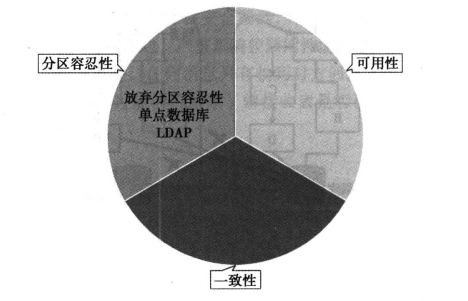

###### （2）CP without A

如果不要求A（可用性），相当于**每个请求都需要在Server 之间强一致，而P（分区）会导致同步时间无限延长**，如此CP也是可以保证的。很多**传统的数据库**分布式事务都属于这种模式，分布式锁也属于此种情况。

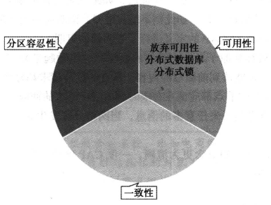

###### （3）AP without C

要高可用并允许分区，则需放弃一致性。一旦分区发生，节点之间可能会失去联系，为了高可用，每个节点只能用本地数据提供服务，而这样会导致全局数据的不一致性。现在众多的NoSQL都属于此类。

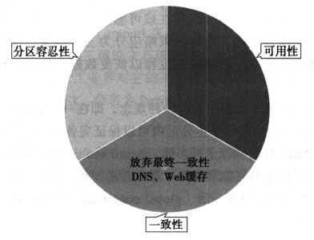

该理论由brewer提出，2002年Lynch与其他人证明了Brewer猜想，从而把CAP上升为一个Lynch定理。

Lynch的证明采用**反证法**，如果三者可同时满足，则因为允许P的存在，一定存在Server之间的丢包，如此则不能保证C。在该证明中，Lynch对CAP定义进行了更加明确的声明。

###### 更加明确的CAP声明（圣经）

- C：一致性被称为**原子对象**，任何的读写都应该看起来是“原子”的，或串行的。
- A：对任何非失败节点都应该在有限的时间内给出请求的回应。（请求的可终止性）
- P：允许节点之间丢失任意多的消息，当网络分区发生时，节点之间的消息可能会完全丢失。

**（没有一个软件系统同时满足CAP。这里的C指的是强一致性。针对分布式系统而言，一定满足P，即存在网络分区【网络延时】）**

------

#### 二、Raft算法

Raft提供了和Paxos算法相同的功能和性能，但是它的算法结构和Paxos不同。Raft算法更加容易理解并且更容易构建实际的系统。为了提升可理解性，Raft将一致性算法分解成了几个关键模块，例如**领导人选举**【Leader Election】、**日志复制**【Log Replication】和**安全性**【Safety】**（三个子问题）**。同时它通过实施一个更强的一致性来减少需要考虑的状态的数量。Raft算法还包括一个新的机制来允许集群成员的动态改变，它利用重叠的大多数来保证安全性。

Paxos和Raft都是为了实现**一致性**目标，两者的区别在于**选举的具体过程不同**。

###### Raft选举过程

在Raft中，任何一个服务器可以扮演下面角色之一：

- 领导者【Leader】：处理所有客户端交互、日志复制等动作，一般一次只有一个领导者。
- 选民【Follower】：类似选民，完全被动的角色，这样的服务器等待被通知投票。
- 候选人【Candidate】：候选人就是在选举过程中提名自己的实体，一旦选举成功，则成为领导者。

Raft算法分为两个阶段，首先是选举过程，然后在选举出来的领导人带领进行正常操作，比如日志复制等。

（1）任何一个服务器都可以成为一个候选者，它向其他服务器（选民）发出要求选举自己的请求。

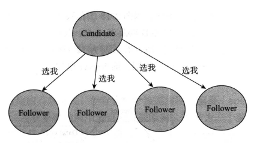

（2）其他服务器同意了，回复OK（同意）指令。

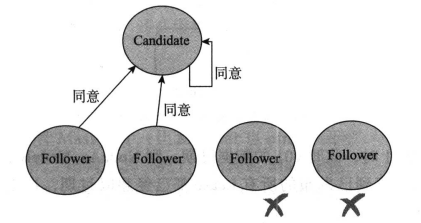

（3）这样，这个候选者就成为领导者，它可以向选民们发出要执行具体操作动作的指令，比如日志复制。

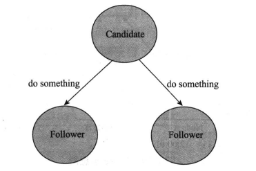

（4）如果一旦这个Leader宕机崩溃了，那么Follower中会有一个成为候选者，发出邀票选举，相当于再次执行（1）~（2）的步骤。

**总结：（1）~（2）是选举过程，（3）是具体协同执行操作的过程。**

------

#### 三、Nginx负载均衡策略

###### 负载均衡

负载均衡集群：其关键在于使用多台集群服务器共同分担计算任务，把网络请求及计算分配到集群可用服务器上去，从而达到可用性及较好的用户操作体验。

不同用户访问应用，通过负载均衡器分配到不同的节点。

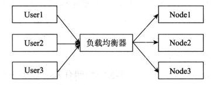

负载均衡器有硬件解决方案和软件解决方案。硬件解决方案：F5；软件解决方案：LVS、HAProxy、Nginx等。

###### Nginx下的负载均衡策略

- **轮询**：即Round Robin，根据Nginx配置文件中的顺序，一次把客户端的Web请求分发到不同的后端服务器。（**每个请求**会按**时间**顺序**逐一**分配到**不同**的后台服务器上。轮询策略适合服务器配置相当，无状态且短平快的服务使用**【依序逐一分发】**）
- **最少连接**：当前谁连接最少，分发给谁。（请求转发给**连接数最少**的后端服务器。前面的轮询策略是把请求**平均**地转发给集群中的每个后台服务器，使得它们的负载大致相同，但是有些请求可能占用的时间会很长，可能导致所在的后端负载过高。这种情况下**选用least conn策略就能达到更好的负载均衡效果。适合在请求处理时间长短不一造成服务器过载的场景。【谁少分给谁】**）
- **IP地址哈希**：确定**相同IP请求**可以转发给**同一个后端节点**处理，以方便session保持。（按照客户端的IP去分配服务器，使同一个客户端的请求都转发到同一个后台服务器，保证了Session的统一性，**可以用来解决Session的跨域问题。【相同IP可转发】**）
- **基于权重的负载均衡**：配置Nginx把请求更多地分发到高配置的后端服务器上，把相对较少的请求分发到低配服务器。（在轮询策略的基础上，另外**指定**了**轮询的几率**。权重策略可以与least conn和ip hash结合使用。权重策略比较**适合服务器的硬件配置差别较大的情况【多请求高配置】**）

------

#### 四、一致性Hash算法

一致性哈希算法是在1997年由麻省理工学院提出的一种**分布式哈希(DHT)实现算法**。主要解决**单调性( Monotonicity)和分散性（Spread）**的问题。单调性简单描述是哈希的结果应能够保证原有已分配的内容可以被映射到原有缓冲中去，避免在节点增减过程中导致不能命中。

按照常用的hash算法来将对应的key哈希到一个具有2^32 次方个桶的空间中，即0~( 2^32) -1的数字空间中。现在我们可以将这些数字头尾相连，想象成一个闭合的环形。

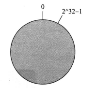

在一致性哈希算法中，如果一台服务器不可用，则受影响的数据仅仅是此服务器到其环空间中前一台服务器（即沿着逆时针方向行走遇到的第一台服务器）之间数据，其他不会受到影响。

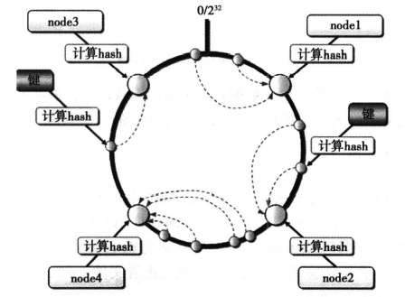

一致性哈希的**优点**在于<u>可以任意动态添加、删除节点，每次添加、删除一个节点仅影响一致性哈希环上相邻的节点</u>。为了尽可能均匀地分布节点和数据，一种常见的改进算法是引入虚节点的概念，系统会创建许多**虚拟节点**，个数远大于当前节点的个数，均匀分布到一致性哈希值域环上。这种增强型方案主要解决平衡性问题，所谓平衡性（Balance）是指哈希的结果能够尽可能分布到所有的缓冲中去，这样可以使得所有的缓冲空间都得到利用。

###### 具体实现流程

一致性Hash算法将整个哈希值空间组织成一个虚拟的圆环。如假设某哈希函数H的值空间为0-2\^32-1（即哈希值是一个32位无符号整型），整个哈希环如下图。（整个空间按顺时针方向组织，圆环的正上方的点代表0，0点右侧的第一个点代表1，以此类推，2、3、4、5、6……直到2\^32-1。也就是说0点左侧的第一个点代表2\^32-1，0和2\^32-1在零点中方向重合，我们把这个由2^32-1个点组成的圆环称为Hash环）

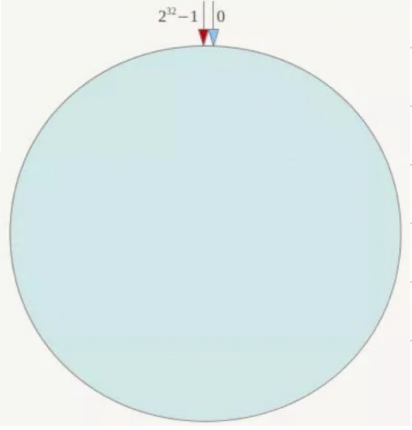

- 服务器Hash到Hash环

Node A，B，C，D四台机器，利用其IP地址进行hash**取模**。

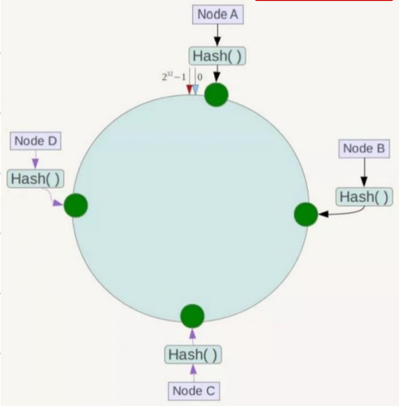

- 数据Key到Hash环

将数据key使用相同的函数Hash计算出哈希值，并确定此数据在环上的位置，从此位置沿环顺时针 “行走”，第⼀台遇到的服务器就是其应该定位到的服务器。

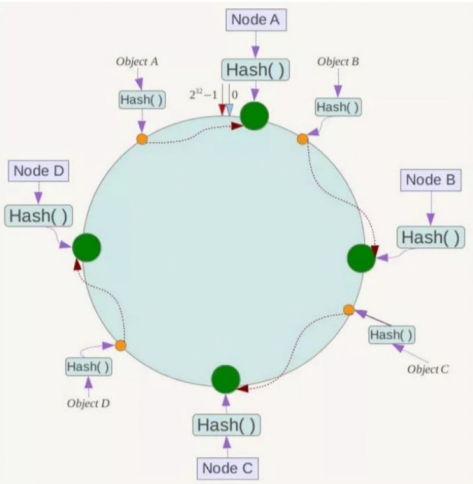

###### 一致性Hash算法的容错性和可扩展性

- Node C宕机

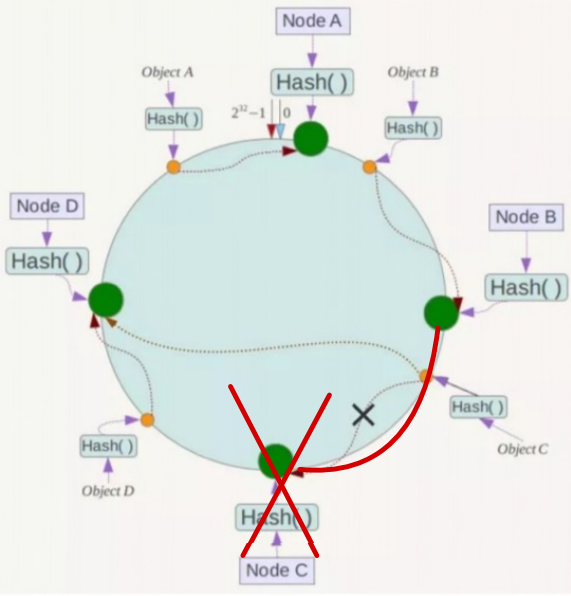

- 增加一台机器Node X

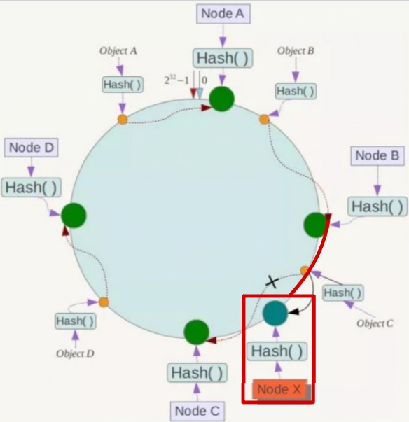

因此，一致性Hash算法对于节点的增减都只需重定位环空间中的一小部分数据，具有较好的容错性和可扩展性。

###### Hash环的数据倾斜问题

一致性Hash算法在服务节点太少时，容易因为**节点分布不均匀而造成数据倾斜**（被缓存的对象大部分集中缓存在某一台服务器上）问题，例如系统中只有两台服务器。

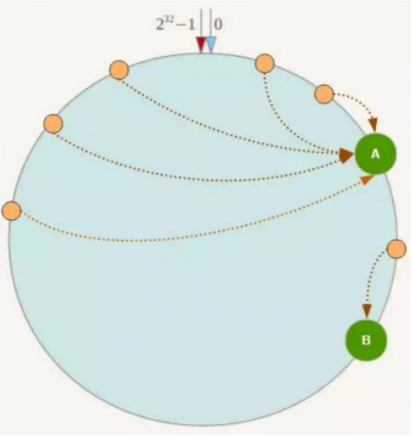

具体做法可以在服务器IP或主机名的后面增加编号来实现。

为每台服务器计算三个**虚拟节点**，于是可以分别计算“Node A#1”、“Node A#2”、“Node A#3”、“Node B#1”、“Node B#2”、“Node B#3”的哈希值，于是形成六个虚拟节点。

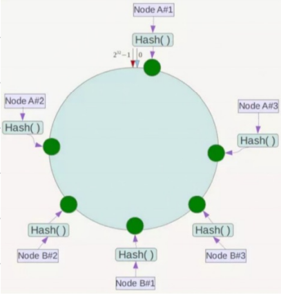

这样就解决了服务节点少时数据倾斜的问题。在实际应用中，通常将虚拟节点的数设置为32甚至更大，因此即使很少的服务节点也能做到相对均匀的数据分布。

------

#### 五、全局ID生成算法 【*】

目前TDDL（Taobao Distribute Data Layer）提供的id生成主要还是**依托数据库**来进行的，Oracle可以直接使用sequence来完成id生成，MySQL则需要DBA建立一个表专门用于生成id。

在分布式环境下，数据库是可以拆分（sharding）的，一张表的自增机制（比如MySQL）只能保证该表唯一，在数据合并到历史库，迁移或者查询，如果**出现id冲突无异于噩梦**。

另外，由于数据库访问时高成本操作，也要避免每次INSERT都要到id生成器做DB层面的查询。

###### 1、UUID

UUID由以下几部分构成：

- 当前日期和时间，UUID的第一个部分与时间有关，如果你在生成一个UUID之后，过几秒又生成一个UUID，则第一个部分不同，其余相同。
- 时钟序列。
- 全局唯一的IEEE机器识别码，如果有网卡，从网卡MAC地址获得，没有网卡以其他方式获得。

**优点：**API简单、易用

**缺点：**占用空间大、字符串本身无法加工，可读性不强。

###### 2、ID生成表模式

使用id生成表，比较经典的是Flicker的案例，Flicker在解决全局ID生成方案里就采用了MySQL自增长ID的机制。先创建单独的数据库，然后创建一个表：

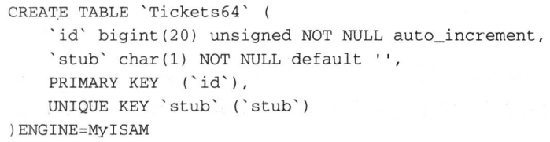

在我们的应用端需要做下面这两个操作，在一个事务会话里提交：

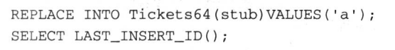

这样就能拿到不断增长且不重复的ID了。从高可用角度考虑，要解决单点故障问题，Flicker的方案是启用两台数据库服务器来生成ID，通过区分auto_increment的起始值和步长来生成奇偶数的ID。

**优点：**简单易用，也有一定的高可用方案。

**缺点：**使用了mysql数据库的独特语法REPLACE INTO。

###### 3、Snowflake

Twitter在把存储系统从MySQL迁移到Cassandra的过程中由于Cassandra没有顺序ID生成机制，于是自己开发了一套全局唯一ID生成服务：Snowflake。GitHub地址：https://github.com/twitter/snowflake。根据twitter的业务需求，snowflake系统生成64位的ID。由3部分组成:

- 41位的时间序列（精确到毫秒，41位的长度可以使用69年）；
- 10位的机器标识（10位的长度最多支持部署1024个节点）；

- 12位的计数顺序号(12位的计数顺序号支持每个节点每毫秒产生4096个ID序号)。

**优点：**高性能，低延迟；独立的应用；按时间有序。

**缺点：**需要独立的开发和部署。

###### 4、结合缓存方案

可以采取ID生成表模式成批获取id比如1000放到本地缓存（Local cache），这样在client使用的时候可进一步提升性能。

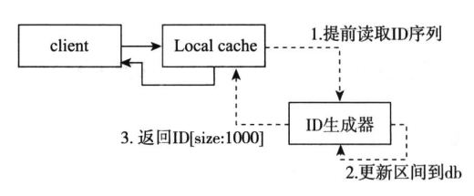

**优点：**高性能，低延迟。

**缺点：**ID不连贯。

------

#### 六、设计一个缓存框架（参考课本或者课件都可以）

参考开源缓存组件EhCache和Guava，提取它们的公共方法，可以得到最核心的，也是我们最关心的一些方法：

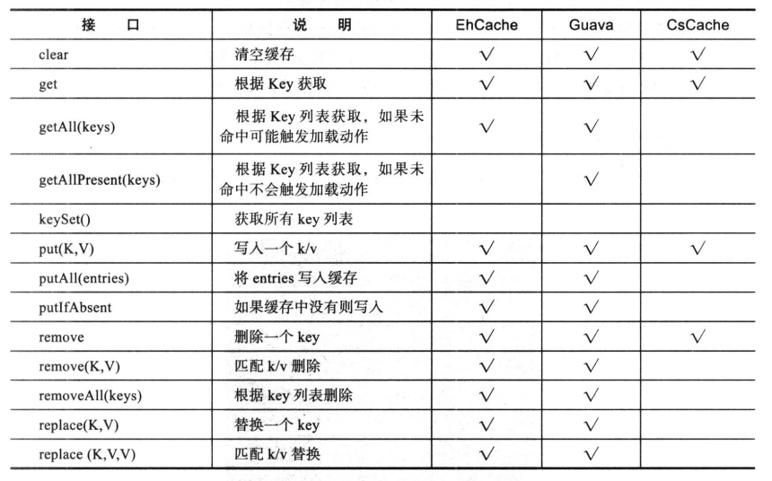

可以知道缓存框架需要基本的get（获取缓存）、put（放入缓存）、remove（根据key值删除缓存）、clear（清空缓存）方法。

###### 1、缓存架构介绍

通过JSR107规范，我们将框架定义为客户端层、缓存提供层、缓存管理层、缓存存储层。其中缓存存储层又分为基本存储层、LRU存储层和Weak存储层。

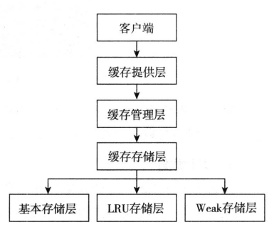

- **客户端层**：使用者直接通过该层与数据进行交互。
- **缓存提供层**：主要对缓存管理层的生命周期进行维护，负责缓存管理层的创建、保存、获取以及销毁。
- **缓存管理层**：主要对缓存客户端的生命周期进行维护，负责缓存客户端的创建、保存、获取以及销毁。
- **缓存存储层**：负责数据以什么样的形式进行存储。
- **基本存储层**：是以普通的ConcurrentHashMap为存储核心，数据不淘汰。
- **LRU存储层**：是以最近最少用为原则进行的数据存储和缓存淘汰机制。
- **Weak存储层**：是以弱引用原则的数据存储和缓存淘汰机制。

###### 2、设计思路及知识点详解

- **设计类图**

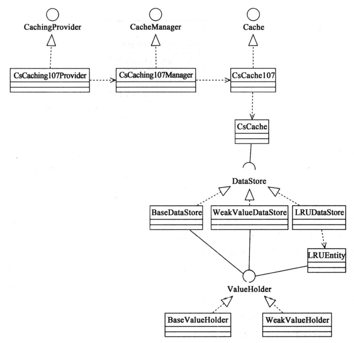

根据规范，CacheProvider、CacheManager、Cache是抽象出来的最基础的缓存接口。其中 Cache是提供最终缓存实现的基础接口，其实现类是CsCache107，初始化时即持有一个BasicDataStore对象。

- **缓存框架的SPI机制**

在工程结构中的META-INF/services/下面有一个javax.cache.spi.CachingProvider配置文件，里面有一个org.cachestudy.writeitbyself.jsr107.CsCaching107Provider实现类，这个配置文件实际上是利用的Java SPI机制进行组件的发现与加载。

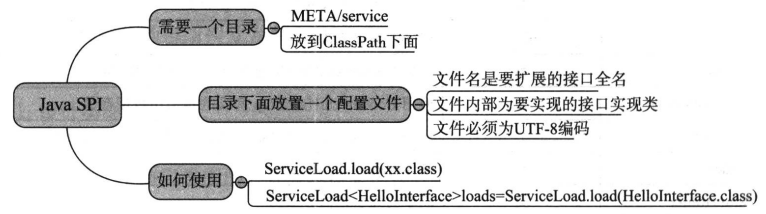

SPI的全名为**Service Provider Interface**，是JDK内置的一种**服务提供发现机制**，在Java.util.ServiceLoader的文档里有比较详细的介绍。

Java SPI机制的思想简单来说是:在面向的对象的设计里，我们一般推荐模块之间基于接口编程，模块之间不对实现类进行硬编码。一旦代码里涉及具体的实现类，就违反了可拔插的原则，如果需要替换一种实现，就需要修改代码。为了实现在模块装配的时候能不在程序里动态指明，这就需要一种服务发现机制。Java SPI就是提供了这样的一个机制，为某个接口寻找服务实现的机制。有点类似IoC的思想，就是**将装配的控制权移到程序之外**，在模块化设计中这个机制尤其重要。

- **解读缓存数据层（淘汰算法）**

缓存数据层实际承担的责任主要是缓存数据的存储和缓存的淘汰机制，数据的存储和淘汰是基于DataStore这个接口来实现的，而这一实现则是数据存储层。目前框架一共实现了三个实现类分别是:LRUDataStore、WeakDataStore和 BaseDataStore。

**（1）基于引用的淘汰算法**

基于引用的淘汰算法，是一种简单有效的算法，由JVM的GC进行回收。Java的引用主要分为强引用、软引用、弱引用、虚引用。

**强引用（StrongReference）：强引用是使用最普遍的引用。**如果一个对象具有强引用，那垃圾回收器绝不会回收它。当内存空间不足，Java 虚拟机宁愿抛出OutOfMemoryError错误，使程序异常终止，也不会靠随意回收具有强引用的对象来解决内存不足的问题。

**软引用（SoftReference）：如果一个对象只具有软引用，则内存空间足够，垃圾回收器就不会回收它；如果内存空间不足了，就会回收这些对象的内存。**只要垃圾回收器没有回收它，该对象就可以被程序使用。软引用可用来实现内存敏感的高速缓存。软引用可以和一个引用队列（ReferenceQueue）联合使用，如果软引用所引用的对象被垃圾回收器回收，Java 虚拟机就会把这个软引用加入到与之关联的引用队列中。

**弱引用（WeakReference）：弱引用与软引用的区别在于:只具有弱引用的对象拥有更短暂的生命周期。**在垃圾回收器线程扫描它所管辖的内存区域的过程中，一旦发现了只具有弱引用的对象，不管当前内存空间足够与否，都会回收它的内存。不过，由于垃圾回收器是一个优先级很低的线程，因此不一定会很快发现那些只具有弱引用的对象。弱引用可以和一个引用队列(ReferenceQueue)联合使用，如果弱引用所引用的对象被垃圾回收，Java虚拟机就会把这个弱引用加入到与之关联的引用队列中。

**虚引用（PhantomReference）：“虚引用”顾名思义，就是形同虚设，与其他几种引用都不同，虚引用并不会决定对象的生命周期。**如果一个对象仅持有虚引用，那么它就和没有任何引用一样，在任何时候都可能被垃圾回收器回收。

**（2）基于LRU的淘汰算法**

**LRU （Least recently used，最近最少使用）算法根据数据的历史访问记录来进行淘汰数据**，其核心思想是“如果数据最近被访问过，那么将来被访问的概率也更高”。

缓存框架的LRU简单实现逻辑如下：我们通过维护entry的列表，在get、put时维护entry列表实现，使最少访问的键值对维持在entry列表的最尾部。在数据量超过缓存容量需要做LRU淘汰时，我们通过删除链表尾部的数据，来实现简单的LRU数据淘汰机制。

- **解读缓存管理层（CacheManager）**

接口类CacheManager所对应的正式缓存管理层，在缓存框架中CacheManager的实现类，主要负责**管理多个Cache客户端实例，以及负责缓存客户端实例的创建、销毁、获取等**。

缓存实例的创建和获取实际上主要是基于一个缓存池来实现的，在代码中使用的是一个ConcurrentHashMap类，可以根据多个不同的缓存名称创建多个缓存实例，从而可以并发的读取。

- **解读数据客户端层**

缓存客户端层主要是针对实际使用者的，在工程结构中主要涉及两个类，其中一个使**用代理模式对缓存框架进行的包装**。用户在使用的时候，通过缓存管理层的CacheManager对象就可以获得其客户端对象，从而可以实现对缓存的直接操作。

整个过程其实较为简单，对象的构造方法中有一个DataStore对象，这个对象正是缓存数据存储与淘汰策略对象，这个机制已经在解读缓存数据层小节中进行了详解，get方法则是从 DataStore中获取缓存数据，put方法则是往DataStore对象中存入数据。

###### 简述

一定一定要去看书本**P62-P75**的缓存框架的实现，虽然上述的内容都是截取自书本内容，但是省略掉了很多容易，导致阅读障碍。看书上的实例能让你对整个流程有一个大概的认知，在看上面的就是节选出来的重点了。

也可以直接看《[手把手教你从0到1写一个简单的缓存框架](https://blog.51cto.com/u_15057858/2691862)》，这个和书本上是一样的。

------

#### 七、缓存击穿、穿透、雪崩现象及解决办法

###### 1、缓存击穿

- 缓存里**没有Key**，**数据库里有数据**。
- 某一个Key失效，通常是热点数据，导致**高并发**情况下，请求直接打到DB上，DB直接崩掉。

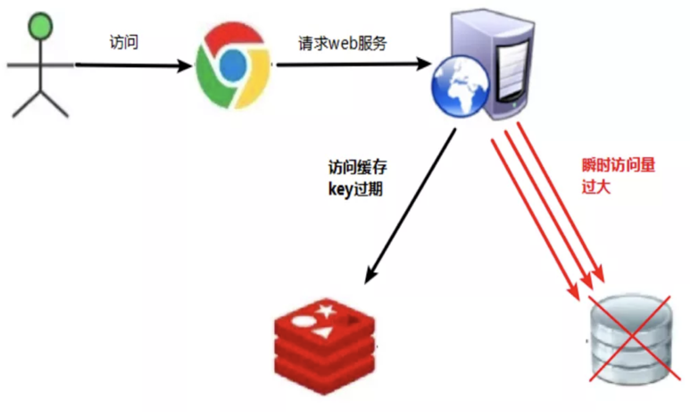

**（大量的Key同时失效就会导致缓存雪崩）**

###### 2、缓存击穿的解决办法

在**第一个查询数据**的请求上使用一个**互斥锁**来锁住它。其他的线程走到这一步拿不到锁就等着，等第一个线程查询到了数据，然后做缓存。后面的线程近来发现**已经有缓存了，就直接走缓存**。

- 引申：Redis的分布式锁和redission框架。

###### 3、缓存穿透

- 缓存里没有数据，数据库里面也没有数据。
- 大量不存在的id去查询数据，会产生**大量的请求**到数据库去查询，可能会导致DB由于压力过大而宕机。

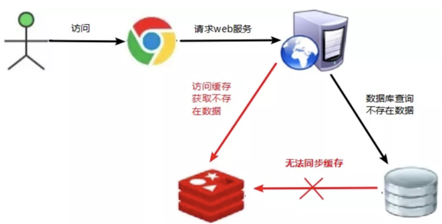

###### 4、缓存穿透的解决办法

- **对空值缓存**：如果一个查询返回的数据为空（不管数据是否存在），我们仍然把这个空结果（null）进行缓存，设置空结果的过期时间会很短，最长不超过五分钟。**（保留但及时释放）**
- **BloomFilter（布隆过滤器）**：在缓存之前再加一层BloomFilter，在查询的时候先去BloomFilter去查询Key是否存在，如果不存在就直接返回，存在再走缓存去查DB。

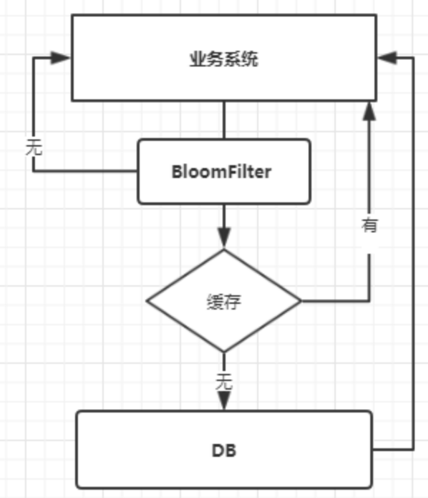

###### 5、缓存雪崩

- **Key对应的数据存在**，但在redis中**过期**，此时若有**大量并发请求**过来，这些请求发现缓存过期一般都会从DB加载数据并回设到缓存，这个时候大并发的请求可能会**瞬间把后端DB压垮**。
- 缓存雪崩与缓存击穿的区别在于这里针对很多Key缓存，后者则是某一个Key。

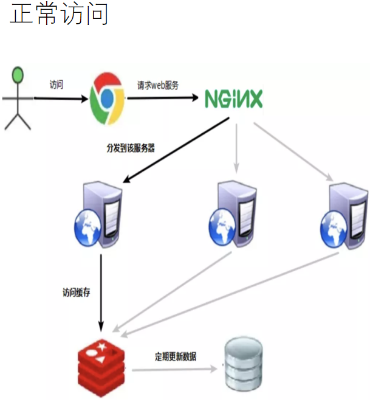

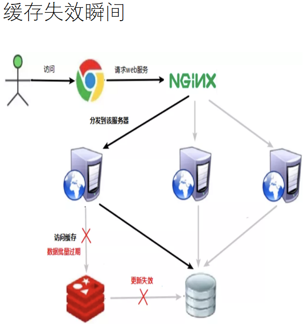

###### 6、缓存雪崩的解决办法

- **构建多级缓存架构**：Nginx缓存 + Redis缓存 + 其他缓存（Encache等）
- **将缓存失效时间分散开**：比如我们可以在原有的失效时间基础上增加一个随机值，比如1~5分钟随机，这样每一个缓存的过期时间的重复率就会降低，就很难引发集体失效的事件。
- **互斥锁**：
  - 在第一个请求去查询数据库的时候对它加一个互斥锁，其余的查询请求都会被阻塞住，直到锁被释放，从而保护数据库。
  - **降低吞吐量**，应用时要慎重。

------

#### 八、Ehcache的注解【*】

Ehcache是一个用Java实现的简单、高速、线程安全的缓存管理类库，其提供了用内存、磁盘文件存储，以及分布式存储等多种灵活的管理方案。Ehcache具有快速、简单、低消耗、依赖性小、扩展性强、支持对象或序列化缓存或元素的失效、提供LRU/LFU/FIFO缓存策略、支持内存缓存及磁盘缓存、采用分布式缓存机制等特点。

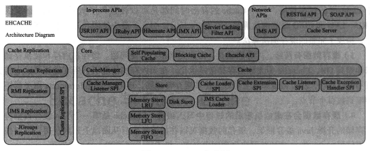

###### Ehcache主要特点

- 快速，简单。
- 多种缓存策略。
- 缓存数据有两级，
- 缓存数据会在虚拟机重启的过程中写入磁盘。
- 可以通过RMI、可插入API等方式进行分布式缓存。
- 具有缓存和缓存管理器的侦听接口。
  - 缓存管理器监听器。
  - 缓存事件监听器。
- 提供Hibernate的缓存实现。

###### Spring中Ehcache缓存注解

- 开启注解：<cache:annotation-driven cache-manager="cacheManager"/>
- 使用标记注解：通过对一个类进行注解修饰的方式在这个类中使用缓存注解。

部分注解用法：

- **@Cacheable**  表明所修饰的方法是可以缓存的：当第一次调用这个方法时，它的结果会被缓存下来，在缓存的有效时间内，以后访问这个方法都直接返回缓存结果，不再执行方法中的代码段。 

  这个注解可以用condition属性来设置条件，如果不满足条件，就不使用缓存能力，直接执行方法。 可以使用key属性来指定 key 的生成规则。

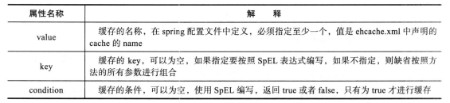

- **@CachePut**  与@Cacheable不同，@CachePut不仅会缓存方法的结果，还会执行方法的代码段。 它支持的属性和用法都与@Cacheable一致。

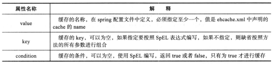

- **@CacheEvict**  与@Cacheable功能相反，@CacheEvict表明所修饰的方法是用来删除失效或无用的缓存数据。

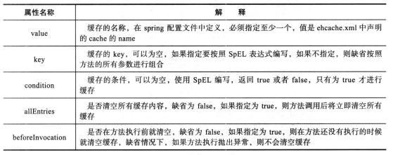

- **@Caching** 如果需要使用同一个缓存注解（@Cacheable、@CacheEvict或@CachePut）多次修饰一个方法，就需要用到@Caching。
- **@CacheConfig** 与前面的缓存注解不同，这是一个类级别的注解。 如果类的所有操作都是缓存操作，你可以使用@CacheConfig来指定类，省去一些配置。

------

#### 九、Memcached的内存管理机制【*】

Memcached是以LiveJournal旗下Danga Interactive公司的Brad Fitzpatric为首开发的一款软件。现在已成为mixi、Twitter、Facebook、Vox、LiveJournal等众多服务中提高Web应用扩展性的重要手段。随着数据量的增大、访问的集中，就会造成RDBMS的负担加重、数据库响应恶化、网站显示延迟等重大影响。**减轻数据库压力，避免大量访问穿透到数据库**是Memcached主要的用武之地。Memcached是**高性能的分布式缓存服务器**。一般使用目的是，**通过缓存数据库查询结果，减少数据库访问次数，以提高动态Web应用的速度，提高可扩展性**。

###### 1、Memcached使用场景

Memcached主要应用在减少数据库压力的场景，第一次访问，缓存数据未命中，则从数据库中获取数据并存储到Memcached中，第二次访问则直接从缓存中获取数据。

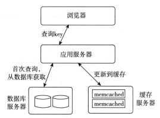

更新链路，应用服务器对key进行更新，先对DB进行更新后，再对缓存进行更新。

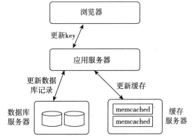

###### 2、Memcached特征

- **协议简单**：Memcached和客户端通信并不使用复杂的XML等格式，而是使用简单的基于文本协议或者二进制协议。
- **基于libevent的事件处理**：由于epoll，kqueue，/dev/poll每个接口都有自己的特点，程序移植非常困难，libevent这个程序库就应运而生了。他将Linux的epoll、BSD类操作系统的kqueue等事件处理功能封装成统一的接口。Memcached使用libevent库，因此能在Linux、BSD、Solaris等操作系统上发挥其高性能。
- **内置内存存储方式**：为了提高性能，Memcached中保存的数据都存储在Memcached内置的内存存储空间中。由于数据仅存在于内存中，因此重启Memcached或者重启操作系统会导致全部数据消失。另外，内存容量达到指定的值之后，Memcached会自动删除不使用的内存。缓存数据的回收采用的是LRU ( Least Recently Used)算法。
- **Memcached客户端分布式**：Memcached尽管是“分布式”缓存服务器，但服务器端并没有分布式功能。各个Memcached实例不会互相通信以共享信息。它的分布式主要是通过客户端实现的。

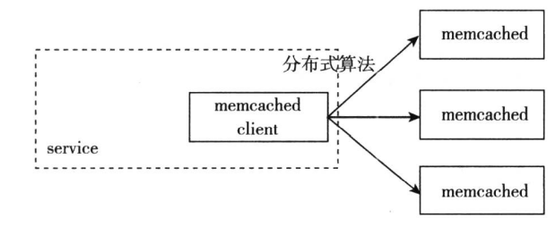

###### 3、Memcached的一些问题

- **无法备份，重启无法恢复**：重启无法恢复的问题，只能通过持久化解决。兼容Memcached的协议，持久化的解决方案有MemcacheDB，以及Tokyo Cabinet和Tokyo Tyrant配合使用。Tokyo Cabinet是一个DBM数据库，而Tokyo Tyrant是兼容Memcached协议的网络协议。
- **无法查询**：前面谈过Memcached 的存储机制，不能按各种条件的key查询，比如范围查询。
- **没有提供内置的安全机制**：当然你可以找到一些解决方案。
- **单点故障failover**：Memcached不支持任何fail-over/high-availability机制，因为它是作为cache使用的，不是原始数据源，这也是其一大特点。面对单点故障，可以通过主从模式解决问题。

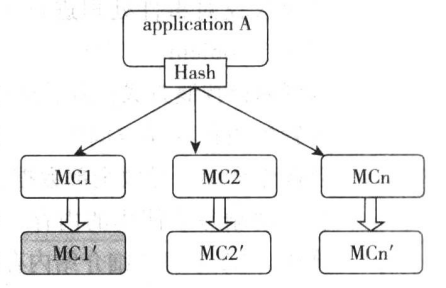

###### 4、Memcache机制

- 守护进程机制
  - UNIX daemon
- Socket事件处理机制
  - non-blocked：非阻塞
  - libevent：异步事件处理
  - epoll/kqueue
- **内存管理机制**
  - **Slab：内存分配机制**
  - **LRU：对象清楚机制**
  - **Hash机制：快速检索item**
- 多线程处理机制：pthread（POSIX）线程模式
  - 编译时开启：./configure -enable-threads
  - 目前还比较粗糙，锁机制locking不够完善
  - 负载过重时，可以开启（-t线程数为CPU核数）

###### 5、Memcache内存管理机制

- Slab内存处理机制
  - 提前分配内存slab 1MB，再进行小对象填充chunk（不同大小的块）
  - 避免大量重复的初始化和清理**（减轻内存管理器负担）**
  - 避免频繁malloc/free**（系统碎片）**
- 懒惰检测机制
  - 不检测item对象是否超时
  - get时检查item对象是否应该删除
- 懒惰删除机制
  - 删除item对象时，不释放内存，做删除标记，指针放入slot回收插槽，下次分配的时候直接使用

**（东西只有这么点，但是如果需要详细了解过程的话建议去看下Slab的具体工作流程【PPT第6章 缓存鼻祖Memcached】以及Slab Allocation机制、Item【书本P102-P106】）**

------

#### 十、关系型数据库和非关系型数据库的优缺点分析

###### 1、关系型数据库和非关系型数据库的比较

|  比较标准  |  RDBMS   |                            NoSQL                             | 备注                                                         |
| :--------: | :------: | :----------------------------------------------------------: | ------------------------------------------------------------ |
| 数据库原理 | 完全支持 |                           部分支持                           | RDBMS**有关系代数理论作为基础**； NoSQL没有统一的理论基础 |
|  数据规模  |    大    |                             超大                             | RDBMS很难实现横向**扩展**，纵向扩展的空间也比较有限，性能会随着数据规模的增大而降低； NoSQL可以很容易通过添加更多设备来支持更大规模的数据 |
| 数据库模式 |   固定   |                             灵活                             | RDBMS需要定义**数据库模式**，严格**遵守数据定义和相关约束条件**； NoSQL不存在数据库模式，可以自由灵活定义并存储各种不同类型的数据 |
|  查询效率  |    快    | 可以实现高效的简单查询，但是不具备高度结构化查询等特性，复杂查询的性能不尽人意 | RDBMS借助于**索引机制**可以实现快速查询（包括记录查询和范围查询）； 很多NoSQL数据库没有面向复杂查询的索引，虽然NoSQL可以使用MapReduce来加速查询，但是，在**复杂查询**方面的性能仍然不如RDBMS |
|   一致性   | 强一致性 |                           弱一致性                           | RDBMS严格遵守事务ACID模型，可以保证事务强一致性； 很多NoSQL数据库放松了对事务ACID四性的要求，而是**遵守BASE模型**，只能保证最终一致性 |
| 数据完整性 | 容易实现 |                           很难实现                           | 任何一个RDBMS都可以很容易实现数据完整性，比如通过主键或者非空约束来实现实体完整性，通过主键、外键来实现参照完整性，通过约束或者触发器来实现用户自定义完整性； 但是，在**NoSQL数据库却无法实现** |
|   扩展性   |   一般   |                              好                              | RDBMS很难实现横向扩展，纵向扩展的空间也比较有限； NoSQL在设计之初就充分考虑了横向扩展的需求，可以很容易通过添加廉价设备实现扩展 |
|   可用性   |    好    |                             很好                             | RDBMS在任何时候都以保证数据一致性为优先目标，其次才是优化系统性能，随着数据规模的增大，RDBMS为了保证严格的一致性，只能提供相对较弱的可用性； 大多数NoSQL都能提供较高的可用性 |
|   标准化   |    是    |                              否                              | RDBMS已经标准化（SQL）； **NoSQL还没有行业标准**，不同的NoSQL数据库都有自己的查询语言，很难规范应用程序接口； Stone Braker认为：NoSQL缺乏统一查询语言，将会拖慢NoSQL发展 |
|  技术支持  |    高    |                              低                              | RDBMS经过几十年的发展，已经非常成熟，Oracle等大型厂商都可以提供很好的技术支持； NoSQL在技术支持方面仍然处于起步阶段，还不成熟，缺乏有力的技术支持 |
|  可维护性  |   复杂   |                             复杂                             | RDBMS需要专门的数据库管理员(DBA)维护； NoSQL数据库虽然没有DBMS复杂，也难以维护 |
- 关系数据库

优势：以完善的关系代数理论作为基础，有严格的标准，支持事务ACID四性，借助索引机制可以实现高效的查询，技术成熟，有专业公司的技术支持。

劣势：可扩展性较差，无法较好支持海量数据存储，数据模型过于死板、无法较好支持Web2.0应用，事务机制影响了系统的整体性能等。

- NoSQL数据库

优势：可以支持超大规模数据存储，灵活的数据模型可以很好地支持Web2.0应用，具有强大的横向扩展能力等。

劣势：缺乏数学理论基础，复杂查询性能不高，大都不能实现事务强一致性，很难实现数据完整性，技术尚不成熟，缺乏专业团队的技术支持，维护较困难等。

###### 2、关系型数据库和非关系型数据库的优缺点

（上面那个表太复杂了，基本知识不到位的直接看下面这个表吧）

|               数据库类型                | 特性                                                         | 优点                                                         | 缺点                                                         |
| :-------------------------------------: | ------------------------------------------------------------ | ------------------------------------------------------------ | ------------------------------------------------------------ |
| 关系型数据库 SQLite、Oracle、MySQL | 1、关系型数据库，是指采用了**关系模型来组织数据**的数据库； 2、关系型数据库的最大特点就是**事务的一致性**； 3、简单来说，关系模型指的就是二维表格模型，而一个关系型数据库就是**由二维表及其之间的联系所组成的**一个数据组织。 | 1、**容易理解**：二维表结构是非常贴近逻辑世界的一个概念，关系模型相对网状、层次等其他模型来说更容易理解； 2、**使用方便**：通用的SQL语言使得操作关系型数据库非常方便； 3、**易于维护**：丰富的完整性（实体完整性、参照完整性和用户定义的完整性）大大降低了数据冗余和数据不一致的概率； 4、**支持SQL，可用于复杂的查询**。 | 1、为了维护一致性所付出的巨大代价就是其读写**性能比较差**； 2、固定的表结构； 3、高并发读写需求； 4、海量数据的高效率读写。 |
|   非关系型数据库MongoDb、Redis、HBase   | 1、使用**键值对**存储数据； 2、**分布式**； 3、一般**不支持ACID特性**； 4、非关系型数据库严格上不是一种数据库，应该是**一种数据结构化存储方法的集合**。 | 1、**无需经过SQL层的解析，读写性能很高**； 2、基于键值对，数据**没有耦合性，容易扩展**； 3、存储数据的格式：NoSQL的存储格式是**Key，Value形式、文档形式、图片形式**等等，二关系型数据库则只支持基础类型。 | 1、不提供SQL支持，学习和使用成本较高； 2、无事务处理，附加功能BI和报表等支持也不好。 |

------

#### 十一、Redis的数据结构

Redis（Remote Dictionary Server）远程字典服务器是一个**key-value存储系统**，由Salvatore Sanfilippo开发，使用ANSI C语言编写，遵守BSD协议。

Redis运行于独立的进程，通过网络协议和应用交互，将数据保存在内存中，并提供多种手段持久化内存数据。**Redis具备跨服务器的水平拆分、复制的分布式特性**。Redis不同于Memcached将value视作黑盒，Redis的value本身具有结构化的特点，对于value提供了丰富的操作。**基于内存存储的特点使得Redis与传统的关系型数据库相比，拥有极高的吞吐量和响应性能**。

###### 0、Redis的特点

- **支持多种数据结构**。Redis不仅仅支持简单的key-value类型的数据，同时还提供list，set，zset，hash等数据结构的存储。
- **支持数据持久化**。Redis支持数据的持久化，可以将内存中的数据保持在磁盘中，重启的时候可以再次加载进行使用。
- **支持数据备份**。Redis支持数据的备份，即master-slave模式的数据备份。

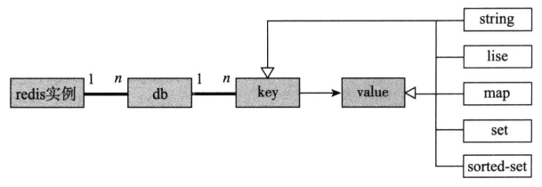

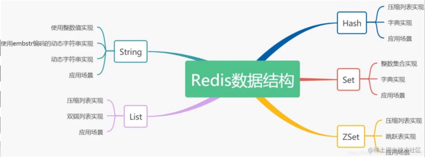

Redis没有传统关系型数据库的table模型。schema所对应的db仅以编号区分，同一个db内，key 作为顶层模型，其值是**扁平化**的，即db本身就是key值的命名空间。实际使用中，通常以“:“号作为分隔符，将命名空间值和业务key连接，作为Redis中当前db下的key值，如“article:12345”作为key值，表示article这个命名空间下id为12345的元素的key，类似于关系型数据库中的article表主键为12345的行。

因为扁平化的特点，在Redis 中，针对key的操作变得很简单：所有操作针对1到几个（常数个） key进行，不存在关系型数据库中的类似列表查询类的操作。但是业务的多样性通常需要存储系统具有更丰富的数据结构，Redis将这样的功能放到了单条key-value 的内部，用**结构化的value对象满足业务多样性的需求**。

Redis常用的value包含5种类型：**string、list、set、map、sorted-set**。

###### 1、String

字符串类型是Redis中最基本的数据结构，它能存储任何类型的数据，包括二进制数据，序列化后的数据，JSON化的对象，甚至是一张图片，最大512M。包括3种值的类型：字符串、整数、浮点数。

String 的底层存储：String类型的数据结构**存储方式有三种int、raw、embstr**。

String的应用场景：String用来存储图片，统计微博数、统计粉丝数等。

SDS是在原本字符数组之上，**增加了三个元数据:：len、alloc、flags**，用来解决C语言字符串的缺陷。为尽可能降低响应时间，降低某些操作的时间复杂度，并可能兼容一些C语言字符串APl，实现十分巧妙。

###### 2、List

列表对象，用于存储String序列。按照插入顺序排序，元素可以重复。你可以添加一个元素到列表的头部(左边)或者尾部(右边)，底层是个链表结构。

Redis的列表相当于Java语言中的LinkedList，注意它是链表而不是数组。这意味着**list的插入和删除操作非常快，时间复杂度为O(1)，但是索引定位很慢，时间复杂度为O(n)**。C语言本身没有链表这个数据结构的，所以Redis自己设计了一个链表数据结构。

List的应用场景∶

- List实现队列：消息排队和异步逻辑处理
- 文章列表或者数据分页展示的应用

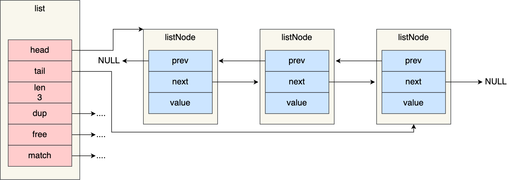

###### 3、Hash（Map）

Redis hash是一个string类型的field和value的映射表，hash特别适合用于存储对象。

Hash冲突解决：被分配到同一个哈希桶上的多个节点可以用这个单项链表连接起来。

链式哈希局限性也很明显，随着链表长度的增加，在查询这一位置上的数据的耗时就会增加，毕竟链表的查询的时间复杂度是O(n)。这时要采取rehash，对哈希表的大小进行扩展。

如果哈希表1的数据量非常大，那么在迁移至哈希表2的时候，因为会涉及大量的数据拷贝，此时可能会对Redis造成阻塞，无法服务其他请求。

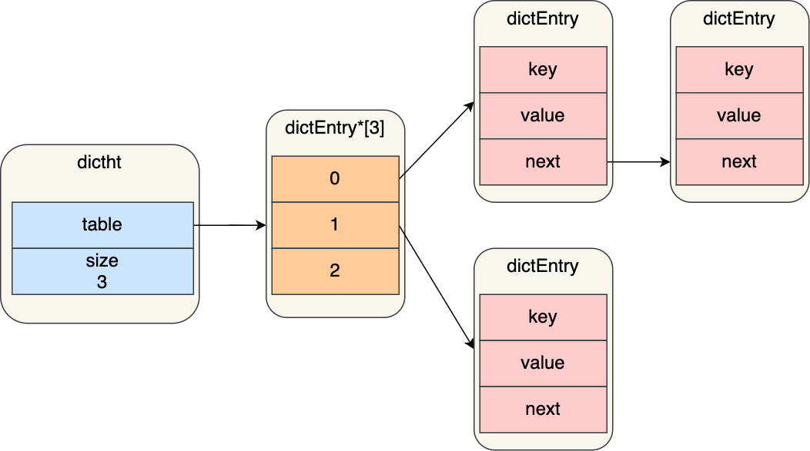

**渐进式hash**

- Redis采用了渐进式rehash，也就是将数据的迁移的工作不再是一次性迁移完成，而是分多次迁移。
- 在rehash进行期间：
  - 每次哈希表元素进行新增、删除、查找或者更新操作时，Redis除了会执行对应的操作之外，还会顺序将「哈希表1」中索引位置上的所有key-value迁移到「哈希表2」上；
  - **查找**一个key 的值的话，先会在「哈希表1」里面进行查找，如果没找到，就会继续到哈希表2里面进行查找。
  - **新增**一个key-value时，**会被保存到「哈希表2」里面**，而「哈希表1」则不再进行任何添加操作，这样保证了「**哈希表1」的key-value数量只会减少**，随着 rehash操作的完成，最终「哈希表1」就会变成空表。

###### 4、Set

Set是类似List，**是String类型的无序无重复集合**。相当于Java语言中的HashSet，它**内部的键值对是无序、唯一的**。它的内部实现相当于一个特殊的字典，字典中所有的value都是一个值NULL。

- Set的底层实现：
  - 针对非整型的数据，采用hashtable；
  - 针对整型的数据，采用 intset。如果元素个数超过set-max-intset-entries（默认值：512），也会用hashtable存储。

- Set的应用场景
  - 标签。比如博客网站经常用到的文章分类标签
  - 去重，共同好友
  - 随机化展示

###### 5、Zset（Sorted-set）

**（zset就是sorted set。为了避免sorted set简写sset导致命令冲突，所以改为zset。）**

Redis**有序**集合zset和集合set一样也是string类型元素的集合，且不允许重复的成员。不同的是**zset的每个元素都会关联一个分数(分数可以重复)**，redis通过分数来为集合中的成员进行**从小到大**的排序。

Zset 的底层实现︰

- Zset对象是唯一一个同时**使用了两个数据结构**来实现的Redis对象，这两个数据结构一个是跳表，一个是哈希表。这样的好处是既能**进行高效的范围查询，也能进行高效单点查询**。

- Zset对象能支持范围查询(如ZRANGEBYSORE操作)，这是因为它的数据结构设计采用了跳表（跳表是在链表基础上改进过来的，实现了一种多层的有序链表,这样的好处是能快读定位数据。)，而又能以常数复杂度获取元素权重(如ZSCORE操作)，这是因为它同时采用了哈希表进行索引。

Zset的应用场景

- 在首页推荐10个最热门的帖子，也就是阅读量由高到低，排行榜的实现等业务。
- IM中最近的会话列表

###### （编外）Redis-Cluster

Redis Cluster着眼于**提高并发量**。群集至少需要3主3从，且每个实例使用不同的配置文件。

在redis-cluster架构中，redis-master节点一般用于接收读写，而redis-slave节点则一般只用于备份，其与对应的master拥有相同的slot集合，若某个redis-master意外失效，则再将其对应的slave进行升级为临时redis-master。

Redis的官方文档：在cluster架构下，默认的，一般redis-master用于接收读写，而redis-slave则用于备份，**当有请求是在向slave发起时，会直接重定向到对应key所在的master来处理**。但如果不介意读取的是redis-cluster中有可能过期的数据并且对写请求不感兴趣时，则亦可**通过readonly命令，将slave设置成可读，然后通过slave获取相关的key，达到读写分离**。

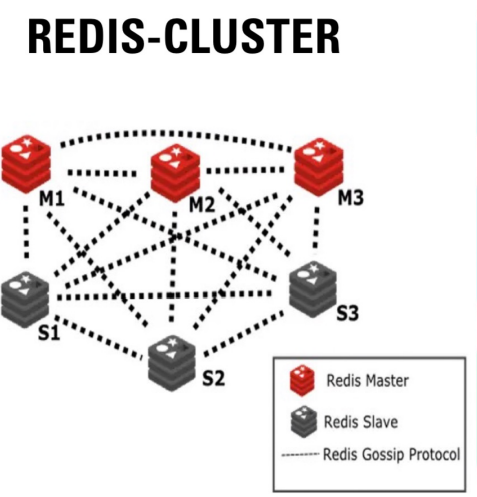

**优点**：

- 解决分布式负载均衡的问题。具体解决方案是分片/虚拟操slot。
- 可实现动态扩容。
- P2P模式，无中心化。

**缺点**：

- 为了性能提升，客户端需要缓存路由器信息。
- Slave在集群中充当”冷备“，不能缓解读压力。

------

#### 十二、Redis的持久化方式

Redis对外提供数据访问服务时使用的是驻存在内存中的数据，这些数据在Redis重启之后将消失。为了让数据在重启之后得以恢复，Redis具备将数据持久化到本地磁盘的能力。

Redis持久化有两种方法：**全量模式**和**增量模式**。

###### 基于全量模式的持久化

- 书本上的部分：

Redis作为一个状态节点，其”状态“可以用实例内部所有db的key-value值来定义，每一次Redis处理一个数据访问写命令修改了db的key-value数据时，Redis就发生了一次状态变迁。基于全量的持久化触发的时刻，将当时的状态（所有db的key-value值）完全保存下来，形成一个snapshot。

当Redis重启时，通过加载最近一个snapshot数据，可将Redis恢复至最近一次持久化时的状态上。

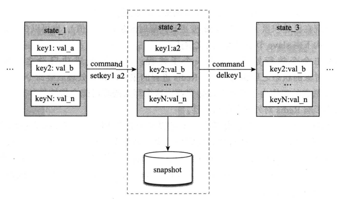

- PPT上的内容（PPT上将这种模式称之为**RDB【快照模式】**）

RDB：Redis将内存中的**所有数据全量**写入到文件中

**优点**：

1、每隔一段时间进行备份，**全量备份**

2、灾备简单，可以**远程传输**

3、备份是fork一个**子进程**，对当前进行数据访问主进程不影响

**劣势**：

1、发生故障时，有可能**丢失最后一次备份的数据**（原因︰突然宕机，子进程已经生成了rdb文件，但主进程还没来得及用该文件覆盖旧的rdb文件。）

2、子进程进行**数据备份时会复制内存数据导致内存膨胀两倍**，如果复制的数据量很大就会导致CPU和内存负载往高产生卡顿

3、RDB数据持久化适合于大规模的数据恢复，并且还原速度快，如果对数据的完整性不是特别敏感（可能存在最后一次丢失的情况），那么RDB持久化方式非常合适。

**原理**：

1、RDB即快照模式，它是Redis默认的数据持久化方式，它会将数据库的快照保存在dump.rdb这二进制文件中。

2、Redis使用操作系统的多进程COW（Copy On Write）机制来实现快照持久化操作。

3、RDB 实际上是Redis内部的一个定时器事件，它每隔一段固定时间就去检查触发条件。当满足条件时，Redis就会通过操作系统调用fork()来创建一个子进程，该子进程与父进程享有**相同的地址空间**。

**数据已经持久化到RDB文件，如何恢复?**

只需要把dump.rdb复制到dir目录中，redis在启动的时候机会**自动加载**。

###### 基于增量模式的持久化

- 书本上的部分：

基于全量的持久化保存的是数据的”状态“，而增量持久化保存的则是状态的每一次”变迁“。当初始状态给定，经过相同的”变迁“序列之后，最终的状态也是确定的。因此，基于增量持久化数据，可以通过对给定初始状态之后的变迁回放，恢复出数据的终态。

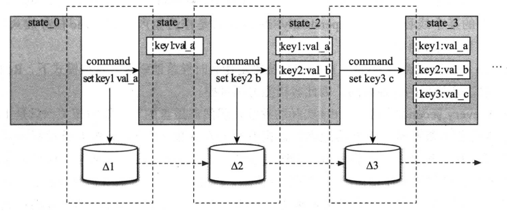

在Redis中，增量持久化成为AOF（append-only file）方式，在此基础上以rewrite机制优化性能，Redis仅对数据的变化进行存储。

- PPT上的内容（PPT上将这种模式称之为**AOF【追加模式】**）

AOF被称为追加模式，或日志模式，是Redis提供的另⼀种持久化策略，它能够**存储Redis服务器已经执行过的命令**， 并且**只记录对内存有过修改的命令**，这种数据记录方法，被叫做“**增量复制**”，其默认存储文件为 **appendonly.aof**。

以日志的形式来记录用户的请求**写操作**（特别像MySQL的binlog）， **读操作不会保存**；以**追加**的形式进行记录到appendonly.aof 这个文件中；Redis的**aof恢复**其实就是把追加的文件从头到尾全部执行⼀遍。 

写入机制：内容不直接写入到磁盘，而是放到内存缓冲区，填满才落盘；

重写机制：长期运行，aof文件会越变越长。 

如果AOF和RDB同时开启，Redis **只读取AOF文件的内容**

解决：在运行中修改appendonly为yes:config set appendonly yes

###### RDB && AOF 持久化总结

| RDB持久化                                                    | AOF持久化                                    |
| ------------------------------------------------------------ | -------------------------------------------- |
| 全量备份，一次保存整个数据库。                               | 增量备份，一次只保存一个修改数据库的命令。   |
| 每次执行持久化操作的间隔时间较长。                           | 保存的间隔默认为一秒钟（Everysec）。         |
| 数据保存为二进制格式，其还原速度快。                         | 使用文本格式还原数据，所以数据还原速度一般。 |
| 执行SAVE命令时会阻塞服务器，但手动或者自动触发的BGSAVE不会阻塞服务器。 | AOF持久化无论何时都不会阻塞服务器。          |

------

#### 十三、Redis集群的演进【*】

参考博客[redis集群架构的演进之路](https://blog.csdn.net/huxiaodong1994/article/details/109343165)

###### 1、Redis的主从架构

一开始我们的业务量不大时，一个redis节点就能满足我们的业务需求，当我们的业务量不断上涨，单台redis节点已经不能满足我们的业务需求时，这个时候redis的主从结构就出现了。

redis主从结构解决的问题：redis可以部署为一个主节点，多个从节点，从节点提供读服务，主节点提供写服务，将我们的业务进行**读写分离**。

- 网络中断时，主从结构如何保持数据一致性？

在redis2.8版本之前，只要主从断开连接，再次连接时，直接就是RDB全量同步；redis2.8版本之后，主从断网重连之后，会采用增量的方式进行同步，当从节点断开连接后，主节点会将操作写入到repl_backlog_buffer这个缓存区中，其中repl_backlog_buffer是一个环形的缓存区结构。

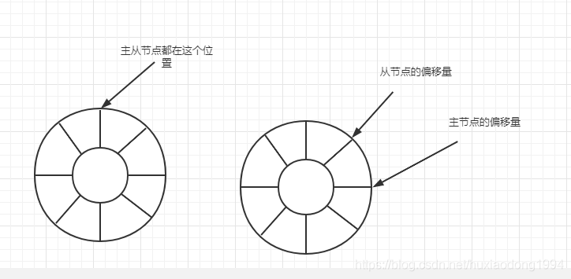

从主节点恢复连接之后，从节点会发送psync命名给主节点，并把自己当前的 slave_repl_offset 发给主库，主节点会根据自身的master_repl_offset与slave_repl_offset进行比较，将两者之间的相差部分命令找到。

将相差的部分增量同步给从节点，主从集群保持数据一致。

- 存在的问题：

因为主从结构中，只有一个主节点，当主节点出现故障后，无法提供写服务操作，存在单点故障问题，无法提供高可用的服务，这个时候哨兵模式的构架就出现了。

###### 2、哨兵架构

哨兵节点就是一个特殊的redis节点，它不提供存放数据，只用来监控其他redis节点情况。

哨兵节点的主要作用分为三个方面，即监控、选主和通知功能。

- 监控：哨兵会周期的发送PING命令给所有主从节点，在规定的时间内收到了节点的响应，就认为节点是正常，如果没有在规定时间内给出响应，就认为节点出现了故障，为了防止对主节点的误判操作，引入哨兵集群来对主节点进行监控行为，所以对于redis节点来说，又分为主观下线和客观下线。
  - 主观下线：单个哨兵节点发送PING命令给所监控的主、从节点，当主从节点对响应超时，哨兵节点就任务redis节点主线故障，将节点标记为主观下线。
  - 客观下线：当哨兵集群中，超过半数（可以调整，默认半数）以上的节点，认为某个节点发生故障，那个这个节点就被判定为客观下线。
- 选主：当主节点发生故障了，如何从多个从节点中选出主节点？选主的步骤一般是先筛选出符合竞选条件的从节点，然后对这些从节点进行打分操作，分数最高的节点就是新的主节点。
- 通知：就是选举结束后，哨兵需要将新的主节点通过给客户端，让客户端可以继续进行写操作。针对客户端而言，通知可以分为主动获取和被动接受。
  - 被动接受：哨兵会把新的主节点地址信息写入到实例的pubsub（switch-master）中，客户端需要订阅这个pubsub，来获取新的主节点信息，存在的问题就是当客户端错过了哨兵的通知的话，那么客户端将不会在拿到新的主节点信息。
  - 主动拉取：客户端在访问主从库时，不能将配置写死在自身的配置中，而是需要从哨兵集群中获取redis节点信息（sentinel get-master-addr-by-name命令）。

- 当主从集群中的主节点故障后，如何将从节点选为新的主节点呢？

先会对从节点进行筛选，筛选的规则就是，主要就是检查从库的当前在线状态和之前的网络情况。对于之前的网络状态判断是通过参数down-after-milliseconds，来判断，如果主从节点超过这个时间点没有通信，就被认为是出现过一次断链，当超过10次以上断连时，哨兵认为其从节点的网络情况不是很好，会主动剔除这部分从节点。然后就对剩下的从节点进行打分操作，打分分为三个纬度，如果每一轮中回出现一个最高分，就会直接选出新的主节点，选举结束。三个层级分别是从库优先级、从库复制进度和从库ID号进行选举。

- 存在的问题：

单个哨兵架构虽然解决了主从结构的单点故障问题，当主节点故障后，通过哨兵发起主从切换，可以保持redis的高可用性，但是此时哨兵节点还是只有一个，哨兵节点还是存在单点故障问题，所以哨兵集群架构就登场了。

###### 3、哨兵集群结构

所谓的哨兵集群结构主要解决的问题，就是哨兵的单点故障问题，防止只有一个哨兵节点，当哨兵节点出现故障后，redis集群就不可用的情况。

- 多个哨兵之间如何通信呢？

主要是通过redis本身提供的pub/sub机制，每个哨兵和主节点redis进行连接时，会将哨兵自身的ip和port，通过主库上有一个名为“\__sentinel__:hello”的频道发送，当哨兵监控这个集群时，就会订阅这个频道的消息，所以通过这种方式，哨兵之间可以拿到其他节点的ip和port。

- 哨兵的Leader选举机制？

当我们的redis主节点出现故障后，需要由哨兵来进行主从切换，将某个从节点变成主节点，整个切换的流程是由哨兵中的某一个节点来进行操作，进行操作的节点我们称之为Leader节点。那么这个Leader节点是怎么来的呢，其选举的流程如下图：

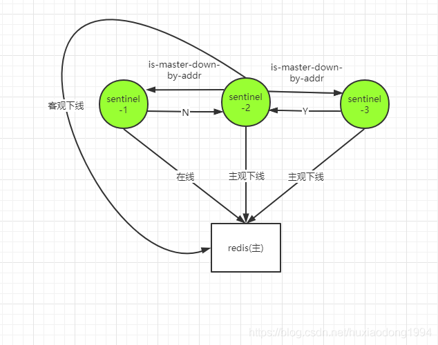

- 存在的问题：

哨兵集群结构，虽然解决了哨兵的单点问题，但是此时的结构中，只有一个redis主节点，当redis的主节点数据量过大时，redis的持久化，提供写复制时，响应时间存在过长的情况，针对这种情况，redis切片集群就出现了。

###### 4、Redis Cluster集群模式

采用redis集群模式，可以解决单点节点数据量大、写入量大产生的性能瓶颈的问题。多个节点组成一个集群，可以提高集群的性能和可靠性。redis Cluster采用哈希槽（Hash slot）方法，来处理数据和实例之间的映射关系，哈希槽最多有16384个节点。存放数据的步骤就是先将key值，通过CRC16算法获取值后，然后在和16384进行取模，看这个数据落在那个哈希槽中。

采用了redis cluster集群后，客户端访问数据时，如何知道我们的数据是落在哪个节点上呢？在我们的redis集群中，每个redis集群节点都有一个额外的TCP端口，每个节点使用TCP连接与每个其他节点连接。检测和故障转移这些步骤基本和哨兵模式类似，每个redis节点都会知道其他节点分配了哪些槽信息，当客户端使用命令来请求服务端时，如何这个命令刚好在这个节点上，直接返回数据，如何不再这个节点上，会返回对应的moved重定向命令，来告知客户端需要访问的数据所在的节点信息。

**（部分Redis Cluster的知识可以参考十一、Redis的数据结构中的编外）**

------

#### 十四、综合系统设计