# 计算机网络

因为本专业不学习《通信原理》，故一些涉及到通信原理的知识点，如果老师上课并没有过分强调，以下大概率不会特别做笔记。

## 第一章 概述

## 第二章 物理层

1、传输媒体可分为导引型传输媒体（双绞线、同轴电缆、光纤）和非导引型传输媒体（微波通信）。【并不属于计算机网络的一部分，但是可以归纳在物理层】

- 同轴电缆：早期局域网中的使用/有线电视的使用
- 双绞线：8跟绝缘彩线绞合。绞合能抵御部分来自外界的电磁波干扰、减少相邻导线的电磁干扰。（现在的网线）
- 光纤：通信容量大；传输损耗小，远距离传输更加经济；抗雷电和电磁干扰性能好；无串音干扰，保密性好；体积小，重量轻。单数需要专用设备进行切割，且接口价格昂贵。

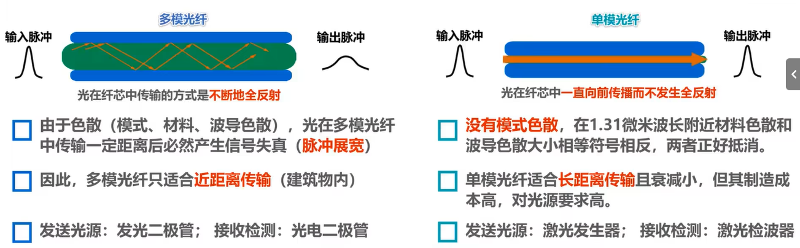

- 无线电波：低频（LF）和中频（MF）使用地面波（基站）进行传输；高频（HF）和甚高频（VHF）使用地球上方100~500千米的带电离子层反射传播
- 微波：采用轨道同步卫星进行传播（无线网络、GPS）；低轨道卫星通信系统用于构成空间高速链路。
- 红外线：点对点无线传播；直线；传输速率低。

2、物理层协议的主要任务：

- 机械特性：指明接口所引用接线器的形状和尺寸、引脚数目和排列、固定和锁定的装置。
- 电气特性：指明在接口电缆的各条线上出现的电压的范围。
- 功能特性：指明某条线上出现的某一电平的电压表示何种意义。
- 过程特性：指明对于不同功能的各种可能事件的出现顺序。

3、物理层的基本概念：

- 物理层考虑的是怎样才能在连接各种计算机的传输媒体上传输数据比特流。
- 物理层为数据链路层屏蔽了各种传输媒体的差异，使数据链路层只需要考虑如何完成本层的协议和服务，而不必考虑网络具体的传输媒体是什么。

4、传输方式：

- 串行传输：一次只发送一个比特，只有一条线路。
- 并行传输：一次发送n个比特，有多条线路。（传输速度是串行传播的n倍，但是成本高）
  - 计算机内部通信采用并行传输（CPU多核多进程），外部传输/通信采用串行传播。
- 同步传输：进行时钟同步
  - 外同步：在收发双方之间添加一条单独的时钟信号线
  - 内同步：发送端将时钟同步信号编码到发送数据中一起传输。
- 异步传输：在传输字节前后加上起始标识和结束标识。
  - 字节之间异步（字节之间的时间间隔不固定）
  - 字节之间的每个比特仍然需要同步（各比特的持续时间相同）
- 单向通信（单工）：只有一个数据传输方向（广播）【一条信道】
- 双向交替通信（半双工）：数据双向传播，但是不能同时。（异步，对讲机）【两条信道】
- 双向同时通信（全双工）：双向同时通信（电话）【两条信道】

5、常用编码（物理层主要解决传0还是传1的问题）：

码元：一段调制好的基本波形，可以表示比特信息。

- 不归零编码（NRZ）：码元在任一时刻都不为0，接收端为了对码元计数需要额外一根传输线来传输时钟信号才能保持发送方和接收方同步（同步问题）， 浪费资源故计算机网络不采用这种编码。
- 归零编码（RZ）：每个码元传输结束后信号都要“归零”。相当于将时钟信号用“归零”方式编码在了数据内（自同步）。带宽浪费在“归零”上，编码效率低。
- 曼彻斯特编码：在每个码元的中间时刻进行跳变（0变1、1变0），跳变既表示时钟又表示数据。
- 差分曼彻斯特编码：跳变仅表示时钟，用码元开始处电平是否变化表示数据。（同1异0）
- 反向不归零编码（NRZI）：在码元时间内不会出现零电平。若后一个码元时间内所持续的电平与前一个码元时间内所持续的电平不同（也称为电平反转）则表示0，若电平保持不变则表示1。

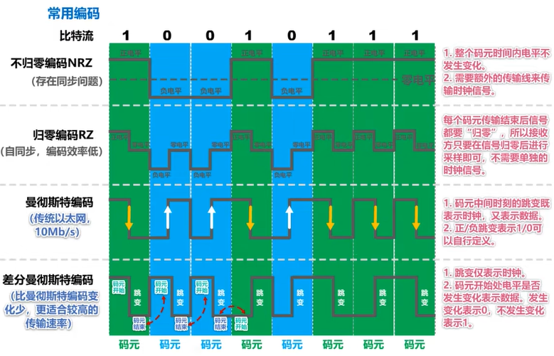

6、信道常用准则/公式

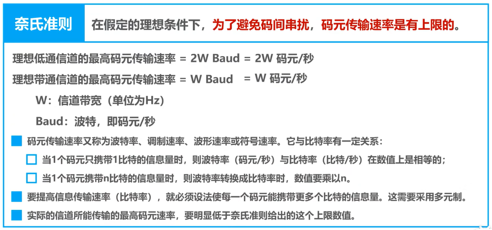

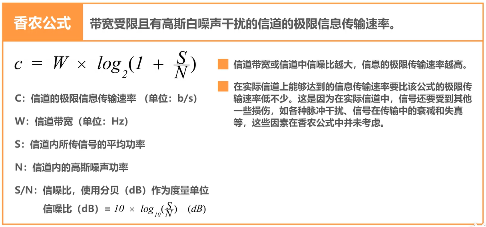

在信道带宽一定的情况下，根据奈氏准则和香农公式，要想提高信息中的传输速率就必须采用多元制（更好的调制方法）和努力提高信道中的信噪比。

## 第三章 数据链路层

1、数据链路层概述：

- 链路（Link）：就是从一个结点到相邻结点的一段物理线路，而中间没有任何其他的交换节点。
- 数据链路（Data Link）：是指把实现通信协议的邮件和软件加到链路上，就构成了数据链路。
- 数据链路层以帧为单位传输数据。

2、封装成帧

- 封装成帧是指数据链路层给上层交付的协议数据单元添加帧头和帧尾使之成为帧。
  - 帧头和帧尾中包含有重要的控制信息。
  - 帧头和帧尾的作用之一就是帧定界。
- 透明传输是指数据链路对上层交付的传输数据没有任何限制，就好像数据链路层不存在一样。
  - 面向字节的物理链路使用字节填充（或称字符填充）的方法实现透明传输。
  - 面向比特的物理链路使用比特填充的方法实现透明传输。
- 为了提高帧的传输效率，应当使帧的数据部分的长度尽可能大些。
- 考虑到差错控制等多种因素，每一种数据链路层协议都规定了帧的数据部分的长度上限，即最大传送单元MTU（Maximum Transfer Unit）。

3、差错检测

- 比特差错：实际的通信链路都不是理想的，比特在传输过程中可能会产生差错：1可能变成0，0也可能变成1。
- 误码率BER（Bit Error Rate）：在一段时间内，传输错误的比特占所传输比特总数的比率。
- 使用差错检测码来检测数据在传输过程中是否产生了比特差错，是数据链路层所要解决的重要问题之一。

- 奇偶校验：在待发送的数据后面添加1位奇偶校验位，使整个数据（包括所添加的校验位在内）中“1”的个数位技术（奇检验）或偶数（偶校验）。
  - 如果有奇数个位发生误码，则奇偶性发生变化，可以检查出误码；
  - 如果有偶数个位发生误码，则奇偶性不发生变化，不能检查出误码。
- 循环冗余校验CRC（Cyclic Redundancy Check）：收发双方约定好一个生成多项式G(x)；发送方基于待发送的数据和生成多项式计算出差错检测码（冗余码），将其添加到待传输数据的后面一起传输；接收方通过生成多项式来计算收到的数据是否产生了误码。
  - 检错码只能检测出帧在传输过程中出现了差错，但并不能定位错误，因此无法纠正错误。
  - CRC有很好的检错能力（漏检率非常低），虽然计算比较复杂，但非常易于用硬件实现，因此广泛应用于数据链路层。

- 要想纠正传输中的差错，可以使用冗余信息更多的纠错码进行前向纠错。但纠错码的开销比较大，在计算机网络中较少使用。
- 在计算机网络中通常采用检错重传方式来纠正传输中的差错（可靠传输服务【不局限于数据链路层】），或者仅仅是丢弃检测到差错的帧（不可靠传输服务）。
- 比特差错只是传输差错中的一种，传输差错还包括分组丢失、分组失序以及分组重复（其他传输差错一般不出现在数据链路层，而在其上层）。

4、可靠传输协议的实现：

（1）停止等待协议SW（Stop-and-Wait）：

- 接收端检测到数据分组有误码时，将其丢弃并等待发送方的超时重传。（对于误码率较高的点对点链路，为使发送方尽早重传，也可给发送方发送NAK分组。）
- 为了让接收方能后判断所收到的数据分组是否重复，需要给数据分组编号。（由于停等协议的停等特性，只需一个编号表示0/1）
- 为了让发送方能够判断所收到的ACK分组是否时重复的，需要给ACK分组编号，所用比特数量与数据分组所用比特数量一样。（数据链路层一般不会出现ACK分组迟到的情况，因此在数据链路层使用停等协议可以不用给ACK分组编号。）
- 超时计时器设置的重传时间应仔细选择。一般可将重传时间选为略大于“从发送方到接收方的平均往返时间”。
  - 数据链路层点对点的往返时间比较确定，重传时间比较好设定。
  - 运输层由于端到端的往返世纪那非常不确定，设置合适的重传时间有时并不容易。

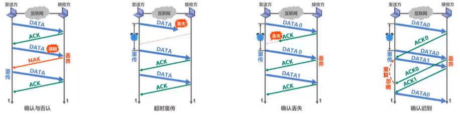

- 停等协议信道利用率低。
  - 当往返时延RTT远大于数据帧发送时延T~D~时（例如使用卫星链路），信道利用率非常低；
  - 若出现重传，则对于传送有用的数据信息来说，信道利用率还要降低。

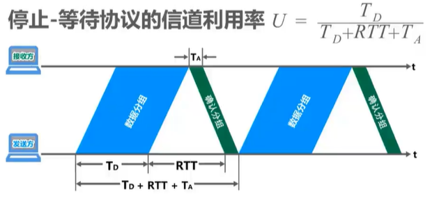

（2）回退N帧协议GBN（Go-Back_N）：

- 累计确认：接收方不一定要对收到的数据分组逐个发送确认，而是可以在收到几个数据分组后，对按序到达的最后一个数据分组发送确认。ACKn表示序号为n及以前的所有数据分组都已正确接收。
- 发送窗口的尺寸不能超过其上线，否则接收方无法分辨新、旧数据分组，导致重复接收。

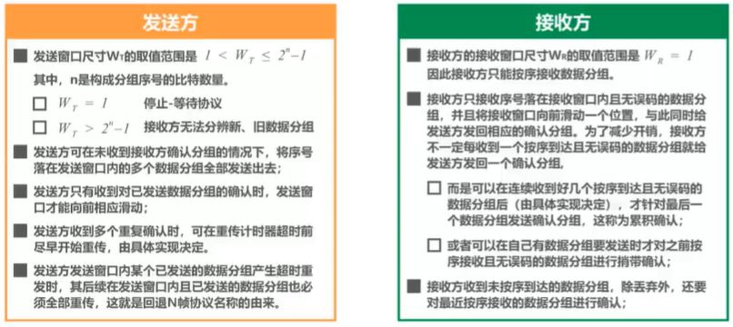

- 回退N帧协议在流水线传输的基础上利用发送窗口来限制发送方连续发送数据分组的数量，是一种连续ARQ协议。
- 在协议工作过程中发送窗口和接收窗口不断向前滑动，因此这类协议又称为滑动窗口协议。
- 当通信线路质量不好时，信道利用率并不比停止-等待协议高。

（3）选择重传协议SR（Selective Request）

回退N帧协议的接收窗口尺寸W~R~只能等于1，因此接受方只能按序接收正确到达的数据分组。一个数据分组的误码就会导致其后续多个数据分组不能被接收方按序接收而丢弃（尽管无乱序和误码），这造成发送方对这些数据分组的超时重传是对通信资源的极大浪费。

选择重传协议：接收窗口尺寸W~R~不再等于1（而应大于1），接收方先收下失序到达但无误码并且序号落在接收窗口内的那些数据分组，等到所缺分组收齐后再一并送交上层。

- 为了使发送方仅重传出现差错的分组，接收方不能再采用累计确认，而需要对每个正确接收到的数据分组进行逐一确认。

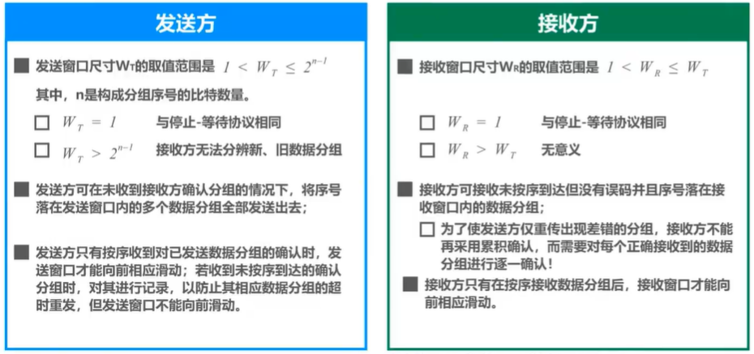

5、点对点协议PPP（Point-to-Point Protocol）

- PPP协议是目前使用最广泛的点对点数据链路层协议。
- PPP协议为在点对点链路传输各种协议数据报提供了一个标准方法。
  - 对各种协议数据报的封装方法（封装成帧）
  - 链路控制LCP（用于建立、配置以及测试数据链路的连接）
  - 一套网络控制协议NCPs（每一个协议支持不同的网络层协议）
- 帧格式（目前阶段不要求掌握）：

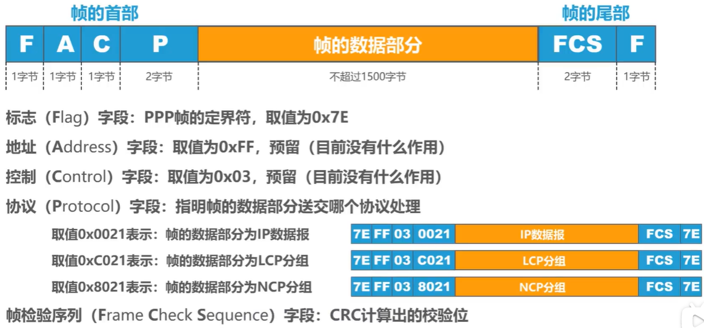

- 工作状态：

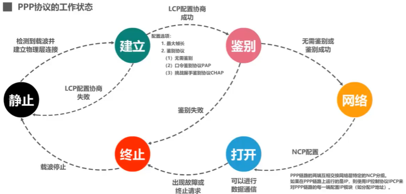

6、媒体接入控制：

- 媒体接入控制MAC（Medium Access Control）：共享信道要着重考虑如何协调多个发送和接收站点对一个共享传输媒体的占用。

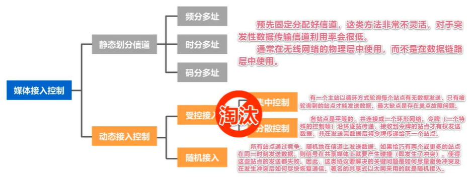

随着技术的发展，交换技术的成熟和成本的降低，具有更高性能的使用点对点链路和链路层交换机的交换式局域网在有线领域已完全取代了共享式局域网，但由于无线信道的广播天性，无线局域网任然使用共享媒体技术。

- 静态划分信道——信道复用
  - 复用（Multiplexing）是通信技术中的一个重要概念。服用就是通过一条物理线路同时传输多路用户的信号。
  - 当网络中传输媒体的传输容量大于多条单一信道传输的总通信量时，可利用复用技术在一条物理线路上建立多条通信信道来充分利用传输媒体的带宽。
  - 常见的复用技术：
    - 频分复用FDM：所有用户同时占用不同的频带资源进行通信。
    - 时分复用TDM：所有用户在不同的时间占用同样的频带宽度。
    - 波分复用WDM
    - 码分复用CDM：另一种共享信道的方法。更常用的名词是码分多址CDMA（Code Division Multiple Access）；每一个用户可以在同样的时间使用同样的频带进行通信；使用经过特殊挑选的不同码型，抗干扰能力强（早期多用于军事通信，现在价格便宜，已广泛应用 ）
  - 复用与多址：
    - 复用是将单一媒体上的频带资源划分成很多子信道，这些子信道之间相互独立，互不干扰。从媒体的整体频带资源上看，每个子信道只占用该媒体频带资源的一部分。
    - 多址（多点接入）处理的是动态分配信道给用户。用户仅暂时性占用信道，移动通信系统基本属于这种情况。（无线广播/电视广播是信道永久分配，不需要多址）
    - 这里并不严格区分复用和多址的概念（目前：复用 == 多址）

- 动态接入控制——随机接入——CSMA/CD协议
  - 工作原理：
    - 多址接入MA：多个主机连接在一条总线上，竞争使用总线。
    - 载波监听CS：发送帧前先检测总线，若总线空闲96比特时间，则立即发送；若总线忙，则持续检测总线空闲96比特时间后再重新发送。
    - 碰撞检测CD：边发送边检测碰撞。若检测到碰撞，则立即停止发送，退避一段时间后再重新发送。

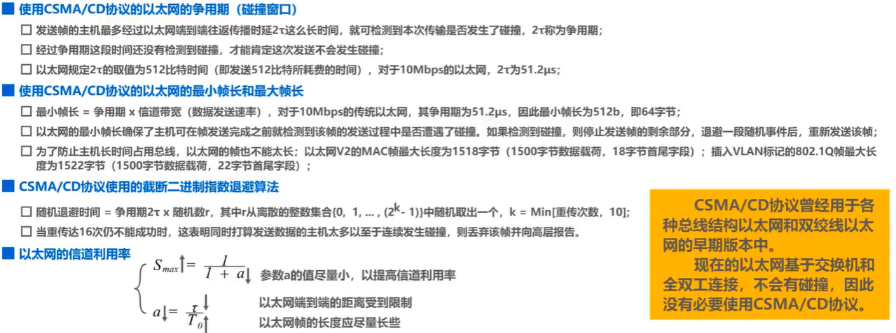