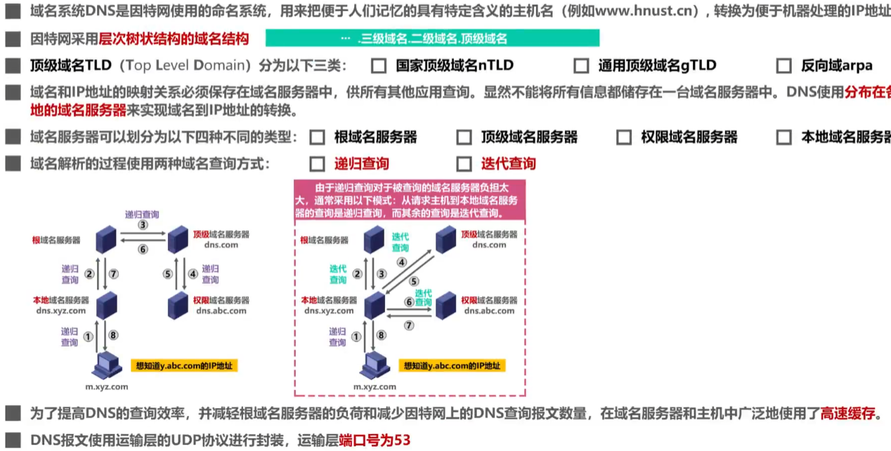

# 计算机网络

因为本专业不学习《通信原理》，故一些涉及到通信原理的知识点，如果老师上课并没有过分强调，以下大概率不会特别做笔记。

## 第一章 概述

------

## 第二章 物理层

#### 1、传输媒体

传输媒体可分为导引型传输媒体（双绞线、同轴电缆、光纤）和非导引型传输媒体（微波通信）。【并不属于计算机网络的一部分，但是可以归纳在物理层】

- 同轴电缆：早期局域网中的使用/有线电视的使用
- 双绞线：8跟绝缘彩线绞合。绞合能抵御部分来自外界的电磁波干扰、减少相邻导线的电磁干扰。（现在的网线）
- 光纤：通信容量大；传输损耗小，远距离传输更加经济；抗雷电和电磁干扰性能好；无串音干扰，保密性好；体积小，重量轻。单数需要专用设备进行切割，且接口价格昂贵。

- 无线电波：低频（LF）和中频（MF）使用地面波（基站）进行传输；高频（HF）和甚高频（VHF）使用地球上方100~500千米的带电离子层反射传播
- 微波：采用轨道同步卫星进行传播（无线网络、GPS）；低轨道卫星通信系统用于构成空间高速链路。
- 红外线：点对点无线传播；直线；传输速率低。

#### 2、物理层协议的主要任务

- 机械特性：指明接口所引用接线器的形状和尺寸、引脚数目和排列、固定和锁定的装置。
- 电气特性：指明在接口电缆的各条线上出现的电压的范围。
- 功能特性：指明某条线上出现的某一电平的电压表示何种意义。
- 过程特性：指明对于不同功能的各种可能事件的出现顺序。

#### 3、物理层的基本概念

- 物理层考虑的是怎样才能在连接各种计算机的传输媒体上传输数据比特流。
- 物理层为数据链路层屏蔽了各种传输媒体的差异，使数据链路层只需要考虑如何完成本层的协议和服务，而不必考虑网络具体的传输媒体是什么。

#### 4、传输方式

- 串行传输：一次只发送一个比特，只有一条线路。
- 并行传输：一次发送n个比特，有多条线路。（传输速度是串行传播的n倍，但是成本高）
  - 计算机内部通信采用并行传输（CPU多核多进程），外部传输/通信采用串行传播。
- 同步传输：进行时钟同步
  - 外同步：在收发双方之间添加一条单独的时钟信号线
  - 内同步：发送端将时钟同步信号编码到发送数据中一起传输。
- 异步传输：在传输字节前后加上起始标识和结束标识。
  - 字节之间异步（字节之间的时间间隔不固定）
  - 字节之间的每个比特仍然需要同步（各比特的持续时间相同）
- 单向通信（单工）：只有一个数据传输方向（广播）【一条信道】
- 双向交替通信（半双工）：数据双向传播，但是不能同时。（异步，对讲机）【两条信道】
- 双向同时通信（全双工）：双向同时通信（电话）【两条信道】

#### 5、常用编码（物理层主要解决传0还是传1的问题）

码元：一段调制好的基本波形，可以表示比特信息。

- 不归零编码（NRZ）：码元在任一时刻都不为0，接收端为了对码元计数需要额外一根传输线来传输时钟信号才能保持发送方和接收方同步（同步问题）， 浪费资源故计算机网络不采用这种编码。
- 归零编码（RZ）：每个码元传输结束后信号都要“归零”。相当于将时钟信号用“归零”方式编码在了数据内（自同步）。带宽浪费在“归零”上，编码效率低。
- 曼彻斯特编码：在每个码元的中间时刻进行跳变（0变1、1变0），跳变既表示时钟又表示数据。
- 差分曼彻斯特编码：跳变仅表示时钟，用码元开始处电平是否变化表示数据。（同1异0）
- 反向不归零编码（NRZI）：在码元时间内不会出现零电平。若后一个码元时间内所持续的电平与前一个码元时间内所持续的电平不同（也称为电平反转）则表示0，若电平保持不变则表示1。

#### 6、信道常用准则/公式

在信道带宽一定的情况下，根据奈氏准则和香农公式，要想提高信息中的传输速率就必须采用多元制（更好的调制方法）和努力提高信道中的信噪比。

------

## 第三章 数据链路层

#### 1、数据链路层概述

- 链路（Link）：就是从一个结点到相邻结点的一段物理线路，而中间没有任何其他的交换节点。
- 数据链路（Data Link）：是指把实现通信协议的邮件和软件加到链路上，就构成了数据链路。
- 数据链路层以帧为单位传输数据。

#### 2、封装成帧

- 封装成帧是指数据链路层给上层交付的协议数据单元添加帧头和帧尾使之成为帧。
  - 帧头和帧尾中包含有重要的控制信息。
  - 帧头和帧尾的作用之一就是帧定界。
- 透明传输是指数据链路对上层交付的传输数据没有任何限制，就好像数据链路层不存在一样。
  - 面向字节的物理链路使用字节填充（或称字符填充）的方法实现透明传输。
  - 面向比特的物理链路使用比特填充的方法实现透明传输。
- 为了提高帧的传输效率，应当使帧的数据部分的长度尽可能大些。
- 考虑到差错控制等多种因素，每一种数据链路层协议都规定了帧的数据部分的长度上限，即最大传送单元MTU（Maximum Transfer Unit）。

#### 3、差错检测

- 比特差错：实际的通信链路都不是理想的，比特在传输过程中可能会产生差错：1可能变成0，0也可能变成1。
- 误码率BER（Bit Error Rate）：在一段时间内，传输错误的比特占所传输比特总数的比率。
- 使用差错检测码来检测数据在传输过程中是否产生了比特差错，是数据链路层所要解决的重要问题之一。

- 奇偶校验：在待发送的数据后面添加1位奇偶校验位，使整个数据（包括所添加的校验位在内）中“1”的个数位技术（奇检验）或偶数（偶校验）。
  - 如果有奇数个位发生误码，则奇偶性发生变化，可以检查出误码；
  - 如果有偶数个位发生误码，则奇偶性不发生变化，不能检查出误码。
- 循环冗余校验CRC（Cyclic Redundancy Check）：收发双方约定好一个生成多项式G(x)；发送方基于待发送的数据和生成多项式计算出差错检测码（冗余码），将其添加到待传输数据的后面一起传输；接收方通过生成多项式来计算收到的数据是否产生了误码。
  - 检错码只能检测出帧在传输过程中出现了差错，但并不能定位错误，因此无法纠正错误。
  - CRC有很好的检错能力（漏检率非常低），虽然计算比较复杂，但非常易于用硬件实现，因此广泛应用于数据链路层。

- 要想纠正传输中的差错，可以使用冗余信息更多的纠错码进行前向纠错。但纠错码的开销比较大，在计算机网络中较少使用。
- 在计算机网络中通常采用检错重传方式来纠正传输中的差错（可靠传输服务【不局限于数据链路层】），或者仅仅是丢弃检测到差错的帧（不可靠传输服务）。
- 比特差错只是传输差错中的一种，传输差错还包括分组丢失、分组失序以及分组重复（其他传输差错一般不出现在数据链路层，而在其上层）。

#### 4、可靠传输协议的实现：

（1）停止等待协议SW（Stop-and-Wait）：

- 接收端检测到数据分组有误码时，将其丢弃并等待发送方的超时重传。（对于误码率较高的点对点链路，为使发送方尽早重传，也可给发送方发送NAK分组。）
- 为了让接收方能后判断所收到的数据分组是否重复，需要给数据分组编号。（由于停等协议的停等特性，只需一个编号表示0/1）
- 为了让发送方能够判断所收到的ACK分组是否时重复的，需要给ACK分组编号，所用比特数量与数据分组所用比特数量一样。（数据链路层一般不会出现ACK分组迟到的情况，因此在数据链路层使用停等协议可以不用给ACK分组编号。）
- 超时计时器设置的重传时间应仔细选择。一般可将重传时间选为略大于“从发送方到接收方的平均往返时间”。
  - 数据链路层点对点的往返时间比较确定，重传时间比较好设定。
  - 运输层由于端到端的往返世纪那非常不确定，设置合适的重传时间有时并不容易。

- 停等协议信道利用率低。
  - 当往返时延RTT远大于数据帧发送时延T~D~时（例如使用卫星链路），信道利用率非常低；
  - 若出现重传，则对于传送有用的数据信息来说，信道利用率还要降低。

（2）回退N帧协议GBN（Go-Back_N）：

- 累计确认：接收方不一定要对收到的数据分组逐个发送确认，而是可以在收到几个数据分组后，对按序到达的最后一个数据分组发送确认。ACKn表示序号为n及以前的所有数据分组都已正确接收。
- 发送窗口的尺寸不能超过其上线，否则接收方无法分辨新、旧数据分组，导致重复接收。

- 回退N帧协议在流水线传输的基础上利用发送窗口来限制发送方连续发送数据分组的数量，是一种连续ARQ协议。
- 在协议工作过程中发送窗口和接收窗口不断向前滑动，因此这类协议又称为滑动窗口协议。
- 当通信线路质量不好时，信道利用率并不比停止-等待协议高。

（3）选择重传协议SR（Selective Request）

回退N帧协议的接收窗口尺寸W~R~只能等于1，因此接受方只能按序接收正确到达的数据分组。一个数据分组的误码就会导致其后续多个数据分组不能被接收方按序接收而丢弃（尽管无乱序和误码），这造成发送方对这些数据分组的超时重传是对通信资源的极大浪费。

选择重传协议：接收窗口尺寸W~R~不再等于1（而应大于1），接收方先收下失序到达但无误码并且序号落在接收窗口内的那些数据分组，等到所缺分组收齐后再一并送交上层。

- 为了使发送方仅重传出现差错的分组，接收方不能再采用累计确认，而需要对每个正确接收到的数据分组进行逐一确认。

#### 5、点对点协议PPP（Point-to-Point Protocol）

- PPP协议是目前使用最广泛的点对点数据链路层协议。
- PPP协议为在点对点链路传输各种协议数据报提供了一个标准方法。
  - 对各种协议数据报的封装方法（封装成帧）
  - 链路控制LCP（用于建立、配置以及测试数据链路的连接）
  - 一套网络控制协议NCPs（每一个协议支持不同的网络层协议）
- 帧格式（目前阶段不要求掌握）：

- 工作状态：

#### 6、媒体接入控制

- 媒体接入控制MAC（Medium Access Control）：共享信道要着重考虑如何协调多个发送和接收站点对一个共享传输媒体的占用。

随着技术的发展，交换技术的成熟和成本的降低，具有更高性能的使用点对点链路和链路层交换机的交换式局域网在有线领域已完全取代了共享式局域网，但由于无线信道的广播天性，无线局域网任然使用共享媒体技术。

###### （1）静态划分信道——信道复用

- 复用（Multiplexing）是通信技术中的一个重要概念。服用就是通过一条物理线路同时传输多路用户的信号。
- 当网络中传输媒体的传输容量大于多条单一信道传输的总通信量时，可利用复用技术在一条物理线路上建立多条通信信道来充分利用传输媒体的带宽。
- 常见的复用技术：
  - 频分复用FDM：所有用户同时占用不同的频带资源进行通信。
  - 时分复用TDM：所有用户在不同的时间占用同样的频带宽度。
  - 波分复用WDM
  - 码分复用CDM：另一种共享信道的方法。更常用的名词是码分多址CDMA（Code Division Multiple Access）；每一个用户可以在同样的时间使用同样的频带进行通信；使用经过特殊挑选的不同码型，抗干扰能力强（早期多用于军事通信，现在价格便宜，已广泛应用 ）
- 复用与多址：
  - 复用是将单一媒体上的频带资源划分成很多子信道，这些子信道之间相互独立，互不干扰。从媒体的整体频带资源上看，每个子信道只占用该媒体频带资源的一部分。
  - 多址（多点接入）处理的是动态分配信道给用户。用户仅暂时性占用信道，移动通信系统基本属于这种情况。（无线广播/电视广播是信道永久分配，不需要多址）
  - 这里并不严格区分复用和多址的概念（目前：复用 == 多址）

###### （2）动态接入控制——随机接入——CSMA/CD协议

- 工作原理：
  - 多址接入MA：多个主机连接在一条总线上，竞争使用总线。
  - 载波监听CS：发送帧前先检测总线，若总线空闲96比特时间，则立即发送；若总线忙，则持续检测总线空闲96比特时间后再重新发送。
  - 碰撞检测CD：边发送边检测碰撞。若检测到碰撞，则立即停止发送，退避一段时间后再重新发送。

###### （3）动态接入控制——随机接入——CSMA/CA协议

载波监听多址接入/碰撞避免 Carrier Sense Multiple Access/Collision Avoidance

- **在无线局域网中，任然可以使用载波监听多址接入CSMA**，在发送帧之前先对传输媒体进行载波监听。若发现有其他站在发送帧，就推迟发送以免发生碰撞。
- **在无线局域网中，不能使用碰撞检测CD。**
  - 由于无线信道的传输条件特殊，其信号强度的动态范围非常大，无线网卡上接收到的信号强度往往会远小于发送信号的强度（可能相差百万倍）。如果**在无线网卡上实现碰撞检测CD，对硬件的要求非常高**。
  - 即使能够在邮件上实现无线局域网的碰撞检测功能，但由于无线电波传播的特殊性**（存在隐蔽站问题），进行碰撞检测的意义也不大**。
- 802.11无线局域网使用CSMA/CA协议，在CSMA的基础上增加了一个碰撞避免CA功能，而不再实现碰撞检测功能。
- 由于不可能避免所有碰撞，并且无线信道误码率较高，802.11标准害**使用了数据链路层确认机制（停止-等待协议）**来保证数据被正确接收。
- 802.11的MAC层标准定义了两种不同的媒体接入控制方式：
  - **分布式协调功能DCF（Distributed Coordination Function）**：在DCF方式下，没有中心控制站点，每个站点使用CSMA/CA协议通过争用信道来获取发送权，这是802.11定义的默认方式。
  - **点协调功能PCF（Point Coordination Function）**：PCF方式使用集中控制的接入算法（一般在接入点AP实现集中控制），是802.11定义的可选方式，在实际中较少使用。

#### 7、MAC地址（Media Access Control）

###### （1）简述

- 当多个主机连接在同一个广播信道上，要想实现两个主机之间的通信，则每个主机都必须有一个唯一的标识，即一个数据链路层地址；
- 在每个主机发送的**帧中必须携带标识发送主机和接受主机的地址**。由于这类地址是用于媒体接入控制MAC，因此这类地址被称为**MAC地址**。
  - MAC地址一般被固化在网卡（网络适配器）的电可擦可编程只读存储器EEPROM中，因此MAC地址也被成为**硬件地址**；
  - MAC地址有时也被称为**物理地址。（这并不意味着MAC地址属于网络体系结构中的物理层）**
- 一般情况下，用户主机会包含两个网络适配器：有线局域网适配器（有线网卡）和无线局域网（无线网卡）。每个网络适配器都有一个全球唯一的MAC地址。而交换机和路由器往往拥有更多的网络接口，所以会拥有更多的MAC地址。综上所述，**严格来说，MAC地址是对网络上各接口的唯一标识，而不是对网络上各设备的唯一标识。**

###### （2）IEEE 802局域网的MAC地址格式

扩展的唯一标识符EUI（EUI-48）

###### （3）发送顺序

- 字节发送顺序：第一字节——》第六字节
- 字节内比特发送顺序：b~0~——b~7~

#### 8、IP地址（属于网络层）

###### （1）简述

IP地址是因特网（Internet）上主机和路由器所使用的地址，用于标识两部分信息：

- 网络编号：标识因特网上数以百万计的网络
- 主机编号：标识同一网络上不同主机（或路由器各接口）

MAC地址不具备区分不同网络的功能。

- 如果只是一个单独的网络，不接入因特网，可以只使用MAC地址
- 如果主机所在的网络要接入因特网，则IP地址和MAC地址都需要使用

###### （2）数据包转发过程中IP地址与MAC地址的变化情况

- 数据包转发过程中**源IP地址和目的IP地址保持不变**
- 数据包转发过程中**源MAC地址和目的MAC地址逐个链路（或逐个网络）改变**

#### 9、地址解析协议ARP协议

- 源主机在自己的**ARP高速缓存表**中查找目的主机的IP地址所对应的MAC地址，若找到了，则可以封装MAC帧进行发送；若找不到，则发送**ARP请求（封装在广播MAC帧中）**
- 目的主机收到ARP请求后，将源主机的IP地址与MAC地址记录到自己的ARP高速缓存表中，然后给源主机发送**ARP响应（封装在单播MAC帧中）**，ARP响应中包含有目的主机的IP地址和MAC地址
- 源主机收到ARP响应后，将目的主机的IP地址与MAC地址记录到自己的ARP高速缓存表中，然后就可以封装之前想发送的MAC帧并发送给目的主机
- **ARP的作用范围：逐段链路或逐个网络使用**
- **除ARP请求和响应外，ARP还有其它类型的报文**（例如用于检查IP地址冲突的“无故ARP、免费ARP（Gratuitous ARP）”）
- ARP没有安全验证机制，**存在ARP欺骗（攻击）问题**

#### 10、集线器与交换机的区别

###### （1）以太网交换机

- 以太网交换机通常都有**多个接口**。每个接口都可以直接与一台主机或另一个以太网交换机相连。一般都工作在**全双工方式**
- 以太网交换机具有并行性，能**同时连通多对接口**，使多对主机能同时通信，**无碰撞（不使用CSMA/CD协议）**
- 以太网交换机一般都具有多种速率的接口，例如：10Mb/s、100Mb/s、1Gb/s、10Gb/s接口的多种组合。
- 以太网交换机**工作在数据链路层（也包括物理层**），它收到帧后，在帧交换表中查找**帧的目的MAC地址所对应的接口号**，然后通过该接口转发帧。

- 以太网交换机是一种即插即用设备，其内部的**帧交换表是通过子学习算法自动地逐渐建立起来的**。
- 帧的两种转发方式
  - **存储转发**
  - **直通交换**：采用基于硬件的交叉矩阵（交换时延非常小，但不检查帧是否有差错）

###### （2）对比集线器和交换机

**（集线器已逐步被市场淘汰）**

###### （3）以太网交换机自学习和转发帧的流程

###### （4）以太网交换机的生成树协议STP（Spanning Tree Protocol）

- 如何提高以太网的可靠性？
  - 添加**冗余链路**可以提高以太网的可靠性，但是，冗余链路也会带来负面效应——形成**网络环路**。
  - 网络环路将带来以下问题：
    - **广播风暴**：大量消耗网络资源，使得网络无法正常转发其他数据帧
    - **主机收到重复的广播帧**：大量消耗主机资源
    - **交换机的帧交换表震荡（漂移）**

- 以太网交换机使用**生成树协议STP**，可以在增加冗余链路来提高网络可靠性的同时又**避免网络环路带来的各种问题**。
  - 无论交换机之间采用怎样的物理连接，交换机都能够**自动计算并构建一个逻辑上没有环路的网络**，其逻辑拓扑结构必须是树型的（无逻辑环路）
  - 最终生成的树型逻辑拓扑要**确保联通整个网络**
  - 当首次连接交换机或网络**物理拓扑发生变化**时（有可能是人为改变或故障），交换机都将进行**生成树的重新计算**

#### 11、虚拟局域网VLAN

###### （1）概述

- 使用一个或多个以太网交换机互连起来的交换式以太网，其所有站点都属于**同一个广播域**
- 随着交换式以太网规模的扩大，广播域相应扩大
- 巨大的广播域会带来很多**弊端**：
  - 广播风暴
  - 难以管理和维护
  - 潜在的安全问题

- 分割广播域的方法
  - 使用路由器可以隔离广播域（成本较高）
  - 虚拟局域网VLAN（Virtual Local Area Network）是一种将局域网内的**设备划分成与物理位置无关的逻辑组的技术，这些逻辑组具有共同的需求**。

###### （2）虚拟局域网VLAN的实现机制（考研用）

------

## 第四章 网络层

#### 1、概述

网络层的主要任务是**实现网络互连，进而实现数据包在各网络之间的传输。**

要实现网络层的任务，需要解决以下问题：

- 网络层向运输层提供怎样的服务（“可靠传输”还是“不可靠传输”）

- 网络寻址问题
- 路由选择问题

因特网（Internet）是目前全世界用户数量最多的互联网，它**使用TCP/IP协议栈**。

由于TCP/IP协议栈的网络层使用**网际协议IP**，它是整个协议栈的核心协议，因此在TCP/IP协议栈中网络层常称为**网际层**。

#### 2、网络层提供的两种服务

###### （1）面向连接的虚电路服务

- **可靠通信由网络来保证**
- 必须建立**网络层的连接——虚电路VC**（Virtual Circuit）
- 通信双方**沿着已建立的虚电路发送分组**
- 目的主机的地址仅在连接建立阶段使用，之后每个**分组的首部只需携带一条虚电路的编号**（构成虚电路的每一段链路都有一个虚电路编号）。这种通信方式如果再使用可靠传输的网络协议，就可使所发送的分组最终正确到达接收方（无差错按序到达、不丢失、不重复）
- **通信结束后，需要释放之前所建立的虚电路**

###### （2）无连接的数据包服务

- **可靠通信应当由用户主机来保证**
- **不需要建立网络层连接**
- **每个分组可走不同的路径**
- 每个分组的**首部必须携带目的主机的完整地址**
- 这种通信方式所传送的**分组可能误码、丢失、重复和失序**
- 由于**网络本身不提供端到端的可靠传输服务**，这使得网络中的路由器可以做得比较简单，而且价格低廉（与电信网的交换机相比较）
- 因特网采用了这种设计思想，也就是将**复杂的网络处理功能置于因特网的边缘（用户主机和其内部的运输层）**，而将相对简单的尽最大女里的分组交付功能置于因特网核心

###### （2）两种服务的比较

#### 3、IPv4

###### （1）概述

IPv4地址采用**点分十进制表示方法**以方便用户使用。

###### （2）分类编址的IPv4地址

###### （3）划分子网的IPv4地址

###### （4）无分类编址的IPv4地址

###### （5）IPv4地址的应用规划

#### 4、IP数据报的发送和转发过程

#### 5、静态路由配置及其可能产生的路由环路问题

###### （1）静态路由配置是指用户或网络管理员使用路由器的相关命令给路由器**人工配置路由表**

- 这种人工配置方式简单、开销小。但**不能及时适应网络状态（流量、拓扑等）的变化**。
- 一般只在小规模网络中采用。

###### （2）使用静态路由配置可能出现以下导致产生路由环路的错误

- 配置错误
- 聚合了不存在的网络
- 网络故障

###### （3）路由条目类型

- 直连网络
- 静态路由（人工配置）
- 动态路由（路由选择协议）

###### （4）特殊的静态路由条目

- 默认路由（目的网络为0.0.0.0，地址掩码为0.0.0.0）
- 特定主机路由（目的网络为特定主机的IP地址，地址掩码为255.255.255.255）
- 黑洞路由（下一跳为null0）

#### 6、路由选择协议

###### （1）概述

###### （2）路由信息协议RIP（Routing Information Protocol）基本工作原理

- 路由信息协议RIP是内部网关协议IGP中最先得到广泛使用的协议之一，其相关标准文档为RFC 1058
- RIP要求自治系统AS内的每一个路由器都要维护从它自己到AS内其他每一个网络的距离记录。这是一组距离，称为“**距离向量D-V（Distance-Vector）**”
- RIP使用**跳数**（Hop Count）作为度量（Metric）来**衡量到达目的网络的距离**
  - 路由器到直连网络的距离定义为1
  - 路由器到非直连网络的距离定义为所经过的路由器数加1
  - 允许一条路径最多只能包含15个路由器。**“距离”等于16时相当于不可达。因此，RIP只适用于小型互联网**。
- RIP认为**好的路由**就是“距离短”的路由，也就是**所通过路由器数量最少的路由**
- 当到达同意目的网络有多条“距离相等”的路由时，可以进行**等价负载均衡**
- RIP包含以下要点：
  - 和谁交换信息		仅和相邻路由器交换信息
  - 交换什么信息        自己的路由表
  - 何时交换信息        周期性交换
- RIP存在“**坏消息传播得慢**”的问题（又称为路由环路或距离无穷计数问题，这是距离向量算法的一个故有问题。可以采取多种措施减少出现该问题的概率或减小该问题带来的危害）
  - **限制最大路径距离**为15（16表示不可达）
  - 当路由表发生变化时就立即发送更新报文（即“**触发更新**”），而不仅是周期性发送
  - 让路由器记录收到某特定路由信息的接口，而不让同一路由信息再通过此接口向反方向传送（即“**水平分割**”）

###### （3）开放最短路径优先OSPF（Open Shortest Path First）基本工作原理

开放最短路径优先OSPF是为了克服RIP的缺点在1989年开发出来的。“开放”表明OSPF协议不是受某一家厂商控制，而是**公开发表**的；“最短路径优先”是因为使用了Dijikstra提出的**最短路径算法**SPF。

OSPF是**基于链路状态**的，不像RIP那样是基于距离向量的；采用SPF算法去计算路由，从算法上保证了**不会产生路由环路**。OSPF**不限制网络规模，更新效率高，收敛速度快**。

链路状态是指本路由器都和那些路由器相邻，以及相应链路的“代价”（cost）【“代价”用来表示费用、距离、时延、带宽，等等。这些是由网络管理人员来决定】

###### （4）边界网关协议BGP的基本工作原理

 #### 7、IPv4数据报的首部格式

#### 8、网际控制报文ICMP

#### 9、虚拟专用网VPN与网络地址转换NAT

------

## 第五章 运输层

物理层、数据链路层和网络层共同解决了将主机通过异构网络互联所面临的问题，实现了主机与主机之间的通信。但实际上在计算机网络中**进行通信的真正实体是位于通信两端主机中的进程**。

为**运行在不同主机上的应用进程提供直接的通信服务**是运输层的任务，运输层协议又被称为端到端协议。

#### 1、概述

运输层向高层用户屏蔽了下面网络核心的细节（如网络拓扑、所采用的路由选择协议等），它使应用进程看见的就好像是在**两个运输层实体之间有一条端到端的逻辑通信信道**。

根据应用需求的不同，因特网的运输层为应用层提供了两种不同的运输协议，即**面向连接的TCP和无连接的UDP**。

#### 2、运输层端口号、复用与分用的概念

###### （1）进程端口号

运行在计算机上的进程使用进程标识符PID来标志。因特网上的计算机并不是使用统一的操作系统，不同操作系统使用不同格式的进程标识符。

为了使不同操作系统的计算机的应用进程之间能够进行网络通信，就必须**使用统一的方法对TCP/IP体系的应用进程进行标识**。

TCP/IP体系的运输层使用端口号来区分应用层的不同应用进程。

- 端口号使用16比特表示，取值范围0~65535
  - 熟知端口号：0~1023，IANA把这些端口指派给了TCP/IP体系中最重要的一些应用协议，例如：FTP|21/20、HTTP|80、DNS|53
  - 登记端口号：1024~49151，为没有熟知端口号的应用程序使用。使用这类端口号必须在IANA按照规定的手续登记，以防止重复。例如：Microsoft RDP微软远程桌面|3389
  - 短暂端口号：49152~65535，留给客户进程选择暂时使用。当服务器进程收到用户进程的报文时，就知道用户进程所使用的动态端口号。通信结束后，这个端口号可供其他客户进程以后使用。
- **端口号只具有本地意义，即端口号只是为了表示本计算机应用层中的各进程，在因特网中，不同计算机的相同端口号是没有联系的。**

###### （2）复用与分用

#### 3、UDP和TCP的对比

###### （1）用户数据报协议UDP（User Datagram Protocol）

- 无连接
- 支持一对一，一对多，多对一和多对多交互通信
- 对应用层交付的报文直接打包
- 尽最大努力交付，也就是不可靠；不使用流量控制和拥塞控制
- 首部开销小，仅8字节

###### （2）传输控制协议TCP（Transmission Control Protocol）

- 面向连接
- 每一条TCP连接只能有两个端点EP，只能一对一通信
- 面向字节流
- 可靠传输，使用流量控制和拥塞控制
- 首部最小20字节，最大60字节

#### 4、TCP的流量控制

一般来说，我们总是希望数据传输得更快一些。但如果发送方把数据发送的过快，接收方就可能来不及接收，这就会造成数据的丢失。

所谓流量控制（flow control）就是**让发送方的发送速率不要太快，要让接收方来得及接收**。

利用**滑动窗口**机制可以很方便地在TCP连接上实现对发送方得流量控制。TCP接收方利用自己的**接收窗口的大小来限制发送方发送窗口的大小**。TCP发送方收到接收方的零窗口通知后，应启动持续计时器。持续**计时器超时后，向接收方发送零窗口探测报文**。

#### 5、TCP的拥塞控制

在某段时间，若**对网络中的某一资源的需求超过了该资源所能提供的可用部分，网络性能就要变坏。这种情况就叫拥塞**（congesting）。计算机中的链路容量（带宽）、交换节点中的缓存和处理机等，都属于网络资源。

若**出现拥塞而不进行控制，整个网络的吞吐量将随输入负荷的增大而下降。**

------

###### （1）拥塞控制算法

假定如下条件：

- 数据时单方向传送，而另一个方向只传送确认。
- 接收方总是有足够大的缓存空间，因而发送方发送窗口的大小由网络的拥塞程度来决定。
- 以最大报文段MSS的个数为讨论问题的单位，而不是以字节为单位。

发送方维护一个叫做**拥塞窗口cwnd**的状态变量，其值**取决于网络的拥塞程度，并且动态变化**。

- 拥塞窗口**维护原则**：只要网络没有出现拥塞，拥塞窗口就再增大一些；但只要网络出现拥塞，拥塞窗口就减少一些。
- 判断出现**网络拥塞的依据**：没有按时收到应当到达的确认报文（即**发生超时重传**）

发送方将拥塞窗口作为**发送窗口swnd**，即swnd=cwnd。维护一个慢开始门限**ssthresh**状态变量：

- 当cwnd < ssthresh时，使用慢开始算法；
- 当cwnd > ssthresh时，停止使用慢开始算法而改用拥塞避免算法；
- 当cwnd = ssthresh时，既可使用慢开始算法，也可使用拥塞避免算法。

###### （2）慢开始（slow-start）与拥塞避免（congestion avoidance）

- 重传计时器超时，判断网络可能出现了拥塞，进行以下工作：
  - 将ssthresh值更新为发生拥塞时cwnd值的一半
  - 将cwnd值减少为1，并重新开始执行慢开始算法
- “慢开始”是指一开始向网络注入的报文段少，并不是指拥塞窗口cwnd增长速度慢；
- “拥塞避免”并非完全能够避免拥塞，而是指在拥塞避免阶段将拥塞窗口控制位按线性规律增长，使网络比较不容易出现拥塞。

###### （3）快重传（fast retransmit）与快恢复（fast recovery）

- 快重传就是使发送方尽快进行重传，而不是等超时计时器超时再重传。
  - 要求接收方不要等待自己发送数据时才捎带确认，而是立即发送确认；
  - 及时收到了失序的报文段也要立即发出对已收到的报文段的重复确认。
  - 发送方一旦收到3个连续的重复确认，就将相应的报文段立即重传，而不是等该报文段的超时重传计时器超时再重传。
  - 对于个别丢失的报文段，发送方不会出现超时重传，也就不会误认为出现了拥塞（进而降低拥塞窗口cwnd为1）。使用快重传可以使整个网络的吞吐量提高约20%。
- 发送方一旦收到3个重复确认，就知道现在只是丢失了个别的报文段。于是不启动慢开始算法，而执行快恢复算法
  - 发送方将慢开始门限ssthresh值和拥塞窗口cwnd值调整为当前窗口的一般；开始执行拥塞避免算法。
  - 也有的快恢复实现是是把快恢复开始时的拥塞控制cwnd值在增大一些，即等于新的ssthresh+3.
    - 既然发送方收到3个重复的确认，就表明3个数据报文段已经离开了网络；
    - 这3个报文段不再消耗网络资源而是停留在接收方的接收缓存中；
    - 现在网络中不是堆积了报文段而是减少了3个报文段。因此可以适当把拥塞窗口扩大些。

#### 6、TCP超时重传时间的选择

###### （1）超时重传时间的选择

- 不能直接使用某次测量得到的RTT样本来计算超时重传时间RTO。
- 利用每次测量得到的RTT样本，计算加权**平均往返时间RTT~s~**（又称为平滑的往返时间）

- 用这种方法得出的加权平均往返时间RTT~s~就比测量出的RTT值更加平滑。显然，**超时重传时间RTO应略大于加权平均往返时间RTT~s~**。

###### （2）解决超时重传时无法测准往返时间RTT

Karn提出了一个算法：**在计算加权平均往返时间RTT~s~时，只要报文段重传了，就不采用其往返时间RTT样本**。也就是出现重传时，不重新计算RTT~s~，进而超时重传时间RTO也不会重新计算。

- 这又引起了新的问题。如果报文段的实验突然增大了很多，并且之后很长一段时间都会保持这种时延。因此在原来得出的重传时间内，不会收到确认报文段。于是就重传报文段。但根据Karn算法，不考虑重传的报文段的往返时间样本。这样，超时重传时间就无法更新。这会导致报文段反复被重传。

因此，需要对Karn算法进行修正。**报文段每重传一次，就把超时重传时间RTO增大一些**。典型的做法是将新的RTO的值渠伟旧RTO值得2被。

#### 7、TCP可靠传输的实现

TCP基于**以字节为单位的滑动窗口**来实现可靠传输。

###### （1）

虽然发送方的发送窗口是根据接收方的接收窗口设置的，但在同一时刻，**发送方的发送窗口并不是和接收方的接收窗口一样大**。

- 网络传送窗口值需要经历一定的时间滞后，并且这个时间还是不确定的。
- 发送方还可能根据网络当时的拥塞情况适当减小自己的发送窗口尺寸。

###### （2）

对于不按序到达的数据应如何处理，TCP并无明确规定。

- 如果接收方把不按序到达的数据一律丢弃，那么接收窗口的管理将会比较简单，但这样做对网络资源的利用不利，因为发送方会重复传送较多的数据。
- TCP通常对不按序到达的数据是先临时存放在接收窗口中，等到字节流中所缺少的字节收到后，再**按序交付上层的应用进程**。

###### （3）

TCP要求接收方必须有**累计确认和捎带确认机制**，这样可以减小传输开销。接收方可以在合适的时候发送确认，也可以在自己有数据要发送时把确认信息顺便捎带上。

- **接收方不应过分推迟发送确认**，否则会导致发送方不必要的超时重传，这反而浪费了网络的资源。
- 捎带确认实际上并不经常发生，因为大多数应用程序很少同时在两个方向上发送数据。

###### （3）

**TCP的通信是全双工通信**。通信中的每一方都是再发送和接收报文段。因此，每一方都有自己的发送窗口和接收窗口。

#### 8、TCP的运输连接管理

TCP是面向连接的协议，它基于运输链接来传送TCP报文段；TCP运输链接的建立和释放是每一次面向连接的通信中必不可少的过程；主要有以下三个阶段：

- 建立TCP连接
- 数据传送
- 释放TCP连接

TCP的运输连接管理就是使运输连接的建立和释放都能正常地进行。

###### （1）TCP的连接建立

TCP连接建立需要解决一下问题：

- 使TCP双方能够确知对方的存在
- 使TCP双方能够协商一些参数（如最大窗口值、是否使用窗口扩大选项和时间戳选项以及服务质量等）
- 使TCP双方能够对运输实体资源（如缓存大小、连接表中的项目等）进行分配

###### （2）TCP的连接释放

#### 9、TCP报文段的首部格式

为了实现可靠传输，TCP采用了**面向字节流**的方式。但TCP在发送数据时，是从发送缓存去除一部分或全部字节并给其添加一个首部使之称为TCP报文段后进行发送。

- 一个TCP报文段由**首部和数据载荷**两部分构成
- TCP的全部功能都体现在它首部中各字段的作用

------

## 第六章 应用层

应用层是计算网络体系的最顶层，是设计和建立计算机网络的最终目的，也是计算机网络中发展最快的部分。

- 早期基于文本的应用（电子邮件、远程登录、文件传输、新闻组）
- 20世纪90年代万维网WWW
- 当今流行的即时通信、P2P文件共享及各种音视频应用

#### （1）客户/服务器（Client/Server，C/S）

###### 1、C/S方式

- 客户和服务器是指通信中所涉及的两个应用进程。

- 客户/服务器方式所描述的是进程之间服务和被服务的关系。

- 客户是服务请求方，服务器是服务提供方。
- 服务器总是处于运行状态，并等待客户的服务请求。服务器具有固定端口号（例如HTTP服务器的默认端口号为80），而运行服务器的主机也具有固定的IP地址。

###### 2、C/S方式是因特网上传统的、同时也是最成熟的方式。

###### 3、基于C/S方式的应用服务通常是服务集中型的，即应用服务集中在网络中中比客户计算机少得多的服务器计算机上。

- 由于一台服务器计算机要为多个客户机提供服务，在C/S应用中，**常会出现服务器计算机跟不上众多客户机请求的情况**。
- 为此，在C/S应用中，常用**计算机集群**（或服务器场）构建一个强大的虚拟服务器。

#### （2）对等（Peer-to-Peer，P2P）

###### 1、对等方式

在P2P方式中，**没有固定的服务请求者和服务提供者**，分布在网络边缘各端系统中的应用进程是对等的，被称为**对等方。对等方相互之间直接通信**，每个对等方既是服务的请求者，优势服务的提供者。

目前，在因特网上流行的P2P应用主要包括P2P文件共享、即时通信、P2P流媒体、分布式存储等。

基于P2P的应用是**服务分散型**的，因为服务不是集中在少数几个服务器计算机中，而是分散在大量对等计算机中，这些计算机并不为服务提供商所有，而是为个人控制的桌面计算机和笔记本电脑，它们通常位于住宅、校园和办公室中。

P2P方式最突出的特性之一就是它的**可扩展性**。因为系统每增加一个对等方，不仅增加的是服务的请求者，同时增加了服务的提供者，**系统性能不会因规模的增大而降低**。

P2P方式**具有成本上的优势**，因为它通常不需要庞大的服务器设施和服务器带宽。为了降低成本，服务提供商对于将P2P方式用于应用的兴趣越来越大。

#### （3）动态主机配置协议DHCP

#### （4）域名系统DNS（Domain Name System）

#### （5）文件传送协议FTP（File Transfer Protocol）

文件传送协议FTP是因特网上使用得最广泛得文件传送协议，文件传送：将某台计算机中的文件通过网络传送到可能相距很远的另一台计算机中，是一项基本的网络应用。

- FTP提供交互式的访问，允许客户指明文件的类型与格式（如指明是否使用ASCII码），并允许文件具有存取权限。
- FTP屏蔽了各计算机系统的细节，因而适合于在异构网络中任意计算机之间传送文件。

#### （6）电子邮件（E-mail）

电子邮件系统采用客户/服务器方式。

电子邮件系统的三个主要组成构件：用户代理，邮件服务器，电子邮件所需的协议。

- 用户代理是用户与电子邮件系统的接口，又称为电子邮件客户端软件。
- 邮件服务器是电子邮件系统的基础设施。因特网上所有的ISP都有邮件服务器，其功能是发送和接收邮件，同时还要负责维护用户的邮箱。

- 协议包括邮件发送协议（SMTP等）和邮件读取协议（POP3，IMAP等）

#### （7）万维网WWW

