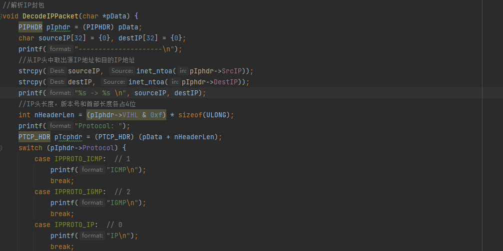

# 计算机网络课程设计

> **前言&&后言：**
>
> 这是一份我在完成我们学校课程设计报告的“草稿”，与其说是草稿不如说更像我的心路历程。虽说是草稿但是一开始就是为了供大家参考诞生的，面向对象主要有两类，不过主要是面向想深入研究但是确实还没开始计算机网络的学弟学妹（毕竟如果你在技术啊啥的卷一点的话计网在课堂上确实难以深入）。如果只是要“完成”课设的，大可以把代码拿去，遇到问题了瞄一眼文档就行。
>
> 学习是会产生兴趣的，毕竟一开始我看着这个也挺头疼的，当时想的是ffj写完借我抄抄，但是没想到人家写的是Go & Unix，咱这种平民还是碰不得，所以只好自己研究。刚好疫情放假早，课设开始的那天我就回家了，所以就开始了早8-早11.5/午1-午5.5的高强度学习，偶尔晚上心血来潮9-11还能接着写点，7天，用了超过60h在这五个题上。
>
> 有意思吗？题目本身其实没有任何意思，但是求知过程一定是有意思的。可以看到文章中有很多超链，那都是我筛选出来的“宝物”，学计算机就是为了能用自己的技术实现自己的所想，所以我希望每一个读到这的你，都能找到自己的路，实现自己之所想。  ——By Alexie-Z-Yevich 2022.12.27

## 一、网络聊天程序的设计与实现

**完成于12/20号周二**

直接编译运行失败，原因是win下缺少可执行库文件，根据附件中加上#pragma comment(lib, "ws2_32")头文件也不好使，一度以为是Win11的锅，但是查看Windows下system32的lib库发现有ws2_32.dll文件。又以为是编译器的问题，了解了下MinGW，下载了最新版的MinGW64，但是问题还是没有解决。最后采用在编译命令后添加一个参数`-lwsock32`可以编译运行。

感觉非常不方便，于是学习了下cmake编译，但是采用cmake编译的问题更多了，期间遇到了g++和gcc配置问题、make环境缺失问题、编译指令报错问题，好在经过一上午试错最终能用cmake将第一题成功编译运行。使用cmake后就不需要在每次编译时添加-lwsock32参数，只需要在项目前加上link_libraries(ws2_32 wsock32)就能打包，可以重复使用的同时还能批量编译多个文件。

输出结果如下：

多次执行得到的效果如下：

可以看出服务端一直在等待应答，但是客户端发送一次消息之后就停止了，尝试将代码改成双端通信。首先先简单的将客户端的代码改成while(1)，但是并没有得到想象中的两边通信的效果：

对此我对这个不甚理解，于是将main函数中的所有内容都放到了while(1)中间，这个时候就实现了双端持续通信（但实际只是不断new了一个Client进程，本质上和多次启动并没有区别）。但好消息是知道了必定有什么东西阻塞了进程，根据下图，因为Server端的服务没结束，而Client端的消息没发出去，所以基本可以确定是在下面五个环节出了问题。

这时候我就注意到：close结束了这段通信，那么有没有可能不结束通信就能保证两个服务的持续连接呢？然后得到了理想的结果：

又经过简单的研究，发现closesocket(sockClient);并不影响通信，因为即使关闭了socket的连接，也会在每一次循环中connect重新连接上。查了下WSACleanup();函数，发现其作用是终止Ws2_32.dll 的使用，得，换个说法就是把服务给干没了，于是变成了单方面接收消息的工具，发送消息的地址信息填入不了自然就无法发送数据了。那么这时候再来实现服务端和客户端的持久交互就简单了：

上述流程简单介绍一下：首先要是实现“交互”，但是源代码中的两个流程都是先发送再接收，这就会造成进程阻塞后变成需要先发消息才能看到对面发来的上一条消息，考虑到一般服务端主要用作响应，所以把Server的recv放到send之前即可。标头和结尾结束进程太简单了就不过多赘述。展示下源码：

服务端主要修改后：

客户端主要修改后：

**12/26周一**

**本来以为这一题已经结束了，但是这两天和计科的同学交流的时候发现他们老师要求比较严格，要求他们实现多服务端通信。先说结果：以我的水平没能完成多线程通信，但是还是做了很多工作，下面只是部分我的一些浅显的逻辑：**

可以看到，当不开启多线程的时候消息回复非常的杂乱。从结果来看，Server端确实异步响应了两个Client的请求，而且因为阻塞的缘故，是轮流对Client进行处理。Client之间互相不会通信，所以大致思路如下：

1）Server端开启多线程，响应多个Client端的请求

2）改进下标识，因为一个端口不可能被多个服务占用，所以暂打算使用端口号作为Client的表示符。

当时讨论的时候问了下他们怎么做的。。。好家伙，很多都是直接博客上抄的，这里附上可供借鉴的博客[网络聊天程序的设计与实现](https://blog.csdn.net/m0_45948011/article/details/122351720?spm=1001.2101.3001.6650.6&utm_medium=distribute.pc_relevant.none-task-blog-2~default~CTRLIST~Rate-6-122351720-blog-85257238.pc_relevant_multi_platform_whitelistv4&depth_1-utm_source=distribute.pc_relevant.none-task-blog-2~default~CTRLIST~Rate-6-122351720-blog-85257238.pc_relevant_multi_platform_whitelistv4&utm_relevant_index=12)，不过代码使用C++完成且改动较大，因为指导书第一题给的代码是C，所以我还是尝试用自己的逻辑在指导书原C代码上修改。（不过这个学长的博客的流程图和第六题电子邮件都对我的思考起到了很大的帮助）

我主要参考博客[【多线程】c语言中的多线程](https://blog.csdn.net/yizhizainulii/article/details/124387556)对代码进行修改，但是效果并不理想，加入了上锁操作后更是乱得一塌糊涂，执行效果如下：

仍然是异步通信且执行规律我都没摸清楚，有时候能和单个Client通信两次，有时候Client收到通信发出的消息直接进入等待。可能我还是对多线程不是很了解，通过C语言去写多线程我的兴趣不大，所以暂时搁置在这里。

## 二、Tracert 与 Ping 设计与实现

**完成于12/21周三**

这一题和第一题一样，直接编译会报缺失。但是我用cmake打包完成后的exe文件运行不了。这让我百思不得其解，尝试去掉link_libraries(ws2_32 wsock32)这段代码发现cmake也无法打包，也就是说并不是在库连接上出了问题，尝试了大概2h后只能放弃，又回到用g++编译的方式。

一开始采用-lwsock32进行编译，仍然有一个库文件缺失，这时就没有办法了编译成功。于是我去了解了下-lwsock32这段代码的意思，发现原来就是link wsock32库的意思，结合cmake上link_libraries(ws2_32 wsock32)同时链接了wsock32和ws2_32两个库，抱着试一试的心理用-lws2_32去编译，结果成功了。

参考博客[MAKEWORD(2,2)解释](https://blog.csdn.net/happy_xiahuixiax/article/details/72637370)了解了MAKEWORD函数真正的意思，也清楚了和第一题中MAKEWORD(1,1)有什么区别，但是对于其具体初始化的作用还是不太了解。

参考博客[网际校验和算法](https://blog.csdn.net/f2157120/article/details/86497152)了解了下代码中计算网际校验和函数的作用，看了下代码流程大概就是将ICMP的报文头加数据字段经过校验和，生成cksum。因为我也学的不太好，但是根据后面来看没有用到cksum的地方，所以猜测是发送过去给对面机器进行内容校验的数据，这里只是模拟生成的格式。

简单说下我对使用ICMP协议的整个程序流程的理解吧：

除去一大段制定格式规范的代码（看懂了大概1/3吧，但是要我写肯定不会写），从while (!bReachDestHost && iMaxHot--)开始执行跳站/判断IP是否连接。一直到sendto(sockRaw, IcmpSendBuf, sizeof(IcmpSendBuf), 0, (sockaddr *) &destSockAddr, sizeof(destSockAddr));上面仍然是指定ICMP报文规范，这里destSockAddr中填充的就是我们输入的目标IP/域名。

再到下面的while(1)，while(1)的作用是持续接收返回报文，如果没有返回报文就是两种情况：发送报文丢了/返回报文丢了。但无论是哪种情况都需要我们重新发送报文，此时iTTL+1，记为跳站一次，超过最大设置的跳站次数DEF_MAX_HOP（30）就可以认定发送方不在线。而对于有返回报文的情况：

DecodeIcmpResponse函数是对返回报文的格式校验，也算是配置的一部分吧，看懂的也不多。主要印象深刻点的就是执行的操作：如果用户输入的是IP，IP成功通信后，输出IP地址就能直接结束，不会继续接收报文；但是域名不同，比如说www.baidu.com，我不是很懂为什么有那么多的IP响应，一开始猜测是一个域名下可能有多个IP地址(或者通过不同IP转发)，但是马上我就发现了不对，我抱着玩一下的心理ping了下自己的云服务器，输入的是域名www.fenrisx.top。

我的云服务器只有一个IP，不可能和百度啥的一样有很多个IP，那么就不可能是为了防止“恶意连接”发送的假IP，而且我发现停止的时候并没有进行30次连接，而最后一次的IP正是正确的IP。我又试了下百度的连接，发现最终停止的IP都是一个，所以和我一开始认为的超时停止接收不太一样。开始写这段的时候还没意识到到底是怎么回事，截图的时候发现第一次/第二次连接都是192.168.31.1/192.168.1.1，我对这个可太敏感了，这就是标准的配置虚拟机的IP前缀，我在未开启虚拟机的时候访问会超时，但是开启虚拟机的时候一次就访问成功了。

虽然没有直接依据，但我大胆假设这应该是先访问查找内网的IP，结合老师上课说过的IPv4地址分类，我觉得这是发送报文这个过程就是一个不断向外抛的过程：先是询问内网是否存在这个IP，不存在就获得内网的返回报文，再逐级向外发送报文，如果目标IP位于某一级IP地址下，就能通过那一级IP地址向下发送报文，（不太确定是不是代理）回传给本机，最后得到IP/域名的准确地址。

到这差不多就是我理解的题目所给的代码程序了，不一定对但是大体上被我臆想理解了，欢迎各位指正，下面就是实现测试本局域网的所有机器是否在线的代码。（因为我不会用C/C++画GUI，但是要求使用C/C++，所以就直接命令行解决了哈）

设计思路：

1）输入一个起始IP地址，输入一个终止IP地址

2）对范围内的每个IP发送一遍报文

3）记录下每个IP的在线状态

主要代码为两部分：

第一部分为对范围内IP的+1操作：

第二部分就是筛选输出部分：

最终输出结果如下：（这里我为了快速结束，将跳站大小改成了5，同时开了3台虚拟机在节点192.168.10.130/131/132上）

## 三、基于 IP 多播的网络会议程序

**开始于12/22周四但是花了一整天无法完成**

首先在书本源码的启动上就遇到了问题。在没搞清楚receiver和sender哪一方需要先启动时，我将两种情况都尝试了下，结果：

无论谁先启动，后启动的都无法加入多播组。看报错：receiver是无法绑定，而sender是无法加入多播组，但是根据代码大题内容来看，sender是没有bind这一过程的，所以说sender也可能是在端口的地方就已经挂掉了。因为双方都能单独启动，所以初步估计代码肯定没什么问题，猜测问题主要是在端口/加入多播组的过程（但是我的常识和第一题告诉我一个端口可以有多个监听但不能有多个占用），抱着这种疑惑开始对整体流程的一个研究。

首先查报错码10048，查到博客[套接字服务器绑定失败，错误 10048](https://www.cnblogs.com/liujx2019/p/10811330.html)了解到是地址已在使用中，那么和我想的端口占用比较相似。

然后就卡在上面这部分，卡了大概3个多小时。一开始以为是加入多播组的问题，反复的查资料看视频了解IP多播，但是发现没啥用，代码无论是理论还是逻辑都没有问题。最后：

反复看报告发现居然是多台PC。。。那我花这么多时间实在是太冤枉了。然后编译完成后拷贝到多个PC使用，但还是不行，服务确实都启动了，但是receiver接收不到消息。查阅很多博客了解到可能是网卡的问题，期间通过[不同主机收不到组播消息原因分析](https://blog.csdn.net/HYZX_9987/article/details/125008550)该博客了解到多播IP地址的选取，以及多网卡情况下组播发送不成功。

我用其他PC以及虚拟机都进行了尝试，但是实在是接收不到，不用的网卡全部禁用也无济于事，因为双端没有任何通信，也无从查到报错信息，加上我对路由也不是特别了解，不可能我把家里的路由器给拆了研究下，所以这个实验到此我个人已经没办法推进了。就先记录到这里。

**12/24晚上10点实现了交互**

在这两天的时间中我尝试了各种办法，先说结论吧，其实并不是之前的过程有问题，而是太相信我的打包代码了：上面我提到了端口占用，是的！一开始为了避免这种情况我将receiver和sender的端口修改成了不同的！然后传输到其他PC上的端口不一致，所以接收不到消息。今天解决的契机其实也和我这几天的不断尝试有关：我不断地整我的各个设备（后面会讲到过程中间我做的改动和学到的部分知识），中间甚至把我们家的中继路由玩坏了一次（没错，就是我们家的路由器和一个Wifi放大器，因为中间有一段时间我以为是IP分配的问题），这个时候我就再考虑是不是把我的主机网络环境搞烂了，这时才终于决定用我的笔记本作为sender而主机作为receiver，然后：成功通信了！！！

这个时候意识到是代码的问题时，我已经对主机/笔记本的四个地方进行了修改：防火墙配置、PING服务、网卡配置以及在以太网中开启可靠多播协议。（以下内容虽然和课设无关，但是是我学习得过程，故在此记录）

筛选问题的方式很简单：主要设备为已经修改过的主机、笔记本，和未经过修改过的win11虚拟机（之前测试的虚拟机又有它的用途了！）

我先把两个开启PING服务的电脑服务关闭，重启仍然能正常通信，完美（开启PING服务我参考的博客[Windows 10操作系统中开启Ping功能（ICMP）的方法](https://blog.csdn.net/liitdar/article/details/127370076)，主要是最近一直在整虚拟机，遇事不决先PING，我看两个PC PING不通以为影响了数据的传输。）

防火墙配置无需多说，嗯一般我的电脑到手防火墙就关了。

可靠多播协议是我无意间配置网络环境的时候找到的，本来以为IP多播是默认关闭的，完事之后越想越觉得不对：IP多播不是上网的一个必需品嘛。。。于是就顺藤摸瓜查了下，根据百科[可靠多播协议](https://baike.baidu.com/item/可靠多播协议/19224777?fr=aladdin)，了解到这其实是一种加强多播利用率，提升系统资源的方式，和我的结果并没有影响。

最后就是网卡地址配置，其实2天前我就找到了这个问题，也试着解决（但是当时真没想到是代码问题）。参考博客太多这里就不例举了，查IP多播通信网上一大堆。简单来说就是需要两个程序保持在同一IP频段下，就比如说假定我的路由是192.168.31.1，那么我的通信设备需要为IP 192.168.31.\*，这样才能实现多播通信。（在写这段话的时候我忽然想到了如果别人知道了这个IP，能不能成功黑我的电脑？最近刚好有在看网络安全的书，所以上去搜了下怎么通过IP黑入电脑，看的博客就不细说了，最后的结论就是：192.168.31.\*其实是小米路由器分下来的私人频段，靠这个好像黑不到我的电脑【最主要是我自己也没成功把我的笔记本给黑了】，参考文章[路由器IP和电脑IP有什么区别](https://www.xinqtech.com/smart/202108/1920852.html)。）但在研究“黑客技术”的过程中找到了一个有趣的Tracert xxx.xxx.xxx.xxx命令，显示结果如下：

欸？是不是和实验二很像？实验二也叫Tracert，所以其实就是封装了一下我们实验二的内容（稍微高级一点），可以看到，Tracert可以读取链路上的机器名称，XiaoQiang正是我的路由器的名字。虽然和实验无关，但是遇到了觉得有意思记录下。（打码是害怕有人能顺着网线来爆破我）

因此，当我把以太网2/3禁用后，两台电脑就能实现IP多播通信了。（这里以太网2/3是VMWare创建的虚拟网卡，因为是连接状态，所以启动receiver服务会先找以太网而不是WLAN）同样我又进行了虚拟机的测试：我禁用了WLAN和以太网2，以太网3的地址是192.168.10.*，和我的虚拟机IP一致，这个时候就能实现虚拟机和主机间的通信了。

之后我又好奇了下这个程序的执行：如果多台设备通信会如何呢？我把虚拟机的网络连接模式改为桥接，那么虚拟机启动后会像路由申请一个IP，尝试通信能够成功！最后在我的测试下：当有两个（多个）sender时，发送的消息receiver都能接收；当有两个（多个）receiver时，sender发出的消息能被多个receiver接收。（但是仍然有丢包率，可能和我的工作区离路由比较远的缘故/抑或是我在路由之间使用了一个Wifi放大器）

**12/25完成了实验**

再次，首先强烈指责指导书的代码错误：

这是函数While中输入QUIT结束循环的部分，recvbuf[ret] = '\0';需要放在if外面执行，strcmp需要读到 '\0'结束，如果不改变位置实际上需要两次输入QUIT才能退出循环，因为上一次的'\0'留下了。第一次QUIT会被receive端正常输出，但是此时sender端会执行QUIT结束，需要再开一个sender输入第二个QUIT。

找到这个问题实际上很心酸（花了差不多两个小时），起因是我想实现receiver端接收到固定开始命令再进行显示，修改代码如下：

执行效果如下图：

但是在修改代码前无论如何都接收不到开始命令START，我尝试重复copy新代码再进行修改，修改前能正常通信，但是修改后同样不行。因为sender端改动不大，所以我的主要目的就是放在receiver端。我在经过逐行比对之后发现啥问题也没有。本来准备放弃草草了之，但是实在是不好意思这个实验都做到这个地步了半途而废，所以我开始对课程设计指导书的代码逐行实现。

执行到QUIT的部分，欸，问题出来了：

这个“QUIT”直接输出了！但是我执行第二个QUIT之后成功关闭了。我的第一反应不是代码问题，而是经过昨天的事后想到的是多个连接，我以为是因为在整个链路上有不止一个receiver/sender导致的关闭需要执行机器数个。但是在我修改了MCASTADDR多播组地址后情况并没有改变。到这已经花了一个多小时，最后只好输出strcmp的值来验证，但是发现每次输出都是1，这就说明传过来的比“QUIT”字段要长啊。但我依然没有意识到这一点，而是专心去找strcmp函数出错的可能。对我帮助比较大的博客[解决strcmp的错误以及VS的快捷键](https://blog.csdn.net/weixin_34341229/article/details/93444463?utm_medium=distribute.pc_relevant.none-task-blog-2~default~baidujs_baidulandingword~default-0-93444463-blog-102492821.pc_relevant_recovery_v2&spm=1001.2101.3001.4242.1&utm_relevant_index=3)，这个时候我就重视起了recvbuf[ret] = '\0';的作用，虽然查了不少博客但我本身对C/C++并不很感兴趣，所以大致浏览了下就过去了，反正问题是解决了。（其实后面想想可能起的是个过滤作用）

最后加了个system("pause")暂停窗格使得实验结果能够保留，至此实验三我是在不想碰了。。。

## 四、网络嗅探器的设计与实现

**12/23周五理解了代码逻辑**

这一题的代码是在Linux上的C代码，头文件给少了两个（其实不是这个的问题），编译通过后会报隐式函数的Warning，但是程序能够正常编译且能够正常运行。但是一开始我运行的时候输出结果如下：

我就纳闷了：根据结果来看这不应该是看看有什么协议通信吗？（当然此时我并没有阅读代码，只是尝试运行）但是全是22端口的TCP通信让人很难理解。我的第一反应是缺少的头文件让隐式函数陷入了循环。很快我就找到了htons函数的头文件#include <arpa/inet.h>和exit()函数的头文件#include <stdlib.h>，果然不报Warning了，运行结果如下：

确实都不是22了，但是真的是因为头文件吗？其实不是的，之后我会提到。这个时候我就开始看源代码了。首先在while(1)之前的都是定义操作和初始化，但是后面的流程实在是看不懂，于是我尝试阅读指导书，关键是这段：

以我的理解也就是说：它不同于传统的监听端口，而是对整个传输过程的一个复制，所以不需要绑定端口和监听端口，在创造sock的时候就会自动开始记录主机中的报文传输。

这段是比较重要的一段，它其实就说明了整个socket切分的流程（前14位记录目标地址、起始地址和类型/长度，中间20位是IP头，后面8位是协议头）所以没接到一个套接字，就检测下它是不是42位的，小于42位说明传过来的不完整，没必要解析。因为MAC地址的解析与IP的解析过程一致，所以我用下面这一段关键代码讲讲自己的理解：（因为我C语言功底确实不行，所以参考了很多资料）

首先是& 0XFF，参考博客[带你在过程中理解&0xff](https://www.bilibili.com/read/cv5667133/)，了解到，sock过来的应该是Byte类型（虽然定义是char），那这个操作就是保证二进制补码的一致性。而后是输出格式%02x和%.2x（这里截图少截了一点），这里我花了大量的时间查这俩有什么区别，最后得出的结论是：没有区别，而它的作用就是为了转换为16进制数，转换为常见的MAC格式（主要是不足两位的补齐，超过的原样输出），不过这里算是因为个人基础不牢，推荐博客[C语言中（%d %.2d %2d %02d）（%2x, %02x, %-2x, %.2x）（%f, %.2f, %2.2f）（%e, %.2e,%3.2e）的区别](https://blog.csdn.net/m0_65601072/article/details/124902817)巩固下基础。还有一个就是位移运算，以上图p = iphead + 20举例，实际上应该是让p等于iphead20位之后的内容，这里我看逻辑说得通了也就没往下查了。

再往下就进入了switch选择中，其实最开始是查的这一部分，当时不知道是Byte类型，所以不是很懂为什么proto明明只有一位但是能代表17、255这些数字。这些数字是从[IPPROTO_ICMP_百度百科](https://baike.baidu.com/item/IPPROTO_ICMP/19519008?fr=aladdin)查到的，但是实际上是winsock2.h文件中的，没错，其实是Windows下的定义，这些数字也只是代表Windows下的默认编号，很抱歉没有查到Linux下的具体文件，根据最后一个default推测是定义在include/linux/in.h文件中，但是这个阶段我还不是很熟练Linux编程，没能找到这个目录（可以在虚拟机中下个CLion但是太花时间了）。IPIP是隧道协议，根据我查到的内容来看并不是Windows下的协议，因为与课设关联不大，所以只看了篇[Linux IPIP隧道协议](https://www.cnblogs.com/jiangshubian/articles/16272522.html)简单了解了下就过去了。

大概根据这么个流程来执行，我大概了解了整个代码的运行流程（虽然简述很短，但实际上到这里已经花了4h以上了）这个时候就能显著了解到：**因为缺少头文件执行出来全是TCP22的输出是不正确的。**真实的情况实际上是图一是我采用本地终端远程ssh连接到虚拟机上的，所有的消息都需要通过22端口进行转发，此时其实也有其他端口和其他协议，但是因为这个请求的持续执行，所以不断请求22端口导致其他端口的回复被掩埋了。

OK，现在才能正式开始网络嗅探器的设计。

**12/125周日、12/26周一完成剩下的部分**

还是有自知自明的，虽然能看懂大部分代码了，但是让我上手写确实十分吃力。因为Linux端的代码课程设计上的给得已经很完美了，所以只好尝试写个Windows上的Raw Socket。大概流程如下：

创建Row Socket --》将Row Socket绑定到本地网卡 --》 用个啥玩意监听/接收IP包 --》解析IP包数据

不断看博客发现那个“啥玩意”是**SIO_RCVALL**（其实是看了不少大佬的实现代码），关于SIO_RCVALL可以参考微软官方[SIO_RCVALL 控制代码 ](https://learn.microsoft.com/zh-cn/windows/win32/winsock/sio-rcvall)，讲真这玩意没水平都不一定看得懂，反正我就挺没水平的。。。主体代码如下（刨去了初始化过程，毕竟初始化题一题二题三都有，c/cpp的都有）：

（有注释的地方很多都是从各个大佬的代码里抄来的，值得注意的是：对于Row Socket的创建Windows和Linux一样，都需要管理员权限）

关于TCP/IP结构的来源也是在网上查询使用的，看这个比较全就全部采用了，实际上并没有使用到这么多东西，主要是一个Protocol协议的判断、端口的判断和IP地址的判断。关键代码如下（也只有这里大部分是自己写的）：

这里就是对IP报文的地址、协议、端口进行拆分，模仿附录四中的代码修改的，因为有之前对Linux版的代码解释，这里就不过多赘述了。运行结果如下：

这里建议使用终端（cmd/powershell之类的，我这里使用的是Tabby，最近发现的好用的开源软件【夹点私活】）打开exe文件，因为写的while循环没有终止条件，所以一旦退出就没有显示可以保留了。可以观察到大部分协议都是TCP/UDP，但是其实并不是只有他俩，我还观察到了ICMP协议。写到这里，搞得我又想修改下代码了。。。

好的，我又回来了，把TCP/UDP协议过滤掉之后，控制台成功输出了ICMP协议，但是呢并不是等待就会出来的。。。我发现这个需要你点击浏览器发送新的互联网请求才会生成ICMP协议，ICMP协议是一种面向无连接的协议，用于传输出错报告控制信息。我想大概是确定是否成功连接才存在的吧，因为在浏览器成功回显的时候控制台才有输出，并且是输出2条以上，大概是发送n条、回传一条（没有成功访问报文大概会丢弃？因为控制台没有输出）

然后是之前图上的红色部分，代码中将TCP头过滤掉之后能显示出发送的内容是什么（大概），这里主要监听了80、8080和21这三个常见的互联网端口。这个时候我又好奇了，我之前在过程中看到了80端口的回复那么是不是可以物理层面上见识下TCP三次握手？说干就干：

过滤掉无关代码，只保留TCP连接的监听，同时输出发送方/接收方的消息，得到结果如下：

当然，每次请求的次数是不一样的，内容其实也不是这些东西，只是因为在UTF-8编码下长这样，但是大概还是感觉能表现TCP三次握手：我观察到的是每一次相同的send的请求必须要收到至少两次相同receive才会改变内容，的确没观察到单个send之后就改变了内容的输出。不过诧异的是receive返回并不包含任何消息（但是其实给了个IP），总之最终是不是TCP三次握手我也不能确定，但是在我心中它就已经是了。

* 顺便补充下要注意的点：VMWare是真的很恶心的但是你又不得不用它，IP绑定其实默认绑定在以太网上，也就是我笔记本没装VMWare没有虚拟以太网服务，这WLAN分给的IP绑定不上。。。从图中也可以看出：明明IP是192.168.85.1，但实际绑定的是192.168.31.220，前者是虚拟机以太网服务，后者是真正的路由分配给的IP，但是实际上这里是通过虚拟以太网监听WLAN得到的结果（大概）。但是又有一点要注意：VMWare默认会创建两个以太网，报文通过第一层以太网之后会转发给第二层以太网，这时候问题就出现了：所有的协议都是转发过来的，和之前Linux ssh一样，所有的报文变成了UDP报文，这在开始也困扰了我很久。（当时第三题还没解决，第三题解决的时候我就推测可能是一样的问题了）。
* 以上注意完全是我遇到的问题结合个人推测，各位以实际情况为准。

**最后，第五题的话Wireshark其实我下了，也大概看了下它的流程和结果，理论山其实和我这里监听80/8080/21端口的意思差不多，但是实际上要做的处理和分析的工作量是巨大的（光还原报文剩余部分的机器码就得查很多资料），个人建议第五题不用太放在心上，不然消耗的就是青春和头发。**这里放一张Wireshark的运行截图证明我来过：

## 五、电子邮件客户端程序设计与实现

**完成于12/27周二**

惯例吐槽一下指导书：书本6.5节有教我怎么写代码吗？看完之后和没看差别不大，格式和流程都说的不是很清楚。挑这一题主要不是为了完成指导书上的题目（因为三个就足够了），而是对于实现电子邮件发送比较好奇：我们在生活中经常能够收到类似于Github/Steam等网站发来的官方消息，是有一个人在后台给你实时发送吗？还是写了个图形化捕捉脚本？都不是，正确的方式应该是写一个完整的流程，在本地填充邮件内容后批量发送给用户。那么在这里，用到的传输协议就是SMTP/POP3，关于协议内容可以自行看书或查资料了解。

因为主要目的是为了学习，所以这里使用Java进行编程，直接参考别人的实验进行理解。如果有时间我会修改成C/C++用来完成课程设计。主要参考博客[Java网络编程：实现QQ邮件发送客户端](https://csdn-czh.blog.csdn.net/article/details/110913974)的思想，但是其中过程太过复杂，从学习层面上升到了应用层面，只有一个简单的Java类，需要实现邮件客户端交互得自己写主类。所以实际上我是参考[JavaMail--基础类详解](https://dandelioncloud.cn/article/details/1548136622394716161)和[JavaMail详解](https://www.dandelioncloud.cn/article/details/1515189508248227841)这两篇博客，通过JavaMail API进行编写。（需要用到JavaMail API，两个jar包为javax.activation和javax.mail，但是这两个jar包并不是JDK自带的，所以需要自行下载导入）第一版代码如下：

这里配置的是一个通过QQ邮箱发送邮件到谷歌（GMail）邮箱的代码，执行成功如下图：

通过代码不难看出（毕竟每一行的注释我都给出来了），只需要简单的设置协议、封装对象，就可以使用通过SMTP协议实现两个邮箱之间的通信。类似于时间、发件人之类的配置，则是根据发件方邮箱的安全系数来指定的。（QQ邮箱的安全校验过于严格，而类似于163邮箱甚至允许没有发件人进行邮件的发送【这我也是听说的，没有亲自尝试】）

基于SMTP协议的邮件发送大致就是这样，在查阅资料的过程中还发现了JavaMail API可以实现POP协议查看邮箱中的邮件功能，POP允许本地计算机上的用户代理程序连接到邮件服务器，将用户的邮件取回到本地。实现代码和结果如下：

可能是QQ的反扒机制吧，不可能输出所有的邮件，大概输出了5封左右控制台就报错了，可以通过休眠等方法避免（大概），这里就不做尝试了。

最终将代码修改成可以自定义的模式：

这里邮件服务因为配置的是pop.qq.com所以只能从QQ邮箱拿邮件（其实配置谷歌我也试过了，但是一直拿不到，洋人的玩意就是难用），只需要修改stmp/pop中的协议适用对象就能实现不同邮箱的登录、查看。关于C++版本的代码也大概写出来了，不过是和别的同学一起完成的，和Java最大的不同就是：C++使用底层实现SMTP，**配置都是即时的**。

什么意思呢？以下面这段SMTP部分核心代码为例：

在创建socket套接字后并不是一股脑把配置填进去，而是连接上服务器后，先发送使用邮箱方的请求，再选择登陆方式，最后输入base64编码格式的账号和密码。没错，参考博客[为什么要用base64编码](https://blog.csdn.net/qq_25258019/article/details/126188844)，SMTP最底层仍是使用base64编码的方式进行数据传输，因为在线转base64编码太麻烦了，所以这里事先就把发信邮箱已经填上去了。同样，QQ对于Message的校验非常严格，例如这种发件人到收件人的配置，使用Java语言是完全不需要配置的，但是再C++中但凡出错一点，邮件就直接发不出去了。

上面这段Message内容要求格式的绝对对齐，都快赶上像是一种填充html的形式了。POP3的代码和这类似，在这就不做展示了，唯一的区别就是POP3协议的连接采用明文，不需要将账号密码转化为base64格式。最后测试结果和输出结果如下：

C++版本确实不太行，主要是代码复杂且报文会丢。。。这我是没想到的，我的第三次发送直接石沉大海了，但是第三第四次代码完全没有改动。。。发送报文丢了recv都不会有回复，这个时候程序就卡死在了recv阶段。总之，这个实验就这样吧，再往复杂的走还能做的处理很多，不过能独立把Java版本掌握我已经很满足了。