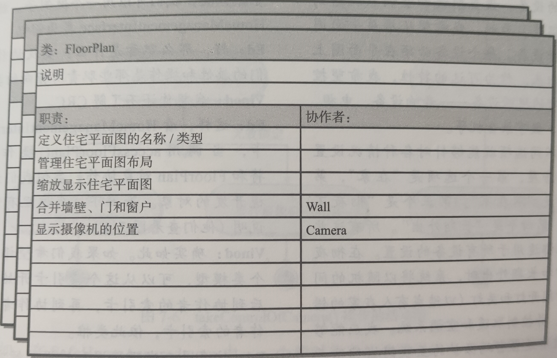
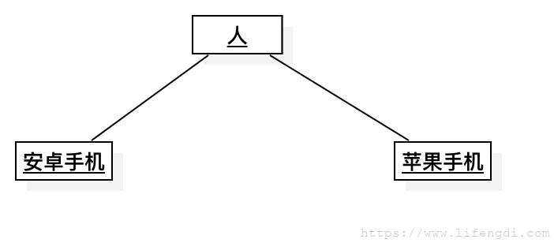

# 软件工程

> **前言：**
>
> 开始打算按照这第九版教材的课后习题做一个个人解答文档，然后发现——课后题内容太宽泛了，鄙人水平不足，误导大家就不好了；然后决定把书的章节精简整理，看书看到第三章越看越不对劲——老师上课完全没讲书，万一写多了最后不考岂不是害了大家？所以最后取了个折中的办法——对书本的前11章节内容进行精简学习，然后着重研究下软件工程中常见的九种图。
>
> 希望对正在看该文档的你有所帮助。
>
> 更新：后期老师专门画了下重点，所以会在文档种我认为比较重要的地方打上**【重点】**标记，可以从目录进行索引。Github不支持目录就算了。

## 第一章 

#### 【重点】定义

软件工程包括过程、一系列方法（实践）和大量的工具，专业人员借由这些来构建高质量的计算机软件。

软件具有产品和产品交付载体的双重作用。

软件是：

- 指令的集合（计算机程序），通过执行这些指令可以满足预期的特性、功能和性能需求；
- 数据结构，使得程序可以合理利用信息；
- 软件描述信息，它以硬拷贝和虚拟形式存在，用来描述程序的操作和使用。

#### 软件应用领域

计算机软件分为七大类：

- 系统软件。一整套服务于其他程序的程序。
- 应用程序。解决特定业务需要的独立应用程序。处理商务或技术数据，以协助业务操作或协助做出管理/技术决策。
- 工程/科学软件。“数值计算”类程序。
- 嵌入式软件。存在于某个产品或者系统中，可实现和控制面向最终用户和系统本身的特性和功能。
- 产品线软件。包括可复用的构件，并为多个不同用户的使用提供特定功能。
- Web/移动App。以网络为中心，其概念涵盖了宽泛的应用软件产品，包括基于浏览器的App、云计算、基于服务的计算和安装在移动设备上的软件。
- 人工智能软件。利用启发式方法解决常规计算和分析无法解决的复杂问题。

#### 软件过程

###### 过程框架

沟通——策划——建模——构建——部署

###### 普适性活动

- 软件项目跟踪和控制
- 软件质量保障
- 技术评审
- 测量
- 软件配置管理
- 可复用性管理
- 工作产品的准备和生产

#### 软件工程实践

###### 实践的精髓

- 理解问题（沟通和分析）
- 策划解决问题（建模和软件设计）
- 实施计划（代码生成）
- 检查结果（测试和质量保证）

###### 通用原则

- 存在价值。一个软件系统因为为用户提供价值而具有存在价值，所有决策应该都基于这个思想。
- 保持简洁。所有的设计都应该尽可能简洁，但不是过于简化。
- 保持愿景。清晰的愿景是软件项目成功的基础。
- 关注使用者。在需求说明、设计、编写文档和实现过程中，牢记要让别人理解你所做的事情。
- 面向未来。永远不要把自己的设计局限于一隅，构建可以解决通用问题的系统，为各种可能的方案做好准备，而不是仅仅针对某一个具体问题。
- 提前计划复用。提前做好复用计划将降低开发费用，并增加可复用构件以及构件化系统的价值。
- 认真思考。在行动之前清晰定位、完整思考通常能产生更好的结果。

------

## 第二章 过程模型

在开发产品或构建系统时，遵循一系列可预测的步骤（即路线图）是非常重要的，它有助于及时交付高质量的产品。软件开发中所遵循的路线图就成为“软件过程”。软件过程提高了软件工程活动的稳定性、可控性和有组织性，如果不进行控制，软件活动将变得混乱。

软件过程定义为一个为创建高质量软件所需要完成的活动、动作和任务的框架。

线性过程流（linear process flow）从沟通到部署顺序执行五个框架活动；

- 

迭代过程流（iterative process flow）在执行下一个活动前重复执行之前的一个或多个活动；

- 

演化过程流（evolutionary process flow）采用循环的方式执行各个活动，每次循环都能产生更为完善的软件版本；

- 

并行过程流（parallel process flow）将一个或多个活动与其他活动并行执行。

- 

#### 【重点】过程模型的对比

|     模型     | 概述                                                         |       图像       |                             优点                             |                             缺点                             |
| :----------: | ------------------------------------------------------------ | :--------------: | :----------------------------------------------------------: | :----------------------------------------------------------: |
|   瀑布模型   | 瀑布模型（waterfall model）又称为线性顺序模型（linear sequential model），提出了一个系统的、顺序的软件开发方法。 从用户需求规格说明开始，通过策划、建模、构建和部署过程，最终提供完整的技术支持。 |  | 容易理解和计划； 适用于充分理解的小型项目； 分析和测试是顺序线性的 | 不能很好的适应变化； 测试在过程的后期进行； 客户确认在最后阶段 |
|   原型模型   | 原型开发范型开始于沟通。 软件开发人员和其他利益相关者进行会晤，定义软件的整体目标，明确已知需求，并大致勾画出以后再进一步定义的东西。 然后迅速策划一个原型开发迭代并进行建模（以“快速设计”的方式）。 |  | 变更需求对后续设计影响较小； 客户很早并频繁的参与其中； 对小型项目来说效果好； 产品失败的可能性降低 | 客户的参与可能会造成进度延误； “提交”一个原型，可能会造成初步完成的假象； 原型被抛弃导致工作白干了； 很难计划和管理 |
|   螺旋模型   | 螺旋模型是一种演进式软件过程模型。它结合了原型的迭代性质和瀑布模型的可控性和系统性的特点。它具有快速开发越来越完善的软件版本的潜力。 螺旋模型将软件开发为一系列演进版本。在早期的迭代中，软件可能是一个理论模型或者原型。在后来的迭代中，会产生逐渐一系列逐渐完整的系统版本。 |  | 有持续不断的客户参与； 开发风险得到控制； 适用于大型复杂项目； 适用于可扩展产品 | 风险分析失效可能导致项目失败； 项目可能难于管理； 需要一个专家开发团队 |
| 统一过程模型 | 统一过程（Unified Process，UP）尝试着从传统软件过程中挖掘最好的特征和性质，但是以敏捷开发中许多最好的原则来实现。 它建立了迭代的、增量的过程流，提供了演进的特征，对现代软件开发非常重要。 |  | 重视文档质量； 有持续不断的客户参与； 适合需求变更的情况； 对维护项目非常有效 | 用例并不总是精确的； 具有复杂的软件增量集成； 阶段的重叠可能会带来问题； 需要一个专家开发团队 |

------

## 第三章 敏捷和敏捷过程【重点】

敏捷方法是为了克服传统软件工程中认识和实践的弱点而形成的。

不确定意味着变更，而变更意味着付出昂贵的成本，特别是对变更失去控制或疏于管理的情况下。而敏捷开发最令人信服的特点之一就是它能够通过软件过程来降低由变更所带来的成本。

敏捷是有效的响应变更，它鼓励采用能够使沟通更便利的团队结构和协作态度。它强调可运行软件的快速交付而不那么看重中间产品；它将客户作为开发团队的一部分开展工作，以消除持续、普遍存在于多数软件项目中的“区分我们和他们”的态度；它承认在不确定的世界里，计划是有局限性的，项目计划必须是可以灵活调整的。

强调这样一个增量交付策略：根据具体的产品类型和运行环境，尽快将可工作的软件交付给客户。

| 敏捷技术 | 概述                                                         | 图像             |                             优点                             |                             缺点                             |
| :------: | :----------------------------------------------------------- | ---------------- | :----------------------------------------------------------: | :----------------------------------------------------------: |
|  Scrum   | 应用Scrum原则指导过程中的开发活动，过程由“需求、分析、设计、演化和交付”等框架性活动组成。         每一个框架活动中，工作任务在相对较短的时间盒的期限内完成称为一个冲刺（sprint）。冲刺包括：冲刺规划会议、每日Scrum会议、冲刺评审会议、冲刺回顾。         冲刺中举行的工作适应于当前的问题，由Scrum团队规定并进行实施修改。 |  | 产品负责人设置优先级； 团队拥有决策权； 文档是轻量级的； 支持频繁更新 | 很难控制变更成本； 可能不适合大型团队； 需要专家团队成员 |
|    XP    | 极限编程（XP）包括策划、设计、编码和测试四个框架活动的规则和时间。 策划：策划活动从倾听开始，这是一个需求收集活动。 设计：XP设计严格遵守KIS（Keep It Simple，保持简洁）原则。不鼓励额外的功能性设计。 编码：XP建议，在故事开发和初步设计完成后，团队不要直接开始编码，而是开发系列单元测试用于校验本次（软件增量）发布的所有故事。 测试：所建立的单元测试应当使用一个可以自动实施的框架。 |  | 强调客户参与； 建立合理的计划和时间表； 开发人员对项目高度投入； 产品失败的可能性低 | 会受到“交付”原型的诱惑； 需要经常开会，导致成本增加； 可能允许过多的变更； 对高度熟练的团队成员有依赖性 |
|  看板法  | 看板法是一种精益方法学，提供了改进过程或工作流的方法。看板专注于变更管理和服务交付。 变更管理定义了将请求的变更集成到基于软件的系统的过程。 服务交付则专注于了解客户需求和期望。 团队成员管理其工作，并对于自组织完成工作给予充分的自由度。可根据需要逐步演化策略以改进结果。 |  | 预算和时间要求较低； 允许更早交付产品； 过程策略记录在案； 有持续的过程改进 | 成功与否取决于团队合作技巧； 糟糕的业务分析可能会毁了项目； 灵活性可能导致开发人员失去焦点； 开发人员不愿意使用测量 |
|  DevOps  | DevOps旨在将开发和运维相结合，尝试在整个软件供应链中应用敏捷开发和精益开发原则。设计一下几个阶段： - 持续开发。将软件可交付成果分解到多次冲刺中开发，增量由开发团队的质量保证成员进行测试。 - 持续测试。自动化测试工具用于帮助团队成员同时测试多个代码增量，以确保在集成之前它们没有缺陷。 - 持续集成。在此阶段，将集成代码部署（安装）到生产环境，其中包括准备接收新功能的分布在全球的多个站点。 - 持续监控。开发团队成员的运维人员通过监控软件在生产环境中的性能，并在用户发现问题之前主动查找问题，以提高软件的质量。 |  | 代码部署的时间缩短了； 团队包括开发人员和运维人员； 团队拥有端到端的项目所有权； 主动监控已部署的产品 | 存在处理新旧代码的压力； 成效严重依赖自动化工具； 部署可能会影响生产环境； 需要一个专家开发团队 |

------

## 第四章 推荐的过程模型

项目各不相同，团队也各不相同。没有哪种软件工程框架适合所有的软件产品。

#### 软件开发项目时应考虑的一些建议

1、在没有足够反馈的情况下，使用线性过程模型是有风险的。

2、计划前期获取大量的需求既无可能也无必要。

3、前期需求获取可能不会降低成本或者防止超时。

4、软件开发中需要适当的项目管理。

5、文档与软件应该同步推进，而不应当拖延到构建开始时。

6、应尽早并且频繁地让利益相关者参与到软件开发过程中。

7、测试人员应在软件构建前就参与其中。

#### 敏捷过程模型和螺旋模型对比

|           敏捷过程模型           |                螺旋模型                |
| :------------------------------: | :------------------------------------: |
| 不适合大型高风险或任务关键型任务 |       不适用于小型、低风险的项目       |
|      最少化规则、最少化文档      |    需要多个步骤，以及前期完成的文档    |
|       测试人员需要持续参与       | 测试人员的早期参与（可由外部团队完成） |
|         易于适应产品变化         |      在原型完成前难以进行产品更改      |
|     非常依赖利益相关者的交互     |  需要利益相关者持续参与计划和风险评估  |
|             易于管理             |        需要正式的项目管理和协调        |
|       尽早交付部分解决方案       |          难以判断项目结束时间          |
|         非正式的风险管理         |             良好的风险管理             |
|        内建的持续过程改进        |         项目结束时进行过程改进         |

#### 一些敏捷需求定义的最佳实践

1、通过匹配利益相关者的可用性以及评价他们的投入来鼓励其积极参与。

2、使用简单的模型（例如便利贴，快速草稿，用户故事）减少参与的障碍。

3、在使用需求表示技术之前，花一些时间来解释他们。

4、采用利益相关者的术语，并尽可能避免使用技术术语。

5、使用广度优先的方法来全面了解项目，然后再深入细节。

6、在计划实施用户故事时，允许开发团队及时完善（在利益相关者的参与下）需求详细信息。

7、将要实现的功能列出一个优先级列表，并首先实施最重要的用户故事。

8、与你的利益相关者密切合作，仅在创建下一个原型时记录对所有人有用的需求。

9、质疑是否需要维护未来可能用不到的模型和文档。

10、确保你具有管理的支持，以保证需求定义期间利益相关者和资源的可用性。

两个现实：

- 利益相关者不可能在看到可工作软件之前先描述出整个系统；
- 利益相关者很难在看到实际软件之前先描述出软件所应具有的质量需求。

#### 敏捷体系结构设计的四个关键要素

1、关注关键的质量属性，并在构建它们时将其合并到原型中。

2、在规划原型时，成功的软件产品会将客户可见的功能和基础体系结构结合在一起。

3、如果对体系结构决策和相关质量问题给予足够的重视，那么敏捷体系结构就可以实现代码的可维护性和可扩展性。

4、持续管理并同步功能需求和体系结构需求间的依赖关系，以确保不断演化的体系结构基础能及时适应未来的增量。

#### 第一个功能原型的过程

###### 1、从纸质原型过渡到软件设计

为系统创建纸质原型很划算，并且可以在开发过程的早期完成，可以避免浪费时间构建错误的原型。

###### 2、设计用户界面原型

创建用户界面原型作为第一个功能原型的一部分是一个明智的想法，客户发现软件产品易于学习和使用，他们更有可能使用它。

###### 3、创建一个虚拟原型

与在已完成的原型上添加新的用户界面相比，放弃早期用户界面设计的代价要小得多。

###### 4、将输入和输出功能添加到原型

添加输入和输出功能到用户界面原型，能提供一种可以测试演化中原型的简便方法。

###### 5、实现算法

实现算法涉及将你的想法和草图转换为程序源代码的过程。

###### 6、测试原型

测试原型以演示客户要求的功能，这样可以在像客户展示之前发现一些尚未发现的缺陷。

###### 7、考虑原型的部署

可以帮助你避免采用一些捷径，这些捷径会导致创建出的软件将来很难维护。

#### 获取原型反馈的最佳实践技巧

###### 1、在要求原型反馈时提供框架素材

允许用户主动提供反馈的机制，而不是对抗性的。

###### 2、选择适当的人，测试你的模型

对原型进行评价是降低产品开发出错风险的关键。

###### 3、提出合适的问题

所有利益相关者都同意原型的目标。

###### 4、像用户提供备选方案时保持中立

避免让用户感觉他们在以一种被“出卖”的方式做事。

###### 5、测试时进行调整

用户使用原型时，你需要具有灵活的思维方式。

###### 6、欢迎用户提出自己的想法

关注用户说了什么。

#### 维护发布软件

维护指的是在最终用户环境中接受和交付（发布）软件之后，保持软件运行所需要的活动。

###### 改正性维护（corective maintenance）

软件交付给最终用户后，对软件进行反应性修改，以修复发现的问题。

###### 适应性维护（adaptive maintenance）

软件交付后的反应性修改，以保证软件在不断变化的最终用户环境中可用。

###### 完善性维护（perfective maintenance）

软件交付后的主动修改，以提供新的用户特征、更好的程序代码结构或改进的文档。

###### 预防性维护（preventive maintenance）

软件交付后对其进行主动修改，以便在用户发现产品故障之前进行检测和纠正。

主动的维护可以被安排和计划；反应性维护通常被描述为救火，因为它不能被计划，而且对于最终用户活动的成功至关重要的软件系统，必须立即处理。

#### 小结

------

## 第五章 软件工程的人员方面

#### 团队结构

“最佳”团队结构取决于组织的管理风格、团队组成人员的数量以及他们的技术水平，还有整体的问题难度。

策划软件工程团队结构时应该考虑的项目因素：

- 需解决问题的难度
- 基于代码行或功能点的结果程序的“规模”
- 团队成员合作的时间（团队寿命）
- 问题可模块化的程度
- 所建系统的质量和可靠性
- 交付日期要求的严格程度
- 项目所需的社会化（交流）程度

#### 软件工程心理学

包括个人认知和激励，软件团队的群体动力及公司的组织行为。一个成功的（“有凝聚力的”）软件团队比普通团队更多产、更有动力。为实现高效，软件团队必须有目标意识、参与意识、信任意识以及进步意识。此外，必须避免“毒性”——混乱和消极的工作环境、不适合的软件过程、软件团队中模糊的角色定义以及不断暴露的故障。

------

## 第六章 理解需求

理解问题的需求是软件工程师面对的最困难的任务之一。

#### 需求工程

需求工程（Requirement Engineering，RE）是指致力于不断理解需求的大量任务和技术。从软件过程的角度来看，需求工程是一个软件工程动作，开始于沟通并持续到建模活动。需求工程为设计和构建奠定了坚实的基础。

需求工程在设计和构件之间建立起联系的桥梁。允许软件团队检查将要进行的软件工作的内容；必须提交的设计和构建的特定要求；完成指导工作顺序的优先级定义，以及将深切地影响随后设计的信息、功能和行为。

需求工程包括七项任务：

###### 1、起始

在项目起始阶段，要建立基本的理解，包括存在的问题、谁需要解决方案、期望的解决方案的性质。在完成一项任务的区间，需要在所有利益相关者与软件团队之间建立沟通，以便开始有效的协作。

###### 2、获取

询问客户、用户和其他人以下问题：系统或产品的目标是什么，想要实现什么，系统和产品如何满足业务的要求，最终系统和产品如何用与日常工作。在软件产品开发迭代过程中，很可能不断出现新的需求。

###### 3、细化

细化任务的核心是开发一个精确的需求模型，用以说明软件的功能、特征和信息的各个方面。

###### 4、协商

应该让客户、用户和其他利益相关者对各自的需求排序，然后按优先级讨论冲突。有效的协商不存在赢家也不存在输家。结果应该是双赢的，因为双方都可以接受的“交易”得到了巩固。

###### 5、规格说明

术语规格说明对不同的人有不同的含义。规格说明可以是一份写好的文档、一套图形化的模型、一个形式化的数学模型、一组使用场景、一个原型或上述各项的任意组合。

###### 6、确认

再确认阶段将对需求工程的工作产品进行质量评估。这个阶段最关心的是各个产品的一致性。

###### 7、需求管理

需求管理是帮助项目组在项目进程中标识、控制和追踪需求以及需求变更的一组活动。

#### 利益相关者

定义为“直接或简介从正在开发的系统中获益的人”。每个利益相关者对系统都有不同的考虑，当系统成功开发后能获得的收益也不相同，同样，在系统开发失败时面临的风险也是不同的。

#### 需求监控

在实现增量开发时，需求监控显得尤为有益。包括5项任务：

- 分布式调试，用于发现错误并找到出错的原因；
- 运行验证，确认软件与规格说明是否匹配；
- 运行确定，评估逐步扩展的软件是否满足用户目标；
- 商业活动监控，评估系统是否满足商业目标；
- 演化与协同设计，为系统演化过程中的利益相关者提供信息。

#### 确认需求

需求模型的评审将解决如下问题：

- 每项需求都与系统或产品的整体目标一致吗？
- 所有的需求都已经在相应的抽象层上说明了吗？换句话说，是否一些需求是在技术细节过多的层次上提出的，并不适合当前阶段？
- 需求是真正必需的，还是另外加上去的？有可能不是系统目标必需的特性吗？
- 每项需求都有界定且无歧义吗？
- 每项需求都有归属吗？换句话说，是否每项需求都标记了来源（通常是明确的个人）？
- 是否有一些需求和其他需求相冲突？
- 在系统或产品所处的技术环境下，每个需求都能够实现吗？
- 一旦实现后，每个需求是可测试的吗？
- 需求模型恰当的反映了将要构建系统的信息、功能和行为吗？
- 需求模型是否已经使用合适的方式“分割”，能够逐步揭示详细的系统信息？
- 已经使用需求模式简化需求模型了吗？已经恰当的确认了所有的模式吗？所有模式都与用户的需求一致吗？

------

## 第七章 需求建模——一种推荐的方法

#### 【重点】需求分析

需求分析产生软件操作特征的规格说明，指明软件和其他系统元素的接口，规定软件必须满足的约束。需求建模动作为以下一种或多种模型类型：

- 场景模型：出自各种系统“参与者”观点的需求。
- 面向类的模型：表示面向对象类（属性和操作）的模型和如何通过类的协作获得系统需求。
- 行为模型：表示软件如何对内部或外部“事件”作出反应。
- 数据模型：描述问题信息域的模型。
- 面向流的模型：表示系统的功能元素并且描述当功能元素在系统中运行时怎样进行数据变换。

这些模型为软件设计者提供信息，这些信息可以被转化为结构、接口和构件级的设计。最终，在软件开发完成后，需求模型（和需求规格说明）就为开发人员和客户提供了评估软件质量的手段。

###### 需求模型实现的主要目标

- 描述客户需要什么
- 为软件设计奠定基础
- 定义在软件完成后可以被确认的一组需求。

分析模型在系统级描述和软件设计之间建立了桥梁，需求模型的所有元素都可以直接追踪到设计模型。

#### 需求建模原则

###### 1、问题的信息域必须得到表达和理解。

信息域包含流入系统的数据、流出系统的数据以及数据存储区中手机和整理的永久保存的数据。

###### 2、必须定义软件执行的功能

软件功能可以为终端用户带来直接好处，而那些为用户可见的功能提供内部支持的功能也可以直接受益。

###### 3、必须表示软件的行为（作为外部事件的结果）

计算机软件的行为受到其与外部环境的交互作用驱动。

###### 4、描述信息、功能和行为的模型必须以分层（或分级）的方式进行分割以揭示细节

###### 5、分析任务应从基本信息转向实现细节

#### 基于类建模

###### 分析类

- 外部实体（例如其它系统、设备、人员）：产生或使用信息以供基于计算机的系统使用。
- 事务（例如报告、显示、字母、信号）：问题信息域的一部分。
- 偶发事件或事件（例如所有权转移或完成机器人的一组移动动作）：在系统操作环境内发生。
- 角色（例如经理、工程师、销售人员）：由和系统交互的人员办理。
- 组织单元（例如部门、组、团队）：和某个应用系统相关。
- 场地（例如制造车间或码头）：建立问题的环境和系统的整体功能。
- 结构（例如传感器、四轮交通工具、见算计）：定义了对象的类或与对象相关的类。

###### 定义属性和操作

属性描述已经选择包含在需求模型中的类。属性定义类，以澄清类在问题空间的环境下意味着什么。

软件工程师应该研究用例并选择那些合理的“属于”类的“事物”。每个类都应该回答如下问题：什么数据项（组合项或基本项）能够在当前问题环境内完整地定义这个类？

操作定义了某个对象的行为。通常可以粗略的划分为4种类型：

- 以某种方式操作数据（例如添加、删除、重新格式化、选择）
- 执行计算的操作
- 请求某个对象的状态的操作
- 监视某个对象发生某个控制事件的操作。

###### 类-职责-协作者建模（Class-Responsibility-Collaborator，CRC）

可以识别和组织与系统或产品需求相关的类。CRC模型可以看作是索引卡的集合。每个索引卡的左侧都有一个职责列表，而右侧是可以履行这些职责的相应的协作者。职责是和类相关的属性和操作。协作者是提供完成某个指责所需要信息和动作类。

#### 功能建模

功能模型处理两个应用程序处理元素，每个元素代表不同层次的过程抽象：

- 用户可观察到的功能是由应用程序提供给最终用户的；
- 分析类中的操作实现与类相关的行为。

###### 过程视图

UML活动图通过提供特定场景内交互流的图形化标识来补充用例，类似于流程图。使用圆角矩阵表示特定的系统功能，箭头表示通过系统的流，菱形标识决策分支（标记菱形发出的每个箭头），实水平线表示并行发生的活动。

###### UML顺序图

UML顺序图可用于行为建模。顺序图还可用于显示事件如何引发从一个对象到另一个对象的转移。一旦通过检查用例确认了事件，建模人员就创建了一个顺序图，即用时间函数表示事件是如何引发从一个对象流到另一个对象。顺序图是用例的简化版本，他表示导致行为从一个类流到另一个类的关键类和事件。

#### 行为建模

行为模型显示了软件如何对内部/外部事件或激励做出响应。对于将要构建的系统而言，这些信息对于创建系统的有效设计很有用。UML活动图可用于对系统元素如何响应内部时间进行建模。

分析师必须按如下步骤进行：

- 评估所有的用例，以保证完全理解系统内的交互顺序
- 识别驱动交互顺序的事件，并理解这些事件如何与特定的对象相互关联
- 为每个用例生成序列
- 创建系统状态图
- 评审行为模型以验证准确性和一致性

###### UML状态图

分析类的状态图。UML状态图是行为模型的一个组成部分，为每个类呈现了主动状态和导致这些主动状态发生变化的事件（触发器）。

###### UML活动图

UML活动图在特定的场景内通过迭代流的图形化表示来补充用例。（详见上文内容）

UML泳道图是活动图的一种有用的变形，允许建模人员表示用例所描述的活动流，同时指出哪个参与者或分析类负责由活动矩阵所描述的活动。职责由纵向分割图中的并行条表示，就像游泳池中的泳道。

------

## 第八章 设计概念

软件设计包括一系列原理、概念和实践，可以指导开发高质量的系统或产品。设计原理建立了指导设计工作的最重要原则。在运用设计实践的技术和方法之前，必须先理解设计概念，设计实践本身会产生软件的各种表示，以指导随后的构建活动。

设计是软件工程是否成功的关键。技术债务是软件开发中的一个概念，它涉及与返工相关的成本，这些成本是由于现在选择“快速而粗糙的”解决方案而导致的，而不是使用会花费更多时间的更好方法。增量的构建软件产品时，不可避免地会产生技术债务。优秀的开发团队必须设法通过定期重构软件来减少技术债务。

控制技术债务而不推迟编码的一种策略是利用多样化和聚合的设计实践。多样化是指识别需求模型元素所建议的可能的备选设计方案的实践。聚合是评估和拒绝不符合软件解决方案定义的非功能性需求所要求约束的备选设计方案的过程。多样化和聚合融合了：

- 来自建立类似实体经验的直觉和判断力
- 一系列指导模型演化方式的原则和启发式方法
- 一系列评价质量的标准
- 得出最终设计表示的迭代过程

一旦以这种方式确定了可行的备选方案，开发人员便可以很好的创建不太可能被抛弃式原型的软件增量。

#### 软件工程中的设计

软件设计是建模活动的最后一个软件工程活动，接着便要进入构建阶段（编码和测试）。

- 数据设计或类设计将类模型转化为设计类的实现以及软件实现所要求的数据结构
- 体系结构设计定义了软件的主要结构化元素之间的关系、可满足系统需求的体系结构风格和模式以及影响体系结构实现方式的约束。
- 接口设计描述了软件和协作系统之间、软件和使用人员之间是如何通信的。
- 构件级设计将软件体系结构的结构化元素变换为对软件构件的过程性描述。

设计师质量形成的地方，设计提供了可以用于质量评估的软件表示，设计是将利益相关者的需求准确的转化为最终软件产品或系统的唯一方法。软件设计是所有软件工程活动和随后的软件支持活动的基础。

#### 设计过程

###### 指导良好设计演化的三个特征

- 设计应当实现所有包含在需求模型中的显式需求，而且必须满足利益相关者期望的所有的隐式需求。
- 对于那些编码这和测试者以及随后的软件维护者而言，设计应当是可读的、可理解的指南。
- 设计应当提供软件的全貌，从实现的角度对数据域、功能域和行为域进行处理。

###### 质量指导原则

1、设计应展现出这样一种体系结构：

- 已经使用可识别的体系结构风格或模式创建；
- 由能够展现出良好的设计特征的构建构成；
- 能够以演化的方式实现，，从而便于实施和测试。

2、设计应该模块化，也就是说，应将软件逻辑的划分为元素或子系统。

3、设计应该包含数据、体系结构、接口和构件的清晰表示。

4、设计应导出数据结构，这些数据结构适用于要实现的类，并从可识别的数据模式提取。

5、设计应到处显示独立功能特征的构件。

6、设计应导出接口，这些接口降低了构件之间以及构件与外部环境之间连接的复杂性。

7、设计的导出应采用可重复的方法进行，这些方法由软件需求分析过程中获取的信息而产生。

8、应使用能够有效传达其意义的表示法来表达设计。

#### 设计概念

###### 1、抽象

在最高的抽象级上，使用问题所处环境的语言以概括性的术语描述解决方案。在较低的抽象级上，将提供更详细的解决方案说明。

在开发不同层次的抽象时，软件设计师力图创建过程抽象和数据抽象。过程抽象是指具有明确和有限功能的指令序列。数据抽象是描述数据对象的命名数据集合。

###### 2、体系结构

软件体系结构意指“软件的整体结构和这种结构为系统提供概念完整性的方式”。

软件设计的目标之一是导出系统体系结构示意图，该示意图作为一个框架，将指导更详细的设计活动。一系列的体系结构模式使软件工程师能够重用设计层概念。

结构特性定义了“系统的构件、构件被封装的方式以及构件之间相互作用的方式”。外部功能特性指出“设计体系结构如何满足需求，这些需求包括性能需求、能力需求、可靠性需求、安全性需求、可适应性需求以及其他的系统特征需求”。相关系统族“抽取出相似系统设计中常遇到的重复性模式”。

结构模型将体系结构表示为程序构建的有组织的集合。框架模型可以通过确定相似应用中遇到的可复用体系结构设计框架（模式）来提高设计抽象的级别。动态模型强调程序体系结构的行为方面指明结构或系统配置如何随着外部事件的变化而产生变化。过程模型强调系统必须提供的业务或技术流程的设计。功能模型可用于表示系统的功能层次结构。

###### 3、模式

设计模式描述了解决某个明确定义的设计问题的设计结构，该设计问题处在一个特定环境中，该环境会影响到模式的应用和使用方式。

每种设计模式的目的都是提供一种描述，以使设计人员可以决定：

- 模式是否适用于当前工作
- 模式是否可以复用（因此节约设计时间）
- 模式是否能够用于知道开发一个相似的但功能或结构不同的模式

###### 4、关注点分离

关注点分离是一个设计概念，它表明任何复杂问题如果被分解为可以独立解决或优化的若干块，该复杂问题便能够更容易的得到处理。关注点是一个特征或一个行为，被指定为软件需求模型的一部分。将关注点分割为更小的关注点，便可用更小的工作量和时间解决一个问题。

###### 5、模块化

模块化使关注点分离最常见的表现。软件被划分为独立命名的、可处理的构件，有时被称为模块，把这些构件集成到一起可以满足问题的需求。

模块化设计使开发工作更易于规划，可以定义和交付软件增量，更容易实施变更，能够有效的开展测试和调试，可以进行长期维护而没有严重的副作用。

###### 6、信息屏蔽

信息屏蔽原则提出模块应该“具有的特征是：每个模块对其他模块都隐蔽自己的设计决策”。换句话说，模块应该被特别说明并设计，使信息（算法和数据）都包含在模块内，其他模块无需对这些信息进行访问。

隐蔽的含义是，通过定义一系列的模块得到有效的模块化，独立模块之间只交流实现软件功能所必需的信息。抽象有助于定义构成软件的过程（或信息）实体。隐蔽定义并加强了对模块内过程细节的访问约束以及对模块所使用的任何局部数据结构的访问约束。

###### 7、功能独立

功能独立的概念是关注点分离、模块化、抽象和信息隐蔽概念的直接产物。

通过开发具有“专一”功能和“避免”与其他模块过多交互的模块，可以实现功能独立。换句话说，软件设计时应使每个模块仅涉及需求的某个特定子集，并且当从程序结构的其他部分观察时，每个模块只有一个简单的接口。

独立性可以通过两条定性的标准进行评估：内聚性和耦合性。内聚性显示了某个模块相关功能的强度；耦合性显示了模块间的相互依赖性。

###### 8、逐步求精

逐步求精是一种自顶向下的设计策略，通过逐步分解功能的宏观陈述（过程抽象）进行层次开发，直到最终到达程序设计语言的语句这一级。

求精是一个细化的过程。抽象和细化是互补的概念。抽象能够明确说明内部过程和数据，但对“外部使用者”隐藏了底层细节；细化有助于设计过程中揭示底层细节。这两个概念有助于设计人员在设计演化中构建完整的设计模型。

###### 9、重构

重构是一种重新组织的技术，可以简化构件的设计（或代码）而无需改变其功能或行为。

###### 10、设计类

当设计模型发生演化时，必须定义一组设计类，它们可以通过提供设计细节来对分析类进行求精，这些设计细节将这些类得以实现并创建支持业务解决方案的软件基础设施。

随着体系结构的形成，每个分析类转化为设计表示，抽象级就降低了。也就是说，分析类表示数据对象和应用于它们的关联服务。设计类更多的表现技术细节，用于指导实现。

设计类定义了四个特征：

- 完整性与充分性。设计类应该完整的封装所有可以合理预见的存在于类中的属性和方法。
- 原始性。和一个设计类相关的方法应该关注于实现类的某一个服务。
- 高内聚性。一个内聚的设计类具有小的、集中的职责集合，并且专注于使用属性和方法来实现那些职责。
- 低耦合性。在设计模型中，设计类之间相互协作时必然的。但是，协作应该保持在一个可以接受的最小范围内。

#### 设计模型

在某些情况下，分析模型和设计模型之间可能存在明显的差异；而有些情况下，分析模型慢慢地融入设计模型而没有明显的差异。

###### 1、设计建模原则

一组可以应用的设计原则：

- 原则1：设计应可追溯到需求模型。
- 原则2：始终考虑要构建系统的体系结构。
- 原则3：数据设计与处理功能设计同等重要。
- 原则4：接口（内部和外部）的设计必须谨慎。
- 原则5：用户界面设计应适应最终用户的需求。
- 原则6：构件级设计应在功能上独立。
- 原则7：构件应彼此松耦合，并应与外部环境松耦合。
- 原则8：设计表示（模型）应易于理解。
- 原则9：设计应迭代式开发。
- 原则10：设计模型的创建并不排除采用敏捷方法的可能性。

###### 2、接口设计元素

接口设计有三个重要的元素：

- 用户界面（User Interface，UI）
  - UI设计（越来越多称为UX或者用户体验设计）是一项主要的软件工程活动。
  - 通常，UI是整个应用程序体系结构中唯一的子系统，旨在为最终用户提供令人满意的用户体验。
- 和其它系统、设备、网络、信息生成者或使用者的外部接口
  - 外部接口设计需要发送和接收信息实体的确定信息。
- 各种设计构件之间的内部接口
  - 内部接口设计和构件级设计紧密相关。

这些接口设计元素能够使软件进行外部通信，还能使软件体系结构中的构件进行内部通信和协作。

###### 3、构件级设计元素

软件的构件级设计完整的描述了每个软件构件的内部细节。为此，构件级设计为所有局部数据对象定义数据结构，为所有在构件内发生的处理定义算法细节，并定义允许访问所有构件操作（行为）的接口。

此为UML构件图

构件的设计细节可以在许多不同的抽象级别上建模。UML活动图可以用来表示处理逻辑。构件的算法细节可以使用伪代码或某种其他图形来表示。数据结构细节通常使用伪代码或用于实现的编程语言来建模。

###### 4、部署级设计元素

在设计过程中，开发UML部署图以及随后的细化使用了描述符形式，这意味着部署图表明了计算环境，但并没有明确的说明配置细节。

------

## 第九章 体系结构设计——一种推荐的方法

#### 体系结构

软件的体系结构可以帮助：

- 分析设计在满足既定需求方面的有效性
- 在设计变更相对容易的阶段，考虑体系结构可能的选择方案
- 降低与软件构件相关风险的方式

体系结构的定义方式强调了体系结构表示中“软件构件”的作用。

###### 重要性

- 软件体系结构提供了一种有助于促进所有利益相关者之间交流的表示形式。
- 软件体系结构突出了可能会对后续所有软件工程产生重要影响的早期设计决策。
- 软件体系结构提供了一个相对较小的描述软件不同构件之间如何组织和交互的模型。

体系结构设计模型和其中包含的体系结构模式是可传递的。也就是说，体系结构的类型、风格和模式可以应用于其他系统的设计，并且表示了一组抽象，这使得软件工程师能以可预见的方式描述体系结构。

在定义软件体系结构时做出好的决策是一个软件产品是否成功的关键。软件体系结构确定了系统的结构并决定了系统的质量。

#### 体系结构风格

每个体系结构风格都描述了一种系统类别，包括：

- 一组执行系统所需要的功能的构件
- 一组实现构件间“通信、合作和协调”的连接件
- 定义构件如何集成为系统的约束
- 能够使设计者通过分析系统组成元素的已知属性来理解系统整体性质的语义模型

体系结构风格就是施加在整个系统设计上的一种变换，目的是为系统中所有构件建立一个结构。

体系结构模式（architectural pattern）和体系结构风格一样，也对体系结构设计施加一种变换。两者存在不同：

- 体系结构模式设计的范围更窄一些，它更多地关注体系结构的一个方面而不是体系结构的整体
- 体系结构模式为体系结构定义规则，描述了软件是如何在基础功能层次上处理某些功能性方面的问题
- 体系结构模式倾向于解决体系结构环境中特定的行为问题。

体系结构模式可以与体系结构风格相结合来更好地确定系统的整体结构。

###### 体系结构风格的简单分类

- 以数据为中心的体系结构。数据存储区位于该体系结构的中心，其他构建频繁访问该存储区并更新，添加或修改存储区中的数据。以数据为中心的体系结构促进了可集成性（integrability）。
  - 

- 数据流体系结构。该体系结构应用于输入数据需要经过一系列计算或操作构件以转换为输出数据的情况。
  - 
- 调用和返回体系结构。该体系结构可以实现一个相对易于修改和扩展的程序结构。
  - 主程序/子程序体系结构。这种经典的程序结构将功能划分为控制层次结构，其中一个“主”程序调用其他程序构件，而这些构件又可以调用其他的构件。
    - 
  - 远程过程调用体系结构。主程序/子程序体系结构中的构件分布在网络中的多台计算机上。
- 面向对象的体系结构。系统的构件封装了数据和必须用于该数据的操作。构件之间的通信和合作是通过信息传递实现的。
  - 
- 层次体系结构。许多不同的层次被定义，每层完成的操作逐渐接近机器指令集。
  - 
- 模型-视图-控制器（Model-View-Controller，MVC）体系结构是Web应用开发中经常使用的众多推荐移动基础设施模型之一。模型包含所有应用特定内容和处理逻辑。试图包含所有接口特定功能并能够显示终端用户所需的内容和操作逻辑。控制器管理对模型和视图的访问并协调它们之间的数据流。
  - 

#### 体系结构考虑要素

- 经济性——好的软件通常是整洁的，依靠抽象来减少不必要的细节。同时，避免由不必要的功能和特征带来的复杂性。
- 易见性——设计模型创建后，对于那些随后审查该模型的软件工程师而言，体系结构决策和其相应的原因应当是显而易见的。重要的设计和领域概念必须被有效的传达。
- 隔离性——在设计时分割不同的关注点有时被称为隔离性。适当的隔离性可以使得模块化设计易于实现，然而过分的隔离性将导致碎片化和可用性的损失。
- 对称性——体系结构对称性是指系统在其属性上是一致且平衡的。对称的设计更易于理解，领悟和沟通。
- 应急性——紧急的，自组织的行为和控制是创建可扩展，高效且经济的软件体系结构的关键。

#### 评估候选的体系结构设计

设计分析活动是迭代执行的：

- 收集场景
- 给出需求，约束和环境描述
- 描述用于解决相应场景和需求体系结构风格和模式。体系结构风格必须使用以下体系结构视图描述：
  - 模型视图用于分析构件的任务分配和信息隐藏的程度
  - 过程视图用于分析系统性能
  - 数据流视图用于分析体系结构满足功能需求的程度
- 通过独立考虑各属性来评估质量属性
- 对于特定的体系结构风格，确定质量属性对各种体系结构属性的敏感度
- 使用第五步中的敏感度分析对候选体系结构（第三步开始）进行评论

一旦确定体系结构的敏感点，就可以通过识别对多个属性敏感的体系结构元素来寻找权衡点。

------

## 第十章 构件级设计

体系结构第一次迭代完成以后，就应该开始构件级设计。在这个阶段，全部数据和软件的程序结构都已经建立起来。其目的是把设计模型转换为可运行软件。但是现有的设计模型的抽象层次相对较高，而可运行程序的抽象层次较低。构件级设计在体系结构设计和编码之间架起桥梁，可以减少在编码阶段引入的错误数量。

#### 【重点】什么是构件？

通常来讲，构件是计算机软件中的一个模块化的构造块。系统中模块化的、可部署的和可替换的部件，该部件封装了实现并对外提供一组接口。 

###### 面向对象的观点

在面向对象软件工程环境中，一个构件包括一个协作类集合。构件中的每个类都得到详细阐述，以包括所有属性与其实现相关的操作。

###### 传统的观点

在传统软件工程环境中，一个构件就是程序的一个功能要素，程序由处理逻辑、实现处理逻辑所需的内部数据结构以及能够保证构建被调用和实现数据传递的接口构成。

传统构件也称为模块，主要有三种：

- 控制构件，协调问题域中所有其他构件的调用
- 问题域构件，完成客户需要的全部功能或部分功能
- 基础设施构件，负责完成问题域中所需的支持处理的功能

#### 【重点】基本设计原则

###### 开闭原则（Open-Closed Principle，OCP）

“模块（构件）应该对外延具有开放性，对修改具有封闭性”

简单地说，设计者应该采用一种无须对构件自身内部做修改就可以进行扩展的方式来说明构件。为了达到这个目的，设计者需要进行抽象，让那些可能需要扩展的功能与设计类本身之间起到缓冲区的作用。

###### Liskov替换原则（Liskov Substitution Principle，LSP）

“子类可以替换它们的基类”

LSP原则要求源自基类的任何子类必须遵守基类与使用该基类的构件之间的隐含约定。在这里的讨论中，“约定”既是前置条件——构件使用基类前必须为真，又是后置条件——构件使用基类后必须为真。当设计者创建了导出类，这些子类必须遵守前置条件和后置条件。

###### 依赖倒置原则（Dependency Inversion Principle，DIP）

“依赖抽象，而非具体实现”

构件依赖的是其他具体构件（不是依赖像接口这样的抽象类）越多，扩展起来就越困难。

###### 接口分离原则（Interface Segregation Principle，ISP）

“多个客户专用接口比一个通用接口好”

ISP原则建议设计者应该为每个主要的客户类型都设计一个专用的接口。

其他的一些打包原则：

###### 发布/复用等价性原则（Reuse/Release Equivalency Principe，REP）

“复用的粒度就是发布的粒度”

当类或构件被设计为可复用时，在可复用实体的开发者和使用者之间就建立了一种隐含的约定关系。

###### 共同封装原则（Common Closure Principle，CCP）

“一同变更的类应该合在一起”

类应该根据其内聚性进行打包。也就是说，当类被打包成设计的一部分时，他们应该处理相同的功能或者行为域。

###### 共同复用原则（Common Reuse Principle，CRP）

“不能一起复用的类不能被分到一组”

只有那些一起被复用的类才应该包含在一个包中。

#### 构件级设计指导方针

- 构件。对那些已经被确定为体系结构模型一部分的构件应该建立命名约定，并对其做进一步的精细化处理，使其称为构件级模型的一部分。
- 接口。接口提供关于通信和协作的重要信息。
- 依赖和继承。为了提高可读性，依赖关系自左向右，继承关系自底（导出类）向上（基类）。

#### 【重点】内聚性

内聚性描述为构件的“专一性”。意味着构建或者类只封装那些相互关联密切，以及构件或类自身有密切关系的属性和操作。

- 功能内聚。主要通过操作来体现。当一个模块完成一组且只有一组操作并返回结果时，就称此模块是功能内聚的。
- 分层内聚。由包、构件和类来体现。高层能够访问底层的服务，但底层不能访问高层的服务。
- 通信内聚。访问相同数据的所有操作被定义在一个类中。一般来说，这些类只着眼于数据的查询、访问和存储。

#### 【重点】耦合

耦合是类之间彼此联系程度的一种定性度量。随着类（构件）之间的依赖越来越多，类之间的耦合程度亦会增加。在构件级设计中，一个重要的目标就是尽可能地保持低耦合。

- 内容耦合发生在当一个控件“暗中修改其他控件的内部数据”时。这违反了基本设计概念中的信息隐蔽原则。
- 控制耦合发生在当操作A调用操作B，并且向B传递了一个控制标记时。接着，控制标记将会指引B中的逻辑流程。这种耦合形式的主要问题在于，B中的一个不相关变更往往能导致A所传递控制标记的意义也必须发生变更。如果忽略这个问题，就会引起错误。
- 外部耦合发生在当一个构件和基础设施构件进行通信或协作时。尽管这种类型的耦合是必要的，但是在一个系统中应该尽量将这种耦合限制在少量的构件或者类范围内。

耦合是必然存在的。然而，设计者应该尽可能降低耦合，并且在不可避免出现高耦合的情况下，要充分理解高耦合的后果。

#### 实施构件级设计

典型的任务集：

###### 步骤1：标识出所有与问题域相对应的设计类

###### 步骤2：确定所有与基础设施域相对应的设计类

###### 步骤3：细化所有未作为可复用构件获取的设计类

a：在类或构件协作时说明消息的细节

b：为每个构件确定适当的接口

c：细化属性，并且定义实现属性所需要的数据类型和数据结构

d：详细描述每个操作中的数据流

###### 步骤4：描述持久数据源（数据库和文件）并确定管理数据源所需要的类

###### 步骤5：开发并且细化类或构件的行为表示

###### 步骤6：细化部署图以提供额外的实现细节

###### 步骤7：重构每个构件级设计表示，并且总是考虑其他可选方案

#### 基于构件的开发

| 优势                                                         | 风险                                                         |
| ------------------------------------------------------------ | ------------------------------------------------------------ |
| 缩短交付周期：用现成的构件库构建完整的应用要快得多           | 构件选择的风险：对于黑盒构件，开发者很难预测构件的行为，或者开发者可能会将需求映射到错误的构件 |
| 更好的投资回报率（ROI）：购买现成的构件而不是重新开发相同功能的构件有时会节省资源 | 构件集成的风险：构件之间缺乏互操作性标准，这就经常需要开发者为构件编写“包装代码”以提供适合的接口 |
| 分摊开发构件的成本：在不同的应用中复用构件可以让多个项目分摊开发成本 | 质量风险：未知的设计假设使得部分构件更难测试，这会影响系统的安全性、性能以及可靠性 |
| 提高软件质量：构件在不同的应用中被测试且复用                 | 安全风险：以非预期的方式使用系统，以及以未经测试的组合方式集成构件而造成系统脆弱 |
| 基于构件的应用有较好的可维护性：经过精心的工程实践，使用新的或者增强过的构件替换废弃构件是相对容易的。 | 系统演进风险：更新之后的构件可能和用户的需求不兼容或者包含其他未文档化的特性 |

------

## 第十一章 用户体验设计

用户体验设计是一组渐进的过程，可帮助开发团队和项目利益相关者专注于为软件产品的用户提供良好的体验。UX设计比用户界面设计和可用性或可访问性工程要广泛。若要使其有效，则它必须在项目生命周期的早期开始。等到项目结束时才添加用户界面功能的开发人员不太可能为用户提供良好的体验。

#### 用户体验设计元素

- 策略：确认所有构成用户体验设计基础工作的用户需求和客户业务目标
- 范围：包括实现与项目策略一致的一系列特性所需的功能和内容要求
- 结构：包括交互设计和信息体系结构
- 框架：由三部分组成。信息设计、界面设计、导航设计
- 界面：向用户呈现视觉设计或已完成项目的

#### 黄金规则

###### 1、把控制权交给用户

- 以不强迫用户进入不必要的或不希望的动作方式来定义交互模式
- 提供灵活的交互
- 允许用户交互被中断和撤销
- 当技能水平高时可以使交互流线化并允许定制交互
- 使用户与内部技术细节隔离开来
- 设计应允许用户与出现在屏幕上的对象直接交互

###### 2、减轻用户的记忆负担

- 减少对短期记忆的要求
- 建立有意义的默认设置
- 定义直观的快捷方式
- 界面的视觉布局应该基于真实世界的象征
- 以一种渐进的方式揭示信息

###### 3、保持界面一致

- 允许用户将当前任务放入有意义的环境中
- 在完整的产品线内保持一致
- 如果过去的交互模型已经建立起了用户期望，除非有不得已的理由，否则不要改变它

###### 过程

用户界面的分析和设计过程是迭代的，开始于螺旋模型的内部，且包括四个不同的框架活动。

- 界面分析活动的重点在于那些与系统交互的用户的轮廓
- 界面设计的目标是定义一组界面对象和动作，使用户能够以满足系统所定义的每个使用目标的方式完成所有的定义的任务
- 界面构建通常开始于创建可评估使用场景的原型
- 界面确认着重于：
  - 界面正确的实现每个用户定义的任务，以及达到所有一般用户需求的能力
  - 界面容易使用和学习的程度
  - 作为工作中的得力工具，用户对界面的接受程度

#### 用户体验分析

软件工程过程模型的一个重要原则是：在试图设计一个解决方案之前，最好对问题有所理解。

在用户体验的设计中，理解问题就意味着了解：

- 通过界面和系统交互的人（最终用户）
- 最终用户为完成工作要执行的任务
- 作为界面的一部分而显示的内容
- 任务处理的环境

#### 用户体验设计

- 理解。围绕用户研究进行，在该活动中，团队收集有关软件产品要解决的问题的信息。
- 草图。为各个团队成员（包括利益相关者）提供了讨论并解决在理解阶段发现的问腿所需的空间和时间。
- 决策。每个利益相关者展示其解决方案草图，然后团队投票决定在随后的原型设计活动中有用的解决方案。
- 原型。在这一阶段创建的原型可能使基于草图阶段选择方案的最小可行产品，又或是基于希望在验证阶段与潜在用户一起评估的客户旅程图或情节故事的一部分。
- 验证。观察用户试用设计模型是发现其UX设计中主要问题的最佳方法，这可以让你立刻开始迭代设计。

------

## 常见的九种UML图

（以下内容引用自[九种常用的UML图总结 - 李锋镝的博客](https://www.lifengdi.com/archives/article/352)）

UML（Unified Modeling Language）**统一建模语言**，又称**标准建模语言**。是用来对软件密集系统进行可视化**建模**的一种语言。UML的定义包括UML语义和UML表示法两个元素。

UML是在开发阶段，说明、可视化、构建和书写一个**面向对象**软件密集系统的制品的开放方法。最佳的应用是工程实践，对大规模，复杂系统进行建模方面，特别是在**软件架构**层次，已经被验证有效。统一建模语言（UML）是一种模型化语言。模型大多以图表的方式表现出来。一份典型的建模图表通常包含几个块或框，连接线和作为模型附加信息之用的文本。这些虽简单却非常重要，在UML规则中相互联系和扩展。

**UML图的作用：**

UML的目标是以面向对象图的方式来描述任何类型的系统，具有很宽的应用领域。其中最常用的是建立软件系统的模型，但它同样可以用于描述非软件领域的系统，如机械系统、企业机构或业务过程，以及处理复杂数据的信息系统、具有实时要求的工业系统或工业过程等。总之，UML是一个通用的标准建模语言，可以对任何具有静态结构和动态行为的系统进行建模，而且适用于系统开发的不同阶段，从需求规格描述直至系统完成后的测试和维护。

**特点：**

（1）UML统一了各种方法对不同类型的系统、不同开发阶段以及不同内部概念的不同观点，从而有效的消除了各种建模语言之间不必要的差异。它实际上是一种通用的建模语言，可以为许多面向对象建模方法的用户广泛使用。

（2）UML建模能力比其它面向对象建模方法更强。它不仅适合于一般系统的开发，而且对并行、分布式系统的建模尤为适宜。

（3）UML是一种建模语言，而不是一个开发过程。

### 下面是九种常用的UML图：

### 1.用例图（UseCase Diagrams）

用例图是从用户（角色）的角度出发，描述角色和用例之间的关系。即：谁要使用系统，一级他们使用系统可以做什么。简单来说就是：谁，可以用此系统做什么。

### 2.类图（Class Diagram）

类图是描述系统中的类，以及各个类之间的关系的静态视图。是面向对象系统建模中最常用和最重要的图，是定义其他图的基础。

在UML类图中，常见的有以下几种关系: 泛化（Generalization）, 实现（Realization），关联（Association），聚合（Aggregation），组合（Composition），依赖（Dependency）。

各种关系的强弱顺序： 泛化 = 实现 > 组合 > 聚合 > 关联 > 依赖

　　2.1.泛化（Generalization）

　　　　泛化是一种继承关系，表示一般与特殊的关系，它指定了子类如何继承父类的所有特征和行为。

　　　　

　　2.2.实现（Realization）

　　　　实现是一种类与接口的关系，表示类是接口所有特征和行为的实现。

　　　　　　

　　2.3.关联（Association）

　　　　关联是一种拥有的关系，它使一个类知道另一个类的属性和方法；关联可以是双向的，也可以是单向的。双向的关联可以有两个箭头或者没有箭头，单向的关联有一个箭头。

　　　　　　

　　2.4.聚合（Aggregation）

　　　　聚合是整体与部分的关系，且部分可以离开整体而单独存在。如车和轮胎是整体和部分的关系，轮胎离开车仍然可以存在。

​    　　聚合关系是关联关系的一种，是强的关联关系；关联和聚合在语法上无法区分，必须考察具体的逻辑关系。

　　　　 

　　2.5.组合（Composition）

　　　　组合是整体与部分的关系，但部分不能离开整体而单独存在。如公司和部门是整体和部分的关系，没有公司就不存在部门。

​    　组合关系是关联关系的一种，是比聚合关系还要强的关系，它要求普通的聚合关系中代表整体的对象负责代表部分的对象的生命周期。

　　　　　　

　　2.6.依赖（Dependency）

   　　依赖是一种使用的关系，即一个类的实现需要另一个类的协助，所以要尽量不使用双向的互相依赖.

　　　　

### 3.对象图（Object Diagrams）

对象图和类图一样反映系统的静态过程，但它是从实际的或原型化的情景来表达的。对象图显示某时刻对象和对象之间的关系。一个UML对象图可看成一个类图的特殊用例，实例和类可在其中显示。

### 4.状态图（Statechart Diagrams）

状态图描述类的对象所有可能的状态，以及事件发生时状态的转移条件。他们可以告知一个对象可以拥有的状态，并且事件会怎么随着时间的推移来影响这些状态。

状态图是对类图的补充。

### 5.活动图（Activity Diagrams）

活动图描述用例要求所要进行的活动，以及活动间的约束关系，有利于识别并行活动。能够演示出系统中哪些地方存在功能，以及这些功能和系统中其他组件的功能如何共同满足前面使用用例图的业务需求。

活动图是状态图的一种特殊情况，这些状态大都处于活动状态。本质是一种流程图，它描述了活动到活动的控制流。

### 6.序列图-时序图（Sequence Diagrams）

序列图是用来显示你的参与者如何以一系列顺序的步骤与系统的对象交互的模型。顺序图可以用来展示对象之间是如何进行交互的。序列图将显示的重点放在消息序列上，即强调消息是如何在对象之间被发送和接收的。

序列图展示的是多个系统或者对象之间的交互的顺序，强调时间顺序。

### 7.协作图（Collaboration Diagrams）

协作图和序列图相似，显示对象间的动态合作关系。可以看成是类图和顺序图的交集，协作图建模对象或者角色，以及它们彼此之间是如何通信的。

### 8.构件图（Component Diagrams）

构件图是用来表示系统中构件与构件之间，类或接口与构件之间的关系图。其中，构建图之间的关系表现为依赖关系，定义的类或接口与类之间的关系表现为依赖关系或实现关系。

构件图也叫组件图，由组件、接口和组件之间联系构成，描述的是在软件系统中遵从并实现一组接口的物理的、可替换的软件模块。

组件图 = 构件（Component）+接口（Interface）+关系（Relationship）+端口（Port）+连接器（Connector）

### 9.部署图（Deployment Diagrams）

部署图又叫配置图，是用来建模系统的物理部署。

部署图由节点以及节点之间的关系组成。

部署图描述的是系统运行时的结构，展示了硬件的配置及其软件如何部署到网络结构中。

部署图通常用来帮助理解分布式系统，一个系统模型只有一个部署图。

部署图用于可视化的软件组件部署的系统中的物理组件的拓扑结构。

