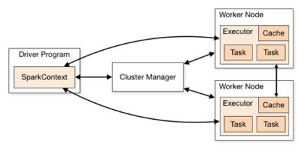

# Spark从0到1（上）

> **前言：**
>
> 这是结合书本和尚硅谷大数据课程的综合Spark入门文档，去除了大部分实操过程以追求在理论上一文解决所有疑惑。原书的第二章是Scala基础编程，但是如果真的想要使用Scala进行Spark工程开发的话，建议去单独学习下Scala（很多语言特性还是比较有意思的）。所以Scala的部分并不在《Spark从0到1》这篇文档中，之后会单独开一篇文档记录Scala的语言及面试重点。
>
> 由此，开始这篇文档默认已经入门Scala了。内容过多会分为上下两部分，上部分主要介绍Spark Core和Spark SQL，下部分主要介绍Spark的其他生态，主要是Streaming，GraphX和MLlib酌情考虑。

## 第一章 Spark概述

#### 1、Spark是什么？

- Spark 是一种由 Scala 语言开发的快速、通用、可扩展的大数据分析引擎

- Spark Core 中提供了 Spark 最基础与最核心的功能

- Spark SQL 是 Spark 用来操作结构化数据的组件。通过 Spark SQL，用户可以使用SQL 或者 Apache Hive 版本的 SQL 方言（HQL）来查询数据。

- Spark Streaming 是 Spark 平台上针对实时数据进行流式计算的组件，提供了丰富的处理数据流的 API。

**Spark 出现的时间相对较晚，并且主要功能主要是用于数据计算，所以其实 Spark 一直被认为是 Hadoop 框架的升级版。**

**Spark 和Hadoop 的根本差异是多个作业之间的数据通信问题 : Spark 多个作业之间数据通信是基于内存，而 Hadoop 是基于磁盘。**


#### 2、Spark与MapReduce

###### （1）MapReduce的局限性

- **仅支持Map和Reduce 两种操作。**数据处理流程中的每一步都需要一个Map阶段和一个Reduce阶段，如果要利用这一解决方案，需要将所有用例都转换成MapReduce模式。
- **处理效率低。**Map中间结果写磁盘，Reduce中间结果写HDFS，多个MapReduce之间通过 HDFS交换数据，任务调度和启动开销大。开销具体表现在如下几方面：客户端需要把应用程序提交给ResourcesManager，ResourcesManager 去选择节点运行；当Map任务和Reduce 任务被ResourcesManager 调度的时候，会先启动一个container 进程，然后让任务运行起来，每一个任务都要经历Java虚拟机的启动、销毁等流程。
- Map 和Reduce 均需要排序，但是因为有的任务处理完全不需要排序（比如求最大值和最小值等），所以就造成了**低效的性能**。
- 不适合做迭代计算（如机器学习、图计算等）、交互式处理（如数据挖掘）和流式处理（如日志分析）


###### （2）Spark解决MapReduce的不足

- Spark可以基于内存也可以基于磁盘做迭代计算
- Spark所处理的数据可以来自任何一种存储介质，如关系数据库、本地文件系统、分布式存储等
- Spark装在需要处理的数据至内存，并将这些数据集抽象为RDD（弹性分布式数据集）对象，然后采用一系列RDD操作处理RDD，并将处理好的结果以RDD的形式输出到内存，以数据流的方式持久化写入其他存储介质中。
- Spark使用Scala语言作为编程语言，它是一种面向对象、函数式编程语言，能够像操作本地集合一样轻松地操作分布式数据集。


###### （3）Spark优点

- **运行速度快**：Spark 基于磁盘做迭代计算比基于磁盘做迭代计算的MapReduce 快十余倍；Spark 基于内存做迭代计算则比基于磁盘做迭代计算的MapReduce快100倍以上。Spark实现了高效的DAG执行引擎，可以通过内存计算来高效处理数据流。
- **易用性好**：Spark 支持Java、Python、Scala等语言，支持80多种高级算法，可以使用户快速构建不同的应用。Spark 支持交互式的Python 和 Scala的shell，这意味着可以非常方便地在这些 shel中使用Spark集群来验证解决问题的方法，而不像以前，需要打包、上传集群、验证等。
- **通用性强**：Spark可用于批处理、交互式查询（通过SparkSQL组件）、实时流处理（通过Spark Streaming 组件）、机器学习（通过Spark MLJib缅件）和图计算（通过Spark GraphX组件）。④兼容性：Spark可以使用 Hadoop的YARN作为它的资源管理和调度器。Spark也可以不依赖于第三方的资源管理和调度器，它实现了Standalone 作为其内置的资源管理和调度框架，能够读取 HDFS、Cassandra、HBase、S3和Techyon中的数据。


#### 3、Spark核心模块

###### （1）Spark Core

Spark Core 中提供了 Spark 最基础与最核心的功能，Spark 其他的功能如：Spark SQL，Spark Streaming，GraphX, MLlib 都是在 Spark Core 的基础上进行扩展的

###### （2）Spark SQL

Spark SQL 是 Spark 用来操作结构化数据的组件。通过 Spark SQL，用户可以使用 SQL或者 Apache Hive 版本的 SQL 方言（HQL）来查询数据。

> Hive On Spark

###### （3）Spark Streaming

Spark Streaming 是 Spark 平台上针对实时数据进行流式计算的组件，提供了丰富的处理数据流的 API。

###### （4）Spark MLlib

MLlib 是 Spark 提供的一个机器学习算法库。MLlib 不仅提供了模型评估、数据导入等额外的功能，还提供了一些更底层的机器学习原语。

###### （5）Spark GraphX

GraphX 是 Spark 面向图计算提供的框架与算法库。


#### 4、Spark执行流程（运行机制）

###### （1）简单概念

- 作业（Job)：一个应用程序以RDD行动操作(Action）为划分边界往往会产生多个作业。Spark对RDD采用情性求解机制，对RDD的创建和转换并不会立即执行，只有在遇到行动操作时才会生成一个作业，然后统一调度执行。一个作业包含多个RDD及作用于相应RDD上的各种操作。一个作业会被拆分为多组任务，每组任务被称为阶段（Stage)，或者被称为任务集(TaskSet）。
- 阶段（Stage)：一个作业会被拆分为多组任务，每组任务被称为阶段（Stage)，或者被称为任务集(TaskSet）。
- 任务集（TaskSet）：任务集是任务的集合，一个阶段创建一个任务集，阶段的每个RDD分区被创建为一个任务，多个任务封装形成任务集。
- 有向无环图（Directed Acycle graph)：有向无环图反映RDD之间的依赖关系。


###### （2）运行架构

Spark 框架的核心是一个计算引擎，整体来说，它采用了标准 master-slave 的结构。图形中的 Driver 表示 master，负责管理整个集群中的作业任务调度。图形中的 Executor 则是 slave，负责实际执行任务。



###### （3）核心组件

**Driver**

Spark 驱动器节点，用于执行 Spark 任务中的 main 方法，负责实际代码的执行工作。

Driver 在 Spark 作业执行时主要负责：

- 将用户程序转化为作业（job）

- 在 Executor 之间调度任务(task)

- 跟踪 Executor 的执行情况

- 通过 UI 展示查询运行情况

实际上，我们无法准确地描述 Driver 的定义，因为在整个的编程过程中没有看到任何有关Driver 的字眼。所以简单理解，所谓的 Driver 就是驱使整个应用运行起来的程序，也称之为Driver 类。


**Executor**

Spark Executor 是集群中工作节点（Worker）中的一个 JVM 进程，负责在 Spark 作业中运行具体任务（Task），任务彼此之间相互独立。Spark 应用启动时，Executor 节点被同时启动，并且始终伴随着整个 Spark 应用的生命周期而存在。如果有 Executor 节点发生了故障或崩溃，Spark 应用也可以继续执行，会将出错节点上的任务调度到其他 Executor 节点上继续运行。

Executor 有两个核心功能：

- 负责运行组成 Spark 应用的任务，并将结果返回给驱动器进程

- 它们通过自身的块管理器（Block Manager）为用户程序中要求缓存的 RDD 提供内存式存储。RDD 是直接缓存在 Executor 进程内的，因此任务可以在运行时充分利用缓存数据加速运算。


**Master & Worker**

Spark 集群的独立部署环境中，不需要依赖其他的资源调度框架，自身就实现了资源调度的功能，所以环境中还有其他两个核心组件：Master 和 Worker，这里的 Master 是一个进程，主要负责资源的调度和分配，并进行集群的监控等职责，类似于 Yarn 环境中的 ResourceManager，而Worker 则是进程，一个 Worker 运行在集群中的一台服务器上，由 Master 分配资源对数据进行并行的处理和计算，类似于 Yarn 环境中 NodeManager。


**ApplicationMaster**

Hadoop 用户向 YARN 集群提交应用程序时,提交程序中应该包含 ApplicationMaster，用于向资源调度器申请执行任务的资源容器 Container，运行用户自己的程序任务 job，监控整个任务的执行，跟踪整个任务的状态，处理任务失败等异常情况。说的简单点就是，ResourceManager（资源）和 Driver（计算）之间的解耦合靠的就是ApplicationMaster。


###### （4）DAG【Directed Acycle graph，有向无环图】

有向无环图，并不是真正意义的图形，而是由 Spark 程序直接映射成的数据流的高级抽象模型。简单理解就是将整个程序计算的执行过程用图形表示出来,这样更直观，更便于理解，可以用于表示程序的拓扑结构。

DAG 有向无环图是由点和线组成的拓扑图形，该图形具有方向，不会闭环。


###### （5）应用执行的基本流程


- 当一个Spark应用程序被提交时，首先需要为这个应用程序构建运行环境，即由驱动程序创建一个SparkContext 对象，SparkContext对象向集群资源管理器注册，之后SparkContext 对象负责和集群资源管理器进行通信以及进行资源申请、任务的分配和运行监控等，此外还包括申请运行执行器进程的资源。
- 集群资源管理器根据预先设定的算法，在资源池里为执行器进程分配合适的运行资源，并启动执行器进程。在运行过程中，执行器运行情况将随着心跳信息发送到资源管理。
- SparkContext 对象根据RDD之间的依赖关系构建DAG图，然后提交给有向无环图调度器进行解析，将DAG图分解成多个阶段（每个阶段就是一个任务集），并计算出各Stage之间的依赖关系，然后把各个任务集提交给任务调度器进行处理。执行器进程向SparkCon text 对象申请任务，任务调度器将任务发放给执行器进程执行，同时SparkContext对象将应用程序代码发放给执行器进程，即将计算移到数据所在的节点上进行，移动计算比移动数据的网络开销要小得多。
- Task在执行器进程上运行，把执行结果反馈给Task Scheduler，然后再反馈给有向无环图调度器。运行完毕后写入数据，SparkContext 对象向集群资源管理器注销并释放所有资源。

------


## 第二章  Spark Core：基于Scala的Spark编程

#### 1、RDD

###### （1）什么是RDD？

RDD（Resilient Distributed Dataset）叫做弹性分布式数据集，是 Spark 中最基本的数据处理模型。代码中是一个抽象类，它代表一个弹性的、不可变、可分区、里面的元素可并行计算的集合。

- 弹性
  - 存储的弹性：内存与磁盘的自动切换；
  - 容错的弹性：数据丢失可以自动恢复；
  - 计算的弹性：计算出错重试机制；
  - 分片的弹性：可根据需要重新分片。

- 分布式：数据存储在大数据集群不同节点上

- 数据集：RDD 封装了计算逻辑，并不保存数据

- 数据抽象：RDD 是一个抽象类，需要子类具体实现

- 不可变：RDD 封装了计算逻辑，是不可以改变的，想要改变，只能产生新的 RDD，在新的 RDD 里面封装计算逻辑

- 可分区、并行计算

传统的MapReduce虽然具有自动容错、负载均衡和可拓展性的优点，但其最大的缺点是在迭代计算的时候，要进行大量的磁盘I/O操作，RDD正是为了解决这一缺点而出现的。

**RDD屏蔽了底层对数据的复杂抽象和处理，为用户提供了一组方便的数据转换与求值方法。**


###### （2）执行原理

从计算的角度来讲，数据处理过程中需要计算资源（内存 & CPU）和计算模型（逻辑）。 执行时，需要将计算资源和计算模型进行协调和整合。 

Spark 框架在执行时，先申请资源，然后将应用程序的数据处理逻辑分解成一个一个的 计算任务。然后将任务发到已经分配资源的计算节点上, 按照指定的计算模型进行数据计 算。最后得到计算结果。

- **RDD在YARN环境中的工作原理**

|                           执行过程                           |      示意图      |
| :----------------------------------------------------------: | :--------------: |
|                    （1）启动YARN集群环境                     |  |
|             （2）Spark申请资源调度节点和计算节点             |  |
|  （3）Spark 框架根据需求将计算逻辑根据分区划分成不同的任务   |  |
| （4）调度节点将任务根据计算节点状态发送到对应的计算节点进行计算 |  |


###### （3）创建RDD的方式

创建RDD的方式主要有两种：通过Spark应用程序中的数据集创建；使用本地及HDFS、HBase等外部存储系统上的文件创建。

- 使用数据集：通过并行化数据集合来创建RDD，就是通过调用SparkContext中的parallelize()方法并行化数据集到集群的节点上形成一个分布式的数据集合，然后就可以采用并行的方式来操作这个分布式数据集合。
- 使用文本文件：调用SparkContext的textFile()方法读取文件的位置即可创建RDD。textFile()支持针对目录、文本文件、压缩文件以及通配符匹配的文件进行RDD创建。
- 使用JSON文件；
- 使用CSV文件（后两种本质上都是textFile()对不同格式的读取）


#### 2、RDD操作（操作在一些地方又称为算子）

###### （1）转换操作&&行动操作

- 转换操作：RDD的转换操作是返回新的RDD的操作，转换操作是惰性求值的，真正的转换发生在RDD的行动操作中，也就是说对于行动操作之前的所有转换操作，Spark只是记录下转换的轨迹，即相互之间的依赖关系，并不会触发真正的转换。
  - RDD 根据数据处理方式的不同将算子整体上分为 Value 类型、双 Value 类型和 Key-Value 类型。

- 行动操作：行动操作是指向驱动器程序返回结果或把结果写入外部系统并触发实际计算的操作。行动操作接受RDD，但是返回一个非RDD，即输出一个结果值，并把结果值返回到驱动器的程序中。


###### （2）常见的转换操作

常见的RDD转换操作有map、filter、flatMap、groupByKey、reduceByKey等。

- map是对RDD中的每个元素都执行一个指定的函数来产生一个新的RDD

```scala
// 将处理的数据逐条进行映射转换，这里的转换可以是类型的转换，也可以是值的转换。
val dataRDD: RDD[Int] = sparkContext.makeRDD(List(1,2,3,4))  // 创建RDD数据结构
val dataRDD1: RDD[Int] = dataRDD.map(
   num => {
       num * 2
   }
)  // 值转换
val dataRDD2: RDD[String] = dataRDD1.map(
   num => {
       "" + num
   }
)  // 类型转换

// 输出结果：
// dataRDD1：2 4 6 8
// dataRDD2：2 4 6 8
```


- filter是对RDD中的每个元素都执行一个指定的函数，将返回值为true的元素组成一个新的RDD

```scala
// 将数据根据指定的规则进行筛选过滤，符合规则的数据保留，不符合规则的数据丢弃。当数据进行筛选过滤后，分区不变，但是分区内的数据可能不均衡，生产环境下，可能会出现数据倾斜。
val dataRDD = sparkContext.makeRDD(List(
   1,2,3,4
),1)
val dataRDD1 = dataRDD.filter(_%2 == 0) // 过滤掉 _%2 != 0 的元素
// dataRDD1: 2 4
```


- flatMap是将函数应用于RDD中的每个元素，将返回的迭代器的所有内容构成新的RDD

```scala
// 将处理的数据进行扁平化后再进行映射处理，所以算子也称之为扁平映射
val dataRDD = sparkContext.makeRDD(List(
   List(1,2),List(3,4)
),1)
val dataRDD1 = dataRDD.flatMap(
   list => list
)
// dataRDD1：1 2 3 4
```

> flatMap是非常常用的算子，它能将多维数据扁平化，比如说二维变为一维。常见在WordCount中，一句话被切分成多个词后使用flatMap进行展平。


- groupBy

```scala
// 将数据根据指定的规则进行分组, 分区默认不变，但是数据会被打乱重新组合，我们将这样的操作称之为 shuffle。极限情况下，数据可能被分在同一个分区中
// 一个组的数据在一个分区中，但是并不是说一个分区中只有一个组
val dataRDD = sparkContext.makeRDD(List(1,2,3,4),1)
val dataRDD1 = dataRDD.groupBy(
   _%2
) // 通过对2取余进行分区
// 输出结果：
// (0,CompactBuffer(2, 4))
// (1,CompactBuffer(1, 3))
```

> groupBy是非常常用的算子，它能通过条件对元素进行分组。常见在WordCount中，多句话扁平化之后可以将相同的词语分组聚合，以便后续进行计数。


- groupByKey是将RDD中相同key的元素分组到一起，返回一个(K, Iterable[V])类型的RDD

```scala
// 将数据源的数据根据 key 对 value 进行分组
val dataRDD1 = sparkContext.makeRDD(List(("a",1),("b",2),("c",3)))
val dataRDD2 = dataRDD1.groupByKey()
val dataRDD3 = dataRDD1.groupByKey(2)
val dataRDD4 = dataRDD1.groupByKey(new HashPartitioner(2))
// 输出结果:（内容一致，顺序不同）
// (a,CompactBuffer(1))
// (b,CompactBuffer(2))
// (c,CompactBuffer(3))
```


- reduceByKey是对每个key对应的value进行reduce操作，返回一个(K, V)类型的RDD。

```scala
// 可以将数据按照相同的 Key 对 Value 进行聚合
val dataRDD1 = sparkContext.makeRDD(List(("a",1),("b",2),("c",3)))
val dataRDD2 = dataRDD1.reduceByKey(_+_)
val dataRDD3 = dataRDD1.reduceByKey(_+_, 2)
// 输出结果:
// (a,1) (b,2) (c,3)
// (b,2) (a,1) (c,3)
```


###### （3）常见的行动操作

常见的RDD行动操作有collect、count、first、take、reduce等。

- collect是将RDD中所有元素以数组的形式返回到Driver端；

```scala
// 在驱动程序中，以数组 Array 的形式返回数据集的所有元素
val rdd: RDD[Int] = sc.makeRDD(List(1,2,3,4))
// 收集数据到 Driver
rdd.collect().foreach(println)  // 收集到Driver端并循环打印
```


- count是返回RDD中元素的个数；first是返回RDD中的第一个元素；

```scala
// 返回 RDD 中元素的个数
val rdd: RDD[Int] = sc.makeRDD(List(1,2,3,4))
// 返回 RDD 中元素的个数
val countResult: Long = rdd.count() // 记录元素个数
// 4
```


- take是返回一个由RDD的前n个元素组成的数组；

```scala
// 返回一个由 RDD 的前 n 个元素组成的数组
val rdd: RDD[Int] = sc.makeRDD(List(1,2,3,4))
// 返回 RDD 中元素的个数
val takeResult: Array[Int] = rdd.take(2)  // 返回前两个元素
println(takeResult.mkString(","))  // 用","将元素隔开
// 1,2
```


- reduce是通过func函数聚集RDD中的所有元素，先聚合分区内数据，再聚合分区间数据。

```scala
// 聚集 RDD 中的所有元素，先聚合分区内数据，再聚合分区间数据
val rdd: RDD[Int] = sc.makeRDD(List(1,2,3,4))
// 聚合数据
val reduceResult: Int = rdd.reduce(_+_)
// 10
```

 

###### （4）reduceByKey和groupByKey的区别？

**从 shuffle 的角度**：reduceByKey 和 groupByKey 都存在 shuffle 的操作，但是 reduceByKey 可以在 shuffle 前对分区内相同 key 的数据进行预聚合（combine）功能，这样会减少落盘的 数据量，而 groupByKey 只是进行分组，不存在数据量减少的问题，reduceByKey 性能比较高。 

**从功能的角度**：reduceByKey 其实包含分组和聚合的功能。GroupByKey 只能分组，不能聚合，所以在分组聚合的场合下，推荐使用 reduceByKey，如果仅仅是分组而不需要聚合。那么还是只能使用 groupByKey。

**所以在进行大量数据的 reduce 操作时候建议使用 reduceByKey。不仅可以提高速度，还可以防止使用 groupByKey 造成的内存溢出问题。**


###### （5）一种WordCount代码实现

```scala
import org.apache.spark.rdd.RDD
import org.apache.spark.{SparkConf, SparkContext}

object Spark03 {
    def main(args: Array[String]): Unit = {
        // 配置Driverp[设置本地master适配、application进程名字]
        val sparkConf = new SparkConf().setMaster("local[*]").setAppName("WordCount")
        // 装载
        val sc = new SparkContext(sparkConf)
		// 加载文件（按行读取）
        val lines: RDD[String] = sc.textFile("datas")
        // 按照空格将每一行的句子扁平化成词语
        val word: RDD[String] = lines.flatMap(_.split(" "))
		// 对每一个词语设置由word转化为(word, 1)格式
        val wordToOne = word.map {
            word => (word, 1)
        }
		// 通过相同的key进行聚合，value相加
        val wordToCount = wordToOne.reduceByKey(_+_)
		// 将数据返回到Driver端
        val array: Array[(String, Int)] = wordToCount.collect()
        // 循环打印
        array.foreach(println)
        sc.stop()
    }
}
```


####  3、RDD序列化（了解）

###### （1）闭包检查

从计算的角度, **算子以外的代码都是在 Driver 端执行, 算子里面的代码都是在 Executor 端执行。**那么在 Scala 的函数式编程中，就会导致算子内经常会用到算子外的数据，这样就形成了闭包的效果，如果使用的算子外的数据无法序列化，就意味着无法传值给 Executor 端执行，就会发生错误，所以需要在执行任务计算前，检测闭包内的对象是否可以进行序列化，这个操作我们称之为**闭包检测。Scala2.12 版本后闭包编译方式发生了改变。**


###### （2）序列化方法和属性

```scala
object serializable02_function {
    def main(args: Array[String]): Unit = {
        //1.创建 SparkConf 并设置 App 名称
        val conf: SparkConf = new SparkConf().setAppName("SparkCoreTest").setMaster("local[*]")
        //2.创建 SparkContext，该对象是提交 Spark App 的入口
        val sc: SparkContext = new SparkContext(conf)
        //3.创建一个 RDD
        val rdd: RDD[String] = sc.makeRDD(Array("hello world", "hello spark", "hive", "atguigu"))
        //3.1 创建一个 Search 对象
        val search = new Search("hello")
        //3.2 函数传递，打印：ERROR Task not serializable
        search.getMatch1(rdd).collect().foreach(println)
        //3.3 属性传递，打印：ERROR Task not serializable
        search.getMatch2(rdd).collect().foreach(println)
        //4.关闭连接
        sc.stop()
    }
}
class Search(query:String) extends Serializable {
    def isMatch(s: String): Boolean = {
        s.contains(query)
    }
 	// 函数序列化案例
 	def getMatch1 (rdd: RDD[String]): RDD[String] = {
 		//rdd.filter(this.isMatch)
 		rdd.filter(isMatch)
 	}
 	// 属性序列化案例
 	def getMatch2(rdd: RDD[String]): RDD[String] = {
 		//rdd.filter(x => x.contains(this.query))
 		rdd.filter(x => x.contains(query))
 		//val q = query
 		//rdd.filter(x => x.contains(q))
 	}
}
```


###### （3）Kryo序列化框架

参考地址: https://github.com/EsotericSoftware/kryo 

Java 的序列化能够序列化任何的类。但是比较重（字节多），序列化后，对象的提交也比较大。Spark 出于性能的考虑，Spark2.0 开始支持另外一种 Kryo 序列化机制。Kryo 速度 是 Serializable 的 10 倍。当 RDD 在 Shuffle 数据的时候，简单数据类型、数组和字符串类型 已经在 Spark 内部使用 Kryo 来序列化。 

**注意：即使使用 Kryo 序列化，也要继承 Serializable 接口。**

```scala
object serializable_Kryo {
    def main(args: Array[String]): Unit = {
 		val conf: SparkConf = new SparkConf()
        							.setAppName("SerDemo").setMaster("local[*]")
 									// 替换默认的序列化机制
 									.set("spark.serializer", 
                                     		"org.apache.spark.serializer.KryoSerializer")
 									// 注册需要使用 kryo 序列化的自定义类
 									.registerKryoClasses(Array(classOf[Searcher]))
 		val sc = new SparkContext(conf)
 		val rdd: RDD[String] = sc.makeRDD(Array("hello world", "hello atguigu", "atguigu", "hahah"), 2)
 		val searcher = new Searcher("hello")
 		val result: RDD[String] = searcher.getMatchedRDD1(rdd)
 		result.collect.foreach(println)
 	}
}
case class Searcher(val query: String) {
 	def isMatch(s: String) = {
 		s.contains(query)
 	}
 	def getMatchedRDD1(rdd: RDD[String]) = {
 		rdd.filter(isMatch) 
 	}
 	def getMatchedRDD2(rdd: RDD[String]) = {
 		val q = query
 		rdd.filter(_.contains(q))
	 }
}
```


#### 4、RDD依赖关系（重中之重）

###### （1）血缘关系

RDD 只支持粗粒度转换，即在大量记录上执行的单个操作。将创建 RDD 的一系列 Lineage （血统）记录下来，以便恢复丢失的分区。RDD 的 Lineage 会记录 RDD 的元数据信息和转 换行为，当该 RDD 的部分分区数据丢失时，它可以根据这些信息来重新运算和恢复丢失的数据分区。


###### （2）依赖关系

> 所谓的依赖关系，其实就是两个相邻 RDD 之间的关系。
>
> 通常使用.dependencies去查看RDD之间的关系。


###### （3）宽窄依赖

**窄依赖**

- 父 RDD 的一个分区只会被子 RDD 的一个分区依赖
- 窄依赖的多个分区可以并行计算； 窄依赖的一个分区的数据如果丢失只需要重新计算对应的分区的数据就可以了。

**宽依赖**

- 父 RDD 的一个分区会被子 RDD 的多个分区依赖(涉及到 shuffle)

- 划分 Stage(阶段)的依据：对于宽依赖,必须等到上一阶段计算完成才能计算下一阶段。


#### 5、RDD持久化

###### （1）Cache缓存

RDD 通过 Cache 或者 Persist 方法将前面的计算结果缓存，默认情况下会把数据以缓存 在 JVM 的堆内存中。但是并不是这两个方法被调用时立即缓存，而是触发后面的 action 算 子时，该 RDD 将会被缓存在计算节点的内存中，并供后面重用。

Spark 会自动对一些 Shuffle 操作的中间数据做持久化操作(比如：reduceByKey)。这样 做的目的是为了当一个节点 Shuffle 失败了避免重新计算整个输入。但是，在实际使用的时候，如果想重用数据，仍然建议调用 persist 或 cache。


###### （2）CheckPoint检查点

所谓的检查点其实就是通过将 RDD 中间结果写入磁盘。由于血缘依赖过长会造成容错成本过高，这样就不如在中间阶段做检查点容错，如果检查点之后有节点出现问题，可以从检查点开始重做血缘，减少了开销。 对 RDD 进行 checkpoint 操作并不会马上被执行，必须执行 Action 操作才能触发。


###### （3）缓存和检查点区别 

- Cache 缓存只是将数据保存起来，不切断血缘依赖。Checkpoint 检查点切断血缘依赖。 
- Cache 缓存的数据通常存储在磁盘、内存等地方，可靠性低。Checkpoint 的数据通常存 储在 HDFS 等容错、高可用的文件系统，可靠性高。 
- 建议对 checkpoint()的 RDD 使用 Cache 缓存，这样 checkpoint 的 job 只需从 Cache 缓存中读取数据即可，否则需要再从头计算一次 RDD。

------


## 第三章 Spark SQL：结构化数据处理

#### 1、Spark SQL概述

**Spark SQL 是 Spark 用于结构化数据(structured data)处理的 Spark 模块。**

SparkSQL 的前身是 Shark，给熟悉 RDBMS 但又不理解 MapReduce 的技术人员提供快速上手的工具。 Hive 是早期唯一运行在 Hadoop 上的 SQL-on-Hadoop 工具。但是 MapReduce 计算过程 中大量的中间磁盘落地过程消耗了大量的 I/O，降低的运行效率，为了提高 SQL-on-Hadoop 的效率，大量的 SQL-on-Hadoop 工具开始产生，其中表现较为突出的是：Drill 、 Impala 、 Shark 。其中 Shark 是伯克利实验室 Spark 生态环境的组件之一，是基于 Hive 所开发的工具，它修改了Hive的内存管理、物理计划、执行三个模块，并使之能运行在 Spark 引擎上。

随着 Spark 的发展，SparkSQL 抛弃原有 Shark 的代码，汲取了 Shark 的一些优点，如内存列存储（In-Memory Columnar  Storage）、Hive兼容性等，重新开发了SparkSQL代码；由于摆脱了对Hive的依赖性，SparkSQL 无论在数据兼容、性能优化、组件扩展方面都得到了极大的方便。

- **数据兼容方面** SparkSQL 不但兼容 Hive，还可以从 RDD、parquet 文件、JSON 文件中获取数据，未来版本甚至支持获取 RDBMS 数据以及 cassandra 等 NOSQL 数据
- **性能优化方面** 除了采取 In-Memory Columnar Storage、byte-code generation 等优化技术外、将会引进 Cost Model 对查询进行动态评估、获取最佳物理计划等等
- **组件扩展方面** 无论是 SQL 的语法解析器、分析器还是优化器都可以重新定义，进行扩展。

其中 SparkSQL 作为 Spark 生态的一员继续发展，而不再受限于 Hive，只是兼容 Hive；而 Hive on Spark 是一个 Hive 的发展计划，该计划将 Spark 作为 Hive 的底层引擎之一，也就是 说，Hive 将不再受限于一个引擎，可以采用 Map-Reduce、Tez、Spark 等引擎。

> 后续的文档计划中也将有Hive on Spark的内容，写该文档的时候题主还没学完，敬请期待！


#### 2、Spark SQL优点

- **易整合**：无缝的整合了 SQL 查询和 Spark 编程
- **统一的数据访问**：使用相同的方式连接不同的数据源
- **兼容Hive**：在已有的仓库上直接运行 SQL 或者 HiveQL
- **标准数据连接**：通过 JDBC 或者ODBC来连接


#### 3、DataFrame && DataSet

###### （1）DataFrame是什么？

在 Spark 中，DataFrame 是一种以 RDD 为基础的分布式数据集，**类似于传统数据库中的二维表格**。DataFrame 与 RDD 的主要区别在于，前者带有 schema 元信息，即 DataFrame 所表示的二维表数据集的每一列都带有名称和类型。这使得 Spark SQL 得以洞察更多的结构信息，从而对藏于 DataFrame 背后的数据源以及作用于 DataFrame 之上的变换进行了针对性的优化，最终达到大幅提升运行时效率的目标。反观 RDD，由于无从得知所存数据元素的具体内部结构，Spark Core 只能在 stage 层面进行简单、通用的流水线优化。 

同时，与 Hive 类似，DataFrame 也支持嵌套数据类型（struct、array 和 map）。从 API  易用性的角度上看，DataFrame API 提供的是一套高层的关系操作，比函数式的 RDD API 要更加友好，门槛更低。


###### （2）DataSet是什么？（课本比较久，没有这部分内容）

DataSet 是分布式数据集合。DataSet 是 Spark 1.6 中添加的一个新抽象，是 DataFrame 的一个扩展。它提供了 RDD 的优势（强类型，使用强大的 lambda 函数的能力）以及 Spark  SQL 优化执行引擎的优点。DataSet 也可以使用功能性的转换（操作 map，flatMap，filter 等等）。 

- DataSet 是 DataFrame API 的一个扩展，是 SparkSQL 最新的数据抽象 

- 用户友好的 API 风格，既具有类型安全检查也具有 DataFrame 的查询优化特性； 

- 用样例类来对 DataSet 中定义数据的结构信息，样例类中每个属性的名称直接映射到 DataSet 中的字段名称； 

- DataSet 是强类型的。比如可以有 DataSet[Car]，DataSet[Person]。 

- DataFrame 是 DataSet 的特列，DataFrame=DataSet[Row] ，所以可以通过 as 方法将 DataFrame 转换为 DataSet。Row 是一个类型，跟 Car、Person 这些的类型一样，所有的 表结构信息都用 Row 来表示。获取数据时需要指定顺序。


#### 4、Spark SQL核心编程

Spark Core 中，如果想要执行应用程序，需要首先构建上下文环境对象 SparkContext， Spark SQL 其实可以理解为对 Spark Core 的一种封装，不仅仅在模型上进行了封装，上下文 环境对象也进行了封装。 在老的版本中，SparkSQL 提供两种 SQL 查询起始点：一个叫 SQLContext，用于 Spark 自己提供的 SQL 查询；一个叫 HiveContext，用于连接 Hive 的查询。 

**SparkSession 是 Spark 最新的 SQL 查询起始点**，实质上是 SQLContext 和 HiveContext 的组合，所以在 SQLContext 和 HiveContext 上可用的 API 在 SparkSession 上同样是可以使用 的。SparkSession 内部封装了 SparkContext，所以计算实际上是由 sparkContext 完成的。当 我们使用 spark-shell 的时候, spark 框架会自动的创建一个名称叫做 spark 的 SparkSession 对 象, 就像我们以前可以自动获取到一个 sc 来表示 SparkContext 对象一样。

###### （1）DataFrame创建

在 Spark SQL 中 SparkSession 是创建 DataFrame 和执行 SQL 的入口，创建 DataFrame 有三种方式：通过 Spark 的数据源进行创建；从一个存在的 RDD 进行转换；还可以从 Hive Table 进行查询返回。

使用数据源创建的方式最常见的是使用parquet文件创建和使用JSON文件创建。Parquet文件格式特点如下：

- 可以跳过不符合条件的数据，只读取需要的数据，降低I/O数据量。
- 可以压缩编码降低磁盘存储空间（悠羽同一列的数据类型一样，故可以使用更高效的压缩编码）。
- 只读取需要的列，支持向量运算，能够获取更好的扫描性能。
- Parquet格式是Spark SQL的默认数据源格式，可通过spark.sql.sources.default配置。


###### （2）DSL语法

DataFrame 提供一个特定领域语言(domain-specific language, DSL)去管理结构化的数据。 可以在 Scala, Java, Python 和 R 中使用 DSL，使用 DSL 语法风格不必去创建临时视图了。

```SPARQL
# 1) 创建一个 DataFrame
scala> val df = spark.read.json("data/user.json")
df: org.apache.spark.sql.DataFrame = [age: bigint， name: string]

# 2) 查看 DataFrame 的 Schema 信息
scala> df.printSchema
root
|-- age: Long (nullable = true)
|-- username: string (nullable = true)

# 3) 只查看"username"列数据，
scala> df.select("username").show()
+--------+
|username|
+--------+
|zhangsan|
| lisi|
| wangwu|
+--------+

# 4) 查看"username"列数据以及"age+1"数据
# 注意:涉及到运算的时候, 每列都必须使用$, 或者采用引号表达式：单引号+字段名
scala> df.select($"username",$"age" + 1).show
scala> df.select('username, 'age + 1).show()
scala> df.select('username, 'age + 1 as "newage").show()
+--------+---------+
|username|(age + 1)|
+--------+---------+
|zhangsan|       21|
|    lisi|       31|
|  wangwu|       41|
+--------+---------+
```


###### （3）RDD转化为DataFrame

在 IDEA 中开发程序时，如果需要 RDD 与 DF 或者 DS 之间互相操作，那么需要引入 **import spark.implicits._** 

这里的 spark 不是 Scala 中的包名，而是创建的 sparkSession 对象的变量名称，所以必须先创建 SparkSession 对象再导入。这里的 spark 对象不能使用 var 声明，因为 Scala 只支持 val 修饰的对象的引入。 spark-shell 中无需导入，自动完成此操作。 

```SPARQL
scala> val idRDD = sc.textFile("data/id.txt")
scala> idRDD.toDF("id").show
+---+
| id|
+---+
|  1|
|  2|
|  3|
|  4|
+---+
# 实际开发中，一般通过样例类将 RDD 转换为 DataFrame
# toDF(to DataFrame)直接将RDD转化为DataFrame
```


###### （4）DataFrame转化为RDD

DataFrame 其实就是对 RDD 的封装，所以可以直接获取内部的 RDD。

```SPARQL
scala> val df = sc.makeRDD(List(("zhangsan",30), ("lisi",40))).map(t=>User(t._1, t._2)).toDF
df: org.apache.spark.sql.DataFrame = [name: string, age: int]

scala> val rdd = df.rdd
rdd: org.apache.spark.rdd.RDD[org.apache.spark.sql.Row] = MapPartitionsRDD[46] at rdd at <console>:25

scala> val array = rdd.collect
array: Array[org.apache.spark.sql.Row] = Array([zhangsan,30], [lisi,40])
```


###### （5）DataFrame和DataSet转换

**声明：DataSet 是具有强类型的数据集合，需要提供对应的类型信息。DataFrame 其实是 DataSet 的特例，所以它们之间是可以互相转换的。**

> RDD与DataSet的互转和RDD与DataFrame的互转一模一样，区别仅仅只是toDF改为了toDS。

```SPARQL
# DataFrame 转换为 DataSet
scala> case class User(name:String, age:Int)
defined class User
scala> val df = sc.makeRDD(List(("zhangsan",30), 
("lisi",49))).toDF("name","age")
df: org.apache.spark.sql.DataFrame = [name: string, age: int]
scala> val ds = df.as[User]
ds: org.apache.spark.sql.Dataset[User] = [name: string, age: int]

# DataSet 转换为 DataFrame
scala> val ds = df.as[User]
ds: org.apache.spark.sql.Dataset[User] = [name: string, age: int]
scala> val df = ds.toDF
df: org.apache.spark.sql.DataFrame = [name: string, age: int]

# 首先使用as严格数据类型，再进行转换
```


#### 5、RDD、DataFrame、DataSet三者的关系

###### （1）版本上来看

Spark1.0 => RDD  

Spark1.3 => DataFrame 

Spark1.6 => Dataset 

如果同样的数据都给到这三个数据结构，他们分别计算之后，都会给出相同的结果。不同是的他们的执行效率和执行方式。在后期的 Spark 版本中，**DataSet 有可能会逐步取代 RDD 和 DataFrame 成为唯一的 API 接口。**


###### （2）三者的共性

- RDD、DataFrame、DataSet 全都是 spark 平台下的分布式弹性数据集，为处理超大型数 据提供便利；
- 三者都有惰性机制，在进行创建、转换，如 map 方法时，不会立即执行，只有在遇到 Action 如 foreach 时，三者才会开始遍历运算；
- 三者有许多共同的函数，如 filter，排序等；
- 在对 DataFrame 和 Dataset 进行操作许多操作都需要这个包：import spark.implicits._（在 创建好 SparkSession 对象后尽量直接导入） 
- 三者都会根据 Spark 的内存情况自动缓存运算，这样即使数据量很大，也不用担心会内存溢出
- 三者都有 partition 分区的概念
- DataFrame 和 DataSet 均可使用模式匹配获取各个字段的值和类型


###### （3）三者的区别

**RDD**

- RDD 一般和 spark mllib 同时使用
- RDD 不支持 Spark SQL 操作

**DataFrame**

- 与 RDD 和 DataSet 不同，DataFrame 每一行的类型固定为 Row，每一列的值没法直接访问，只有通过解析才能获取各个字段的值
- DataFrame 与 DataSet 一般不与 spark mllib 同时使用

- DataFrame 与 DataSet 均支持 SparkSQL 的操作，比如 select，group by 之类，还能注册临时表/视窗，进行 sql 语句操作
- DataFrame 与 DataSet 支持一些特别方便的保存方式，比如保存成 csv，可以带上表头，这样每一列的字段名一目了然

**DataSet**

- Dataset 和 DataFrame 拥有完全相同的成员函数，区别只是每一行的数据类型不同。 DataFrame 其实就是 DataSet 的一个特例 type DataFrame = Dataset[Row]
- DataFrame 也可以叫 Dataset[Row]，每一行的类型是 Row，不解析，每一行究竟有哪些字段，各个字段又是什么类型都无从得知，只能用上面提到的 getAS 方法或者共性中的第七条提到的模式匹配拿出特定字段。而 Dataset 中，每一行是什么类型是不一定的，在自定义了 case class 之后可以很自由的获得每一行的信息。


###### （3）三者的互相转换


#### 6、用户自定义函数

用户可以通过 **spark.udf** 功能添加自定义函数，实现自定义功能。

###### （1）UDF[User-Defined Function，用户自定义函数]

> UDF相当于对已经有的函数，比如说：count等进行一个封装，在Spark中注册后就能够直接使用。主打的是将普通的函数包装成按行执行的函数。

```SPARQL
# 1) 创建 DataFrame
scala> val df = spark.read.json("data/user.json")
df: org.apache.spark.sql.DataFrame = [age: bigint， username: string]

# 2) 注册 UDF
scala> spark.udf.register("addName",(x:String)=> "Name:"+x)
res9: org.apache.spark.sql.expressions.UserDefinedFunction = 
UserDefinedFunction(<function1>,StringType,Some(List(StringType)))

# 3) 创建临时表
scala> df.createOrReplaceTempView("people")

# 4) 应用 UDF
scala> spark.sql("Select addName(name),age from people").show()
```


###### (2)UDAF[User-Defined Aggregation Function，用户自定义聚合函数]

> UDAF相当于用户自定义SQL中没有的函数，这里只记录下Spark3.0之后最新的Aggregator的实现方式，以后在生产开发中遇到再进行详细学习。

用户可以设定自己的自定义聚合函数。通 过继承 UserDefinedAggregateFunction 来实现用户自定义弱类型聚合函数。从 Spark3.0 版本 后，UserDefinedAggregateFunction 已经不推荐使用了。可以统一采用强类型聚合函数 Aggregator。

```scala
// 需求：计算平均工资
// TODO 创建 UDAF 函数
val udaf = new MyAvgAgeUDAF
// TODO 注册到 SparkSQL 中
spark.udf.register("avgAge", functions.udaf(udaf))
// TODO 在 SQL 中使用聚合函数
// 定义用户的自定义聚合函数
spark.sql("select avgAge(age) from user").show
// **************************************************
case class Buff( var sum:Long, var cnt:Long )
// totalage, count
class MyAvgAgeUDAF extends Aggregator[Long, Buff, Double]{
    override def zero: Buff = Buff(0,0)
    
    override def reduce(b: Buff, a: Long): Buff = {
		b.sum += a
 		b.cnt += 1
 		b
 	}
 	
    override def merge(b1: Buff, b2: Buff): Buff = {
 		b1.sum += b2.sum
 		b1.cnt += b2.cnt
 		b1
 	}
 	
    override def finish(reduction: Buff): Double = {
 		reduction.sum.toDouble/reduction.cnt
 	}
 	
    override def bufferEncoder: Encoder[Buff] = Encoders.product
 	override def outputEncoder: Encoder[Double] = Encoders.scalaDouble
}
```


#### 7、Spark SQL执行的流程（面试）

1. parser：基于 antlr 框架对 sql 解析，生成抽象语法树。 
2. 变量替换：通过正则表达式找出符合规则的字符串，替换成系统缓存环境的变量。 SQLConf 中的 spark.sql.variable.substitute，默认是可用的；参考 SparkSqlParser 
3. parser：将 antlr 的 tree 转成 spark catalyst 的 LogicPlan，也就是未解析的逻辑计划；详细参考 AstBuild, ParseDriver 
4. analyzer：通过分析器，结合 catalog，把 logical plan 和实际的数据绑定起来，将 未解析的逻辑计划 生成 逻辑计划；详细参考 QureyExecution 
5. 缓存替换：通过 CacheManager，替换有相同结果的 logical plan（逻辑计划） 
6. logical plan 优化，基于规则的优化；优化规则参考 Optimizer，优化 执行器 RuleExecutor 
7. 生成 spark plan，也就是物理计划；参考QueryPlanner和SparkStrategies 
8. spark plan 准备阶段 
9. 构造 RDD 执行，涉及 spark 的 wholeStageCodegenExec 机制，基于 janino 框架生成 java 代码并编译