# Spark从0到1（下）


## 第四章 Spark Streaming：流计算

#### 1、概述

###### （1）流计算

流数据是一组顺序、大量、快速、连续可达的数据序列，可被视为一个随时间延续而不断增长的动态数据集合。具有以下特点：

- 数据实时到达
- 数据到达次序独立，不受应用系统控制
- 数据规模宏大且不能预知其最大值
- 数据一经处理，除非特意保存，否则不能被再次取出处理，如果再次提取数据则代价昂贵


###### （2）批处理与流处理

根据数据处理的时效性，大数据处理系统可分为批大数据处理系统和流大数据处理系统两类。

- 批处理
  - 批处理主要操作大容量静态数据集，并在计算过程完成后返回结果。批处理模式中使用的数据集通常符合下列特征：
    - 有界，批处理数据集代表数据的有限集合
    - 持久，数据通常始终存储在某种类型的持久存储位置中。
    - 量大，批处理操作通常是处理极为海量的数据集的唯一方法。
  - 批处理非常适合需要访问全套记录才能完成的计算工作，例如在计算总数和平均数时，必须将数据集作为一个整体加以处理。
- 流处理
  - 流处理系统会对随时进入系统的数据进行计算。相比批处理模式，这是一种截然不同的处理方式。流处理方式无须针对整个数据集执行操作，而是对系统传输的每个数据项执行操作。
  - 流处理中的数据集是“无边界”的，完整数据集只能代表截至目前已经进入到系统中的数据总量；流处理工作是基于事件的，除非明确停止否则没有“尽头”；流处理结果立即可用；并会随着新数据的抵达持续更新。
  - 流处理很适合用来处理必须对变动或者峰值做出响应，并且关注一段时间的变化趋势的数据。


###### （3）Spark Sreaming

Spark Streaming 用于流式数据的处理。Spark Streaming 支持的数据输入源很多，例如：Kafka、 Flume、Twitter、ZeroMQ 和简单的 TCP 套接字等等。数据输入后可以用 Spark 的高度抽象原语 如：map、reduce、join、window 等进行运算。而结果也能保存在很多地方，如 HDFS，数据库等。

和 Spark 基于 RDD 的概念很相似，Spark Streaming 使用离散化流(discretized stream)作为抽象表示，叫作 DStream。DStream 是随时间推移而收到的数据的序列。在内部，每个时间区间收到的数据都作为 RDD 存在，而 DStream 是由这些 RDD 所组成的序列（因此得名“离散化”）。所以 简单来讲，DStream 就是对 RDD 在实时数据处理场景的一种封装。


#### 2、Spark Streaming架构

###### （1）架构图

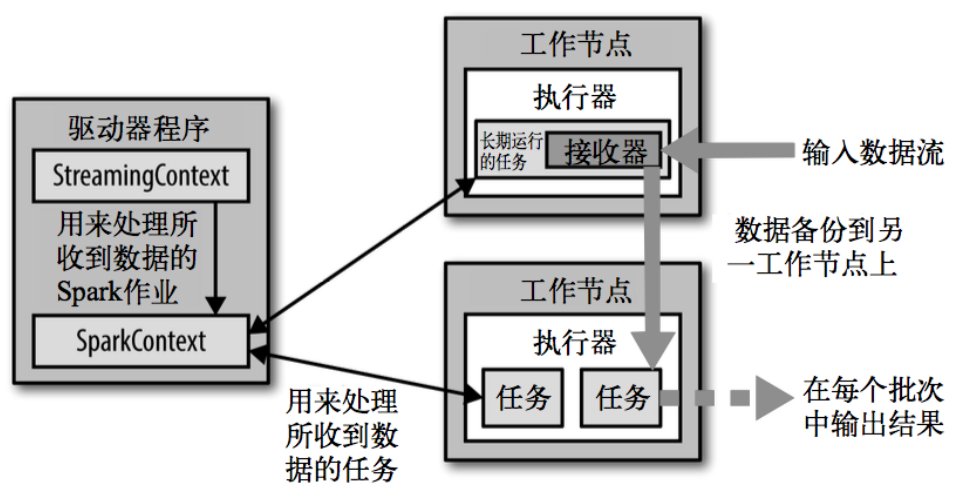

###### （2）背压机制

Spark 1.5 以前版本，用户如果要限制 Receiver 的数据接收速率，可以通过设置静态配制参数“spark.streaming.receiver.maxRate”的值来实现，此举虽然可以通过限制接收速率，来适配当前的处理能力，防止内存溢出，但也会引入其它问题。比如：producer 数据生产高于 maxRate，当 前集群处理能力也高于 maxRate，这就会造成资源利用率下降等问题。 

为了更好的协调数据接收速率与资源处理能力，1.5 版本开始 Spark Streaming 可以动态控制 数据接收速率来适配集群数据处理能力。**背压机制（即 Spark Streaming Backpressure）: 根据 JobScheduler 反馈作业的执行信息来动态调整 Receiver 数据接收率。**

 通过属性“spark.streaming.backpressure.enabled”来控制是否启用 backpressure 机制，默认值 false，即不启用。


#### 3、运行原理

Spark Streaming是构建在Spark Core上的实时流计算框架，扩展了Spark Core处理流式大数据的能力。Spark Streaming将数据流以时间片为单位分割形成一系列RDD（一个RDD对应一块分割数据），这些RDD在Spark Streaming中用一个抽象数据模型DStream（Discretized Stream，离散流）来描述，DStream表示从数据源获取的持续性数据流和经过转换后的数据流。

###### DStream和RDD的对应关系

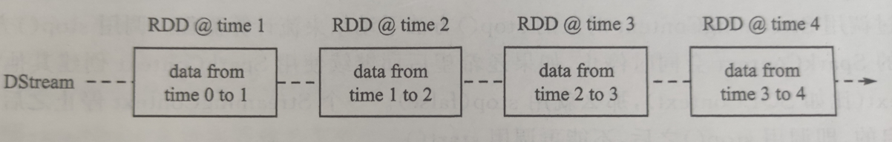

DStream可以通过输入数据源来创建，比如Kafka、Flume和Kinesis；也可以通过对其他DStream应用进行map、reduce、join等操作来创建。使用RDD操作处理DStream中的每一个RDD，每个RDD都会生成一个Spark job，然后提交给Spark集群进行计算，批量生成最终的结果，最后将结果批量输出到HDFS或者数据库以及前端页面展示等。

###### 基本工作原理

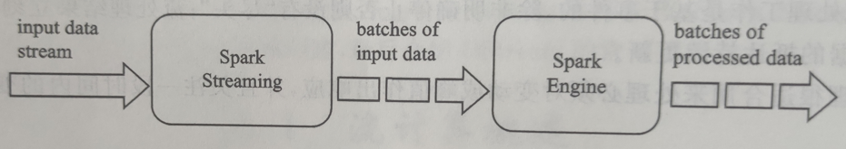

Spark Streaming使用“微批次”的架构，即把流式计算当作一系列连续的小规模批处理来对待。Spark Streaming从输入源中读取数据，并把数据分组为小的批次。新的批次按均匀的时间间隔被创建出来，即在每个时间区间开始时，一个新的批次被创建出来，并且在该区间内收到的数据都会被添加到这个批次中；在时间区间结束时，批次停止增长。其中，时间区间的长短是由批处理间隔决定的，批处理间隔一般设为500ms到几秒，由应用开发者配置。每次输入批次都会生成一个RDD，Spark以作业的方式处理和生成其他的RDD，然后就可以对其他的RDD进行转换操作，最后将RDD经过行动操作生成的中间结果保存在内存中。整个流式计算根据业务的需求可以对中间的结果进行叠加，最后形成“批”形式的结果流给外部系统。


#### 4、以WordCount入门DStream

> 需求：使用 netcat 工具向 9999 端口不断的发送数据，通过 SparkStreaming 读取端口数据并统计不同单词出现的次数

```scala
object StreamWordCount {
     def main(args: Array[String]): Unit = {
 		//1.初始化 Spark 配置信息
 		val sparkConf = new SparkConf().setMaster("local[*]").setAppName("StreamWordCount")
 		//2.初始化 SparkStreamingContext
 		val ssc = new StreamingContext(sparkConf, Seconds(3))
 		//3.通过监控端口创建 DStream，读进来的数据为一行行
 		val lineStreams = ssc.socketTextStream("linux1", 9999)
 		//将每一行数据做切分，形成一个个单词
 		val wordStreams = lineStreams.flatMap(_.split(" "))
 		//将单词映射成元组（word,1）
		 val wordAndOneStreams = wordStreams.map((_, 1))
 		//将相同的单词次数做统计
 		val wordAndCountStreams = wordAndOneStreams.reduceByKey(_+_)
 		//打印
 		wordAndCountStreams.print()
	 	//启动 SparkStreamingContext
 		ssc.start()
 		ssc.awaitTermination()
 	}
}
```

###### 解析

Discretized Stream 是 Spark Streaming 的基础抽象，代表持续性的数据流和经过各种 Spark 原语操作后的结果数据流。在内部实现上，DStream 是一系列连续的 RDD 来表示。每个 RDD 含有 一段时间间隔内的数据。

> 因此，实际上可以将一段时间内的处理当成一个完整的RDD执行，以上述例子为例，Streaming监听3秒一打印，那么在这3秒内读取到的数据就是一个完整的RDD，各批次之间的数据互不干涉。比如你在前3秒发送了两个hello spark，一个hello streaming，第四秒发送了一个hello spark，那么实际上的输出是两个批次，第一批次为(hello, 3) (spark, 2) (streaming, 1)；第二批次为(hello, 1) (streaming, 1)。批次之间不会累计，但是我们任能通过构建RDD对各批次结果进行聚合。


#### 5、不同数据源

###### （1）自定义数据源

需求：自定义数据源，实现监控某个端口号，获取该端口号内容。

提示：需要继承 Receiver，并实现 onStart、onStop 方法来自定义数据源采集。

```scala
class CustomerReceiver(host: String, port: Int) extends Receiver[String](StorageLevel.MEMORY_ONLY) {
    //最初启动的时候，调用该方法，作用为：读数据并将数据发送给 Spark
 	override def onStart(): Unit = {
 		new Thread("Socket Receiver") {
 			override def run() {
 				receive()
 			}
 		}.start()
 	}
 
    //读数据并将数据发送给 Spark
 	def receive(): Unit = {
 		//创建一个 Socket
 		var socket: Socket = new Socket(host, port)
 		//定义一个变量，用来接收端口传过来的数据
 		var input: String = null
 		//创建一个 BufferedReader 用于读取端口传来的数据
 		val reader = new BufferedReader(new InputStreamReader(socket.getInputStream, 
								StandardCharsets.UTF_8))
 		//读取数据
 		input = reader.readLine()
 		//当 receiver 没有关闭并且输入数据不为空，则循环发送数据给 Spark
 		while (!isStopped() && input != null) {
 			store(input)
 			input = reader.readLine()
 		}
 		//跳出循环则关闭资源
 		reader.close()
 		socket.close()
 		//重启任务
 		restart("restart")
 	}
 	override def onStop(): Unit = {}
}
```

使用方式：

```scala
//3.创建自定义 receiver 的 Streaming
val lineStream = ssc.receiverStream(new CustomerReceiver("hadoop102", 9999))
```


###### （2）Kafka数据源（重点）

**Kafka 0-10 Direct 模式**

需求：通过 SparkStreaming 从 Kafka 读取数据，并将读取过来的数据做简单计算，最终打印到控制台。

```scala
import org.apache.kafka.clients.consumer.{ConsumerConfig, ConsumerRecord}
import org.apache.spark.SparkConf
import org.apache.spark.streaming.dstream.{DStream, InputDStream}
import org.apache.spark.streaming.kafka010.{ConsumerStrategies, KafkaUtils, LocationStrategies}
import org.apache.spark.streaming.{Seconds, StreamingContext}

object DirectAPI {
     def main(args: Array[String]): Unit = {
 		//1.创建 SparkConf
 		val sparkConf: SparkConf = new SparkConf().setAppName("ReceiverWordCount").setMaster("local[*]")
 		//2.创建 StreamingContext
 		val ssc = new StreamingContext(sparkConf, Seconds(3))
 		//3.定义 Kafka 参数
 		val kafkaPara: Map[String, Object] = Map[String, Object](
 			ConsumerConfig.BOOTSTRAP_SERVERS_CONFIG -> 
								"linux1:9092,linux2:9092,linux3:9092",
 			ConsumerConfig.GROUP_ID_CONFIG -> "atguigu",
 								"key.deserializer" -> 
									"org.apache.kafka.common.serialization.StringDeserializer",
 								"value.deserializer" -> 
									"org.apache.kafka.common.serialization.StringDeserializer"
 			)
 		//4.读取 Kafka 数据创建 DStream
 		val kafkaDStream: InputDStream[ConsumerRecord[String, String]] = 
								KafkaUtils.createDirectStream[String, String](ssc,
 								LocationStrategies.PreferConsistent,
 								ConsumerStrategies.Subscribe[String, String](Set("atguigu"), kafkaPara))
 		//5.将每条消息的 KV 取出
 		val valueDStream: DStream[String] = kafkaDStream.map(record => record.value())
 		//6.计算 WordCount
 		valueDStream.flatMap(_.split(" "))
 											.map((_, 1))
 											.reduceByKey(_ + _)
 											.print()
 		//7.开启任务
 		ssc.start()
 		ssc.awaitTermination()
 	}
}
```


#### 6、操作DStream

DStream 上的操作与 RDD 的类似，分为 Transformations（转换）和 Output Operations（输 出）两种，此外转换操作中还有一些比较特殊的原语，如：updateStateByKey()、transform()以及 各种 Window 相关的原语。

> 可以简单分为三类：无状态转换操作、有状态转换操作、输出操作

这里只对各种操作进行一个简单的概述，并不对其中的代码做过多分析，开发环境中需要的时候可以针对性查找。


###### （1）无状态转换操作

无状态转化操作就是把简单的 RDD 转化操作应用到每个批次上，也就是转化 DStream 中的每 一个 RDD。注意，**针对键值对的 DStream 转化操作(比如 reduceByKey())要添加 import StreamingContext._才能在 Scala 中使用。**

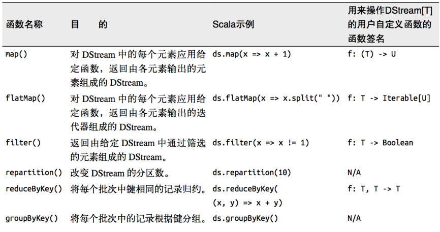

需要记住的是，尽管这些函数看起来像作用在整个流上一样，但事实上每个 DStream 在内部是由许多 RDD（批次）组成，且无状态转化操作是分别应用到每个 RDD 上的。


**Transform**

Transform 允许 DStream 上执行任意的 RDD-to-RDD 函数。即使这些函数并没有在 DStream 的 API 中暴露出来，通过该函数可以方便的扩展 Spark API。该函数每一批次调度一次。其实也就是对 DStream 中的 RDD 应用转换。


**join** 

两个流之间的 join 需要两个流的批次大小一致，这样才能做到同时触发计算。计算过程就是 对当前批次的两个流中各自的 RDD 进行 join，与两个 RDD 的 join 效果相同。


###### （2）有状态转换操作

**UpdateStateByKey** 

UpdateStateByKey 原语用于记录历史记录，有时，我们需要在 DStream 中跨批次维护状态(例 如流计算中累加 wordcount)。针对这种情况，updateStateByKey()为我们提供了对一个状态变量的访问，用于键值对形式的 DStream。给定一个由(键，事件)对构成的 DStream，并传递一个指 定如何根据新的事件更新每个键对应状态的函数，它可以构建出一个新的 DStream，其内部数据为(键，状态) 对。 

updateStateByKey() 的结果会是一个新的 DStream，其内部的 RDD 序列是由每个时间区间对应的(键，状态)对组成的。


**WindowOperations**

Window Operations 可以设置窗口的大小和滑动窗口的间隔来动态的获取当前 Steaming 的允许状态。所有基于窗口的操作都需要两个参数，分别为窗口时长以及滑动步长。


###### （3）输出

输出操作指定了对流数据经转化操作得到的数据所要执行的操作(例如把结果推入外部数据库 或输出到屏幕上)。与 RDD 中的惰性求值类似，如果一个 DStream 及其派生出的 DStream 都没 有被执行输出操作，那么这些 DStream 就都不会被求值。如果 StreamingContext 中没有设定输出 操作，整个 context 就都不会启动。

------


## 第五章 Spark GraphX：图计算 && Spark MLlib：机器学习

#### 1、Spark GraphX

[大数据开发-Spark-初识Spark-Graph && 快速入门](https://juejin.cn/post/6926541204372848654)


#### 2、Spark MLlib

[初识 Spark MLlib 机器学习](https://juejin.cn/post/7069390174437769246)

------


> 以下内容为进阶知识咯！虽说考试是考一点点的GraphX和MLlib，但是拜托，这是Spark从0到1，不是考试从0到100哦！所以后续重点介绍Spark内核和最最最常见的灵魂发问：数据倾斜的解决办法。
>
> Spark内核会省略掉一些比较底层的调度策略（虽然确实很重要），主要从Shuffle和底层执行原理以及内存管理进行介绍。

## 第六章 Spark Shuffle解析

在 MapReduce 框架中，Shuffle 阶段是连接 Map 与 Reduce 之间的桥梁，Map 阶段通过 Shuffle 过程将数据输出到 Reduce 阶段中。由**于 Shuffle 涉及磁盘的读写和网络 I/O，因此 Shuffle 性能的高低直接影响整个程序的性能。** Spark 也有 Map 阶段和 Reduce 阶段，因此也会出现 Shuffle 。

#### 1、Shuffle 的核心要点

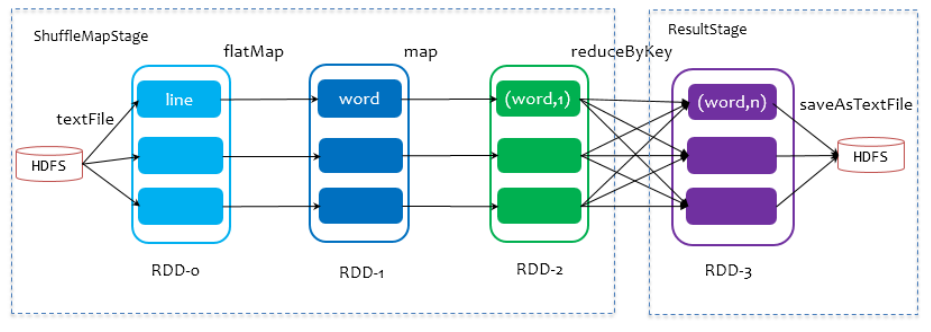

在划分 stage 时，最后一个 stage 称为 finalStage，它本质上是一个 ResultStage 对象，前面的所有 stage 被称为 ShuffleMapStage。 

ShuffleMapStage 的结束伴随着 shuffle 文件的写磁盘。 

ResultStage 基本上对应代码中的 action 算子，即将一个函数应用在 RDD 的各个 partition 的数据集上，意味着一个 job 的运行结束。


#### 2、HashShuffle解析

###### （1）未优化的HashShuffle

这里我们先明确一个假设前提：每个 Executor 只有 1 个 CPU core，也就是说，无论这 个 Executor 上分配多少个 task 线程，同一时间都只能执行一个 task 线程。 

有 3 个 Reducer，从 Task 开始那边各自把自己进行 Hash 计算(分区器： hash/numreduce 取模)，分类出 3 个不同的类别，每个 Task 都分成 3 种类别的数据，想把不 同的数据汇聚然后计算出最终的结果，所以 Reducer 会在每个 Task 中把属于自己类别的数 据收集过来，汇聚成一个同类别的大集合，每 1 个 Task 输出 3 份本地文件，这里有 4 个 Mapper Tasks，所以总共输出了 4 个 Tasks x 3 个分类文件 = 12 个本地小文件。

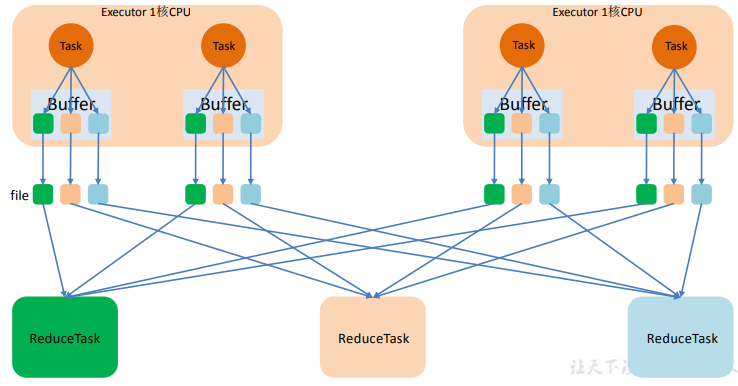


###### （2）优化后的HashShuffle

优化的 HashShuffle 过程就是启用合并机制，合并机制就是复用 buffer，开启合并机制 的配置是 spark.shuffle.consolidateFiles。该参数默认值为 false，将其设置为 true 即可开启优化机制。通常来说，如果我们使用 HashShuffleManager，那么都建议开启这个选项。 

这里还是有 4 个 Tasks，数据类别还是分成 3 种类型，因为 Hash 算法会根据你的 Key  进行分类，在同一个进程中，无论是有多少过 Task，都会把同样的 Key 放在同一个 Buffer 里，然后把 Buffer 中的数据写入以 Core 数量为单位的本地文件中，(一个 Core 只有一种类 型的 Key 的数据)，每 1 个 Task 所在的进程中，分别写入共同进程中的 3 份本地文件，这里 有 4 个 Mapper Tasks，所以总共输出是 2 个 Cores x 3 个分类文件 = 6 个本地小文件。

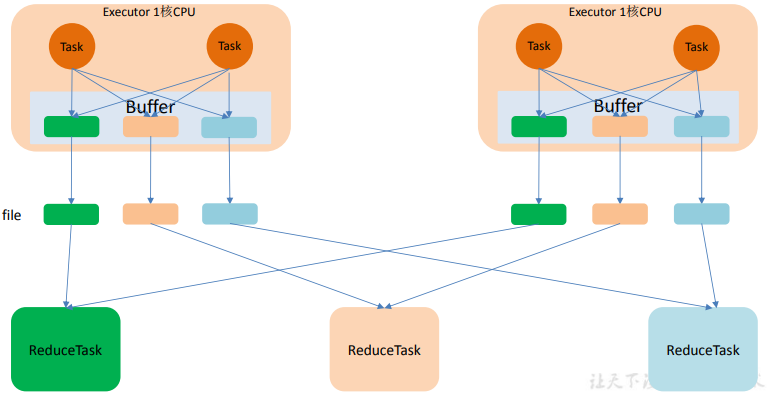

> 简单来说优化后的HashShuffle通过复用Buffer，减小了生成的文件数量，加快了后续的ReduceTask。

**在 Spark 2.0 版本中， Hash Shuffle 方式己经不再使用。**


#### 3、基于HashShuffle机制的优缺点

**优点**

- 可以省略不必要的排序开销。 
- 避免了排序所需的内存开销。 

**缺点**

- 生产的文件过多，会对文件系统造成压力。 
- 大量小文件的随机读写带来一定的磁盘开销。 
- 数据块写入时所需的缓存空间也会随之增加，对内存造成压力。


#### 4、SortShuffle解析

###### （1）普通SortShuffle

在该模式下，数据会先写入一个数据结构，reduceByKey 写入 Map，一边通过 Map 局部聚合，一遍写入内存。Join 算子写入 ArrayList 直接写入内存中。然后需要判断是否达到阈值，如果达到就会将内存数据结构的数据写入到磁盘，清空内存数据结构。 

在溢写磁盘前，先根据 key 进行排序，排序过后的数据，会分批写入到磁盘文件中。默认批次为 10000 条，数据会以每批一万条写入到磁盘文件。写入磁盘文件通过缓冲区溢写的方式，每次溢写都会产生一个磁盘文件，也就是说一个 Task 过程会产生多个临时文件。 

**最后在每个 Task 中，将所有的临时文件合并，这就是 merge 过程，此过程将所有临时文件读取出来，一次写入到最终文件。**意味着一个 Task 的所有数据都在这一个文件中。同时单独写一份索引文件，标识下游各个Task的数据在文件中的索引，start offset和end offset。

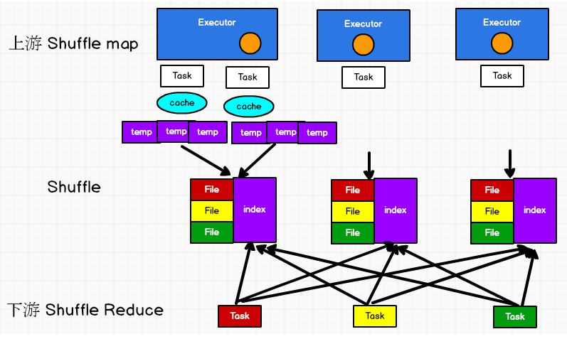


###### （2）bypass SortShuffle

bypass 运行机制的触发条件如下： 

- shuffle reduce task 数量小于等于 **spark.shuffle.sort.bypassMergeThreshold** 参数的值，默认为 200。 
- 不是聚合类的 shuffle 算子（比如 reduceByKey）。 

此时 task 会为每个 reduce 端的 task 都创建一个临时磁盘文件，并将数据按 key 进行 hash 然后根据 key 的 hash 值，将 key 写入对应的磁盘文件之中。当然，写入磁盘文件时也是先写入内存缓冲，缓冲写满之后再溢写到磁盘文件的。最后，同样会将所有临时磁盘文件都合并成一个磁盘文件，并创建一个单独的索引文件。 

该过程的磁盘写机制其实跟未经优化的 HashShuffleManager 是一模一样的，因为都要创建数量惊人的磁盘文件，只是在最后会做一个磁盘文件的合并而已。因此少量的最终磁盘文件，也让该机制相对未经优化的 HashShuffleManager 来说，shuffle read 的性能会更好。 

而该机制与普通 SortShuffleManager 运行机制的不同在于：**不会进行排序**。也就是说， 启用该机制的最大好处在于，shuffle write 过程中，不需要进行数据的排序操作，也就节省掉了这部分的性能开销。

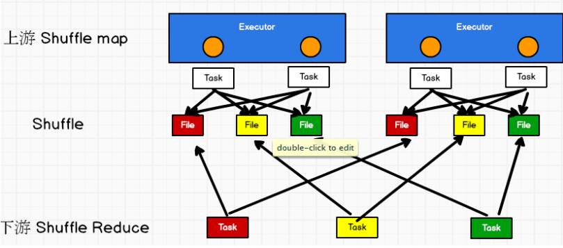


#### 5、基于Sort 的 Shuffle 机制的优缺点

**优点**

- 小文件的数量大量减少，Mapper 端的内存占用变少
- Spark 不仅可以处理小规模的数据，即使处理大规模的数据，也不会很容易达到性能瓶颈。 

**缺点**

- 如果 Mapper 中 Task 的数量过大，依旧会产生很多小文件，此时在 Shuffle 传数据的过程中到 Reducer 端，Reducer 会需要同时大量地记 录进行反序列化，导致大量内存消耗和 GC 负担巨大，造成系统缓慢，甚至崩溃
- 强制了在 Mapper 端必须要排序，即使数据本身并不需要排序
- 它要基于记录本身进行排序，这就是 Sort-Based Shuffle 最致命的性能 消耗。

------


## 第七章 Spark内存管理

#### 1、堆内和堆外内存规划

作为一个 JVM 进程，Executor 的内存管理建立在 JVM 的内存管理之上，Spark 对 JVM 的堆内（On-heap）空间进行了更为详细的分配，以充分利用内存。同时，Spark 引入了堆外 （Off-heap）内存，使之可以直接在工作节点的系统内存中开辟空间，进一步优化了内存的使用。堆内内存受到 JVM 统一管理，堆外内存是直接向操作系统进行内存的申请和释放。

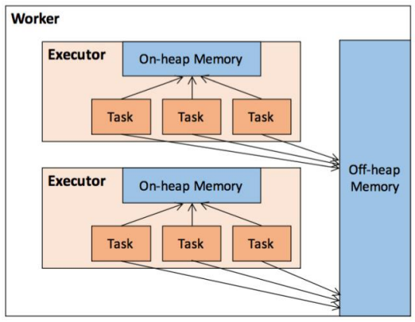

#### 2、内存空间分配

###### （1）静态内存分配

在 Spark 最初采用的静态内存管理机制下，存储内存、执行内存和其他内存的大小在 Spark 应用程序运行期间均为固定的，但用户可以应用程序启动前进行配置。

Storage 内存和 Execution 内存都有预留空间，目的是防止 OOM，因为 Spark 堆内内存大小 的记录是不准确的，需要留出保险区域。 

堆外的空间分配较为简单，只有存储内存和执行内存，如下图所示。可用的执行内存和存储 内存占用的空间大小直接由参数 spark.memory.storageFraction 决定，由于堆外内存占用的空 间可以被精确计算，所以无需再设定保险区域。

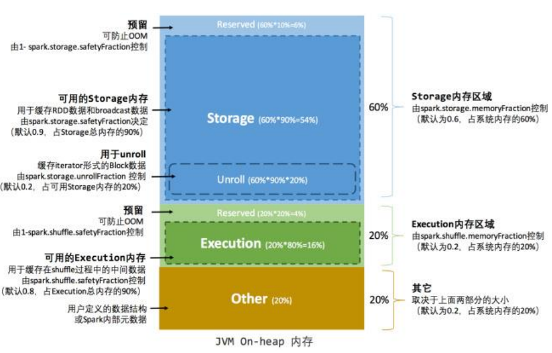

###### （2）统一内存管理

Spark1.6 之后引入的统一内存管理机制，与静态内存管理的区别在于存储内存和执行内存共享同一块空间，可以动态占用对方的空闲区域。

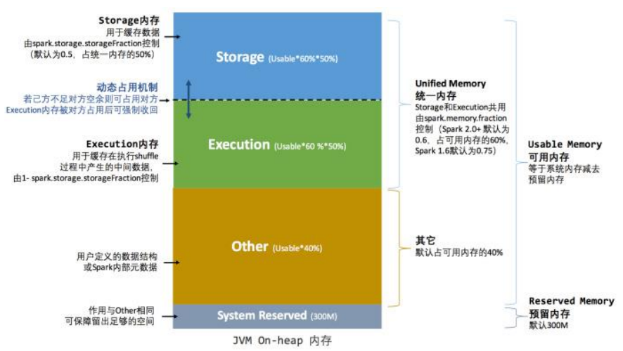

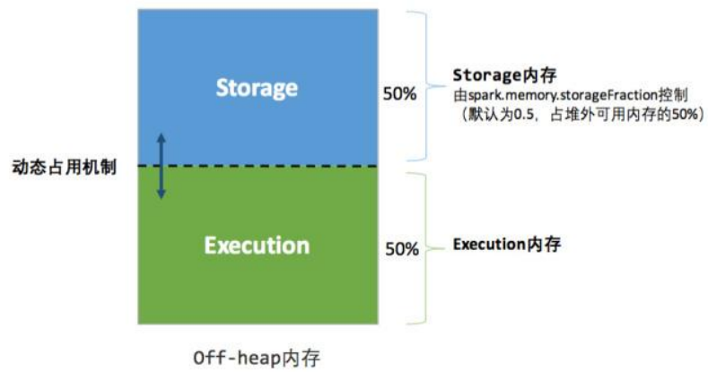

**动态占用机制规则**

- 设定基本的存储内存和执行内存区域（spark.storage.storageFraction 参数），该设定确定了双方各自拥有的空间的范围；
- 双方的空间都不足时，则存储到硬盘；若己方空间不足而对方空余时，可借用对方的空间;（存储空间不足是指不足以放下一个完整的 Block）
- 执行内存的空间被对方占用后，可让对方将占用的部分转存到硬盘，然后”归还”借用的空间； 
- 存储内存的空间被对方占用后，无法让对方”归还”，因为需要考虑 Shuffle 过程中的很多因素，实现起来较为复杂。

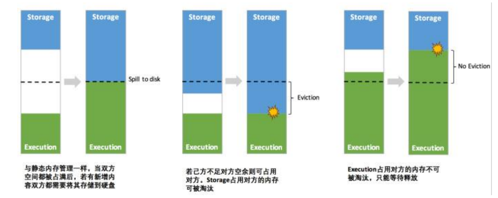

#### 3、存储内存管理

###### （1）RDD的持久化机制

弹性分布式数据集（RDD）作为 Spark 最根本的数据抽象，是只读的分区记录（Partition）的集合，只能基于在稳定物理存储中的数据集上创建，或者在其他已有的 RDD 上执行转换（Transformation）操作产生一个新的 RDD。转换后的 RDD 与原始的 RDD 之间产生的依赖关系，构成了血统（Lineage）。凭借血统，Spark 保证了每一个 RDD 都可以被重新恢复。但 RDD 的所有转换都是惰性的，即只有当一个返回结果给 Driver 的行动（Action）发生时， Spark 才会创建任务读取 RDD，然后真正触发转换的执行。

RDD 的持久化由 Spark 的 Storage 模块负责，实现了 RDD 与物理存储的解耦合。Storage 模块负责管理 Spark 在计算过程中产生的数据，将那些在内存或磁盘、在本地或远程存取数据的功能封装了起来。在具体实现时 Driver 端和 Executor 端的 Storage 模块构成了主从式的架构，即 Driver 端的 BlockManager 为 Master，Executor 端的 BlockManager 为 Slave。 Storage 模块在逻辑上以 Block 为基本存储单位，RDD 的每个 Partition 经过处理后唯一对应 一个 Block（BlockId 的格式为 rdd_RDD-ID_PARTITION-ID ）。Driver 端的 Master 负责整个 Spark 应用程序的 Block 的元数据信息的管理和维护，而 Executor 端的 Slave 需要将 Block 的更新等状态上报到 Master，同时接收 Master 的命令，例如新增或删除一个 RDD。


###### （2）RDD的缓存过程

RDD 在缓存到存储内存之前，Partition 中的数据一般以迭代器（Iterator）的数据结构来访问，这是 Scala 语言中一种遍历数据集合的方法。通过 Iterator 可以获取分区中每一条序 列化或者非序列化的数据项(Record)，这些 Record 的对象实例在逻辑上占用了 JVM 堆内内 存的 other 部分的空间，同一 Partition 的不同 Record 的存储空间并不连续。

RDD 在缓存到存储内存之后，Partition 被转换成 Block，Record 在堆内或堆外存储内存中占用一块连续的空间。将 Partition 由不连续的存储空间转换为连续存储空间的过程，Spark 称之为"展开"（Unroll）。

采样估算其所需的 Unroll 空间并进行申请，空间不足时可以中断，释放已占用的 Unroll 空间。 如果最终 Unroll 成功，当前 Partition 所占用的 Unroll 空间被转换为正常的缓存 RDD 的存储空间。


###### （3）淘汰与落盘

由于同一个 Executor 的所有的计算任务共享有限的存储内存空间，当有新的 Block 需 要缓存但是剩余空间不足且无法动态占用时，就要对 LinkedHashMap 中的旧 Block 进行淘 汰（Eviction），而被淘汰的 Block 如果其存储级别中同时包含存储到磁盘的要求，则要对其 进行落盘（Drop），否则直接删除该 Block。

**存储内存的淘汰规则**

- 被淘汰的旧 Block 要与新 Block 的 MemoryMode 相同，即同属于堆外或堆内内存； 
- 新旧 Block 不能属于同一个 RDD，避免循环淘汰； 
- 旧 Block 所属 RDD 不能处于被读状态，避免引发一致性问题； 
- 遍历 LinkedHashMap 中 Block，按照最近最少使用（LRU）的顺序淘汰，直到满足新 Block 所需的空间。其中 LRU 是 LinkedHashMap 的特性。

落盘的流程则比较简单，如果其存储级别符合\_useDisk 为 true 的条件，再根据其\_deserialized 判断是否是非序列化的形式，若是则对其进行序列化，最后将数据存储到磁盘，在 Storage 模块中更新其信息


#### 4、执行内存管理

执行内存主要用来存储任务在执行 Shuffle 时占用的内存，Shuffle 是按照一定规则对 RDD 数据重新分区的过程。

###### （1）Shuffle Writer

若在 map 端选择普通的排序方式，会采用 ExternalSorter 进行外排，在内存中存储数据时主要占用堆内执行空间。 

若在 map 端选择 Tungsten 的排序方式，则采用 ShuffleExternalSorter 直接对以序列化形式存储的数据排序，在内存中存储数据时可以占用堆外或堆内执行空间，取决于用户是否开启 了堆外内存以及堆外执行内存是否足够。


###### （2）Shuffle Read

在对 reduce 端的数据进行聚合时，要将数据交给 Aggregator 处理，在内存中存储数据时占用堆内执行空间。 

如果需要进行最终结果排序，则要将再次将数据交给 ExternalSorter 处理，占用堆内执行空间。

在 ExternalSorter 和 Aggregator 中，Spark 会使用一种叫 AppendOnlyMap 的哈希表在堆内执 行内存中存储数据，但在 Shuffle 过程中所有数据并不能都保存到该哈希表中，当这个哈希表占用的内存会进行周期性地采样估算，当其大到一定程度，无法再从 MemoryManager 申请到新的执行内存时，Spark 就会将其全部内容存储到磁盘文件中，这个过程被称为溢存 (Spill)，溢存到磁盘的文件最后会被归并(Merge)。


###### （3）总结

Spark 的存储内存和执行内存有着截然不同的管理方式：对于存储内存来说，Spark 用一个 LinkedHashMap 来集中管理所有的 Block，Block 由需要缓存的 RDD 的 Partition 转化而成； 而对于执行内存，Spark 用 AppendOnlyMap 来存储 Shuffle 过程中的数据，在 Tungsten 排序中甚至抽象成为页式内存管理，开辟了全新的 JVM 内存管理机制。

------


## 第八章 数据倾斜

数据倾斜就是数据分到各个区的数量不太均匀，可以自定义分区器,想怎么分就怎么分。 

**Spark 中的数据倾斜问题主要指 shuffle 过程中出现的数据倾斜问题，是由于不同的 key 对应的数据量不同导致的不同 task 所处理的数据量不同的问题。**

注意，要区分开**数据倾斜与数据过量**这两种情况，数据倾斜是指少数 task 被分配了绝大多数的数据，因此少数 task 运行缓慢；数据过量是指所有 task 被分配的数据量都很大，相差不多，所有 task 都运行缓慢。


#### 1、数据倾斜的表现

- Spark 作业的大部分 task 都执行迅速，只有有限的几个 task 执行的非常慢，此时可能出现了数据倾斜，作业可以运行，但是运行得非常慢； 
- Spark 作业的大部分 task 都执行迅速，但是有的 task 在运行过程中会突然报出 OOM，反复执行几次都在某一个 task 报出 OOM 错误，此时可能出现了数据倾斜，作业无法正常运行。 
- 定位数据倾斜问题：查阅代码中的 shuffle 算子，例如 reduceByKey、countByKey、groupByKey、 join 等算子，根据代码逻辑判断此处是否会出现数据倾斜； 
- 查看 Spark 作业的 log 文件，log 文件对于错误的记录会精确到代码的某一行，可以根据异常定位到的代码位置来明确错误发生在第几个 stage， 对应的 shuffle算子是哪一个。


#### 2、方案一：预聚合原始数据

###### （1）避免shuffle过程

绝大多数情况下，Spark 作业的数据来源都是 Hive 表，这些 Hive 表基本都是经过 ETL 之后的昨天的数据。 为了避免数据倾斜，我们可以考虑避免 shuffle 过程，如果避免了 shuffle 过程，那么从根本上就消除了发生数据倾斜问题的可能。 如果 Spark 作业的数据来源于 Hive 表，那么可以先在 Hive 表中对数据进行聚合， 例如按照 key 进行分组，将同一 key 对应的所有 value 用一种特殊的格式拼接到 一个字符串里去，这样，一个 key 就只有一条数据了；之后，对一个 key 的所有 value 进行处理时，只需要进行 map 操作即可，无需再进行任何的 shuffle 操作。 

通过上述方式就避免了执行 shuffle 操作，也就不可能会发生任何的数据倾斜问题。 对于 Hive 表中数据的操作，不一定是拼接成一个字符串，也可以是直接对 key 的每一条数据进行累计计算。 **要区分开，处理的数据量大和数据倾斜的区别。**


###### （2）增大Key粒度（减小数据倾斜的可能性，增大每个Task的数据量）

如果没有办法对每个 key 聚合出来一条数据，在特定场景下，可以考虑扩大 key 的聚合粒度。

例如，目前有 10 万条用户数据，当前 key 的粒度是（省，城市，区，日期）， 现在我们考虑扩大粒度，将 key 的粒度扩大为（省，城市，日期），这样的话， key 的数量会减少，key 之间的数据量差异也有可能会减少，由此可以减轻数据倾斜的现象和问题。（此方法只针对特定类型的数据有效，当应用场景不适宜时， 会加重数据倾斜）


#### 3、方案二：预处理导致倾斜的Key

###### （1）过滤

如果在 Spark 作业中允许丢弃某些数据，那么可以考虑将可能导致数据倾斜的 key 进行过滤，滤除可能导致数据倾斜的 key 对应的数据，这样，在 Spark 作业中就不会发生数据倾斜了。


###### （2）使用随机Key

当使用了类似于 groupByKey、reduceByKey 这样的算子时，可以考虑使用随机 key 实现双重聚合。

此方法对于由 groupByKey、reduceByKey 这类算子造成的数据倾斜有比较好的效果，仅仅适用于聚合类的 shuffle 操作，适用范围相对较窄。如果是 join 类的 shuffle 操作，还得用其他的解决方案。


###### （3）sample 采样对倾斜 key 单独进行 join

在 Spark 中，**如果某个 RDD 只有一个 key，那么在 shuffle 过程中会默认将此 key 对应的数据打散，由不同的 reduce 端 task 进行处理。** 

所以当由单个 key 导致数据倾斜时，可有将发生数据倾斜的 key 单独提取出来， 组成一个RDD，然后用这个原本会导致倾斜的key组成的RDD和其他RDD单独join， 此时，根据 Spark 的运行机制，此 RDD 中的数据会在 shuffle 阶段被分散到多个 task 。

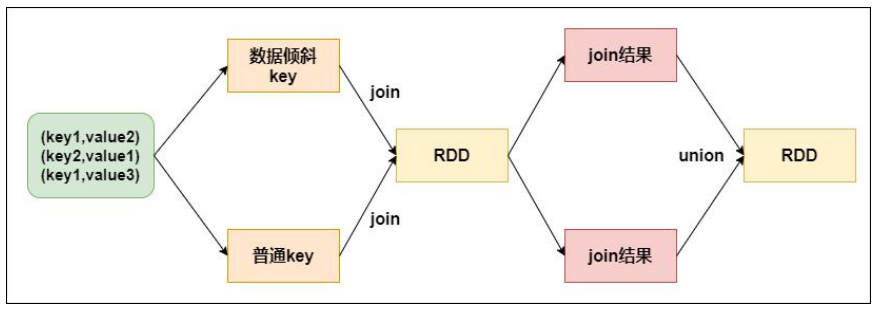


#### 4、方案三：提高reduce并行度

当方案一和方案二对于数据倾斜的处理没有很好的效果时，可以考虑提高 shuffle 过程中的 reduce 端并行度，reduce 端并行度的提高就增加了 reduce 端 task 的数量，那么每个 task 分配到的数据量就会相应减少，由此缓解数据倾斜问题。

**缺陷**

**提高 reduce 端并行度并没有从根本上改变数据倾斜的本质和问题（方案一和方 案二从根本上避免了数据倾斜的发生）**，只是尽可能地去缓解和减轻 shuffle reduce task 的数据压力，以及数据倾斜的问题，适用于有较多 key 对应的数据量都比较大的情况。


#### 5、方案四：使用map join

正常情况下，join 操作都会执行 shuffle 过程，并且执行的是 reduce join，也就是先将所有相同的 key 和对应的 value 汇聚到一个 reduce task 中，然后再进行 join。

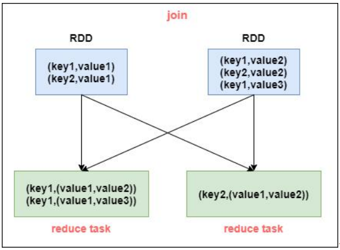

普通的 join 是会走 shuffle 过程的，而一旦 shuffle，就相当于会将相同 key 的数据拉取到一个 shuffle read task 中再进行 join，此时就是 reduce join。 但是如果一个 RDD 是比较小的，则可以采用广播小 RDD 全量数据+map 算子来实现与 join 同样的效果，也就是 map join，此时就不会发生 shuffle 操作，也就不会发生数据倾斜。

**注意：RDD 是并不能直接进行广播的，只能将 RDD 内部的数据通过 collect 拉取到 Driver 内存然后再进行广播。**

> 简单来说就是将少且散的数据全局到Driver端，直接消费到其他比较大的数据集中。

------


> 应该不会有人真的看到这里吧~~
>
> 其实文档还有Spark调优没有写，但是碍于篇幅和我的精神状态，暂时就不准备夹在这个文档中间了。毕竟这也只是从0到1嘛，不是从1到1.5。
>
> 理论固然是重要的，但是千万别忘了代码实践。如果你想在简历上写了解Spark的话，上面这些基础基本上是吃透了的，同时还要熟读Spark的八股面经（认真脸）。当然，个人认为最好的提升方式就是直接写个项目，找找网上的Spark Streaming项目做一下，能够更加方便你了解Spark的工作原理。
>
> 如果你能在这学得比任课老师教的还好，那么我觉得该文档就有了它的价值。——Alexie-Z-Yevich 2023.4.20