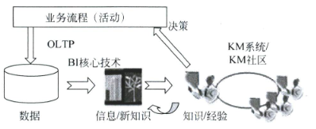
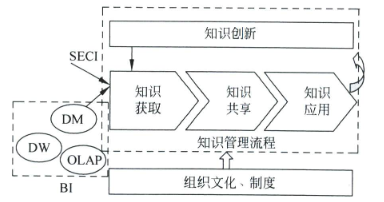
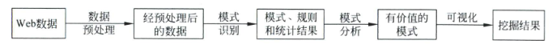
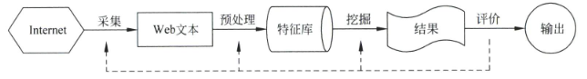

# 商务智能

> **前言：**
>
> 本文档的1、2、5、6章是老师考试要求的范围（我们这届），第五章因为范围比较大，老师上课也没有讲，所以准备单独做一个文档出来，正好《数据仓库与数据挖掘》的重点也是数据挖掘，就一起合并到那个文档中了。
>
> 其余的章节是我自己课余时间看完的，做了一个简单的摘要，清华的书还是挺有意思的，作为兴趣爱好可以推荐大家有时间去看看。

## 第一章 商务智能概论

#### 1、商业决策需要商务智能

###### （1）数据、信息与知识

数据是记录、描述和识别事物的符号，通过数据有意义的组合可表达现实世界中某种实体的特征。**数据多表现为简单的事实。**数据也成为记录、案例、样本等。数据用属性描述，属性也成为变量、特征、字段或维等。

数据经过解释后可以转换为有用的信息，信息是经过某种提炼、加工和集成后的数据。信息是可以被人们理解和解释的，对不同的人可能价值不同。

数据和信息虽然不等同，却也是密不可分的。概括地讲，**数据是信息的载体，而信息是对数据的解释。**

**知识就是对信息内容进行的提炼、比较、挖掘、分析、概括、判断和推论。**知识分为事实性知识和经验知识：事实性知识是人类对客观事物和现象的认识结果；经验知识多是一种隐性知识，是存储在人们大脑中的经历、经验、技巧、体会和感悟等尚未公开的知识。

> 我个人是将数据、信息、知识的关系代入到生产环境中：数据——》数据分析——》BI。数据分析对应信息，这是一个将不同源数据聚合的过程，将大量无用的数据转换为单条格式化的“信息”；BI对应的是知识，知识是方便人们进行理解的，所以同样的，大数据中最终呈现的BI报表也一定是让人容易理解的。

###### （2）决策

**管理就是决策。**决策是企业管理的核心，贯穿管理的全过程。企业管理可分为战略层、中间管理层和运营层三个层次。

> 简单来说就是三层分别负责：目的、计划、实施三个步骤。

企业各层级决策都必须有足够的信息，越往高层，决策需要的信息粒度越大，而信息堆决策的影响也越大。决策 = 信息 + 知识（经验） + 冒险，而充分的有价值的信息、知识以及经验可以降低决策风险。

#### 2、商务智能

###### （1）技术支持

商务智能的技术基础是数据仓库（data warehousing，DW）、在线分析处理（on-line analytical processing，OLAP）、数据挖掘（data mining，DM）。数据仓库用以存储和管理数据，数据仓库的数据从运营层而来。在线分析处理用于把这些数据转化成信息，支持各级决策人员复杂查询和在线分析处理，并以直观易懂的图标把结果展现出来。数据挖掘可以从海量的数据中提取出隐含在数据中有用的数据，以便做出更有效地决策，提高企业智能。

###### （2）简介

商务智能把各种数据及时地转化为支持决策的信息和知识，帮助企业管理者了解客户的需求、消费习惯，预测市场的变化趋势以及行业的整体发展方向，进行有效的决策，进而在竞争中占据有利的地位。

商务智能可视为一个散装的概念，其内容包括分析应用、基础架构、平台以及实践。商务智能是融合了先进信息技术与创新管理理念的结合体，集成了企业内外的数据，经过加工并从中提取能够创造商业价值的信息，面向企业战略并服务于管理层、业务层，指导企业经营决策、管理思想，提升企业竞争力，涉及企业战略、管理思想、业务整合和技术体系等层面，促进信息到知识再到利润的转变，从而实现更好的绩效。**应用的核心不在其功能，而在于对业务的优化。**

###### （3）商务智能的价值

1. **制定合适的市场营销策略**

   利用商务智能技术构建商业模型，确定合适的营销策略。

2. **改善顾客管理**

   顾客智能是商务智能在顾客管理关系中的应用。企业正在逐渐由“以产品为中心”转化为“以顾客为中心”。

3. **降低经营成本提高收入**

   应用商务智能企业的绩效管理功能，可以简便、快捷地制定各种成本收益报表，对不同的业务活动进行成本核算，深入分析偏差和改进方法，从而降低成本，提高收入。

4. **提高风险管理能力**

5. **改善业务洞察力**

   商务智能减少管理者收集数据、获取信息所花费的时间，加速决策过程，使正确的信息在正确的的时间流向决策者。

6. **提高市场响应能力**

   借助商务智能还可以预测市场变化，精简流程，确定需要改进的环节，以适应外部环境的变动。

###### （4）商务智能系统的功能

1. **数据集成**

   数据是决策分析的基础。

2. **信息呈现**

   信息呈现是指把收集的数据以报表的形式呈现出来，让用户了解到企业、市场的现状，这是商务智能的初步功能。

3. **运营分析**

   运营分析包括运营指标分析、运营业绩分析和财务分析等。

4. **战略决策支持**

   战略决策支持是指根据战略业务单元（strategic bussiness unit，SBU）的经营业绩和定位，选择一种合理的投资组合战略。

#### 3、商务智能的应用

###### （1）金融行业

- 规范整合金融企业资源，进行成本控制、获利分析和绩效评估。
- 评估、模拟、分析与控制市场风险、信用风险以及运营风险。
- 开发、保留和利用金融顾客关系，发展增值服务和个性化服务。

###### （2）通信行业

从运营数据中获得反映市场状况的有效信息，适时推出新业务，争夺有限的客户资源，减少客户流失率。

> 预警功能：如果实际绩效偏离了预定目标，仪表盘就会自动向管理人员报警。

###### （3）零售行业

零售行业能否对品牌、产品、市场和运营效率做出快速、有效的决策就显得非常重要。通过对运营数据进行分析，开展数据库营销，零售企业就可以把握顾客的购买习惯，辅助品牌标识、产品分类和营销计划的优化，赢得顾客的忠诚。

如何对来源于网络营销、电子邮件、传真和电话等不同渠道的顾客数据进行整合和加工，深入分析顾客价值，寻找新顾客、交叉销售和提升销售机会，开展关系营销和直复式营销是非常重要的。

###### （4）保健行业

商务智能也通过集成和分析企业研发、顾客管理等相关数据，降低研发成本，改善保健企业的运营。

允许制药和生物医学企业迅速把生物医学数据转换成临床洞察力，分析运营数据以及管理风险，比能够把分析结果转换成有效的药品治疗方案，优化药品组合，最大限度地从开发、许可、销售和营销业务中盈利。

###### （5）其他行业

略。

------

## 第二章 商务智能系统架构

#### 1、商务智能系统的组成

###### （1）架构图

###### （2）数据源与数据提取

数据是商务智能系统的基础，通常包括企业内部数据和外部数据：内部数据包括企业各种应用系统、办公自动化系统等产生的业务数据、文档等；外部数据包括有关市场、竞争对手的数据以及各类外部统计数据等。

> ETL工具：抽取（extrat）、转换（transform）、装载（load）

###### （3）数据仓库

数据仓库的数据包括元数据和经过ETL的业务数据。元数据是关于数据的数据，主要包括数据源的描述、数据的抽取规则、数据的转换规则、数据的加载频率、数据仓库模型等。数据源中的数据按照元数据库的规则，经过抽取、清理、转换、集成，按照决策主题重新组织、存储。

###### （4）访问工具

访问工具包括应用接口和中间件服务器。数据库中间件允许用户透明的访问数据仓库服务器，用于即席查询（ad-hoc query）、在线分析处理和数据挖掘。

###### （5）决策支持工具

决策支持工具由即席查询、报表，在线分析处理和数据挖掘等组成。

#### 2、数据集成

数据来源广泛，数据格式更加多样，企业数据主要集中在文件系统、数据库和消息队列。

早期数据分析阶段，多库系统存在以下问题：

- 可用性差：源数据库或通信网络故障导致系统瘫痪
- 响应速度慢：全局查询延迟和低层效率影响响应速度
- 系统性能低：总体性能取决于数据源中性能最差的系统
- 系统开销大：每次查询要启动通过多个系统，通信和运行开销大

**数据集成的目的是要运用一定的技术手段把分布在异构系统中的数据按一定的规则组织成一个整体，使用户能有效地对其进行共享、分析，因此数据集成是构建数据仓库的基础。**

主数据管理和数据仓库是相辅相成的。它们都是减少数据冗余和不一致性的跨部门集中式系统，都依赖ETL、元数据管理等技术保证数据质量。

------

## 第三章 数据仓库

#### 1、从数据库到数据仓库

企业的数据处理大致分为两类：一类是操作型处理，即在线事务处理，它是针对具体业务在数据库联机的日常操作，通常对少数记录进行查询、修改。另一类是分析型处理，一般针对某些主题的历史数据进行处理，支持管理决策。

- 处理性能：操作型性能要求高、时间短；分析型资源占用多、时间长
- 数据集成：操作型处理通常较为分散；分析型处理是面向主题的，数据全面、准确，可以有效支持分析。
- 数据更新：操作型处理主要由原子事务组成，数据更新频繁，需要并行控制和恢复机制；分析型处理包含复杂的查询，大部分是只读操作。
- 数据时限：操作型只关注当前的数据；分析型着重于对历史数据的分析处理。
- 数据综合

###### 详细比较

#### 2、数据仓库的概念

**数据仓库就是面向主题（subject-oriented）、集成的（integrated）、非易失的（non-volatile）和时变的（time-variant）的数据集合用以支持管理决策。**

###### 特征一：面向主题

在操作型数据库中，各个业务系统可能是相互分离的。数据仓库是面向主题的。每一个商业主题都对应于企业决策包含的分析对象。

###### 特征二：集成性

数据一般是相互独立、异构的。而数据仓库中的数据是对分散的数据进行抽取、清洗、转换和汇总后得到的，这样就保证了数据仓库内的数据的一致性。

###### 特征三：数据的非易失性

主要服务于日常的业务操作，使得数据库需要不断地对数据进行实时更新，以便迅速获得当前的最新数据，不致影响正常的业务操作。在数据仓库中只需要保存过去的业务数据，不需要每一笔业务都实时更新数据仓库，而是根据商业需要每隔一段时间把一批较新的数据导入数据仓库。

> 非易失性主要是针对应用而言的。

###### 特征四：数据的时变性

数据仓库包含各种粒度的历史数据。

- 数据仓库的数据时限一般要远远长于操作型数据的数据时限
- 操作型系统存储的是当前数据，而数据仓库中的数据是历史数据
- 数据仓库中的数据是按照时间顺序追加的，它们都带有时间属性

#### 3、数据集市

###### （1）数据仓库的问题

- 如果按“自顶而下”的方法建立企业级数据仓库，建设规模往往较大，建设周期长、投资大
- 在数据仓库建好后，随着使用数据仓库的部门增多，对数据仓库资源的竞争将成为企业面临的一个难题
- 各个部门都希望能定制数据仓库中的数据，但数据仓库是面向企业的

###### （2）数据集市

数据集市面向部门、业务单元或特定应用，因而规模较小，便于快速实现，且成本低廉，短期内即可获得明显效果。数据集市的应用不仅满足了部门的数据处理需求，而且作为数据仓库的子集有助于构建完整的企业级数据仓库。

> 我们可以将数据集市看成是数据仓库的子集，也可以将数据仓库看成是多个数据集市的聚合，虽然在数学上这两句话表达的内容可能一样，但在这里有一个设计的先后顺序。

#### 4、元数据

###### （1）定义

数据仓库中的元数据是关于数据仓库中数据的数据。它的作用类似于数据库管理系统的数据字典，用于保存逻辑数据结构、文件、地址和索引等信息。从广义上讲，在数据仓库中，元数据是描述数据仓库内数据的结构和建立方法的数据。

元数据可分为技术元数据和业务元数据。技术元数据为开发和管理数据仓库的IT人员使用，它描述了与数据仓库开发、管理和维护相关的数据，包括数据源信息、数据转换描述、数据仓库模型、数据清洗与更新规则、数据映射和访问权限等。而业务元数据为管理和业务分析人员服务，从业务角度描述数据，包括商业术语、数据仓库中有什么数据、数据的位置和数据的可用性等，使业务人员更好地理解数据仓库中哪些数据是可用的以及如何使用它们。

###### （2）存储方式

元数据有两种常见的存储方式：一种是以数据集为基础，每一个数据集都有对应的元数据文件，每一个数据文件包含对应数据集的元数据内容；另一种是以数据库为基础的，即元数据库。

> Hive和maxwell大部分采用的是第二种数据库为基础（我猜的，并没有实际查），Hive需要在MySQL中先创建metastore，而maxwell需要在MySQL中创建maxwell，里面存储的是统一生成的源数据表。

###### （3）元数据的作用

- 描述哪些数据在数据仓库中，帮助决策分析者对数据仓库中的数据定位
- 定义数据进入数据仓库的方式，作为数据汇总、映射和清洗等的指南
- 记录业务事件的发生和随之进行的数据抽取工作的时间安排
- 记录并检测系统数据一致性的要求和执行情况
- 评估数据质量

#### 5、ETL

###### （1）数据抽取

- 确认数据源的数据及其含义
- 抽取。确定访问元数据库中的哪些文件或表，需要提取其中哪些字段
- 抽取频率。需要定期更新数据仓库的数据，因此对于不同的数据源需要确定数据抽取的频率
- 输出。数据输出的目的地和输出的格式
- 异常处理。当需要的数据无法抽取时如何处理

###### （2）数据转换

不同的数据源可能由不同的平台开发，使用不同的数据库管理系统，因此数据格式也可能不同。**数据转换的主要任务是对数据粒度不一致的数据进行转化。**

- 不一致数据的转换
- 数据粒度的转换

###### （3）数据清洗

- 缺失（missing）数据，即数据值的缺失。
- 错误数据。常见的错误数据包括字段的虚假值、异常取值等。
- 数据重复。
- 数据冲突。源数据中一些相关字段的值必须是兼容的。

###### （4）数据装载

- 初始装载。一次对整个数据仓库进行装载。
- 增量装载。在数据仓库中，增量装载可以保证数据仓库与源数据变化的同期性。
- 完全刷新。周期性地重写整个数据仓库，有时也可能只对一些特定的数据进行刷新。

#### 6、操作型数据存储

###### 操作型数据库、操作型数据存储和数据仓库之间的比较

#### 7、数据仓库模型

###### （1）概念模型

概念模型是用来表达信息世界中的信息结构，通常人们利用概念模型定义实际的数据需求。**一般采用实体-关系（E-R）图作为概念模型。**

###### （2）逻辑模型

- 星型模型
  - 星型模型的核心是事实表，事实表把各种不同的维表连接起来。
- 雪花模型
  - 某些维表中的数据可以进一步分解到附加的表中，以便减少冗余，节省存储空间
  - 进一步标准化、规范化处理
- 衍生模型
  - 星系模型：描述了数据仓库中多个事实表共享一个或多个维表的情况

逻辑模型设计包括确定数据仓库中数据粒度、数据分割策略、关系模式以及记录系统定义等工作。

###### （3）物理模型

物理模型是逻辑模型在数据仓库中的实现，即数据仓库的物理分布模型，主要包含数据仓库的软硬件配置，数据的存储结构与索引、数据存放位置和存储分配等。

- 设计数据仓库的物理模型
  - 确定项目资源
  - 确定软硬件配置
  - 数据仓库存储设计
  - 数据仓库ETL策略

#### 8、数据挖掘查询语言

数据挖掘语言是有数据挖掘原语定义的，如数据挖掘查询语言（Data Mining Query Language，DMQL）。DMQL是一种基于SQL的数据挖掘查询语言，包括定义数据仓库与数据集市、挖掘概念/类描述、关联和分类等数据挖掘原语。数据挖掘语言提供了交互式数据挖掘工具，具有类似SQL的语法，易于与SQL集成。

> 简单来说就是诸如HiveQL、Spark SQL等SQL语句都是为了方便开发者使用进行的封装。虽然外观上都是极其简单的SQL语句，但是本质上做着数据处理/数据挖掘的工作（毕竟再复杂的功能底层也逃不过CRUD），这类QL语句实际上还是转换为操作原语进行执行，并非由QL语句直接执行。例如Spark中的Spark SQL实际上是将内容转换为RDD后执行。

#### 9、数据湖

数据湖是在大数据环境下，针对传统数据仓库的不足，提出的一种集中式数据存储技术。

数据湖只需要较低成本，就可以存储任意规模的原始数据，不需要预定义模型或者结构化处理就能进行各种数据分析。

数据湖由多个数据池组成，其属性包括数据更新频率、数据来源、数据量、数据选择标准、数据关系等，可以使用键、索引等元数据描述。

> 这里留个坑，看到尚硅谷出过数据湖Hudi的视频，不过应该半年后才有计划看了，先留个坑在这。

#### 10、数据中台

数据中台是一个企业级的逻辑概念，本质上是一种用于数据共享的企业级系统，处于企业前台和后台之间的中间层，一般分为数据中台和业务中台。前台开发主要完成应用开发，后台开发主要工作是数据管理，而数据中台主要为企业内部提供数据服务。

数据中台要把共性的资源、能力整合到一起，把面向客户的价值独立出来。

###### 模块

- 数据治理
- 数据采集和存储
- 数据共享
- 数据业务价值提供：使数据价值最大化
- 数据服务与管理

------

## 第四章 在线分析处理

在线分析处理（OLAP），也称多维分析。

OLAP用于支持复杂的多维分析操作，并最终以一种直观易懂的方式把查询结果返回给分析人员，OLAP侧重于对中高层管理人员的决策支持。

#### 1、定义

OLAP是一种共享多维信息的快速分析的技术；OLAP利用多维数据库技术使用户可以从不同的角度观察数据；OLAP用于支持复杂的分析操作，侧重于对管理人员的决策支持，可以满足分析人员快速、灵活地进行大数据量的复杂查询的需求，并且以一种直观易懂的观察形式进行快速、稳定一致和交互性的存取，允许管理人员对数据进行深入观察。

#### 2、特点

###### （1）快速

终端用户对系统的快速响应有很高的要求。

###### （2）可分析

用户可以应用OLAP平台分析数据，也可以使用其他外部分析工具。

###### （3）共享

OLAP是只读的，仅需要简单的安全管理。

###### （4）多维

维是OLAP的核心概念，多维性是OLAP的关键属性。

#### 3、OLTP和OLAP的区别

OLTP是事件驱动、面向应用的，其主要的特点是对性能要求高，用户数量大。

#### 4、OLAP分类

###### （1）按照处理地点分类

OLAP按照数据处理的地点可以分为服务器端在线分析处理（Server-side OLAP或Server OLAP）和客户端在线分析处理（Client-side OLAP或Client OLAP）。

###### （2）按照存储方式分类

OLAP按照存储器的多维数据存储方式可以分为关系在线分析处理（relational OLAP，ROLAP）、多位在线分析处理（multi-dimensional OLAP，MOLAP）、桌面在线分析处理（desktop OLAP，DOLAP）和混合在线分析处理（hybrid OLAP，HOLAP）等。

------

## 第五章 数据挖掘（重点）

> 老实说第五章在本书的占比蛮重的，但是计科等单独学了数据挖掘这门课，我们这边零基础但是需要考试，如果压缩在本书的篇幅中会显得很不重要，所以决定单开一章数据挖掘进行学习。因为不只是《商务智能》，期末的《数据仓库》和《机器学习》对数据挖掘都有要求。但是时间关系不会在考试前把这个文档出出来了，但是会在期末前出出来。
>
> 同样，关于第六章及之后的内容本来不准备敲出来的，毕竟考试只考1、2、5、6，但是我把这本书看完了，多少还是有点收益的，所以会考虑将后续的章节补齐。

## 第六章 移动商务智能

#### 1、移动商务

移动商务作为一种新的电子交易模式，其主要特点包括以下几个方面：

- 使用方便，移动端随时在线，用户不受时间和地域的限制，尤其对于响应时间很高的移动应用（如股票或期货交易）来说特别重要。

- 安全性高。目前移动商务安全技术已经可以提供封闭式端到端的无线传输层安全协议（WTLS），该协议提供认证和加密服务，可以安装在移动设备内的SIM卡上，除了允许使用者随身携带、任意插入移动设备内外使用外，还提供PIN码或身份验证机制。
- 定位能力强。可以随时追踪和定位移动用户所在区域，提供用户可能需要的区域性服务信息，从而促成服务提供商与用户交易。
- 容易实现个性化服务。服务提供商可以根据用户的消费习惯、爱好、历史消费记录和所处位置，提供个性化服务。

#### 2、移动商务智能

###### （1）概念

移动商务智能是商务智能在移动商务领域的应用，一般通过移动终端采集相关数据，经企业商务智能系统查询分析、在线分析处理或数据挖掘后把结果在移动终端显示，为顾客提供个性化的信息，辅助移动员工做出决策的过程。

###### （2）特点

- 智能性
- 移动性
- 个性化
- 主动性

###### （3）应用

- 移动支付用户信用评估
- 移动支付用户利润分析
- 移动支付用户类别分析
- 用户消费行为分析

------

## 第七章 商务智能与知识管理

#### 1、知识管理概念

知识是一个内涵丰富，外延广泛的概念，学术界对其有不同的定义。在知识管理的研究中，知识是指结构化的经验、价值。情景信息和专家认识的混合，提供了评估、整合新经验和信息的框架。知识可以有效地提升组织运作的能力。知识可以被分为显性知识( explicit knowledge)和隐性知识(tacit knowledge)，其中，显性知识是能用语言、符号、规则、公式或对象等表达，可以记录在一定物质载体上并可以共享的知识，例如书刊、报纸和技术文档等资料中的知识，而隐性知识则是存储在大脑中的经历、经验、技巧、诀窍,体会和感悟等很难表达的知识，例如钢琴师的演奏技巧，医生的临床经验等因长期从事某项业务而形成的判断力，洞察力和直觉。

#### 2、商务智能和知识管理的关系

知识管理是伴随知识经济出现的一种创新管理，知识管理综合运用战略、组织、流程、技术、变化等多种措施和管理工具，以富有效率的方式组织资源实现其管理目标。商务智能则注重运用相关的技术来帮助企业管理层对运营数据进行分析,以提高企业决策水平。

#### 3、商务智能和知识管理的区别

- 内涵不同
- 知识的管理过程和技术不同
- 关注的知识类型不同
- 面向的用户不同

#### 4、商务智能和知识管理的联系

- 辅助决策

商务智能和知识管理在一定程度上都可以辅助决策者利用知识更好地进行决策。商务智能是对企业深层知识进行获取，沉淀的一种重要方法。这些知识通常隐藏在数据中，不易被发现，如消费者的购物习惯、偏好等知识，挖掘这些模式有效地辅助企业人员，尤其是辅助中、高层的管理人员进行决策，使企业的管理决策实现由主观经验型到科学型转变。

- 商务智能是知识获取的一种手段

------

## 第八章 Web挖掘

利用文本挖掘进行网页聚类，利用结构挖掘改进搜索引擎，利用日志挖掘研究用户的使用模式等都是Web挖掘的典型应用。

#### 1、Web挖掘基础

###### （1）概念

Web挖掘的主要作用是通过收集，加工和处理涉及消费者消费行为的大量数据，确定特定用户群体或个体的兴趣、习惯、倾向和需求，进而推断相应用户群体或个体未来的使用行为，然后对所识别的用户群体进行特定内容的定向营销，从而为企业带来更多的利润，并提高企业的效率。Web挖掘典型的作用包括优化Web网站的结构，根据用户的喜好设计个性化的网站，留住老顾客、吸引新顾客，并降低运营成本以及提高电子商务安全等。

###### （2）基本步骤

主要步骤：数据预处理、模式识别、模式分析和可视化等

#### 2、Web内容挖掘

###### （1）文本挖掘

以Web文本分析对象的文本挖掘称为Web文本挖掘。

- 挖掘过程**（困难很大）**

- 挖掘方法：文本概括（summary）、文本分类和文本聚类等
  - 文本概括：**文本概括是指从文本(集)中抽取关键信息，用简洁的形式总结文本(集)的主题内容。这样用户不须要阅读全文就可以对文本(集)的内容有一个比较全面的认识,以决定是否深人阅读。**当前绝大部分搜索引擎采用的方法是简单地截取文本的前几行，这种方法显然存在一些缺陷。
  - 文本分类：**文本分类是把一些被标记的文本作为训练集，找到文本属性和文本类别之间的关系模型，然后利用这种关系模型来判断新文本的类别。**
  - 文本聚类：**文本聚类是根据文本的不同特征划分为不同的类，目的是是属于同一类的文本之间的差别尽可能小，而不同类别的文本之间的差别尽可能大。**文本聚类和文本分类的区别是分类学习的样本有类别标记，而聚类的样本没有确定的类别，需要采用聚类算法来确定。

###### （2）多媒体挖掘

Web多媒体挖掘是指从大量多媒体数据中通过综合分析视听特性和语义，发现隐含的、有价值的和可理解的模式，得出事件的趋向和关联，为用户提供决策支持。对于多媒体挖掘而言，主要是针对图像、音频、视频以及综合的多媒体数据进行分析，多媒体挖掘包括图像挖掘、视频挖掘和音频挖掘等类别。

- 主要方法：基本的多媒体挖掘方法包括多媒体索引和检索,多媒体数据多维分析﹑多媒体数据的分类与预测以及多媒体数据关联挖掘等方法
- 体系结构

#### 3、Web结构挖掘与日志挖掘

###### （1）结构挖掘

- Web结构挖掘是指挖掘Web链接结构模式，即通过分析页面链接的数量和对象，建立Web 的链接结构模式。
- Web结构挖掘的典型应用包括信息检索、社区识别、网站优化和搜索引擎。

###### （2）日志挖掘

- Web日志挖掘是指从用户访问日志中获取有价值的信息。即通过分析 Web日志数据,发现访问者存取Web页面的模式,识别访问者的兴趣、频率、满意度，从而发现潜在用户，增强网站的竞争力。
- Web日志挖掘在网站个性化设计、商业决策、改善系统性能和网站网页结构优化等方面是很有用的。

------

## 第九章 商务智能在企业绩效管理中的应用

商务智能与企业绩效管理的整合，将使企业真正关注绩效管理。在这个意义上讲，商务智能是绩效管理的重要技术支持。商务智能在共享信息、有效控制企业增长，创造新的利润以及降低成本等方面为绩效管理带来价值。

商务智能允许用户获得企业运营状况，从而具备透彻的业务洞察力，对企业绩效的调整实施更加游刃有余，更加灵活。、

商务智能与企业绩效管理是殊途同归的：**一个企业可能有很多绩效目标，用户通过商务智能工具从目标建立开始一直到实施结束，始终进行跟踪监控。一旦发生偏差，就会分析找出出现问题的根源，及时通知企业相关人员。**

------

## 第十章 数据挖掘在电子商务中的应用

#### 1、电子商务需要数据挖掘

网站只是一个面向用户的窗口，顾客通过网站来了解企业提供的服务，而企业也需要通过网站了解顾客的需求。顾客在浏览电子商务网站、参与交易的过程中会留下很多有用的数据。通过分析这些数据,电子商务企业可以了解用户的消费喜好和行为模式，以及网站的结构应如何改进等信息，从而为顾客提供更有针对性的营销手段和服务，满足顾客的潜在需求。随着电子商务交易量的不断增加，与顾客有关数据的不断增长，如何从大量的数据中挖掘有用的知识是非常重要的。

数据挖掘在电子商务中的具体应用可以表现为电子商务推荐系统、基于Web的个性化服务、电子商务Web网站优化和用户浏览行为模式分析等。在这些应用中，**数据挖掘可以帮助电子商务企业更好地了解用户的潜在兴趣，提高用户个性化的服务水平，提升顾客价值。**

#### 2、我比较感兴趣的几个顾客管理运用

> 这里有很多个顾客管理的应用，但是我知道很多就算敲出来也不会有人看，就敲几个我自己最感兴趣的吧。

###### （1）个性化推荐

推荐系统有两个特点：**一是主动性。分类目录和搜索引擎都可以解决信息过载的问题，但需要用户提供明确需求。**如果用户不能精确描述需求，则很难为用户提供准确的结果。不同的是推荐系统不需要用户提供明确的需求，而是分析用户特性与物品属性，获得用户的偏好模型，从而主动为用户推荐感兴趣的物品或信息。**二是个性化。推荐系统能够更好地挖掘长尾信息，根据用户可能的兴趣，推荐冷门物品，满足小部分用户的个性化需求。**

推荐系统可以用于电商平台、新闻媒体、视频平台、社交平台等。

###### （2）词云图

词云图的分析主要是对顾客评价内容进行分词和去停词，将不同词语出现的频率进行统计。然后将不同的字体颜色、字体大小以图形化的方式展示。**通过词云图，用户可以直观感受到文本数据所表达的主要意思。**

目前市场上主流的分析方式有：SnowNLP分词，jieba精准模式分词和jieba全模式分词。

###### （3）情感语义分析

目前比较流行的情感语义分析方法有两种：基于字典的情感语义分析和基于机器学习的情感语义分析。前者通过定义情感字典，对文本内容进行分词、去停等操作以后，计算情感值来获取文本的情感倾向；后者则是通过人工标注训练文本，对其进行有监督的机器学习，从而获得情感分析模型。SnowNLP是基于字符的生成模型，主要包含词性标注,情感分析、文本分类等功能，可以计算出每个评价的情感得分，得分越高，则用户好感度越高。

#### 3、网站结构优化

一个网站的有效性并不仅仅包括所有网页的内容本身，还应该包括网站的结构。一个设计合理的网站，不仅能带给顾客便捷的访问体验，加深顾客对该网站的印象，还可以指导网站设计人员根据顾客的访问时间、访问地点、访问兴趣和访问频率等信息动态地调整网站的页面结构，优化页面链接，改进现有的搜索引擎，修改网站的结构，实现资源优化，从而有针对性地向顾客提供更全面的、更便捷的服务。

#### 4、智能搜索引擎

###### （1）文档自动分类

现有的网页分类技术主要基于特征向量，也就是提取网页中的几个关键词——网页特征关键词，并以此作为分类的标准。虽然这种分类的方法不需要人工完成，高效而客观，但其最大的缺陷在于分类的准确性比较低。为了有效地解决这个问题，许多搜索引擎采用了半人工、半自动化的方式。

一个网页在整个网站中所处的位置以及其他网页对该网页的链接，都体现了网站的管理者对于这个网页的内容与类别的定位。充分利用这些信息，有助于更准确、更高效地分析该网页。

###### （2）自动文摘的形成

自动文摘是在搜索引擎抓取网页之后，自动从原始的文档中提取的能够又映该网页内容的摘要信息。

###### （3）检索结果的联机聚类

搜索引擎首先响应用户的请求，在检索到满足用户要求的网页后，使用聚类技术，把结果集分为若干个簇。这样的聚类技术，通过各项特征，例如，满足条件的网页的URL、标题和相关的包含关键词的文档片段等，对这些网页进行快速地聚类分析，从而得到一系列表示了各种主题的簇。

------

## 第十一章 工作流挖掘

工作流挖掘( workflow mining)，也叫流程挖掘( process mining)，是数据挖掘在工作流管理领域的应用，主要思想是**利用数据挖掘技术从工作流日志中重构工作流模型，达到流程分析和流程优化的目的。**

目前，工作流挖掘的研究主要包括工作流模型重构、工作流监控与评价和组织视图挖掘等方面，其中工作流模型重构研究成果较多。

#### 1、工作流挖掘的概念与作用

###### （1）概念

工作流挖掘是一个结合流程管理和数据挖掘的研究领域，它的初衷是通过对工作流(业务流程)运行产生的日志进行分析，重现业务流程的真实过程。

工作流挖掘的内容不仅包括流程模型的重构，还包括对流程的监控、评价以及组织视图的挖掘。工作流挖掘的意义不仅在于流程管理，也是企业知识管理的重要手段。

###### （2）作用

工作流挖掘的主要作用包括**工作流柔性管理、工作流模型的优化和工作流的智能管理**等。

- 工作流柔性管理：工作流挖掘从工作流执行阶段提取日志，通过把重构的工作流模型与原模型进行对比，从而实现工作流的柔性管理。
- 工作流模型的优化：工作流的生命周期分为工作流设计、工作流部署、工作流运行和工作流改进等阶段。与传统的工作流管理不同，工作流挖掘的日志来源于工作流运行阶段，而工作流挖掘主要关注于生命周期中的后两个阶段，通过对工作流模型的监控和重构弥补了传统工作流管理的不足。

#### 2、工作流监控

工作流监控可以通过频繁模式挖掘实现，频繁模式挖掘可以发现工作流中经常出现的活动及其关系，帮助管理者及时了解工作流的变化情况。

工作流的监控还包括对工作流性能的实时监控。工作流性能包括时间，资源等评价指标，通过工作流性能的分析可以计算工作流的整体效率，分析流程的运行瓶颈等。

#### 3、工作流挖掘的应用

###### （1）流程监控

流程管理软件可以对业务流程的执行过程进行记录，传统的流程管理软件主要侧重于流程的自动化而缺乏对流程信息的分析，利用工作流挖掘技术可以分析发现重要的知识，帮助企业分析流程的失效和缺陷信息，改进业务流程的质量。工作流挖掘可以发现非正常流程，是流程监控的重要手段。

###### （2）流程优化

流程挖掘技术可以检测到发生在业务单元的真实流程，而不只是与设计流程进行比较；流程挖掘技术有能力检测到真实的数据是否流向了假设的内部工作流，而不仅仅面向系统；人的固定思维容易产生盲点，但透明的真实流程可以帮助执行人员客观地发现特殊的欺诈行为。

###### （3）社会关系分析等其他领域

------

## 第十四章 商务智能进展

#### 新的趋势

- 自动分析

  数据的迅速增加以及数据的多态性，使得数据分析的复杂性和难度相应增加。因此，如何使数据分析的过程实现自动化，或者尽量减少人工的参与就成为数据分析领域的热点话题之一。自动机器学习，为整个数据分析项目的自动化提供了技术基础，这就增强了商务智能平台的易用性，降低了用户的使用门槛以及对数据科学家和专业数据分析人才的依赖，使企业各级人员都能使用商务智能平台的各种分析功能，提高了效率，满足了企业各级人员对信息和决策支持的需求。

- 数据素养

  随着企业的数字化发展，掌握一定的数据分析能力将成为所有岗位的一种基本要求，这就是数据素养，也是企业顺利实现数字化转型的重要支撑。同时，保护用户的数据隐私、防止数据的滥用等数字道德问题也会提上日程。

- 泛在智能

  企业经营环境越来越复杂化，从互联网＋到智能＋，企业内部、与供应链管理相关的边缘端等场景都离不开商务智能，商务智能正在慢慢渗透到各个行业、各个领域，从传统企业到新型互联网创业公司，孵化了许多新业态、新模式、新场景。这对商务智能平台的架构和分析技术提出了更高的要求。人工智能技术的发展，尤其是对多态数据(图像、视频、声音、文本等)的处理算法的广泛使用，将增强商务智能的使用范围和功能。