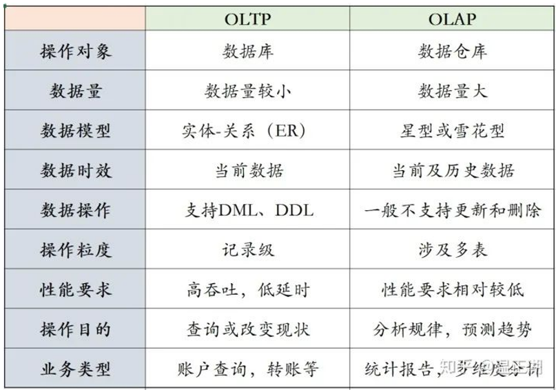

# 数据仓库与数据挖掘（上）

> 本来不是很想做这个文档，因为一开始以为这个课的主体是数据仓库，而之前我在Little Tips专题中做过关于离线数仓的完整流程，所以本来不准备进行补充了，但是上到一半发现这个课的主体居然是数据挖掘。。。emmmm所以这个学期所有的课程都需要学习数据挖掘的样子。（商务智能、Spark MLlib、机器学习和这个）刚巧备考商务智能的时候发现数据挖掘的内容挺多的，所以做来做去拆拆合合，还是捣鼓成两个文档了，数据仓库的部分就在文档就在下面；数据挖掘的部分就在另外一个文档。

## 第一章 数据仓库的概念和体系结构

> 很多基本概念在各种小文章中都有提及，所以如果有没有涉及的点，大概率是我在其他的文章中有过介绍，或者我觉得可能这已经是常识了。供大家自行补充。

#### 1、数据仓库的基本概念

###### （1）元数据（metadata）

元数据是数据仓库不可或缺的重要部分，它是描述数据仓库中数据的数据。它可以帮助用户方便快速地找到所需的数据；元数据是描述数据仓库中数据结构和构建方法的数据。

对元数据的分类按照应用场合可以分为**数据元数据和过程元数据**。数据元数据又可以称为信息系统元数据，信息系统使用元数据对数据源进行描述，以按照用户的需求检索、存取和理解元数据，数据元数据保证了数据的正常使用，它支撑着系统信息结构的演进。过程元数据又可以称为软件结构元数据，它是关于应用系统的描述信息，可以帮助用户查找、评估、存取和管理数据，系统软件结构中关于各个组件接口、功能和依赖关系的元数据保证了软件组建的灵活动态配置。

按照用途的不同，元数据可以分为**技术元数据和业务元数据**两类。技术元数据是关于数据仓库系统各项技术实现细节、被用于开发和管理数据仓库的数据，保证了数据仓库的正常运行。业务元数据从业务角度出发，提供了介于用户和实际系统之间的语义层描述，以辅助数据仓库用户能够“读懂”数据仓库中的数据。

###### （2）数据粒度

数据仓库所存在的不同数据综合级别，一般就称之为“粒度”。不同的粒度级别代表着不同的数据细节程度和综合程度，一般粒度越大，数据的细节程度越低，综合程度越高。

###### （3）数据模型

数据模型是对现实世界的抽象表达，根据抽象程度的不同，衍生了不同层次的数据模型。

- 和数据库数据模型的主要区别
  - 数据仓库数据模型增加了时间属性以区分不同时期的历史数据
  - 数据仓库的数据模型不含有纯操作型数据
  - 数据仓库的数据模型中增加了一些额外的综合数据
- 概念数据模型
  - 概念数据模型是连接主观世界与客观世界的桥梁，常用的概念数据模型有星型模型、雪花模型以及星系模型三种。
- 逻辑数据模型
  - 逻辑数据模型是对数据仓库中主题的逻辑实现，定义了每一个主题所有关系表之间的关系模式。
- 物理数据模型
  - 物理数据模型是逻辑数据模型在数据仓库中的具体实现。

###### （4）ETL（extract，transform and load）

原始数据源的数据经过抽取、转换并加载到数据仓库中的数据库的过程称为ETL。

数据抽取主要包括数据提取、数据清洁、数据转换以及生成衍生数据四个主要功能。

- 数据提取要完成的主要工作就是确定要导入到数据仓库的数据有哪些。
- 数据清洁负责检查数据源中是否存在脏数据，并按照实现给定的规则对数据进行修改。
- 数据转换负责将数据源中的数据转换为数据仓库统一的格式，其中包括数据格式的转换，数据模式的转换时由于数据仓库和信息系统所面向的数据操作不同，所以在数据模式上也存在不同。

###### （5）数据集市

数据集市在某种程度上来讲就是一个小型的数据仓库。数据集市中的数据往往是关于少数几个主题的，它的数据量远远不如数据仓库，但数据集市所使用到的技术和数据仓库是同样的，它们都是面向分析决策型应用的。

#### 2、数据仓库的特点与组成

###### （1）数据仓库的特点

数据仓库的定义是**面向主题的、数据集成的、数据非易失的、数据随时间变化的**一个支持管理决策的数据集合。

- 面向主题
  - 数据库技术是面向应用，它为每个单独的应用程序组织数据。数据仓库中数据是面向主题来进行组织的；面向主题是建立数据仓库所必须遵守的基本原则，数据仓库中的所有数据都是围绕某一主题组织、展开的。

> **何为主题？**
>
> 主题是一个比较抽象的概念，它是在较高层次上对各信息系统的数据综合、归类并进行数据分析利用的抽象，在逻辑关系上，它对应着我们进行宏观分析时所涉及的数据的一个完整、一致的描述，它能够完整、统一的描述各个分析对象所涉及的各项数据，以及数据之间的关系。
>
> 从数据组织的角度来看，主题就是一些数据集合，这些数据集合对分析对象进行了比较完整的、一致的数据描述，这种描述不仅涉及数据自身，还涉及数据与数据自身的关系。
>
> 从信息系统角度来看，注意就是在一个较高的管理层次上对各信息系统中的数据按照某一具体的管理对象进行综合、归类所形成的分析对象。
>
> 数据仓库的创建、使用都是围绕主题实现的，因此，必须了解如何按照决策分析来抽取主题，所抽取的主题应该包含哪些数据内容，以及这些数据该如何组织。每一个主题要具有明确的界限，独立的内涵。在划分主题时，需要保证在对主题进行分析时所需要的数据都可以在此主题中找到，保证主题数据的完整性。

- 数据集成
  - 需要注意一致性问题
- 非易失的
- 随时间不断变化的
  - 随着时间的推移数据仓库不断增加新的数据内容
  - 随着时间的推移数据仓库中的旧数据被不断删除
  - 数据仓库中包含大量的综合数据，这些综合数据往往和时间有某种必然的联系，数据会随着时间的推移不断进行重新综合。

###### （2）数据仓库的组成

- 满足日常的数据分析操作，必须满足以下几点要求

  - 数据仓库中的数据能够动态添加
  - 提供对数据仓库的管理和维护功能
  - 允许用户增加需求

- 数据仓库系统应该具备以下功能

  - 数据抽取与加载
  - 数据清洗
  - 数据备份与备存
  - 查询导向，即将所有的查询导向适合的数据源

- 数据仓库主要由三大管理器组成

  - 加载管理器：负责从原始信息系统中抽取数据并对抽取的数据进行简单的转换，然后将转换后的数据加载到数据暂存区
    - 自源系统数据抽取
    - 将抽取到的数据快速加载到数据暂存区
    - 对数据进行简单的转换
    - 将转换后的数据加载到与数据仓库类似的数据结构中

  > **简单数据转换操作：**
  >
  > 1. 删除一些不必要的字段
  > 2. 对数据类型进行转换
  > 3. 对数据格式进行转换（例如首字母大写、删除前置空格符等）
  > 4. 根据需求校验字段值得有效性
  > 5. 检验所需字段是否有空值

  - 仓库管理器：负责数据的转换和管理，备存与备份数据
    - 对数据暂存区得数据进行转换与合并，加载到数据仓库数据库
    - 为数据仓库中的数据创建索引、视图以及分区
    - 对数据仓库进行备份（完整备份或者添加式备份）
    - 对超过数据存储期限的数据进行备份（转移到其他存储介质）
    - 验证各字段之间的关系与一致性
    - 创建新的集合信息或者更新已有集合的信息
  - 查询管理器：管理所有的数据仓库查询请求并进行数据源引导

数据仓库中的数据由事实数据和维度数据组成；事实数据是从原始数据中经过数据清洗后得数据，它能反映过去事实的数据；维度数据是为了加速数据查询速度而创建的索引数据。

#### 3、数据仓库的体系结构

###### （1）传统得数据仓库体系结构

传统数据仓库基于关系型数据库，通过数据的抽取、转换、加载后进入到数据仓库，最终为上层应用提供数据支持。

- 面临的挑战：
  - 架构问题
    - 数据移动代价过高
    - 无法快速适应变化
    - 海量数据与系统处理能力之间存在鸿沟
    - 系统开放性不够
  - 扩展性问题
  - 数据组织方式问题
    - 关系模型描述能力有限
    - 关系模型得扩展性支撑能力有限
  - 容错性问题

###### （2）大数据时代的数据仓库

- 高度可扩展性
- 高性能
- 高度容错
- 支持异构环境
- 较低的分析时延
- 易用开放的接口
- 自调优
- 较低的成本
- 兼容性

###### （3）体系结构（主要记图）

- **可伸缩的云计算环境**：可伸缩的云计算环境由所涉及的硬件、系统软件、网络设备以及各种存储等组成，实现的方式可以基于私有云的方式，也可以基于公有云的方式，从而实现自动化、虚拟化和标准化管理等。大数据时代的数据仓库建设在可伸缩的云计算环境之上，可以实现资源的按需分配，屏蔽掉底层硬件的差异，从而使焦点聚焦于数据仓库软件的实现上。
- **数据源层**：数据源层中的数据主要包括结构化、半结构化和非结构化数据源。结构化数据源主要指各种关系型数据库，例如DB2、Oracle、MySQL等。半结构化数据源主要是指各种包含半结构化数据（例如XML、Excel、文本和日志等）的数据源。非结构化数据源主要是指包含图像、音频、视频等非结构化数据的数据源。大数据时代数据仓库的数据源与传统的数据仓库的数据源相比，数据的类型更多，结构更加复杂。
- **数据预处理层**：数据预处理层主要完成数据的抽取、清洗、集成和变换、规约、装载等工作。数据抽取从数据源层中获取与主题相关的原始数据；数据清理主要负责去除冗余数据；数据集成负责按照主题对数据进行集成并删除一些不必要的字段；数据变换负责按照统一的表现形式(格式）对所有的数据进行规范化。大数据时代的数据预处理工作与传统的数据预处理并无本质上的差别，有的只是数据预处理方法上的不同，例如，对于字段缺失，传统的数据预处理工作更多的是使用比较固定的预处理规则来进行数据的补全，而大数据时代的数据预处理引入了大数据时代的处理方法（机器学习等)来对缺失数据进行预测，使得经过预处理后的结果更加合理准确。
- **大数据存储与管理层**：大数据存储与管理层与传统数据仓库体系结构中的数据存储与管理层的功能一致，都是存储历史数据以及管理数据仓库。不同的是大数据存储与管理所采取的存储方式以及仓库管理手段与传统数据仓库有所不同，主要是由于数据的规模大、数据类别（非结构化、半结构化、结构化）多导致关系型数据库无法应对。大数据时代的数据存储组织方式不仅仅包括传统数据仓库所采用的行存储，还包括有列存储（例如NoSQL）以及混合式存储两种方式。
- **OLAP服务器层**：传统的数据仓库体系结构中的OLAP 服务器层与大数据时代的数据仓库体系结构中的OLAP服务器层从功能上来看并没有本质区别。
- **大数据处理层**：解决传统数据仓库无法处理的大规模数据计算。大数据处理采用分布式的集群，设计适合分布式集群存储的数据存储方法并设计相应的分布式并行计算算法。大规模的分布式并行化计算算法是大数据处理和传统的数据处理之间本质的区别，大数据时代的数据仓库的OLAP服务器与传统的数据仓库的OLAP服务器的设计初衷以及思路基本是一致的，只不过由于底层的数据存储方式已经发展为了大规模分布式存储，因此，数据处理算法也需要向并行化改进。

------

## 第二章 数据

#### 1、数据的概念

数据是指对客观事件进行记录并可以鉴别的符号，是信息的表现形式和载体。**数据所指代的并不仅是狭义上的数字，还可以包括符号、文字、语音、图形和视频等。**

- 在计算机科学中，数据是指所有能输入到计算机中并被计算机程序处理的符号和介质的总称
- 数据经过加工后就成为信息

###### 数据的属性

数据的属性是指数据在某方面的特征，我们根据属性的性质将属性分为四种类型：

- 标称：如性别(男、女)、婚姻状况(已婚、未婚)、职业(教师、医生、电工)
- 序数：成绩等级(优、良、中、及格、不及格)、衣服尺码(S、M、L、XL)
- 区间：测量单位，如温度、日历日期等
- 比率：如绝对温度、年龄、长度、成绩分数等

###### 数据集

数据集是待处理的数据对象的集合，在数据挖掘领域，数据集有三个重要的特性：维度、稀疏性和分辨率：

- 维度：指数据集中的对象具有的属性个数总和
- 稀疏性：指在数据集中，有意义的数据的多少
- 分辨率：可以在不同的分辨率下或者粒度下得到数据，而且在不同的分辨率下对象的数据也不同

#### 2、数据预处理

###### （1）预处理的意义

数据质量问题：现实世界的数据一般是**含噪声的、不完整的、不一致的，是“肮脏的”**。

- 不一致数据：缺乏统一的分类标准和编码方案。
- 重复数据：存在相同的记录，相同的信息存储在多个数据源中。
- 残缺数据：空值
- 噪声数据：错误值或孤立点
- 高维数据：存在无用属性

**改进数据质量，提高其后的挖掘过程的精度和性能。数据预处理是知识发现过程的重要步骤。检测数据异常、尽早调整数据，并归约待分析数据，将得到较高决策回报。**

数据预处理是构建数据仓库或者进行数据挖掘的工作中占工作量最大的一个步骤。

###### （2）基本方法

**数据清洗**：除去噪声，纠正不一致性。

- 填写空缺的值，平滑噪声数据，识别、删除孤立点，解决不一致性

**数据集成**：将多种数据源合并成一致的数据存储。

- 集成多个数据库、数据立方体或文件

**数据变换**：即规范化，可以改进距离度量的挖掘算法的精度和有效性。

- 规范化和聚集

**数据归约**：通过聚集、删除冗余特性或聚类方法来压缩数据。

- 通过一些技术（概念分层上卷等）得到数据集的压缩表示，它小得多，但可以得到相同或相近的结果

#### 3、数据清洗

数据清洗(Data cleaning)，就是按照一定的规则把“脏数据”“洗掉”，即填充空缺的值，识别孤立点、消除噪声，并纠正数据中的不一致。

通过对数据进行重新审查和校验的过程，**发现并纠正数据文件中可识别的错误，包括检查数据一致性，处理无效值和缺失值，删除重复信息、纠正存在的错误，并提供数据一致性等。**

**目的是提高数据质量。**

数据清理一般是**由计算机而不是人工完成**。

业界对数据清洗的认识：**数据清洗是数据仓库构建中最重要的问题**。

###### 噪声处理之分箱方法

分箱(binning):通过考察周围的值来平滑存储数据的值，存储的值被分布到一些“桶”或箱中，实现连续数据的离散化。

箱子是按照属性值划分的子区间，如果属性处于某个子区间的范围，就把属性放进该区间代表的箱子。

分箱方法：**统一权重、统一区间、最小熵法、自定义区间**等。

- 统一权重法（等深分箱法）：将数据集按记录行数分箱，每箱具有相同的记录数，每箱记录数称为箱子的深度。
- 统一区间法（等宽分箱法）：使数据集在整个属性值的区间上平均分布，即每个箱的区间范围是一个常量，称为箱子宽度。
- 自定义区间：如将收入划分为1000元以下、1000-2000、2000-3000、3000-4000和4000以上。

分箱目的是对各个箱子中的数据进行处理，完成了分箱之后，就需要采用一种方法对数据进行平滑，使得箱中的数据更接近，目前通常使用的平滑方法有**按平均值平滑、按边界值平滑和按中值平滑**。下面对上例中统一区间法分箱后的结果，分别采用三种平滑方法进行处理。

#### 4、数据集成

数据集成是把不同来源、格式、特点性质的数据在逻辑上或物理上有机地集中。这些数据源可以包括多个数据库、数据立方体或一般文件。数据集成可能出现的问题归结为以下几类：

- 模式匹配：将多个数据源中的数据整合到一个一致的存储中；
  - 模式匹配即整合不同数据源中的元数据。在模式匹配过程中涉及实体识别问题。

- 数据值冲突：来源不同的同一个实体具有不同的数据值；
  - 不同数据源中，表示同一实体的属性值可能存在不同，可能表现在单位不统一、数值类型不统一等方面。

- 数据冗余：冗余是指重复存在的消息，在数据挖掘领域中，也指无用的信息；
  - 冗余是指重复存在的消息，在数据挖掘领域中，也指无用的信息。一个属性（例如，年收入）如果能由另一个或另一组属性“导出”，则这个属性可能是冗余的。属性或维命名的不一致也可能导致结果数据集中的冗余。

#### 5、数据变换

数据变换是将数据转换成适合挖掘的形式（原始数据表并不适合直接用于数据挖掘，需变换之后才能使用），主要有：

- **平滑**：除去数据中的噪声，如分箱、聚类和回归。
  - 增减少属性的取值个数，减少挖掘算法的工作量

- **聚集**：对数据进行汇总和聚集。
  - avg(), count(), sum(), min(), max()…

- **数据概化**：使用概念分层，用高层概念替换低层“原始”数据。
  - 使用概念分层的方式，利用高层的概念来替换低层或原始数据。

- **规范化**：将属性数据按比例缩放，使之落入一个小的特定区间。
  - 所用的度量单位可能影响数据分析。例如，把高度的度量单位从米变成英寸，把重量的度量单位从公斤改成磅，可能导致完全不同的结果。为了帮助避免对度量单位选择的依赖性，需要对数据进行规范化，对属性数据进行缩放，使之可以落入到一个较小的特定区域之间，如[-1，1]、[0，1]。
  - 主要的数据规范化方法：
    - 最小-最大规范化（MIN-MAX ）
    - 零-均值规范化（z-score）
    - 小数定标规范化

#### 6、数据归约

数据归约的本质就是缩小数据的范围，是指在不破坏数据完整性的前提下，获得比原始数据小得多的挖掘数据集，该数据集可以得到和原始数据集相同的挖掘结果，进而减少数据挖掘所需要的时间。常用的数据归约方法：

- 数据立方体聚集：减少数据的维度
- 维归约：删除不相关、弱相关或冗余属性
- 数据压缩：使用正确的编码压缩数据集
- 数值规约：用较小的数值表示数据，或采用较短的单位，或使用模型来表示数据
- 离散化和概念分层产生：离散化是用确定的有限个区段值代替原始值；概念分层是指用较高层次的概念替换低层次的概念

> 用于数据归约的时间不应当超过或“抵消”在归约后的数据上挖掘节省的时间

------

## 第三章 数据存储

#### 1、数据模型

数据模型（Data Model）是对现实世界数据特征的抽象表达，是用来描述数据的一组概念和定义。在信息管理中需要将现实世界的事物转换为信息世界的数据才能对信息进行处理与管理，这就需要依靠数据模型作为这种转换的桥梁。

现实世界中的客观对象抽象为概念模型，然后把概念模型转化为数据仓库支持的数据模型。其转化过程如下：

###### （1）概念模型

概念模型描述的是从客观世界到主观认识的映射，它是用于我们为一定的目标设计系统、收集信息而服务的一个概念性工具。

进行概念模型设计所要完成的工作有：

- **界定系统边界**，即进行任务和环境评估、需求收集和分析，了解用户迫切需要解决的问题及解决这些问题所需要的信息，要对现有数据库中的内容有一个完整而清晰的认识。

- **确定主要的主题域及其内容**，即要确定系统所包含的主题域，然后对每一个主题域的公共码键、主题域之间的联系、充分代表主题的属性组进行较为明确的描述。

###### （2）逻辑模型

逻辑模型是对数据仓库中主题的逻辑实现，从支持决策的角度去定义数据实体，更适合大量复杂查询。通常有两种逻辑模型表示法：星型模型和雪花模型。进行逻辑模型设计所要完成的主要工作有：

- 分析主题域，定义逻辑模型
- 数据粒度的层次划分
- 确定数据分割策略
- 增加导出字段

###### （3）物理模型

物理模型是逻辑模型在数据仓库中的具体实现。进行逻辑模型设计所要完成的主要工作有：

- 确定数据的存储结构
- 确定数据的索引策略
- 确定数据的存储策略
- 存储分配优化

#### 2、元数据存储

元数据（Metadata）就是描述数据的数据，用于建立、管理、维护和使用数据仓库。元数据管理是企业数据仓库的关键组件，贯穿与建立数据仓库的整个过程。

###### （1）按类型分类

**基础元数据**：基础数据是指数据仓库系统中所有的数据源、数据集市、数据仓库和应用中的数据。

**数据处理元数据**：数据处理元数据是数据仓库系统中与数据处理过程紧密相关的元数据，它包括数据加载、清理、更新、分析和管理信息。

###### （2）按抽象层次分类

**概念元数据**：应用系统、预定义查询和分析应用相关的信息

**逻辑元数据**：应用数学语言的描述，它从某种程度是概念元数据的更深层次的描述

**物理元数据**：关于数据仓库实现的最底层信息，包括事务规则、SQL编码、关系索引文件和分析应用代码等

###### （3）按用户角度分类

**管理元数据**：是存储关于数据仓库系统技术细节的数据，用于开发和管理数据仓库。包括：

- 数据仓库结构的描述
- 汇总用的算法
- 有操作环境到数据仓库环境的映射

**用户元数据**：从最终用户角度描述数据仓库包括：

- 如何连接数据仓库
- 可以访问数据仓库的哪些数据
- 数据来自哪一个源系统

###### （4）按元数据来源分类

**工具元数据**：指由ETL（数据抽取、数据转换、数据装载）组件、数据仓库设计工具等产生的元数据

**资源元数据**：指由操作系统、数据集市、数据库和数据字典生成的元数据

**外部数据**：指的是从本地数据仓库系统以外的其他系统输入的元数据。如业务系统数据库中的数据。

###### （5）元数据的作用

元数据是进行数据集成所必需的

元数据定义的语义层可以帮助最终用户理解数据仓库中的数据。

元数据是保证数据质量的关键。

元数据可以支持需求变化。

#### 3、数据集市

为了解决灵活性和性能之间的矛盾，数据仓库的体系结构中就增加了数据集市。

###### （1）定义

数据集市是一种小型的部门级的数据仓库，主要面向部门级业务，并且只面向某个特定的主题，是为满足特定用户（一般是部门级别的）的需求而建立的一种分析型环境。

投资规模比较小，更关注在数据中构建复杂的业务规则来支持功能强大的分析

常称为“小数据仓库”或“部门级数据仓库”

###### （2）误区

单纯用数据量大小来区分数据集市和数据仓库

数据集市容易建立

**数据集市容易升级到数据仓库**

###### （3）特点

特定用户群体所需的信息通常是一个部门或一个特定组织的用户。

支持访问非易变的业务信息。

协调组织中多个运行系统的信息。

为即席分析和预定义报表提供合理的查询响应时间。

###### （4）数据集市的类型

**从属型数据集市**

- 从属型数据集市的数据来自于企业级数据仓库，是企业级数据仓库的子集。各数据集市中数据的组织、格式和结构在整个系统中保持一致一般为那些访问数据仓库十分频繁的关键业务部门建立从属型数据集市，这样可以更好地提高查询反应速度。

**独立型数据集市**

- 独立型数据集市，是指它的数据直接来源于各操作数据环境，当为各个部门建立相关数据集市后，这些数据集市之间相互独立，可能具有不同的数据存储类型。

###### （5）建立方式

**自上而下的方法：**从属型的数据集市采用的是自上而下的方法。首先建立企业的数据仓库，然后从企业级的数据仓库中为各个部门抽取必要的数据建立部门级的数据集市。

**自下而上的方法：**自下而上的开发方法是先从数据集市入手，就某一个特定的主题，先构建独立的数据集市，当数据集市达到一定的规模，再从各个数据集市进行数据的再次抽取建立企业级的数据仓库。

#### 4、数据存储

详见我[大数据存储技术（《深入分布式缓存：从原理到实践》）](https://www.fenrisx.icu/2022/11/30/大数据存储技术备考/)这篇博客

------

## 第四章 OLAP与数据立方体

#### 1、OLAP

###### （1）基本思想

联机分析处理（OLAP），又称为多维分析处理。通过对多维信息以很多种可能的观察方式进行快速、稳定、一致和交互性的访问和存取，允许管理决策人员对数据进行深入的观察。

###### （2）基本目标

满足决策支持或多维环境特定的查询和报表需求，它的技术核心是“维度”这个概念，因此OLAP也可以说是多维数据分析工具的集合。

###### （3）OLAP与OLTP对比

###### （4）特征

**快速性（fast）**

- 用户对OLAP的响应速度有着很高的要求，这正是联机分析处理“在线”特征的体现。

**可分析性（analysis）**

- 不同的用户会存在不同的需求、不同的分析请求，面对众多种类的分析请求，需要OLAP 系统应能处理用户的任何逻辑分析请求和统计分析请求。

**多维性（multidimensional）**

- 要求系统在完成多维数据分析之后，同时也能够将分析结果以多维视图的形式提供给用户。

**信息性（information）**

- OLAP 应具备管理大容量信息的能力。

#### 2、多维分析操作

###### （1）切片

在给定数据立方体的一个维上进行选择一个维度成员的操作就是切片，切片的结果是得到一个二维平面数据。

###### （2）切块

在给定数据立方体的一个维上进行选择两个或多个维成员的操作就是切块，切块的结果得到一个子立方体。

###### （3）钻取

改变维的层次，变换分析的粒度。它包括向下钻取（drill-down)和向上钻取(drill-up)。

- 向上钻取：向上钻取是在某一维上将低层次的细节数据概括到高层次的汇总数据，或者减少维数。
- 向上钻取：向上钻取是在某一维上，它从汇总数据深入到细节数据进行观察，或者增加新维。

###### （4）旋转

旋转就是将维的位置进行互换。旋转操作的本质就是改变观察数据立方体的视角，通过交换行和列得到不同视角的数据。

#### 3、数据立方体

###### 基本概念

**方体：**在数据立方体中，它的每个维度都可能存在概念分层。从这些不同的概念层上创建出的数据立方体称为方体，实质上，一个方体就相当于一个group-by。

**基本方体：**就是在抽象程度最低的层面上建立的数据立方体。基本方体的泛化程度是最小的。

**顶点方体：**与基本方体恰恰相反，顶点方体是从抽象程度最高的层面上建立出来的，它的泛化程度也是最大的。

数据立方体中的单元所存储的值，与多维空间的数据点一一对应。它可以分为基本单元和聚集单元。

- 聚集值：经过处理的数据。

- 基本单元：不含聚集值的单元。基本方体的单元就是基本单元。

- 聚集单元：非基本单元的单元是聚集单元。聚集单元在一个或多个维聚集。

为了提高OLAP的查询效率，有时要预计算整个立方体，预计算的过程称为物化。物化也称为聚集。物化分为三类：

- 完全物化 : 预先计算所有方体。完全物化在响应查询时会很迅速，但是需要海量的存储空间。

- 不物化 : 不预先计算任何“非基本方体”。在响应查询的时候会耗费大量计算资源，而且还很缓慢。

- 部分物化 :选择一部分进行预先计算。部分物化很好的调和了不物化的“响应慢，存储空间小”和完全物化的“响应快，存储空间大”。可以预先计算一些用户指定的维度或者单元。	