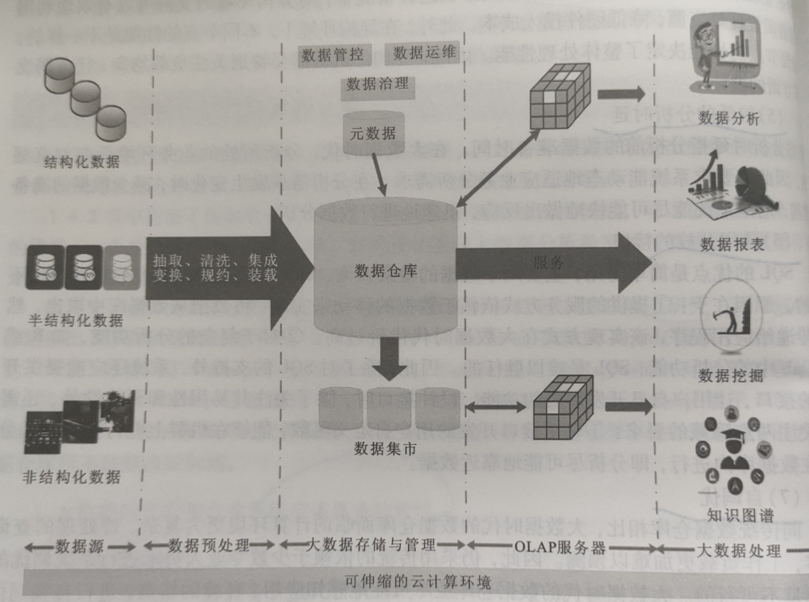

# 数据仓库与数据挖掘（上）

> 本来不是很想做这个文档，因为一开始以为这个课的主体是数据仓库，而之前我在Little Tips专题中做过关于离线数仓的完整流程，所以本来不准备进行补充了，但是上到一半发现这个课的主体居然是数据挖掘。。。emmmm所以这个学期所有的课程都需要学习数据挖掘的样子。（商务智能、Spark MLlib、机器学习和这个）刚巧备考商务智能的时候发现数据挖掘的内容挺多的，所以做来做去拆拆合合，还是捣鼓成两个文档了，数据仓库的部分就在文档就在下面；数据挖掘的部分就在另外一个文档。

## 第一章 数据仓库的概念和体系结构

> 很多基本概念在各种小文章中都有提及，所以如果有没有涉及的点，大概率是我在其他的文章中有过介绍，或者我觉得可能这已经是常识了。供大家自行补充。

#### 1、数据仓库的基本概念

###### （1）元数据（metadata）

元数据是数据仓库不可或缺的重要部分，它是描述数据仓库中数据的数据。它可以帮助用户方便快速地找到所需的数据；元数据是描述数据仓库中数据结构和构建方法的数据。

对元数据的分类按照应用场合可以分为**数据元数据和过程元数据**。数据元数据又可以称为信息系统元数据，信息系统使用元数据对数据源进行描述，以按照用户的需求检索、存取和理解元数据，数据元数据保证了数据的正常使用，它支撑着系统信息结构的演进。过程元数据又可以称为软件结构元数据，它是关于应用系统的描述信息，可以帮助用户查找、评估、存取和管理数据，系统软件结构中关于各个组件接口、功能和依赖关系的元数据保证了软件组建的灵活动态配置。

按照用途的不同，元数据可以分为**技术元数据和业务元数据**两类。技术元数据是关于数据仓库系统各项技术实现细节、被用于开发和管理数据仓库的数据，保证了数据仓库的正常运行。业务元数据从业务角度出发，提供了介于用户和实际系统之间的语义层描述，以辅助数据仓库用户能够“读懂”数据仓库中的数据。

###### （2）数据粒度

数据仓库所存在的不同数据综合级别，一般就称之为“粒度”。不同的粒度级别代表着不同的数据细节程度和综合程度，一般粒度越大，数据的细节程度越低，综合程度越高。

###### （3）数据模型

数据模型是对现实世界的抽象表达，根据抽象程度的不同，衍生了不同层次的数据模型。

- 和数据库数据模型的主要区别
  - 数据仓库数据模型增加了时间属性以区分不同时期的历史数据
  - 数据仓库的数据模型不含有纯操作型数据
  - 数据仓库的数据模型中增加了一些额外的综合数据
- 概念数据模型
  - 概念数据模型是连接主观世界与客观世界的桥梁，常用的概念数据模型有星型模型、雪花模型以及星系模型三种。
- 逻辑数据模型
  - 逻辑数据模型是对数据仓库中主题的逻辑实现，定义了每一个主题所有关系表之间的关系模式。
- 物理数据模型
  - 物理数据模型是逻辑数据模型在数据仓库中的具体实现。

###### （4）ETL（extract，transform and load）

原始数据源的数据经过抽取、转换并加载到数据仓库中的数据库的过程称为ETL。

数据抽取主要包括数据提取、数据清洁、数据转换以及生成衍生数据四个主要功能。

- 数据提取要完成的主要工作就是确定要导入到数据仓库的数据有哪些。
- 数据清洁负责检查数据源中是否存在脏数据，并按照实现给定的规则对数据进行修改。
- 数据转换负责将数据源中的数据转换为数据仓库统一的格式，其中包括数据格式的转换，数据模式的转换时由于数据仓库和信息系统所面向的数据操作不同，所以在数据模式上也存在不同。

###### （5）数据集市

数据集市在某种程度上来讲就是一个小型的数据仓库。数据集市中的数据往往是关于少数几个主题的，它的数据量远远不如数据仓库，但数据集市所使用到的技术和数据仓库是同样的，它们都是面向分析决策型应用的。

#### 2、数据仓库的特点与组成

###### （1）数据仓库的特点

数据仓库的定义是**面向主题的、数据集成的、数据非易失的、数据随时间变化的**一个支持管理决策的数据集合。

- 面向主题
  - 数据库技术是面向应用，它为每个单独的应用程序组织数据。数据仓库中数据是面向主题来进行组织的；面向主题是建立数据仓库所必须遵守的基本原则，数据仓库中的所有数据都是围绕某一主题组织、展开的。

> **何为主题？**
>
> 主题是一个比较抽象的概念，它是在较高层次上对各信息系统的数据综合、归类并进行数据分析利用的抽象，在逻辑关系上，它对应着我们进行宏观分析时所涉及的数据的一个完整、一致的描述，它能够完整、统一的描述各个分析对象所涉及的各项数据，以及数据之间的关系。
>
> 从数据组织的角度来看，主题就是一些数据集合，这些数据集合对分析对象进行了比较完整的、一致的数据描述，这种描述不仅涉及数据自身，还涉及数据与数据自身的关系。
>
> 从信息系统角度来看，注意就是在一个较高的管理层次上对各信息系统中的数据按照某一具体的管理对象进行综合、归类所形成的分析对象。
>
> 数据仓库的创建、使用都是围绕主题实现的，因此，必须了解如何按照决策分析来抽取主题，所抽取的主题应该包含哪些数据内容，以及这些数据该如何组织。每一个主题要具有明确的界限，独立的内涵。在划分主题时，需要保证在对主题进行分析时所需要的数据都可以在此主题中找到，保证主题数据的完整性。

- 数据集成
  - 需要注意一致性问题
- 非易失的
- 随时间不断变化的
  - 随着时间的推移数据仓库不断增加新的数据内容
  - 随着时间的推移数据仓库中的旧数据被不断删除
  - 数据仓库中包含大量的综合数据，这些综合数据往往和时间有某种必然的联系，数据会随着时间的推移不断进行重新综合。

###### （2）数据仓库的组成

- 满足日常的数据分析操作，必须满足以下几点要求

  - 数据仓库中的数据能够动态添加
  - 提供对数据仓库的管理和维护功能
  - 允许用户增加需求

- 数据仓库系统应该具备以下功能

  - 数据抽取与加载
  - 数据清洗
  - 数据备份与备存
  - 查询导向，即将所有的查询导向适合的数据源

- 数据仓库主要由三大管理器组成

  - 加载管理器：负责从原始信息系统中抽取数据并对抽取的数据进行简单的转换，然后将转换后的数据加载到数据暂存区
    - 自源系统数据抽取
    - 将抽取到的数据快速加载到数据暂存区
    - 对数据进行简单的转换
    - 将转换后的数据加载到与数据仓库类似的数据结构中

  > **简单数据转换操作：**
  >
  > 1. 删除一些不必要的字段
  > 2. 对数据类型进行转换
  > 3. 对数据格式进行转换（例如首字母大写、删除前置空格符等）
  > 4. 根据需求校验字段值得有效性
  > 5. 检验所需字段是否有空值

  - 仓库管理器：负责数据的转换和管理，备存与备份数据
    - 对数据暂存区得数据进行转换与合并，加载到数据仓库数据库
    - 为数据仓库中的数据创建索引、视图以及分区
    - 对数据仓库进行备份（完整备份或者添加式备份）
    - 对超过数据存储期限的数据进行备份（转移到其他存储介质）
    - 验证各字段之间的关系与一致性
    - 创建新的集合信息或者更新已有集合的信息
  - 查询管理器：管理所有的数据仓库查询请求并进行数据源引导

数据仓库中的数据由事实数据和维度数据组成；事实数据是从原始数据中经过数据清洗后得数据，它能反映过去事实的数据；维度数据是为了加速数据查询速度而创建的索引数据。

#### 3、数据仓库的体系结构

###### （1）传统得数据仓库体系结构

传统数据仓库基于关系型数据库，通过数据的抽取、转换、加载后进入到数据仓库，最终为上层应用提供数据支持。

- 面临的挑战：
  - 架构问题
    - 数据移动代价过高
    - 无法快速适应变化
    - 海量数据与系统处理能力之间存在鸿沟
    - 系统开放性不够
  - 扩展性问题
  - 数据组织方式问题
    - 关系模型描述能力有限
    - 关系模型得扩展性支撑能力有限
  - 容错性问题

###### （2）大数据时代的数据仓库

- 高度可扩展性
- 高性能
- 高度容错
- 支持异构环境
- 较低的分析时延
- 易用开放的接口
- 自调优
- 较低的成本
- 兼容性

###### （3）体系结构（主要记图）

- **可伸缩的云计算环境**：可伸缩的云计算环境由所涉及的硬件、系统软件、网络设备以及各种存储等组成，实现的方式可以基于私有云的方式，也可以基于公有云的方式，从而实现自动化、虚拟化和标准化管理等。大数据时代的数据仓库建设在可伸缩的云计算环境之上，可以实现资源的按需分配，屏蔽掉底层硬件的差异，从而使焦点聚焦于数据仓库软件的实现上。
- **数据源层**：数据源层中的数据主要包括结构化、半结构化和非结构化数据源。结构化数据源主要指各种关系型数据库，例如DB2、Oracle、MySQL等。半结构化数据源主要是指各种包含半结构化数据（例如XML、Excel、文本和日志等）的数据源。非结构化数据源主要是指包含图像、音频、视频等非结构化数据的数据源。大数据时代数据仓库的数据源与传统的数据仓库的数据源相比，数据的类型更多，结构更加复杂。
- **数据预处理层**：数据预处理层主要完成数据的抽取、清洗、集成和变换、规约、装载等工作。数据抽取从数据源层中获取与主题相关的原始数据；数据清理主要负责去除冗余数据；数据集成负责按照主题对数据进行集成并删除一些不必要的字段；数据变换负责按照统一的表现形式(格式）对所有的数据进行规范化。大数据时代的数据预处理工作与传统的数据预处理并无本质上的差别，有的只是数据预处理方法上的不同，例如，对于字段缺失，传统的数据预处理工作更多的是使用比较固定的预处理规则来进行数据的补全，而大数据时代的数据预处理引入了大数据时代的处理方法（机器学习等)来对缺失数据进行预测，使得经过预处理后的结果更加合理准确。
- **大数据存储与管理层**：大数据存储与管理层与传统数据仓库体系结构中的数据存储与管理层的功能一致，都是存储历史数据以及管理数据仓库。不同的是大数据存储与管理所采取的存储方式以及仓库管理手段与传统数据仓库有所不同，主要是由于数据的规模大、数据类别（非结构化、半结构化、结构化）多导致关系型数据库无法应对。大数据时代的数据存储组织方式不仅仅包括传统数据仓库所采用的行存储，还包括有列存储（例如NoSQL）以及混合式存储两种方式。
- **OLAP服务器层**：传统的数据仓库体系结构中的OLAP 服务器层与大数据时代的数据仓库体系结构中的OLAP服务器层从功能上来看并没有本质区别。
- **大数据处理层**：解决传统数据仓库无法处理的大规模数据计算。大数据处理采用分布式的集群，设计适合分布式集群存储的数据存储方法并设计相应的分布式并行计算算法。大规模的分布式并行化计算算法是大数据处理和传统的数据处理之间本质的区别，大数据时代的数据仓库的OLAP服务器与传统的数据仓库的OLAP服务器的设计初衷以及思路基本是一致的，只不过由于底层的数据存储方式已经发展为了大规模分布式存储，因此，数据处理算法也需要向并行化改进。

------

## 第二章 数据

## 第三章 数据存储

## 第四章 OLAP与数据立方体

