# 数据仓库与数据挖掘（下）

## 第五章 数据挖掘基础

数据挖掘又称为数据库中的知识发现(knowledge discovery in database，KDD)，它是一个**利用人工智能，机器学习和统计学等多学科理论分析大量的数据，进行归纳性推理，从事务数据库、文本数据库、空间数据库、多媒体数据库、数据仓库以及其他数据文件中提取正确的、新颖的、有效的以及人们感兴趣的知识的高级处理过程**。数据挖掘的任务是从大量的数据中发现对决策有用的知识，发现数据特性以及数据之间的关系,这些知识表现为概念、规则、模式和规律等多种形式。

#### 1、数据挖掘基础

###### （1）概念

数据挖掘不是验证某个假设的正确性，而是在数据中寻找未知模式，本质上是一个归纳学习的过程。数据挖掘是一门涉及面很广的交叉学科，融合了模式识别、数据库、统计学、机器学习、粗糙集、模糊数学和神经网络等多个领域的理论。数据挖掘有一些替代词，如数据库中的知识发现、知识提炼、模式识别、数据考古、数据捕捞和信息获取等。由于“数据挖掘”能表现“挖掘”的本质，因此在学术界和企业界被广泛应用。

概括而言，**数据挖掘是从大量的、不完全的、有噪声的、模糊的、随机的数据中提取正确的、有用的、未知的、综合的以及用户感兴趣的知识并用于决策支持的过程。**

该课程中的定义：**数据挖掘就是从大量的、不完全的、有噪声的、模糊的随机的过程中，提取隐含在其中的、人们事先不知道的但又是潜在有用的信息和知识的过程。这些信息的表现形式为：规则、概念、规律及模式。**

- 数据源必须是真实的、海量的、含燥声的。
- 发现的是用户感兴趣、新颖的知识。
- 发现的知识应该可接受、可理解、可运用、有价值。
- 知识的形式可以是概念、规则、模式、规律等形式。

###### （2）演变过程

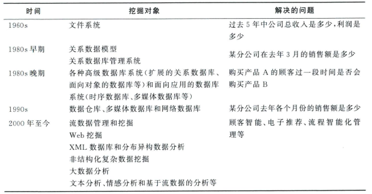

###### （3）数据挖掘的过程

数据挖掘的过程由以下步骤组成：定义业务问题，提取与预处理数据，选择挖掘方法分析，解释挖掘结果，探查新模式以及运用发现的知识。

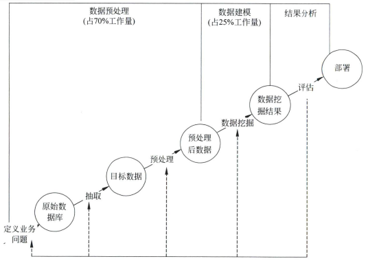

###### （4）数据可视化

数据可视化是指通过图表的形式,对处理后的数据进行分析，揭示其中蕴含的业务问题、规律，把数据转化为有用的信息，辅助决策。

> 下面是几个我觉得比较常用的可视化图表

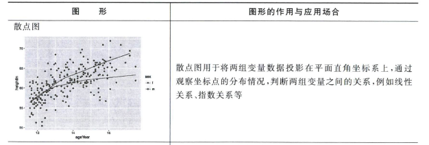

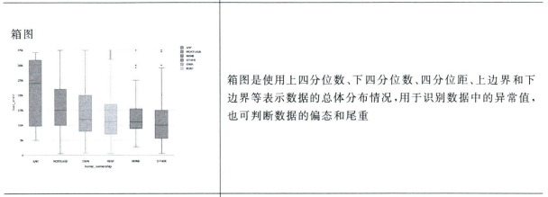

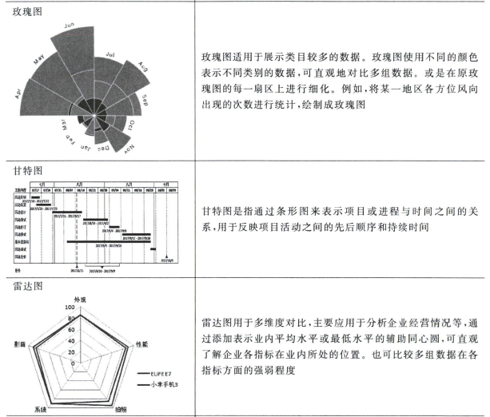

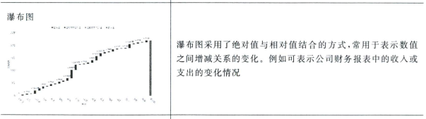

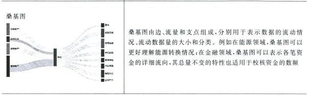

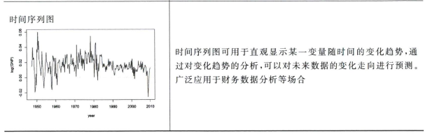

#### 2、数据预处理

数据提取包括理解业务问题、搜集并分析数据源、确定数据的相关性以及使用工具提取数据等。

数据预处理是数据挖掘过程的基础工作，一般占整个数据挖掘过程70%的工作量。数据预处理技术用于**数据清洗、数据集成、数据变换和数据归约等**。数据清洗是指删除噪声和不一致的数据。数据集成是把多个数据源的数据合并存储，如数据仓库。数据变换通过规范化的方法改善数据挖掘算法的精度和有效性。数据归约通过删除冗余属性，使用聚集或聚类方法压缩数据。

###### （1）数据清洗

- 常用的数据清洗方法
  - 聚类
  - 空值处理
    - 忽略包含空值的记录或属性
    - 使用一个常数填充遗漏值，把一楼的属性值用一个常数替换
    - 使用数值型属性的平均值或给定记录属同一类（近邻）的所有样本的平均值填充空值【在特殊规则时不适用】
    - 把空值属性看作决策属性，使用已知属性的值预测未知属性
    - 使用最可能的值填充空值（采用机器学习等方法）

###### （2）数据集成

数据集成把来自多个数据库或者平面文件等不同数据源的数据整合成一致的数据存储。数据集成时，需要考虑实体识别问题。例如，在一个数据库中用学号(student_No)作为学生的标识，而在另一个数据库中学号可能被命名为(S_ID)。通常使用元数据来避免数据集成中出现的错误。

###### （3）数据变换

数据变换把数据转化成适于挖掘的形式。通过对某些属性按比例进行缩放，使属性取值落在较小的区间。

- 平滑：平滑可以有效的去掉噪声，常用的方法有分箱（binning）、聚类和回归分析。
  - 分箱是通过分析邻近的值平滑存储数据的值，可处理连续型和分类型变量，得到更少的变量取值种类，以便于分析。数据被分布到箱中，分箱的方法是进行局部的平滑，也可以作为一种离散化技术使用。

- 聚集：对数据进行汇总。

  - 聚集产生较小的数据集,使得分析的数据更稳定,但也应注意可能会丢失有趣的细节。

- 数据泛化：把任务相关的数据集从较低的概念层抽象到较高的概念层。
- 标准化(standardization)或规范化( normalization)：如果描述样本或记录的变量单位不统一，数值差别比较大，那么就需要通过把数据归一化，指数化或标准化，把不同的属性进行比例缩放，使它们的值落在大致相同的范围内。这在聚类分析,神经网络等数据挖掘算法的数据预处理中经常用到。

###### （4）数据归约

数据挖掘时一般需要对数据集进行归约处理。对归约的数据集进行数据挖掘与原数据应该有相同或差不多的效果,但效率更高。

- 数据立方体聚集：数据立方体聚集的基础是概念的分层，用于处理数据立方体中的数据。
  - 数据立方体聚集为在线分析处理的上钻等操作提供了可以快速访问的汇总数据。
- 维归约：维归约可以剔除相关性较弱或者冗余的属性。
  - 维归约就是从决策分析相关的属性集中选择重要的属性(特征)子集，这需要启发式的算法解决，常用的方法有决策树，粗糙集(rough set)和遗传算法(genetic algorithm)等。

#### 3、数据仓库和数据挖掘的关系

从数据仓库中挖掘出对决策有用的信息和知识，是建立数据仓库最大的目的。而如何从数据仓库中挖掘出有用的数据，则是数据挖掘的研究重点，二者的本质和过程是有区别的。

数据仓库是数据挖掘的一种数据源，数据挖掘是数据仓库的一个应用。

> 内容来自New Bing

数据仓库是为了数据挖掘做预准备，数据挖掘可建立在数据仓库之上，而且两者最终目的都为了提升企业的信息化竞争能力。数据仓库为数据挖掘提供了更好的、更广泛的数据源，为数据挖掘提供了新的支持平台，为更好地使用数据挖掘这个工具提供了方便。

------

## 第六章 关联挖掘

#### 1、关联规则的概念

人们通过发现关联规则，可以从一件事情的发生，来推测另外一件事情的发生，从而更好地了解和掌握事物的发展规律等等，这就是寻找关联规则的基本意义。

关联规则就是有关联的规则，形式是这样定义的：**两个不相交的非空集合X、Y，如果有X-->Y，就说X-->Y是一条关联规则**。

#### 2、关联规则的定义

项目的集合I被称为项目集合(Itemset)，简称项集。

项集中元素的个数称为项集的长度。长度为k的项集被称为**k-项集(k-Itemset)**。

每一个交易有一个唯一的标识—交易号，记作TID。

交易的全体被称为交易数据集或事务数据集，记作D，简称**交易集**。

**规则的支持度**：支持度描述了A和B这两个物品集在所有的事务中同时出现的次数或者出现的概率有多大。

**规则的可信度**：可信度就是指在出现了物品集A的事务T中，物品集B也同时出现的概率。

###### 关联规则的最小支持度和最小可信度

**频繁项集**：在数据集中出现频率相当高的那些项集。如果项集满足最小支持度，则它称之为频繁项集(Frequent Itemset)。

**强关联规则：**

#### 3、Apriori算法

Apriori算法是最常用的**关联规则挖掘算法**。 Apriori算法的扩展性较好，可用于并行计算等领域。Apriori算法的思想是：

- 使用频繁项集性质的先验知识。
- 使用逐层搜索的迭代方法产生频繁项集。

###### （1）Aprior定律

1. 如果一个集合是频繁项集，则它的所有子集都是频繁项集。
   举例：假设一个集合{A,B}是频繁项集，即A、B同时出现在一条记录的次数大于等于最小支持度min_support，则它的子集{A},{B}出现次数必定大于等于min_support，即它的子集都是频繁项集。
2. 如果一个集合不是频繁项集，则它的所有超集都不是频繁项。
   举例：假设集合{A}不是频繁项集，即A出现的次数小于min_support，则它的任何超集如{A,B}出现的次数必定小于min_support，因此其超集必定也不是频繁项集。

**利用这两条定律，我们抛掉很多的候选项集，Apriori算法就是利用这两个定理来实现快速挖掘频繁项集的。**

###### （2）算法步骤

1. 扫描整个数据集，得到所有出现过的数据，作为候选频繁1项集。k=1，频繁0项集为空集。
2. 挖掘频繁k项集
   - 扫描数据计算候选频繁k项集的支持度;
   - **去除候选频繁k项集中支持度低于阈值的数据集,得到频繁k项集。**如果得到的频繁k项集为空，则直接返回频繁k-1项集的集合作为算法结果，算法结束。如果得到的频繁k项集只有一项，则直接返回频繁k项集的集合作为算法结果，算法结束;
   - 基于频繁k项集，连接生成候选频繁k+1项集。
3. 令**k=k+1**，转入步骤2。

###### （3）局限性

在每一次产生候选集时都要扫描一次数据库，生成**大量备选项集**，导致计数工作量太大，影响了算法的效率。

#### 4、FP-Growth算法

FP-Growth算法是针对Apriori算法的缺点提出来的全新的一种算法模式。

###### （1）算法步骤

1. 扫描整个数据集，得到所有出现过的数据，并得到它们的支持度计数作为候选频繁1项集，记为L。
2. 构造FP-Tree树
   - 创建树的根节点，用“null”标记。
   - 第二次扫描数据库。每个事务中的项都按L的次序处理（即按递减支持度计数排序），并**对每个事务创建一个分支**。
   - 当为一个事务考虑增加分枝时，**沿共同的前缀的每个结点的计数增加1，为前缀之后的项创建节点和连接**。
3. 对FP-Tree树进行挖掘频繁项集。

Apriori算法在每一次产生候选集时都要扫描一次数据库，而FP-growth则利用树形结构，无需产生候选项集而是直接得到频繁项集，大大减少了扫描交易数据库的次数。

###### （2）FP-tree结构优点

**完备性：**不会打破交易中的任何模式，而且包含了挖掘序列模式所需的全部信息。

**紧密性：**它剔除不相关信息，不包含非频繁项，按支持度降序排列，支持度高的项在FP-tree中共享的机会也高。

------

## 第七章 聚类分析

#### 1、聚类分析概述

###### （1）定义

**聚类分析**是指将物理或抽象对象的集合分组为由类似的对象组成的多个类的分析过程。

由聚类所生成的簇是一组数据对象的集合，被称为**聚类集合**。簇内的对象之间相似度较高，簇与簇之间对象差别较大。散落在聚类集合之外的点被称为**孤立点**。

**聚类**是将物理或抽象对象分组成多个类或簇，簇内对象间有较高相似度，簇间对象差别较大。

聚类所组成的簇是**一组对象的集合，这些对象与同一簇中的对象彼此类似，与其他簇中的对象相异**。在许多应用中，可以将一些簇中的对象作为一个整体来对待。

聚类分析源于许多研究领域，比如数据挖掘，统计学，生物学，以及机器学习。聚类分析能作为一个独立的工具，来获得数据分布的情况，观察每个簇的特点，集中对特定的或感兴趣的某些簇做进一步分析。

###### （2）目的

寻找数据中：

- 潜在的自然分组结构

- 感兴趣的关系

聚类可以自动发现分组，有时又称作自动分类，这是聚类分析的突出优点。

#### 2、差异度计算

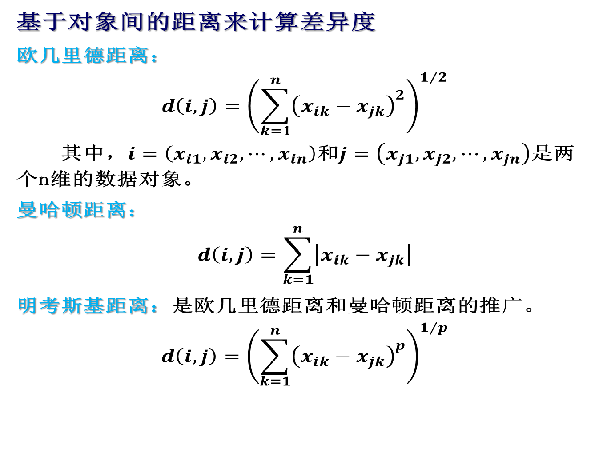

###### 混合类型变量的差异度计算

一个数据库可能包含区间标度量、对称二元变量、不对称二元变量、标称变量、序数型变量或者比例标度变量。

1. 计算用混合类型变量描述的对象之间的差异度方法是将变量按类型分组，对每种类型的变量进行单独的聚类分析。如果在这些分析得到兼容的结果，这种做法是可行的。
2. 将所有变量一起处理，只进行一次聚类分析。将不同意义的变量转换到共同的值域区间[0.0,1.0]上。

#### 3、分割聚类

###### （1）描述

分割聚类方法作为一种基于原型的聚类方法，其本质是先从数据集中随机地选择几个对象来作为聚类的原型，然后再将其他的对象分别分配给与原型所代表的最相似，也就是**距离最近**的类中。
       分割聚类方法给定一个n个对象的集合，构建数据的K个分区。大部分分割方法是**基于距离**的，所以只能发现**球类簇**。

###### （2）基本特点

- 发现球状互斥的簇
- 基于距离
- 可以用均值或者中心点代表簇的中心
- 对中小规模数据有效

###### （3）方法步骤

分割聚类方法首先给定要构建的分区数k，创建一个初始划分。然后，采用一种**迭代**的重定位技术，通过把对象从一个组移动到另一个组来改进分割效果。一个好的分割的一般准则是：**同一个簇中的对象尽可能相互接近或相关，而不同簇中的对象尽可能远离或不同。** 	
       分割聚类方法给定一个含有n个对象的集合，具体划分方法为构建数据的K个分区，每个分区表示一个聚簇，并且k≤n。它将数据划分为k个组，同时满足如下要求：

- **每个组至少包含一个对象；**
- **每个对象必须属于一个组。**

在某些模糊划分的技术中，第二个要求可以适当放宽。

#### 4、K-means算法

k-means算法是将**平均值作为类的“中心”**的一种分割聚类的方法。该算法以k为参数，把n个对象分成k个簇，使簇内具有较高的相似度，而簇间的相似度较低。

###### 算法流程
输入：包含n个对象的数据库和簇的数目k；

输出：k个簇。

(1) 任意选择k个对象作为初始的簇中心；

(2) 对剩余的数据对象，根据其与各个簇中心之间的距离，赋给最近的簇；

(3)更新簇的平均值，即计算每个簇中对象的平均值；

(4)根据簇中对象的平均值，将每个对象(重新)赋予最类似的簇；

(5) 直到不再发生变化。

#### 5、PAM算法

PAM算法实际为**k中心点算法**。中心选用的是具体的某一个点，而不是k均值的几何中心。是对k均值算法的改进，**削弱了离群值的敏感度。但是其运算量较大，适合少量数据的分析。**

###### 算法流程

（1）选取若干点作为初始簇心，并将剩余的点分配到最近的簇

（2）依次循环将非簇心的点假设为簇心，替换现有的一个，计算更改前后的耗费差距

（3）选择耗费差距最小的为新的簇心

（4）簇心的位置没有改变，停止

#### 6、基于密度的聚类方法

分割式聚类算往往只能发现凸形的聚类簇，为了发现**任意形状**的聚类结果，提出了基于密度的聚类方法。这类方法将簇看作是数据空间中被低密度区域分割开的高密度对象区域。
       基于密度聚类方法的主要思想是：**只要“邻域”中的密度（对象或数据点的数目）超过某个阈值，就继续增长给定的簇。**也就是说，对给定簇中的每个数据点，在给定半径的邻域中必须至少包括最少数目的点。这样的方法可以用来过滤噪声或离群点，从而发现任意形状的簇。

#### 7、DBSCAN算法

DBSCAN算法是一种基于高密度联通区域的聚类算法，它将类簇定义为高密度相连点的最大集合。它本身**对噪声不敏感，并且能发现任意形状的类簇**。

###### 基本思想

**如果一个对象在它半径为ε的邻域中至少包含有MinPts个对象，那么该区域被认为是密集的。**为了明确这样的密集区域，该算法涉及到有关密度的一系列定义，进而根据这些定义来确定密集区域，即确定各个类并隔离出异常值。

###### 定义

 **ε邻域：**对于一个给定的具体对象，其半径为 ε的邻域称为该对象的 ε-邻域。

**核心对象：**对于一个对象，如果在其 ε-邻域内至少包含有MinPts个对象,那么该对象称为核心对象。

**直接密度可达：**在所给定的对象集D中，对于参数 ε和MinPts，如果其中q是一个核心对象，对象p在q的 ε-邻域内，那么称对象p为从对象q是直接密度可达的。

**密度可达：**在给定的对象集D中,对于参数 ε和MinPts,如果存在对象p1,p2,…,pn,p1=q,pn=p,对于每一个i∈{1,2,…,n-1},对象pi+1从对象pi是直接密度可达的,那么称对象p从对象q是密度可达的。

**密度相连：**在给定的对象集D中，对于参数 ε和MinPts，如果对象p和对象q都是从对象o密度可达的，那么称对象p和对象q是密度相连的。

###### 算法流程

（1）扫描整个数据集，找到任意一个核心点，对该核心点进行扩充。扩充的方法是寻找从该核心点出发的所有密度相连的数据点（注意是密度相连）。遍历该核心点的 邻域内的所有核心点（因为边界点是无法扩充的），寻找与这些数据点密度相连的点，直到没有可以扩充的数据点为止。最后聚类成的簇的边界节点都是非核心数据点。

（2）重新扫描数据集（不包括之前寻找到的簇中的任何数据点），寻找没有被聚类的核心点，再重复上面的步骤，对该核心点进行扩充。

（3）直到数据集中没有新的核心点为止。数据集中没有包含在任何簇中的数据点就构成异常点。

------

## 第八章 分类

#### 1、基本知识

###### （1）概念

**分类是找出数据库中具有共同特点的一组数据对象，并按照分类模型将其划分成预先定义的不同类型。**

###### （2）过程

1. 建立模型

   第一步，也称为学习步，目标是建立描述预先定义的数据类或概念集的分类器。

   - 分类算法通过从训练集“学习”来构造分类器；
   - 训练集由数据库元组（用n维属性向量表示）和他们相对应的类编号（标签）组成；假定每个元组属于一个预定义的类；
   - 学习模型可以用分类规则、决策树或数学公式的形式提供。

2. 使用模型

   第二步，使用模型，对将来的或未知的对象进行分类。

   - 对每个测试样本，将已知的类标号和该样本的学习模型类预测比较；
   - 模型在给定测试集上的准确率是正确被模型分类的测试样本的百分比；
   - 测试集要独立于训练样本集，否则会出现“过分拟合”的情况。

###### （3）评价标准

先假设分类目标只有正例（P）和负例（N）两种，下面介绍几个常用的分类评价术语：

1. TP：本身为正例，并且被分类器正确划分为正例的样本数；
2. FP：本身为负例，但被分类器错误地划分为正例的样本数；
3. FN：本身为正例，但被分类器错误地划分为负例的样本数；
4. TN：本身为负例，并且被分类器正确划分为负例的样本数。

- 正确率（accuracy）

正确率是我们最常见的评价指标，accuracy = （TP+TN）/(P+N)，这个很容易理解，就是被**分对的样本数除以所有的样本数**，通常来说，正确率越高，分类器越好；

- 错误率（error rate)

错误率则与正确率相反，描述被**分类器错分的比例**，error rate = (FP+FN)/(P+N)，对某一个实例来说，分对与分错是互斥事件，所以 accuracy =1 - error rate；

- 灵敏度（sensitive）

sensitive = TP/P，表示的是**所有正例中被分对的比例**，衡量了分类器对正例的识别能力；

- 特效度（specificity)

specificity = TN/N，表示的是**所有负例中被分对的比例**，衡量了分类器对负例的识别能力；

- 精度（precision）：查准率

精度是精确性的度量，表示被分为**正例的实例中实际为正例的比例**，precision=TP/（TP+FP）；

- 召回率（recall）：查全率

召回率是覆盖面的度量，度量有**多少个正例被分为正例**，recall=TP/(TP+FN)=TP/P=sensitive，可以看到召回率与灵敏度是一样的。

#### 2、决策树

###### （1）什么是决策树？

- 类似于流程图的树结构
- 每个内部节点表示数据对象的一个特征属性
- 每个分枝代表属性的一个取值
- 每个树叶节点代表一个类编号（决策结果）

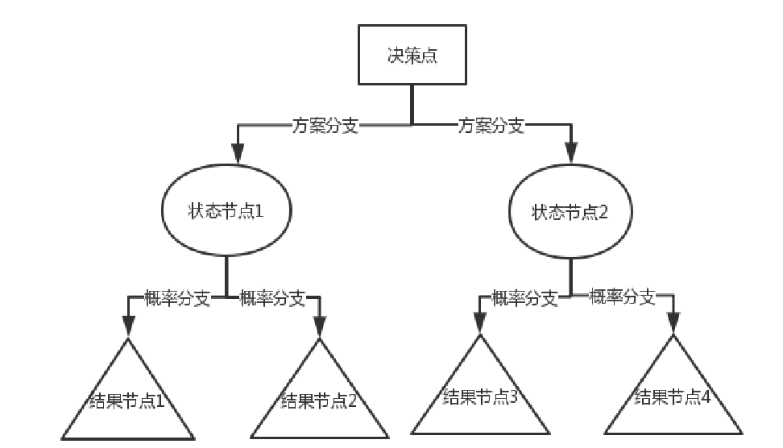

使用决策树进行分类的过程就是从根节点开始，测试待分类项中相应的特征属性，并按照其值选择输出分支，直到到达叶子节点，将叶子节点存放的类别作为分类结果。

###### （2）决策树的生成

- 决策树构建
  - 使用属性选择度量来选择将元组最好的划分为不同的类的属性
  - 递归的通过选定的属性，来划分样本 （必须是离散值）

- 树剪枝
  - 决策树建立时，许多分枝反映的是训练数据中的噪声和离群点，树剪枝试图识别并剪去这种分枝，以提高对未知数据分类的准确性

###### （3）构建流程

1. 得到原始数据集；
2. 根据属性选择度量对数据集进行最优划分，由于特征值可能有多个，因此存在数据集的划分大于两个分支的情况； 
3. 采用递归的原则对数据集进行处理，首次划分后，数据将会向下传递，到达树的分支的下一个节点，在该节点上，可对数据进行再次划分，不断重复该操作，直到达到递归结束条件，才结束递归； 
4. 递归结束的条件是，算法遍历完所有划分好的数据集的属性，或每个分支下的所有实例都具有相同的分类。

#### 3、ID3算法

ID3算法依据“**最大信息熵增益**”原则，这里的熵描述的是数据集的**混乱程度**，数据越混乱，相应的熵就越大，算法每次都选择熵减少程度最大的特征，并用该特征对数据集进行划分，根据该原则，自顶向下遍历决策树空间。ID3算法的基本思想是，**随着决策树深度的增加，节点的熵迅速地降低，熵降低的速度越快越好。**

该方法使用**信息增益**来选择测试属性。 

1. **信息熵是随机变量的期望**。度量信息的不确定程度。信息的熵越大，信息就越不容易搞清楚（杂乱）。
2. **一个系统越是有序，信息熵就越低；反之，一个系统越是混乱，信息熵就越高。**信息熵也可以说是系统有序化程度的一个度量。
3. **信息熵用以表示一个事物的非确定性，**如果该事物的非确定性越高，你的好奇心越重，该事物的信息熵就越高。
4. **熵是整个系统的平均消息量。 信息熵是信息论中用于度量信息量的一个概念。**一个系统越是有序，信息熵就越低；反之，一个系统越是混乱，信息熵就越高。
5. 处理信息就是为了把信息搞清楚，实质上就是要想办法让信息熵变小。

###### 信息量大小的度量

###### 信息增益

信息增益

- 用来衡量给定的属性区分训练样例的能力；
- ID3算法在生成树的每一步使用信息增益从候选属性中选择属性；

用熵度量样例的均一性

###### 不足

1. ID3没有考虑连续特征，比如长度，密度都是连续值，无法在ID3运用。这大大限制了ID3的用途。
2. 在相同条件下，取值比较多的特征比取值少的特征信息增益大。比如一个变量有2个值，各为1/2，另一个变量为3个值，各为1/3，其实他们都是完全不确定的变量，但是取3个值的比取2个值的信息增益大。（信息增益反映的给定一个条件以后不确定性减少的程度，必然是分得越细的数据集确定性更高，也就是条件熵越小，信息增益越大）

#### 4、SVM预测

###### （1）什么是SVM？

支持向量机（简称SVM）是由Cotes和Vannik首先提出来的，是多年来关注度很高的分类技术，**它可以很好的解决小样本，非线性及高维度数据识别分类问题**， 这种技术具有坚实的统计理论基础，在许多实际应用（如文本分类）达到了很好的效果，并能推广应用到函数拟合等其他机器学习过程中。

支持向量机的基本思想是：在线性可分情况下，在原空间寻找两类样本的最优分类超平面。**在线性不可分的情况下，加入了松弛变量进行分析，通过使用非线性映射将低维输入空间的样本映射到高维属性空间使其变为线性情况，从而使得在高维属性空间采用线性算法对样本的非线性进行分析成为可能**，并在该特征空间中寻找最优分类超平面。

###### （2）最大边缘的基本原理

具有较大边缘的决策比较小边缘的决策具有更好的泛化能力。从的直觉上来说，如果边缘较小，未知数据在决策边界附近分布会对分类效果产生明显影响。因此那些决策边缘较小的分类器对模型过拟合更加敏感，从而泛化能力变差。因此，需要最大化决策边界的边缘，以确保在最坏的情况下泛化误差最小。线性SVM就是解决这个问题的分类器。

###### （3）核函数

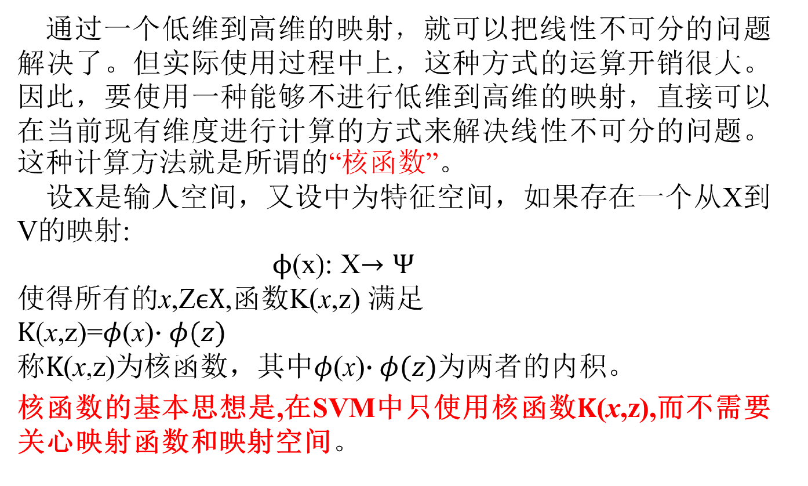

#### 5、KNN算法

###### （1）KNN分类

K-最近邻算法是最近邻算法的一个延伸。基本思路是：选择未知样本一定范围内确定个数的K个样本，该K个样本大多数属于某一类型，则未知样本判定为该类型。

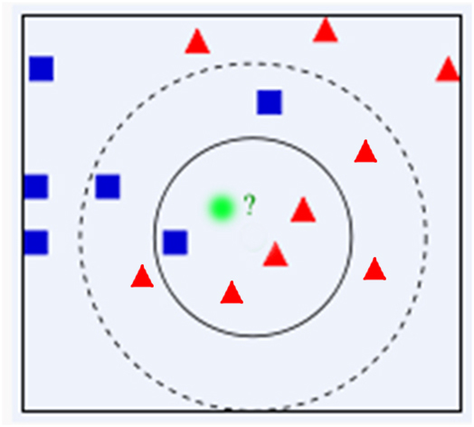

###### （2）算法步骤

1. 计算测试数据与各个训练数据之间的距离；
2. 按照距离的递增关系进行排序；
3. 选取距离最小的K个点；
4. 确定前K个点所在类别的出现频率；
5. 返回前K个点中出现频率最高的类别作为测试数据的预测分类。

###### （3）优点

1. 简单，易于理解，易于实现，无需估计参数，无需训练；     
2. 适合对稀有事件进行分类；     
3. 特别适合于多分类问题(对象具有多个类别标签)，KNN比SVM的表现要好。

###### （4）缺点

1. 当样本不平衡时，如一个类的样本容量很大，而其他类样本容量很小时，可能导致当输入一个新样本时，该样本的K个邻居中大容量类的样本占多数。      
2. 计算量较大，因为对每一个待分类的文本都要计算它到全体已知样本的距离，才能求得它的K个最近邻点。
3. 可理解性差，无法给出像决策树那样的规则。

## 总结

数据仓库的部分其实比较详细了，在写文档的过程中又补充了一些以前没有细细了解过的，比如说元数据、OLAP等。其实有时候会发现其实大部分用过的软件中或多或少会带点理论的影子，比如说Hive、Maxwell都在MySQL中创建了MetaStore，其实这个时候就是创建了元数据数据库；再比如工作流的建立其实和OLAP联机分析处理有着异曲同工之处，都能在线提供分析处理功能。

数据挖掘部分就没有那么详细了，一个是没有这么多前置的文档记录，本身我自己也算是半路出家，对数据科学这方面也有不少问题；二个是多合一，商务智能、机器学习、数仓与数挖三门课相当于用这一个文档做了一个简单的小总结（其中机器学习还可能用不到，只不过是在理解的基础上学习机器学习比较轻松）；最后是时间问题，写这个文档的时候已经考完了，对这方面也没太伤心，难免有些敷衍。数挖其实还有不少我比较想介绍的内容，比如一些算法的技巧和通俗图解，但是因为时间和精力关系短时间不太能做了。以后有机会或者有时间会补上的。——Alexie·Z·Yevich 2023.6.23