> **前言：**
>
> 这不是一篇正儿八经的机器学习文档，完全是应付考试用的。当时6.17考完英语六级之后、6.18过生日；6.19上午8点就是机器学习考试了，所以没有时间做什么很详细的文档。我就是用着这一点PPT提取物做了个不到三千的小文档，不过顺利帮助我在5个小时左右拿下了机器学习（虽然最后只有80分），所以传上来供大家参考。
>
> 温馨提示：虽然确实内容不多，但是希望大家对数仓与数挖的文档掌握后再来看机器学习，因为聚类、分类之类的算法掌握一两个之后会比较容易理解机器学习底层的思想。

## 第一章 绪论

#### 1、基本术语

- **样本(sample)/实例(instance)：**我们获得的数据集中的一条数据，被称为一个样本/实例，在不存在数据缺失的情况下，所有样本应该具有相同的结构。样本是一个统计学概念，很多时候，一个样本对应一个个体，或者对某个对象的一次观测(observation)；
- **特征(feature)/属性(attribute)：**记录样本的某种性质或者在某方面的表现的指标或变量，有时候我们直接用原始数据的变量作为特征，而有的时候我们对原始变量施加一个映射，转变为一组新的变量作为特征，这个过程也被称为**特征提取(feature extraction)**，可以用来提取信息或者对数据进行降维；例如，原始变量是身高和体重，我们利用公式计算出BMI作为我们关心的特征，就把两个变量减少为了一个，降低了变量的维数；
- **特征向量(feature vector)：**一个样本的全部特征构成的向量，称为特征向量。即使经过了特征提取，我们往往也会用提取得到的特征构成新的目标数据集，得到新的样本变量（毕竟特征才是我们关注的变量）。还是以身高体重为例，我们获得了小明的身高、体重，构成了一个样本；但我们关注的是BMI指数，于是我们计算出小明的BMI，这时小明的BMI就成了新的样本。我们关注的永远是特征构成的样本，因此，我们可以说，**一个特征向量就是一个样本**；
- **特征空间(feature space)/属性空间(attribute space)/样本空间(sample space)：** 由所有特征/属性张成的空间，也即特征向量所在的空间，每一维对应一个特征（其实就是概率论中样本空间的一种具体形式，只不过后者强调随机事件）；
- **学习(learning)/训练(training)：**模型凭借数据提供的信息改进自身性能的过程；
- **测试(testing)：**训练结束之后检验模型训练效果的过程；
- **训练数据(training data)/训练集(training set)：**训练模型使用的数据集，其中的每一个样本称为一个训练样本(training sample)；
- **测试数据(testing data)/测试集(testing set)：**测试模型使用的数据集，其中的每一个样本称为一个测试样本(testing sample)；
- **泛化能力(generalization ability)：**在测试集上训练得到的模型，适用于训练集之外的样本的能力，或者说训练好的模型在整个样本空间上的表现。测试的目的之一也是检验模型的泛化能力；
- **过拟合(overfitting)：**模型过度学习，导致学习了过多只属于训练数据的特点，反而使得泛化能力下降；
- **欠拟合(underfitting)：**模型学习不足，导致没有学习到训练数据中足够的一般化规律，泛化能力不足；

#### 2、机器学习的目标

机器学习致力于研究如何通过计算的手段，利用经验来改善系统自身的性能，从而在计算机上从数据中产生“模型”，用于对新的情况给出判断。

#### 3、归纳偏好

学习过程中对某种类型假设的偏好称作归纳偏好。归纳偏好可看作学习算法自身在一个可能很庞大的假设空间中对假设进行选择的启发式或“价值观”.

“奥卡姆剃刀”是一种常用的、自然科学研究中最基本的原则，即“若有多个假设与观察一致，选最简单的那个”.

------

## 第二章 模型评估与选择

#### 1、过拟合与欠拟合

- 过拟合:学习器把训练样本学习的“太好”，将训练样本本身的特点当做所有样本的一般性质，导致泛化性能下降
  - 优化目标加正则项
  - early stop
- 欠拟合：对训练样本的一般性质尚未学好
  - 决策树:拓展分支
  - 神经网络:增加训练轮数

#### 2、评估方法

- 留出法：
  - 直接将数据集划分为两个互斥集合
  - 训练/测试集划分要尽可能保持数据分布的一致性
  - 一般若干次随机划分、重复实验取平均值
  - 训练/测试样本比例通常为2:1~4:1

- 交叉验证法：
  - 将数据集分层采样划分为k个大小相似的互斥子集，每次用k-1个子集的并集作为训练集，余下的子集作为测试集，最终返回k个测试结果的均值，k最常用的取值是10.

- 自助法：以自助采样法为基础，对数据集D有放回采样m次得到训练集D' ,  用D\D'做测试集。
  - 实际模型与预期模型都使用m个训练样本
  - 约有1/3的样本没在训练集中出现 
  - 从初始数据集中产生多个不同的训练集，对集成学习有很大的好处
  - 自助法在数据集较小、难以有效划分训练/测试集时很有用；由于改变了数据集分布可能引入估计偏差，在数据量足够时，留出法和交叉验证法更常用。

#### 3、性能度量

性能度量是衡量模型泛化能力的评价标准，反映了任务需求；使用不同的性能度量往往会导致不同的评判结果.

- 回归任务最常用的性能度量是“均方误差”：

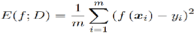

- 对于分类任务,错误率和精度是最常用的两种性能度量：
  - 错误率：分错样本占样本总数的比例
  - 精度：分对样本占样本总数的比率

- 根据学习器的预测结果按正例可能性大小对样例进行排序，并逐个把样本作为正例进行预测，则可以得到查准率-查全率曲线，简称“P-R曲线”

------

## 第三章 线性模型

- 线性模型一般形式

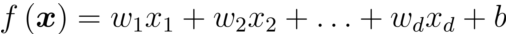

x = (x_1; x_2; ……; x_d) 是由属性描述的示例，其中 x_i 是 x 在第 i 个属性上的取值。

- 向量形式

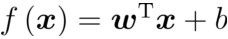

其中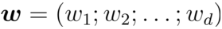

#### 1、线性模型优点

- 形式简单、易于建模
- 可解释性
- 非线性模型的基础
  - 引入层级结构或高维映射

#### 2、优化

- 各任务下（回归、分类）各个模型优化的目标
  - 最小二乘法：最小化均方误差
  - 对数几率回归：最大化样本分布似然
  - 线性判别分析：投影空间内最小（大）化类内（间）散度
- 参数的优化方法
  - 最小二乘法：线性代数
  - 对数几率回归：凸优化梯度下降、牛顿法
  - 线性判别分析：矩阵论、广义瑞利商

#### 3、总结

- 线性回归
  - 最小二乘法（最小化均方误差）
- 二分类任务
  - 对数几率回归
    - 单位阶跃函数、对数几率函数、极大似然法
  - 线性判别分析
    - 最大化广义瑞利商
- 多分类学习
  - 一对一
  - 一对其余
  - 多对多
    - 纠错输出码
- 类别不平衡问题
  - 基本策略：再缩放

------

## 第四章 决策树

#### 1、基本流程

- 决策过程中提出的每个判定问题都是对某个属性的“测试”
- 决策过程的最终结论对应了我们所希望的判定结果
- 每个测试的结果或是导出最终结论，或者导出进一步的判定问题，其考虑范围是在上次决策结果的限定范围之内
- 从根结点到每个叶结点的路径对应了一个判定测试序列

> 决策树学习的目的是为了产生一棵泛化能力强，即处理未见示例能力强的决策树

#### 2、划分选择

决策树学习的关键在于如何选择最优划分属性。一般而言，随着划分过程不断进行，我们希望决策树的分支结点所包含的样本尽可能属于同一类别，即结点的“纯度”(purity)越来越高

- 经典的属性划分方法：
  - 信息增益
  - 增益率
  - 基尼指数

#### 3、剪枝处理

- 为什么剪枝

  - “剪枝”是决策树学习算法对付“过拟合”的主要手段
  - 可通过“剪枝”来一定程度避免因决策分支过多，以致于把训练集自身的一些特点当做所有数据都具有的一般性质而导致的过拟合

-  剪枝的基本策略

  - 预剪枝

    优点

    - 降低过拟合风险
    - 显著减少训练时间和测试时间开销

    缺点

    - 欠拟合风险：有些分支的当前划分虽然不能提升泛化性能，但在其基础上进行的后续划分却有可能导致性能显著提高。预剪枝基于“贪心”本质禁止这些分支展开，带来了欠拟合风险

  - 后剪枝

    优点

    - 后剪枝比预剪枝保留了更多的分支，欠拟合风险小，泛化性能往往优于预剪枝决策树

    缺点

    - 训练时间开销大：后剪枝过程是在生成完全决策树之后进行的，需要自底向上对所有非叶结点逐一考察

- 判断决策树泛化性能是否提升的方法

  - 留出法：预留一部分数据用作“验证集”以进行性能评估

#### 4、连续值处理

###### 连续属性离散化(二分法)

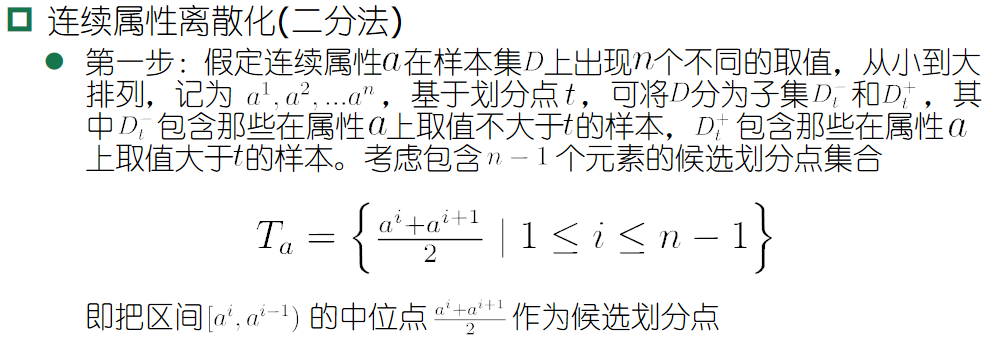

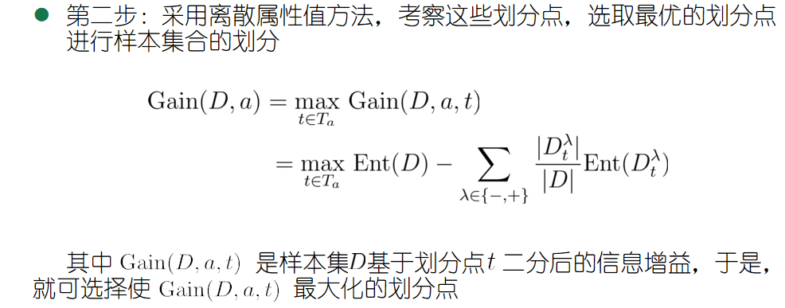

> 与离散属性不同，若当前结点划分属性为连续属性，该属性还可作为其后代结点的划分属性

------

## 第五章 神经网络

## 第六章 支持向量机

#### 1、基本型最大间隔公式转换

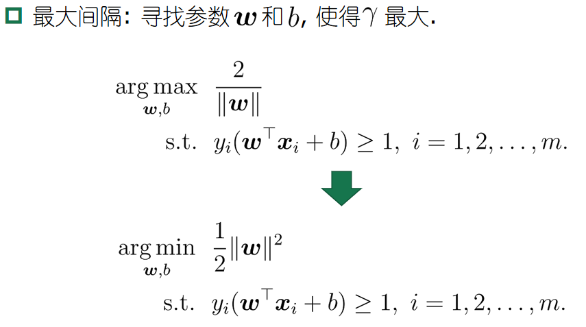

#### 2、对偶问题

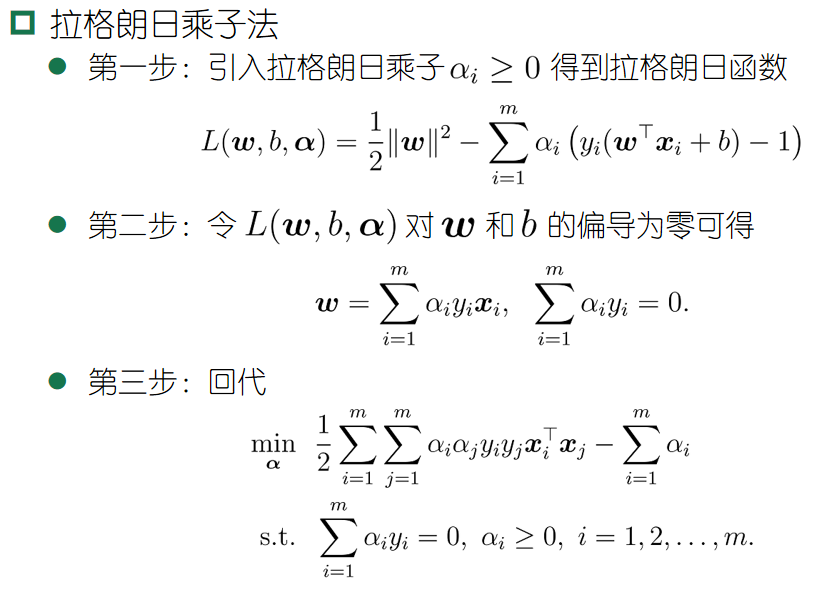

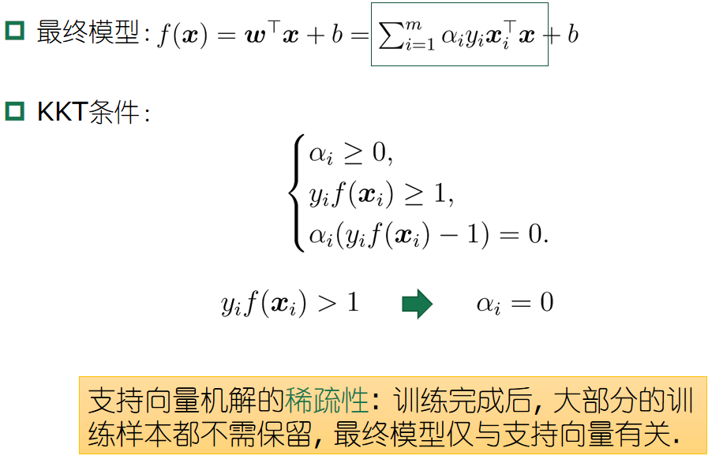

#### 3、0/1损失函数

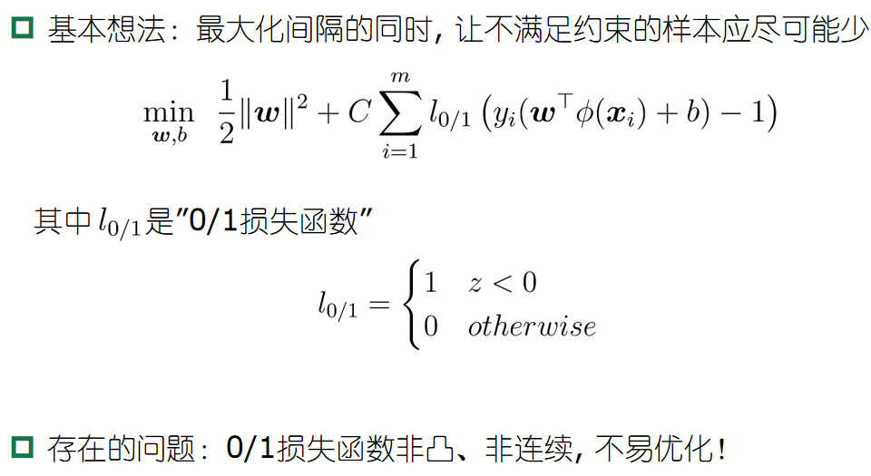

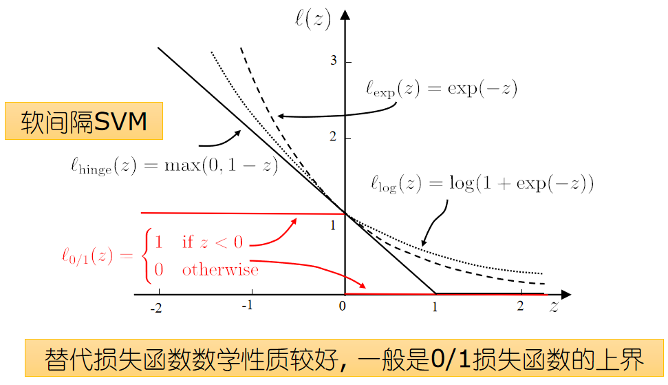

------

## 第七章 贝叶斯分类器

#### 1、贝叶斯决策论

贝叶斯决策论（Bayesian decision theory）是在概率框架下实施决策的基本方法。

- 在分类问题情况下，在所有相关概率都已知的理想情形下，贝叶斯决策考虑如何基于这些概率和误判损失来选择最优的类别标记。

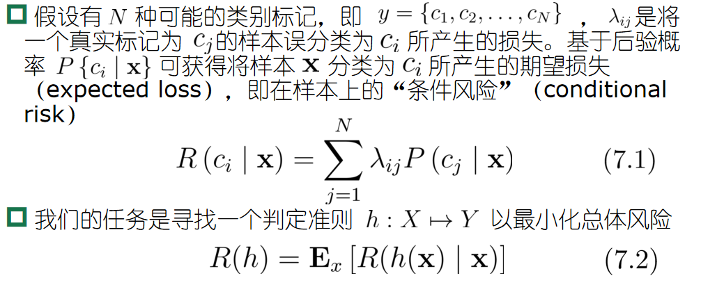

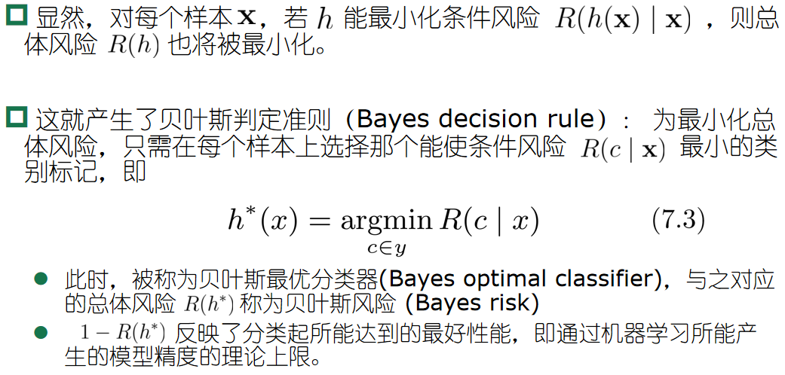

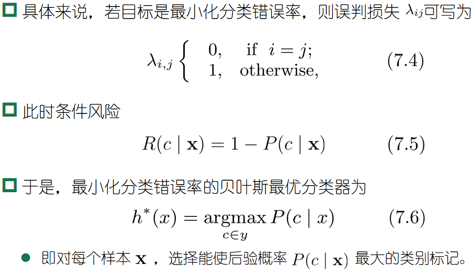

#### 2、极大似然估计

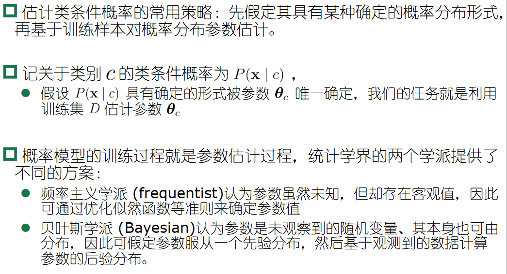

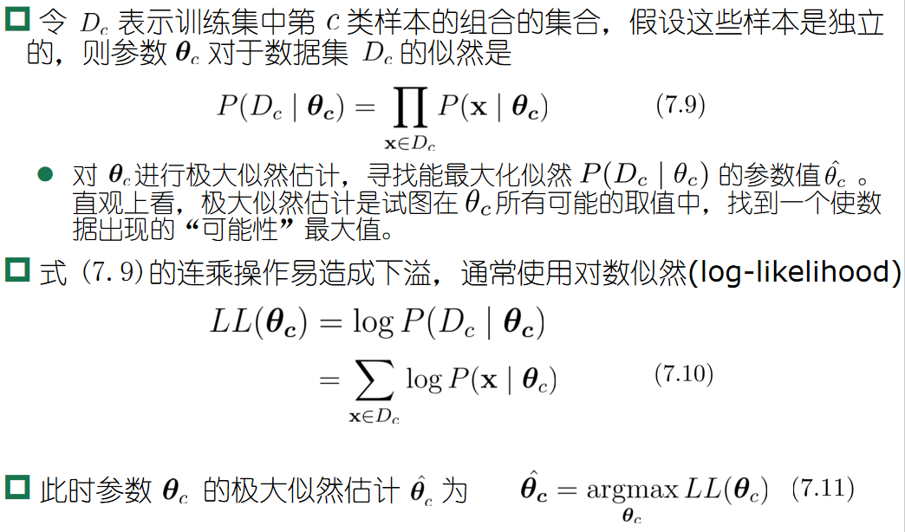

#### 3、朴素贝叶斯分类器

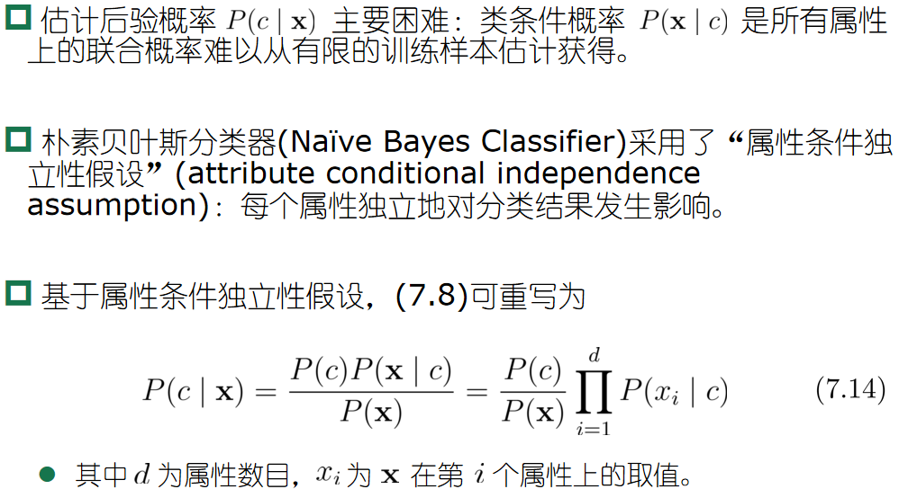

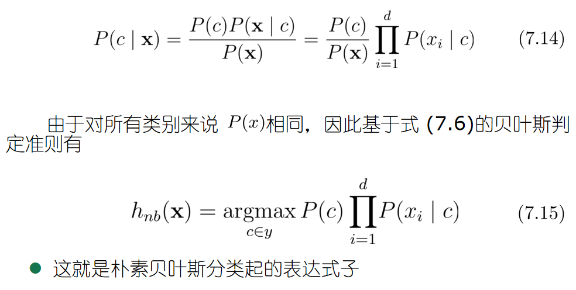

------

## 第八章 集成学习

#### 1、Boosting

- 个体学习器存在强依赖关系，
- 串行生成
- 每次调整训练数据的样本分布

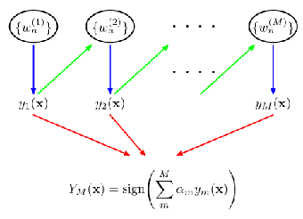

#### 2、Bagging

- 个体学习器不存在强依赖关系
- 并行化生成
- 自助采样法

- 优点
  - 时间复杂度低
    - 假定基学习器的计算复杂度为O(m)，采样与投票/平均过程的复杂度为O(s)，则bagging的复杂度大致为T(O(m)+O(s))
    - 由于O(s)很小且T是一个不大的常数
    - 因此训练一个bagging集成与直接使用基学习器的复杂度同阶
  - 可使用包外估计

------

