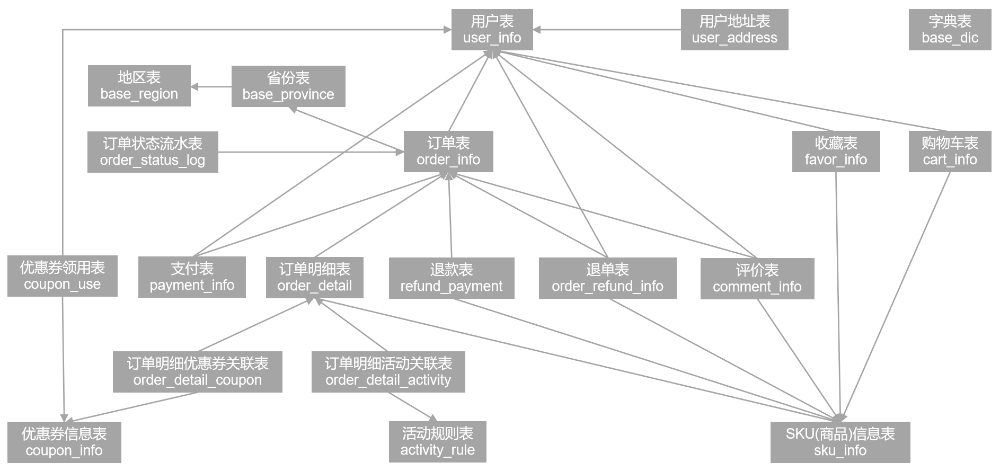

## 名词解释 10

#### 1、数据湖

数据湖是一个**数据存储和管理平台**，它允许企业集中存储各种类型和格式的数据，包括结构化数据、非结构化数据和半结构化数据。数据湖通常采用云存储技术，以**实现高可扩展性、高吞吐量和低成本的数据存储**。

与传统的数据仓库不同，数据湖不会对数据进行转换或规范化，并且不会将数据划分为预定义的模式或模板。相反，数据湖会将数据以原始格式保存，并在需要时通过查询和分析工具进行处理、转换和规范化。

由于其灵活性和高可扩展性，数据湖已成为当今大数据处理和分析领域中的一种重要解决方案。通过使用数据湖，企业可以更轻松地管理和分析大量的数据，以发现隐藏的业务见解、趋势和机会。

#### 2、数据血缘

**数据血缘是指数据元素之间的关系和来源的追溯。它描述了数据在整个信息系统中从输入到输出的流动和变化过程，以及数据元素之间的依赖关系。**

数据血缘可以帮助人们理解数据的来源、转换和用途，提供关于数据质量和可信度的信息。通过追踪数据的血缘，可以回答以下问题：

1. 数据的来源是什么？数据是从哪个系统、哪个表格或哪个数据源中获取的？
2. 数据是如何被处理和转换的？是否经过了加工、整合、清洗或转换等操作？
3. 数据被用于哪些目的？哪些报表、分析或决策依赖于这个数据？
4. 数据的变更和更新如何影响其他数据和报表？如果某个数据发生变化，会对其他数据造成什么影响？

数据血缘可以**通过记录元数据和使用特定的工具和技术来实现**。元数据是描述数据和数据元素的数据，可以包括数据的源头、数据的转换规则、业务规则和数据的消费者等信息。数据管理和数据治理工具可以帮助收集、维护和分析数据血缘信息，以帮助企业更好地理解和管理数据。

#### 3、用户画像

用户画像是对特定用户群体进行综合描述和分类的方法，旨在更好地理解和洞察用户的特征、需求、偏好和行为。**用户画像是基于数据和分析构建的，通过收集、整理和分析用户的基本信息、在线行为、消费习惯、兴趣爱好等数据，来形成对用户的描述和刻画。**

用户画像的主要目的是帮助企业更好地了解他们的目标用户，从而能够更有针对性地进行产品开发、市场营销、广告投放和客户服务等活动。通过用户画像，企业可以进行以下方面的分析和决策：

1. 目标市场定位：通过用户画像，企业可以确定目标用户的特征和需求，以便更好地定位自己的产品和服务。

2. 产品改进和个性化：用户画像可以揭示用户的偏好和需求，帮助企业了解用户对产品的评价和反馈，从而进行产品改进和个性化设计。

3. 客户关系管理：用户画像可以帮助企业了解用户的行为和消费习惯，更好地进行客户分类和关系管理，提供个性化的客户服务和沟通。

4. 营销和广告策略：通过用户画像，企业可以了解用户的兴趣爱好和消费特点，以便更精准地进行营销和广告推送，提高广告投放的效果和回报。

用户画像的建立需要收集和分析大量的用户数据，包括用户注册信息、用户行为数据、社交媒体数据等。企业可以通过调研、用户调查、网站分析工具等方式来获取这些数据，并使用数据分析和挖掘技术来构建用户画像模型。

#### 4、大数据可视化

大数据可视化是指**将大量、复杂的数据集合通过图表、图像、地图等视觉化手段呈现出来，以帮助人们更直观地理解和分析数据**。大数据可视化旨在从海量数据中发现变化、趋势和关联信息，以便更好地做出商业决策。

大数据可视化的优点包括：

1. **提供更直观的信息**：通过视觉化手段呈现数据，可以更容易地找出关键信息和特征，实现数据的快速理解和分析。

2. **支持交互式分析**：大数据可视化可以支持用户交互和操作，让用户可以自行探索和发现数据的关系和规律。

3. **增强数据的可信度**：通过视觉化方式呈现数据，可以强化数据的可信度和说服力，用户可以更加信任和理解数据。

4. **改进决策过程**：通过视觉化方式呈现数据，可以减少决策的错误和偏差，提高决策的准确性和效率。

大数据可视化可以通过多种工具和技术来实现，如可视化编程语言、可视化软件、图形库和API等。常用的可视化类型包括条形图、折线图、饼图、热力图、地图和雷达图等。

#### 5、ETL

**ETL是指将数据从源系统中提取（Extract）、经过清洗和转换（Transform），然后加载（Load）至目标系统的过程。**ETL是数据仓库和商业智能系统中常用的数据集成和数据处理方法。

在ETL过程中，各个步骤的主要任务如下：

1. **提取（Extract）：从源系统中获取需要的数据。**这可能涉及到不同的数据源，如关系数据库、文件、Web服务、API等。数据提取的目标是获取源系统中的原始数据，通常使用特定的提取方法和查询语言进行操作。

2. **转换（Transform）：对提取的数据进行清洗、整合、加工和转换。**在这个阶段，数据被清洗、校验、筛选、聚合和转换为目标系统所需的格式和结构。这可能包括数据的过滤、排序、删除重复值、数据变换和计算衍生指标等操作。

3. **加载（Load）：将转换后的数据加载至目标系统**，通常是数据仓库、数据湖、数据集市或其他用于分析和决策的数据存储系统。加载过程可能涉及到数据的更新、插入、覆盖、合并等操作，以确保数据的完整性和一致性。

ETL的**主要目的是将散乱的、异构的数据整合为一致性和可用性的数据集，以支持数据分析、报表生成、决策支持、业务洞察和其他商业智能应用**。通过ETL，可以清理和准备数据，提供高质量和可信度的数据供给。

ETL工具是用于自动化和简化ETL过程的软件工具。它们提供了可视化的界面和功能，支持数据源连接、数据抽取、数据转换和数据加载等操作，以及调度、监控和错误处理等任务。一些常见的ETL工具包括Informatica PowerCenter、Microsoft SQL Server Integration Services（SSIS）、Apache NiFi和Talend等。

#### 6、半结构化数据

**半结构化数据是指具有一定结构特征但不符合传统关系型数据库的严格结构规则的数据。**与结构化数据（如表格形式的数据）相比，半结构化数据**没有固定的模式和统一的数据模型**。

半结构化数据的特点包括：

1. **可以存在不同的数据类型和格式**：半结构化数据可以包含文本、XML、JSON、HTML、日志文件等多种数据类型和格式。每个数据实例可以具有不同的字段和属性，并且字段的顺序和层次结构可以变化。

2. **可以具有重复的数据**：半结构化数据中的某些字段和元素可以重复出现，相同的字段可以存在于不同的层次结构中。这使得半结构化数据在存储和处理时更加灵活和自由。

3. **缺乏严格的模式和约束**：与关系型数据库中定义的结构不同，半结构化数据没有严格的模式和约束条件。数据的结构和规则可能在不同的实例之间或数据源之间有所差异。

半结构化数据的处理和管理通常需要使用专门的工具和技术，例如XML解析器、JSON解析器、XPath查询、XSLT转换等。半结构化数据的应用场景包括网页抓取和分析、日志文件处理、传感器数据处理、大数据分析等。

#### 7、结构化数据

**结构化数据是指具有明确定义和规范化的格式和结构的数据**。这种类型的数据通常以表格形式呈现，其中数据存储在行和列中，并通过列头和数据类型定义了数据的结构。

常见的结构化数据包括关系数据库中的数据、电子表格中的数据和类似格式的数据文件等。其主要特点包括：

1. **具有固定的模式和结构**：结构化数据使用预定义的模式和格式来存储和组织数据。这使得数据可以轻松访问和查找，并易于分析和处理。

2. **可以使用SQL进行查询**：关系型数据库使用SQL（Structured Query Language）进行查询和检索数据。使用SQL可以轻松找到所需的数据，从而进行进一步分析和处理。

3. **可以进行规范化和约束**：按照规范化和约束规则，可以对结构化数据进行限制和验证，以确保数据的一致性和完整性。这有助于减少数据冗余和错误，并合理使用存储空间。

结构化数据通常用于各种业务和科学应用程序中，如金融、医疗、科学研究、人力资源等。处理和管理结构化数据通常需要使用专门的软件和技术，如关系数据库管理系统（RDBMS）、SQL查询、数据仓库、ETL工具等。

#### 8、数据仓库

**数据仓库是一个集成、主题导向的、面向分析的数据存储系统，用于支持企业级的决策制定和业务洞察**。它是将各种来源的数据整合到一个统一的、一致性的、易于访问和分析的数据存储中。

数据仓库的主要特点包括：

1. 集成性：数据仓库收集来自多个源系统的数据，并将它们整合到一个统一的环境中。这包括来自关系数据库、文件系统、Web服务等各种数据源的数据。

2. 主题导向：数据仓库以特定的主题为导向，例如销售分析、客户洞察、市场趋势等。每个主题都包含了相关的数据、维度和度量指标，以支持特定的业务分析需求。

3. 面向分析：数据仓库的目的是支持大规模数据分析和决策制定。它提供了丰富的分析功能，包括数据聚合、切片和切块、数据挖掘、预测和模型建立等。

4. 一致性和稳定性：数据仓库通过数据清洗、转换和标准化等过程，确保数据的一致性和质量。它提供了可靠的数据存储和管理机制，以确保数据的完整性和稳定性。

------

## 简答题 30

#### 1、（东方航空）为什么做数据中心

（1）早年大量的xml等半结构化数据没有得到有效的利用；

（2）业务上，常规情况下实时数据是报文形式的非结构化数据，刷库解析后再分析有数小时延迟，无法做到及时使用，难以得到决策支持；

（3）系统上，在系统层面关系复杂、难拓展、难以满足业务发展需求，在订座、离港、电商三大平台之间相互割裂、无法融合。

#### 2、（科大讯飞）如何实现精准营销

凭借自身独一无二的大数据来源，并结合自身的处理技术，为大数据精准营销提供了可靠的支持。

科大讯飞开放自己的人工智能开放平台，从合作伙伴处得到相应的用户数据，从而不断拓展数据的容量和覆盖面。以平台上的大数据为基础进行有针对性的用户画像后，得以实现多种形式的大数据精准营销。

#### 3、（海尔）架构图

#### 4、（科大讯飞）架构图

#### 5、（京东）平台架构的目的

（1）实时感知业务运营情况，实现实时决策支持，如营销策略调整、库房排班等；

（2）根据客户的位置、实时的浏览轨迹、商品的价格变化等提供精准推荐和广告推送等；

（3）动态产生Top排行榜，提供销量排行、热度排行等实时数据；

（4）优化离线数据仓库数据抽取环节，彻底改变过去“T + 1”模式的数据仓库必须等到每天凌晨以增量或全量抽取业务数据的方式进行数据处理的做法。

#### 6、实时数据平台解决的问题（3个）

（1）实时数据采集——数据来源渠道是什么，怎么确保数据完整和低延迟；

（2）实时数据存储——数据如何存储，怎样做到存储统一、方便使用和满足高吞吐量的要求；

（3）实时数据计算——数据如何计算，怎样确保及时性，并支持高复杂度场景。

------

## 数据中台 50

#### 1、背景

遵循阿里的“OneData”数据流转设计，实现对项目数据的完整流程监控，我们组的主要业务方向是电商运营，所以从这个角度阐述背景。（简称现场编）

#### 2、数据资产管理

数据资产管理的内容主要包括：数据标准管理、元数据管理、主数据管理、数据质量管理、数据安全管理、数据交换管理（数据共享管理）、数据生命周期管理七个方面。

在代码中以元数据管理、数据质量管理、数据安全管理、数据交换管理为主要体现。比如使用MySQL作为Hive数仓的元数据管理、Atlas+Solr做整个项目的元数据管理；Datax作为不同数据源之间的数据交换管理、Azkaban作为项目调度工具实现数据交换管理。

#### 3、数据库管理

1. **数据库规划**：确定需要管理的数据库类型和结构，选择适合业务需求的数据库技术，例如关系型数据库（如MySQL、Oracle）或非关系型数据库（如MongoDB、Redis）。
2. **数据库建模与设计**：根据业务需求设计数据库的表结构，包括表关系、字段定义、主键、外键等。
3. **数据库创建与维护**：根据数据库设计，创建数据库实例，并进行数据库的安装、配置和初始化工作。定期进行数据库维护，包括备份、性能优化、容量规划等。
4. **数据库安全性管理**：通过权限控制、身份验证、数据加密等措施确保数据库的安全性。设置合理的用户权限，限制敏感数据的访问，并监控数据库的操作和访问情况。
5. **数据库性能优化**：根据实际需求和访问模式，对数据库进行性能优化，包括索引优化、SQL查询优化、数据分区、缓存策略等。
6. **数据库监控与故障处理**：使用监控工具对数据库进行实时监控，及时发现和解决潜在的性能问题和故障。建立数据库的备份和恢复策略，防止数据丢失和灾难发生。
7. **数据库升级与迁移**：根据业务需要，定期升级数据库软件版本，并确保兼容性和数据的无损迁移。
8. **数据库文档化与元数据管理**：及时记录和更新数据库的技术文档和元数据信息，包括数据字典、数据流程和数据模型等，以便后续维护和追踪。

#### 4、数仓模型

#### 5、支持的业务

电商的业务流程可以以一个普通用户的浏览足迹为例进行说明，用户点开电商首页开始浏览，可能会通过分类查询也可能通过全文搜索寻找自己中意的商品，这些商品无疑都是存储在后台的管理系统中的。

当用户寻找到自己中意的商品，可能会想要购买，将商品添加到购物车后发现需要登录，登录后对商品进行结算，这时候购物车的管理和商品订单信息的生成都会对业务数据库产生影响，会生成相应的订单数据和支付数据。

订单正式生成之后，还会对订单进行跟踪处理，直到订单全部完成。

电商的主要业务流程包括用户前台浏览商品时的商品详情的管理，用户商品加入购物车进行支付时用户个人中心&支付服务的管理，用户支付完成后订单后台服务的管理，这些流程涉及到了十几个甚至几十个业务数据表，甚至更多。

#### 6、算法

#### 7、平台架构

