# 大数据平台基础（《Hadoop大数据原理与应用》）

> **前言：**
>
> 这是针对老师画的超多考点做的一份大体是抄书的复习文档，在阅读该文档之前，强烈建议大家先自行安装Hadoop、ZooKeeper、HBase的环境，能够配置和使用即可。在此基础上再来阅读下面的部分才能获得比较大的收获。
>
> 不然的话，看这个文档会十分的无趣！！

## 第一章 大数据概述

#### 1、简述大数据的内涵

大数据是大规模数据的集合体，是数据对象、数据集成技术、数据分析应用、商业模式、思维创新的统一体，也是一门捕捉、管理和处理数据的技术，它代表着一种全新的思维方式。

###### （1）从对象角度来看，大数据是数据规模超出传统数据库处理能力的数据集合

###### （2）从技术角度来看，大数据是从海量数据中快速获得有价值信息的技术

###### （3）从应用角度来看，大数据是对特定数据集合应用相关技术获得价值的行为

###### （4）从商业模式角度来看，大数据是企业获得商业价值的业务创新方向

###### （5）从思维方式来看，大数据是从第三范式中分离出来的一种科研范式

#### 2、简述大数据的4V特征

###### （1）海量化【Volume】

大数据体量非常大，PB级别将是常态，且增长速度较快。

###### （2）多样化【Variety】

大数据种类繁多，一般包括结构化、半结构化和非结构化等几种类型。这些数据在编码方式、数据格式、应用特征等多个方面存在差异性，多信息源的并发产生了大量的异构数据。此外，不同结构的数据处理和分析方式也有所区别。

###### （3）快速化【Velocity】

数据的快速流动和处理是大数据区分与传统数据挖掘的显著特征。大数据更强调实时分析而非批量式分析，数据输入后即刻处理，处理后丢弃。

###### （4）价值密度低【Value】

大数据价值密度的高低与数据总量大小呈反比，单条数据本身并无太多价值，但庞大的数据量累计并隐藏了巨大的财富，其价值具备稀疏性、多样性和不确定性等特点。

#### 3、举例说明大数据的关键技术

大数据技术就是从各种类型的数据中快速获得有价值信息的技术。大数据处理的关键技术一般包括大数据采集、大数据预处理、大数据存储及管理、大数据分析及挖掘、大数据展现和应用。

###### （1）大数据采集技术

大数据采集一般分为大数据智能感知层和基础支撑层。大数据智能感知层主要包括数据传感体系、网络通信体系、传感适配体系、智能识别体系及软硬件资源接入系统，用于实现对结构化、半结构化、非结构化的海量数据的智能化识别、定位、跟踪、接入、传输、信号转化、监控、初步处理和管理等，重点针对大数据源的智能识别、感知、适配、传输、接入等技术。基础支撑层提供大数据服务平台所需的虚拟服务器以及结构化、半结构化及非结构化数据的数据库和物联网络资源等基础支撑环境，重点是分布式虚拟存储技术，大数据获取、存储、组织、分析和决策操作的可视化接口技术，大数据的网络传输与压缩技术，大数据隐私保护技术等。

###### （2）大数据预处理技术

通过数据预处理工作，完成对已采集接收数据的辨析、抽取、清洗、归约、变换、离散化、集成等操作处理，可以是残缺的数据完整，将错误的数据纠正，多余的数据去除，进而将所需的数据挑选出来；并且进行数据集成，保证数据的一致性、准确性、完整性、时效性、可信性、可解释性。

###### （3）大数据的存储及管理技术

大数据的存储与管理要用存储器把采集到的数据存储起来，建立相应的数据库，并进行管理和调用，以解决大数据的可存储、可表示、可处理、可靠性及有效传输等关键问题，其研究重点是复杂的结构化、半结构化和非结构化的大数据管理与处理技术。

###### （4）大数据的分析和挖掘技术

大数据分析指的是对规模巨大的数据用适当的统计方法进行分析，以提取有用的信息并形成结论，包括可视化分析、数据挖掘算法、预测性分析、语义引擎、数据质量和数据管理等。

数据挖掘就是从大量的、不完全的、有噪声的、模糊的、随机的实际应用数据中，提取隐含在其中的、人们事先不知道的，但又潜在有用的信息和知识的过程。

###### （5）大数据的展现和应用技术

大数据技术能够将隐藏于海量数据中的信息和知识挖掘出来，为人类的社会经济活动提供依据，从而提高各个领域的运行效率，大大提高整个社会经济的集约化程度。

#### 4、简述大数据、云计算、5G、物联网以及人工智能之间的区别和联系

物联网、云计算和5G是大数据的底层架构，大数据以来云计算来处理大数据，人工智能是大数据的应用场景。5G发展落地物联网才能发展，而物联网和云计算的发展则是推动大数据快速发展的主要原因，进而推动机器学习、计算机视觉、自然语言处理以及机器人学等人工智能领域迎来新的发展机遇。

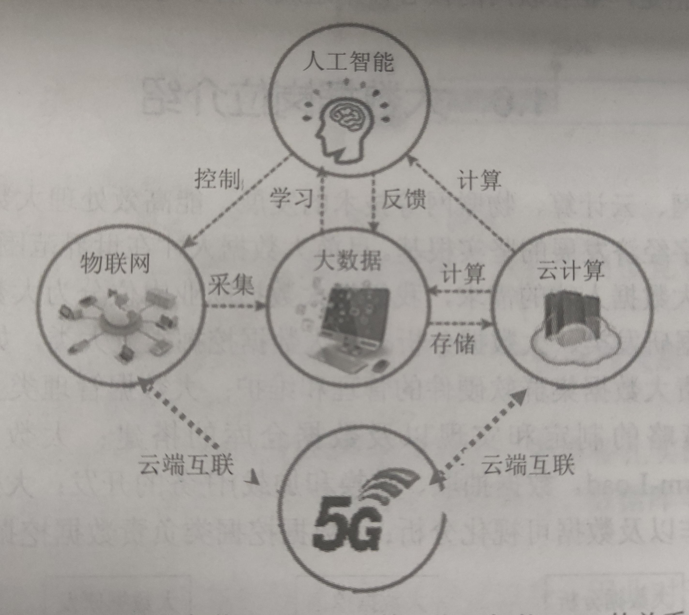

大数据指无法再一定时间范围内用常规软件工具进行捕捉、管理和处理的数据集合，是需要心得处理模式才能有更强的决策力、洞察发现力和流程优化能力的海量、高增长率和多样化的信息资产。大数据是物联网、Web和传统信息系统发展的必然结果，它在技术体系上与云计算重点都是分布式存储和分布式计算，不同的是云计算注重服务，大数据则注重数据的价值化操作。

人工智能其实就是大数据、云计算的一个应用场景，包含机器学习，它可以从被动到主动，从模式化实行指令到自主判断根据情况实行不同的指令。

------

## 第二章 初识Hadoop

#### 1、论述Hadoop生态系统构成及各个组件的基本功能

（关于生态系统，书本上介绍的是Hadoop2.0的部分，考虑到3.0出现后有些新的技术出现了，所以考试可以参考2.0的图，学习可以参考3.0的图）

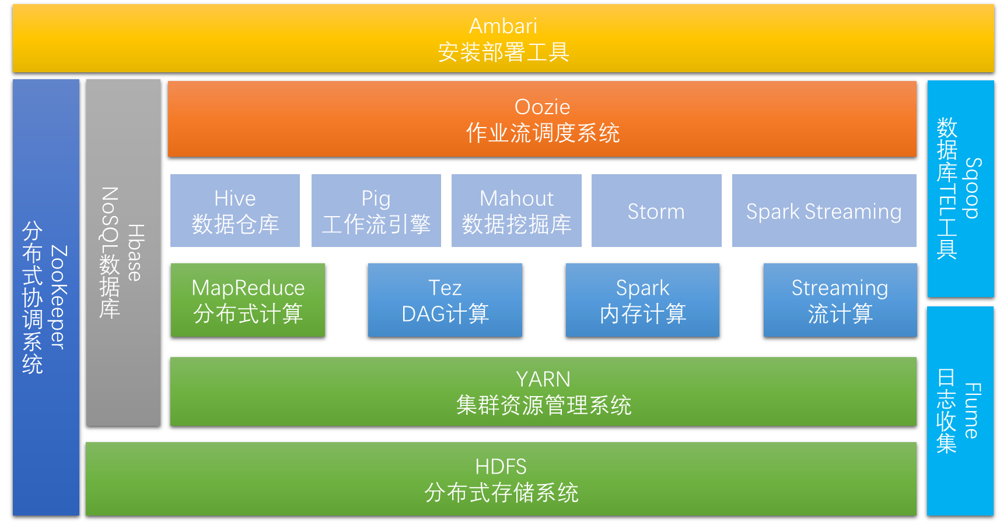

**（上3下2，3中的Common、Kafka没有画出）**

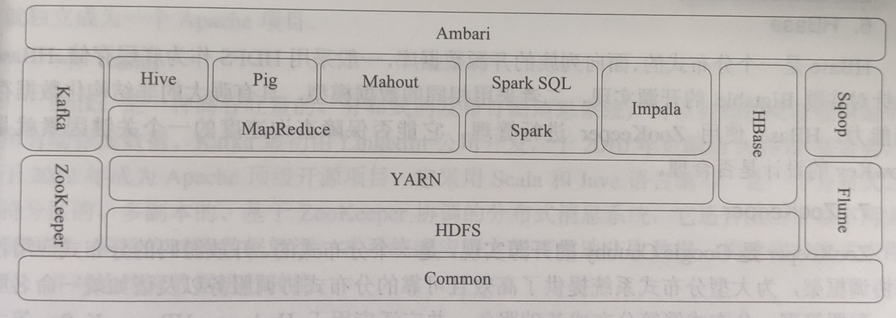

###### （1）Hadoop Common

Hadoop Common是Hadoop体系中最底层的一个模块，为Hadoop各子项目提供了各种工具，是其他模块的基础。

###### （2）HDFS【Hadoop Distributed File System】

HDFS是Hadoop分布式文件系统，是Hadoop三大核心之一，是针对谷歌文件系统GFS的开源实现。HDFS是一个具有高容错性的文件系统，适合部署在廉价的机器上，且能提供高吞吐量的数据访问，非常适合大规模数据集的应用。

###### （3）YARN【Yet Another Resource Negotiator】

YARN是统一资源管理和调度框架，它解决了Hadoop1.0资源利用率低和不能兼容异构计算框架等多种问题，提供了资源隔离方案和双调度器解决方案，可在YARN上运行MapReduce、Spark、Storm、Tez等不同类型的计算框架。

###### （4）MapReduce

Hadoop MapReduce是一个分布式的、并行处理的编程模型，是针对谷歌MapReduce的开源实现。MapReduce利用函数式编程思想，将复杂的、运行于大规模集群上的并行计算过程高度抽象为Map和Reduce两个函数，其中Map是对可以并行处理的小数据集进行本地计算并输出中间结果，Reduce是对各个Map的输出结果进行汇总计算得到最终结果。

###### （5）Spark

Spark是加州伯克利大学AMP实验室开发的新一代计算框架，对迭代计算很有优势。和MapReduce计算框架相比，Spark的性能提升明显，并且都可以与YARN进行集成。

###### （6）HBase

HBase是一个分布式的、面向列族的开源数据库，一般采用HDFS作为底层存储。HBase是针对谷歌Bigable的开源实现的，二者采用相同的数据类型，具有强大的非结构化数据存储能力。HBase使用ZooKeeper进行管理。

###### （7）ZooKeeper

ZooKeeper是Geogle Chubby的开源实现，是一个分布式的、开放源码的分布式应用程序协调框架，为大型分布式系统提供了高效且可靠的分布式协调服务以及诸如统一命名服务、配置服务、分布式锁等分布式基础服务，并广泛应用于Hadoop、HBase、Kafka等大型分布式系统。

###### （8）Hive

Hive是一个基于Hadoop的数据仓库工具，最早由FaceBook开发并使用。Hive还可以将SQL语句转换为MapReduce作业，并提交到Hadoop集群上运行。

###### （9）Pig

Pig和Hive类似，也是对大型数据集进行分析和评估的工具。不过和Hive提供的SQL接口不同的是，它提供了一种高层的、面向领域的抽象语言Pig Latin。

###### （10）Impala

Impala由Cloudera公司开发的，提供了HDFS、HBase上的海量数据进行交互式查询的SQL接口，其优点是查询非常迅速，其性能大幅领先于Hive。

###### （11）Mahout

Mahout是一个机器学习和数据挖掘库，它具有许多功能，包括聚类、分类、推荐过滤等。

###### （12）Flume

Flume是由Cloudera提供的一个高可用、高可靠、分布式的海量日志采集、聚合和传输的框架。Flume支持在日志系统中定制各类数据发送方，用于收集数据，同时1也可提供对数据进行简单处理并写道各种数据接收方。

###### （13）Sqoop

Sqoop是SQL to Hadoop的缩写，主要用于关系数据库和Hadoop之间的数据双向交换。可以借助Sqoop完成Mysql、Oracle、PostgreSQL等关系型数据库到Hadoop生态系统中HDFS、HBase、Hive等的数据导入导出操作，整个导入导出操作都是由MapReduce计算框架实现的，非常高效。

###### （14）Kafka

Kafka是一种高吞吐量、分布式的发布订阅消息系统，可以处理消费者在网站中的所有动作流数据。它采用Scala和Java语言编写，是一个分布式、支持分区的、多副本的，基于ZooKeeper协调的分布式消息系统。

###### （15）Ambari

Apache Ambari是一个基于Web的工具，支持Apache Hadoop集群的安装、部署、配置和管理。

#### 2、试述Hadoop的体系架构

Hadoop集群采用主从架构（Master/Slave），NameNode与ResourceManager为Master，DataNode与NodeManager为Slave，守护进程NameNode和DataNode负责完成HDFS的工作，守护进程ResourceManager和NodeManager则完成YARN的工作。

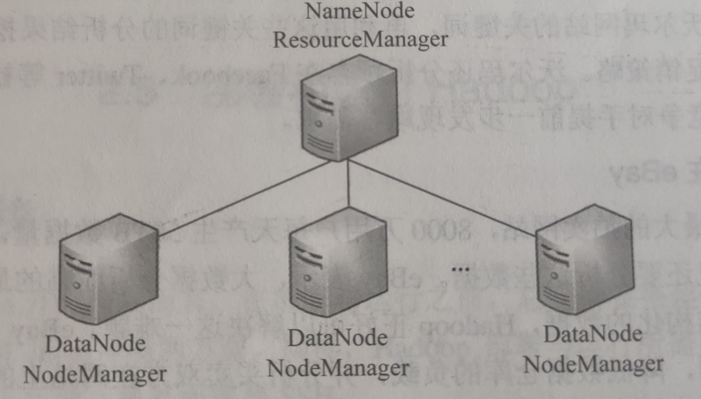

#### 3、试述Hadoop的运行模式及其优缺点

###### （1）单机模式【Local/Standalone Mode】

只在一台计算机上运行，不需要任何配置。在这种模式下，Hadoop所有的守护进程都变成了一个Java进程；存储采用本地文件系统，没有采用分布式文件系统HDFS。**（单机模式配置最简单，但它与用户交互的方式不同于全分布式模式）**

###### （2）伪分布式模式【Pseudo-Distributed Mode】

只在一台计算机上运行。在这种模式下，Hadoop所有的守护进程运行在一个节点上，在一个节点上模拟了一个具有Hadoop完整功能的微型集群；存储采用分布式文件系统HDFS，但是HDFS的名称节点和数据节点都位于同一台计算机上。**（节点数目受限的初学者可以采用伪分布式模式，虽然只有一个节点支撑整个Hadoop集群，但是Hadoop在伪分布式模式下的操作方式与在全分布式下的操作几乎完全相同）**

###### （3）全分布式模式【Fully-Distributed Mode】

在多台计算机上运行。在这种模式下，Hadoop的守护进程运行在多个节点上，形成一个真正意义上的集群；存储采用分布式文件系统HDFS，且HDFS的名称节点和数据节点位于不同计算机上。**（全分布式模式是使用Hadoop的最佳方式，现实中Hadoop集群的运行均采用该模式，但它需要的配置工作和架构所需要的机器集群也都是最多的）**

------

## 第三章 分布式系统HDFS

#### 1、简述HDFS的功能及其体系架构

相对于传统本地文件系统而言，分布式文件系统是一种通过网络实现文件在多台主机上进行分布式存储的文件系统。分布式文件系统的设计一般采用“客户机/服务器”（Client/Server）模式，客户端以特定的通信协议通过网络与服务器建立连接，提出文件访问请求。

HDFS文件系统的**基本特征**包括以下几个方面：

###### （1）高容错性

HDFS把硬件出错看作一种常态，设计了能够进行快速自动进行错误检测和恢复的相应机制。

###### （2）数据容量大

HDFS集群可以支持数百个节点，以支持应用程序的大数据需求。

###### （3）可扩展性

HDFS的水平扩展性强，数据节点可以根据需要进行增删。

###### （4）高吞吐量

HDFS的传输速率高，支持高并发大数据应用程序。

###### （5）就近计算

客户请求尽可能在数据节点上直接完成计算任务，以便在大数据的业务中降低网络负担，增加吞吐量。

HDFS采用Master/Slave架构模型，一个HDFS集群包括一个NameNode和多个DataNode。名称节点NameNode为主节点，数据节点DataNode为从节点，文件被划分为一系列的数据块（Block）存储在从节点DataNode上。NameNode是中心服务器，不存储数据，负责管理文件系统的命名空间（Namespace）以及客户端对文件的访问。

HDFS的体系架构中主要包括名称节点NameNode和数据节点DataNode。

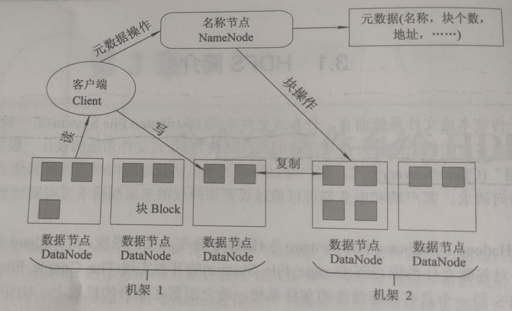

#### 2、简述HDFS的数据的读取过程

HDFS的真实数据分散存储在DataNode上，但是读取数据时需要先经过NameNode。

###### 基本过程

首先，客户端连接到NameNode询问某个文件的元数据信息，NameNode返回给客户端一个包含该文件各个块位置信息（存储在哪个DataNode）的列表；然后，客户端直接连接对应的DataNode来并行读取块数据；最后，当客户得到所有块后，再按照顺序进行组装，得到完整文件。

###### 详细过程

（1）客户端生成一个FileSystem实例（DistributedFileSystem对象），并使用此实例的open()方法打开HDFS上的一个文件。

（2）DistributedFileSystem通过RPC调用向NameNode发出请求，得到文件的位置信息，即数据块编号和所在DataNode地址。对于每一个数据块，名称节点返回保存数据块的数据节点的地址，通常按照DataNode地址与客户端的距离从近到远排序。

（3）FileSystem实例获得地址信息后，生成一个FSDataInputStream对象实例返回给客户端。此实例封装了一个DFSInputStream对象，负责存储数据块信息和DataNode地址信息，并负责后续的文件内容读取内容。

（4）客户端向FSDataInputStream发出读取数据的read()调用。

（5）FSDataInputStream收到read()调用请求后，其封装的DFSInputStream选择与第一个数据块最近的DataNode，并读取相应的数据信息返回给客户端。数据块读取完成后，DFSInputStream负责关闭到对应DataNode的链接。

（6）DFSInputStream依次选择后续数据块的最近Datanode节点，并读取数据返回给客户端，直到最后一个数据块读取完毕。DFSInputStream从DataNode读取数据时，可能会碰上某个DataNode失效的情况，此时会自动选择下一个包含此数据块的最近的DataNode去读取。

（7）客户端读取完所有数据块，然后调用FSDataInputStream的close()方法关闭文件。

#### 3、简述HDFS的数据的写入过程

HDFS的设计遵循“一次写入，多次读取”的原则，所有数据只能添加不能更新。数据会被划分为等尺寸的块写入不同的DataNode中，每个块通常保存指定数量的副本（默认3个）。

###### 基本过程

客户端向NameNode发送文件写请求，NameNode给客户分配写权限，并随机分配块的写入地址——DataNode的IP，同时兼顾副本数量和块Rack自适应算法。

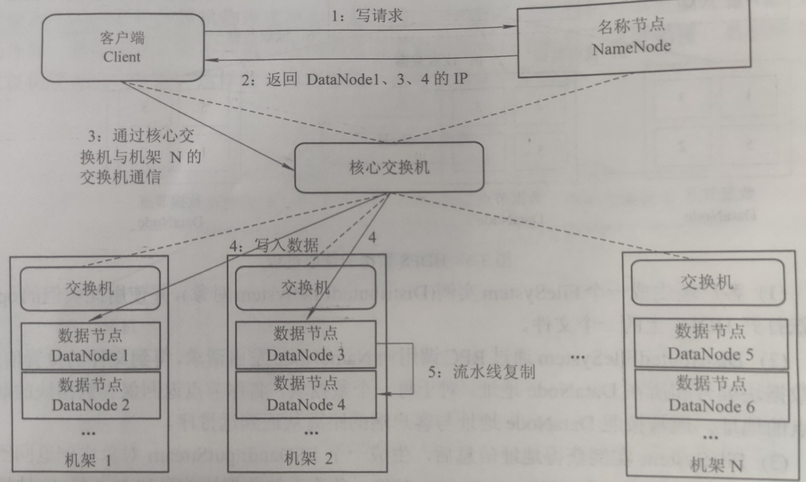

###### 详细过程

（1）创建和初始化FileSystem，客户端调用create()来创建。

（2）FileSystem用RPC调用名称节点，在文件系统的命名空间中创建一个新的文件。名称节点首先确定文件原来不存在，并且客户端有创建文件的权限，然后才能创建新文件。

（3）FileSystem返回DFSOutputStream，客户端开始写入数据。

（4）DFSOutputStream将数据分成块，写入data queue。data queue由Data Streamer读取，并通知名称节点分配数据节点，用来存储数据块（每块默认复制三块）。分配的数据节点放在一个数据流管道（pipeline）里。Data Streamer将数据块写入pipeline中的第一个数据节点，第一个数据节点将数据块发送给第二个数据节点，第二个数据节点将数据块发送给第三个数据节点。

（5）DFSOutputStream为发出去的数据块保存了ack queue，等待pipeline中的数据节点告知数据写入成功。

（6）客户端结束写入数据后调用close()函数。此操作将所有的数据块写入pipeline中的数据节点，并等待ack queue返回成功。

（7）通知名称节点写入完毕。

#### 4、简述HDFS有哪些可靠性机制。备份节点和Secondary NameNode的区别是什么？（工作原理）

高可靠性的主要目标之一就是即使在系统出错的情况下也要保证数据存储的正常。常见的三种出错情况是：NameNode出错、DataNode出错和数据出错。

NameNode是HDFS集群中的单点故障所在。如果NameNode节点出现故障，是需要手工干预的。

HDFS通过**心跳检测**（heartbeat）来检测DataNode是否出错。正常工作情况下，每个DataNode节点周期性地向NameNode发送心跳信号。网络割裂可能破坏一部分DataNode和NameNode的通信。NameNode通过心跳信号的缺失来检测这一情况，并将这些近期不再发送心跳信号DataNode标记为“宕机”，不会再将新的I/O请求发送给它们，任何存储在宕机DataNode上的数据将不再有效。DataNode的宕机可能会引起一些数据块副本系数低于指定值，NameNode会不断检测这些需要复制的数据块，一旦发现就启动复制操作。

网络传输和磁盘错误等因素都会造成数据错误。客户端再读取到数据后，会采用MD5和SHA1对数据进行校验，以确保读取到正确的数据。当客户端创建一个心得HDFS文件时，会对每一个文件块进行信息摘录，并把这些信息作为一个单独的隐藏文件保存在同一个HDFS的命名空间下。当客户端读取文件内容时，会先读取该信息文件，然后利用该信息文件对每个读取的数据块进行校验。如果校验出错，客户端可以选择从其他DataNode获取该数据块的副本，并且向NameNode报告这个文件块有错；NameNode会定期检查并重新复制这个块。

###### （1）元数据备份

在服务器系统中，发生硬件故障或者软件错误是难以避免的，所以需要对重要数据进行备份。元数据是HDFS的核心数据，可通过它对整个HDFS进行管理。FsImage和EditLog是最重要的元数据文件，所以，NameNode通常会配置支持维护多个FsImage和EditLog副本。任何对FsImage和EditLog的修改都将同步到它们的副本上。

###### （2）Secondary NameNode

HDFS中除了有名称节点NameNode外，还有一个辅助NameNode，称为第二名称节点Secondary NameNode。Secondary NameNode有它自身的独立角色和功能，通常认为它和NameNode是协同工作的。它是HDFS高可用的一个解决方案，但不支持热备，使用前配置即可；定期对NameNode中内存元数据进行更新和备份；默认安装在NameNode相同的节点，但是建议安装在不同的节点，以提高可靠性。

###### （3）Backup Node备份

Hadoop2.0以后的版本新提供了一个真正意义上的备用节点，即Backup Node。Backup Node再内存中维护了一份从NameNode同步过来的FsImage，同时它还从NameNode接受EditLog文件的日志流，并把它们持久化到硬盘。Backup Node在内存中维护与NameNode一样的元数据。

###### （4）HDFS NameNode HA的高可用机制

 在Hadoop1.0时代，NameNode存在单点故障问题，一旦NameNode进程不能正常工作，就会造成整个HDFS也无法使用。这可能导致生产集群上的很多框架都无法正常使用，而通过重启NameNode来进行数据恢复十分耗时。

在Hadoop2.0中，HDFS NameNode的单点故障问题得到了解决，和就是HDFS NameNode High Availability（HDFS NameNode高可用机制）。

###### （5）HDFS NameNode Federation的联邦机制

Hadoop集群的元数据信息是存放在NameNode的内存中的，当集群扩大到一定规模后，NameNode内存中存放的元数据信息可能会非常大。由于HDFS所有操作都会和NameNode进行交互，当集群很大时，NameNode的内存限制将会成为制约集群横向扩展的瓶颈。在Hadoop2.0诞生之前，HDFS中只能有一个命名空间，对于HDFS中的文件没有办法完成隔离。

在Hadoop2.0中引入了HDFS Federation联邦机制，解决了如下问题：

- 集群扩展性。多个NameNode分管一部分目录，使得一个集群可以扩展到更多节点，不再像Hadoop1.0中由于内存的限制而制约文件存储目录。
- 性能更高效。多个NameNode管理不同的数据，且同时对外提供服务，将为用户提高更高的读/写吞吐率。
- 良好的隔离性。用户可以根据需要将不同的业务数据交由不同的NameNode管理，这样可以大大降低不同业务之间的影响。

###### （6）HDFS Snapshots的快照机制

HDFS快照是文件系统在某一时刻的只读镜像，可以是一个完整的文件系统，也可以是某个目录的镜像。快照分为两种：一种是建立文件系统的索引，每次更新文件不会真正改变文件，而是开辟一个空间用来保存更改的文件；另一种是拷贝所有的文件系统。HDFS快照属于前者。

HDFS快照常用于以下场景：**（快照的操作远低于外部备份的开销，可以作为备份HDFS最常用的方式）**

- 防止用户的错误操作。管理员可以通过滚动的方式周期性地设置一个只读快照，这样在文件系统上就有若干份只读快照。如果用户意外删除一个文件，可以使用包含该文件的最新只读快照来进行恢复。
- 备份。管理员可以根据需求来备份整个文件系统、一个目录或单一文件。如设置一个只读快照，并使用这个快照作为整个全量备份的开始点；再如，增量备份可以通过比较两个快照的差异来产生。
- 试验/测试。当用户需要在数据集上测试一个应用程序时，如果不做该数据集的全量备份，测试应用程序会覆盖/损坏原来的生产数据集，这是非常危险的。管理员可以为用户设置一个生产数据集的快照，以便用户测试使用。在快照上的任何改变不会影响原有数据集。
- 灾难恢复。只读快照可以用于创建一个一致的时间点镜像，以便于拷贝到远程站点作为灾备冗余。

###### 备份节点和Secondary NameNode的区别

NameNode记录了每个文件中各个块所在的数据节点的位置信息，但是并不持久化存储这些信息，而是在系统每次启动时扫描所有数据节点重构得到这些信息。只有在NameNode重启时，EditLog才会合并到FsImage文件中，从而得到一个文件系统的最新快照。但是在生产环境集群中NameNode是很少重启的，这意味着当NameNode运行很长时间后，EditLog文件会变得很大，这种情况下就会出现以下问题：

- EditLog文件变得很大后，如何去管理这个文件？
- NameNode的重启会花费很长时间，因为有很多改动要合并到FsImage文件上；
- 如果NameNode宕机，那就丢失了很多改动，因为此时的FsImage文件时间戳比较旧。

Secondary NameNode就是为了帮助解决上述问题提出的，它的主要职责是将NameNode的EditLog合并到FsImage文件中，即对元数据进行定期更新和备份。

###### 详细过程

- Secondary NameNode通知NameNode切换EditLog文件；
- Secondary NameNode通过网络从NameNode下载FsImage和EditLog；
- Secondary NameNode将FsImage载入内存，然后开始合并EditLog日志；
- Secondary NameNode将新的FsImage发回NameNode；
- NameNode用新的FsImage替换旧的FsImage。

NameNode在重启时使用心得FsImage，从而减少启动时合并EditLog文件的时间。Secondary NameNode的整个目的实在HDFS中提供一个Checkpoint Node。

#### 5、试述HDFS一个名称节点的优点、缺点

###### 优点

- 一个名称节点，负责所有元数据的管理，简化分布式文件系统结构，可以保证数据不会脱离名称节点的控制；
- 用户数据不会经过名称节点，减轻名称节点负担，方便数据管理，数据节点扩展不会带来性能下降

###### 缺点

- 命名空间限制；命名空间中的对象如文件、目录、文件块、数据节点等这些信息占用一定字节。NameNode保存全局命名空间，NameNode的内存有上限，因此保存的命名空间的大小有限制。
- 性能瓶颈。整个分布式文件系统的吞吐量受限于单个名称节点的吞吐量。
- 隔离问题。由于集群问题中只有一个名称节点，只有一个命名空间，因此无法对不同应用程序进行隔离。
- 集群可用性。唯一的名称节点发送故障，导致整个节点变得不可用。

------

## 第四章 分布式计算框架MapReduce

#### 1、试述MapReduce作业的执行流程

MapReduce作业的执行流程主要包括InputFormat、Map、Shuffle、Reduce、OutputFormat五个阶段。

###### （1）InputFormat

InputFormat模块首先对输入数据做预处理，比如验证输入格式是否符合输入定义；然后将输入文件切分为逻辑上的多个InputSplit（InputSplit是MapReduce对文件进行处理和运算的输入单位，并没有对文件进行实际切割）；由于InputSplit是逻辑切分而非物理切分，所以还需要通过RecordReader根据InputSplit中的信息来处理InputSplit中的具体记录，加载数据并转换为适合Map任务读取的键值对<key, value>，输入给Map任务。

###### （2）Map

Map模块会根据用户自定义的映射规则，输出一系列的<key, value>作为中间结果。

###### （3）Shuffle

为了让Reduce可以并行处理Map的结果，需要对Map的输出进行一定的排序、分区、合并、归并等操作，得到<key, List(value)>形式的中间结果，再交给对应的Reduce进行处理。这个过程叫做Shuffle。

###### (4)Reduce

Reduce以一系列的<key, List(value)>中间结果作为输入，执行用户定义的逻辑，输出<key, value>形式的结果给OutputFormat。

###### （5）OutputFormat

OutputFormat模块会验证输出目录是否已经存在以及输出结果类型是否符合配置文件中的配置类型，如果都满足，就将Reduce的结果输出到分布式系统。

#### 2、与Java类型相比较，MapReduce中定义的数据类型有哪些特点？

###### MapReduce中常见的数据类型

|    数据类型     |          说明           |
| :-------------: | :---------------------: |
|   IntWritable   |        整型类型         |
|  LongWritable   |       长整型类型        |
|  FloatWritable  |    单精度浮点数类型     |
| DoubleWritable  |    双精度浮点数类型     |
|  ByteWritable   |        字节类型         |
| BooleanWritable |        布尔类型         |
|      Text       | UTF-8格式存储的文本类型 |
|  NullWritable   |         空对象          |

（1）MapReduce是集群运算，因此必然会在执行期间进行网络传输，然而在网络中传输的数据必须是可序列化的类型。

（2）为了良好地匹配MapReduce专门设计了一套数据类型。

**（简单来说就是适配Hadoop设计的一套序列化数据类型）**

#### 3、试述Shuffle机制各个阶段的主要作用（重点）

###### Shuffle的作用

对Map的输出进行一定的排序、分区、合并、归并等操作，得到<key, List(value)>形式的中间结果，再交给对应的Reduce进行处理。

（1）Shuffle会持续接收Map阶段发来的数据，并将数据写到一个“环形缓冲区”中。缓冲区被填满时就会将覆盖掉的部分数据溢出存放到“溢出文件”中。

（2）Shuffle会对溢出文件中的数据进行排序，然后再将排序后的数据进行分区。

（3）Shuffle会生成很多个排序且分区后的溢出文件，最后会将所有溢出文件中相同分区号的内容进行合并，形成最终的第0区内容、第1区内容……

**（以上为书本上简单的Shuffle作用介绍，下面是网络上给出的各阶段的具体作用）**

###### （1）collect阶段

将MapTask的结果输出到默认大小为 100M 的环形缓冲区，保存的是 key/value，Partition 分区信息等。

###### （2）spill阶段

当内存中的数据量达到一定的阀值的时候，就会将数据写入本地磁盘，在将数据写入磁盘之前需要对数据进行一次排序的操作，如果配置了 combiner，还会将有相同分区号和 key 的数据进行排序。

###### （3）merge阶段

把所有溢出的临时文件进行一次合并操作，以确保一个MapTask 最终只产生一个中间数据文件。

###### （4）copy阶段

ReduceTask 启动 Fetcher 线程到已经完成 MapTask 的节点上复制一份属于自己的数据，这些数据默认会保存在内存的缓冲区中，当内存的缓冲区达到一定的阀值的时候，就会将数据写到磁盘之上。

###### （5）merge阶段

在 ReduceTask 远程复制数据的同时，会在后台开启两个线程对内存到本地的数据文件进行合并操作。

###### （6）sort阶段

在对数据进行合并的同时，会进行排序操作，由于 MapTask阶段已经对数据进行了局部的排序，ReduceTask 只需保证 Copy 的数据的最终整体有效性即可。

------

## 第五章 统一资源管理和调度框架YARN

#### 1、试述YARN与MapReduce1.0相比有哪些优势

###### 简述MapReduce1.0存在的问题

在Hadoop1.0中，MapReduce采用Master/Slave架构，有两类守护进程控制作业的执行过程，即一个JobTracker和多个TaskTracker。JobTracker负责资源管理和作业调度；TaskTracker定期向JobTracker汇报本节点的健康状况、资源使用情况、任务执行情况以及接受来自JobTracker的命令并执行。随着集群规模负载的增加，MapReduce JobTracker在内存消耗、扩展性、可靠性、性能等方面暴露出了各种缺点，具体包括以下几个方面：

（1）单点故障问题。

（2）可扩展性瓶颈。

（3）资源划分不合理。

（4）仅支持MapReduce一个计算框架。

###### YARN

Apache Hadoop YARN是Hadoop2.0资源管理和调度框架，其设计基本思路就是“放权”，即不让JobTracker承担过多功能，把MapReduce1.0中JobTracker三大功能资源管理、任务调度和任务监控进行拆分，分别交给不同的新组件承担。重新设计后YARN包括ResourceManager、ApplicationMaster和NodeManager，其中，ResourceManager负责资源管理，ApplicationMaster负责任务调度和任务监控，NodeManage负责承担原TaskTracker的功能。且源资源被划分的Slot重新设计为容器Container，NodeManage能够启动和监控容器Container。另外，原JobTracker负责存储已完成作业的作业历史。

###### Mapreduce1.0与YARN的组成比较

| MapReduce1.0 |                        YARN                         |
| :----------: | :-------------------------------------------------: |
|  JobTracker  | ResourceManager、ApplicationMaster、Timeline Server |
| TaskTracker  |                     NodeManager                     |
|     Slot     |                      Container                      |

在Hadoop1.0中，MapReduce既是一个计算框架，又是一个资源管理和调度框架。到了Hadoop2.0以后，MapReduce中资源管理和调度功能被单独分割出来形成YARN。YARN是一个纯粹的资源管理调度框架，被剥离的资源管理调度功能的MapReduce变成了MRv2。MRv2是运行在YARN上的一个纯粹的计算框架。

##### 优势

###### （1）可扩展性【Scalability】

与MapReduce1.0相比，YARN可以在更大规模的集群上运行。YARN利用ResourceManager和ApplicationMaster分离的架构优点可以扩展将近10000个节点和100000个任务。另外，YARN Federation的联邦机制进一步增强了集群的水平横向扩展性。

###### （2）可用性【Availablity】

当守护进程失败时，通常需要另一个守护进程复制接管工作所需的状态，以便其继续提供服务，从而获得高可用性。

YARn对MapReduce1.0的体系架构进行了重新设计，ResourceManager和ApplicationMaster分别承担了MapReduce1.0中JobTracker的功能，高可用的服务随之成为一个分而治之的问题：先为ResourceManager提供高可用性，再为YARN应用提供高可用性。YARN的ResourceManagerHA特性通过Active/Standby ResourceManager保证了YARN的高可用性；ResourceManager Restart特性保证了若ResourceManager发生单点故障，ResourceManager能尽快自动重启。

###### （3）利用率【Utillzation】

MapReduce1.0使用Slot表示各个节点上的计算资源。区分Slot类别的资源管理方案在一定程度上降低了Slot的利用率。同时，这种基于无类别Slot的资源划分粒度过大，往往会造成资源利用率过高或者过低。

在YARN中，一个NodeManager管理一个资源池，而不是指定固定数目的Slot。YARN上运行的MapReduce不会出现MapReduce1.0中由于集群中只有Map Slot可用而导致Reduce Task必须等待的情况。如果能够获取运行任务的资源，那么运行应用程序就会正常进行。而且，YARN中的资源是精细化管理的，每个应用程序都能够按需请求资源，而不是请求一个不可分割的、对于特定任务而言可能太大（浪费资源）或太小（可能导致失败）的Slot。

###### （4）多租户【Multitenancy】

在某种程度上可以说，YARN最大的优点是向MapReduce以外的其他分布式计算框架开放了Hadoop。MapReduce仅是许多YARN应用中的一个，Spark、Tez、Storm等计算框架也都可以运行在YARN上。另外，用户甚至可以在同一个YARN集群上运行不同版本的MapReduce，这使得升级MapReduce更好管理。

#### 2、试述YARN体系架构中三大核心组件及各自功能

YARN采用主从架构（Master/Slave），其核心组件包括ResourceManager、ApplicationMaster和NodeManager三个。其中，ResourceManager是主进程，NodeManager是从进程，一个ResourceManager对应多个NodeManager，每个应用程序拥有一个ApplicationMaster。

###### （1）ResourceManager

整个集群只有一个ResourceManager，负责集群资源的统一管理和调度，具体承担的功能包括：

- 处理来自客户端的请求，包括启动/终止应用程序；
- 启动/监控ApplicationMaster。一旦某个ApplicationMaster出现故障，ResourceManager将会在另一个节点上启动ApplicationMaster。
- 监控NodeManager，接受NodeManager汇报的心跳信息并分配任务给NodeManager去执行。一旦某个NodeManager出现故障，标记该NodeManager的任务，并告诉对应的ApplicationMaster如何处理。

###### （2）NodeManager

整个集群有多个NodeManager，负责单节点资源的管理和使用，具体承担的功能包括：

- 周期性向ResourceManager汇报本节点上的资源的使用情况和各个Container的运行状态。
- 接受并处理来自ApplicationMaster的Container启动/停止的各种命令。

###### （3）ApplicationMaster

每个应用程序拥有一个AppliationMaster，负责管理应用资源，具体承担的功能包括：

- 数据切分。
- 为应用程序/作业向ResourceManager申请资源（Container），并分配给内部任务。
- 与NodeManager通信，以停止/启动任务。
- 任务监控和容错，在任务执行失败时重新为该任务申请资源并重启任务。
- 接收并处理ResourceManager发出的命令。

#### 3、试述联邦机制YARN Federation是为了解决何种问题而设计的，并简述其实现原理

YARN可以扩展数千个节点。YARN的可伸缩性由ResourceManager确定，并且与节点数、活跃的应用程序、活跃的容器和心跳概率成比例。降低心跳可以提高可扩展性，但对利用率有害。基于联邦（Federation）的方法，通过联合多个YARN子集，可以将单个YARN集群扩展到数万个节点。YARN Federation是指将大的（10~100千个节点）集群划分成子集群的较小单元，每个集群具有自己的ResourceManager和NodeManager。联合系统（Federation System）将这些子集群拼接在一起，使它们成为应用程序的一个大型YARN集群。在此联合环境中运行的应用程序将看到单个大型YARN集群，并且能够在联合集群的任何节点上计划任务。联合集群将与子集群的ResourceManager协商并为应用程序提供资源，目标是允许单个作业无缝地“跨越”子集群。

这种设计在结构上是可扩展的，因为通过限制每个ResourceManager负责的节点数量，并且采用适当的策略可保证大多数应用程序驻留在单个子集群中，因此每个ResourceManager看到的应用程序数量也是有限的。这意味着几乎可以通过简单地添加子集的方法来线性扩展。

------

## 第六章 分布式协调框架ZooKeeper

Apache ZooKeeper是一个分布式的、开放源码的分布式应用程序协调框架，是Geogle Chubby的开源实现，它为大型分布式系统中的各种协调问题提供了一个解决方案，主要用于解决分布式应用中经常遇到的一些数据管理问题，如配置问题、命名服务、分布式同步、集群管理等。

**（详细了解参考书本P155 6.2.4 ZooKeeper的基本概念或者自行百度）**

#### 1、试述ZooKeeper如何保证分布式数据的原子性操作

ZooKeeper中为数据节点引入了版本的概念，每个数据节点都具有三种类型的版本信息，对数据节点的任何更新操作都会引起版本的变化。

###### （1）version

当前数据节点数据内容的版本号**（强调的是变更次数，也是保证分布式数据的原子性操作的关键）**

###### （2）cversion

当前数据节点子节点的版本号

###### （3）aversion

当前数据节点的ACl版本号

ZooKeeper中的版本概念和传统意义上的软件版本有很大的区别，它表示对数据节点的数据内容、子节点列表或节点ACL信息的修改次数。在ZooKeeper中，version属性正是用来实现乐观锁基质中的“写入校验”的。在写入校验阶段，事务会检查数据在读取阶段后是否有其他事务对数据进行过更新，以确保数据更新的一致性。

#### 2、试述ZooKeeper如何保障数据安全

ZooKeeper提供了一套完善的ACL（Acess Control List）权限控制机制来保障数据的安全。ACL即访问控制列表，是一种相对来说比较新颖且更细粒度的权限管理方式，可以针对任意用户和组进行细粒度的权限控制。

###### （1）权限模式

权限模式用来确定权限验证过程中使用的检验策略。在ZooKeeper中，开发人员使用最多的就是以下四种权限模式。

- IP
  - IP模式通过IP地址粒度进行权限控制。
- Digest
  - Digest是最常用的控制权限模式，也更符合对于权限控制的认识，它以类似于“username:password”形式的权限标识来进行权限配置，通过区分不同应用来进行权限控制。但通过“username:password”形式配置了权限标识后，ZooKeeper会对其进行两次编码处理，分别是SHA-1算法加密和BASE64编码。
- World
  - World是一种最开放的权限控制模式。事实上这种权限控制方式几乎没有任何作用，数据节点的访问权限对所有用户开放，即所有用户都可以在不进行任何权限校验的情况下操作该数据节点。另外，World模式也可以看作是一种特殊的Digest模式，它只有一个权限标识“world:anyone”。
- Super
  - Super模式顾名思义就是超级用户的意思，也是一种特殊的Digest模式。在Super模式下，超级用户可以对任意ZooKeeper上的数据节点进行任何操作。

###### （2）授权对象【ID】

授权对象指的是权限赋予的用户或一个指定的实体，例如IP地址或机器等。在不同的授权模式下，授权对象是不同的。

###### （3）权限

权限就是指那些通过权限检查后可以被允许执行的操作。在ZooKeeper中，所有对数据的操作权限被分为以下五大类：

- CREATE【C】：数据节点的创建权限，允许授权对象在该数据节点下创建子节点。
- DELETE【D】：子节点的删除权限，允许授权对象删除该数据节点下的子节点。
- READ【R】：数据节点的读取权限，允许授权对象访问该数据节点并读取其数据内容或子节点列表等。
- WRITE【W】：数据节点的更新权限，允许授权对象对该数据节点进行更新操作。
- ADMIN【A】：数据节点的管理权限，允许授权对象对数据节点进行ACl相关的设置操作。

#### 3、试述ZooKeeper数据一致性的核心算法ZAB

ZooKeeper并没有完全采用Paxos算法，而是使用了一种称为ZooKeeper Atomic Broadcast（ZAB，ZooKeeper原子消息广播协议）的协议作为其数据一致性的核心算法。

ZAB协议是专门为分布式协调系统ZooKeeper设计的一种支持崩溃恢复的原子广播协议。基于该协议ZooKeeper实现了一种主备模式的系统架构来保持集群中各副本之间数据的一致性。具体来说，ZooKeeper使用一个单一的主进程来接收并处理客户端的所有事务请求，并采用ZAB的原子广播协议将服务器数据的状态进行变更，以事务Proposal的形式广播到所有的副本进程上去。ZAB协议的主备模型架构保证了同一时刻集群只能够有一个主进程来广播服务器的状态变更，因此能够很好的处理客户端大量的并发请求。另一方面，考虑到在分布式环境中，顺序执行的一些状态在变更其前后会存在一定的依赖关系，有些状态变更必须依赖于比它早生成的那些状态变更。

ZAB协议的核心是定义了那些会改变ZooKeeper服务器数据状态的事务请求的处理方式，即所有事务请求必须由一个全局唯一的服务器来协调处理，这个服务器就是Leader，而其他服务器则成为Follower。Leader服务器负责将一个客户端事务请求转换成一个事务Proposal（提议），并将该Proposal分发给集群中的所有Follower，之后Leader需要等待所有Follower的反馈。一旦超过半数Follower服务器进行了正确的反馈后，那么Leader就会再次向所有的Follower分发Commit消息，要求其将前一个Proposal进行提交。

###### 具体内容

ZAB协议包括崩溃恢复和消息广播两种基本模式。

当整个服务器框架在启动过程中，或是当Leader服务器出现网络中断、崩溃推出与重启等异常情况时，ZAB协议就会进入崩溃恢复模式并选举产生新的Leader服务器。当选举产生了新的Leader服务器，同时集群中已经有过半的机器与该Leader服务器完成了状态同步后，ZAB协议就会退出崩溃恢复模式进入消息广播模式。其中，所谓的状态同步是指数据同步，用来保证集群中存在过半的机器能够和Leader服务器的数据状态保持一致。

ZooKeeper只允许唯一的一个Leader服务器来进行事务请求的处理。Leader服务器在接收到客户端的事务请求后，会生成对应的事务提议并发起一轮广播协议；而如果集群中的其他机器接收到客户端的事务请求，那么这些非Leader服务器会首先将这个事务请求转发给Leader服务器。

当Leader出现崩溃退出或是机器重启，亦或是集群中已经不存在过半的服务器与该Leader保持正常通信时，那么在重新开始新一轮的原子广播事务操作之前，所有进程首先会使用崩溃恢复协议来使彼此达到一个一致的状态，于是整个ZAB流程就会从消息广播模式进入到崩溃恢复模式。

一个机器要成为新的Leader，必须获得过半进程的支持，同时由于每个进程都有可能会崩溃，因此，在ZAB协议运行过程中，前后会出现多个Leader，并且每个进程也有可能会多次成为Leader。进入崩溃恢复模式后，只要集群中存在过半的服务器能够彼此进行正常通信，那么就可以产生一个新的Leader并再次进入消息广播模式。

------

## 第七章 分布式数据库HBase

#### 1、简述HBase数据模型

逻辑上，HBase以表的形式呈现给最终用户；物理上，HBase以文件的形式存储在HDFS中。为了高效管理数据，HBase设计的一些元数据库表来提高数据存取效率。

###### 逻辑模型

HBase以表（Table）的形式存储数据，每个表由行和列组成，每个列属于一个特定的列族（Column Family）。表中行和列确定的存储单元称为一个元素（Cell），每个元素保存了同一份数据的多个版本，由时间戳（Time Stamp）来标识。行键（Row Key）是数据行在表中的唯一标识，并作为检索记录的主键。在HBase中访问表中的行只有三种方式：通过单个行键访问、给定行键的范围扫描、全表扫描。行键可以是任意字符串，默认按字段顺序存储。表中的列定义为\<familiy>:\<qualifier>（<列族>:<限定符>），通过列族和限定符两部分可以唯一指定一个数据的存储列。元素由行键、列（<列族>:<限定符>）和时间戳唯一确定，元素中的数据以字节码的形式存储，没有类型之分。

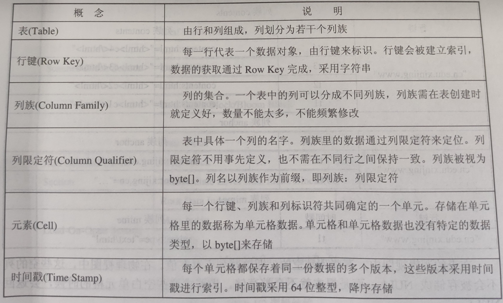

###### 物理模型

HBase是按照列存储的稀疏行/列矩阵，其物理模型实际上就是把逻辑模型中的一个行进行分割，并按照列族存储。HBase会按照列族分别存储，属于同一个列族的数据保存在一起。同时，和每个列族一起存放的还包括行键和时间戳。

在表的逻辑视图中，有些列是空的，即这些列不存在值。在物理视图中，这些空的列不会被存储成NULL，而是根本就不会被存储。当请求这些空白单元格的时候，会返回NULL。

HBase中所有数据文件都存储在HDFS文件系统上，主要包括HFile和HLog两种文件类型。

###### 元数据表

HBase的大部分操作都是在HRegionServer中完成，客户端想要插入、删除和查询数据都需要先找到对应的HRegionServer。客户端需要通过两个元数据表来找到HRegionServer和HRegion之间的对应关系，即-ROOT-和.META。它们是HBase的两张系统表，用于管理普通数据，其存储和操作方式与普通表相似，差别在于它们存储的是Region的分布情况和每个Region的详细信息，而不是普通数据。

HBase使用类似B+树的三层结构来保存Region位置信息。

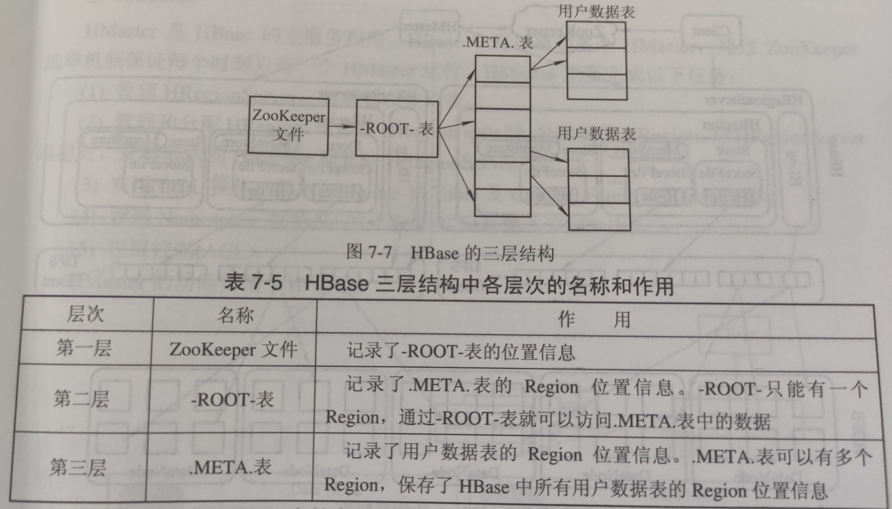

#### 2、简述HBase的体系架构

HBase采用Master/Slave架构，HBase集群成员包括Client、ZooKeeper集群、HMaster节点、HRegionServer节点。在底层，HBase将数据存储于HDFS中。

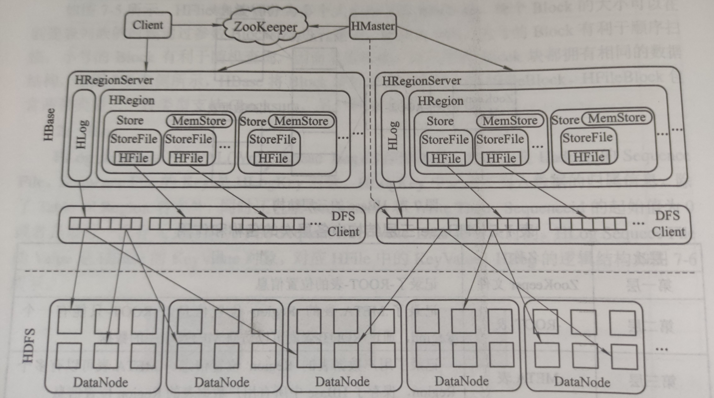

###### （1）Client

HBase Client使用HBase的RPC机制与HMaster和HRegionServer进行通信。对于管理类操作，Client与HMaster进行RPC；对于数据读/写操作，Client与HRegionServer进行RPC。客户端包含访问HBase的接口，通常维护一些缓存来加快HBase数据的访问速度。

###### （2）ZooKeeper

ZooKeeper作为管理者，保证任何时候集群中只有一个Master。对于HBase，ZooKeeper提供以下基本功能：

- 存储-ROOT-表、HMaster和HRegionServer的地址。
- 通过ZooKeeper，HMaster可以随时感知到各个HRegionServer的健康状态。
- ZooKeeper避免HMaster单点故障问题。HBase中可以启动多个Master，通过ZooKeeper的选举机制确保只有一个为当前HBase集群的Master。

###### （3）HMaster

HMaster是HBase的主服务程序。HBase中可以启动多个HMaster，通过ZooKeeper选举机制保证每个时刻只有一个HMaster运行。HMaster主要完成以下任务：

- 管理HRegionServer，实现其负载均衡。
- 管理和分配HRegion。
- 实现DDL操作，即NameSpace和Table及Column Family的增删改等。
- 管理NameSpace和Table的元数据（实际存储在HDFS上）。
- 权限控制（ACL）。

###### （4）HRegionServer

HRegionServer是HBase的从服务程序。HBase集群中可以有多个HRegionServer，其主要功能主要包括以下几个方面：

- 存放和管理本地HRegion。
- 读/写HDFS，管理Table中的数据。
- Client直接通过HRegionServer读/写数据（从HMaster中获取元数据，找到RowKey所在的HRegion/HRegionServer后）进行数据读写。
- HRegionServer和DataNode一般会放在相同的Server上，以实现数据的本地化。

------

## 第八章 数据仓库Hive

#### 1、简述Hive和传统关系数据库的区别和联系

Hive由Facebook公司开源，主要用于解决海量结构化日志数据的离线分析。Hive是一个基于Hadoop的数据仓库工具，可以将结构化的数据文件映射为一张表，并提供了类SQL查询语言HiveQL。Hive本质是将HiveQL语句转换成MapReduce程序，并提交到Hadoop集群上运行。Hive可让不熟悉MapReduce的开发人员直接编写SQL语句来实现对大规模数据的统计分析操作，大大降低了学习门槛，同时也提升了开发效率。Hive处理的数据存储在HDFS上，分析数据底层的实现是MapReduce，程序运行在YARN上。

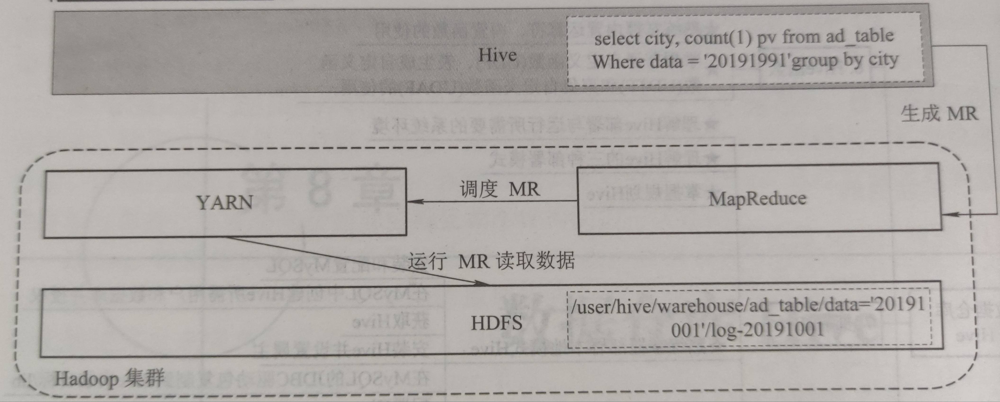

与传统数据库相比，从内部实现原理和HiveQL语言的运行机制来看，Hive具有如下特征：

###### （1）查询语言与SQL接近

由于SQL被广泛应用在数据仓库中，因此研究人员专门针对Hive的特性设计了类SQL的查询语言HiveQL，熟悉SQL开发的开发者可以很方便地使用Hive进行开发。Hive对查询语句的解释、优化、生成查询计划是由Hive引擎完成的。

###### （2）并行执行

Hive中大多数查询的执行是通用Hadoop提供的MapReduce来实现的，查询计划被转化为MapReduce任务，在Hadoop中执行（注意：有些查询没有MR任务，如select * from table）。而传统数据库通常由自己的执行引擎。

###### （3）使用HDFS存储

Hive是建立在Hadoop之上的，所有Hive数据都存储在HDFS中。而数据库则可以将数据保存在块设备或者本地文件系统中。Hadoop和Hive都采用UTF-9编码。

###### （4）支持多种数据格式

Hive中没有定义专门的数据格式，数据格式可以由用户指定。用户定义数据格式需要指定三个属性，即列分隔符（通常为空格、“\t”、“\x001”）、行分隔符（“\n”）以及读取文件数据的方法（Hive默认的文件格式包括TextFile、SequenceFile、RCFile等）。由于在加载数据的过程中，不需要从用户数据格式到Hive定义的数据格式的转换，因此，Hive在加载的过程中不会对数据本身进行任何修改，只是将数据内容复制或者移动到相应的HDFS目录中。而在数据库中，不同的数据库有不同的存储引擎，定义了自己的数据格式。所有数据都会按照一定的组织存储，因此，数据库加载数据的过程会比较耗时。

###### （5）不支持数据更新

由于Hive是针对数据仓库应用设计的，因此，Hive中不支持对数据的修改和添加，所有的数据都是在加载时确定好的。而数据库中的数据通常是需要反复进行修改的，因此可以使用INSERT INTO…VALUES添加数据，使用UPDATES…SET修改数据。

###### （6）不支持索引

Hive要访问数据中满足条件的特定值时，需要暴力扫描整个数据，因此访问延迟较高。由于MapReduce的引入，Hive可以并行访问数据，因此即使没有索引，对于大数据量的访问，Hive仍然可以体现出优势。在数据库中，通常会针对一个或者几个列建立索引，因此对于少量特定条件的数据的访问，数据库可以有很高的效率和较低的延迟。

###### （7）执行延迟高

Hive在查询数据的时候，由于没有索引，需要扫描整个表，因此延迟较高，另一个导致Hive执行延迟高的因素时MapReduce框架。由于MapReduce本身具有较高的延迟，因此在利用MapReduce执行Hive查询时，也会有较高的延迟。相对来说，数据库的执行延迟较低。当然，这个低是有条件的，即数据规模较小。当数据规模大到超过数据库处理能力的时候，Hive的并行计算优势就能够显现出来了。由于数据的访问延迟较高，决定了Hive不适合在线数据查询。

###### （8）可扩展性高

由于Hive是建立在Hadoop之上的，因此Hive的可扩展性和Hadoop的可扩展性是一致的。而数据库由于ACID语义的严格限制，扩展性非常有限。

###### （9）数据规模大

由于Hive建立在集群上并可以利用MapReduce进行并行计算，因此可以支持很大规模的数据。对应的，数据库可以支持的数据规模较小。

#### 2、试述Hive的体系架构以及各组件的功能

Hive通过给用户提供一系列交互接口，接收到用户提交的Hive脚本后，使用自身的驱动器Driver，结合元数据Metastore，将这些脚本翻译成MapReduce，并提交到Hadoop集群中执行，最后将执行结果输出到用户交互接口。

Hive的体系架构中主要包括如下组件：CLI、JDBC/ODBC、Thrift Server、HWI、Metastore和Driver，这些组件可以分为客户端组件和服务端组件两类。另外，Hive还需要Hadoop的支持，它使用HDFS就行存储，使用MapReduce进行计算。

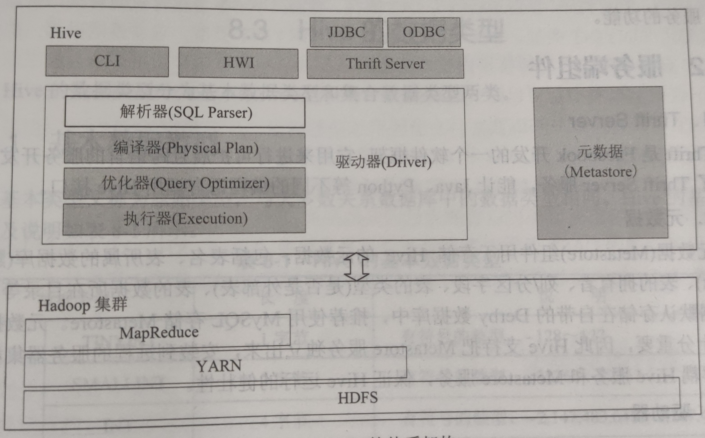

##### 客户端组件

###### （1）CLI【Command Line Interface】

CLI是Hive命令行接口，是最常用的一种用户接口。CLI启动会同时启动一个Hive副本。CLI是和Hive交互的最简单也是最常用的方式，只需要在一个具备完整Hive环境下的Shell终端中键入hive即可启动服务。不过Hive CLI不适应于高并发的生产环境，仅仅是Hive管理员的好工具。

###### （2）JDBC/ODBC

JDBC是Java DataBase Connection规范，它定义了一系列Java访问各类数据库的访问接口，因此Hive-JDBC其实本质上扮演了一个协议转换的角色，把JDBC标准协议转换为访问Hive Server服务的协议。Hive-JDBC除了扮演网络协议转化的工作，并不承担其他工作，比如SQL的合法性校验和解析等。ODBC是一组对数据库访问的标准API，它的底层实现源码是采用C/C++编写的。JDBC/ODBC都是通过Hive Client与Hive Server保持通信的，借助Thrift RPC协议来实现交互。

###### （3）HWI【Hive Web Interface】

HWI是Hive的Web访问接口，提供了一种可以通过浏览器来访问Hive服务的功能。

##### 服务端组件

###### （1）Thrift Server

Thrift是Facebook开发的一个软件框架，它用来进行可扩展且跨语言的服务开发，Hive集成了Thrift Server服务，能让Java、Python等不同的编程语言调用Hive接口。

###### （2）元数据【Metastore】

元数据组件用于存储Hive的元数据，包括表名、表所属的数据库（默认是default）、表的拥有者、列/分区字段、表的类型（是否是外部表）、表的数据所在目录等。Hive元数据默认存储在自带的Derby数据库中，推荐使用MySQL存储Metastore。元数据对于Hive十分重要，因此Hive支持把Metastore服务独立出来，安装到远程的服务器集群里，从而解耦Hive服务和Metastore服务，保证Hive运行的健壮性。

###### （3）驱动器【Driver】

驱动器组建的作用是将用户编写的HiveQL语句进行解析、编译、优化，生成执行计划，然后调用底层的MapReduce计算框架。

------

## 总结

写完这篇文档才发现：写的太多了，太详细了。。。足足1w6的字数，也不知道我这敲下来是个什么感受（可能是新键盘到了，还在体验ing）。

如果你已经能够独立自主的把前言中提到的环境都安装好，并且能够基本使用，那么这篇文档你All In基本上能加深你对Hadoop的基本理解，了解一些你在配环境时背后的意义；但如果你只是为了考试不挂科的话，（额，一般情况下老师也不会挂的）那么你至少要保证h6格式的标题的内容你都能背下来。

图片纯纯是给会配环境的人看的，而且在敲这篇文档的时候，我一直在反思：Hadoop3.x和Hadoop2.x的区别会不会很大，但是还好，我在敲完后去看了几篇讲解Hadoop3.x新特性的博客后，发现和书本上的内容并不冲突。感兴趣的可以参考如下博客：

[(269条消息) hadoop 3.0新特性简单介绍_普通网友的博客-CSDN博客_hadoop3.0新特性](https://blog.csdn.net/web18296061989/article/details/124264120)

大体是在细节方面有了一些优化，但是对于上面敲的，都是鸡蛋里挑骨头了，所以放心看没毛病。不过在配置环境时我才用的已经是CentOS Stream 9、Hadoop3.3.4、JDK11了，技术的迭代肯定会造成许多问题，在配置的时候也遇到了不少的问题，很多地方和书本上也是大相径庭。如果你遇到了问题，可以第一时间——查CSDN，就别Q我了！！尚硅谷的视频是完全按照3.x的特性来讲的，如果你想认真学的话，把那个看完是个不错的选择，但是跟着别人来有时候并不能显著提升自己的水平，我的评价是：可以多去帮别人装装环境。书本上的虽然是2.x的环境，但是安装流程同样使用（大部分情况下）。

最后，这门课有用吧？真没用！没用吧？或许有用。感兴趣的各位可以学着玩玩，个人建议还是把精力放在同期的分布式上面。

——Alexie·Z·Yevich