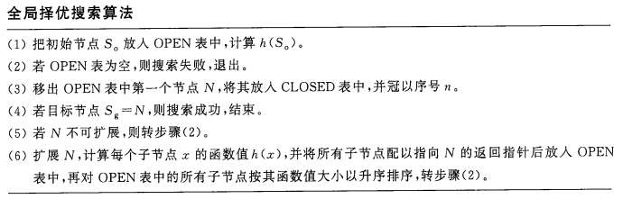
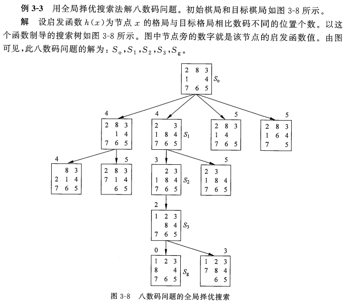
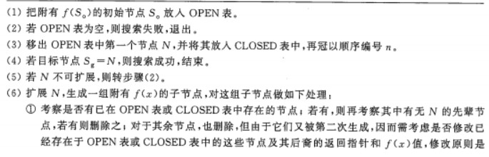
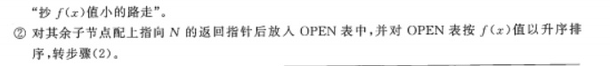
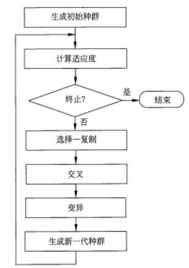
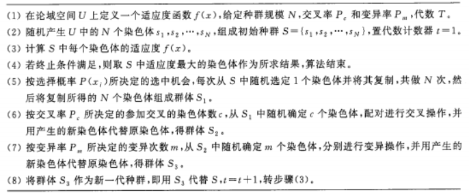
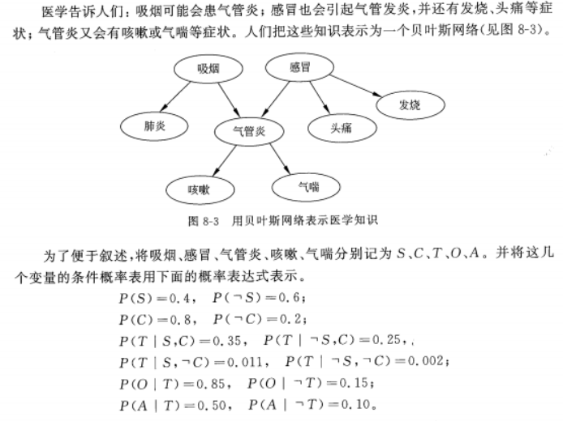
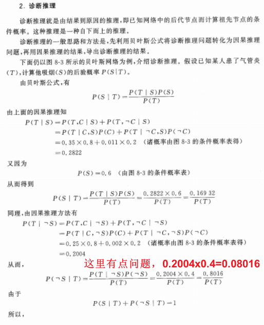
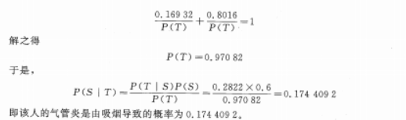
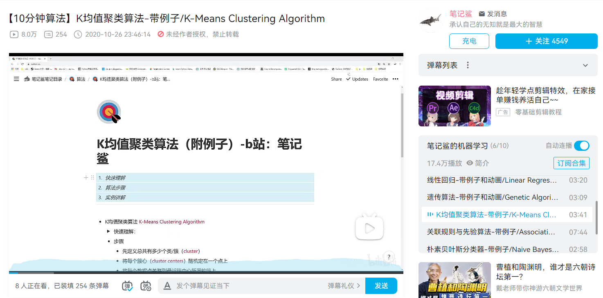

# 人工智能导论

> **前言：**
>
> 文档完善于考试之后，考试之前天真的认为东西没有多少，所以文档只做了我觉得重点的一小部分，但是考试的时候被噗噗噗打脸了：大题全在我的掌握之中，但是30分选择题真的一个不会，所以在放假初决定还是把这个文档完善一下。但是写到一半发现如果真的全写完实在是太多了，很多东西需要手敲太花时间了，如果不想敲直接贴图又太没有诚意了，所以只完善前五章的内容。之后的内容会在附录中附上页码供大家自行学习参考。——By Alexie-Z-Yevich 2022.7.1

## 第一章 概述与工具

#### 1、什么是人工智能？人工智能得研究意义、目标和策略是什么？

- 概念

  人工智能就是人造智能。具体来讲，目前“人工智能”一词是指用计算机模拟或实现的智能。因此，人工智能又称机器智能。

- 研究目标

  研究目标是制造智能机器和智能系统，实现智能化社会，使计算机不仅具有脑智能和群智能，还要具有看、听、说、写等感知、理解和交流能力。要使计算机具有自主发现规律、解决问题和发明创造的能力，从而大大扩展和延伸人的智能，实现人类社会的全面智能化。

- 研究策略

  先部分地或某种程度地实现机器的智能，并运用智能技术解决各种实际问题特别是工程问题，从而使现有的计算机更灵活、更好用和更有用，成为人类的智能化信息处理工具，进而逐步扩展和延伸人的智能，实现智能化。

------

#### 2、人工智能有哪些研究途径和方法？他们的关系如何？

- 研究途径和方法
  基于脑智能的符号智能和基于群智能的计算智能是人工智能的两种研究途径与方法，但仍可细分：
  - 心理模拟，符号推演：从人脑的宏观心理层面入手，以智能行为的心理模型为依据，将问题或知识表示成某种逻辑网络，采用符号推演的方法，模拟人脑的逻辑思维过程，实现人工智能。
  - 生物模拟，神经计算：从人脑的生理层面，即微观结构和工作机理入手，以智能行为的生理模型为依据，采用数值计算的方法，模拟脑神经网络工作的过程，实现人工智能。人工神经网络作为信息和知识的载体，用称为神经计算的数值计算方法来实现网络的学习、记忆、联想、识别和推理等功能。
  - 行为模拟，控制进化：模拟人和动物在与环境的交互、控制过程中的智能活动和行为特性，如反应、适应、学习、寻优等，来研究和实现人工智能。
  - 群体模拟，仿生计算：模拟生物群落的群体智能行为，从而实现人工智能。
  - 博采广鉴，自然计算：模拟自然智能。
  - 着眼数据，统计建模：着眼于事务或问题的外部表现和关系，收集、采集、整理相关信息并做成样本数据，然后基于样本数据用统计学、概率论和其他数学理论和方法建立数学模型，并采用适当的算法和策略进行计算，以期从事务外在表现的样本数据中推测事物的内在模式或规律，并用之于解决相关实际问题。

- 关系

  并不能互相取代，而是并存和互补的关系。

------

#### 3、人工智能有哪些研究内容？（考试简答5分）

研究内容归纳为：搜索与求解、知识与推理、学习和发现、发明和创造、感知与相应、理解与交流、记忆与联想、竞争与协作、

系统与建造、应用与工程等十个方面。（具体内容书P8-P11）

------

#### 4、人工智能有哪些分支领域和研究方向？

从研究内容上看，人工智能可分为搜索与求解、知识与推理、学习和发现等十大分支领域（它们构成了人工智能学科的总体方向）。

从研究途径和智能层次来看，人工智能可分为符号智能、计算智能、统计智能和交互智能等四大分支领域。

------

#### 5、人工智能有哪些应用领域或课题？

- 难题求解
- 自动规划、调度与配置
- 机器博弈
- 机器翻译与机器写作
- 机器定理证明
- 自动程序设计
- 智能控制
- 智能管理
- 智能决策
- 智能通信
- 智能预测
- 智能仿真
- 智能设计与制造
- 智能车辆与智能交通
- 智能诊断与治疗
- 智能生物信息处理
- 智能教育
- 智能人-机接口
- 模式识别
- 智能机器人
- 数据挖掘与知识发现
- 计算机辅助创新
- 计算机文艺创作

------

#### 6、简述人工智能的发展概况

- 孕育与诞生

  正式诞生于1956年。

- 符号主义先声夺人

  1956年，逻辑理论机的计算机程序系统，模拟了人用数理逻辑证明定理时的思维逻辑规律；研制成功具有自学习、自组织、自适应能力的跳棋程序；

  1959年，证明平面几何问题的程序；模式识别程序；

  1960年，通用问题求解程序；面向人工智能程序设计的表处理语言LISP；

  1965年，可以分辨积木构造的程序；消解原理；基于领域知识和专家知识的名为DENDRL的程序系统（专家系统）

- 连接主义不畏坎坷

  1943年，形式神经元的数学模型（MP模型）；

  1944年，改变神经元连接强度的Hebb规则；

  1957年，称为感知器的单层神经网络；

  1962年，自适应线性元件；

  1985年，开发了名为NETtalk英语读音学习用的神经网络处理器；

  1987年6月，第一届国际神经网络会议召开。

- 计算智能异军突起

  1962年，进化程序设计（进化规划的概念和方法）；

  1964年，进化策略的搜索算法；

  1967年，遗传算法的初步思想；

  1975年，遗传算法的理论基础；

  1980年，实现基于遗传算法的机器学习系统——分类器系统；

  1994年，首届计算智能大会。

- 统计智能默默奉献
- 智能主体一统江湖，Agent&Robot
- 知识工程东山再起，机器学习领衔高歌
- 现状与趋势
  - 多种方法齐头并进，多种方法协作互补
  - 新思想、新技术不断涌现，新领域、新方向不断开拓
  - 理论研究更加深入，应用研究愈发广泛
  - 企业公司进军AI，协作竞争你追我赶
  - 研究队伍日益壮大，AI教育蔚然成风
  - 各类活动空前活跃，社会影响与日俱增

------

## 第三章 图搜索于问题求解

下文所提到的OPEN表和CLOSE表样式：

- OPEN表

| 节点 | 父节点编号 |
| :--: | :--------: |
|      |            |
|      |            |

- CLOSE表

| 编号 | 节点 | 父节点编号 |
| :--: | :--: | :--------: |
|      |      |            |
|      |      |            |

#### 1、状态图搜索

###### （1）树式搜索算法

【1】把初始节点S0放入OPEN表中。

【2】若OPEN表为空，则搜索失败，退出。

【3】移出OPEN表中的第一个节点N放入CLOSE表中，并冠以顺序序号n。

【4】若目标节点Sg = N，则搜索成功，结束。

【5】若N不可扩展，则转【2】。

【6】扩展N，生成一组子节点，对这组子节点做如下处理：

- 删除N的先辈节点（如果有的话）。
- 对已存在OPEN表的节点（如果有的话）也删除之；但删除之前要比较其返回初始节点的新路径与原路径，如果新路径”短“，则修改这些节点在OPEN表中的原返回指针，使其沿新路径返回。
- 对已存在于CLOSE表中的节点（如果有的话）做与上面一样的处理，并且再将其移出CLOSE表，放入OPEN表重新扩展（为了重新计算代价）。
- 对其余子节点配上指向N的返回指针后放入OPEN表中某处，或对OPEN表进行重新排序，转【2】.

**说明：**

【1】这里的返回指针也就是父节点在CLOSE表中的编号。

【2】步骤【6】中修改返回指针的原因是，这些节点又被二次生成，所以他们返回初始路径的节点已有两条，但这两条路径的”长度“可能不同。当新路径短时就会走新路径。

【3】这里路径的长短是按路径上的节点数来衡量的,后面将会看到路径的长短也可以按其“代价”(如距离﹑费用,时间等)衡量。若按其代价衡量,则在需修改返回指针的同时修改相应的代价值,或者不修改返回指针但要修改代价值(为了实现代价小者优先扩展)。

###### （2）不回溯的线式搜索

【1】把初始节点S0。放入CLOSED表中。

【2】令N=S0。

【3】若N是目标节点,则搜索成功,结束。

【4】若N不可扩展,则搜索失败,退出。

【5】扩展N,选取其一个未在CLOSED表中出现过的子节点N1放入CLOSED表中,令N=N1，转步骤【3】。

###### （3）可回溯的线式搜索

【1】把初始节点S0。放入CLOSED表中。

【2】令N=S0。

【3】若N是目标节点,则搜索成功,结束。

【4】若N不可扩展,则移出CLOSED表的末端节点Ne,若Ne=S0,则搜索失败,退出。否则,以CLOSED表新的末端节点N。作为N,即令N=Ne。,转步骤(3)。

【5】扩展N,选取其一个未在CLOSED表中出现过的子节点N,,放人CLOSED 表中,令N=N1，转步骤【3】。

###### （4）广度优先搜索算法

【1】把初始节点S0放入OPEN表中。

【2】若OPEN表为空，则搜索失败，退出。

【3】移出OPEN表中的第一个节点N放入CLOSE表中，并冠以顺序序号n。

【4】若目标节点Sg = N，则搜索成功，结束。

【5】若N不可扩展，则转【2】。

【6】扩展N，将其所有的子节点配上指向N的指针依次放入OPEN表尾部，转步骤【2】。

###### （5）深度优先搜索

【1】把初始节点S0放入OPEN表中。

【2】若OPEN表为空，则搜索失败，退出。

【3】移出OPEN表中的第一个节点N放入CLOSE表中，并冠以顺序序号n。

【4】若目标节点Sg = N，则搜索成功，结束。

【5】若N不可扩展，则转【2】。

【6】扩展N，将其所有的子节点配上指向N的返回指针依次放入OPEN表的首部，转步骤【2】。

###### （6）有界深度优先搜索

【1】把初始节点S0放入OPEN表中，置S0的深度d（S0）=0。

【2】若OPEN表为空，则搜索失败，退出。

【3】移出OPEN表中的第一个节点N放入CLOSE表中，并冠以顺序序号n。

【4】若目标节点Sg = N，则搜索成功，结束。

【5】若N的深度d（N）= dm（深度限制值），或者N无子节点，则转【2】。

【6】扩展N，将其所有的子节点配上指向N的返回指针依次放入OPEN表中前部，置d（Ni） = d（N）+ 1，转步骤【2】。

------

#### 2、启发式搜索

###### （1）全局择优搜索（考试大题10分）

###### （2）A算法

------

## 第四章 基于遗传算法的随即优化搜索

#### 1、基本遗传算法

###### （1）流程图

###### （2）具体描述

###### （3）具体实例

详情见书P90-P93例题4-1、4-2，要求理解两个例题的具体步骤，实操要求在老师上机课时基本了解数据集内容以及调用库作用。

------

## 第五章 基于一阶谓词的机器推理

基于一阶谓词的机器推理也称自动推理，它是早期人工智能的主要研究内容之一。一阶谓词是一种表达力很强的形式语言，而且这种语言很适合数字计算机处理，因而称为知识表示的首选。

简单的知识介绍还请各位参照书本，这里不做过多讲解。

#### 1、常用逻辑等价式

$$
\begin{align}
(1) &\neg \neg P \Leftrightarrow P 【双重否定律】 \\
(2) &P \land Q \Leftrightarrow Q \land P \\
&P \lor Q \Leftrightarrow Q \lor P 【交换律】\\
(3) & P \land (Q \lor R) \Leftrightarrow (P \land Q) \lor (P \land R) \\
& P \lor (Q \land R) \Leftrightarrow (P \lor Q) \land (P \lor R) 【分配律】\\
(4) & \neg (P \land Q) \Leftrightarrow \neg P \lor \neg Q \\
& \neg (P \lor Q) \Leftrightarrow \neg P \land \neg Q 【摩根律】\\
(5) & P \longrightarrow Q \Leftrightarrow \neg P \lor Q 【蕴含表达式】\\
(6) & P \longrightarrow Q \Leftrightarrow \neg Q \longrightarrow \neg P 【逆否式】\\
(7) & \forall x (A(x) \land B(x)) \Leftrightarrow \forall x A(x) \land \forall x B(x) \\
& \exists x (A(x) \lor B(x)) \Leftrightarrow \exists x A(x) \lor \exists x B(x) 【量词分配律】\\
(8) & \neg \forall xA(x) \Leftrightarrow \exists x \neg A(x) \\
& \neg \exists xA(x) \Leftrightarrow \forall x \neg A(x) 【量词转换律】\\
\end{align}
$$

具体的使用参见书上例题5-5~5-7（**一定要看**）

------

#### 2、归结演绎推理

###### 1、子句与子句集

原子谓词公式及其否定称为文字，若干个文字的一个析取式称为一个子句，由r个文字组成的子句叫r-文字子句，l-文字子句叫单元子句，不含任何文字的子句称为空子句，记为□或NIL。

对一个谓词公式G，通过一下步骤得到的子句集和S称为G的子句集：

【1】消去蕴含式→和等值词↔。**（去箭头）**

【2】缩小否定词的作用范围，直到其仅作用于原子公式。**（消括号&将┐放在存在量词和全称量词里面）**

【3】适当改名，使量词间不含同名指导变元和约束变元。
【4】消去存在量词。

【5】消去所有全称量词。

【6】化公式为合取范式。

【7】适当改名，使子句间无同名变元。

【8】消去合取词∧，以子句为元素组成一个集合S。

###### 2、归结原理

归结演绎推理是基于一种称为归结原理（也称为消解原理）的推理规则的推理方法。它是谓词逻辑中一个相当有效的机械化推理方法。归结原理的出现，被认为是自动推理，特别是定理机器证明领域的重大突破。

## 附录

#### 大题部分（考试前参考）

###### 1、遗传算法（参照P90例4-1）（考试大题10分）

- 适应度计算（根据公式）
- 选择-复制（根据概率）、交叉（交换部分）、变异（变化部分）

###### 2、一阶谓词推理（考试大题20分）

详见第五章部分内容，例题可以参考课后习题。

- 将句子用一阶谓词表示；
- 求解谓词公式的子句集；
- 利用归结原理证明。

###### 3、产生式规则

简单概率问题，能看懂图会画就行。

###### 4、决策树（P210）（考试大题15分）

- 信息熵和条件熵公式

###### 5、K-均值聚类算法（P261-P268）（考试大题5分）

#### 未补全章节

##### 第七章 几种结构化知识表示及其推理

###### 1、元组的概念（P143）

###### 2、框架的概念（P144）

------

##### 第八章 不确定和不确定性知识的表示与推理

######　基于贝叶斯网络的概率推理（P172-P176）

重点在于P175的诊断推理中的计算：（考试原题）

------

##### 第九章 机器学习：符号学习与交互学习

###### 决策树学习（P205-P212）

重点在于P210决策树的ID3算法，需要了解整个流程，能够独立写出P211的所有内容并得出最终结论。

------

##### 第十二章 数据挖掘与知识发现

###### k-均值聚类算法（P261关联规则开始到P268）

重点不在书本上，建议自学的话直接在B站上搜索k-均值聚类算法。推荐一个我当时学习的视频：

https://www.bilibili.com/video/BV1py4y1r7DN?spm_id_from=333.337.search-card.all.click&vd_source=a81ef8427e696b92de364d833142bd10

笔记鲨UP主的这一系列非常适合算法类（单指人工智能导论中常用的几个）的入门，有时间的话可以都看一下，讲的比较简单也十分容易懂，完成考试内容是完全没有问题的。

k-均值聚类算法主要还是了解一下算法的具体流程以及簇心的更新、选择流程，考试中占的分值并不大。

------

##### 第十六章 专家（知识）系统

这里我的建议是都看，选择题至少出了三个专家系统，包括专家系统的概念结构、黑板模型等一系列问题，因为我只是粗略的看了下所以考试时选择题基本都不会，全靠大题拉分。所以我的建议是All In。专家系统也是很多学科都会介绍的内容，这里多看点，深入了解绝对不亏的啦！